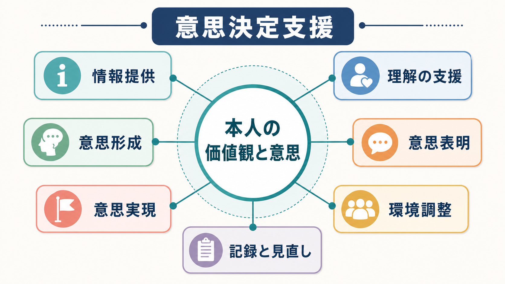
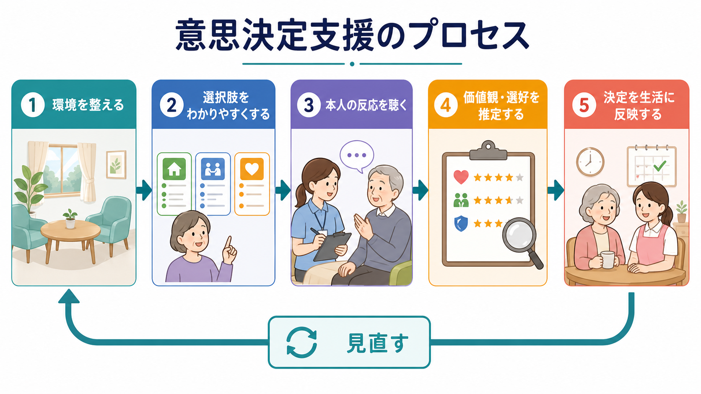
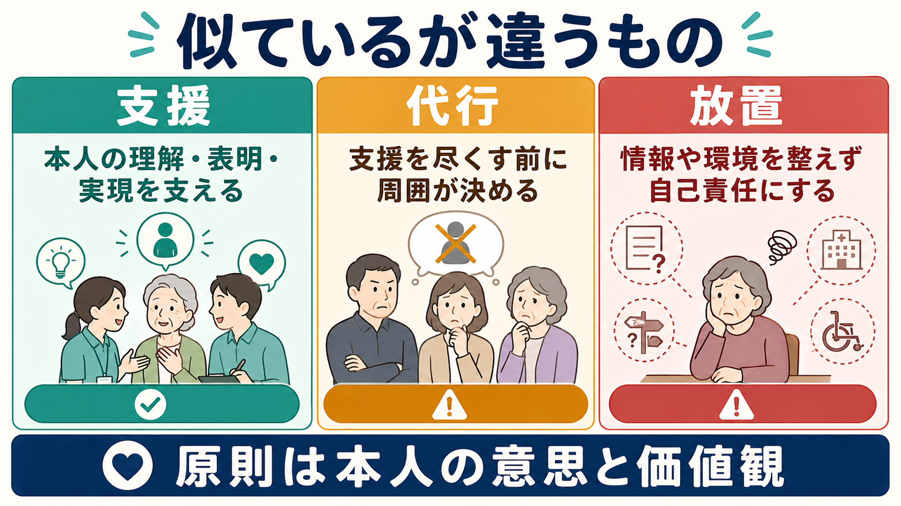

# 意思決定支援とは何か

## 要点

- 意思決定支援とは、本人が自分の価値観・選好・生活史に沿って選択できるように、情報、環境、コミュニケーション、チーム支援を整える実践である。
- 目的は「周囲が代わりに正解を選ぶこと」ではなく、本人の意思形成、意思表明、意思実現を支えることである[1][2]。
- 本人の判断能力は固定的な属性ではなく、説明方法、時間、場所、信頼関係、疲労、症状、支援者の態度によって変わりうる。
- 医療では共同意思決定、福祉では生活場面の選択支援、成年後見では本人の価値観・選好に基づく支援、人生の最終段階ではACPと繰り返しの話し合いに接続する[4][5][6]。
- 支援を尽くしても意思や選好の推定が困難な場合に限り、最後の手段として本人の最善の利益に基づく代行決定を検討する[1][4]。

## この記事で答える問い

1. 意思決定支援は、自己決定や同意取得と何が違うのか。
2. 支援者は、本人の意思をどのように形成・表明・実現できるようにするのか。
3. 医療、精神科、認知症ケア、障害福祉、成年後見、地域支援では何が共通しているのか。
4. 「本人のため」という名目で、実際には代行決定や放置にならないために何を見るべきか。

## まず結論

意思決定支援は、本人を「判断できる人／できない人」に早く分類する技術ではない。むしろ、本人が判断しやすい条件を整え、本人の言葉・表情・行動・過去の生活史・大切にしてきた価値を手がかりに、本人の意思が生活や医療方針に反映されるようにする実践である。

障害福祉サービス等のガイドラインは、意思決定支援を、本人が自分の意思を反映した生活を送れるように、可能な限り本人自身の意思決定を支援し、意思確認や意思・選好の推定を行い、それでも困難な場合に最後の手段として最善の利益を検討する支援行為と仕組みとして整理している[1]。認知症の人に関するガイドラインも、本人の意思に基づく日常生活・社会生活を目指し、意思形成支援、意思表明支援、意思実現支援を重視する[2]。

## 背景

医療や福祉の現場では、治療を受けるか、どこで暮らすか、誰と暮らすか、どのサービスを使うか、財産をどう扱うか、人生の最終段階にどのような医療・ケアを望むか、といった選択が繰り返し現れる。これらは医学的合理性だけで決まるものではなく、本人が何を大切にしてきたか、どのような生活を望むか、どの程度のリスクを受け入れるかに深く関わる。

一方で、認知症、知的障害、精神症状、せん妄、重い身体疾患、言語障害、疲労、孤立、情報格差などがあると、本人の意思が見えにくくなる。ここで支援者がすぐに「本人には決められない」と判断すると、本人の選択の機会を奪いやすい。逆に「本人がそう言ったから」とだけ扱い、必要な情報提供や環境調整をしなければ、自己決定の名を借りた放置になりうる。

国連障害者権利条約の第12条に関する一般的意見は、障害のある人の法的能力を平等に認め、代理的意思決定から支援付き意思決定への転換を強調した[3]。日本でも、障害福祉、認知症、成年後見、人生の最終段階の医療・ケア、身寄りがない人の医療などで、本人を決定の主体に置くガイドラインが整備されてきた[1][2][4][5][8]。

精神科では、[[MSEで認知機能をどう評価するか]]、[[MSEで病識と判断力をどう評価するか]]、[[せん妄とは何か]]、[[BPSDとは何か]]、[[インフォームドコンセントは精神科でどう行うのか]]と接続する。判断能力や病識を評価するだけでなく、どの条件なら本人が理解し、比較し、表明できるのかを考える必要がある。

## 基本概念

### 自己決定

自己決定は、本人が自分の生活や身体に関する選択を行う権利である。ただし、自己決定は「一人で決めること」と同義ではない。多くの人は、家族、友人、専門職、経験者の話を聞き、迷いながら選択する。支援を受けて決めることも、本人の自己決定でありうる。

### 意思形成支援

意思形成支援とは、本人が選択肢を理解し、自分にとって何が重要かを考えられるようにする支援である。難しい専門用語を避ける、選択肢を少数に分ける、絵や表を使う、実際に体験する機会を作る、時間を置いて繰り返す、といった工夫が含まれる[1][2]。

### 意思表明支援

意思表明支援とは、本人が言葉、表情、視線、行動、拒否、沈黙、身体反応などを通して意思を表せるようにする支援である。発語だけを意思表明とみなすと、重度の認知症、失語、発達障害、精神症状、強い不安がある人の意思を見落としやすい。

### 意思実現支援

意思実現支援とは、本人の選択が生活やケアに反映されるように、計画、役割分担、リスク調整、モニタリングを行うことである。本人が「自宅で暮らしたい」と表明しても、支援体制、服薬、見守り、経済面、家族負担、地域資源の調整がなければ、意思は実現されない。

### 代行決定

代行決定は、本人に代わって周囲が決定することである。必要な場面はありうるが、意思決定支援では最後の手段として位置づける。成年後見のガイドラインも、意思決定支援を尽くし、本人の意思・選好の最善の解釈を検討したうえで、それでも困難な場合に最善の利益に基づく代行決定を扱う[4]。

## 仕組み

意思決定支援の実務は、単発の面接ではなく、環境調整と記録を含むプロセスである。

1. **決めるべき事項を具体化する**  
「入院するか」ではなく、「今日から数日間、安全確保と治療調整のために病棟で過ごすか」「自宅支援を増やして通院で続けるか」のように、本人が比較できる単位に分ける。

2. **本人が理解できる形で情報を出す**  
診断名や制度名ではなく、生活上の変化、利益、不利益、負担、不確実性を説明する。NICEの共同意思決定ガイドラインも、リスク、利益、結果を伝え、本人の価値観と選好を含めて話し合うことを推奨している[6]。

3. **意思を表明しやすい環境を作る**  
時間帯、場所、同席者、疲労、疼痛、不安、薬剤、せん妄、騒音、威圧的な雰囲気を調整する。本人が支援者に遠慮している場合、同席者を変えるだけで意思が変わって見えることがある。

4. **価値観・選好を確認する**  
「何を選ぶか」だけでなく、「なぜそれを選ぶのか」「何を避けたいのか」「過去に似た場面で何を大切にしたか」を聞く。本人が明確に語れない場合は、生活史、普段の反応、過去の発言、家族や支援者の情報を照合する。

5. **意思を実現し、見直す**  
決定は一度で固定されない。人生の最終段階の医療・ケアのガイドラインも、本人の意思は心身の状態や時間の経過で変わりうるため、家族等も含めて繰り返し話し合い、記録を共有することを重視している[5]。

## 図解

意思決定支援を実践するときは、「支援」「代行」「放置」を分けて考えると理解しやすい。

| 似ているもの | 何が起きているか | 問題点 | 修正の方向 |
|---|---|---|---|
| 支援 | 本人の理解、表明、実現を支える | 本人主体を保ちやすい | 情報提供、環境調整、記録、見直しを続ける |
| 代行 | 支援を尽くす前に周囲が決める | 「本人のため」が支援者の価値観に置き換わる | まず意思形成・表明支援に戻る |
| 放置 | 必要な情報や支援を出さず、本人に任せる | 自己決定の名で孤立や不利益を放置する | 理解できる説明と実現可能な支援を整える |

## 臨床・研究との接続

### 精神科臨床

精神科では、同意能力、病識、判断力、リスク、保護、強制性が絡みやすい。そのため意思決定支援は、単に「同意書を取る前の説明」ではなく、治療関係そのものの質に関わる。たとえば、服薬、入院、退院、訪問看護、金銭管理、住まい、就労、家族との距離の取り方は、症状の安定だけでなく本人の生活の意味に関わる。

急性期には、精神症状、希死念慮、せん妄、薬物影響、強い不安により、その時点の意思表明が揺れることがある。この場合でも、本人の言葉を無視するのではなく、安全確保と並行して、説明方法、時間、同席者、過去の価値観、事前の意思表明を確認する。[[司法精神医学とは何か]]で扱う責任能力や手続参加能力とは文脈が異なるが、「能力」を固定的にみなさず、場面・課題・支援条件との関係で見る点は共通する。

### 共同意思決定と意思決定支援

医療における共同意思決定は、専門職と本人が、医学的根拠と本人の価値観を照合しながら治療やケアを選ぶプロセスである。NICEは、共同意思決定を日常診療に組み込むため、訓練、意思決定支援ツール、リスク・利益の伝え方、組織文化を整えることを求めている[6]。Cochraneレビューでは、患者向け意思決定支援ツールは知識、リスク認識、価値に沿った選択、意思決定への能動的参加を改善することが示されている[7]。

ただし、意思決定支援は共同意思決定より広い。医療上の治療選択だけでなく、住まい、日課、食事、外出、財産、支援者との関係、地域生活の選択まで含む。認知症や障害福祉のガイドラインが日常生活・社会生活を重視するのはこのためである[1][2]。

### 地域精神医療と制度

地域精神医療では、本人の意思を尊重することと、生活破綻・自傷他害・虐待・搾取・医療中断などのリスクを扱うことが同時に求められる。意思決定支援は、リスクを無視する実践ではない。むしろ、本人の価値観を前提に、リスクをどこまで受け入れ、どこから環境調整や危機対応を入れるかを具体化するための方法である。

身寄りがない人の医療に関するガイドラインは、身元保証人がいないことを理由に必要な医療が提供されない問題を背景に、本人の判断能力や成年後見制度の利用状況に応じて、医療機関がどのように支援するかを整理している[8]。これは、意思決定支援が家族の有無だけに依存しない仕組みとして必要であることを示している。

## よくある誤解

### 誤解1：本人が一度言ったことが、いつでも最終意思である

本人の意思は尊重されるべきだが、意思は時間、症状、説明、経験で変化する。特に重大な選択では、一度の発言だけで固定せず、理解、比較、表明、実現可能性を確認する。

### 誤解2：本人に判断能力が低いなら、意思決定支援は不要である

判断能力が低いと見えるときほど、意思決定支援が必要になる。説明を短くする、体験を使う、支援者を変える、休憩を入れる、選択肢を減らすことで、本人が表明できる意思が見えてくる場合がある。

### 誤解3：支援とは、本人の希望をすべて実現することである

支援は、本人の希望を現実の条件に接続する作業である。危険や制約がある場合は、それを隠さず説明し、より制限の少ない選択肢、段階的な試行、代替案、見直しの時点を設ける。

### 誤解4：家族や専門職が本人の利益を考えれば十分である

家族や専門職の意見は重要だが、本人の価値観と一致するとは限らない。支援者の安心、家族の都合、施設の運営、医療者のリスク回避が、本人の意思として語られていないかを点検する必要がある。

### 誤解5：意思決定支援は書類作成である

記録は重要だが、記録だけでは支援にならない。記録すべきなのは、本人が何を表明したかだけでなく、どのような説明をしたか、どの環境で話したか、誰が同席したか、どの価値観を根拠に推定したか、いつ見直すかである。

## 関連ノート

- [[MSEで認知機能をどう評価するか]]
- [[MSEで病識と判断力をどう評価するか]]
- [[インフォームドコンセントは精神科でどう行うのか]]
- [[インフォームドコンセントとは何か]]
- [[せん妄とは何か]]
- [[BPSDとは何か]]
- [[せん妄と認知症はどう違うのか]]
- [[司法精神医学とは何か]]

## 理解チェック

1. 意思決定支援が「代わりに決めること」と異なるのはなぜか。
2. 本人の意思が見えにくいとき、まず環境・説明・同席者・時間を見直すべきなのはなぜか。
3. 「本人がそう言ったから」と「本人の意思を尊重した」は、どのような場合にずれるか。
4. 支援を尽くしても本人の意思や選好を推定できない場合、どのような順序で代行決定を検討すべきか。
5. 精神科の入院・退院支援で、意思決定支援とリスク管理をどう両立できるか。

## 関連ノート候補・MOC更新候補

- 関連ノート候補: 「共同意思決定とは何か」「ACPとは何か」「成年後見制度とは何か」「支援付き意思決定とは何か」「医療同意と代諾は何が違うのか」
- MOC更新候補: `content/00_MOC/` 配下の精神医学、地域精神医療、医療倫理、制度・司法関連MOC。並列生成ジョブとの競合を避けるため、本記事作成時点ではMOC本体を更新しない。

## 未解決問題

- 意思決定支援の質を、本人の満足、価値に沿った選択、生活の安定、権利擁護、リスク低減のどの指標で評価するか。
- 精神科急性期や強制入院の文脈で、本人の意思表明をどこまで支援し、どの時点で安全確保を優先するか。
- 家族、成年後見人、医療者、行政、事業者の意見が対立したとき、本人の価値観を中心に調整する手続をどう標準化するか。
- 認知症や重度精神障害のある人の非言語的表明を、過大解釈せず、かつ過小評価しないための訓練と記録方法をどう整えるか。

## 参考文献

[1] 厚生労働省. (2017). 障害福祉サービスの利用等にあたっての意思決定支援ガイドラインについて. https://www.mhlw.go.jp/web/t_doc?dataId=00tc2677&dataType=1&pageNo=1

[2] 厚生労働省. (2025). 認知症の人の日常生活・社会生活における意思決定支援ガイドライン（第2版）. https://www.mhlw.go.jp/stf/seisakunitsuite/bunya/0000212395.html

[3] United Nations Committee on the Rights of Persons with Disabilities. (2014). General comment No. 1, Article 12: Equal recognition before the law. https://digitallibrary.un.org/record/812024

[4] 意思決定支援ワーキング・グループ. (2020). 意思決定支援を踏まえた後見事務のガイドライン. https://www.courts.go.jp/vc-files/courts/2020/kouken/20201030guideline.pdf

[5] 厚生労働省. (2018). 人生の最終段階における医療・ケアの決定プロセスに関するガイドライン. https://www.mhlw.go.jp/stf/houdou/0000197665.html

[6] National Institute for Health and Care Excellence. (2021). Shared decision making (NICE guideline NG197). https://www.nice.org.uk/guidance/ng197

[7] Stacey, D., Lewis, K. B., Smith, M., et al. (2024). Decision aids for people facing health treatment or screening decisions. *Cochrane Database of Systematic Reviews*, CD001431. https://doi.org/10.1002/14651858.CD001431.pub6

[8] 厚生労働省. (2019). 身寄りがない人の入院及び医療に係る意思決定が困難な人への支援に関するガイドライン及び事例集. https://www.mhlw.go.jp/stf/seisakunitsuite/bunya/kenkou_iryou/iryou/miyorinonaihitohenotaiou.html
