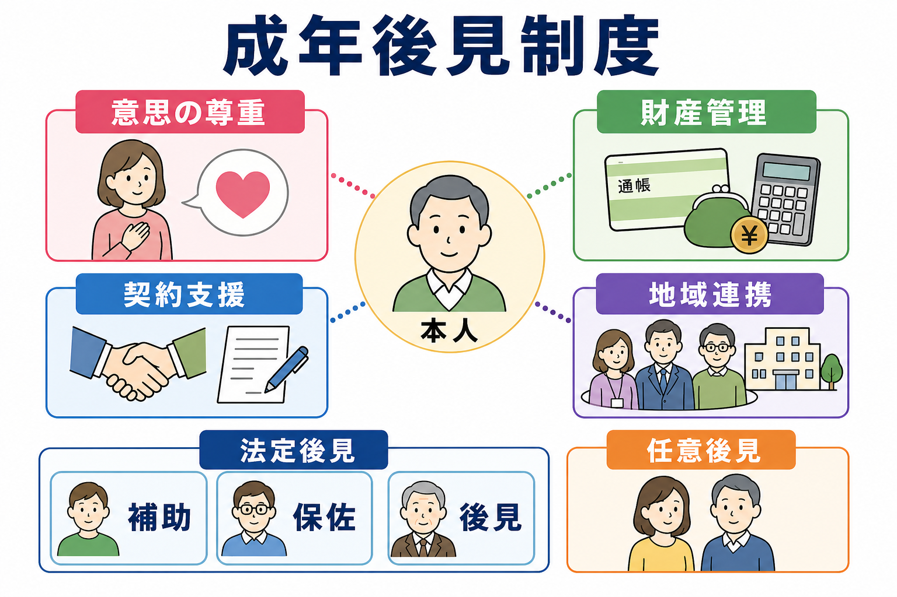
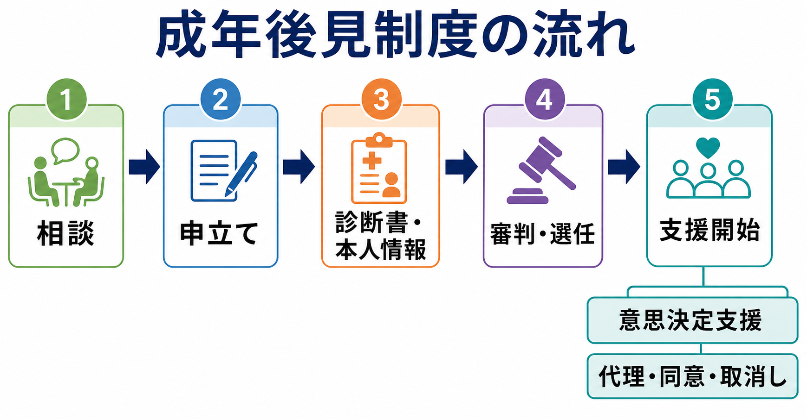
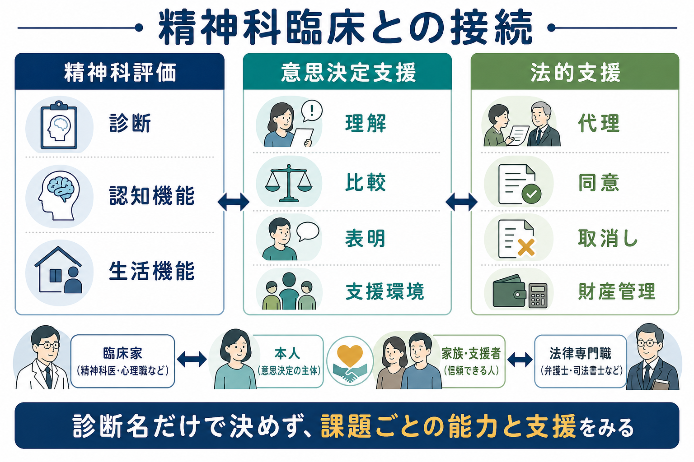

# 成年後見制度とは何か

## 要点

- 成年後見制度は、認知症、知的障害、精神障害などにより判断能力が不十分な人について、財産管理や契約などの法律行為を支援する制度である[1]。
- 大きくは、判断能力が不十分になった後に家庭裁判所が後見人等を選任する「法定後見」と、判断能力が十分なうちに将来の支援者と事務内容を決めておく「任意後見」に分かれる[1][4]。
- 法定後見には、本人の判断能力の程度に応じて「補助」「保佐」「後見」があり、支援の範囲は一律ではない[2][3]。
- 精神科臨床では、診断名だけでなく、本人がどの課題について理解し、比較し、選び、表明できるかを評価し、意思決定支援と法的支援を分けて考える必要がある[5][8]。
- 後見人は本人の代わりに何でも決める人ではない。第二期成年後見制度利用促進基本計画では、尊厳のある本人らしい生活の継続と地域社会への参加が重視されている[6]。

## この記事で答える問い

1. 成年後見制度は、何を支援する制度なのか。
2. 法定後見、任意後見、補助、保佐、後見はどう違うのか。
3. 精神科医療では、診断書、判断能力評価、意思決定支援をどう位置づけるのか。
4. 後見制度について、臨床現場で誤解しやすい点は何か。

## まず結論

成年後見制度は、本人の生活を「奪う」制度ではなく、判断能力が不十分なために財産管理、契約、福祉サービス利用、遺産分割などで不利益を受けやすい場面に、法律上の支援者を置く制度である[1]。ただし、制度の利用は本人の権利制限を伴いうるため、臨床では「診断名があるから後見」ではなく、「どの法律行為について、どの程度の支援が必要か」を具体的に見る。

精神科臨床との接点は、主に三つある。第一に、認知症、統合失調症、双極症、知的発達症、高次脳機能障害などで判断能力が問題になる場面である。第二に、家庭裁判所に提出される診断書や本人情報シートに関連して、症状、認知機能、生活機能、意思決定能力を整理する場面である[5]。第三に、後見制度を使う前後で、本人の意思をどう支え、地域での生活をどう維持するかを多職種で考える場面である[6][7]。

## 背景

判断能力が不十分になると、預貯金の管理、家賃や公共料金の支払い、施設入所契約、介護・障害福祉サービスの契約、相続や遺産分割、不動産管理などで困難が生じる。本人に悪意がなくても、契約内容を十分に理解できないまま不利益な契約を結ぶことがある。法務省は、こうした人を保護し支援する制度として成年後見制度を説明している[1]。

一方で、成年後見制度は「便利な代理制度」ではない。本人の財産や契約に関する権限を第三者が持つため、本人の自己決定、プライバシー、生活の自由に影響しうる。そのため近年は、後見人等が本人の特性に応じた配慮をし、本人の意思決定を支えることが強調されている[6][7]。この視点は、[[共同意思決定とは何か]]や[[意思決定能力とは何か]]で扱う臨床倫理ともつながる。

## 基本概念

### 成年後見制度

成年後見制度は、判断能力が不十分な人について、本人の権利を守る人を選び、法律的に支援する制度である[2]。対象として典型的に想定されるのは、[[認知症とは何か]]、知的障害、精神障害などにより、財産管理や契約の理解・判断・実行が難しくなっている人である[1][2]。

重要なのは、これは精神科診断そのものではなく、法律行為を支える制度だという点である。たとえば同じ診断名でも、少額の日常買い物は問題なくできるが不動産売却は困難な人もいれば、服薬や生活支援を受けることで契約内容を十分に理解できる人もいる。したがって、[[認知機能障害とは何か]]の評価は参考になるが、制度利用の要否は生活上の課題と支援可能性に即して考える。

### 法定後見

法定後見は、本人の判断能力が不十分になった後、家庭裁判所が成年後見人、保佐人、補助人を選任する仕組みである[1][2]。三つの類型は、本人の判断能力の程度と必要な権限の範囲に応じて区別される[3]。

| 類型 | おおまかな対象 | 支援のイメージ |
|---|---|---|
| 補助 | 判断能力が不十分 | 特定の法律行為について、必要な同意・取消し・代理を付与する |
| 保佐 | 判断能力が著しく不十分 | 重要な財産行為について同意権・取消権が中心となり、必要に応じ代理権も付与する |
| 後見 | 判断能力を欠くのが通常の状態 | 広い代理権・取消権により、財産管理や契約を支援する |

この区別は、支援を最小限にするためにも重要である。本人が支援を受けながら意思を表明できるなら、より限定的な制度や地域支援で足りる場合がある。

### 任意後見

任意後見は、本人が判断能力を十分に有している時期に、将来判断能力が不十分になった場合に備え、任意後見人となる人と委任する事務を決めておく制度である[4]。任意後見契約は公正証書で作成され、本人の判断能力が不十分になった後、家庭裁判所が任意後見監督人を選任すると効力が生じる[4]。

精神科臨床では、軽度認知障害、初期認知症、慢性精神疾患の安定期などで、本人が将来の支援を主体的に設計できるうちに任意後見や財産管理の相談につなぐことがある。ただし、契約時点で本人に十分な理解と意思表示があるかを慎重に確認する必要がある。

## 仕組み

法定後見では、本人、配偶者、親族、市町村長などが家庭裁判所へ申立てを行う。裁判所は、申立書類、本人の状況、診断書、本人情報シート、必要に応じた調査や鑑定を踏まえて、後見等開始の可否、類型、後見人等を判断する[2][5]。

実務上は、次のように整理すると理解しやすい。

1. 生活上の困難が見える：預金管理ができない、契約被害が疑われる、施設契約や福祉サービス契約が進まない。
2. 相談先につなぐ：地域包括支援センター、障害者相談支援、市町村、社会福祉協議会、弁護士・司法書士・社会福祉士などに相談する。
3. 申立てを検討する：本人の意思、支援の必要性、代替手段、家族関係、財産状況を確認する。
4. 家庭裁判所が判断する：診断書や本人情報シートは判断材料であり、医師が後見開始を決めるわけではない[5]。
5. 選任後に支援が始まる：後見人等は、本人の財産管理、契約、裁判所への報告、必要な地域連携を担う。

ここで注意すべき点は、後見人等の権限は医療そのものへの包括的な同意権とは同じではないことである。医療場面では、[[インフォームドコンセントとは何か]]で扱う説明と同意、本人の意思推定、多職種・家族等との協議、緊急性の判断を別途整理する必要がある。

## 図解

成年後見制度を臨床に接続するときは、「精神科評価」「意思決定支援」「法的支援」を混同しないことが要点になる。

| 観点 | 見ること | 臨床での注意 |
|---|---|---|
| 精神科評価 | 診断、症状、認知機能、生活機能、支援環境 | 診断名だけで判断能力を決めない |
| 意思決定支援 | 理解、比較、選好の形成、表明、支援者との対話 | 支援すれば決められる可能性を先に検討する |
| 法的支援 | 代理、同意、取消し、財産管理、契約支援 | 必要最小限の権限と本人の利益を考える |

図解案として追加するなら、次の二つが有用である。

- 「制度選択の比較表」：任意後見、補助、保佐、後見を、開始時期、本人同意、権限の広さ、向いている場面で比較する。
- 「臨床判断のフロー」：診断名、症状、課題別能力、支援可能性、代替手段、後見申立ての必要性を順に確認する。

## 臨床・研究との接続

### 判断能力評価は課題ごとに行う

意思決定能力評価では、本人が情報を理解し、自分の状況に引きつけて認識し、選択肢を比較し、選好を表明できるかを見る。Appelbaum と Grisso は、治療同意能力の臨床評価において、選択の表明、理解、状況と結果の認識、合理的な情報操作という四つの能力を整理した[8]。これは成年後見制度そのものの法的基準ではないが、精神科臨床で「能力」を具体化する助けになる。

たとえば、幻聴や妄想があっても、家賃支払いの必要性を理解し支援者と一緒に手続きできる人はいる。一方、認知症が軽度でも、詐欺的契約のリスク、資産売却、借入れなど特定の場面では支援が必要なことがある。したがって、評価は「病名」ではなく「課題」「時点」「支援条件」に結びつける。

### 診断書は裁判所判断の資料である

成年後見制度における診断書は、医師が本人の精神上の障害、判断能力、生活状況との関係を裁判所に伝える資料である[5]。診断書だけで後見開始が決まるわけではなく、家庭裁判所が他の資料と合わせて判断する。本人情報シートは、福祉関係者等が本人の生活状況を整理する資料として導入されており、医学的診断と生活機能をつなぐ役割を持つ[5]。

精神科医が意識したいのは、診断名、症状、認知機能検査の点数だけでなく、実際の契約・金銭管理・サービス利用の困難、支援がある場合の能力、変動性、治療による改善可能性を記載することである。

### 地域連携と権利擁護

第二期成年後見制度利用促進基本計画は、成年後見制度を単独の法的制度としてではなく、権利擁護支援の地域連携ネットワークの中で位置づけている[6]。精神科医療でも、外来、訪問看護、相談支援、介護保険、障害福祉、市町村、法律専門職、家族・支援者が連携し、本人の生活を支える必要がある。

この観点では、後見制度は「最後に使う制度」とも「万能の制度」とも言えない。日常生活自立支援事業、任意代理、家族支援、福祉サービス、金銭管理支援で足りる場合もある。一方、財産侵害、契約被害、相続、不動産、身寄りのなさなどが絡むと、法的権限を持つ支援者が必要になることがある。

## よくある誤解

### 誤解1：精神疾患があれば成年後見が必要である

精神疾患があることと、成年後見制度が必要であることは同じではない。重要なのは、特定の法律行為について本人がどこまで理解・判断・実行できるか、支援があれば可能か、どの程度の法的保護が必要かである[5][8]。

### 誤解2：後見人は本人の希望に反して何でも決められる

後見人等は本人の利益を守るための支援者であり、本人の意思を無視して生活を管理する立場ではない。意思決定支援を踏まえた後見事務では、本人の意思、選好、価値観をできる限り把握し、それを支えることが求められる[7]。

### 誤解3：成年後見制度を使えば医療同意の問題がすべて解決する

成年後見制度は、主に財産管理や法律行為を支援する制度である。医療同意、身体侵襲を伴う治療、終末期医療などは、本人の意思確認、説明と同意、家族・支援者・医療チームでの協議、緊急性の判断を別に整理する必要がある。

### 誤解4：一度後見になったら支援は変えられない

本人の状態、生活環境、支援体制は変化する。制度上の変更には手続きが必要だが、臨床的には治療、リハビリテーション、環境調整により判断能力や生活機能が改善する可能性を常に評価する。能力低下を固定的に見ないことが重要である[8]。

## 関連ノート

- [[意思決定能力とは何か]]
- [[共同意思決定とは何か]]
- [[インフォームドコンセントとは何か]]
- [[認知症とは何か]]
- [[認知機能障害とは何か]]
- [[老年精神医学とは何か]]

## MOC更新候補

- `content/00_MOC/` 配下に精神医学、司法・制度・地域精神医療、権利擁護支援の MOC がある場合、本記事を「制度・権利擁護」「地域精神医療」「老年精神医学との接点」に追加する候補となる。
- 並列生成ジョブとの衝突を避けるため、このタスクでは MOC 本体は更新しない。

## 理解チェック

1. 成年後見制度が主に支援するのは、診断名そのものか、財産管理・契約などの法律行為か。
2. 補助、保佐、後見は、本人の判断能力と支援範囲の広さでどう違うか。
3. 精神科診断書を書くとき、診断名以外にどのような生活機能・意思決定能力の情報が重要か。
4. 後見人がいても、医療同意の問題を別に検討すべきなのはなぜか。

## 未解決問題

- 成年後見制度の利用が本人の生活満足度、地域参加、医療継続、財産被害予防にどの程度寄与するかについて、実証研究はさらに必要である。
- 支援の必要性と権利制限の最小化をどう両立するかは、臨床、福祉、法律の共通課題である。
- 精神科医療では、診断書作成だけでなく、意思決定支援、地域連携、権利擁護を含む教育が不足しやすい。

## 参考文献

[1] 法務省. Q1～Q2「成年後見制度について」. https://www.moj.go.jp/MINJI/a01.html

[2] 裁判所. 成年後見制度（後見・保佐・補助）の概要を知りたい方へ. https://www.courts.go.jp/saiban/koukenp00/koukenp1/index.html

[3] 法務省. Q3～Q15「法定後見制度について」. https://www.moj.go.jp/MINJI/a02.html

[4] 法務省. Q16～Q20「任意後見制度について」. https://www.moj.go.jp/MINJI/a03.html

[5] 裁判所. 成年後見制度における診断書作成の手引・本人情報シート作成の手引. https://www.courts.go.jp/saiban/syurui/syurui_kazi/kazi_09_02/index.html

[6] 厚生労働省. 第二期成年後見制度利用促進基本計画・施策の実施状況等. https://www.mhlw.go.jp/stf/seisakunitsuite/bunya/0000202622_00017.html

[7] 厚生労働省. 意思決定支援に関係するガイドライン等. https://www.mhlw.go.jp/stf/seisakunitsuite/bunya/0000202622_00026.html

[8] Appelbaum PS, Grisso T. Assessing patients' capacities to consent to treatment. *New England Journal of Medicine*. 1988;319(25):1635-1638. https://doi.org/10.1056/NEJM198812223192504
