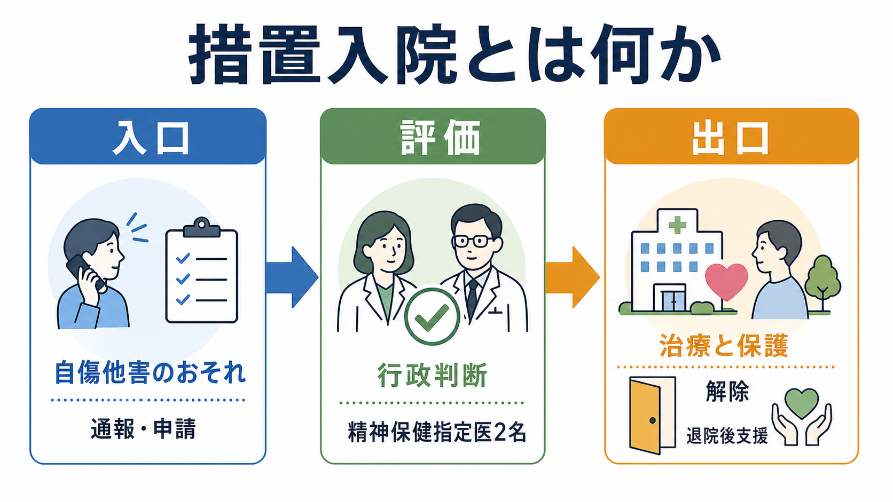
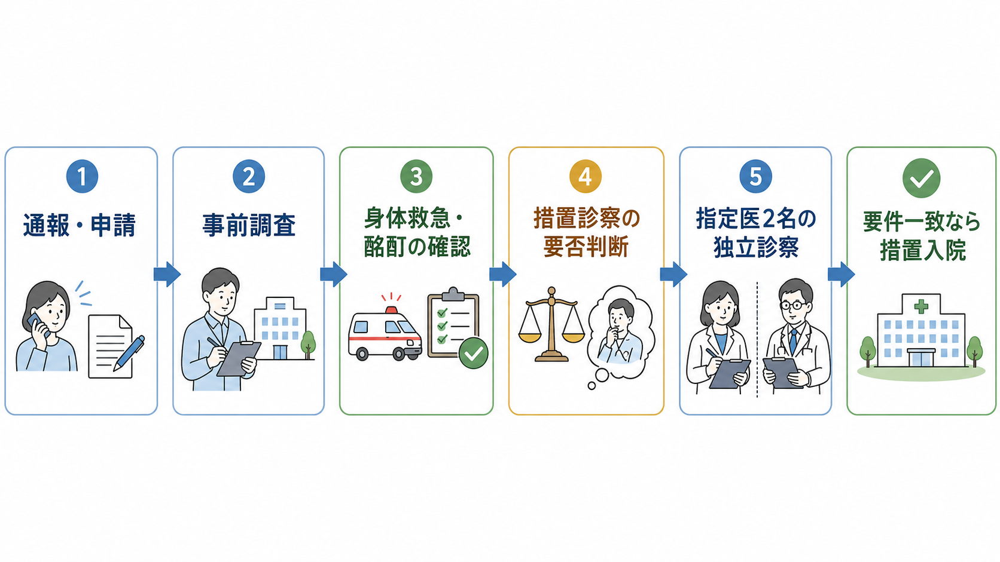

# 措置入院とは何か

## 要点

- 措置入院は、精神障害のために自傷他害のおそれがあり、医療と保護のために入院が必要と判断される場合に、都道府県知事等が行う行政上の入院制度である[1]。
- 中核は「危険だから閉じ込める」ことではなく、急性の安全確保、治療機会、権利保障、解除後の地域支援を同時に扱う手続きである[2][4]。
- 原則として、2名の精神保健指定医が独立して診察し、要件に一致した場合に措置入院が決定される[1][2]。
- 緊急性が高い場合には緊急措置入院があり、通常の措置診察とは別に、短時間の暫定的な制度として位置づく[1]。
- 本記事は教育・研究目的の制度整理であり、個別事例の診断、入院要否、法的判断を代替しない。

## この記事で答える問い

1. 措置入院は、任意入院や医療保護入院と何が違うのか。
2. 「自傷他害のおそれ」は、どのような手続きで評価されるのか。
3. 措置診察、入院決定、解除、退院後支援はどのようにつながるのか。
4. 臨床・研究では、この制度をどのように理解すべきか。

## まず結論

措置入院は、本人の同意を前提にしない強い介入である。そのため、単に精神疾患がある、症状が重い、周囲が困っている、過去に問題行動があった、というだけでは説明できない。法律上は、精神障害者であり、医療および保護のために入院させなければ、その精神障害のために自身を傷つけ、または他人に害を及ぼすおそれがある、という要件が問題になる[1]。

同時に、措置入院は刑罰や犯罪予防制度そのものではない。臨床的には、[[精神疾患と暴力リスクはどう関係するのか|暴力リスク]]や自殺リスクを、診断名だけでなく、現在の精神状態、切迫性、身体疾患、物質使用、生活環境、支援資源、代替手段の有無から評価する必要がある。判断の焦点は、本人と周囲の安全を確保しながら、必要最小限の介入で治療と地域生活への回復をどう支えるかにある[2][6]。

## 背景

日本の精神科入院には、本人の同意に基づく任意入院、本人の同意が得られない場合の医療保護入院、行政権限による措置入院など、複数の形態がある。措置入院はその中でも、自由の制限が大きく、行政判断、精神保健指定医の診察、通知、報告、解除、審査請求などの手続きと結びついている[1][5]。

制度が必要とされる背景には、急性精神病状態、重い躁状態、深いうつ状態、せん妄や物質関連状態との鑑別が必要な混乱、自殺企図の切迫、他者への重大な危険が疑われる状況などがある。ただし、危険性の評価は不確実性を含む。したがって、措置入院は「リスクをゼロにする制度」ではなく、切迫した危機の中で、評価可能な根拠に基づき、介入の必要性と権利制限の重さを比較する制度として理解する方がよい。

## 基本概念

### 措置入院

措置入院とは、精神保健福祉法第29条に基づき、都道府県知事等が精神障害者を国等の設置した精神科病院または指定病院に入院させることができる制度である。要件の中心は、精神障害のために自傷他害のおそれがあり、医療および保護のために入院が必要であることに、指定医の診察結果が一致する点である[1][2]。

ここでいう「おそれ」は、一般的な不安や周囲の違和感ではない。評価では、現在の症状、行動、発言、既往歴、身体状態、物質使用、生活環境、支援者の有無、代替的な安全策の可能性を統合する。[[精神科で重症度をどう判断するか]]や[[鑑別診断とは何か]]の視点と重なるが、措置入院では行政手続きとしての要件充足が加わる。

### 措置診察

措置診察は、措置入院の要否を判断するための精神保健指定医による診察である。厚生労働省の運用ガイドラインは、2名の指定医について、原則として同一医療機関に所属する者を選ばないこと、各指定医が独立して最終判断を行うことを求めている[2]。これは、強制力を伴う入院判断において、利益相反や追認的判断を減らすための重要な仕組みである。

### 緊急措置入院

緊急措置入院は、急速を要し、通常の措置入院手続きを直ちに行うことが困難な場合の暫定的制度である。通常の措置入院とは異なり、1名の指定医の診察で開始されうるが、期間は制限され、長期の入院形態として扱うものではない[1]。実務上は、救急医療、身体疾患、意識障害、酩酊、薬物中毒などの確認と並行して考える必要がある。

## 仕組み

典型的な流れは、通報・申請、行政による事前調査、措置診察の要否判断、指定医2名による診察、都道府県知事等による決定、入院中の治療と報告、症状消退時の解除、退院後支援へ進む、という形で整理できる[1][2][4]。

### 1. 通報・申請は入口であって決定ではない

警察官、検察官、保護観察所、矯正施設、一般人など、法律上の経路から申請・通報・届出が行われることがある[1]。しかし、通報があることは措置入院を意味しない。行政は、本人の状態、事案の内容、医療機関受診の必要性、身体救急の優先度、家族・支援者の情報を確認し、措置診察を行うべきかを判断する。

### 2. 「精神障害」と「自傷他害のおそれ」を分けて見る

措置入院の要件は、診断名だけで決まらない。精神障害があるか、自傷他害のおそれがその精神障害に由来しているか、入院させなければ医療と保護が成立しないか、代替手段で対応できないかを分けて検討する。たとえば、暴力的な言動があっても、主因が酩酊、せん妄、身体疾患、犯罪行為、家庭内葛藤、生活困窮であれば、精神科措置入院だけで説明してはならない。

### 3. 2名の指定医が独立して判断する

運用ガイドラインでは、措置診察を行う2名の指定医の独立性が重視される。一次診察と二次診察を分けるか、同時に行うかは運用上の選択肢があるが、最終判断は各指定医が個別に行う必要がある[2]。この独立性は、権利制限を伴う判断の質を支える。

### 4. 入院後も「続ける理由」は見直される

措置入院が始まった後も、入院を継続する理由は固定されない。病院管理者は、措置症状が消退した場合には届け出ることが求められ、都道府県知事等は措置を解除する[1][5]。入院は罰ではなく、必要性が失われれば解除されるべき医療・保護上の手段である。

## 図解

| 入院形態 | 判断主体の中心 | 本人同意 | 主な焦点 |
|---|---|---:|---|
| 任意入院 | 本人と医療機関 | あり | 本人の同意に基づく治療 |
| 医療保護入院 | 医療機関、家族等または市町村長の同意 | なし | 入院治療の必要性と同意困難 |
| 措置入院 | 都道府県知事等、精神保健指定医 | なし | 精神障害による自傷他害のおそれ |
| 緊急措置入院 | 都道府県知事等、指定医 | なし | 急速を要する暫定的対応 |

## 臨床・研究との接続

臨床では、措置入院を「制度名」だけで理解すると危うい。重要なのは、急性期評価、リスク評価、身体疾患や薬物の鑑別、本人の意思決定能力、家族・支援者の状況、地域資源を同時に見ることである。[[精神科面接とは何か|精神科面接]]では、本人の体験を尊重しながらも、自傷他害、希死念慮、命令性幻聴、被害妄想、躁状態、意識障害、物質使用、虐待・DV、武器や手段へのアクセスなどを具体的に確認する。

研究上は、措置入院を単純に「危険な患者の指標」として扱うべきではない。措置入院の発生には、地域の救急体制、指定医確保、警察・保健所連携、病床状況、家族支援、通報文化、退院後支援の制度化が関わる。したがって、疫学研究や政策評価では、個人要因だけでなく、制度・地域差・運用差を含めて解釈する必要がある[3][4]。

また、国際的には、精神保健サービスを本人中心・権利基盤・地域生活支援へ転換する方向が強調されている[6]。日本の措置入院を考えるときも、入院そのものだけでなく、[[クライシスプランとは何か|クライシスプラン]]、外来継続、訪問支援、住まい、福祉、家族支援、ピアサポートなどの地域支援をどう整えるかが重要になる。

## よくある誤解

### 誤解1: 措置入院は、犯罪を防ぐための制度である

措置入院は刑罰ではなく、精神保健福祉法上の医療・保護の制度である。自傷他害のおそれは重要な要件だが、犯罪予防や社会防衛だけを目的に説明すると、精神疾患と危険性を過度に結びつけ、スティグマを強める。

### 誤解2: 精神疾患が重ければ措置入院になる

重症であることと措置入院の要件は同じではない。重い症状があっても、本人が任意入院に同意できる、家族や地域支援で安全が確保できる、身体治療が優先される、または自傷他害のおそれが要件を満たさない場合がある。逆に、診断名が未確定でも、切迫した危険と精神障害の関係が評価対象になる。

### 誤解3: 措置入院になれば、退院まで本人の権利は止まる

誤りである。入院中も、処遇、通信・面会、退院請求、処遇改善請求、精神医療審査会による審査など、権利保障の仕組みが関係する[1][5]。臨床的にも、説明、意思確認、苦痛の軽減、プライバシー、家族等との関係調整は軽視できない。

### 誤解4: 退院後支援は監視である

退院後支援は、再発や危機を本人だけの責任に戻すものではない。厚生労働省の退院後支援ガイドラインは、地方公共団体が関係機関と協力し、医療、福祉、生活支援、危機時対応をつなぐ計画作成を進めるものとして整理している[4]。支援の質は、本人の参加、同意、生活目標、地域資源の現実性によって左右される。

## 関連ノート

- [[精神疾患と暴力リスクはどう関係するのか]]
- [[精神科で重症度をどう判断するか]]
- [[鑑別診断とは何か]]
- [[クライシスプランとは何か]]
- [[精神疾患と再入院はどう関係するのか]]
- [[重症精神障害とは何か]]

MOC更新候補: `content/00_MOC/MOC｜精神医学.md`、司法精神医学、精神保健福祉法、地域精神医療、危機介入に関するMOC。並列生成ジョブとの競合を避けるため、本記事ではMOC本体を更新していない。

## 理解チェック

1. 措置入院の要件を、「精神障害」「医療および保護の必要性」「自傷他害のおそれ」に分けて説明できるか。
2. 通報があったことと、措置入院が決定されることの違いを説明できるか。
3. 2名の精神保健指定医による独立診察が、なぜ権利保障上重要なのか説明できるか。
4. 措置入院と医療保護入院の違いを、本人同意、判断主体、焦点から比較できるか。
5. 退院後支援を「監視」ではなく「地域生活の支援計画」として説明できるか。

## 参考文献

[1] e-Gov法令検索. 精神保健及び精神障害者福祉に関する法律. https://laws.e-gov.go.jp/law/325AC0100000123

[2] 厚生労働省. 「措置入院の運用に関するガイドライン」について（平成30年3月27日障発0327第15号）. https://www.mhlw.go.jp/web/t_doc?dataId=00tc3289&dataType=1

[3] 厚生労働省. 令和3年度衛生行政報告例の概況: 精神保健福祉関係. https://www.mhlw.go.jp/toukei/saikin/hw/eisei_houkoku/21/

[4] 厚生労働省. 「地方公共団体による精神障害者の退院後支援に関するガイドライン」について（平成30年3月27日障発0327第16号）. https://www.mhlw.go.jp/web/t_doc?dataId=00tc3290&dataType=1&pageNo=1

[5] 厚生労働省. 各種様式について（令和6年度施行）. https://www.mhlw.go.jp/stf/seisakunitsuite/bunya/hukushi_kaigo/shougaishahukushi/kaisei_seisin/youshiki.html

[6] World Health Organization. (2021). *Guidance on community mental health services: Promoting person-centred and rights-based approaches*. https://www.who.int/publications/i/item/9789240025707

## 未解決問題

- 自傷他害リスク評価の不確実性を、本人の権利制限と地域安全の両方に配慮しながら、どのように説明・記録するか。
- 地域差のある指定医確保、夜間休日対応、病床状況が、措置診察の質や公平性に与える影響をどう評価するか。
- 退院後支援を、本人参加と同意を尊重しつつ、危機時対応まで含む実効的な支援計画にするには何が必要か。
- 措置入院に関する統計を、スティグマを強めず、制度改善に役立つ形でどう公開・解釈するか。
