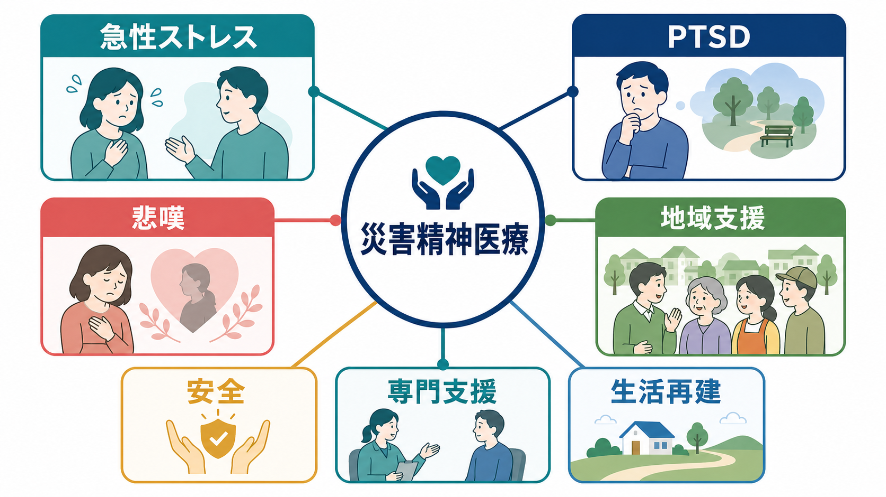
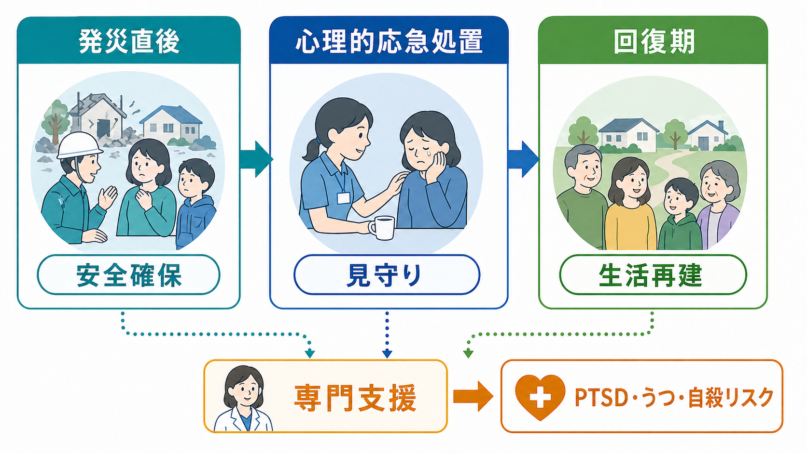
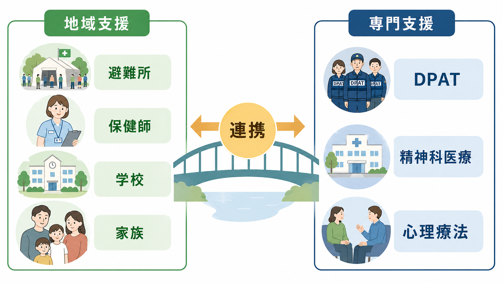

# 災害精神医療とは何か

## 要点

- 災害精神医療は、災害後の「こころのケア」だけでなく、被災した精神科医療システムの補完、避難所・地域でのニーズ把握、支援者支援、専門治療への橋渡しを含む。
- 災害後には急性ストレス反応、睡眠障害、不安、悲嘆、うつ、自殺リスク、[[PTSDとは何か|PTSD]]などが問題になりうるが、多くの反応は異常な事態への自然な反応でもある。
- 初期対応では、詳細な聞き取りや感情吐露の強制よりも、安全、安心、落ち着き、つながり、自己効力感、希望を支えることが重要である[1][3][5]。
- 日本では DPAT（災害派遣精神医療チーム）が、被災地の精神保健医療ニーズの把握、地域精神科医療の支援、一般住民・支援者への対応を担う制度的枠組みとして位置づく[4]。

## この記事で答える問い

- 災害精神医療は、通常の[[地域精神医療とは何か|地域精神医療]]や精神科救急と何が違うのか。
- 急性ストレス、PTSD、悲嘆、地域支援をどのように同じ地図の中で理解できるのか。
- 災害時に「やるべき支援」と「避けるべき支援」はどこで分かれるのか。

## まず結論

災害精神医療とは、災害によって揺らいだ生活基盤、地域ネットワーク、医療提供体制の上で、精神的苦痛を「個人の症状」だけに還元せず、生活再建と専門支援をつなぐ領域である。IASC の Mental Health and Psychosocial Support（MHPSS）では、緊急時の支援を保健医療、教育、保護、人権、住居、食料、水・衛生、コミュニティ支援などの多部門連携として捉える[1]。したがって災害精神医療の中心課題は、診断名を急いで付けることではなく、被災者が安全を回復し、必要な人が必要な専門支援へ届く仕組みを作ることである。

## 背景

災害では、家屋、職場、学校、医療機関、交通、通信、家族関係、地域の役割が同時に損なわれる。そのため精神的苦痛は、恐怖体験そのものだけでなく、避難生活、喪失、孤立、服薬中断、身体疾患の悪化、経済的不安、行政手続きの複雑さによって増幅される。

この文脈での支援は、個別面接だけでは完結しない。避難所の環境調整、情報提供、睡眠や休息の確保、既存患者の治療継続、子ども・高齢者・障害者・外国人・支援者など脆弱性の高い集団への配慮が必要になる[1][2]。日本の DPAT 活動要領も、災害時には被災地域の精神保健医療機能が低下し、同時に精神保健医療ニーズが拡大するため、ニーズ把握、医療体制との連携、専門的精神科医療、精神保健活動の支援が必要になると位置づけている[4]。

## 基本概念

### 急性ストレス

発災直後には、不眠、動悸、過覚醒、涙もろさ、ぼんやりする、怒りっぽさ、身体症状、出来事が頭から離れないといった反応が起こりうる。重要なのは、これをすぐに病理化しないことである。WHO/UNHCR の mhGAP-HIG は、急性ストレス、悲嘆、うつ、PTSD、自殺リスクなどを人道危機下の一般医療・非専門職でも扱えるよう整理しているが、同時に安全確保、基本的ニーズ、社会的支援、経過観察を重視する[2]。

### PTSD

PTSD は、侵入症状、回避、認知・気分の陰性変化、過覚醒が持続し、生活機能を損なう状態として理解される。災害後 PTSD の研究は多いが、発症率は災害の種類、曝露の強さ、喪失、既往歴、社会的支援、調査時期によって大きく変わる[6]。したがって災害後支援では、全員を患者として扱うのではなく、強い曝露や機能低下が続く人を見落とさない「見守りと選別」が必要になる。

### 悲嘆

災害では、家族や友人の死、遺体確認の困難、葬送儀礼の中断、家や地域の喪失が重なる。悲嘆は自然な反応であり、泣くこと、話したくないこと、怒りや罪責感が生じること自体を病気と決めつけない。一方で、強い希死念慮、生活機能の著しい低下、アルコールなどへの依存、長期にわたる孤立がある場合には、専門支援につなぐ必要がある[2]。

### 地域支援

災害精神医療は、医療者だけで完結しない。[[保健所と精神保健福祉センターは何をするのか|保健所・精神保健福祉センター]]、市町村、学校、職場、自治会、福祉、司法、NPO、宗教者、家族、当事者団体が、被災者の生活再建を支える。ここでの専門職の役割は、地域がもともと持つ支援機能を奪わず、必要なところに知識、連携、専門治療への入口を足すことである。

## 仕組み

災害後の支援は、単線的な「発災直後にカウンセリングをする」モデルではなく、時間経過に応じた層状の支援として考えると理解しやすい。

1. 発災直後は、安全確保、身体医療、睡眠・水・食事・情報へのアクセスを整える。
2. 初期には、心理的応急処置（Psychological First Aid: PFA）として、押しつけない関わり、現実的な支援、家族・地域との再接続、必要なサービスへの案内を行う[3]。
3. 数週から数か月では、症状の持続、機能低下、服薬中断、うつ、自殺リスク、PTSD 症状、複雑な悲嘆を見守り、必要に応じて専門支援へつなぐ[2][6]。
4. 回復期には、生活再建、孤立予防、支援者の疲弊対策、地域の記憶と追悼、長期フォローアップが重要になる。

この流れを支える原則として、Hobfoll らは大量トラウマ後の初期・中期介入で、安全感、落ち着き、自己効力感・コミュニティ効力感、つながり、希望を促進することを挙げている[5]。これは、支援者が「何を話させるか」よりも、「その人が今日を少し安全に過ごし、明日以降の支援につながれるか」を重視する考え方である。

## 図解

次の図は、地域支援と専門支援の接続を示している。避難所や学校、家族、保健師などが支える場と、DPAT、精神科医療、心理療法などの専門支援は対立するものではない。むしろ、地域の観察と関係性があるからこそ、専門支援が必要な人に届きやすくなる。

## 臨床・研究との接続

臨床的には、災害精神医療は「診断する医療」と「場を支える公衆衛生」の境界領域にある。既存の精神疾患をもつ人では、服薬中断、通院先の被災、避難所でのプライバシー不足、身体疾患の悪化が問題になる。一般住民では、急性ストレス、悲嘆、睡眠障害、不安、うつ、自殺リスクを、時間経過と生活機能から評価する必要がある。自殺リスクが高い場合は、[[自殺対策基本法とは何か|自殺対策]]や[[自殺未遂者支援では何を行うのか|自殺未遂者支援]]の地域資源と接続する。

研究的には、災害後の精神健康を一つの有病率だけで表すのは難しい。曝露量、避難期間、死別、社会経済的損失、既往歴、支援資源、調査時期が結果を左右するためである[6]。そのため、症状尺度だけでなく、地域機能、サービス利用、支援者負担、長期的な生活再建を含めた評価が求められる。

## よくある誤解

### 誤解1: 災害後は全員にカウンセリングを行うべきである

全員に専門的面接を行うことは現実的でも適切でもない。多くの人には、安全、休息、情報、家族・地域との接続、現実的支援がまず必要である[1][3]。

### 誤解2: 体験を早く話させれば PTSD を予防できる

単回の心理的デブリーフィングは、PTSD 予防に有効であるという根拠がなく、場合によっては害になりうる。Cochrane レビューは、非選択的なトラウマ被災者に対する単回デブリーフィングの routine use を支持しない[7]。支援では、語ることを強制せず、本人のペースと安全を尊重する。

### 誤解3: 災害精神医療は精神科医だけの仕事である

DPAT や精神科医療は重要だが、災害精神医療の基盤は地域にある。[[精神保健福祉法とは何か|精神保健福祉]]、公衆衛生、福祉、教育、行政、住まい、雇用、法制度が接続してはじめて、被災者の生活は回復しやすくなる。

## 関連ノート

- [[PTSDとは何か]]
- [[複雑性PTSDとは何か]]
- [[地域精神医療とは何か]]
- [[保健所と精神保健福祉センターは何をするのか]]
- [[精神保健福祉法とは何か]]
- [[自殺対策基本法とは何か]]
- [[自殺未遂者支援では何を行うのか]]

## MOC更新候補

- `content/00_MOC/` 配下の精神医学、地域精神医療、トラウマ関連 MOC がある場合に、本記事へのリンク追加を検討する。
- 並列ジョブとの衝突を避けるため、本タスクでは MOC 本体は更新しない。

## 理解チェック

1. 災害精神医療が、個人の症状だけでなく生活再建や地域支援を扱う理由は何か。
2. PFA と単回デブリーフィングの違いは何か。
3. 災害後に PTSD リスクが高い人を見落とさないため、どのような情報を継続的に見る必要があるか。
4. DPAT と保健所・精神保健福祉センターは、どのように役割分担できるか。

## 未解決問題

- 災害種別ごとの長期的な精神健康影響を、日本の地域データでどこまで比較できるか。
- 支援者支援、自治体職員の燃え尽き、二次受傷をどの時点から制度的に評価すべきか。
- 避難所外避難者、在宅避難者、外国人、障害者、性的マイノリティなど、支援から漏れやすい人へのアウトリーチをどう標準化するか。

## 参考文献

[1] Inter-Agency Standing Committee. (2007). *IASC Guidelines for Mental Health and Psychosocial Support in Emergency Settings*. https://www.who.int/publications-detail-redirect/iasc-guidelines-for-mental-health-and-psychosocial-support-in-emergency-settings

[2] World Health Organization & United Nations High Commissioner for Refugees. (2015). *mhGAP Humanitarian Intervention Guide: Clinical Management of Mental, Neurological and Substance Use Conditions in Humanitarian Emergencies*. https://iris.who.int/handle/10665/162960

[3] National Child Traumatic Stress Network & National Center for PTSD. (2006/2009). *Psychological First Aid: Field Operations Guide, 2nd Edition*. https://www.nctsn.org/resources/psychological-first-aid-pfa-field-operations-guide-2nd-edition

[4] 厚生労働省. (2014). 「災害派遣精神医療チーム（DPAT）活動要領」. https://www.mhlw.go.jp/seisakunitsuite/bunya/hukushi_kaigo/shougaishahukushi/kokoro/ptsd/dpat_130410.html

[5] Hobfoll, S. E., Watson, P., Bell, C. C., et al. (2007). Five Essential Elements of Immediate and Mid-Term Mass Trauma Intervention: Empirical Evidence. *Psychiatry*, 70(4), 283-315. https://doi.org/10.1521/psyc.2007.70.4.283

[6] Neria, Y., Nandi, A., & Galea, S. (2008). Post-traumatic stress disorder following disasters: A systematic review. *Psychological Medicine*, 38(4), 467-480. https://doi.org/10.1017/S0033291707001353

[7] Rose, S. C., Bisson, J., Churchill, R., & Wessely, S. (2002). Psychological debriefing for preventing post traumatic stress disorder (PTSD). *Cochrane Database of Systematic Reviews*, CD000560. https://doi.org/10.1002/14651858.CD000560
