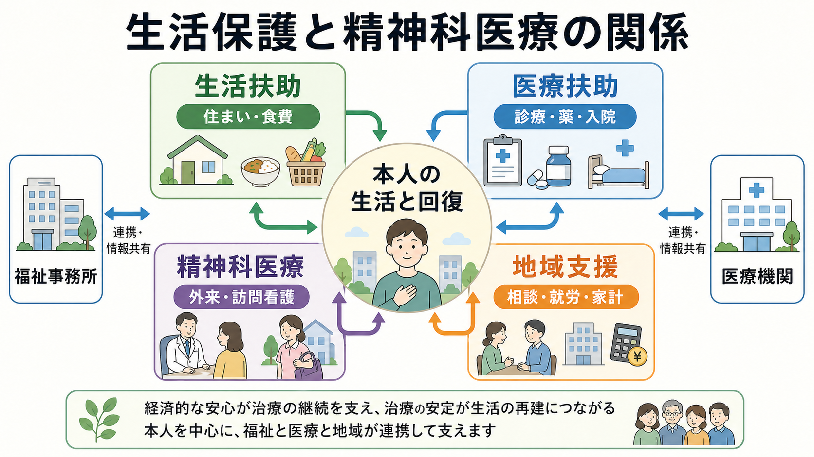
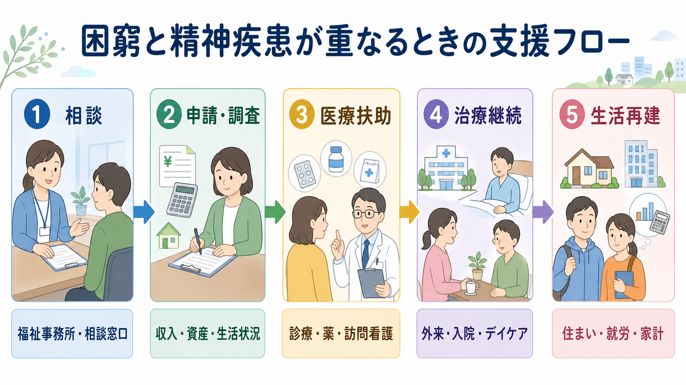

# 生活保護と精神科医療はどう関係するのか

## 要点

- 生活保護は、生活に困窮する人に必要な保護を行い、健康で文化的な最低限度の生活を保障し、自立を助長する制度である[1]。
- 精神科医療との接点は、主に医療扶助、生活扶助、住宅扶助、ケースワーク、地域精神保健福祉との連携にある[1][2]。
- 医療扶助は、診察、薬剤、処置、入院、訪問看護などの医療を支える仕組みであり、精神科外来、薬物療法、精神科デイケア、入院医療、訪問看護の継続に関わる[2][3]。
- 貧困と精神健康は一方向の因果ではなく、生活困窮が精神症状を悪化させ、精神疾患が就労・家計・住まいの不安定化を招くという双方向の関係として理解する必要がある[6][7]。
- この記事は教育・研究目的の制度整理であり、個別の生活保護申請、診断、治療方針、自治体判断を指示するものではない。

## この記事で答える問い

1. 生活保護は精神科医療の「医療費」だけを支える制度なのか。
2. 医療扶助は、精神科外来・入院・訪問看護とどのように関係するのか。
3. 生活困窮と精神疾患が重なると、臨床では何を評価するべきか。
4. 生活保護をめぐる誤解やスティグマを、精神科医療ではどう扱うべきか。

## まず結論

生活保護と精神科医療の関係は、「精神科の医療費が無料になる」という一点だけでは説明できない。生活保護は、生活扶助、住宅扶助、医療扶助などを通じて、治療を受ける前提となる住まい、食事、医療アクセス、生活再建を支える制度である[1][2]。精神科医療から見ると、これは症状を診るだけでなく、治療継続を妨げる経済的不安、住居不安、孤立、服薬中断、頻回受診、退院先の不足を一緒に扱うという意味を持つ。

したがって、精神科臨床では、生活保護を「福祉の話」として外に置くのではなく、[[精神科で多職種連携はなぜ重要なのか|多職種連携]]、[[社会的処方とは何か|社会的処方]]、退院支援、地域生活支援の一部として理解する必要がある。特に、精神保健福祉士やケースワーカーは、診断名だけでは見えない生活課題を制度につなぐ役割を担う。

## 背景

精神疾患と経済的困窮は、しばしば重なり合う。抑うつ、不安、精神病症状、依存症、発達特性、認知機能の低下、身体疾患の併存があると、就労、家計管理、対人関係、受診継続、住居維持が難しくなることがある。一方で、失業、借金、住居不安、孤立、食料不安、医療費負担は、睡眠、気分、不安、希死念慮、物質使用、身体疾患を悪化させうる[6][7]。

WHO は、精神健康が所得、雇用、教育、住まい、社会的支援、差別、医療アクセスなどの社会的決定要因に強く影響されると整理している[6]。この観点では、精神科医療は診察室内の薬物療法や心理療法だけでは完結しない。本人が治療を続けられる生活条件を整えることも、回復の土台になる。

日本の生活保護制度は、最低生活の保障と自立の助長を目的に、世帯の収入と最低生活費を比較して必要な保護を行う制度である[1]。精神科医療と関係するのは、医療扶助だけでなく、生活扶助、住宅扶助、生業扶助、ケースワーカーによる相談支援、健康管理支援、障害福祉・生活困窮者自立支援制度との接続である。

## 基本概念

### 生活保護

生活保護は、資産、能力、他制度、扶養などの活用を前提に、それでも最低生活を維持できない場合に適用される制度である[1]。保護は世帯単位で判断され、支給内容は地域、世帯構成、収入、必要な扶助によって異なる。

精神科医療では、この「世帯単位」という点が重要になる。本人だけでなく、家族の収入、同居状況、扶養照会、住居、借金、就労可能性、障害年金、傷病手当、障害福祉サービスなどが関係するため、医療者だけで判断せず、福祉事務所や相談支援機関と接続する必要がある。

### 医療扶助

医療扶助は、生活保護法上の扶助の一つであり、医療サービスの費用を支える。厚生労働省の生活保護制度説明では、医療サービスの費用は直接医療機関へ支払われ、本人負担はないと整理されている[1]。生活保護法第15条は、診察、薬剤・治療材料、医学的処置、入院、居宅での療養上の管理と看護、移送を医療扶助の範囲としている[2]。

精神科では、外来診察、向精神薬、精神科入院、精神科訪問看護、デイケア、依存症治療、身体合併症への医療などが問題になる。ただし、実際の利用手続きや対象範囲は自治体運用、指定医療機関、医療要否、他制度の優先関係によって変わるため、個別には福祉事務所への確認が必要である。

### 自立支援医療との違い

自立支援医療の精神通院医療は、精神疾患のため継続的な通院医療を要する人の自己負担を軽減する公費負担医療制度である[3]。生活保護の医療扶助とは制度の根拠と対象が異なる。生活保護を受けていない人でも自立支援医療を使える場合があり、逆に生活保護受給中は医療扶助との関係を確認する必要がある。

臨床上は、「生活保護か、自立支援医療か」という二択ではなく、本人の収入、医療費負担、障害年金、障害者手帳、福祉サービス、住まい、就労支援を組み合わせて考える。

## 仕組み

生活困窮と精神疾患が重なるときの支援は、次のような流れで整理できる。

1. 相談につながる  
   入口は、福祉事務所、生活困窮者自立相談支援機関、精神科外来、救急、保健所、地域包括支援センター、学校、職場、家族など多様である。生活保護の相談・申請窓口は、原則として現在住んでいる地域を所管する福祉事務所である[1]。

2. 生活状況を確認する  
   収入、資産、住居、家族関係、就労可能性、既存制度、医療の必要性を確認する。精神科では、症状だけでなく、家賃滞納、食事、服薬、通院手段、金銭管理、支援者の有無を評価する。

3. 医療扶助で必要な医療を支える  
   医療扶助は、精神科治療へのアクセスを支える重要な制度である。厚生労働省の医療扶助に関する検討会資料では、生活保護の医療扶助は入院の割合が高く、傷病分類別レセプト件数では「精神・行動の障害」の割合が医療保険より高いことが示されている[5]。これは、生活困窮と精神疾患が制度上も大きく交差していることを示す。

4. 治療継続と生活再建を同時に進める  
   症状が軽くなっても、住まい、家計、孤立、就労、家族関係が不安定なままだと再発や再入院につながりやすい。生活保護の健康管理支援では、精神疾患や孤独・孤立など社会生活面の課題を持つ人も対象になりうること、他制度や関係機関との連携が必要であることが議論されている[4]。

5. 地域支援へつなぐ  
   障害福祉サービス、相談支援、訪問看護、就労支援、家計改善支援、居住支援、ピアサポート、家族支援を組み合わせる。これは[[精神保健福祉法とは何か|精神保健福祉法]]の地域生活支援や権利擁護の考え方とも接続する。

## 図解

1枚目の図は、生活保護と精神科医療を「本人の生活と回復」を中心に置いて整理している。生活扶助は日常生活、医療扶助は診療や薬、精神科医療は外来・訪問看護、地域支援は相談・就労・家計を支える。重要なのは、福祉事務所と医療機関が別々に本人を扱うのではなく、情報共有と役割分担を通じて治療継続の条件を整える点である。

2枚目の図は、相談から申請・調査、医療扶助、治療継続、生活再建までを流れとして示している。現実の支援は直線的ではなく、入院、退院、再申請、転居、就労、再発を行き来する。図は「一度つながれば終わり」ではなく、状態に応じて医療と福祉を組み直すための見取り図として読む。

## 臨床・研究との接続

精神科医療で生活保護が問題になる場面は、少なくとも四つある。

第一に、治療アクセスの問題である。医療費不安が強いと、受診控え、服薬中断、救急化が起こりやすい。医療扶助は、必要な医療を継続する条件を整える。

第二に、退院支援の問題である。精神科入院では、症状が改善しても、退院先、家賃、家財、通院手段、訪問看護、服薬管理、日中活動が整わないと退院が難しい。生活保護は、住宅扶助や生活扶助を通じて退院後生活の土台になりうる。

第三に、頻回受診や多剤服薬の背景理解である。厚生労働省の部会資料では、頻回受診の背景に孤独、医師への依存、精神疾患、認知症、社会的孤立、不安がある場合、従来型の指導だけでは効果が出にくいことが議論されている[4]。精神科では、受診行動を「わがまま」や「制度の濫用」と決めつけず、不安、孤立、認知機能、薬物依存、トラウマ、生活課題を評価する必要がある。

第四に、研究上の社会的決定要因である。社会経済的不利、住居不安、借金、孤立は精神健康と関連し、近年のレビューも、貧困と精神健康が双方向に関係すること、経済的支援と心理社会的支援を組み合わせる介入の必要性を論じている[6][7]。日本の精神科医療研究でも、診断名や薬物療法だけでなく、住居、所得、就労、社会的孤立、制度利用を変数として扱うことが重要になる。

## よくある誤解

### 誤解1: 生活保護を受ければ精神科治療は何でも自由に受けられる

医療扶助は必要な医療を支える制度だが、無制限に任意の医療を選べる制度ではない。指定医療機関、医療要否、他制度の優先、福祉事務所との手続きが関係する。必要な医療を受ける権利と、制度上の手続きは分けて理解する必要がある。

### 誤解2: 生活保護は治療意欲を下げる

生活保護を受けること自体が治療意欲を下げるとはいえない。むしろ、住居や食事、医療費不安が安定すると、睡眠、服薬、通院、心理療法、就労準備に取り組みやすくなる場合がある。問題は制度利用そのものではなく、本人の希望、症状、環境、支援の組み合わせである。

### 誤解3: 精神疾患があれば自動的に生活保護になる

生活保護は診断名だけで決まらない。収入、資産、世帯状況、就労可能性、他制度の利用可能性、最低生活費との比較によって判断される[1]。精神科診断書は生活状況を説明する一部になりうるが、申請・決定は福祉事務所の制度手続きである。

### 誤解4: 現実の貧困を精神症状として扱えばよい

これは危険な誤解である。実際の生活困窮、借金、家賃滞納、食料不安、医療費不安は、それ自体が支援課題である。[[貧困妄想とは何か|貧困妄想]]を評価するときも、現実の困窮と妄想的確信を区別し、本人の生活実態を確認する必要がある。

## 関連ノート

- [[精神保健福祉法とは何か]]
- [[精神科で多職種連携はなぜ重要なのか]]
- [[精神科におけるチーム医療とは何か]]
- [[社会的処方とは何か]]
- [[貧困妄想とは何か]]
- [[精神科入院で患者の権利をどう守るのか]]

MOC更新候補: `content/00_MOC/MOC｜精神医学.md`、地域精神医療、精神保健福祉、社会的決定要因、生活困窮支援に関するMOC。並列生成ジョブとの競合を避けるため、本記事ではMOC本体を更新していない。

今後の作成候補: 「医療扶助とは何か」「自立支援医療とは何か」「精神障害者保健福祉手帳とは何か」「障害年金と精神科医療はどう関係するのか」「居住支援と精神科医療はどう関係するのか」

## 理解チェック

1. 生活保護と精神科医療の接点は、医療扶助以外に何があるか。
2. 医療扶助と自立支援医療の違いを説明できるか。
3. 生活困窮が精神症状や治療継続に影響する経路を三つ挙げられるか。
4. 頻回受診を「指導の対象」としてだけでなく「支援ニーズ」として見ると、評価はどう変わるか。
5. 現実の経済的困窮と貧困妄想を区別するために、何を確認する必要があるか。

## 参考文献

[1] 厚生労働省. 生活保護制度. https://www.mhlw.go.jp/stf/seisakunitsuite/bunya/hukushi_kaigo/seikatsuhogo/seikatuhogo/index.html

[2] 厚生労働省. 生活保護法（昭和25年法律第144号）. https://www.mhlw.go.jp/web/t_doc?dataId=82048000&dataType=0

[3] 厚生労働省. 自立支援医療（精神通院医療）の概要. https://www.mhlw.go.jp/bunya/shougaihoken/jiritsu/seishin.html

[4] 厚生労働省. 第21回社会保障審議会生活困窮者自立支援及び生活保護部会 議事録. https://www.mhlw.go.jp/stf/newpage_29511.html

[5] 厚生労働省. 第7回医療扶助に関する検討会 議事録. https://www.mhlw.go.jp/stf/newpage_27486.html

[6] World Health Organization. (2014). *Social determinants of mental health*. https://iris.who.int/handle/10665/112828

[7] Ridley, M., Rao, G., Schilbach, F., & Patel, V. (2020). Poverty, depression, and anxiety: Causal evidence and mechanisms. *Science*, 370(6522), eaay0214. https://doi.org/10.1126/science.aay0214

[8] Barry, R., Anderson, J., Tran, L., Bahji, A., Dimitropoulos, G., Ghosh, S. M., Kirkham, J., Messier, G., Patten, S. B., Rittenbach, K., & Seitz, D. (2024). Prevalence of mental health disorders among individuals experiencing homelessness: A systematic review and meta-analysis. *JAMA Psychiatry*, 81(7), 691-699. https://doi.org/10.1001/jamapsychiatry.2024.0426
