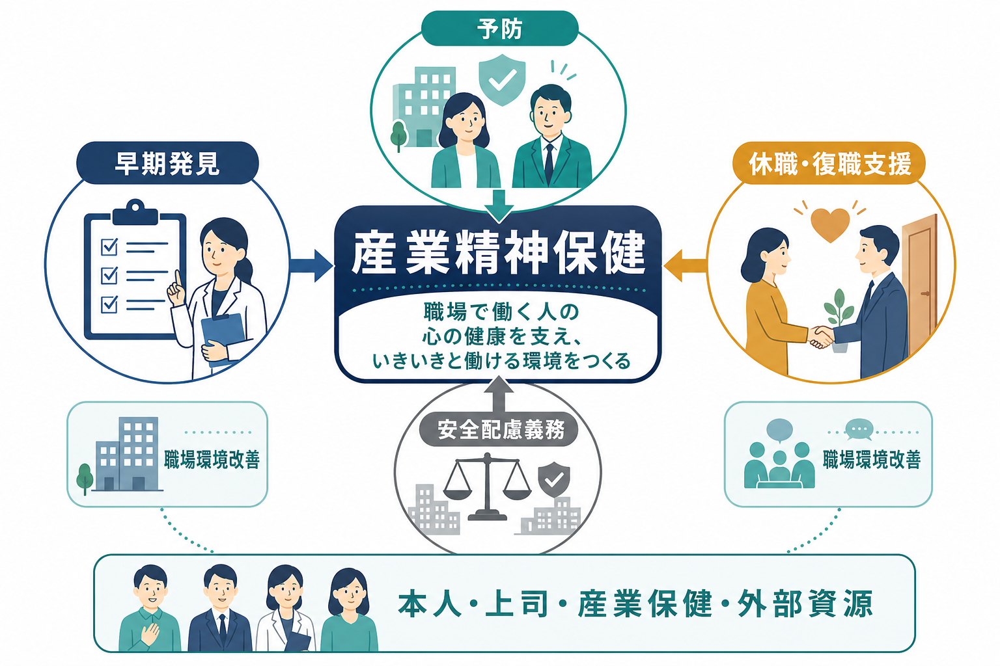
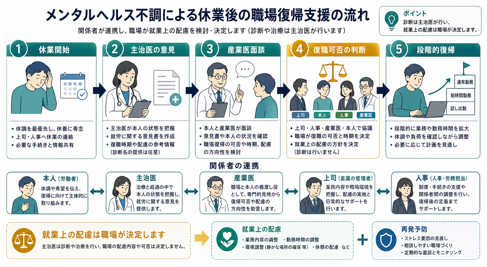
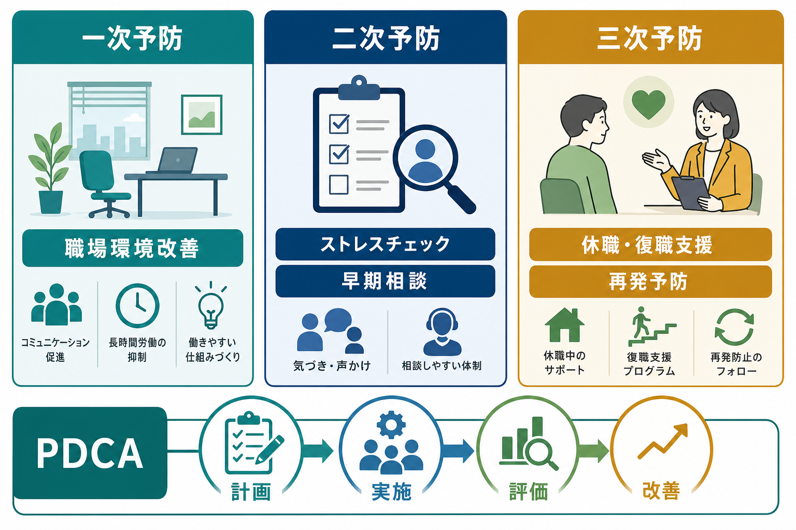

# 産業精神保健とは何か

## 要点

- 産業精神保健は、労働者のこころの健康を「本人の不調」だけでなく、仕事量、裁量、対人関係、ハラスメント、勤務制度、復職設計、法的責任を含む職場システムとして扱う領域である。
- 日本の職場メンタルヘルス対策は、厚生労働省のメンタルヘルス指針に沿って、セルフケア、ラインによるケア、事業場内産業保健スタッフ等によるケア、事業場外資源によるケアを組み合わせる[1]。
- ストレスチェックは、個人の気合いや性格を測る制度ではなく、心理的負担の把握、医師面接、集団分析、職場環境改善につなげる予防制度である[2]。
- 安全配慮義務は、使用者が労働者の生命・身体等の安全を確保しながら働けるよう必要な配慮をする義務であり、精神的健康リスクの予見と対応にも関わる[3]。
- 休職復職支援では、主治医の診断書だけで復職を決めるのではなく、業務遂行能力、就業上の配慮、職場側の受け入れ条件、復職後フォローアップを分けて検討する[4]。

## この記事で答える問い

1. 産業精神保健は、通常の精神科医療や[[就労支援とは何か]]と何が違うのか。
2. 職場のメンタルヘルス不調は、本人の治療だけでなぜ解決しないことがあるのか。
3. ストレスチェック、休職復職、安全配慮義務はどのようにつながるのか。
4. 産業医、主治医、人事労務、上司、精神保健福祉職はどのように役割分担するのか。
5. 職場での支援と個人情報保護をどう両立させるのか。

## まず結論

産業精神保健とは、労働者の精神的健康を守り、メンタルヘルス不調を予防し、不調が生じた場合にも働き続ける、休む、戻る、働き方を調整するための仕組みを設計する実践領域である。焦点は、診断名そのものよりも「どの業務が負荷になっているか」「どの働き方なら安全に遂行できるか」「誰が何を判断し、何を共有し、何を共有しないか」に置かれる。

精神科医療は主に症状、診断、治療、生活機能の回復を扱う。産業精神保健はそれに加えて、職務内容、労働時間、配置、評価、職場風土、ハラスメント、復職ルール、法令遵守を扱う。したがって、主治医が「症状は改善している」と判断しても、職場で求められる業務遂行能力が十分か、どの配慮が必要かは、産業医や事業者が別に検討する必要がある[4]。

重要なのは、産業精神保健を「会社が労働者を管理する技術」と狭く捉えないことである。適切な産業精神保健は、労働者の尊厳、健康情報の保護、合理的な就業上の配慮、組織の安全衛生責任を同時に扱う。これは[[多職種連携は地域精神医療でなぜ重要なのか]]と同じく、本人、医療、福祉、職場、制度が接点を持つ領域である。

## 背景

職場は、生活時間、収入、役割、所属感、将来設計に大きく関わる。WHOは、働くことが精神的健康を支える要因になり得る一方で、過重労働、低い裁量、不安定な雇用、差別、ハラスメントなどの劣悪な職場環境は精神的健康リスクになり得ると整理している[5]。産業精神保健は、この二面性を前提にする。仕事は回復資源にもなり、リスク源にもなる。

日本では、精神障害に関する労災補償状況が毎年公表され、仕事による強い心理的負荷と精神障害の関係が労働行政上の重要課題として扱われている[6]。ただし、労災認定は発症後の補償制度であり、産業精神保健の目標はそれだけではない。より上流では、職場環境改善、相談しやすい文化、管理監督者教育、ストレスチェックの集団分析、過重労働対策により、不調や休職に至る前のリスクを下げることが求められる。

また、休職復職の場面では、本人の治療経過と職場の判断が混同されやすい。主治医は医学的回復を評価するが、職場が求める勤務時間、集中力、対人調整、責任範囲、通勤、再発リスク、職場側の配慮可能性を完全には把握できないことが多い。厚生労働省の職場復帰支援手引きは、休業開始から復職後フォローアップまでの流れをあらかじめ明確化することを重視している[4]。

## 基本概念

### 産業精神保健

産業精神保健は、産業保健の中でも精神的健康に焦点を当てる領域である。扱う対象は、うつ病、不安症、適応反応、睡眠問題、アルコール関連問題、発達特性、ハラスメント後の不調、自殺リスクなど多様である。ただし、職場での実務では、診断名の詮索よりも、労働安全衛生上のリスクと就業上の機能評価が重要になる。

たとえば、「うつ病かどうか」だけでは、働けるかどうかは決まらない。同じ診断名でも、勤務時間、業務密度、対人負荷、裁量、通勤、薬の副作用、睡眠、上司との関係、復職後の業務設計により、必要な配慮は大きく異なる。ここで産業医、保健師、公認心理師、精神保健福祉士、人事労務、上司、外部EAP、地域医療が関わる。

### 4つのケア

厚生労働省のメンタルヘルス指針は、職場のメンタルヘルスケアを、セルフケア、ラインによるケア、事業場内産業保健スタッフ等によるケア、事業場外資源によるケアとして整理する[1]。

| ケア | 主な担い手 | 役割 |
|---|---|---|
| セルフケア | 労働者本人 | ストレスへの気づき、相談、休養、受診、働き方の振り返り |
| ラインによるケア | 上司・管理監督者 | 部下の変化への気づき、業務調整、相談導線、職場環境改善 |
| 事業場内ケア | 産業医、保健師、衛生管理者、人事労務等 | 健康相談、面接、復職判定への助言、衛生委員会、制度設計 |
| 事業場外資源 | 医療機関、EAP、地域産業保健センター等 | 専門相談、治療、外部評価、教育、地域資源への接続 |

この分類の意義は、メンタルヘルスを本人か専門家だけに閉じない点にある。本人が相談できること、上司が不調を責めずに業務調整できること、産業保健スタッフが健康情報を適切に扱うこと、外部資源につなげることが連動して初めて機能する。

### 安全配慮義務

労働契約法第5条は、使用者が労働者の生命、身体等の安全を確保しつつ労働できるよう必要な配慮をするものと定める[3]。精神的健康に関する安全配慮では、長時間労働、過大な業務量、ハラスメント、孤立、配置不適合、復職時の急激な負荷増大などが問題になり得る。

ただし、安全配慮義務は「不調者を一律に軽い仕事へ移す」ことを意味しない。必要なのは、リスクを把握し、本人の同意とプライバシーに配慮しながら、職務上必要な範囲で情報共有し、合理的な業務調整を検討し、記録を残すことである。過剰な介入も、放置も、どちらも問題になり得る。

## 仕組み

### 一次予防、二次予防、三次予防

産業精神保健の仕組みは、予防段階で整理すると理解しやすい。

| 段階 | 目的 | 例 |
|---|---|---|
| 一次予防 | 不調の発生を減らす | 長時間労働対策、職場環境改善、管理職研修、ハラスメント防止 |
| 二次予防 | 早期発見・早期対応 | ストレスチェック、相談窓口、産業医面談、高ストレス者面接 |
| 三次予防 | 休職復職・再発予防 | 休職中連絡、復職支援プラン、段階的復帰、フォローアップ |

一次予防は、最も見えにくいが重要である。職場環境が悪いまま、ストレスチェックや相談窓口だけを増やしても、労働者は「相談しても仕事は変わらない」と感じやすい。WHOの職場メンタルヘルス指針も、個人向け介入だけでなく、組織的介入、管理職研修、労働者教育、復職支援、雇用支援を含めた多層的な対策を推奨している[5]。

### ストレスチェック制度

ストレスチェック制度は、心理的な負担の程度を把握する検査と、必要に応じた医師面接、就業上の措置、集団分析を含む制度である。日本では2015年から労働安全衛生法に基づき事業者に実施が義務付けられ、労働者数50人未満の事業場は当分の間努力義務とされていたが、2025年5月に公布された改正労働安全衛生法により、50人未満の事業場にも義務化される方向となった[2]。施行期日や実務詳細は政令・省令等で確認する必要がある。

ストレスチェックで注意すべき点は、個人結果の取り扱いである。結果は原則として本人に通知され、本人の同意なく事業者に提供されない。職場改善に役立つのは、個人の点数を詮索することではなく、部署や職種など集団単位で負荷、裁量、支援の傾向を見て、業務設計やマネジメントを改善することである[2]。

### 休職復職支援

休職復職支援では、休業開始、休業中の連絡、主治医の意見、産業医面談、復職可否判断、復職支援プラン、復職後フォローアップを分ける。厚生労働省の手引きは、休業から通常業務への復帰までの流れを明確化し、事業場の状況に応じた職場復帰支援プログラムを整備することを求めている[4]。

復職判定で混乱しやすいのは、「病状が軽くなったこと」と「元の業務を安全に遂行できること」が同じではない点である。職場では、勤務時間、残業、出張、対人折衝、判断責任、夜勤、通勤負荷、繁忙期、上司との関係を具体的に確認する必要がある。復職後は、短時間勤務、業務量の段階的増加、定期面談、残業制限、配置調整、再燃サインの共有などを、必要な範囲で検討する。

ここで[[精神保健福祉士とは何をする職種なのか]]の視点が役立つ。休職が長期化すると、医療、傷病手当金、障害年金、生活支援、家族調整、職場との連絡の負担が重なりやすい。制度と生活をつなぐ支援は、治療そのものとは別の重要な回復条件になる。

## 図解

産業精神保健の実務は、単発の面談ではなく、PDCAとして設計する必要がある。

| 観点 | よくある対応 | よりよい設計 |
|---|---|---|
| 計画 | 相談窓口だけ置く | 衛生委員会で方針、情報管理、復職手順、外部連携を決める |
| 実施 | 不調者が出たら個別対応 | 管理職研修、ストレスチェック、面談導線、職場環境改善を回す |
| 評価 | 休職者数だけ見る | 部署別負荷、残業、離職、相談件数、復職後定着を複合的に見る |
| 改善 | 本人の努力不足にする | 業務量、裁量、支援、評価制度、ハラスメント対策を見直す |

## 臨床・研究との接続

臨床では、患者が「職場が原因です」と語るとき、その意味を丁寧に分解する必要がある。職場の要因には、業務量、裁量、対人関係、評価、役割曖昧性、睡眠リズム、通勤、ハラスメント、将来不安が含まれる。診療場面では、症状評価だけでなく、勤務状況、休職制度、職場への情報提供の範囲、復職希望、産業医の有無を確認することが実務上重要になる。

一方で、主治医は職場の業務遂行能力を直接観察しているわけではない。診断書に「復職可」と書く場合でも、それは医学的観点からの意見であり、最終的な就業判断や就業上の措置は事業者側の責任で検討される。主治医、産業医、人事労務が役割を混同すると、本人が板挟みになりやすい。

研究面では、産業精神保健は、心理社会的リスク、職場環境改善、ストレスチェックの集団分析、管理職研修、復職支援プログラム、合理的配慮、スティグマ低減、労働生産性、休職・復職アウトカムを扱う。WHO/ILOの政策文書は、労働者の精神的健康を、医療制度だけでなく、雇用政策、労働安全衛生、差別防止、管理職教育と接続して考える枠組みを示している[7]。

また、重い精神疾患を持つ人の就労参加では、[[IPS援助付き雇用とは何か]]や[[精神科リハビリテーションとは何か]]の知見が重要である。産業精神保健が主に雇用中の労働者の健康を扱うのに対し、就労支援やIPSは、仕事に就く、仕事を続ける、職場と支援者が連携するという回復志向の実践を担う。両者は連続している。

## よくある誤解

### 誤解1: メンタルヘルス不調は本人の弱さである

不調には個人要因も関わるが、職場の負荷、裁量、支援、役割、対人関係、ハラスメント、長時間労働も関わる。本人のセルフケアだけに還元すると、一次予防と職場環境改善が抜け落ちる。

### 誤解2: ストレスチェックを実施すれば十分である

ストレスチェックは入口であり、目的は高ストレス者への面接指導や集団分析を通じた職場環境改善である。結果を配るだけ、受検率だけを見るだけでは、制度の意義は限定される[2]。

### 誤解3: 主治医の診断書があれば復職可否は決まる

主治医の意見は重要だが、復職可否には職場で必要な業務遂行能力、就業上の配慮、職場側の受け入れ体制が関わる。産業医面談や復職支援プランは、このずれを調整するためにある[4]。

### 誤解4: 配慮は特別扱いである

就業上の配慮は、本人の健康と職場の安全を両立させるための条件設定である。無制限の免除でも、本人への甘やかしでもない。業務の本質、期間、評価方法、周囲への説明範囲を明確にすることが必要である。

### 誤解5: 職場は診断名を詳しく知る必要がある

職場に必要なのは、多くの場合、診断名そのものではなく、勤務上の制限、避けるべき負荷、可能な業務、配慮期間、再評価時期である。健康情報は目的を限定し、本人の同意と最小限共有の原則で扱う。

## 関連ノート

- [[就労支援とは何か]]
- [[IPS援助付き雇用とは何か]]
- [[精神科リハビリテーションとは何か]]
- [[精神保健福祉士とは何をする職種なのか]]
- [[多職種連携は地域精神医療でなぜ重要なのか]]
- [[地域精神医療とは何か]]
- [[危機介入とは何か]]
- [[自殺対策基本法とは何か]]
- [[学校精神保健とは何か]]

## MOC更新候補

- `content/00_MOC/` 配下の精神医学、地域精神医療、制度系MOCに追加候補。
- 並列生成ジョブとの競合を避けるため、本記事ではMOCファイル自体は更新しない。

## 理解チェック

1. 産業精神保健が、精神科診療だけではなく職場環境や制度を扱う理由を説明できるか。
2. ストレスチェックの個人結果と集団分析の扱いの違いを説明できるか。
3. 主治医、産業医、事業者、人事労務、上司の役割を分けて説明できるか。
4. 休職復職支援で「症状の改善」と「業務遂行能力」を分ける理由を説明できるか。
5. 安全配慮義務と健康情報保護が衝突しそうな場面で、最小限共有の原則を説明できるか。

## 未解決問題

- 小規模事業場でストレスチェック義務化が進む際、産業医や産業保健職が十分にいない環境でどのように実効性を担保するか。
- テレワーク、プラットフォーム労働、フリーランス的働き方における心理社会的リスクを、従来の事業場単位の安全衛生制度でどこまで扱えるか。
- 復職支援において、再発予防、本人のキャリア、職場の公正性、同僚への負担をどのようにバランスさせるか。
- ストレスチェックの集団分析を、個人の探索や責任追及ではなく、職場環境改善に結びつける実装方法。

## 参考文献

[1] 厚生労働省. 職場における心の健康づくり～労働者の心の健康の保持増進のための指針～. https://www.mhlw.go.jp/stf/seisakunitsuite/bunya/0000055195_00002.html

[2] 厚生労働省. ストレスチェック制度・メンタルヘルス対策. https://www.mhlw.go.jp/bunya/roudoukijun/anzeneisei12/

[3] Japanese Law Translation. Labor Contract Act, Article 5: Consideration to Safety of a Worker. https://www.japaneselawtranslation.go.jp/en/laws/view/1992

[4] 厚生労働省. 心の健康問題により休業した労働者の職場復帰支援の手引き. https://www.mhlw.go.jp/stf/seisakunitsuite/bunya/0000055195_00005.html

[5] World Health Organization. Guidelines on mental health at work. 2022. https://www.who.int/publications/i/item/9789240053052

[6] 厚生労働省. 令和6年度「過労死等の労災補償状況」を公表します. 2025. https://www.mhlw.go.jp/stf/newpage_59039.html

[7] World Health Organization and International Labour Organization. Mental health at work: policy brief. 2022. https://www.who.int/publications/i/item/9789240057944
