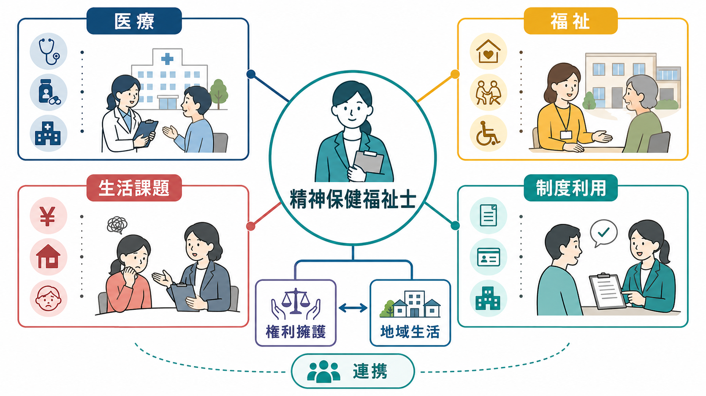
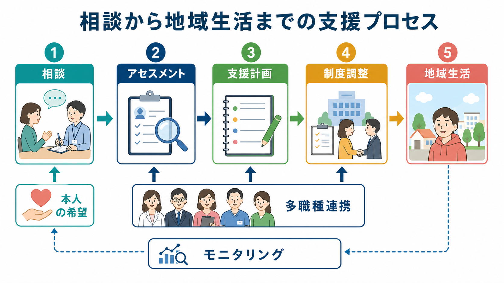
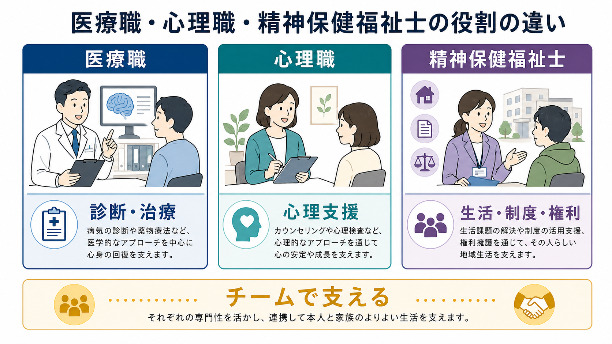

# 精神保健福祉士とは何をする職種なのか

## 要点

- 精神保健福祉士は、精神保健福祉士法に基づく国家資格であり、精神障害や精神保健上の課題を抱える人に対して、相談援助、社会復帰、地域生活、制度利用を支援する専門職である[1]。
- 中核は「治療そのもの」ではなく、本人の生活、権利、社会参加、住まい、就労、家族関係、福祉サービス利用をつなぐソーシャルワークである。
- 精神科病院、相談支援事業所、行政、精神保健福祉センター、保健所、学校、職場、司法・医療観察領域など、医療と地域の境界面で働く。
- 倫理的には、自己決定、秘密保持、権利擁護、社会的復権、多職種・多機関連携が重要である[2][3]。
- 医療・福祉・介護・住まい・就労・教育・地域の助け合いを包括的に確保する「精神障害にも対応した地域包括ケアシステム」のなかで、精神保健福祉士の調整機能は重要になる[4]。

## この記事で答える問い

この記事では、精神保健福祉士を「精神科病院にいる相談員」とだけ捉えず、[[精神保健福祉法とは何か]]、障害福祉制度、地域移行、権利擁護、[[意思決定支援とは何か]]の接点に立つ職種として整理する。個別の資格取得方法や求人情報ではなく、「何を見て、何を支援し、医療職・心理職と何が違うのか」に焦点を置く。

## まず結論

精神保健福祉士は、病気だけでなく「病気を抱えながら暮らすこと」に伴う困難を扱う職種である。たとえば、退院後の住まいがない、通院を続ける交通費や生活費が不安、家族との関係が緊張している、職場復帰の段取りが見えない、障害福祉サービスの申請方法がわからない、本人の希望が医療方針や家族の意向のなかで埋もれている、といった問題を扱う。

法律上、精神保健福祉士は「精神障害者の保健及び福祉に関する専門的知識及び技術」を用いて、地域相談支援の利用、社会復帰、精神保健に関する相談に応じ、助言、指導、日常生活への適応に必要な訓練その他の援助を行う者とされる[1]。つまり、精神保健福祉士の仕事は「本人の生活世界」と「医療・福祉制度」のあいだに橋をかけることである。

## 背景

日本の精神医療は長く入院医療中心に発展してきたが、政策上は「入院医療中心から地域生活中心へ」という方向が示されてきた。厚生労働省は、精神障害の有無や程度にかかわらず、誰もが地域の一員として安心して自分らしく暮らせるように、医療、障害福祉・介護、住まい、社会参加、地域の助け合い、教育を包括的に確保する地域包括ケアシステムを掲げている[4]。

この流れのなかで、精神保健福祉士の役割は病院内の退院調整にとどまらない。[[任意入院とは何か]]、[[措置入院とは何か]]、医療保護入院、退院後支援、地域相談支援、就労支援、家族支援、ピアサポート、司法・福祉の連携など、多くの制度と実践をつなぐ必要がある。精神保健福祉士は、制度を「説明する人」だけではなく、本人の生活課題を制度、資源、関係者の言葉に翻訳し、支援の場を組み立てる人である。

## 基本概念

### 名称独占の国家資格

精神保健福祉士は、精神保健福祉士法に基づく名称独占資格である。名称独占とは、資格を持たない人が「精神保健福祉士」という名称を用いることが制限されるという意味である[1]。医師のように特定行為そのものを独占する資格とは性質が異なり、相談援助の実践は多職種と重なる部分を持つ。

ただし、名称独占だから軽い資格ということではない。法律は、誠実義務、信用失墜行為の禁止、秘密保持義務、関係者との連携、資質向上の責務を定めている[1]。とくに秘密保持は、相談者の病歴、家族関係、経済状況、就労、住まい、犯罪被害・加害、希死念慮など、生活の深い情報を扱う職種であるため重要である。

### 対象は「疾患」ではなく「生活課題を抱える人」

精神保健福祉士は精神疾患名だけを見て支援するわけではない。同じ診断名でも、困っていることは人によって違う。薬物療法で症状が安定していても、住まい、孤立、金銭管理、就労、家族関係、偏見、制度アクセスの困難が生活を不安定にすることがある。逆に、症状が残っていても、本人に合った住まい、通院、所得保障、職場の配慮、家族外のつながりが整えば、地域生活は安定しやすくなる。

この視点は、[[精神疾患と社会機能障害はどう関係するのか]]や[[精神疾患とリカバリー志向支援はどう関係するのか]]と接続する。精神保健福祉士は「症状を消す」ことだけを支援目標にせず、本人が望む生活をどう再構成するかを考える。

### ソーシャルワークとしての位置づけ

精神保健福祉士は、精神保健福祉領域のソーシャルワーカーである。ソーシャルワーク専門職のグローバル定義では、ソーシャルワークは社会変革、社会開発、社会的結束、エンパワメントと解放を促進し、人権、社会正義、多様性尊重を中核に置く実践とされる[5]。精神保健福祉士の実践も、個人の努力不足として生活困難を処理するのではなく、制度、地域、家族、雇用、偏見、貧困、住まいの問題を含めて見る。

## 仕組み

精神保健福祉士の支援は、単発の助言ではなく、生活情報を集め、本人の希望を確認し、制度や関係機関と調整し、支援後の変化を見直すプロセスとして理解しやすい。

### 1. 相談を受ける

相談は、本人から始まることも、家族、医療職、行政、学校、職場、地域支援者から始まることもある。相談内容は、退院、通院継続、生活費、障害年金、精神障害者保健福祉手帳、障害福祉サービス、住まい、就労、家族関係、虐待、孤立、自殺リスクなど多様である。

この段階で重要なのは、問題を急いで制度名に置き換えすぎないことである。「働けないから就労支援」「退院できないから住居探し」と短絡すると、本人の希望、恐怖、過去の失敗経験、家族との関係、症状変動、金銭面の制約を見落とす。

### 2. アセスメントする

アセスメントでは、病状だけでなく、生活歴、家族・支援者との関係、収入、住まい、日中活動、社会資源、本人の価値観、リスク、強みを整理する。医療的リスクは医師・看護師・心理職と共有しつつ、精神保健福祉士は生活上のリスクと資源を見立てる。

たとえば「服薬中断がある」という情報は、医療的には再発リスクである。同時にソーシャルワーク上は、薬への不信、通院費の負担、通院先への交通、家族からの圧力、副作用による就労困難、支援者との関係不全など、複数の生活課題の入口でもある。

### 3. 支援計画と制度調整を行う

障害福祉サービスを利用する場合には、計画相談支援や地域相談支援が関係する。厚生労働省は、計画相談支援を、障害者の課題解決や適切なサービス利用に向けてケアマネジメントにより支援するものとして説明している[6]。また、精神科病院から地域生活へ移る際には、地域移行支援や地域定着支援が重要になる[6]。

精神保健福祉士は、本人の希望を支援計画に反映しながら、障害福祉サービス、医療、行政、住まい、就労支援、家族支援、地域資源を結びつける。ここでの調整は、単なる紹介ではない。関係機関の役割分担、連絡方法、緊急時対応、本人への説明、同意、情報共有の範囲を整える作業である。

### 4. 権利擁護と意思決定支援を行う

精神科医療では、入院、行動制限、家族同意、退院支援、地域移行など、本人の自由や権利と深く関わる場面がある。精神保健福祉士は、本人の意思を聞き取り、情報へのアクセスを支え、支援者側の都合だけで生活方針が決まらないように働きかける。

これは[[精神科入院で患者の権利をどう守るのか]]や[[意思決定支援とは何か]]と密接に関係する。精神保健福祉士の倫理綱領は、クライエントの基本的人権、個人としての尊厳、自己決定、プライバシー、秘密保持、社会的復権、権利擁護を重視している[3]。

### 5. 地域で支援を続ける

退院やサービス利用開始はゴールではない。地域生活では、症状変動、孤立、近隣関係、家計、就労、家族の疲弊、通院中断などが起こりうる。地域定着支援は、退院・退所後や一人暮らし移行後など、地域生活を継続するための支援として位置づけられる[6]。精神保健福祉士は、問題が起きてから介入するだけでなく、危機が大きくなる前に支援の接点を保つ。

## 図解

精神保健福祉士の役割を、医療職・心理職との比較で見ると理解しやすい。

| 観点 | 医療職 | 心理職 | 精神保健福祉士 |
|---|---|---|---|
| 主な焦点 | 診断、治療、身体・精神症状の評価 | 心理アセスメント、心理支援、面接 | 生活課題、制度利用、権利擁護、地域生活 |
| 主な問い | どの治療が必要か | どの心理的理解と支援が必要か | どう暮らし続けるか、何が障壁か |
| 扱う資源 | 医療、薬物療法、看護、リハビリ | 心理検査、心理療法、面接 | 障害福祉、所得保障、住まい、就労、行政、家族・地域 |
| 協働の要点 | 病状とリスクの共有 | 本人理解と面接方針の共有 | 支援計画、制度調整、情報共有、本人の希望の反映 |

この表は役割を固定するものではない。実際の現場では、看護師が生活支援を担い、心理職が家族支援を行い、精神保健福祉士が危機介入に関わることもある。重要なのは、精神保健福祉士が「社会資源と生活環境を含めて支援を組み立てる専門性」を持つ点である。

## 臨床・研究との接続

### 臨床では「退院できるか」ではなく「地域で暮らせるか」を問う

精神科病院では、症状が軽快しても退院が難しいことがある。住まいがない、家族が受け入れに不安を持つ、金銭管理が難しい、日中活動がない、地域の支援者がいない、本人が退院後の生活を想像できない、といった要因が関係する。精神保健福祉士は、退院可否を医学的安定だけで判断せず、生活基盤と支援ネットワークを整える。

### 地域精神医療では「支援の継ぎ目」を減らす

地域生活では、医療、障害福祉、介護、生活困窮、住宅、就労、教育、司法が分かれている。本人から見ると、どこに相談すればよいのかわからないことが多い。精神保健福祉士は、制度間の継ぎ目で情報が途切れないよう、本人の同意を得ながら支援者間の連携を保つ。法律上も、保健医療サービス、障害福祉サービス、地域相談支援などが総合的かつ適切に提供されるよう関係者との連携を保つことが求められている[1]。

### 研究ではアウトカムを生活機能と参加で見る

精神保健福祉士の実践を評価する場合、入院日数や再入院率だけでは不十分である。住まいの安定、サービス利用の継続、就労・学業・日中活動、孤立の軽減、本人の希望の反映、権利侵害の予防、主観的リカバリーなども重要なアウトカムになる。[[社会的支援は健康にどう影響するのか]]と同じく、支援の効果は症状だけでなく、人間関係と社会参加の水準にも現れる。

### 司法・制度領域との接続

精神保健福祉士は、[[医療観察法とは何か]]のような司法精神医学領域、[[自殺対策基本法とは何か]]に関わる地域支援、虐待・DV・生活困窮などの制度横断領域にも接続する。ここでは、本人の権利と公共の安全、治療継続と地域生活、支援と管理の緊張が生じやすい。精神保健福祉士は、リスクを軽視せず、しかしリスクだけで本人を定義しない立場が求められる。

## よくある誤解

### 誤解1: 精神保健福祉士はカウンセラーである

精神保健福祉士は面接を行うが、主な専門性は心理療法そのものではない。本人の語りを聞き、生活課題を整理し、制度利用、社会資源、家族・地域との関係を調整する。心理職と重なる部分はあるが、焦点はより生活環境と社会制度に向く。

### 誤解2: 退院調整だけをする職種である

退院支援は重要だが、それだけではない。外来、地域活動支援センター、相談支援事業所、行政、学校、職場、司法領域などで、発症前後から長期の地域生活まで幅広く関わる。行政領域では、精神保健福祉相談員として精神保健福祉センター、保健所、市町村等で相談や訪問支援に関わる場合がある[7]。

### 誤解3: 制度に詳しければ十分である

制度知識は必要だが、制度を当てはめるだけでは支援にならない。本人が何を望み、何を避けたいのか、どの支援なら受け入れられるのか、支援を受けることで失うものはないかを考える必要がある。制度利用は、本人の生活を支える手段であって、制度に本人を合わせることが目的ではない。

### 誤解4: 家族を説得する仕事である

家族との調整は重要だが、精神保健福祉士は本人の希望を家族の都合で置き換える職種ではない。家族の負担や不安を聞くことと、本人の権利や自己決定を守ることは両立させる必要がある。家族が支援資源である場合もあれば、本人にとって距離を取るべき関係である場合もある。

## 関連ノート

- [[精神保健福祉法とは何か]]
- [[任意入院とは何か]]
- [[措置入院とは何か]]
- [[意思決定支援とは何か]]
- [[精神科入院で患者の権利をどう守るのか]]
- [[精神疾患とリカバリー志向支援はどう関係するのか]]
- [[精神疾患と社会機能障害はどう関係するのか]]
- [[医療観察法とは何か]]
- [[自殺対策基本法とは何か]]
- [[社会的支援は健康にどう影響するのか]]

## MOC更新候補

- `content/00_MOC/` 配下に制度・地域精神医療の MOC がある場合、本記事を「精神保健福祉法・地域移行・権利擁護」周辺に追加する。
- 並列生成ジョブとの衝突を避けるため、この作業では MOC 本体は更新していない。

## 理解チェック

1. 精神保健福祉士が扱う「生活課題」には、症状以外にどのようなものが含まれるか。
2. 精神保健福祉士と心理職の違いを、「焦点」と「使う資源」の観点から説明できるか。
3. 地域移行支援と地域定着支援は、精神保健福祉士の実践とどのように関係するか。
4. 権利擁護と意思決定支援が、精神科医療のどの場面で重要になるか。
5. 「制度利用」は目的ではなく手段である、という意味を説明できるか。

## 未解決問題

- 精神保健福祉士の業務範囲は現場ごとに広く、病院、行政、相談支援事業所、学校、司法領域で求められる技能がかなり異なる。
- 地域移行や地域定着の成果は、医療側の指標だけでは測りにくく、本人の主観的リカバリー、孤立、住まい、就労、権利擁護を含む評価が必要である。
- 支援と管理、リスク対応と自己決定支援の緊張を、現場でどのように調整するかは継続的な課題である。

## 参考文献

[1] 厚生労働省. 精神保健福祉士について. https://www.mhlw.go.jp/stf/seisakunitsuite/bunya/hukushi_kaigo/shougaishahukushi/seisinhoken/index.html  

[2] e-Gov法令検索. 精神保健福祉士法（平成9年法律第131号）. https://laws.e-gov.go.jp/law/409AC0000000131  

[3] 公益社団法人日本精神保健福祉士協会. 精神保健福祉士の倫理綱領. https://www.jamhsw.or.jp/syokai/rinri/japsw.htm  

[4] 厚生労働省. 精神障害にも対応した地域包括ケアシステムの構築について. https://www.mhlw.go.jp/stf/seisakunitsuite/bunya/chiikihoukatsu.html  

[5] 日本ソーシャルワーカー連盟. ソーシャルワーク専門職のグローバル定義. https://jfsw.org/definition/global_definition/  

[6] 厚生労働省. 障害のある人に対する相談支援について. https://www.mhlw.go.jp/stf/seisakunitsuite/bunya/hukushi_kaigo/shougaishahukushi/service/soudan_shien.html  

[7] 厚生労働省. 精神保健福祉相談員について. https://www.mhlw.go.jp/stf/seisakunitsuite/bunya/seishinhokenfukushisoudanin.html
