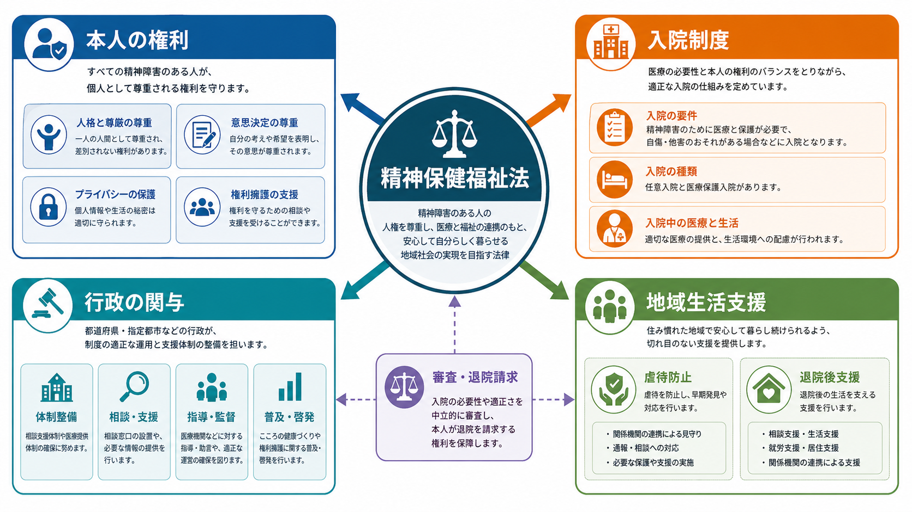
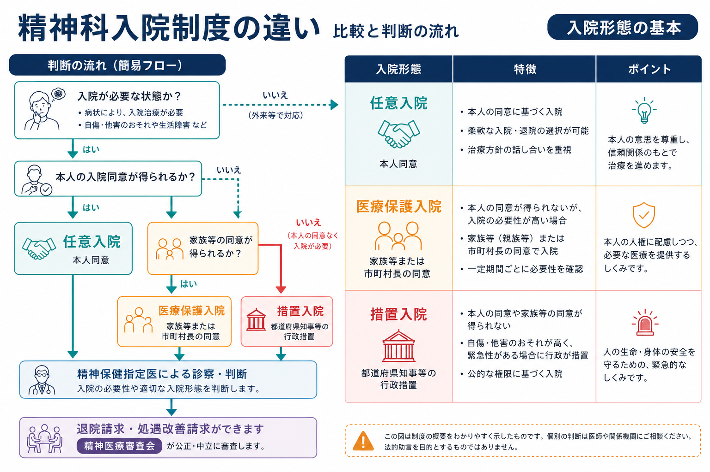
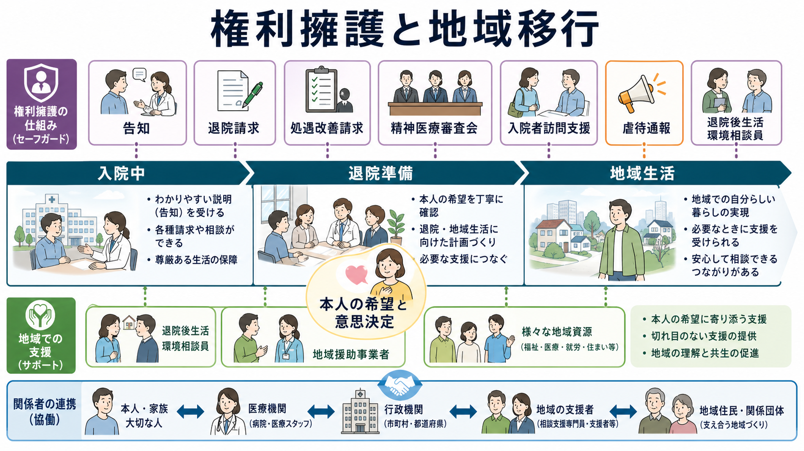

# 精神保健福祉法とは何か

## 要点

- 精神保健福祉法は、精神障害のある人の医療、保護、福祉、社会参加、権利擁護を扱う日本の基幹法である。正式名称は「精神保健及び精神障害者福祉に関する法律」である[1]。
- 精神科入院では、本人同意に基づく任意入院を基本にしつつ、本人同意によらない医療保護入院・措置入院などを、要件と手続きに基づいて限定的に認めている[1]。
- 重要なのは「入院させる法律」としてだけでなく、告知、退院請求、処遇改善請求、精神医療審査会、入院者訪問支援、虐待防止、退院後支援を含む権利擁護の制度として読むことである[1][2]。
- 臨床では、急性期の安全確保と治療だけでなく、本人の意思、説明と同意、家族等の関与、地域生活への移行、多職種連携を同時に設計する必要がある。
- この記事は教育・研究目的の概説であり、個別事例の法的判断や入院要否の指示ではない。

## この記事で答える問い

1. 精神保健福祉法は、精神科医療の何を決めているのか。
2. 任意入院、医療保護入院、措置入院はどう違うのか。
3. 本人の権利は、入院制度の中でどのように守られるのか。
4. 行政、病院、家族等、地域支援者はどのように関与するのか。
5. 臨床・研究では、この法律をどのような視点で扱うべきか。

## まず結論

精神保健福祉法は、精神科医療において「治療の必要性」「本人の権利」「公共的な安全」「地域生活支援」を調整する制度である。入院制度だけを覚えると、法律の全体像を見失いやすい。むしろ中心に置くべきなのは、本人の意思と尊厳をできる限り尊重しながら、必要な医療と生活支援につなぎ、同意によらない制限が必要になる場合には法定手続きと第三者的な審査で歯止めをかける、という考え方である[1][2]。

## 背景

日本の精神科医療は、長期入院、本人同意によらない入院、家族の役割、地域資源の不足、権利擁護の弱さといった論点を抱えてきた。そのため精神保健福祉法は、単なる病院管理の規則ではなく、医療と福祉、行政手続き、人権保障をまたぐ制度として発展してきた。

近年の改正では、医療保護入院の定期的な見直し、入院者訪問支援、虐待防止、退院後支援などが強調されている。厚生労働省は令和4年改正について、精神障害者の希望やニーズに応じた支援体制の整備、医療保護入院の見直し、精神科病院における虐待防止などを含むものとして整理している[2]。これは、国際的にも、障害者権利条約や WHO が強調する「本人中心」「地域生活」「権利基盤型の支援」と接続する課題である[6][7]。

## 基本概念

### 精神障害者

精神保健福祉法上の「精神障害者」は、統合失調症、精神作用物質による急性中毒またはその依存症、知的障害、精神病質その他の精神疾患を有する者とされる[1]。臨床診断名と完全に同じ範囲ではなく、制度運用上の概念である点に注意する。

### 任意入院

任意入院は、本人の同意に基づく入院である。本人が入院の意味を理解し、入院に同意していることが前提になる。精神科医療では、可能な限り本人同意に基づく入院を基本にするという考え方が重要である[1]。[[インフォームドコンセントは精神科でどう行うのか|インフォームドコンセント]]の実践とも直結する。

### 医療保護入院

医療保護入院は、本人の同意が得られない場合でも、精神保健指定医の診察により入院治療が必要と判断され、家族等または市町村長の同意など、法定の要件を満たすときに行われる入院形態である[1][3]。令和4年改正では、医療保護入院の期間や定期的な確認、退院支援の仕組みが見直されている[2]。

### 措置入院

措置入院は、自傷他害のおそれがある場合に、都道府県知事等が行政処分として行う入院である[1]。医療保護入院よりも公権力の関与が明確であり、本人同意や家族等の同意ではなく、行政による判断と手続きが中心になる。臨床では、危機対応、[[守秘義務とは何か|守秘義務]]、安全確保、地域連携が同時に問題になる。

### 精神保健指定医

精神保健指定医は、本人の同意によらない入院や行動制限など、重大な権利制限を伴う局面で専門的判断を担う医師である。指定医の判断は重要だが、それだけで権利擁護が完結するわけではない。説明、記録、告知、審査、請求権、退院支援が組み合わされる必要がある。

## 仕組み

精神保健福祉法の仕組みは、次の四つの層で理解すると整理しやすい。

| 層 | 中心となる問い | 主な制度 |
|---|---|---|
| 入院の入口 | 入院治療は必要か。本人同意はあるか。 | 任意入院、医療保護入院、措置入院 |
| 入院中の権利 | 本人は理由と権利を知らされているか。処遇は適切か。 | 告知、通信・面会、退院請求、処遇改善請求 |
| 第三者的審査 | 病院内判断だけで閉じていないか。 | 精神医療審査会、行政への届出・報告 |
| 地域への出口 | 入院が長期化していないか。退院後の生活支援はあるか。 | 退院後生活環境相談員、地域援助事業者、退院後支援、入院者訪問支援 |

厚生労働省が示す入院関係の様式には、医療保護入院届、退院届、定期病状報告、退院請求、処遇改善請求などが含まれており、制度が「入院時の判断」だけでなく「入院後の継続的確認」を前提にしていることがわかる[3]。

### 権利擁護の回路

本人の権利擁護は、抽象的な理念だけでなく、具体的な回路として設計されている。たとえば、入院時には入院形態や権利について告知される必要があり、本人や家族等は退院請求や処遇改善請求を行うことができる。精神医療審査会は、入院継続や処遇について第三者的に審査する役割を担う[1][3]。

さらに、令和4年改正後の制度では、入院者訪問支援事業が位置づけられた。これは、市町村長同意による医療保護入院者など、支援者とのつながりが乏しい入院者に対して、外部の支援員が訪問し、本人の話を聞き、必要な情報提供や相談につなぐ仕組みである[4]。病院内だけで本人の声を完結させないための制度として重要である。

### 虐待防止

精神科病院内の虐待防止も重要な論点である。令和4年改正では、精神科病院の管理者に対し、虐待防止措置や虐待を受けたと思われる精神障害者を発見した場合の通報などが制度化された[2][5]。これは、閉鎖的になりやすい入院環境で、本人の尊厳と安全を守るための仕組みである。

## 臨床・研究との接続

### 臨床との接続

臨床では、精神保健福祉法を「書類の法律」として扱うだけでは不十分である。入院形態の選択は、診断名だけで決まるのではなく、本人の状態、意思決定能力、治療必要性、自傷他害リスク、家族等の関与、地域資源、退院可能性を総合して判断される。

たとえば、急性精神病状態で本人が強く入院を拒否している場合でも、ただちに医療保護入院や措置入院になるわけではない。本人にわかる形で説明し、同意可能性を探り、身体疾患や物質使用、せん妄、トラウマ、家族関係、住居、経済的困難を確認する必要がある。[[精神科で多職種連携はなぜ重要なのか|多職種連携]]は、この制度判断を生活支援に接続するために不可欠である。

### 研究との接続

研究上は、入院形態、在院期間、再入院、退院後支援、本人満足、権利擁護、虐待防止、地域移行のアウトカムが重要になる。ただし、制度データだけでは本人の生活の質や意思決定の経験を十分に測れない。障害者権利条約は、障害のある人が自由と安全を享有し、障害の存在のみを理由に自由を奪われないことを求めている[6]。WHO も、精神保健サービスを病院中心から地域に根ざした、本人中心・権利基盤型の支援へ転換する必要性を強調している[7]。

したがって研究では、単に「入院を減らす」「退院を早める」だけでなく、危機時の安全、本人の希望、地域での継続支援、孤立の予防、支援者負担、差別やスティグマの軽減を同時に評価する必要がある。

## よくある誤解

### 誤解1: 精神保健福祉法は「強制入院の法律」である

本人同意によらない入院制度は重要な部分だが、それだけではない。精神保健福祉法は、精神保健、福祉、社会参加、権利擁護、地域支援、虐待防止も扱う。入院制度は、その中の一部である[1][2]。

### 誤解2: 家族が希望すれば医療保護入院になる

医療保護入院は、家族等の意向だけで決まる制度ではない。精神保健指定医の診察、入院治療の必要性、本人同意が得られないこと、家族等または市町村長の同意など、法定要件が必要である[1][3]。

### 誤解3: 措置入院は「危ない人」を隔離する制度である

措置入院は、自傷他害のおそれに対する行政措置だが、目的は処罰や排除ではなく、必要な医療と安全確保である。退院後には地域支援へ接続することが重要であり、[[司法精神医学とは何か|司法精神医学]]や危機介入の視点とも関係する。

### 誤解4: 権利擁護は治療の妨げになる

権利擁護は治療と対立するものではない。説明、意思確認、退院請求、処遇改善請求、外部訪問、虐待防止は、本人が治療を理解し、信頼関係の中で回復に向かうための条件でもある。

## 関連ノート

- [[司法精神医学とは何か]]
- [[インフォームドコンセントは精神科でどう行うのか]]
- [[守秘義務とは何か]]
- [[精神科で多職種連携はなぜ重要なのか]]
- [[精神科におけるチーム医療とは何か]]
- [[精神医学における回復とは何か]]
- [[精神疾患とスティグマはどう関係するのか]]

## 理解チェック

1. 任意入院、医療保護入院、措置入院は、本人同意、判断主体、行政関与の点でどう違うか。
2. 医療保護入院を「家族の同意による入院」とだけ説明すると、何が抜け落ちるか。
3. 退院請求、処遇改善請求、精神医療審査会は、どのような権利擁護の回路になっているか。
4. 入院者訪問支援は、病院内の支援だけでは補いにくいどの問題に対応する制度か。
5. 退院後支援を研究する場合、再入院率以外にどのようなアウトカムを見るべきか。

## 関連ノート候補・MOC更新候補

- 関連ノート候補: 「医療保護入院とは何か」「措置入院とは何か」「精神医療審査会とは何か」「入院者訪問支援とは何か」「地域移行支援とは何か」
- MOC更新候補: `content/00_MOC/` 配下の精神医学、司法・制度・地域精神医療、臨床実践関連 MOC。並列ジョブとの競合回避のため、本記事作成時点では MOC 本体を更新しない。

## 未解決問題

- 本人同意によらない入院をどこまで減らし、危機時の安全確保とどう両立するか。
- 医療保護入院の家族等同意、市町村長同意、本人の意思決定支援をどのように運用すべきか。
- 精神医療審査会や入院者訪問支援が、本人の実質的な発言権にどの程度つながっているか。
- 長期入院から地域生活への移行を、住居、所得、就労、ピアサポート、身体医療とどう統合するか。
- 権利擁護、虐待防止、治療継続、再入院予防を同時に評価できる研究指標をどう設計するか。

## 参考文献

[1] e-Gov法令検索. 精神保健及び精神障害者福祉に関する法律（昭和二十五年法律第百二十三号）. https://laws.e-gov.go.jp/law/325AC1000000123

[2] 厚生労働省. 令和4年精神保健福祉法改正に関する情報. https://www.mhlw.go.jp/stf/seisakunitsuite/bunya/hukushi_kaigo/shougaishahukushi/kaisei_seisin/index_00003.html

[3] 厚生労働省. 入院制度等に関する各種様式. https://www.mhlw.go.jp/stf/seisakunitsuite/bunya/hukushi_kaigo/shougaishahukushi/seishinnyuin.html

[4] 厚生労働省. 入院者訪問支援事業について. https://www.mhlw.go.jp/stf/seisakunitsuite/bunya/chiikihoukatsu_00003.html

[5] 厚生労働省. 精神科病院における業務従事者による障害者虐待の状況等について. https://www.mhlw.go.jp/stf/newpage_68786.html

[6] 外務省. 障害者の権利に関する条約. https://www.mofa.go.jp/mofaj/gaiko/jinken/index_shogaisha.html

[7] World Health Organization. (2021). *Guidance on community mental health services: promoting person-centred and rights-based approaches*. https://www.who.int/publications/i/item/9789240025707
