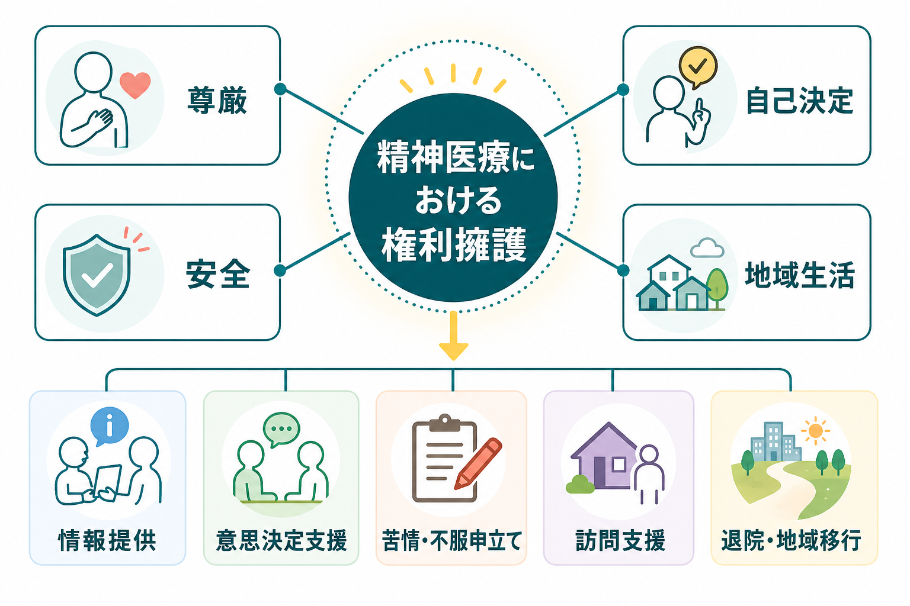
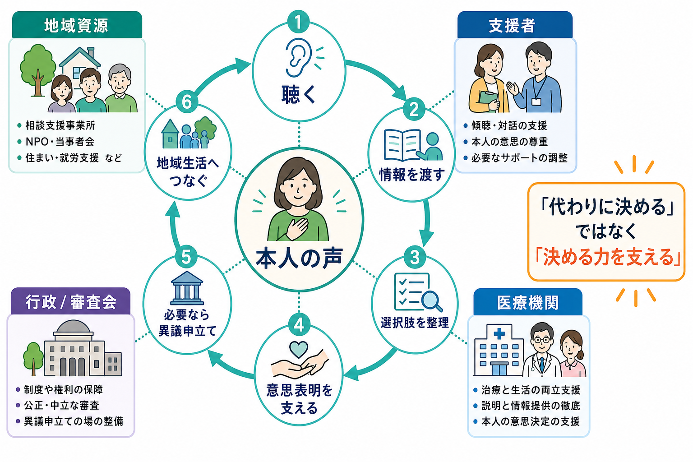
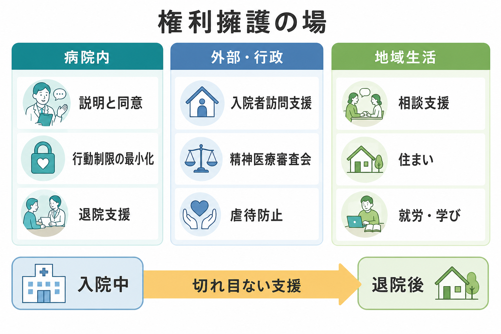

# 精神医療における権利擁護とは何か

## 要点

- 精神医療における権利擁護とは、本人を「保護される対象」だけでなく、尊厳・意思・生活史をもつ権利主体として扱い、必要な支援と制度を通じてその権利行使を可能にする実践である。
- 中心は、説明と同意、[[意思決定支援とは何か|意思決定支援]]、通信・面会、退院請求・処遇改善請求、入院者訪問支援、虐待防止、[[地域移行支援とは何か|地域移行支援]]である。
- 権利擁護は「医療を妨げる活動」ではない。むしろ、治療の必要性・安全確保・本人の自由を透明な手続きで結び、信頼を損なわないための条件である。
- 非自発的入院や行動制限が問題になる場面ほど、記録、説明、再評価、外部に開かれた相談経路が重要になる。
- この記事は教育・研究目的の整理であり、個別事案の法的助言や治療指示ではない。

## この記事で答える問い

1. 精神医療でいう権利擁護は、何を守る実践なのか。
2. 本人の自己決定と安全確保が緊張するとき、どのように考えるのか。
3. 日本の精神保健福祉制度には、どのような権利擁護の仕組みがあるのか。
4. 臨床・研究・地域生活支援では、どこに注意すべきなのか。

## まず結論

精神医療における権利擁護は、本人の希望をそのまま通すことでも、医療者が本人の代わりに「正しい答え」を決めることでもない。本人が理解し、表明し、異議を述べ、支援を選び直せる条件を整えることである。

障害者権利条約は、障害のある人の固有の尊厳、自律、社会参加、法律の前の平等、自立した生活と地域社会への包容を重視する[1]。WHO QualityRights も、精神保健医療を人権とリカバリーの観点から変革するため、支援者・当事者・家族・サービス提供者が権利とリカバリーを促進する能力を高めることを目標にしている[2]。この方向から見れば、権利擁護は「病院内の苦情処理」だけではなく、入院前、入院中、退院後、地域生活まで続く支援の設計原理である。

## 背景

精神医療では、本人が強い苦痛、混乱、希死念慮、被害感、判断の揺らぎ、孤立を抱えていることがある。急性期には、本人や周囲の安全確保が優先される場面もある。しかし、そのことは本人の権利を後景化してよい理由にはならない。むしろ、自由を制限する可能性がある医療だからこそ、権利擁護は通常の医療以上に明示的でなければならない。

日本では、令和4年の精神保健福祉法改正について、厚生労働省が「精神障害者の権利擁護を図る」ことと、希望やニーズに応じた地域生活支援を強化することを改正趣旨として説明している[4]。また、医療保護入院や措置入院など本人の同意に基づかない入院では、意思決定・意思表明の支援が弱くなりやすい。厚生労働省の入院者訪問支援事業は、特に医療機関外との面会交流が途絶えやすい入院者に対し、傾聴、生活相談、情報提供を行う仕組みとして位置づけられている[5]。

## 基本概念

### 尊厳

尊厳とは、症状、診断名、入院形態、生活能力によって本人の価値が下がらないという前提である。精神医療では、本人の言葉が断片的であったり、現実検討が揺らいでいたりしても、その人の苦痛、恐怖、希望、生活上の意味を聴く必要がある。尊厳を守るとは、丁寧な呼称、プライバシー、説明、同意、面会、通信、記録へのアクセス、苦情申立ての機会を、日常の手続きとして確保することである。

### 自己決定と意思決定支援

自己決定は「一人で決めること」ではない。多くの人は、家族、友人、専門職、経験者、制度情報を使いながら決めている。精神医療で重要なのは、本人の判断能力を固定的に評価して終わることではなく、理解しやすい説明、時間、安心できる場、信頼できる支援者、複数の選択肢を用意し、本人が決める力を発揮しやすい条件を作ることである[3]。

### 代弁と独立性

権利擁護には、本人の意思表明を支える支援と、必要に応じて本人の視点を制度に届ける代弁が含まれる。ただし、代弁者が医療機関や家族の都合を本人の意思に置き換えると、権利擁護ではなく代理的な管理になってしまう。独立性、利益相反の確認、本人との継続的な確認が必要である。

### 地域生活

権利擁護は、入院中の権利だけを扱うものではない。住まい、生活費、仕事・学び、家族関係、支援者との関係、孤立の予防まで含む。厚生労働省は、精神障害にも対応した地域包括ケアシステムについて、精神障害の有無や程度にかかわらず、誰もが地域の一員として安心して自分らしく暮らせることを理念としている[7]。したがって、[[精神科入院で患者の権利をどう守るのか|入院中の権利擁護]]は、退院後の生活基盤と切り離せない。

## 仕組み

### 1. 説明と同意

診断、治療選択肢、薬物療法の利益と不利益、入院形態、退院の見通し、相談先、請求手続きは、本人が理解できる形で説明される必要がある。説明は一度で終わらない。急性期の苦痛が強い時期には、落ち着いた後に再説明し、本人の理解と希望を更新することが重要である。

### 2. 退院請求・処遇改善請求

精神保健福祉法には、精神科病院に入院中の者などが、都道府県知事に対して退院や処遇改善を求めることができる仕組みがある。請求を受けた都道府県知事は、精神医療審査会に審査を求めることになる[6]。これは、病院内の説明だけでは解決しにくい不服を、外部の審査に接続する重要な回路である。

### 3. 入院者訪問支援

入院者訪問支援事業は、医療機関外との面会交流が途絶えやすい人に、訪問支援員が会い、本人の体験や気持ちを丁寧に聴き、生活相談や情報提供を行う仕組みである[5]。これは治療方針を決める制度ではなく、本人が孤立せず、自分の状況を言葉にし、制度情報にアクセスするための支援である。

### 4. 行動制限の最小化

[[隔離とは何か|隔離]]や[[身体拘束とは何か|身体拘束]]などの行動制限は、本人の自由、尊厳、治療関係に大きな影響を与える。強制的処遇に関する倫理レビューでは、強制は自由や意思決定を制限するため、必要性、比例性、最後の手段、最小制限、再評価といった手続き上の価値が重要だと整理されている[8]。精神医療での権利擁護は、「危険があるか」だけでなく、「より制限の少ない方法を試したか」「解除条件を明確にしたか」「本人に説明したか」を問う。

### 5. 虐待防止と苦情対応

権利擁護には、暴力、暴言、性的侵害、経済的搾取、ネグレクト、不適切な隔離・拘束を防ぐ仕組みも含まれる。本人が訴えにくい環境では、苦情箱や相談窓口だけでは足りない。外部相談、訪問支援、第三者評価、記録監査、職員教育が組み合わさる必要がある。

## 図解

3枚目の図は、権利擁護を「病院内」「外部・行政」「地域生活」の三つの場で見るための整理である。入院中の説明・同意、行動制限最小化、退院支援は病院内で始まるが、精神医療審査会、入院者訪問支援、虐待防止の仕組みと接続してはじめて、本人の声が病院外にも届く。さらに、住まい、相談支援、就労・学びが整わなければ、退院は「病院を出ること」で止まり、地域生活の権利には届かない。

| 場 | 主な権利擁護 | 失敗しやすい点 | 確認する問い |
|---|---|---|---|
| 病院内 | 説明、同意、通信・面会、行動制限の最小化 | 医療上の必要性だけで本人の理解や異議が後回しになる | 本人は何を理解し、何に納得していないか |
| 外部・行政 | 退院請求、処遇改善請求、精神医療審査会、入院者訪問支援 | 手続きが本人に伝わらず、使える制度にならない | 本人は相談先と請求方法を知っているか |
| 地域生活 | 住まい、相談支援、就労・学び、ピアサポート | 退院後の孤立や生活基盤不足が再入院リスクになる | 本人が望む暮らしに必要な支援は何か |

## 臨床・研究との接続

臨床では、権利擁護を「同意書を取る」「制度説明を渡す」だけに縮めないことが重要である。本人がその説明を理解できたか、質問できたか、異議を述べられたか、選択肢を比較できたか、支援者を選べたかを確認する必要がある。特に[[医療保護入院とは何か|医療保護入院]]、[[措置入院とは何か|措置入院]]、[[応急入院とは何か|応急入院]]では、本人の同意に基づかない要素が含まれるため、権利擁護の密度を高める必要がある。

研究では、権利擁護を個別の倫理的態度としてだけでなく、測定可能な制度・環境要因として扱える。たとえば、退院請求の利用可能性、入院者訪問支援へのアクセス、行動制限の頻度、説明文書の理解しやすさ、ピアサポートの有無、地域移行後の住まいの安定性などである。権利擁護を評価する研究は、本人の主観的経験を中心に置く必要がある。強制的処遇は客観的な安全指標だけでなく、恐怖、屈辱、信頼の喪失として経験されることがあるためである[8]。

## よくある誤解

### 誤解1: 権利擁護は治療の邪魔である

権利擁護は治療を止めるためのものではない。治療の必要性を本人に伝え、本人の疑問や不服を扱い、必要な制限を透明化するための仕組みである。説明と異議申立ての回路があるほど、治療関係は維持されやすい。

### 誤解2: 本人に判断能力がないなら権利擁護は不要である

判断能力が揺らぐ場面ほど、支援の必要性は高くなる。支援は、情報を減らすことではなく、理解しやすくし、時間を置き、本人の価値観や生活史から選択の意味を探ることである[3]。

### 誤解3: 家族や専門職が善意で決めれば十分である

善意は重要だが、本人の意思の代替にはならない。家族・専門職・行政にはそれぞれの立場や制約があるため、本人の声を確認し続け、利益相反を意識し、外部の相談経路を確保する必要がある。

### 誤解4: 退院すれば権利擁護は終わる

退院は権利擁護の終点ではない。地域で暮らすための住まい、医療、福祉、社会参加、相談支援が整わなければ、本人の選択肢は実質的に狭いままである。権利擁護は[[地域定着支援とは何か|地域定着支援]]や[[精神障害者保健福祉手帳とは何か|精神障害者保健福祉手帳]]などの生活支援とも接続する。

## 関連ノート

- [[意思決定支援とは何か]]
- [[精神科入院で患者の権利をどう守るのか]]
- [[精神保健福祉法とは何か]]
- [[医療保護入院とは何か]]
- [[措置入院とは何か]]
- [[精神科医療における行動制限最小化とは何か]]
- [[身体拘束とは何か]]
- [[隔離とは何か]]
- 入院者訪問支援とは何か（今後の作成候補）
- [[地域移行支援とは何か]]
- [[地域定着支援とは何か]]
- [[精神保健福祉士とは何をする職種なのか]]

## 理解チェック

1. 精神医療における権利擁護は、単なる苦情処理とどう違うか。
2. 意思決定支援と代理決定の違いは何か。
3. 非自発的入院や行動制限の場面で、どのような手続きが本人の権利を守るか。
4. 入院者訪問支援は、本人にとってどのような意味をもつか。
5. 地域生活の支援が不十分な場合、退院後の権利擁護にどのような問題が生じるか。

## 未解決問題

- 入院者訪問支援を、地域差なく利用できる制度としてどう整備するか。
- 本人の意思が揺らぐ急性期に、意思決定支援の質をどのように評価するか。
- 強制的処遇を減らす取り組みを、安全確保と両立させながら、どの指標で検証するか。
- ピアサポートや独立アドボカシーを、医療機関から独立しつつ継続可能な形で運営するには何が必要か。

## MOC更新候補

- `content/00_MOC/` 配下の精神医学、司法・制度・地域精神医療、地域精神保健に関する MOC に追加候補。
- 並列ジョブとの衝突を避けるため、本記事では MOC 本体は更新しない。

## 参考文献

[1] 外務省. 障害者の権利に関する条約. https://www.mofa.go.jp/mofaj/gaiko/jinken/index_shogaisha.html

[2] World Health Organization. QualityRights materials for training, guidance and transformation. 2019. https://www.who.int/mental_health/policy/quality_rights/en/

[3] World Health Organization. WHO QualityRights module on supported decision-making and advance planning. 2019. https://www.who.int/publications-detail-redirect/9789241516761

[4] 厚生労働省. 令和4年精神保健及び精神障害者福祉に関する法律の一部改正について. https://www.mhlw.go.jp/stf/seisakunitsuite/bunya/hukushi_kaigo/shougaishahukushi/kaisei_seisin/index_00003.html

[5] 厚生労働省. 入院者訪問支援事業について. https://www.mhlw.go.jp/stf/seisakunitsuite/bunya/chiikihoukatsu_00003.html

[6] Japanese Law Translation. 精神保健及び精神障害者福祉に関する法律. https://www.japaneselawtranslation.go.jp/ja/laws/view/4235

[7] 厚生労働省. 精神障害にも対応した地域包括ケアシステムの構築について. https://www.mhlw.go.jp/stf/seisakunitsuite/bunya/chiikihoukatsu.html

[8] Chieze M, Clavien C, Kaiser S, Hurst S. Coercive Measures in Psychiatry: A Review of Ethical Arguments. *Frontiers in Psychiatry*. 2021;12:790886. https://doi.org/10.3389/fpsyt.2021.790886
