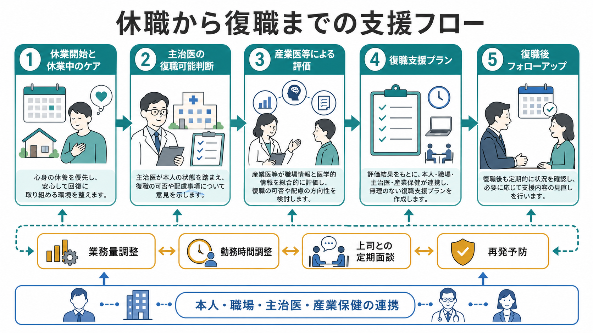
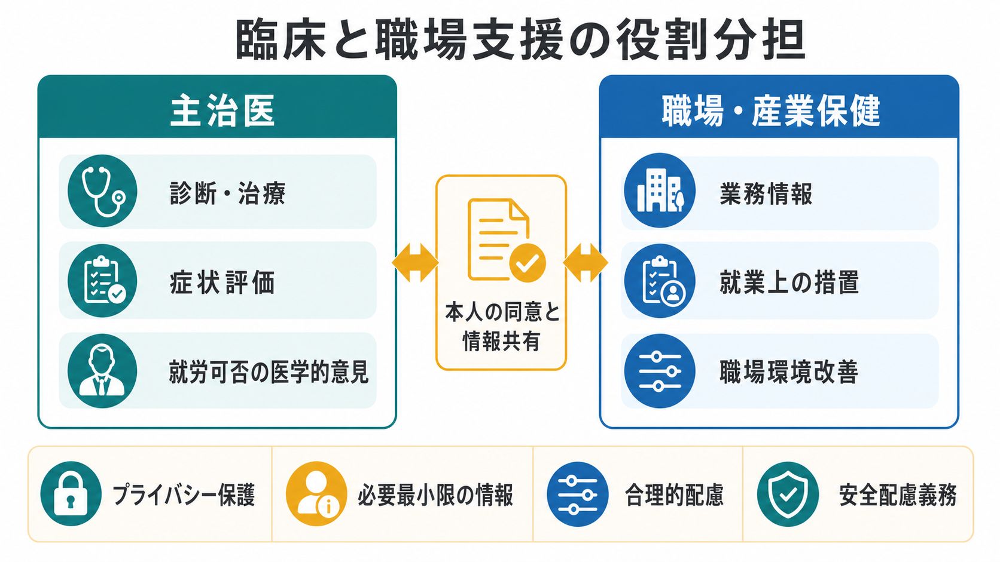
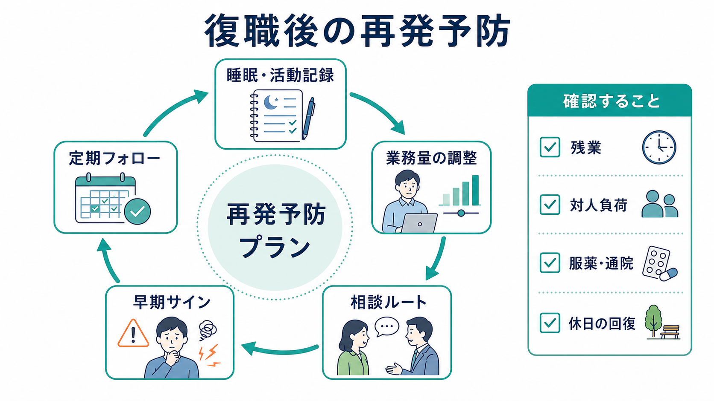

# 精神科における休職復職支援とは何か

## 要点

- 休職復職支援は、単に「診断書を書いて休ませる」「治ったら戻す」作業ではない。症状、生活リズム、業務遂行能力、職場負荷、本人の希望、職場の配慮可能性をすり合わせる継続的な支援である。
- 厚生労働省の職場復帰支援の手引きは、休業開始から通常業務への復帰までの流れを明確にし、主治医、産業医等、事業者、本人が連携して段階的に判断する考え方を示している[1]。
- WHO は、メンタルヘルス不調のある労働者への支援として、合理的配慮、段階的復職、臨床ケアを組み合わせた return-to-work programmes を推奨枠組みに含めている[2]。
- 復職支援の効果は「症状が何点下がったか」だけでなく、病気休業日数、就労継続、再休職、職場機能、本人の納得感で評価する必要がある[3][4]。
- リワークは、復職前に生活リズム、認知・対人・作業耐性、ストレス対処、再発予防計画を練習する支援であり、日本ではうつ病・気分障害圏の再休職予防との関連が研究されている[5][6]。

## この記事で答える問い

1. 精神科における休職復職支援は、どの範囲までを含むのか。
2. 診断書、職場調整、産業保健、リワークはどのように分担されるのか。
3. 復職可否は、症状の有無だけで決めてよいのか。
4. 復職後の再発予防では何を観察し、何を調整するのか。
5. 臨床研究では、休職復職支援の効果をどのように評価しているのか。

## まず結論

精神科における休職復職支援とは、メンタルヘルス不調によって働き続けることが難しくなった人に対して、休養、治療、生活リズムの回復、職場情報の整理、診断書作成、職場調整、リワーク、復職後フォローを連続したプロセスとして組み立てる支援である。中心にあるのは、「病名」ではなく「その人が、どの条件なら安全に、持続的に、尊厳を保って働けるか」という問いである。

復職支援では、主治医が医学的状態を評価し、職場は業務内容や負荷を整理し、産業医等が医学的情報と職場情報を統合し、本人が希望と困難を言語化する。精神科医療だけで完結する支援でも、職場だけで完結する労務管理でもない。[[就労支援とは何か]]や[[精神科リハビリテーションとは何か]]と同じく、治療、生活、制度、職場環境の境界にある実践である。

## 背景

うつ病、不安症、適応上の問題、双極症、発達特性に伴う二次的な不調などでは、症状そのものに加えて、睡眠リズムの乱れ、集中困難、判断疲労、対人過敏、通勤負荷、残業、職場内葛藤が就労継続を難しくする。WHO は、過大な業務量、低い裁量、長時間または柔軟性の乏しい勤務、支援の乏しさ、ハラスメント、役割不明確性などを職場メンタルヘルスの心理社会的リスクとして整理している[2]。

日本の実務では、休職に入る時点で主治医の診断書が求められ、復職時にも「就労可能」「復職可」などの医学的意見が求められることが多い。しかし、診断書は職場の業務内容を直接決める書類ではない。主治医が把握しやすいのは症状、治療経過、生活状況、医学的リスクであり、職場の実際の負荷、配置、残業、対人関係、評価制度、通勤条件は職場側・産業保健側の情報が必要になる。

そのため、復職支援の難しさは「症状が改善したか」だけでなく、「改善した状態を、どの職場条件なら保てるか」にある。厚生労働省の手引きも、休業開始から職場復帰、復帰後フォローまでの流れを事業場内であらかじめ整備することを重視している[1]。

## 基本概念

### 休職

休職は、医学的には治療と回復の時間を確保する局面であり、労務上は就業規則や雇用契約に基づく就労免除の局面である。精神科では、本人の症状が強い時期に「働きながら治す」ことがかえって回復を遅らせる場合がある。急性期には睡眠、食事、活動量、服薬、心理的安全を整えることが優先される。

ただし、休職は単なる空白期間ではない。復職を視野に入れるなら、休養期、回復期、復職準備期、復職後フォロー期を区別する必要がある。休養期に復職計画を急ぎすぎると悪化しやすく、回復期に何も準備しないまま復職すると、職場負荷で再燃しやすい。

### 診断書

診断書は、主治医が医学的観点から、休業の必要性、就労上の配慮、通院継続の必要性などを職場へ伝えるための文書である。重要なのは、診断名を詳細に伝えることではなく、本人の同意に基づいて、就業判断に必要な最小限の情報を共有することである。

診断書に書けることは、たとえば「一定期間の休養を要する」「段階的な勤務時間延長が望ましい」「夜勤・長時間残業は当面避けることが望ましい」「定期通院のための配慮を要する」などである。一方で、具体的な配置転換や業務命令そのものは職場の権限であり、主治医が単独で決定するものではない。

### 職場調整

職場調整とは、本人の能力を低く見積もることではなく、再発・再休職を防ぎながら就労を持続させるために、業務量、勤務時間、対人負荷、裁量、休憩、通院、指示系統、評価方法を調整することである。雇用分野では、障害者雇用促進法に基づき、障害のある労働者に対して過重な負担にならない範囲で合理的配慮を提供する考え方も整理されている[8]。

精神科領域の配慮は、固定的な「優遇」ではなく、本人の機能、職務の本質、安全、職場全体の運営を照らし合わせて設計される。たとえば、短時間勤務、残業制限、定例面談、業務優先順位の明確化、対人負荷の一時的軽減、在宅勤務の一部利用、通院時間の確保などが検討される。

### リワーク

リワークは、復職に向けたリハビリテーションプログラムである。医療機関、障害者職業センター、企業内プログラムなど形態は異なるが、生活リズムの安定、作業課題、集団活動、認知行動療法的な振り返り、ストレス対処、再発予防計画、職場復帰のシミュレーションを含むことが多い。日本の re-work program 研究では、気分障害で休職した労働者の復職後就労継続や再休職予防との関連が検討されている[5][7]。

リワークは「復職許可を得るための形式的な通過儀礼」ではない。むしろ、本人が自分の不調のパターン、働き方の癖、対人ストレス、睡眠・活動の崩れ方、助けを求めるタイミングを把握する場である。[[精神科リハビリテーションとは何か]]の一部として見ると、リワークは症状軽減と社会参加をつなぐ橋渡しである。

## 仕組み

### 1. 休職開始と初期評価

休職初期には、症状の重さ、希死念慮、自傷他害リスク、睡眠、食事、服薬、生活環境、経済的不安を確認する。ここでの目標は、職場復帰の時期を急いで決めることではなく、安全に回復できる条件を整えることである。必要に応じて、[[自立支援医療とは何か]]、傷病手当金、相談支援、家族支援なども検討される。

### 2. 回復期の生活リズム調整

精神症状が軽くなっても、起床時刻、日中活動、集中持続、外出、通勤相当の負荷に耐えられるかは別問題である。復職準備期には、睡眠・活動記録、定時起床、日中活動、通勤練習、作業課題、家事・外出の負荷調整を用いて、職場に戻るための土台を評価する。

### 3. 主治医による医学的意見

主治医は、症状の安定、治療継続、服薬の副作用、認知機能、疲労、再発リスク、本人の希望を踏まえて、復職可能性や配慮事項について医学的意見を示す。ここで重要なのは、「完全に症状がゼロでなければ復職できない」とも、「本人が希望すればただちに復職できる」とも考えないことである。

### 4. 産業保健・職場による就業判断

復職可否の最終的な就業判断は、多くの場合、職場の安全配慮義務、就業規則、産業医等の意見、職場の受け入れ体制を踏まえて行われる。産業医等は、主治医の診断書だけでなく、業務内容、勤務時間、責任の重さ、対人負荷、再発時の対応を統合して判断する。本人の同意に基づく情報共有が前提であり、診断名や詳細な治療内容を職場へ広く共有する必要はない。

### 5. 復職支援プラン

復職支援プランでは、勤務時間、業務量、担当範囲、残業、出張、夜勤、対人窓口、上司との面談頻度、通院配慮、悪化時の連絡先を具体化する。厚生労働省の手引きでは、職場復帰支援プログラムや関連規程を整え、休業開始から通常業務復帰までの流れを明確にすることが重視される[1]。

復職支援プランは、最初から完全な答えを出すものではない。むしろ「仮説」である。復職後 2 週間、1 か月、3 か月などの節目で、睡眠、疲労、欠勤、遅刻、業務遂行、対人ストレス、本人の主観的負担を見直し、必要に応じて調整する。

### 6. 復職後フォローと再発予防

復職後は、本人も職場も「戻れた」ことで安心しやすい。しかし、再休職リスクが高いのは、復職直後から数か月の負荷が再び高まる時期である。復職後フォローでは、残業、休日の回復、睡眠、通院継続、服薬、業務量、上司との面談、早期サインを確認する。

再発予防計画には、早期サイン、本人が行う対処、職場へ相談する基準、主治医へ連絡する基準、業務調整の候補を含める。これは本人を監視するためではなく、悪化が大きくなる前に支援を再起動するための合意である。

## 図解

| 局面 | 主な問い | 支援の焦点 | 関与者 |
|---|---|---|---|
| 休職開始 | 今は働き続けるより休む必要があるか | 安全確保、治療、生活の安定 | 本人、主治医、家族・支援者 |
| 回復期 | 日常生活と通院が安定しているか | 睡眠、活動、症状の波の把握 | 本人、主治医、支援機関 |
| 復職準備 | 職場相当の負荷に耐えられるか | リワーク、通勤練習、作業耐性 | 本人、主治医、リワーク機関 |
| 復職判定 | どの条件なら働けるか | 診断書、産業医面談、業務情報 | 本人、主治医、産業医等、職場 |
| 復職後 | 働き続ける条件は保てているか | 業務量調整、定期面談、再発予防 | 本人、職場、産業保健、主治医 |

## 臨床・研究との接続

復職支援の研究では、単なる症状改善ではなく、病気休業日数、復職までの期間、就労継続、再休職、職場機能が重要なアウトカムになる。Cochrane レビューでは、うつ病の労働者に対する職場志向の介入と臨床ケアの組み合わせが、一定期間の病気休業を減らす可能性を示している。ただし、研究間の介入内容や対象者は多様であり、すべての人に同じプログラムが有効とまでは言えない[4]。

日本のリワーク研究では、医療機関などでの re-work program 参加者と通常治療のみの比較、企業内復職プログラムの改善、再休職予防の実践が報告されている[5][6]。これらは、精神科治療だけでなく、生活リズム、作業耐性、職場調整、本人のセルフモニタリングを組み合わせる意義を示唆する。一方で、観察研究や特定企業・特定施設のデータも多く、対象者、職場文化、雇用制度、休職制度の違いを考慮して読む必要がある。

NICE の職場メンタルウェルビーイング指針は、管理職支援、職場文化、早期対応、復職支援を含め、個人への介入だけでなく組織条件を整えることを重視している[3]。これは、復職支援を「本人の努力不足を補う支援」と見ないために重要である。本人のセルフケアと同時に、業務設計、上司の関わり、職場内の相談経路、ハラスメント予防が必要になる。

[[IPS援助付き雇用とは何か]]は、重い精神障害をもつ人の一般就労支援に関するモデルであり、休職復職支援とは対象や文脈が異なる。しかし、本人の希望を重視すること、医療と就労支援を統合すること、就労後も支援を続けることは共通している。休職復職支援も、復職した時点で終わるのではなく、働き続ける条件を更新し続ける実践として理解できる。

## よくある誤解

### 誤解1: 診断書があれば復職できる

診断書は重要だが、復職可否を単独で決めるものではない。主治医の医学的意見、本人の状態、職場情報、産業医等の評価、職場の受け入れ体制を統合して判断される。

### 誤解2: 症状が残っていたら復職してはいけない

症状が完全にゼロでなければ復職できないわけではない。重要なのは、症状が残っていても業務遂行と安全が保てるか、悪化時の相談経路があるか、通院や生活リズムが維持できるかである。

### 誤解3: 復職支援は本人を甘やかす

職場調整は、本人の努力を不要にするものではない。むしろ、本人が働き続けるための責任を果たせるよう、業務条件を現実的に設計する実践である。合理的配慮も、個々の事情と職場の過重な負担を踏まえた相互調整として位置づけられる[8]。

### 誤解4: リワークに通えば再休職は防げる

リワークは有用な支援になりうるが、万能ではない。プログラムの内容、参加期間、本人の状態、復職先の環境、上司の支援、復職後フォローによって結果は変わる。リワークを「通ったかどうか」ではなく、「何を理解し、どの対処を職場で使えるようになったか」で評価する必要がある。

### 誤解5: 職場には診断名を詳しく伝えるべきだ

職場に必要なのは、通常、診断名の詳細ではなく、就業上の制限、配慮事項、通院の必要性、悪化時の対応である。情報共有は本人の同意と必要最小限の原則に基づくべきである。

## 関連ノート

- [[就労支援とは何か]]
- [[IPS援助付き雇用とは何か]]
- [[精神科リハビリテーションとは何か]]
- [[精神保健福祉士とは何をする職種なのか]]
- [[地域精神医療とは何か]]
- [[自立支援医療とは何か]]

### MOC更新候補

- `content/00_MOC/` 配下の精神医学、地域精神医療、就労支援、精神科リハビリテーション関連 MOC に追加候補。
- 並列生成ジョブとの競合を避けるため、本記事では MOC 本体は更新しない。

### 今後の作成候補

- 職場メンタルヘルスとは何か
- 産業医と精神科主治医の役割分担とは何か
- リワークプログラムとは何か
- 傷病手当金と精神科休職はどう関係するのか
- 復職判定における生活リズム評価とは何か

## 理解チェック

1. 休職復職支援が、診断書作成だけでは不十分なのはなぜか。
2. 主治医が評価しやすい情報と、職場・産業保健側が把握しやすい情報はどう違うか。
3. 復職準備性を判断するとき、症状以外にどの要素を見るべきか。
4. リワークは、復職前にどのような能力や気づきを練習する場か。
5. 復職後フォローで確認すべき早期サインには何があるか。

## 未解決問題

- 日本のリワーク研究は増えているが、対象疾患、雇用形態、企業規模、職場文化の違いを踏まえた比較可能なデータはまだ十分ではない。
- テレワーク、裁量労働、非正規雇用、副業、フリーランスなど、多様な働き方に対する復職支援モデルはさらに整理が必要である。
- 診断書の記載内容、本人同意、個人情報保護、安全配慮義務、合理的配慮の境界は、臨床と労務の双方で丁寧な合意形成が必要である。
- 復職支援のアウトカムは、再休職率だけでなく、本人の生活の質、職場での尊厳、長期的なキャリア形成も含めて評価する必要がある。

## 参考文献

[1] 厚生労働省. 心の健康問題により休業した労働者の職場復帰支援の手引き. https://www.mhlw.go.jp/stf/seisakunitsuite/bunya/0000055195_00005.html

[2] World Health Organization. *Guidelines on mental health at work*. 2022. https://www.who.int/publications/i/item/9789240053052

[3] National Institute for Health and Care Excellence. *Mental wellbeing at work*. NICE Guideline NG212. 2022. https://www.ncbi.nlm.nih.gov/books/NBK579707/

[4] Nieuwenhuijsen K, Verbeek JH, Neumeyer-Gromen A, Verhoeven AC, Bültmann U, Faber B. Interventions to improve return to work in depressed people. *Cochrane Database of Systematic Reviews*. 2020;10:CD006237. https://doi.org/10.1002/14651858.CD006237.pub4

[5] Ohki Y, Igarashi Y, Yamauchi K. Re-work Program in Japan: Overview and Outcome of the Program. *Frontiers in Psychiatry*. 2020;11:616223. https://doi.org/10.3389/fpsyt.2020.616223

[6] Namba K. Return-to-work program with a relapse-free job retention rate of 91.6% for workers with mental illness. *Sangyo Eiseigaku Zasshi*. 2012;54(6):276-285. https://doi.org/10.1539/sangyoeisei.e12001

[7] Soeda S. Re-work: a new Japanese support system for reinstatement. *Psychology, Health & Medicine*. 2016;21(6):750-754. https://doi.org/10.1080/13548506.2015.1120326

[8] 厚生労働省. 雇用の分野における障害者への差別禁止・合理的配慮の提供義務. https://www.mhlw.go.jp/stf/seisakunitsuite/bunya/koyou_roudou/koyou/shougaishakoyou/shougaisha_h25/index.html
