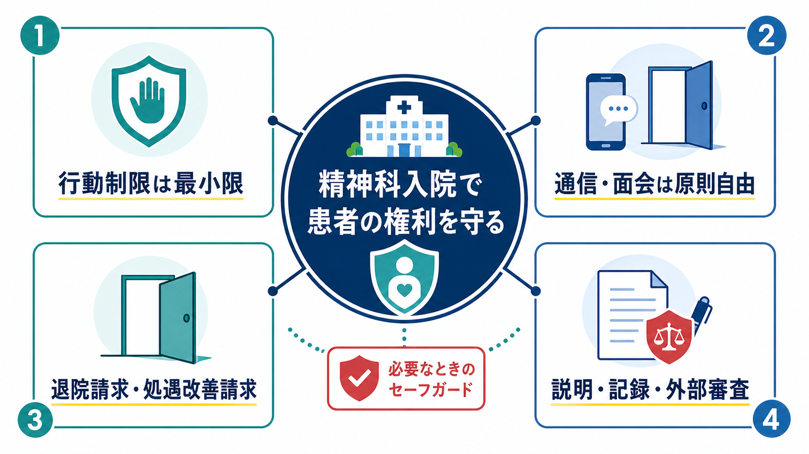
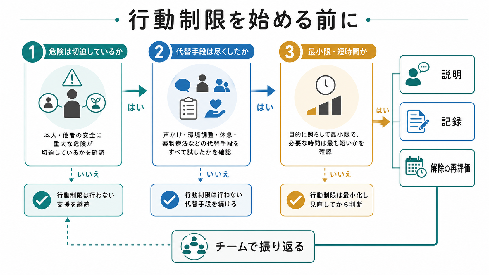
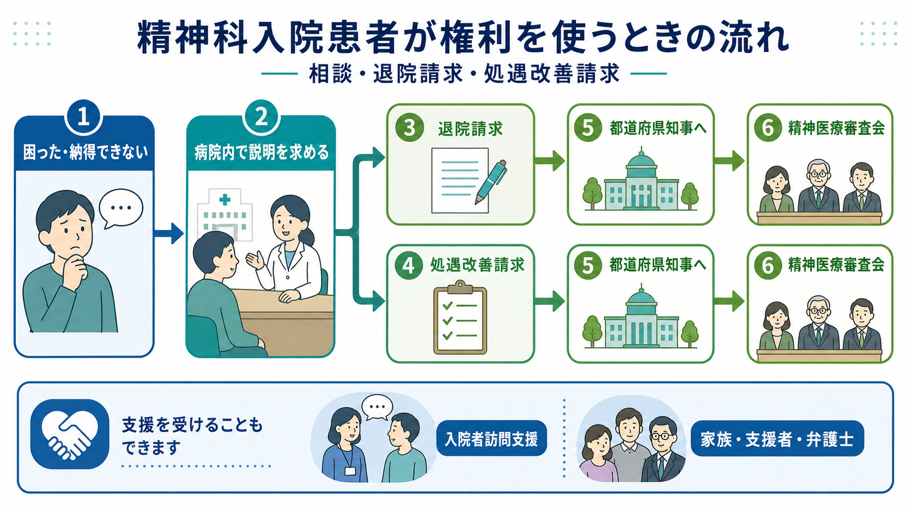

# 精神科入院で患者の権利をどう守るのか

## 要点

- 精神科入院の権利擁護は、「治療上の安全」と「本人の自由・尊厳」を対立させるのではなく、制限を必要最小限にし、説明・記録・再評価・外部審査で検証可能にする営みである。
- 行動制限は、切迫した危険、代替手段の不足、最小限性、短時間性、継続的観察、診療録記載、解除の再評価がそろってはじめて正当化される。
- 通信・面会は、治療や安全の理由で例外的に制限されうるとしても、外部とのつながりを断つ方向ではなく、権利行使や相談へのアクセスを保つ方向で考える。
- 退院請求・処遇改善請求は、患者本人や家族等が都道府県知事に求め、精神医療審査会による審査につながる重要な外部ルートである[2]。
- 本記事は教育・研究目的の整理であり、個別事例の法的助言、診断、治療指示ではない。

## この記事で答える問い

この記事では、精神科入院で患者の権利を守るために、現場で何を見ればよいのかを整理する。中心になる問いは次の四つである。

1. 行動制限は、どのような条件で、どのように最小化されるべきか。
2. 通信・面会は、なぜ権利擁護の中核なのか。
3. 退院請求・処遇改善請求は、どのように外部審査につながるのか。
4. 説明義務・記録・再評価は、なぜ患者の権利を実質化するのか。

## まず結論

精神科入院で権利を守る実務の核心は、「制限するかどうか」だけではなく、「制限をどの条件で始め、どの条件で続け、どの条件で終えるのか」を可視化することである。精神保健福祉法は、本人同意に基づく入院を基本に置きつつ、非自発的入院や処遇の手続を定めている[2]。令和4年改正は、同法が精神障害者の権利擁護を図るものであることを明確にし、地域生活支援や入院者訪問支援などを含む支援体制を強化する方向を示した[1]。

したがって、権利擁護は「書類を渡したか」だけでは足りない。患者が理解できる説明を受け、外部と連絡でき、退院や処遇改善を求めるルートを知り、行動制限が必要最小限に見直され続けることが必要である。

## 背景

精神科医療では、急性期の混乱、希死念慮、強い興奮、被害的体験、[[せん妄と認知症はどう違うのか|せん妄]]や認知症に伴う行動上の危険などにより、本人や周囲の安全確保が課題になることがある。一方で、閉鎖環境、情報の非対称性、本人の意思表示のしにくさ、家族・支援者との距離は、権利侵害を見えにくくする。

そのため、精神科入院では、医療上の必要性だけでなく、手続の透明性が重要になる。入院形態、行動制限、通信・面会、退院請求、処遇改善請求、入院者訪問支援、精神医療審査会は、ばらばらの制度ではなく、患者の声を病院内外に届かせるための複数の回路として理解できる。

## 基本概念

### 任意入院と非自発的入院

精神保健福祉法は、精神科病院に入院させる場合、本人の同意に基づく入院が行われるよう努めるべきことを定める[2]。任意入院では、入院時に退院等の請求に関する事項などを書面で知らせ、本人から入院の意思を記した書面を受けることが求められる[2]。

医療保護入院や措置入院では、本人の同意だけで入院が成立しないため、権利擁護の重要性はさらに増す。入院理由、入院形態、退院請求の方法、連絡先、面会や通信の扱い、処遇改善を求める方法を、本人の理解可能性に合わせて繰り返し説明する必要がある。

### 行動制限

行動制限には、隔離、身体的拘束、任意入院者の開放処遇の制限などが含まれる。厚生労働大臣告示の基準は、身体的拘束を「やむを得ない処置」と位置づけ、早期に他の方法へ切り替えるよう努めること、制裁・懲罰・見せしめとして行ってはならないことを明記している[3]。また、身体的拘束の理由、開始日時、解除日時を診療録に記載し、常時の臨床的観察や頻回の診察を行うことも求めている[3]。

### 通信・面会

通信・面会は、家族、支援者、行政、弁護士、相談機関とつながるための基盤である。通信・面会が過度に制限されると、本人が退院請求や処遇改善請求を使う機会、病院外の人に状況を伝える機会、孤立を防ぐ機会が損なわれる。したがって、通信・面会は治療上の配慮だけでなく、権利行使の前提条件として扱う必要がある。

### 退院請求・処遇改善請求

精神科病院に入院中の者や家族等は、都道府県知事に対して退院や処遇改善を求めることができる[2]。請求を受けた都道府県知事は、精神医療審査会に審査を求める仕組みになっている[2]。この制度は、病院内の説明や苦情対応だけでは解決しない場合に、外部の審査に接続するための重要なセーフガードである。

## 仕組み

### 1. 入院時に権利を知らせる

権利擁護は入院後の問題対応から始まるのではない。入院時点で、本人に入院形態、入院理由、退院請求、処遇改善請求、通信・面会、相談先を知らせる必要がある。令和6年度以降に用いる入院関連様式や告知書面も整理されており、説明内容を標準化する手がかりになる[5]。令和4年改正に関する厚生労働省資料は、精神保健福祉法が権利擁護を図るものであることを明確化し、地域生活支援や入院者支援を強める方向を示している[1]。

### 2. 行動制限は「始める理由」より「やめる条件」を明確にする

行動制限の判断では、切迫した危険があるか、代替手段を尽くしたか、目的に照らして最小限か、いつ解除を検討するかを明確にする。厚労省の行動制限最小化に関する調査研究も、病院全体の取組、職員の振り返り、経験者の声を含む研修資材を公開しており、行動制限を個人の判断だけに閉じない方向を示している[6]。

行動制限を減らす実務では、次の問いを記録に残すと検証しやすい。

| 見る点 | 確認する問い |
|---|---|
| 必要性 | 本人または他者の安全への危険は切迫しているか |
| 代替性 | 声かけ、環境調整、休息、薬物療法、スタッフ配置などを検討したか |
| 最小限性 | 制限の範囲と時間は目的に照らして最小限か |
| 説明 | 本人に理由と見通しを伝えたか |
| 記録 | 開始理由、開始時刻、観察、解除時刻を記載したか |
| 再評価 | 解除条件と次回評価時点を決めたか |

### 3. 病院内の説明と外部審査をつなぐ

患者が「なぜ入院しているのか」「なぜ制限されているのか」「いつ退院できるのか」を理解できない場合、まず病院内で説明を求めることが重要である。しかし、説明が不十分な場合や処遇への不服が残る場合には、退院請求・処遇改善請求という外部ルートがある。医療保護入院者については退院支援委員会の記録保存や診療録への記載も施行規則に定められており、手続を残すことが求められている[4]。

### 4. 外部とのつながりを絶たない

厚生労働省は、医療機関外の人との面会交流が途絶えやすい入院者に対して、本人の希望に応じて傾聴、生活相談、情報提供を行う入院者訪問支援事業を位置づけている[1]。これは、病棟内のケアだけでは届きにくい声を外部に接続する仕組みであり、通信・面会の権利と補完関係にある。

## 図解

この記事の図解は三つの層に分けて読むとよい。

1. 1枚目は、精神科入院における権利擁護の全体地図である。行動制限、通信・面会、退院請求・処遇改善請求、説明・記録・外部審査を同時に見る。
2. 2枚目は、行動制限を始める前の判断プロセスである。危険、代替手段、最小限性、説明、記録、解除の再評価を連続した手順として見る。
3. 3枚目は、本人の不服や困りごとが病院内説明、退院請求、処遇改善請求、精神医療審査会、訪問支援や支援者へつながる流れを示す。

画像内の文字は理解補助であり、個別事例では各自治体の様式、病院の説明書面、担当者への確認が必要になる。

## 臨床・研究との接続

行動制限は、患者本人にとっては恐怖、屈辱、孤立、医療不信につながりうる経験である。WHO QualityRights は、隔離・拘束を終わらせるための研修資料を含む権利ベースの教材群を公開し、強制的実践を減らすことを人権とリカバリーの課題として位置づけている[8]。

国内でも、精神保健福祉資料、いわゆる630調査により、精神科病院の入院状況や行動制限関連のデータが継続的に公開されている[7]。権利擁護を検討する研究では、個別病院の実践だけでなく、地域差、病床機能、認知症や[[BPSDとは何か|BPSD]]への対応、スタッフ配置、退院支援体制、地域資源の不足を合わせて検討する必要がある。

[[司法精神医学とは何か|司法精神医学]]との接続では、刑事責任能力や医療観察法の議論と混同しないことが大切である。精神科入院中の権利擁護は、犯罪や責任能力の問題に限らず、一般精神科医療、認知症医療、救急医療、地域移行支援のすべてに関わる。

## よくある誤解

### 誤解1: 危険があれば身体拘束は当然である

危険があることは重要な判断材料だが、それだけで身体拘束が当然になるわけではない。基準は、身体的拘束を代替方法が見出されるまでのやむを得ない処置として位置づけている[3]。したがって、代替手段、最小限性、観察、記録、解除の再評価が必要である。

### 誤解2: 通信・面会は治療の邪魔になるなら簡単に止めてよい

通信・面会は、本人の安心、家族・支援者との連携、退院後生活の準備、外部への相談を支える。治療上の配慮が必要な場面でも、全面的・漫然とした遮断ではなく、目的、期間、代替手段、相談先へのアクセスを確認すべきである。

### 誤解3: 退院請求は病院への敵対行為である

退院請求や処遇改善請求は、患者の権利を制度的に保障するための手続である[2]。病院への敵対ではなく、入院の必要性や処遇の適切性を外部の視点で確認する仕組みとして理解するほうがよい。

### 誤解4: 説明書面を渡せば説明義務は終わる

書面は重要だが、患者が理解し、質問でき、必要に応じて支援者と確認できることが大切である。精神症状、薬剤の影響、急性期の混乱、認知機能の変動がある場合、一度の説明だけで十分とは限らない。

## 関連ノート

- [[司法精神医学とは何か]]
- [[BPSDとは何か]]
- [[せん妄と認知症はどう違うのか]]

### 関連ノート候補

- 精神保健福祉法とは何か
- 医療保護入院とは何か
- 措置入院とは何か
- 精神医療審査会とは何か
- 精神科病院における身体拘束をどう減らすのか
- 退院支援委員会とは何か

### MOC更新候補

- `content/00_MOC/` 配下の精神医学・司法制度・地域精神医療系 MOC に、本記事へのリンクを追加する候補。
- 並列ジョブとの衝突を避けるため、本タスクでは MOC 本体は更新しない。

## 理解チェック

1. 行動制限を始める前に確認すべき三つの条件は何か。
2. 通信・面会が権利擁護にとって重要な理由は何か。
3. 退院請求と処遇改善請求は、どの機関の審査につながるか。
4. 「説明」と「記録」は、患者の権利をどのように守るか。
5. 行動制限最小化を個人の判断だけに任せると、どのような問題が起こりうるか。

## 参考文献

[1] 厚生労働省. 令和4年精神保健及び精神障害者福祉に関する法律の一部改正について. https://www.mhlw.go.jp/stf/seisakunitsuite/bunya/hukushi_kaigo/shougaishahukushi/kaisei_seisin/index_00003.html

[2] 日本法令外国語訳データベースシステム. 精神保健及び精神障害者福祉に関する法律. https://www.japaneselawtranslation.go.jp/ja/laws/view/4235

[3] 厚生労働省. 精神保健及び精神障害者福祉に関する法律第三十七条第一項の規定に基づき厚生労働大臣が定める基準（昭和63年厚生省告示第130号）. https://www.mhlw.go.jp/web/t_doc?dataId=80136000&dataType=0&pageNo=1

[4] 厚生労働省. 精神保健及び精神障害者福祉に関する法律施行規則. https://www.mhlw.go.jp/web/t_doc?dataId=80128000&dataType=0

[5] 厚生労働省. 精神保健福祉法に基づく入院に関する各種様式（令和6年度4月1日以降に用いるもの）. https://www.mhlw.go.jp/stf/seisakunitsuite/bunya/hukushi_kaigo/shougaishahukushi/kaisei_seisin/youshiki.html

[6] 厚生労働省. 精神科医療における行動制限の最小化に関する調査研究（障害者総合福祉推進事業）. https://www.mhlw.go.jp/stf/newpage_34246.html

[7] 国立精神・神経医療研究センター 精神保健研究所. 精神保健福祉資料（630調査）. https://www.ncnp.go.jp/nimh/seisaku/data/630.html

[8] World Health Organization. QualityRights materials for training, guidance and transformation. https://www.who.int/publications-detail-redirect/who-qualityrights-guidance-and-training-tools

## 未解決問題

- 日本の精神科病院で、行動制限最小化の実践がどの程度標準化されているか。
- 通信・面会制限の判断と解除条件が、患者本人にどの程度わかりやすく説明されているか。
- 入院者訪問支援事業が、面会交流の乏しい入院者にどの程度届いているか。
- 退院請求・処遇改善請求を使いやすくするために、病院、自治体、支援者がどのような説明方法を整備できるか。
