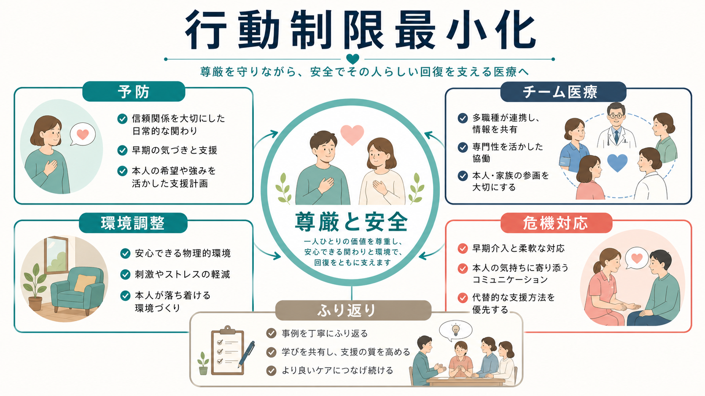
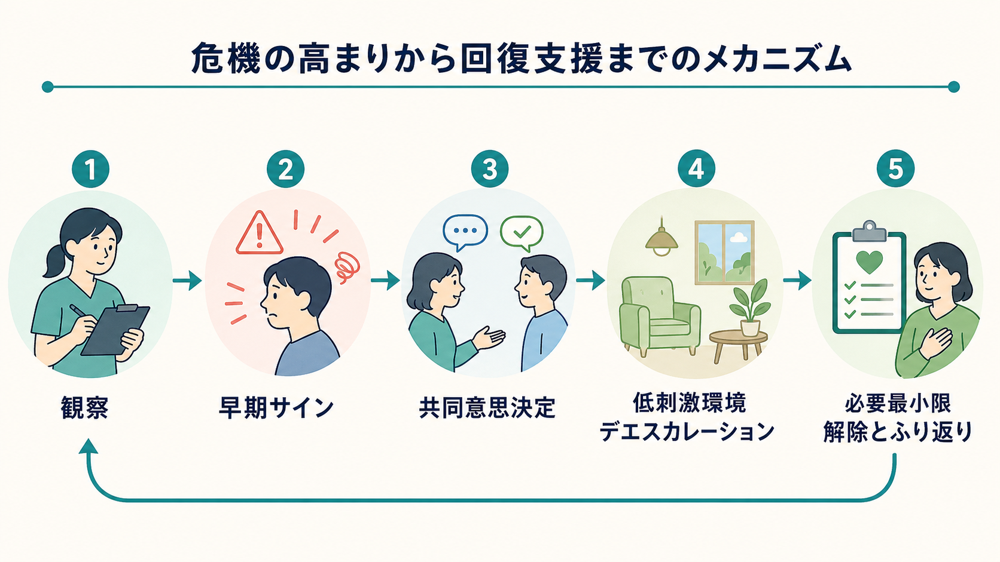
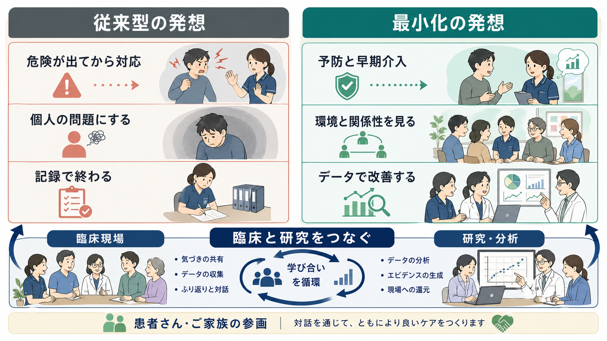

# 精神科医療における行動制限最小化とは何か

## 要点

- 行動制限最小化とは、隔離や身体的拘束を「必要悪」として固定化せず、本人の尊厳・安全・回復を守るために、予防、代替策、短時間化、解除、ふり返りを組織的に進める取り組みである。
- 日本の制度上も、隔離・身体的拘束は医療または保護のためにやむを得ない場合に限られ、制裁・懲罰・見せしめとして行うことは禁じられている[1][2]。
- 実効性のある最小化は、個々の職員の努力だけでなく、リーダーシップ、データ活用、職員教育、本人・家族参加、環境調整、事後検討を含むチーム医療として設計される[3][4]。
- この記事は教育・研究目的の整理であり、個別事例での隔離・拘束の要否や解除時期を指示するものではない。

## この記事で答える問い

隔離・身体的拘束を減らすという目標は、一見すると「危険な場面で何もしないこと」と誤解されやすい。ここで扱う問いは逆である。危機が大きくなる前に何を観察し、どのような環境と関係性を整え、やむを得ず行動制限を使った場合にどう短く、透明に、学習可能な出来事へ変えるのかを考える。

関連する基礎として、精神状態の観察は[[MSEで外観と行動から何を観察するか]]、同意と説明の倫理は[[インフォームドコンセントは精神科でどう行うのか]]、事例理解の枠組みは[[5Pモデルとは何か]]とも接続する。

## まず結論

行動制限最小化は、「隔離・拘束をゼロと宣言すること」だけではない。中核は、本人と周囲の安全を守りながら、より制限の少ない選択肢を先に試し、使わざるを得ない場合にも理由・時間・観察・解除条件を明確にする実践である。厚生労働省の処遇基準も、自由の制限が必要な場合でも本人にできる限り説明し、症状に応じて最も制限の少ない方法で行うことを求めている[1]。

## 背景

精神科入院医療では、急性の自傷他害リスク、強い精神運動興奮、身体合併症への対応などで、隔離や身体的拘束が検討されることがある。日本の告示では、12時間を超える隔離と身体的拘束が、精神保健福祉法第36条第3項に基づく行動の制限として定められている[2]。

しかし、隔離・拘束は安全確保の手段であると同時に、本人に恐怖、屈辱感、無力感、再トラウマ化をもたらしうる侵襲的介入である。WHO QualityRights は、隔離・拘束を終わらせる方向の訓練教材を提示し、人権、リカバリー、本人参加、地域生活に基づくサービス転換を重視している[3]。トラウマ反応の観点からは、[[PTSDでは恐怖記憶ネットワークに何が起きているのか]]や[[自律神経ネットワークは内臓状態をどう制御するのか]]で扱うような脅威反応の理解も、危機対応を考える補助線になる。

## 基本概念

### 隔離

日本の基準では、隔離は、本人または周囲に危険が及ぶ可能性が著しく高く、隔離以外の方法では回避が著しく困難な場合に、その危険を最小限に減らし、本人の医療または保護を図る目的で行われる[1]。対象としては、切迫した自傷・自殺企図、他者への暴力や著しい迷惑行為、急性精神運動興奮、身体合併症の検査・処置などが挙げられる[1]。

### 身体的拘束

身体的拘束は制限の程度が強く、二次的な身体障害を生じうるため、代替方法が見出されるまでのやむを得ない処置として位置づけられている。基準は、できる限り早期に他の方法へ切り替えるよう求め、拘束中は原則として常時の臨床的観察と頻回の診察を要するとしている[1]。

### 最小化

最小化とは、単に件数を下げる管理目標ではない。本人の希望・強み・苦痛のサインを事前に把握し、職員間で共有し、病棟環境や関わり方を調整し、危機時にはデエスカレーションと代替策を優先し、行動制限後には本人とチームでふり返る一連の改善サイクルである。厚生労働省も行動制限最小化の研究報告や関連法令・通知を掲載し、基本的考え方、知識、取組事例の普及を進めている[4]。

## 仕組み

### 1. 予防としての日常的関係づくり

行動制限は危機場面だけで決まるわけではない。日常の声かけ、病棟の見通し、睡眠や刺激量、本人が安心できる人・場所・活動、苦手な接触やトリガーを共有しておくことが、危機の閾値を変える。Six Core Strategies は、組織リーダーシップ、データ使用、職員教育、予防ツール、本人・家族の参加、デブリーフィングを中核に置き、多施設研究でも隔離・拘束削減の実践として検討されてきた[5]。

### 2. 早期サインの観察と共同意思決定

不穏や興奮を「突然の問題行動」と見なすと、介入は遅くなる。睡眠不足、表情や声量の変化、対人距離、被害的解釈、身体不調、薬剤副作用、病棟内の混雑などを早めに見つけ、本人と「今なら何が助けになるか」を相談する。ここでの共同意思決定は、本人の判断能力が常に完全であることを前提にするのではなく、理解しやすい説明、選択肢の提示、意思表明の支援を通じて、制限を最小にするための臨床技術として働く。

### 3. 環境調整とデエスカレーション

低刺激の空間、安心できる物品、休息、感覚調整、信頼できる職員との短い対話、身体疾患や疼痛への対応は、危機対応の前段階である。Safewards は、病棟内の葛藤と制圧的対応を減らすための枠組みとして国際的に導入され、システマティックレビューでは葛藤・封じ込め事象や職員・利用者経験への影響が検討されている[6]。

### 4. やむを得ない場合の必要最小限化

行動制限が避けられない場合でも、最小化の原則は続く。理由を本人にできる限り説明する、開始時刻・理由・解除時刻を記録する、観察と医療的保護を確保する、漫然と継続しない、解除条件をチームで共有する。隔離では少なくとも毎日1回の診察、身体的拘束では常時の臨床的観察と頻回診察が求められる[1]。

### 5. 解除後のふり返り

ふり返りは、責任追及ではなく再発予防のための学習である。本人には「何がつらかったか」「何が助けになったか」「次に危機が高まる前に何をしてほしいか」を聞く。チームは、環境、情報共有、職員配置、声かけ、薬物療法、身体疾患、家族・地域連携を確認する。行動制限最小化委員会のような場は、個別事例を病棟全体の改善へつなげる装置として機能しうる[4]。

## 図解

最小化の発想では、危険が出てから強い制限で対応するのではなく、早期の気づき、本人参加、環境と関係性の調整、データにもとづく改善を重ねる。

## 臨床・研究との接続

臨床では、行動制限の最小化は病棟文化の改善である。看護師、医師、心理職、作業療法士、精神保健福祉士、薬剤師、ピアサポーター、本人・家族が、危機を「個人の問題」だけに閉じ込めず、環境と相互作用の問題として検討する。これは[[司法精神医学とは何か]]で扱う安全と権利の緊張にも近いが、一般精神科医療ではとくに回復志向と地域生活への接続が重要になる。

研究では、単一の技法よりも複合的プログラムの評価が多い。2010年の文献レビューは、方針変更・リーダーシップ、外部レビューやデブリーフィング、データ活用、訓練、利用者・家族参加、職員配置や危機対応チーム、プログラム変更などの戦略を整理し、頻度・時間の削減可能性を示した[7]。2023年の米国VA系システマティックレビューも、病院・病棟再構築、教育訓練、感覚調整室、リスク評価・管理、包括的介入などを比較し、実装の多様性とエビデンスの限界を示している[8]。

## よくある誤解

### 誤解1: 最小化は安全を軽視する

最小化は、安全を軽視するのではなく、安全を隔離・拘束だけに依存しない設計にすることである。早期介入、環境調整、観察、本人参加、解除条件の明確化は、本人と周囲の安全を同時に高めるための実務である。

### 誤解2: 行動制限は一度始めたら、落ち着くまで待つしかない

基準上も、隔離や拘束が漫然と行われないよう診察・観察が求められている[1]。開始後こそ、身体状態、心理的苦痛、薬剤効果、解除可能性を短い間隔で見直す必要がある。

### 誤解3: 最小化は現場職員の接遇だけで決まる

接遇は重要だが、それだけでは足りない。最小化は、管理者の関与、十分な人員と教育、記録とデータの見える化、委員会での継続改善、本人・家族の声を反映する仕組みを含む組織課題である[4][5]。

## 関連ノート

- [[MOC｜精神医学]]
- [[司法精神医学とは何か]]
- [[インフォームドコンセントは精神科でどう行うのか]]
- [[5Pモデルとは何か]]
- [[MSEで外観と行動から何を観察するか]]
- [[PTSDでは恐怖記憶ネットワークに何が起きているのか]]
- [[自律神経ネットワークは内臓状態をどう制御するのか]]

## MOC更新候補

- `content/00_MOC/MOC｜精神医学.md`
- `content/00_MOC/MOC｜臨床実践・治療.md`
- 将来的に制度・地域精神医療の MOC を作る場合、本記事は「精神科入院制度」「権利擁護」「行動制限最小化」のハブ候補になる。

## 理解チェック

1. 行動制限最小化は、隔離・拘束の単純な禁止ではなく、どのような臨床プロセスを含むか。
2. 隔離・身体的拘束を行う場合に、本人への説明、記録、観察、解除判断が重要になる理由は何か。
3. 危機対応を「本人の問題」だけにせず、環境・関係性・組織文化として見ると、どのような代替策が見えやすくなるか。

## 未解決問題

- 日本の精神科病院で、病棟特性や人員配置の違いを踏まえて、どの介入パッケージが最も実装しやすく効果的か。
- 行動制限の件数だけでなく、本人の体験、再トラウマ化、治療同盟、退院後の信頼関係をどう評価指標に入れるか。
- 急性期の安全確保と、本人参加・意思決定支援・権利擁護を、現場でどのように両立させるか。

## 参考文献

[1] 厚生労働省. 精神保健及び精神障害者福祉に関する法律第三十七条第一項の規定に基づき厚生労働大臣が定める基準（昭和63年4月8日厚生省告示第130号）. https://www.mhlw.go.jp/web/t_doc?dataId=80136000&dataType=0&pageNo=1

[2] 厚生労働省. 精神保健及び精神障害者福祉に関する法律第三十六条第三項の規定に基づき厚生労働大臣が定める行動の制限（昭和63年4月8日厚生省告示第129号）. https://www.mhlw.go.jp/web/t_doc?dataId=80135000&dataType=0

[3] World Health Organization. (2019). *Strategies to end seclusion and restraint: WHO QualityRights specialized training: course guide*. https://iris.who.int/handle/10665/329605

[4] 厚生労働省. 精神科病院における行動制限最小化について. https://www.mhlw.go.jp/stf/newpage_33838.html

[5] Wieman, D. A., Camacho-Gonsalves, T., Huckshorn, K. A., & Leff, S. (2014). Multisite study of an evidence-based practice to reduce seclusion and restraint in psychiatric inpatient facilities. *Psychiatric Services, 65*(3), 345-351. https://doi.org/10.1176/appi.ps.201300210

[6] Ward-Stockham, K., Kapp, S., Jarden, R., Gerdtz, M., & Daniel, C. (2022). Effect of Safewards on reducing conflict and containment and the experiences of staff and consumers: A mixed-methods systematic review. *International Journal of Mental Health Nursing, 31*(1), 199-221. https://doi.org/10.1111/inm.12950

[7] Scanlan, J. N. (2010). Interventions to reduce the use of seclusion and restraint in inpatient psychiatric settings: What we know so far a review of the literature. *International Journal of Social Psychiatry, 56*(4), 412-423. https://doi.org/10.1177/0020764009106630

[8] Konnyu, K., Quinn, M. K., Primack, J., et al. (2023). *Protocols to Reduce Seclusion in Inpatient Mental Health Units: A Systematic Review*. Washington (DC): Department of Veterans Affairs. https://www.ncbi.nlm.nih.gov/books/NBK599803/
