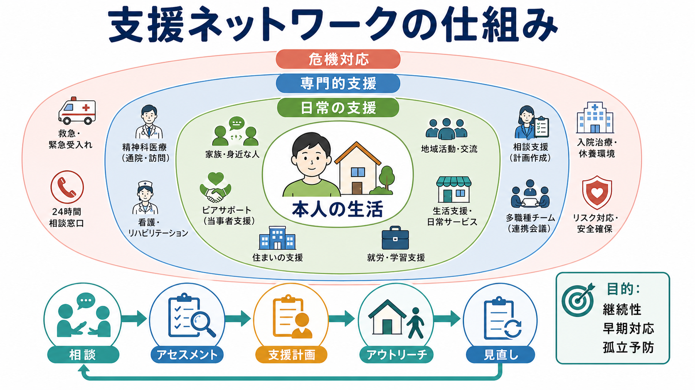
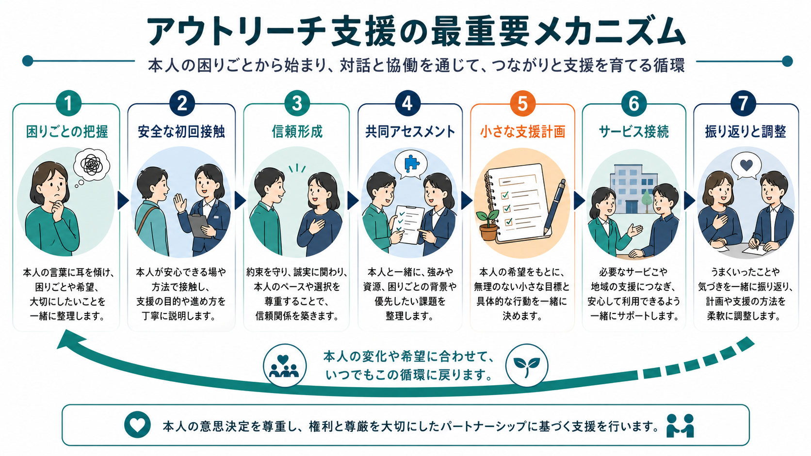

# 精神科訪問看護とは何か

## 要点

- 精神科訪問看護は、精神疾患や精神的困難をもつ人の自宅を看護師などが訪問し、服薬、生活リズム、症状変化、家族関係、受診継続、多職種連携を支えるサービスである。
- 目的は「管理」ではなく、本人が地域で生活を続けるための観察・相談・調整である。病状だけでなく、睡眠、食事、金銭管理、対人関係、孤立、家族の負担も支援対象になる。
- 日本では医療保険上の「精神科訪問看護基本療養費」などに位置づけられ、主治医の指示、訪問看護計画、記録、関係機関との連携に基づいて実施される[1][2]。
- 研究上は、症状の早期発見、服薬継続、再入院予防、地域生活支援に関わる可能性が示される一方、効果指標の標準化や重症度別の有効性評価には課題が残る[5][6]。

## この記事で答える問い

この記事では、精神科訪問看護を「精神科医療を自宅へ持ち込む制度」としてだけでなく、「本人の生活環境のなかで回復と安全を支える関係的な支援」として説明する。個別の診断や治療方針の指示ではなく、教育・研究目的の概説である。

## まず結論

精神科訪問看護とは、通院治療だけでは見えにくい日常生活の変化を、本人の暮らしの場で一緒に観察し、必要な支援につなぐ仕組みである。訪問者は、薬を飲んだかどうかを単に確認するだけではない。眠れているか、食べられているか、家事や金銭管理が破綻していないか、家族が疲弊していないか、孤立が深まっていないか、受診や福祉サービスが途切れていないかを、本人の同意と目標に沿って確認する。

そのため、精神科訪問看護の中心は「治療を命令すること」ではなく、「本人の生活の中で悪化の兆しを早めに拾い、本人・家族・主治医・福祉職が同じ方向を向けるようにすること」である。これは、精神障害にも対応した地域包括ケアシステムが重視する、地域生活を基盤にした医療・福祉・住まい・社会参加の連携とも接続する[3]。

## 背景

精神科医療は、長期入院中心から地域生活中心へと移行してきた。日本でも、[[精神保健福祉法とは何か]]に基づく入院医療、外来医療、障害福祉サービス、地域相談支援、家族支援をどう組み合わせるかが重要な課題になっている。入院治療が必要な局面はあるが、退院後に生活が支えられなければ、服薬中断、孤立、睡眠リズムの崩れ、家族関係の悪化、再入院につながりやすい。

精神科訪問看護は、この「病院と生活の間」をつなぐ支援である。外来診察では数分から数十分の面接で病状を把握することが多いが、訪問では部屋の状態、食事、睡眠、家族との距離、地域資源の使い方など、生活の文脈が見える。世界保健機関も、地域精神保健サービスでは本人中心・権利基盤・リカバリー志向の支援を重視しており、病院中心ではなく地域の中で支えるサービス設計を推奨している[4]。

## 基本概念

精神科訪問看護の「精神科」は、精神科医療の専門性を意味する。対象は統合失調症、気分障害、不安症、依存症、発達特性を伴う困難、認知症に伴う精神症状など幅広い。ただし、利用条件や費用負担は医療保険、介護保険、障害福祉制度、自治体制度との関係で変わるため、実際の利用では主治医、訪問看護ステーション、相談支援専門員、市区町村窓口に確認する必要がある[1][2]。

精神科訪問看護で扱う主な支援は、次のように整理できる。

| 領域 | 具体例 | 重要な観点 |
|---|---|---|
| 服薬支援 | 飲み忘れ、自己中断、副作用、不安の相談 | 服薬を強制するのではなく、本人が続けやすい方法を一緒に考える |
| 生活支援 | 睡眠、食事、掃除、金銭管理、外出、日課 | 症状だけでなく、生活リズムの崩れを早期に見る |
| 症状観察 | 気分、幻聴・妄想、不安、希死念慮、焦燥、活動量 | 変化を主治医や関係機関と共有する |
| 家族支援 | 家族の困りごと、対応方法、休息、相談先 | 家族を「治療協力者」として消耗させず、支える対象として見る |
| 連携 | 主治医、薬局、相談支援、行政、就労支援 | 情報共有と役割分担を明確にする |

## 仕組み

精神科訪問看護は、通常、主治医の訪問看護指示に基づいて始まる。訪問看護ステーションは、本人の状態、生活課題、希望、リスク、家族状況を評価し、訪問看護計画を作成する。訪問後には記録を残し、必要に応じて主治医や福祉職へ情報共有する[1][2]。

支援の単位は「訪問」だが、実際の効果は訪問時だけで完結しない。訪問で観察した変化を、本人の言葉に戻し、次の受診で伝えやすくし、生活上の小さな工夫に変え、必要な制度やサービスへつなぐ。この循環が、精神科訪問看護の実務上の中核である。

精神科訪問看護では、次のような流れが多い。

1. 主治医が訪問看護の必要性を判断し、指示書を作成する。
2. 訪問看護ステーションが本人・家族と面談し、目標と訪問頻度を調整する。
3. 訪問時に、症状、服薬、睡眠、食事、生活環境、家族の負担を確認する。
4. 本人の希望と困りごとに合わせ、短期目標を設定する。
5. 状態悪化や危機の兆候があれば、主治医、救急、相談支援、家族と連携する。
6. 一定期間ごとに計画を見直し、訪問頻度や支援内容を調整する。

## 図解

精神科訪問看護を図にするなら、中心にあるのは「自宅で暮らす本人」である。その周囲に、服薬支援、生活支援、症状観察、家族支援、危機対応、社会参加支援があり、さらに外側に主治医、訪問看護ステーション、薬局、相談支援専門員、行政、就労支援、学校・職場がある。

重要なのは、支援の中心が「病院」でも「制度」でもなく、本人の生活と希望に置かれる点である。これは、[[精神科入院で患者の権利をどう守るのか]]で問題になる入院中の権利擁護とは別の場面だが、本人の意思決定と尊厳を支えるという意味では連続している。

## 臨床・研究との接続

臨床的には、精神科訪問看護は再発や再入院を防ぐ「見守り」だけではなく、リカバリーを支える伴走的支援である。特に、診察室では「大丈夫です」と言えても、実際には眠れていない、薬を飲むタイミングが生活に合っていない、家族が限界に近い、といった状態は自宅訪問で見えやすい。

研究では、日本の精神科訪問看護に関する文献レビューが、支援内容、利用者・家族への影響、看護師の役割を整理している。ただし、研究デザインは観察研究や質的研究が多く、標準化されたアウトカムを用いた比較研究はまだ十分ではない[5]。近年の質的研究では、訪問看護師が本人との信頼関係を作り、困りごとを生活の中で把握し、支援計画と地域資源につなぐ過程が記述されている[6]。

また、ACT（Assertive Community Treatment）のような集中的地域支援モデルでは、多職種チームが重い精神障害をもつ人を地域で支える。精神科訪問看護はACTそのものではないが、アウトリーチ、危機の早期把握、多職種連携という点で近い課題をもつ[7]。日本で精神科訪問看護を評価する際には、単に入院日数を減らしたかだけでなく、本人の生活の安定、社会参加、孤立の軽減、家族負担、権利擁護を含めた指標が必要になる。

## よくある誤解

**誤解1：訪問看護は薬を飲ませるための監視である。**  
服薬支援は重要だが、支援の目的は監視ではない。副作用への不安、飲み忘れの背景、生活リズム、薬への納得感を扱い、本人が続けやすい条件を一緒に整える。

**誤解2：症状が重い人だけが使う。**  
重症例で重要なことは確かだが、退院直後、通院が不安定な時期、家族が疲れている時期、生活リズムが崩れやすい時期にも利用される。早めに支援を入れることで危機を小さくできる場合がある。

**誤解3：家に来てもらうと自由がなくなる。**  
本来は、本人の生活を広げるための支援である。訪問頻度、目標、共有する情報の範囲は、本人の同意と安全を踏まえて調整される。強制的な行動制限とは区別されるべきであり、[[身体拘束とは何か]]や[[隔離とは何か]]で扱う入院中の制限とは制度的にも臨床的にも異なる。

**誤解4：訪問看護師が治療方針を一人で決める。**  
薬剤変更や診断は主治医の役割である。訪問看護師は、生活上の観察と本人の困りごとを集め、必要な情報を主治医や関係者へつなぐ役割を担う。

## 関連ノート

- [[精神保健福祉法とは何か]]
- [[精神科入院で患者の権利をどう守るのか]]
- [[任意入院とは何か]]
- [[身体拘束とは何か]]
- [[隔離とは何か]]
- [[医療観察法とは何か]]

MOC更新候補: `content/00_MOC/` 配下の精神医学・地域精神医療系 MOC に、本記事へのリンクを追加する。並列ジョブとの競合を避けるため、今回は MOC 本体は更新しない。

## 理解チェック

1. 精神科訪問看護が、単なる服薬確認ではなく生活支援でもある理由は何か。
2. 訪問看護師が自宅で観察できる情報には、診察室で見えにくいどのようなものがあるか。
3. 精神科訪問看護において、本人の同意と多職種連携が重要になる理由は何か。
4. 「支援」と「監視」を分ける臨床上のポイントは何か。

## 未解決問題

- 精神科訪問看護の有効性を、再入院率だけでなく、生活の質、孤立、家族負担、社会参加、権利擁護の観点からどう測定するか。
- 訪問頻度、支援期間、対象疾患、年齢層、家族状況によって、どの支援要素が最も効果的か。
- 医療保険、介護保険、障害福祉、自治体支援の境界が、利用者にとってわかりにくくならないようにする制度設計。
- 訪問看護師の安全、心理的負担、専門研修、スーパービジョンをどう確保するか。

## 参考文献

[1] 厚生労働省. 訪問看護療養費に係る指定訪問看護の費用の額の算定方法. https://www.mhlw.go.jp/web/t_doc?dataId=84aa9734&dataType=0&pageNo=1

[2] 厚生労働省. 令和6年度診療報酬改定の概要 在宅医療・訪問看護. https://www.mhlw.go.jp/stf/seisakunitsuite/bunya/0000188411_00045.html

[3] 厚生労働省. 精神障害にも対応した地域包括ケアシステムの構築について. https://www.mhlw.go.jp/stf/seisakunitsuite/bunya/chiikihoukatsu.html

[4] World Health Organization. *Guidance on community mental health services: promoting person-centred and rights-based approaches*. 2021. https://www.who.int/publications/i/item/9789240025707

[5] Koizumi, Y., et al. Psychiatric home-visit nursing in Japan: a systematic review. *Psychiatric Quarterly*. 2020. https://doi.org/10.1007/s11126-020-09721-w

[6] Ohtake, Y., Noguchi-Watanabe, M., & Morita, K. Home-visiting nurses' support for persons with mental disorders in Japan: qualitative evidence on community-based support processes. *BMC Nursing*. 2023. https://pmc.ncbi.nlm.nih.gov/articles/PMC10311670/

[7] Bond, G. R., Drake, R. E., Mueser, K. T., & Latimer, E. Assertive community treatment for people with severe mental illness: critical ingredients and impact on patients. *Disease Management and Health Outcomes*. 2001. https://doi.org/10.2165/00115677-200109030-00003
