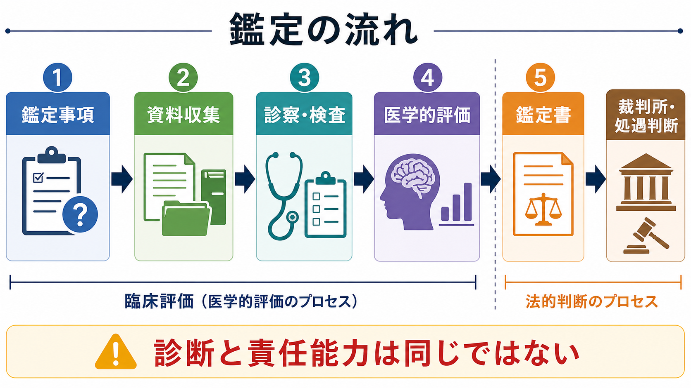
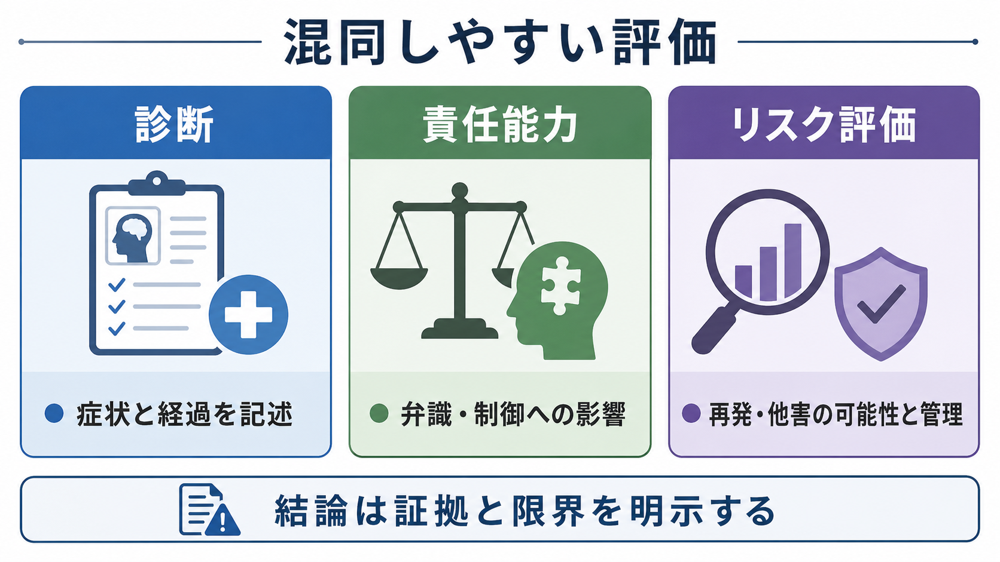

# 精神鑑定とは何か

## 要点

- 精神鑑定は、通常の診療とは異なり、裁判所・検察・弁護人などから与えられた法的・制度的な問いに対して、精神医学的情報を整理して答える評価である。
- 重要なのは、診断名を付けることだけではない。犯行時または審理時の精神状態、弁識能力・制御能力への影響、訴訟能力、処遇必要性、再発・他害リスク、治療可能性を区別して検討する。
- 日本の刑法では、心神喪失は罰せられず、心神耗弱は刑が減軽されると規定されるが、最終的に心神喪失・心神耗弱に当たるかは法律判断である[1][2]。
- 鑑定人の役割は「判決を決めること」ではなく、診察・記録・心理検査・周辺情報に基づき、裁判や処遇判断の基礎となる医学的意見と限界を明示することである[2][4]。

## この記事で答える問い

1. 精神鑑定は通常の精神科診療や[[司法精神医学とは何か|司法精神医学]]と何が違うのか。
2. 責任能力鑑定、訴訟能力鑑定、医療観察法鑑定、リスク評価はどのように区別されるのか。
3. 精神鑑定では、どのような資料・面接・検査から結論を組み立てるのか。
4. 「診断があること」と「責任能力がないこと」をなぜ同一視できないのか。

## まず結論

精神鑑定とは、精神医学を法的判断にそのまま置き換える作業ではない。精神医学の言葉で、法的・制度的判断に関係する事実をできるだけ明確にする作業である。たとえば、ある人に[[精神疾患とは何か|精神疾患]]があるか、犯行時に幻覚・妄想・意識障害・知的機能低下・物質使用などがどの程度あったか、それが行為の意味を理解する力や行動を制御する力にどう影響したかを検討する。

ただし、精神鑑定の結論は裁判所の判断そのものではない。最高裁は、刑法39条にいう心神喪失・心神耗弱の該当性は法律判断であり、究極的には裁判所に委ねられる問題だと示している[2]。一方で、精神障害の有無・程度、病的体験と行為の関係、診察所見などは専門的評価を要するため、鑑定は裁判や処遇の質を左右する重要な資料になる。

## 背景

精神鑑定が必要になるのは、事件や処遇判断の中で「その人の精神状態をどう理解すべきか」が争点になるときである。典型例は刑事事件における[[責任能力鑑定とは何か|責任能力鑑定]]で、犯行時に精神障害があり、善悪の弁識や行動制御がどの程度損なわれていたかを検討する。

しかし、精神鑑定の対象は責任能力だけではない。被告人が裁判手続を理解し、防御に参加できるかをみる訴訟能力、医療観察法における処遇要否、少年事件・民事事件・家事事件での判断能力、施設や地域での[[他害リスク評価では何を見るべきか|他害リスク評価]]なども含まれる。

医療観察法では、心神喪失または心神耗弱の状態で重大な他害行為を行い、不起訴や無罪等になった人について、裁判所が処遇の要否と内容を決める。厚生労働省は、この制度の目的を、継続的で適切な医療、観察・指導、病状改善、同様の行為の再発防止、社会復帰の促進と説明している[5]。NCNP も、医療観察法を日本で初めての司法精神医療に関する法律として位置づけ、司法が処遇を決定する仕組みであると整理している[6]。

## 基本概念

### 精神鑑定

精神鑑定は、専門家が精神医学的評価を行い、鑑定書や意見として提出する手続きである。通常の診療では、本人の苦痛の軽減、診断、治療、生活支援が中心になる。精神鑑定では、それに加えて、依頼された法的争点に関係する時点・能力・因果関係・リスクを明確にする必要がある。

評価の中心には、[[精神状態診察MSEとは何か|精神状態診察MSE]]、生活歴、病歴、薬物・アルコール使用歴、認知機能、発達歴、事件前後の行動、供述の変遷、治療歴、家族や関係者からの情報、診療録・捜査記録・映像記録などがある。必要に応じて心理検査や知能検査も使うが、検査結果だけで結論を出すわけではない。

### 責任能力

責任能力は医学的診断名ではなく、刑事責任を問えるかに関わる法的概念である。刑法39条は、心神喪失者の行為は罰しない、心神耗弱者の行為は刑を減軽すると定める[1]。実務上は、精神障害という生物学的要素と、弁識能力・制御能力という心理学的要素の関係を検討する。

ここで注意すべきなのは、「統合失調症がある」「認知症がある」「知的障害がある」といった診断名だけで責任能力が自動的に決まるわけではないことである。最高裁は、精神分裂病に罹患していたことだけで直ちに心神喪失とはいえず、犯行当時の病状、犯行前の生活状態、犯行の動機・態様などを総合して判定すべきだと示している[3]。

### 訴訟能力

訴訟能力は、現在の裁判手続を理解し、弁護人と相談し、防御活動に参加できるかという問いである。責任能力が「行為時」を見るのに対し、訴訟能力は「現在」を見る。したがって、犯行時の状態が比較的保たれていても、現在のせん妄、認知症、重い精神病症状、重度うつ状態などによって訴訟能力が問題になることがある。

### リスク評価

リスク評価は、「危険人物かどうか」を単純にラベルづけする作業ではない。再発・他害・自傷・治療中断などの可能性を、変化しにくい静的因子、変化しうる動的因子、保護因子、環境調整の可能性に分け、管理可能な形にする作業である。司法精神医療領域の暴力リスク評価ツールについては、予測性能に一定の有用性がある一方、研究の質やバイアスにも注意が必要とされる[7]。

## 仕組み

精神鑑定は、おおむね次の流れで進む。

| 段階 | 主な問い | 使う情報 | 出力 |
|---|---|---|---|
| 鑑定事項の確認 | 何に答える鑑定か | 裁判所・依頼機関の鑑定事項、事件類型、争点 | 評価範囲の設定 |
| 資料収集 | 行為時・現在・経過を再構成できるか | 診療録、捜査記録、供述調書、映像、家族情報、施設記録 | 時系列と情報源の整理 |
| 診察・検査 | 現在の精神状態と認知機能はどうか | 面接、MSE、心理検査、知能検査、症状評価 | 診断・症状・機能の評価 |
| 行為時評価 | 症状は行為にどう関与したか | 病状、動機、行為態様、前後の行動、了解可能性 | 弁識・制御への影響の分析 |
| 鑑定書 | 根拠と限界を明示できるか | 全資料の統合、矛盾点、代替説明 | 医学的意見、限界、追加評価の必要性 |

実務上、鑑定書で重要なのは、結論だけでなく「なぜそう考えたか」である。診断名、症状の時系列、服薬・物質使用、知的機能、人格傾向、生活状況、事件前後の行動、供述の一貫性、[[詐病とは何か|詐病]]や誇張の可能性、[[鑑別診断とは何か|鑑別診断]]を、証拠と照合しながら記述する。

AAPL の実務ガイドラインも、責任能力に関する評価では、法域ごとの法的基準、個別事案、面接、周辺資料、倫理的配慮、報告書、意見形成を区別して扱う必要があると述べている[4]。これは日本の制度にそのまま移植できるものではないが、「精神医学的意見は、法的問い・資料・限界を明示して提示する」という原則は共通している。

## 図解

精神鑑定では、少なくとも三つの評価を混同しないことが重要である。

| 評価 | 見ているもの | 典型的な誤解 | 実際の考え方 |
|---|---|---|---|
| 診断 | 症状、経過、機能障害、除外診断 | 診断名が責任能力を決める | 診断は必要条件になりうるが、それだけでは不十分 |
| 責任能力 | 行為時の弁識・制御への影響 | 精神疾患があれば無罪になる | 病状と行為の関係、動機、行為態様、前後の行動を総合する |
| リスク評価 | 再発・他害・自傷・治療中断の可能性と管理 | 将来を正確に予言できる | リスク因子と保護因子を整理し、支援・治療・環境調整につなげる |

## 臨床・研究との接続

精神鑑定は、通常診療と切り離された特殊技術ではない。精神科面接、MSE、診断、心理検査、生活機能評価、リスク評価、治療反応性の見立てといった一般臨床の技術が基盤になる。

一方で、通常診療と異なる点も大きい。第一に、治療関係ではなく鑑定関係であるため、面接の目的、守秘の限界、情報の利用先を説明する必要がある。第二に、本人の主観的訴えだけでなく、客観資料や周辺情報との整合性を重視する。第三に、結論の不確実性を明示する。たとえば「精神病症状があった可能性は高いが、行為時の弁識・制御への影響は資料上限定的である」など、確実な部分と推論の部分を分ける。

研究との接続では、暴力リスク評価、医療観察法のアウトカム、退院・地域移行、再入院、治療中断、スティグマ、権利擁護、鑑定の信頼性が重要になる。特にリスク評価研究では、予測精度だけでなく、評価が治療計画や地域支援にどうつながるかを問う必要がある[7]。

## よくある誤解

### 誤解1：精神鑑定は「無罪にするため」の手続きである

精神鑑定は、特定の結論に誘導する手続きではない。責任能力を否定する方向にも、肯定する方向にも、限定的に評価する方向にもなりうる。重要なのは、資料と面接所見からどこまで言えるかを明確にすることである。

### 誤解2：診断名が重いほど責任能力は必ず低くなる

診断名と責任能力は対応しない。重い診断名があっても、行為時に病的体験が行為を支配していなければ責任能力が保たれることがある。逆に、診断名が一見軽く見えても、意識障害、知的障害、物質中毒、急性精神病状態などが行為時の判断に重大な影響を及ぼすこともある。

### 誤解3：鑑定人が責任能力を最終判断する

鑑定人は専門的意見を述べるが、心神喪失・心神耗弱に当たるかの最終判断は裁判所の役割である[2]。鑑定人は、精神障害の有無・程度、症状と行為の関係、証拠上の限界を示す。

### 誤解4：リスク評価は「危険な人」を見つける検査である

リスク評価は、固定的なラベルではなく、変化しうる因子を把握して管理計画につなげる作業である。薬物療法、心理社会的支援、住居、家族支援、危機時対応、支援者間の情報共有など、具体的な介入可能性と一緒に読む必要がある。

## 関連ノート

- [[司法精神医学とは何か]]
- [[責任能力鑑定とは何か]]
- [[医療観察法とは何か]]
- [[他害リスク評価では何を見るべきか]]
- [[精神疾患と暴力リスクはどう関係するのか]]
- [[精神状態診察MSEとは何か]]
- [[詐病とは何か]]
- [[鑑別診断とは何か]]

MOC 更新候補: `content/00_MOC/` 配下の精神医学・司法精神医学関連 MOC に、本記事 `[[精神鑑定とは何か]]` を追加する。

## 理解チェック

1. 精神鑑定と通常診療の目的は、どこが同じでどこが違うか。
2. 「診断」「責任能力」「リスク評価」を混同すると、どのような誤りが起きるか。
3. 犯行時の責任能力と、現在の訴訟能力はなぜ別々に評価する必要があるか。
4. 鑑定書で、結論だけでなく根拠・反証・限界を示すことが重要なのはなぜか。

## 未解決問題

- 日本の精神鑑定で、鑑定書の透明性・再現性・評価者間信頼性をどう高めるか。
- 医療観察法の処遇が、本人の社会復帰、被害者・地域の安全、権利擁護のバランスをどの程度達成しているか。
- 暴力リスク評価ツールを、予測だけでなく治療計画・地域支援・危機介入にどう接続するか。
- 精神疾患と犯罪の関係を、スティグマを強めずに教育・研究・制度設計へ反映するにはどうすればよいか。

## 参考文献

[1] e-Gov 法令検索. 刑法（明治四十年法律第四十五号）. https://laws.e-gov.go.jp/document?lawid=140AC0000000045

[2] 最高裁判所. 昭和58年9月13日第三小法廷決定, 昭和58(あ)753, 窃盗. https://www.courts.go.jp/app/hanrei_jp/detail2?id=58328

[3] 最高裁判所. 昭和59年7月3日第三小法廷決定, 昭和58(あ)1761, 殺人、殺人未遂. https://www.courts.go.jp/app/hanrei_jp/detail2?id=50288

[4] Janofsky, J. S., Hanson, A., Candilis, P. J., Myers, W. C., & Zonana, H. (2014). AAPL Practice Guideline for Forensic Psychiatric Evaluation of Defendants Raising the Insanity Defense. *Journal of the American Academy of Psychiatry and the Law*, 42(4 Supplement), S3-S76. https://jaapl.org/content/42/4_Supplement/S3

[5] 厚生労働省. 心神喪失者等医療観察法. https://www.mhlw.go.jp/bunya/shougaihoken/sinsin/gaiyo.html

[6] 国立精神・神経医療研究センター 精神保健研究所 地域精神保健・法制度研究部. 医療観察法について. https://www.ncnp.go.jp/nimh/chiiki/mtsa/

[7] Ogonah, M. G. T., Seyedsalehi, A., Whiting, D., & Fazel, S. (2023). Violence risk assessment instruments in forensic psychiatric populations: a systematic review and meta-analysis. *The Lancet Psychiatry*, 10(10), 780-789. https://doi.org/10.1016/S2215-0366(23)00256-0
