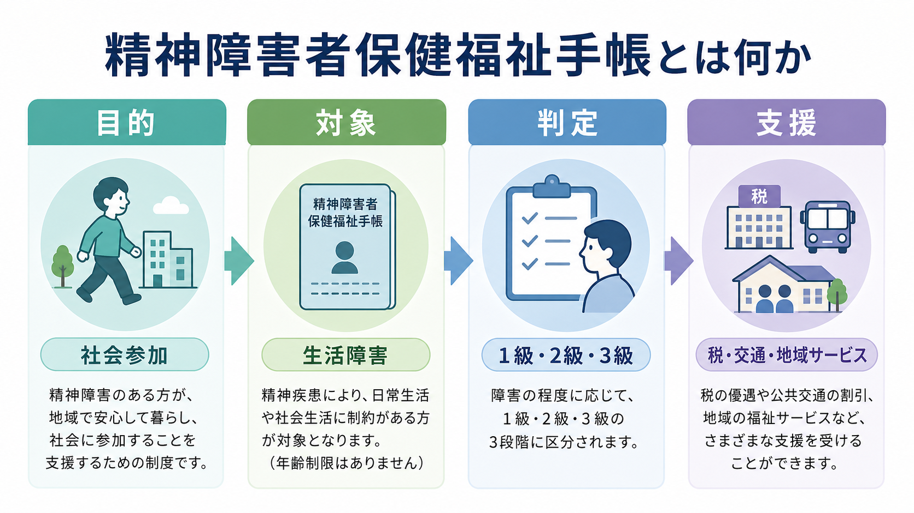
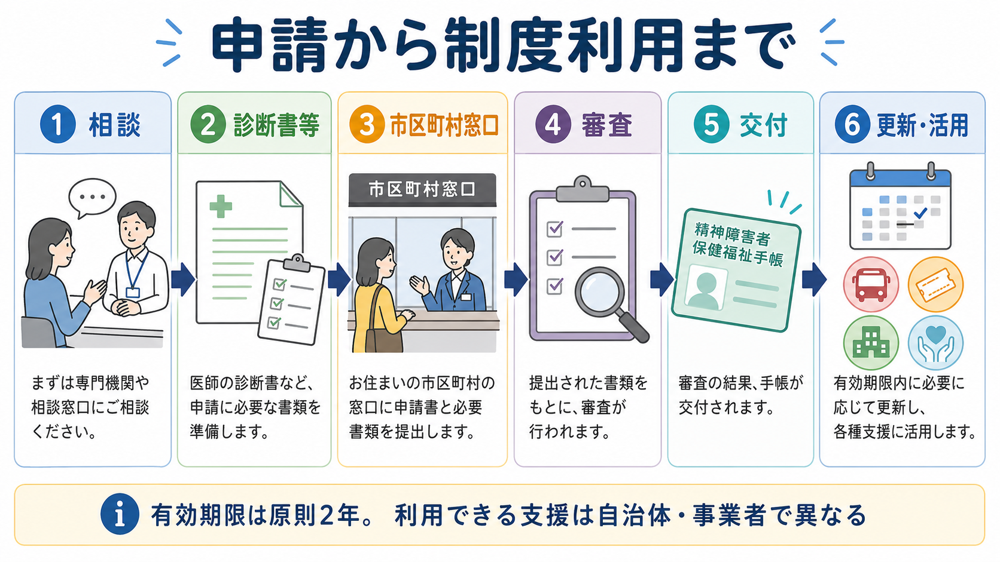
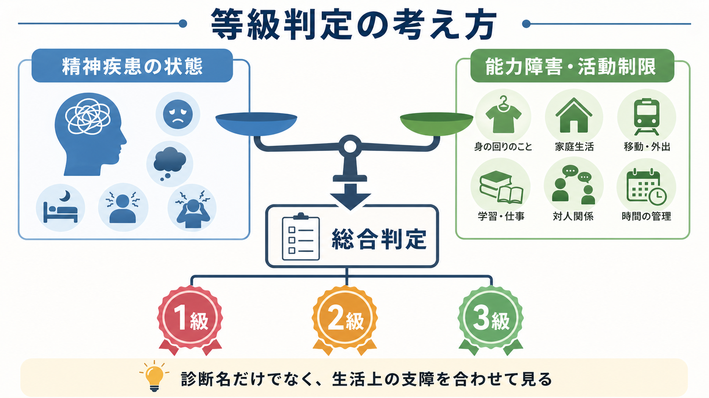

# 精神障害者保健福祉手帳とは何か

## 要点

- 精神障害者保健福祉手帳は、一定程度の精神障害の状態にあることを公的に認定し、本人の自立と社会参加を支えるための制度である[1]。
- 等級は1級・2級・3級で、診断名だけでなく、精神疾患の状態と能力障害・活動制限の両面から総合的に判定される[2][3]。
- 申請は原則として市町村窓口を経由し、診断書または精神障害を支給事由とする障害年金関係書類などを用いる[2]。
- 有効期限は原則2年で、継続して利用するには更新手続きが必要である[2]。
- 受けられる支援は、税制、公共交通、自治体サービス、民間事業者の割引などに及ぶが、地域・事業者・手帳の記載内容によって異なる[1][6][7]。

## この記事で答える問い

この記事では、精神障害者保健福祉手帳を「病名を証明するカード」としてではなく、精神疾患に伴う生活上の困難を福祉制度につなげるための仕組みとして整理する。具体的には、制度の目的、対象、申請、等級判定、利用できる支援、臨床や研究での位置づけを扱う。

医療・福祉制度に関する一般的な解説であり、個別の診断、等級判定、申請可否、税務判断、交通割引の適用可否を断定するものではない。実際の手続きは、居住地の市町村窓口、精神保健福祉センター、主治医、税務署、各交通事業者の案内で確認する必要がある。

## まず結論

精神障害者保健福祉手帳は、[[精神保健福祉法とは何か]]に基づく精神保健福祉制度の一部であり、精神疾患そのものを「治療する」制度ではない。中心にあるのは、精神疾患のために日常生活や社会生活に制限が生じている人が、社会参加・就労・移動・税制・地域サービスなどの支援へアクセスしやすくなるようにすることである[1][2]。

したがって重要なのは、「どの診断名なら取れるか」よりも、「その精神疾患によって、食事、清潔保持、金銭管理、通院、対人関係、社会的手続き、外出、文化的活動などがどの程度制限されているか」である。厚生労働省の判定基準も、精神疾患の状態と能力障害・活動制限の状態を合わせて総合判定する構造になっている[3][4]。

## 背景

精神障害者保健福祉手帳制度は、精神障害者の社会復帰、自立、社会参加を促進する目的で設けられた。厚生労働省の実施要領では、身体障害者手帳や療育手帳による福祉的配慮との関係を踏まえ、精神障害者にも各種支援策が講じられることを促進する制度として位置づけている[2]。

精神障害は、症状が外から見えにくい、状態が変動しやすい、本人の意思や努力の問題と誤解されやすい、という特徴をもつことがある。そのため、生活上の困難を制度上の支援につなげるには、診断名だけでなく機能障害や活動制限を記述し、行政手続きの中で評価できる形にする必要がある。

また、精神障害者の数は公的統計でも大きな規模を占める。令和6年版障害者白書では、精神障害者数は患者調査等に基づく推計として614万8千人とされている[5]。この数は、手帳所持者数そのものではないが、精神保健医療福祉が個人の医療問題にとどまらず、地域生活・雇用・教育・交通・所得保障と接続する領域であることを示している。

## 基本概念

### 手帳は「診断名の証明」ではない

手帳は、一定程度の精神障害の状態にあることを認定するものである[1]。診断名は重要な情報だが、それだけで等級が決まるわけではない。たとえば同じ[[うつ病とは何か]]、[[双極性障害とは何か]]、[[統合失調症とは何か]]、[[ADHDとは何か]]、[[PTSDとは何か]]、[[てんかんに伴う精神症状とは何か]]であっても、症状の持続、再燃の頻度、生活機能、支援の必要性は人によって異なる。

判定基準では、精神疾患の存在、精神疾患による機能障害、能力障害・活動制限、精神障害の程度を順に確認し、最終的に総合判定する[3]。この発想は、疾患を「ある/ない」で終わらせるのではなく、本人が地域で生活するうえでどのような支援を必要としているかを制度的に扱う点に特徴がある。

### 対象となる精神疾患

診断書の記入上は、手帳の交付を求める精神疾患について、ICDコードとしてF00-F99またはG40を付すことが想定されている[4]。これは、認知症などの器質性精神障害、統合失調症、気分障害、不安症、発達障害、てんかんなどを広く含む枠組みである。

ただし、実際に申請できるか、どの等級に該当するかは、診断名だけでなく状態像と生活上の制限に基づいて判断される。本人が制度利用を考える場合は、主治医、精神保健福祉士、自治体窓口と相談し、診断書に生活機能の実態が適切に反映されるようにすることが重要である。

### 3つの等級

等級は重い方から1級、2級、3級である。実施要領では、1級は日常生活の用を弁ずることを不能ならしめる程度、2級は日常生活が著しい制限を受けるか著しい制限を加えることを必要とする程度、3級は日常生活または社会生活が制限を受けるか、制限を加えることを必要とする程度とされる[2]。

ここでいう「制限」は、単なる不便さではなく、生活上の行為や社会参加を継続するためにどの程度の援助・配慮・環境調整が必要かという観点で理解するとよい。

## 仕組み

### 申請の流れ

申請は、市町村の担当窓口を経由して、都道府県知事または指定都市市長に行う[1]。手帳の交付は申請主義で、本人による申請が基本だが、家族や医療機関職員等が手続きを代行することも差し支えないとされている[2]。

典型的な流れは、次のように整理できる。

1. 主治医、精神保健福祉士、自治体窓口などに相談する。
2. 診断書、または精神障害を支給事由とする障害年金関係書類など、必要書類を準備する。
3. 居住地の市町村窓口へ申請する。
4. 都道府県・指定都市側で審査・判定が行われる。
5. 交付が認められた場合、手帳が交付される。
6. 有効期限内に支援を利用し、継続が必要なら更新する。

### 診断書と初診日

診断書による申請では、診断書は初診日から6か月以上経過した時点の情報に基づくことが想定されている[4]。これは、精神疾患の診断名だけでなく、一定期間にわたって生活上の活動制限や参加制約が生じているかを確認するためである。

診断書では、病名、初診年月日、現在の病状、日常生活能力、社会生活上の支障などが重要になる。本人や家族が困っていることを主治医に伝える際は、「つらい」だけでなく、「服薬管理が一人では難しい」「金銭管理で破綻しやすい」「対人関係が不安定で就労が続かない」「外出や公共機関の利用に支援が必要」など、生活場面に即して説明すると、制度上の評価につながりやすい。

### 有効期限と更新

手帳の有効期限は2年間である。有効期間の延長を希望する場合は更新手続きが必要で、2年ごとに障害等級に定める精神障害の状態にあることについて認定を受ける[2]。実施要領では、有効期限の3か月前から更新申請ができ、有効期限経過後でも更新申請は可能とされている[2]。

ただし、有効期限が切れていると、支援や割引の利用に支障が出ることがある。交通割引などでは、有効期限内の手帳であることが条件として明示される場合がある[7]。実務上は、期限の数か月前に自治体からの案内や手帳の記載を確認し、余裕をもって更新することが望ましい。

### 支援内容

手帳により利用しやすくなる支援は複数あるが、全国一律のものと自治体・事業者ごとに異なるものが混在する。

| 領域 | 例 | 注意点 |
|---|---|---|
| 税制 | 所得税の障害者控除、等級1級の場合の特別障害者該当など[6] | 所得・扶養・年末調整・確定申告の条件は税務上の確認が必要 |
| 交通 | JR等の障害者割引、自治体交通機関の割引など[7] | 旅客運賃減額欄、第1種・第2種、有効期限、顔写真など条件がある |
| 自治体サービス | 公共施設利用料、交通費助成、福祉手当、医療費助成等 | 自治体差が大きい |
| 就労・教育 | 障害者雇用枠、合理的配慮の相談、支援機関利用 | 手帳だけで配慮内容が自動決定されるわけではない |
| 生活支援 | 障害福祉サービス、相談支援、地域移行・地域定着支援など | 手帳とは別に支給決定やサービス利用計画が必要な場合がある |

厚生労働省は、障害者手帳所持者には障害者総合支援法の対象として支援策が講じられ、自治体や事業者の独自サービスを受けられることもあると説明している[1]。ただし、手帳があるだけで全サービスが自動的に使えるわけではない。制度ごとに申請、所得制限、等級要件、自治体要件、事業者要件がある。

## 図解

### 等級判定の中心

等級判定では、精神疾患の状態と生活機能の状態を分けて見たうえで、総合判定する。症状が強くても生活上の支援体制によって活動制限が軽減されている場合もあれば、症状が目立ちにくくても対人関係、金銭管理、通院継続、社会的手続きに大きな制約がある場合もある。

このため、臨床情報を制度につなぐときには、症状名の列挙だけでなく、生活のどの場面で、どの程度、どのような援助が必要かを具体化することが重要である。これは[[意思決定支援とは何か]]や[[地域移行支援とは何か]]、[[地域定着支援とは何か]]とも接続する視点である。

## 臨床・研究との接続

### 臨床では「生活機能の言語化」が鍵になる

臨床現場では、本人が手帳を申請するかどうかは、治療関係、自己理解、スティグマ、就労、家族関係、経済状況に影響される。申請を勧める場合も、単に「取った方が得」と説明するのではなく、本人がどの支援を必要としているのか、手帳取得にどのようなメリット・心理的負担・情報開示上の不安があるのかを確認する必要がある。

精神科診療では、症状評価に加えて、日常生活能力、社会参加、支援ニーズを具体的に把握することが重要である。これは[[精神科医療における行動制限最小化とは何か]]や[[精神科入院で患者の権利をどう守るのか]]と同様に、治療と権利擁護を分けずに考える実践である。

### 研究では「手帳所持」と「精神障害」を同一視しない

研究や統計で手帳を扱う場合、手帳所持者は精神障害者全体の一部である。精神障害があっても手帳を申請しない人、支援を必要としても制度につながっていない人、逆に状態が変化して更新時に等級が変わる人もいる。障害者白書の精神障害者数は患者調査等に基づく推計であり、手帳所持者数とは異なる概念である[5]。

そのため、「手帳所持」を精神疾患の有病率や重症度そのものとして扱うことはできない。研究上は、手帳所持を「制度利用」「公的認定」「生活機能上の支援ニーズに関連する指標」として慎重に位置づける必要がある。

## よくある誤解

### 誤解1: 手帳を取ると病名が周囲に知られる

手帳には障害等級や有効期限などが記載されるが、診断名そのものを日常的に周囲へ開示する制度ではない。ただし、利用するサービスによっては手帳の提示が必要になる。どこまで情報を出すかは、利用場面ごとに確認する必要がある。

### 誤解2: 手帳があると就職で必ず不利になる

手帳を取得しただけで、すべての場面で開示義務が生じるわけではない。障害者雇用枠を利用する場合や合理的配慮を求める場合には、一定の開示が必要になることがあるが、開示の範囲やタイミングは支援機関と相談しながら検討できる。就労では、[[ADHDとは何か]]や[[双極性障害とは何か]]などの診断名よりも、業務上どのような配慮が必要かを具体化することが重要である。

### 誤解3: 手帳は一度取れば永久に使える

精神障害者保健福祉手帳には有効期限があり、原則2年ごとの更新が必要である[2]。状態が変われば等級が変更されることもある。これは精神疾患の状態や生活機能が変化しうることを制度上反映している。

### 誤解4: 3級なら支援はほとんどない

3級でも税制や自治体サービス、交通・施設割引などの対象になる場合がある。ただし、どの支援が使えるかは地域・制度・事業者によって違う。手帳取得の意義は等級名だけでは判断できず、本人の生活課題に対してどの制度が実際に役立つかで考える必要がある。

### 誤解5: 手帳は治療をあきらめる制度である

手帳は治療の代替ではない。むしろ、治療を続けながら地域生活を安定させるための環境調整の一部である。通院、服薬、生活リズム、就労、家族関係、経済的不安、移動手段の問題を切り分け、必要な支援に接続するための道具として考えると理解しやすい。

## 関連ノート

- [[精神保健福祉法とは何か]]
- [[地域移行支援とは何か]]
- [[地域定着支援とは何か]]
- [[意思決定支援とは何か]]
- [[精神科入院で患者の権利をどう守るのか]]
- [[うつ病とは何か]]
- [[双極性障害とは何か]]
- [[ADHDとは何か]]
- [[PTSDとは何か]]
- [[てんかんに伴う精神症状とは何か]]

## MOC更新候補

- [[MOC｜精神医学]]
- [[MOC｜倫理・哲学・社会]]

## 理解チェック

1. 精神障害者保健福祉手帳は、精神疾患の診断名だけで等級が決まる制度だろうか。
2. 等級判定で、精神疾患の状態と合わせて評価される生活機能の例を3つ挙げられるか。
3. 手帳の有効期限と更新時期について、本人や支援者が確認すべき点は何か。
4. 税制・交通・自治体サービスのうち、全国一律のものと地域差があるものを区別できるか。
5. 臨床や研究で「手帳所持者」と「精神障害者全体」を同一視してはいけない理由は何か。

## 未解決問題

- 自治体や事業者ごとの差が大きく、手帳を取得しても実際に使える支援の見通しが本人に分かりにくい。
- 精神障害に対するスティグマや情報開示への不安が、制度利用を妨げることがある。
- 診断書の記載内容が生活機能を十分に反映しない場合、本人の困難が制度上過小評価される可能性がある。
- 手帳、障害年金、障害福祉サービス、就労支援、合理的配慮の関係は複雑で、総合的な相談支援が必要である。

## 参考文献

[1] 厚生労働省. 障害者手帳について. https://www.mhlw.go.jp/stf/seisakunitsuite/bunya/hukushi_kaigo/shougaishahukushi/techou.html

[2] 厚生労働省. 精神障害者保健福祉手帳制度実施要領について（平成7年9月12日健医発第1132号）. https://www.mhlw.go.jp/web/t_doc?dataId=00ta4614&dataType=1&pageNo=1

[3] 厚生労働省. 精神障害者保健福祉手帳の障害等級の判定基準について（平成7年9月12日健医発第1133号）. https://www.mhlw.go.jp/web/t_doc?dataId=00ta4615&dataType=1

[4] 厚生労働省. 精神障害者保健福祉手帳の診断書の記入に当たって留意すべき事項についての一部改正について（平成23年3月3日障精発第303001号）. https://www.mhlw.go.jp/web/t_doc?dataId=00tb7246&dataType=1&pageNo=1

[5] 内閣府. 令和6年版障害者白書 参考資料 障害者の状況. https://www8.cao.go.jp/shougai/whitepaper/r06hakusho/zenbun/siryo_01.html

[6] 国税庁. No.1160 障害者控除. https://www.nta.go.jp/taxes/shiraberu/taxanswer/shotoku/1160.htm

[7] JR東日本. 障害者割引制度のご案内. https://www.jreast.co.jp/th/equipment/waribiki/

## 更新ログ

- 2026-04-28: 初版作成。制度概要、申請、等級判定、支援内容、図解、参考文献を追加。
