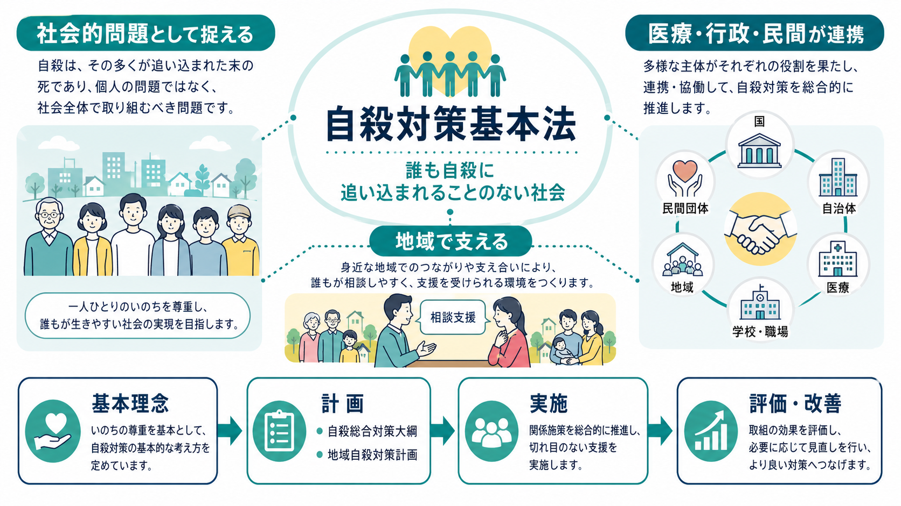
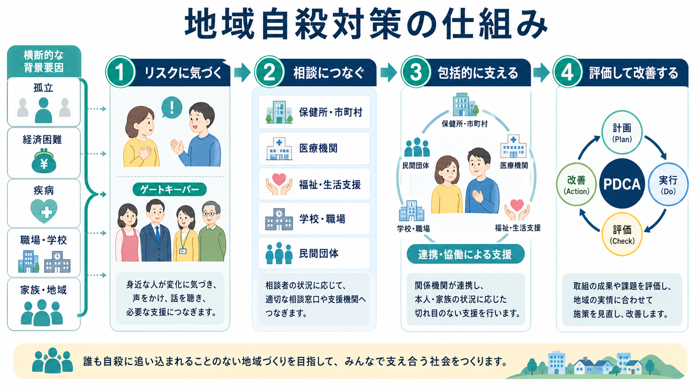

# 自殺対策基本法とは何か

## 要点

- 自殺対策基本法は、自殺を「個人の問題」だけに還元せず、社会的要因を含む公衆衛生・地域支援の課題として扱うための基本法である[1]。
- 法の中心には、「生きることの包括的な支援」「関係機関・関係団体の連携」「精神保健だけに限らない総合対策」「事前予防・危機対応・事後対応」という考え方がある[1]。
- 国は自殺総合対策大綱を定め、都道府県と市町村は地域の実情を踏まえた自殺対策計画を定める。これにより、自殺対策は国の理念だけでなく地域の実装課題になる[1][3]。
- 医療現場では、[[自殺リスク評価では何を聞くべきか|自殺リスク評価]]、救急・精神科医療、生活困窮支援、学校・職場・地域相談を切れ目なく接続する視点が重要になる[1][5][6]。
- 令和7年改正では、こどもの自殺対策、デジタル社会、インターネット上の自殺関連情報、関係者協議の仕組みがより明確化された[1][2]。

## この記事で答える問い

1. 自殺対策基本法は、何を目的に作られた法律なのか。
2. 「自殺を社会的問題として捉える」とは、具体的に何を意味するのか。
3. 国、自治体、医療、学校、職場、民間団体はどのように連携するのか。
4. 精神科臨床や地域精神保健の実践では、どのように使える視点なのか。

## まず結論

自殺対策基本法とは、自殺を「本人の意思だけの問題」や「精神疾患だけの問題」として扱うのではなく、孤立、経済困難、疾病、家族関係、学校・職場、情報環境、支援アクセスの不足が重なる社会的な問題として捉え、国と地域が計画的に対策を進めるための法律である。法は、自殺対策を「生きることの包括的な支援」と位置づけ、保健・医療・福祉・教育・労働などの施策を有機的に結びつけることを求めている[1]。

したがって、この法律を読むときの焦点は「自殺を禁止する法律」ではない。むしろ、誰が、どの段階で、どの支援につなぐのかを制度として組み立てる法律である。危機の前に孤立を減らし、危機の最中に相談・医療・安全確保へ接続し、未遂後や遺族支援も含めて継続的に支える。そのための国の大綱、地域自殺対策計画、医療提供体制、人材養成、調査研究、民間団体支援が法律上の柱になる[1][3]。

## 背景

日本では、1990年代末から2000年代にかけて自殺者数が高い水準で推移し、自殺対策を個別の相談や医療対応だけでなく、社会全体の課題として扱う必要が強く認識された。自殺対策基本法は2006年に成立し、その後の改正を通じて、地域計画、こども、学校、デジタル社会、情報環境への対応を含む枠組みへ拡張されてきた[1][2]。

最新の自殺対策白書も、自殺の現状と施策の実施状況を毎年整理している。これは、法が単なる理念法ではなく、統計、白書、大綱、地域計画、予算事業を通じて、施策を継続的に見直す仕組みを持つことを示している[4]。

国際的にも、自殺予防は個人の危機介入だけではなく、手段へのアクセス制限、メディア報道、青少年支援、早期発見、継続的フォローアップ、地域に根ざした包括的戦略を組み合わせる課題として扱われる。WHO の LIVE LIFE は、国レベルの包括的な自殺予防戦略と地域の実装を重視しており、日本の自殺対策基本法と大綱を理解するうえでも重要な参照枠になる[5]。

## 基本概念

### 生きることの包括的な支援

法の基本理念では、自殺対策は「生きることの包括的な支援」として実施されるべきものとされる[1]。これは、本人の精神症状だけを評価するのではなく、生活、住まい、仕事、学校、家族、借金、孤立、暴力、身体疾患、支援へのつながりを含めて支えるという意味である。

この点は、[[地域連携は精神科診療で何を意味するのか|地域連携]]や[[精神科で多職種連携はなぜ重要なのか|多職種連携]]の考え方と直結する。診察室で希死念慮を確認するだけでは足りない。本人が危機を越えるために、誰が連絡先になり、どの相談窓口につながり、どの医療・福祉・生活支援が動くのかを設計する必要がある。

### 個人要因と社会要因を切り離さない

自殺対策基本法は、自殺を「個人的な問題としてのみ捉えられるべきものではない」とし、背景に社会的要因があることを踏まえるよう求めている[1]。ここで重要なのは、精神疾患の影響を軽視することではない。[[精神疾患と自殺リスクはどう関係するのか|精神疾患と自殺リスク]]は重要だが、それは失業、孤立、家族関係、身体疾患、物質使用、スティグマ、相談へのアクセス困難と相互作用する。

したがって、自殺対策は「治療か社会支援か」の二択ではない。うつ病や依存症の治療、危機介入、安全計画、生活困窮支援、学校・職場調整、遺族支援を同じ地図の上で扱うことが、法の発想に近い。

### 予防・危機対応・事後対応

法は、自殺対策を事前予防、危機への対応、自殺発生後または未遂後の事後対応の各段階に応じて実施するものとしている[1]。これは、予防を「啓発キャンペーン」だけに限らないという意味である。

| 段階 | 目的 | 具体例 |
|---|---|---|
| 事前予防 | 孤立や困難が危機化する前に支える | 相談窓口、学校・職場のメンタルヘルス、生活困窮支援、ゲートキーパー養成 |
| 危機対応 | 差し迫った危険を下げ、支援へ接続する | 救急対応、精神科評価、安全確保、家族・支援者との連絡、手段へのアクセス低減 |
| 事後対応 | 再企図、連鎖的影響、遺族の苦痛を減らす | 未遂者支援、フォローアップ、遺族支援、職場・学校・地域でのポストベンション |

### デジタル社会とこどもの自殺対策

令和7年改正により、デジタル社会の進展を踏まえた情報通信技術や人工知能関連技術の適切な活用、インターネット等を通じて流通する自殺関連情報への配慮、こどもの自殺対策の社会全体での推進が基本理念に明記された[1][2]。これは、SNS相談やオンライン支援の可能性だけでなく、有害情報、模倣、孤立した若者の相談アクセス、学校・家庭・地域の連携を制度課題として扱う方向を示している。

## 仕組み

### 1. 国の大綱

政府は、自殺総合対策大綱を定める。大綱は、政府が推進すべき自殺対策の基本的・総合的な指針であり、おおむね5年を目途に見直される。令和4年10月14日に閣議決定された大綱では、子ども・若者、女性、地域自殺対策、新型コロナウイルス感染症拡大の影響を踏まえた対策などが強調された[2]。

### 2. 地域自殺対策計画

都道府県と市町村は、大綱や地域の実情を踏まえて自殺対策計画を定める。地域計画の意義は、全国一律の標語を掲げることではなく、その地域でどの年齢層、生活課題、職場・学校・医療資源、相談経路が問題になっているのかを分析し、実行可能な事業に落とし込む点にある[1][3]。

厚生労働省の「地域自殺対策計画」策定・見直しの手引きは、令和4年大綱と地域の実情を踏まえ、計画策定・見直しの標準的手順と留意点を整理している[3]。このため、地域自殺対策は、理念だけでなく、地域診断、事業棚卸し、関係機関連携、評価改善を含む行政実務である。

### 3. 医療提供体制と連携

法は、精神科医療を受けやすい環境、精神科医や医療従事者への研修、身体医療・救急医療と精神科医療の連携、心理・保健福祉・民間団体との連携を求めている[1]。自殺未遂者が救急外来に来たとき、身体処置だけで帰すのではなく、心理社会的評価、再企図予防、精神科・地域支援への接続を検討する必要がある。

NICE の self-harm ガイドラインも、自傷後の対応では、将来リスクを単純な尺度だけで分類するのではなく、心理社会的評価、本人のニーズ、安全、フォローアップを重視する[6]。これは、法が求める「危機対応から継続支援へ」という視点と重なる。

### 4. 早期発見、相談、未遂者支援、遺族支援

法は、自殺の危険性が高い者を早期に発見し、相談その他の適切な対処を行う体制を整えること、自殺未遂者等への継続的支援、遺族等への総合的支援、民間団体の活動支援を求めている[1]。ここでの「発見」は、監視や通報だけではない。学校、職場、地域、医療、福祉、相談窓口が、変化に気づき、本人の尊厳を保ちながら支援につなぐことを意味する。

## 図解

この図の要点は、地域自殺対策を「気づく」「つなぐ」「包括的に支える」「評価して改善する」という循環として見ることである。孤立、経済困難、疾病、学校・職場、家族・地域の問題は別々に見えるが、危機の場面では重なりやすい。そこで、ゲートキーパー、保健所・市町村、医療機関、福祉・生活支援、学校・職場、民間団体が、同じ人の生活を別々の角度から支える必要がある。

## 臨床・研究との接続

### 臨床では「評価」から「接続」へ進める

精神科臨床で自殺対策基本法を読む意義は、リスク評価を制度的な接続に変える視点を持てる点にある。[[希死念慮とは何か|希死念慮]]や自殺念慮の評価は重要だが、それだけでは支援にならない。評価の後には、安全計画、手段へのアクセス低減、家族・支援者との合意、救急・精神科・地域相談への接続、次回確認日が必要になる。

WHO の LIVE LIFE は、手段へのアクセス制限、責任あるメディア報道、思春期の社会情動的スキル、早期同定・評価・管理・フォローアップを主要な介入として示す[5]。Mann らの系統的レビューも、手段制限、医療者教育、精神疾患の治療、メディア報道など、複数の戦略を組み合わせる重要性を示した[7]。

### 研究では「多層介入」と「実装」を見る

自殺対策研究では、個人の危険因子を同定するだけでなく、介入が地域に実装され、届くべき人に届き、継続され、結果が評価されるかが重要になる。地域自殺対策計画は、研究でいえば実装科学、疫学、政策評価、サービス研究の対象である。どの地域で、どの相談経路が機能し、どの集団が支援から漏れやすいのかを検証する必要がある。

### 倫理面では尊厳と生活の平穏を守る

法は、自殺者、自殺未遂者、親族等の名誉と生活の平穏に配慮することを求めている[1]。これは、センシティブな情報を扱う医療・行政・学校・職場にとって重要である。連携は必要だが、情報共有は目的、範囲、同意、緊急性、本人への説明を踏まえて最小限に行う必要がある。これは[[守秘義務とは何か]]の実践にも接続する。

## よくある誤解

### 誤解1: 自殺対策基本法は精神科だけの法律である

これは誤りである。法は精神保健的観点を含むが、それだけに限らず、保健、医療、福祉、教育、労働などの施策との有機的連携を求めている[1]。精神科医療は重要な一部だが、生活困窮、学校、職場、孤立、遺族支援、民間団体の活動まで含めて初めて法の枠組みになる。

### 誤解2: 自殺対策は啓発週間だけのキャンペーンである

自殺予防週間や自殺対策強化月間は重要だが、それだけではない。法は、大綱、地域計画、医療提供体制、早期発見、未遂者支援、遺族支援、調査研究、人材養成を含む継続的な仕組みを求めている[1]。

### 誤解3: 自殺を社会問題と呼ぶと、本人の苦痛が軽視される

むしろ逆である。本人の苦痛を軽視しないために、その苦痛が生じ、強まり、相談できなくなる環境を変える必要がある。社会的要因を見ることは、本人の責任にすることを避け、支援可能な条件を増やすための視点である。

### 誤解4: リスクの高い人を見つければ十分である

発見は出発点であって、到達点ではない。NICE は自傷後の対応で、単純なリスク分類だけに頼らず、本人のニーズ、心理社会的背景、安全、再発予防を含む評価と支援を重視する[6]。地域自殺対策でも、見つけることより、適切につなぎ、継続的に支えることが重要である。

## 関連ノート

- [[自殺リスク評価では何を聞くべきか]]
- [[希死念慮とは何か]]
- [[精神疾患と自殺リスクはどう関係するのか]]
- [[地域連携は精神科診療で何を意味するのか]]
- [[精神科で多職種連携はなぜ重要なのか]]
- [[守秘義務とは何か]]

MOC更新候補: `content/00_MOC/` 配下の精神医学、地域精神保健、自殺予防、司法・制度・地域精神医療に関する MOC へ追加候補。並列ジョブとの衝突を避けるため、このタスクでは MOC 本体は更新しない。

今後の作成候補: 自殺総合対策大綱とは何か、地域自殺対策計画とは何か、ゲートキーパーとは何か、自殺未遂者支援とは何か、ポストベンションとは何か、SNS相談は自殺対策でどう位置づけられるのか。

## 理解チェック

1. 自殺対策基本法が「生きることの包括的な支援」と呼ぶものは、精神科治療だけと何が違うか。
2. 国の自殺総合対策大綱と、都道府県・市町村の地域自殺対策計画はどのように関係するか。
3. 医療機関が地域自殺対策に関わるとき、身体医療、精神科医療、福祉、相談支援のどこに接続点があるか。
4. 自殺を社会的問題として扱うことは、本人の責任や苦痛の理解をどのように変えるか。

## 参考文献

[1] e-Gov法令検索. 自殺対策基本法（平成十八年法律第八十五号）. https://laws.e-gov.go.jp/law/418AC0100000085

[2] 厚生労働省. 自殺総合対策大綱～誰も自殺に追い込まれることのない社会の実現を目指して～（令和4年10月14日閣議決定）. https://www.mhlw.go.jp/stf/taikou_r041014.html

[3] 厚生労働省. 「地域自殺対策計画」策定・見直しの手引き（令和5年6月）. https://www.mhlw.go.jp/stf/seisakunitsuite/bunya/hukushi_kaigo/seikatsuhogo/jisatsu/chiiki_guideline.html

[4] 厚生労働省. 令和7年版自殺対策白書. https://www.mhlw.go.jp/stf/seisakunitsuite/bunya/hukushi_kaigo/seikatsuhogo/jisatsu/jisatsuhakusyo2025.html

[5] World Health Organization. (2021). *LIVE LIFE: An implementation guide for suicide prevention in countries*. https://www.who.int/publications/i/item/9789240026629

[6] National Institute for Health and Care Excellence. (2022). *Self-harm: assessment, management and preventing recurrence* (NICE guideline NG225). https://www.ncbi.nlm.nih.gov/books/NBK588208/

[7] Mann, J. J., Apter, A., Bertolote, J., et al. (2005). Suicide prevention strategies: A systematic review. *JAMA, 294*(16), 2064-2074. https://doi.org/10.1001/jama.294.16.2064

## 未解決問題

- 令和7年改正後の協議会制度やこどもの自殺対策が、自治体現場でどのように運用されるかは、今後の通知、予算、地域計画の更新を追う必要がある。
- SNS相談、AI関連技術、有害情報対策を、自殺リスクの検出だけでなく本人の権利、プライバシー、支援アクセスの改善とどう両立させるかは継続的な検討課題である。
- 地域自殺対策計画の効果評価では、自殺死亡率だけでなく、相談接続、未遂者支援、孤立の低減、支援から漏れやすい集団への到達をどう測るかが課題である。
