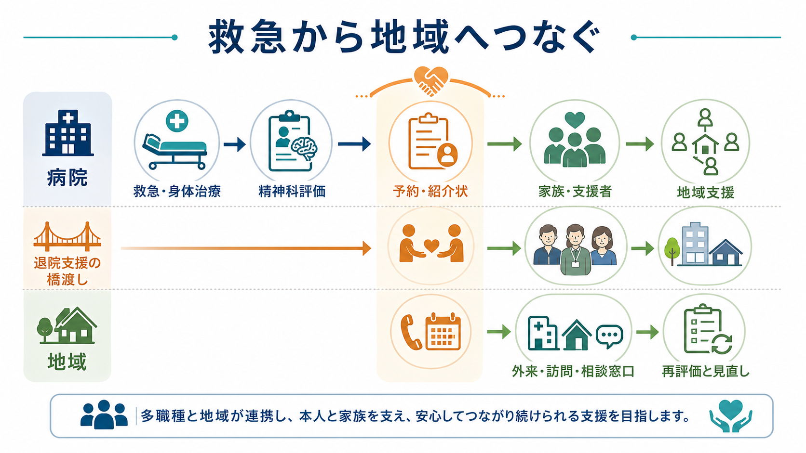
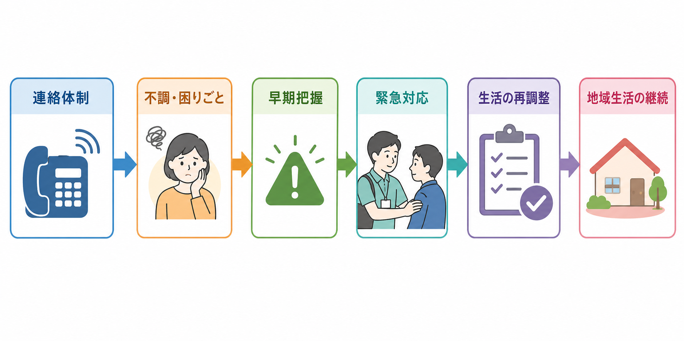
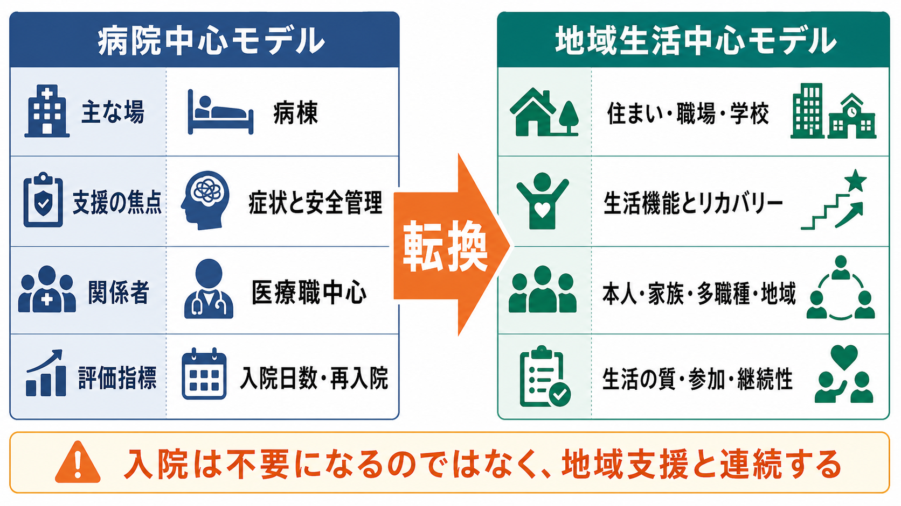

# 自殺未遂者支援では何を行うのか

## 要点

- 自殺未遂者支援は「命が助かった後に、もう一度危機へ戻らないための支援」を組み立てる実践である。
- 救急医療では、身体治療と並行して、現在の希死念慮、企図の意図、精神症状、物質使用、生活上の危機、保護因子を評価する[1][2]。
- 評価は「低・中・高リスク」と分類して終えるものではない。本人の背景、直近の変化、今後の危機、使える支援をまとめ、具体的な安全計画と継続支援へ翻訳する[3]。
- 安全計画は、警告サイン、本人ができる対処、連絡先、専門機関、手段へのアクセス制限を、本人と一緒に書面化する介入である[3][5]。
- 再企図予防では、退院後の初期フォロー、ケースマネジメント、電話・訪問などの能動的接触、家族・地域資源との連携が重要になる[6][7][8]。

この記事は教育・研究目的の概説であり、個別の診断、治療方針、緊急時対応を指示するものではない。切迫した危険がある場合は、地域の救急・医療機関・相談窓口につなぐことが優先される。

## この記事で答える問い

1. 自殺未遂者支援は、救命後に何を評価し、何を調整するのか。
2. 精神科評価と安全計画は、どのように再企図予防へつながるのか。
3. 退院後に地域・家族・外来・相談窓口をどう結びつけるのか。
4. 「入院させるかどうか」だけでは捉えきれない支援の焦点は何か。

## まず結論

自殺未遂者支援で行うことは、単に「精神科へ紹介すること」でも「入院適応を決めること」でもない。救急医療で身体的安全を確保しながら、本人がなぜその時点で死に近づいたのかを評価し、直後の危機を下げ、退院後に孤立しない仕組みを作ることである。

そのため支援は、身体治療、[[自殺リスク評価では何を聞くべきか|自殺リスク評価]]、[[精神科救急では何を優先するべきか|精神科救急]]、[[クライシスプランとは何か|クライシスプラン]]、[[再発予防計画とは何か|再発予防計画]]、[[精神保健福祉法とは何か|精神保健福祉法]]、地域支援の接点に位置づく。中心にあるのは、「危険な人を選別する」ことではなく、「危険が高まる条件を具体化し、支援で変えられる部分を増やす」ことである[3]。

## 背景

自殺未遂後の時期は、再企図の危険が高い。救急医療はこの危機に最初に接する場であり、身体治療だけで終わると、本人が生活の場に戻った直後の孤立、治療中断、生活問題、家族との葛藤、物質使用、経済問題が残りやすい。

日本の「自殺未遂者ケアガイドライン」は、救急外来・救急科・救命救急センターで、情報収集、企図の有無、現在の希死念慮、危険因子、入院適応、退院前に行うべきこと、精神科コンサルテーション、医療ソーシャルワーカーや精神保健福祉士の役割を整理している[1]。これは、救急医療と精神医療を分離せず、同じ患者を多職種で支える必要があることを示している。

WHO の自殺予防実装ガイド LIVE LIFE も、手段へのアクセス制限、メディア報道、若者のライフスキル、リスクの早期同定と支援を、地域と制度をまたぐ公衆衛生介入として位置づけている[4]。未遂者支援は、そのなかでも「危機がすでに顕在化した人を、医療から地域へつなぎ直す」場面である。

## 基本概念

### 自殺未遂

自殺未遂は、死に至らなかった自殺企図を指す。ただし臨床では、本人の意図、致死性、衝動性、救助可能性、事後の気持ちが一様ではない。[[自殺念慮と自殺企図は何が違うのか|自殺念慮と自殺企図]]、[[自傷と自殺企図はどう違うのか|自傷と自殺企図]]、[[非自殺性自傷とは何か|非自殺性自傷]]の区別は重要だが、区別したからといって安全評価を省略できるわけではない。

### 心理社会的評価

心理社会的評価とは、診断名だけでなく、直前の出来事、本人の意味づけ、精神症状、身体疾患、物質使用、家族・学校・職場・経済問題、住居、支援者、保護因子をまとめる評価である。NICE は、自傷後できるだけ早期にメンタルヘルス専門職が心理社会的評価を行い、身体治療の終了まで評価を遅らせないこと、またリスク尺度や「低・中・高」の層別化だけで退院や支援の可否を決めないことを推奨している[3]。

### 安全計画

安全計画は、危機が高まる前兆と対処を、本人が使える順番で整理した短い計画である。典型的には、警告サイン、自分でできる対処、気をそらせる場所や人、相談できる人、専門機関・救急連絡先、手段へのアクセスを減らす方法を含む[3][5]。これは「約束」や「念書」ではなく、危機の最中でも参照できる共同作業の成果である。

### 能動的フォローアップ

能動的フォローアップとは、本人が自分から外来や相談先に来るのを待つだけでなく、電話、面接、訪問、予約調整、受診同行、社会資源の紹介などで継続接触する支援である。救急医療後の再企図予防研究では、退院後の電話連絡やケースマネジメントを含む介入が、再企図を減らす可能性を示している[6][7][8]。

## 仕組み

### 1. 救命と身体治療を優先する

最初に行うのは、身体的危険の評価と治療である。意識、呼吸循環、外傷、中毒、薬物過量、合併症を確認し、救命処置や観察を行う。[[精神疾患と過量服薬はどう関係するのか|過量服薬]]では、薬剤名や量だけでなく、併用物質、服薬時刻、処方源、再入手可能性も重要になる。

この段階での精神科的関わりは、身体治療を邪魔するものではない。むしろ、本人が落ち着いた時点を待つだけでなく、可能な範囲で情報を集め、家族・救急隊・紹介元・診療録から危機の流れを把握する[1][3]。

### 2. 現在の危険と背景を同時に見る

評価では、現在も死にたい気持ちが続いているか、具体的な計画があるか、方法へのアクセスが残っているか、救助を求めたか、後悔や安心があるか、精神病症状・躁状態・重いうつ・せん妄・物質中毒があるかを確認する。同時に、本人が何を失ったと感じ、何が耐えがたかったのかも聞く。

ここで重要なのは、危険因子をリスト化するだけでなく、時間の流れを作ることである。数日前、数時間前、企図時、救助後、今、退院後の見通しを並べると、支援で変えられる点が見えやすい。

### 3. 入院・退院・観察の判断を行う

入院は、切迫した危険、精神症状、身体治療、環境調整、支援不在がある場合に検討される。一方で、入院そのものが再企図を自動的に防ぐわけではない。必要なのは、入院中にも退院後にも続く計画である。

退院を検討する場合は、心理社会的評価が行われ、今後の支援計画、連絡先、受診予約、家族や支援者との共有、手段へのアクセス低減が確認されている必要がある。NICE は、一般病院から退院する前に心理社会的評価、関係機関を含む管理計画、退院計画会議、アフターケアの明確な手配を求めている[3]。

### 4. 安全計画を本人と作る

安全計画は、本人の言葉で書くほど使いやすい。たとえば「眠れない」「同じ考えが止まらない」「連絡を返せなくなる」といった本人固有の警告サインから始め、次に深呼吸、場所を変える、音楽を聞く、支援者に短文を送る、夜間窓口へ連絡するなど、段階的な行動へ落とし込む。

Stanley らの研究では、救急部門での安全計画介入と構造化された電話フォローを組み合わせた群は、通常ケアより6か月後の自殺関連行動が少なく、外来治療への関与も高かった[5]。安全計画はそれ単独で万能な介入ではないが、退院後の接触や治療継続と組み合わせることで実装しやすい中核部品になる。

### 5. 地域連携とケースマネジメントを組む

退院後には、外来予約が入っているだけでは不十分なことがある。本人が受診できる交通手段、費用、家族関係、住居、仕事・学校、支援者の有無、夜間休日の連絡先が整っていないと、計画は紙の上で止まる。

日本の ACTION-J 研究では、救急部門に入院した自殺未遂者に対して、ケースマネジャーが受診調整、社会資源紹介、治療継続支援、定期的連絡を行う積極的ケースマネジメントが検討された。通常ケア強化群と比較して、6か月までの再企図抑制が示された[7]。また、救急部門を起点とした能動的接触・フォローアップ介入のメタ解析でも、特に高リスクな初期期間に再企図を減らす可能性が示されている[8]。

## 図解

| 支援の段階 | 主な問い | 実際に行うこと |
|---|---|---|
| 救急・身体治療 | 生命危険はあるか | 救命処置、観察、中毒・外傷評価、情報収集 |
| 精神科評価 | なぜこの時点で企図に至ったか | 自殺念慮、精神症状、物質使用、生活問題、保護因子の評価 |
| 安全計画 | 次の危機をどう早く弱めるか | 警告サイン、対処、連絡先、専門機関、手段アクセス低減 |
| 退院前調整 | 退院後に孤立しないか | 外来予約、紹介状、家族説明、福祉・相談窓口、連絡手段 |
| 継続支援 | 支援が実際に使われているか | 電話、訪問、受診確認、治療中断時の再接続、計画の見直し |

## 臨床・研究との接続

臨床では、自殺未遂者支援を「一回の面接」で完結させないことが重要である。救急外来では時間が限られ、本人は疲弊し、身体治療や警察・家族対応が重なることもある。そのため、最初の面接で全てを理解するより、最低限の安全を確保し、次の接点を確実に作ることが優先される。

研究上は、再企図、死亡、救急再受診、外来継続、生活機能、本人の満足、家族負担、支援アクセスを分けて見る必要がある。ED-SAFE 研究では、救急部門でのスクリーニング、退院時資源提供、電話フォローを組み合わせた多面的介入により、52週の追跡で自殺企図の総数が通常ケアより少なかった[6]。ただし、文化、医療制度、退院後支援の密度が異なるため、海外研究の効果量をそのまま日本の現場へ当てはめるのではなく、地域資源と実装可能性を検討する必要がある。

日本では、救急医療、精神科、保健所・精神保健福祉センター、市町村、相談支援、訪問看護、学校・職場、家族支援が別々の制度で動きやすい。したがって、自殺未遂者支援は制度間の翻訳作業でもある。[[精神保健福祉法とは何か]]や[[自殺対策基本法とは何か]]の理解は、医療判断だけではなく地域支援の設計にも関わる。

## よくある誤解

### 誤解1：本人が「もう大丈夫」と言えば支援は不要である

危機直後には、救助された安心、疲労、家族への遠慮、入院回避の希望から、危険を低く語ることがある。本人の言葉を疑うのではなく、現在の言葉、直前の行動、方法へのアクセス、支援状況を合わせて見る必要がある。

### 誤解2：リスク尺度で低リスクなら退院してよい

尺度は面接の補助にはなるが、退院可否や支援の必要性を単独で決める道具ではない。NICE は、将来の自殺や自傷反復を予測する目的でリスク尺度や全般的リスク層別化を使わないよう推奨している[3]。重要なのは、危機の定式化と支援計画である。

### 誤解3：安全計画は「自殺しない約束」である

安全計画は約束ではない。危機時に使える行動手順であり、本人と支援者が共有する実用的なメモである。責任を本人に押し返す文書ではなく、支援へつながる道筋を短くする道具である。

### 誤解4：入院すれば再企図予防は完了する

入院は必要な場合があるが、退院後の孤立、治療中断、手段へのアクセス、生活問題が残れば再び危機は高まる。入院を選ぶ場合でも、退院後の外来、地域相談、家族支援、ケースマネジメントを同時に考える必要がある。

### 誤解5：自殺未遂者支援は精神科だけの仕事である

精神科評価は重要だが、救急医、看護師、薬剤師、医療ソーシャルワーカー、精神保健福祉士、地域支援者、家族がそれぞれ役割を持つ。多職種の連携がないと、医学的評価は生活上の支援へつながらない。

## 関連ノート

- [[自殺リスク評価では何を聞くべきか]]
- [[自殺念慮と自殺企図は何が違うのか]]
- [[自傷と自殺企図はどう違うのか]]
- [[非自殺性自傷とは何か]]
- [[精神科救急では何を優先するべきか]]
- [[クライシスプランとは何か]]
- [[再発予防計画とは何か]]
- [[精神疾患と過量服薬はどう関係するのか]]
- [[精神保健福祉法とは何か]]
- [[自殺対策基本法とは何か]]

MOC更新候補: `content/00_MOC/` 配下の精神医学、精神科救急、自殺予防、地域精神医療、臨床実践関連 MOC。並列ジョブとの競合回避のため、本記事では MOC 本体は更新しない。

## 理解チェック

1. 自殺未遂者支援で、身体治療と並行して精神科評価を行う理由は何か。
2. 「低リスク」と分類することと、危機の定式化を作ることは何が違うか。
3. 安全計画に含めるべき要素を5つ挙げよ。
4. 退院前に、外来予約以外に確認すべき生活・地域支援の要素は何か。
5. ケースマネジメントや能動的フォローアップが再企図予防に関わる理由を説明せよ。

## 参考文献

[1] 日本臨床救急医学会. 自殺未遂者ケアガイドライン 自殺未遂患者への対応 救急外来（ER）・救急科・救命救急センタースタッフのための手引き. 2009. 厚生労働省掲載. https://www.mhlw.go.jp/stf/seisakunitsuite/bunya/hukushi_kaigo/seikatsuhogo/jisatsu/houkoku_sonota.html

[2] 大塚耕太郎, 杉山直也, 河西千秋. 精神科救急医療ガイドライン: 自殺未遂者対応. 医学のあゆみ. 2021;279(1):36-42. https://ndlsearch.ndl.go.jp/books/R000000004-I031704292

[3] National Institute for Health and Care Excellence. Self-harm: assessment, management and preventing recurrence. NICE Guideline NG225. 2022. https://www.nice.org.uk/guidance/ng225

[4] World Health Organization. LIVE LIFE: An implementation guide for suicide prevention in countries. 2021. https://iris.who.int/handle/10665/341726

[5] Stanley B, Brown GK, Brenner LA, et al. Comparison of the Safety Planning Intervention With Follow-up vs Usual Care of Suicidal Patients Treated in the Emergency Department. JAMA Psychiatry. 2018;75(9):894-900. https://doi.org/10.1001/jamapsychiatry.2018.1776

[6] Miller IW, Camargo CA Jr, Arias SA, et al. Suicide Prevention in an Emergency Department Population: The ED-SAFE Study. JAMA Psychiatry. 2017;74(6):563-570. https://doi.org/10.1001/jamapsychiatry.2017.0678

[7] Kawanishi C, Aruga T, Ishizuka N, et al. Assertive case management versus enhanced usual care for people with mental health problems who had attempted suicide and were admitted to hospital emergency departments in Japan (ACTION-J): a multicentre, randomised controlled trial. The Lancet Psychiatry. 2014;1(3):193-201. https://doi.org/10.1016/S2215-0366(14)70259-7

[8] Inagaki M, Kawashima Y, Yonemoto N, Yamada M. Active contact and follow-up interventions to prevent repeat suicide attempts during high-risk periods among patients admitted to emergency departments for suicidal behavior: a systematic review and meta-analysis. BMC Psychiatry. 2019;19:44. https://doi.org/10.1186/s12888-019-2017-7

## 未解決問題

- 日本の地域差が大きいなかで、救急医療から地域支援への標準的な連携モデルをどこまで共通化できるか。
- 電話、訪問、デジタル支援、ピアサポートを、どの患者群・どの時期に組み合わせると最も効果的か。
- 再企図だけでなく、生活機能、孤立、治療同盟、家族負担、本人の尊厳を含むアウトカムをどう測るか。
- 安全確保と本人の自己決定を、切迫した危機の中でどのように両立させるか。

