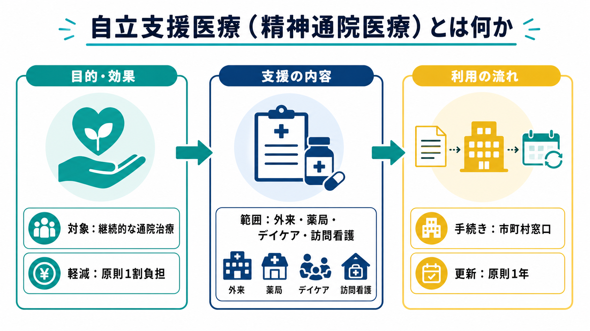
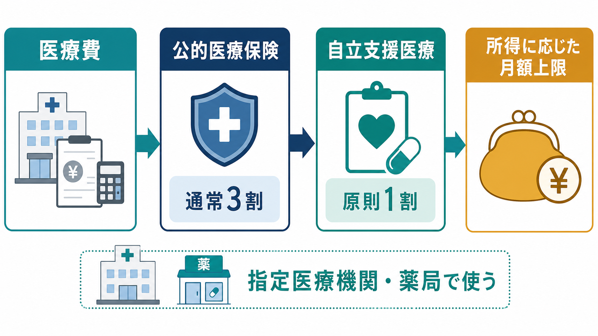
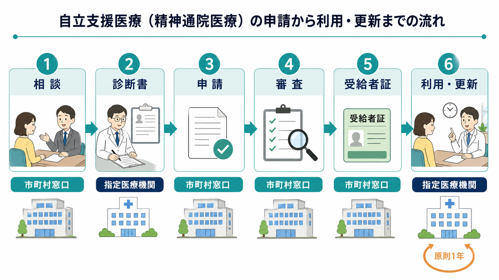

# 自立支援医療とは何か

## 要点

- 自立支援医療は、心身の障害を除去・軽減するための医療について、医療費の自己負担を軽減する公費負担医療制度である。精神科領域では「精神通院医療」が中心になる[1][2]。
- 精神通院医療の対象は、精神疾患やてんかんにより、通院による精神医療を継続的に必要とする人である。入院医療そのものは対象外である[2][3]。
- 認定されると、対象医療の自己負担は原則1割となり、所得区分や「重度かつ継続」などに応じて月額上限が設定される[4]。
- 利用できるのは、受給者証に記載された指定医療機関、薬局、訪問看護事業者などである。医療機関や薬局を変更する場合は、原則として変更申請が必要になる[5][6]。
- 申請窓口や細かな必要書類は自治体で異なるため、実務では主治医、医療機関の相談員、自治体窓口に確認する必要がある[5]。

## この記事で答える問い

1. 自立支援医療、特に精神通院医療は何を支える制度なのか。
2. 誰が対象になり、どの医療費が軽減されるのか。
3. 自己負担はどのように下がり、月額上限はどう考えるのか。
4. 申請、利用、更新では何に注意するのか。
5. 精神科臨床、地域支援、研究ではこの制度をどう位置づけるのか。

## まず結論

自立支援医療（精神通院医療）は、精神科外来を続けるための費用障壁を下げる制度である。対象は「精神疾患の診断名がある人すべて」ではなく、通院による精神医療を継続的に必要とする状態の人であり、対象医療は外来診療、外来での投薬、精神科デイ・ケア、訪問看護などに限られる[2][3]。

臨床的には、うつ病、双極症、統合失調症、不安症、PTSD、依存症、発達障害、認知症、てんかんなどで、長期の通院・服薬・心理社会的支援が必要なときに重要になる[3]。ただし、制度の利用は治療内容を決めるものではない。治療方針は本人と主治医の相談に基づき、制度はその継続を経済面から支える仕組みとして理解するのがよい。

## 背景

精神科治療では、症状が急性期を過ぎても、再発予防、服薬調整、心理教育、生活リズムの回復、就労・復学支援、家族支援、訪問看護などが長く続くことがある。費用負担が大きいと、受診間隔が不安定になったり、薬局での支払いを避けたり、必要なデイ・ケアや訪問看護につながりにくくなったりする。

NCNPの「こころの情報サイト」も、こころの病気の治療で利用可能な社会的支援として、外来通院、処方薬、訪問看護、デイケア等への公的支援を紹介している[7]。WHO は、メンタルヘルスケアを地域で利用しやすくし、質の高い支援へ接続することを各国の重要課題としている[8]。日本の自立支援医療は、そのうち「費用負担を下げ、通院継続を支える」部分を担う制度である。したがって、[[地域移行支援とは何か]]、[[地域定着支援とは何か]]、[[精神保健福祉法とは何か]]のような地域精神医療の制度と合わせて理解すると見通しがよい。

## 基本概念

### 自立支援医療の三類型

自立支援医療には、精神通院医療、更生医療、育成医療の三類型がある[1][6]。

| 類型 | 主な対象 | 精神科臨床との関係 |
|---|---|---|
| 精神通院医療 | 継続的な精神科通院医療を要する人 | 本記事の中心。外来、薬局、デイ・ケア、訪問看護など |
| 更生医療 | 身体障害者手帳を持つ18歳以上の人で、障害の軽減が期待される医療を受ける人 | 精神科制度とは別枠だが、身体合併症や障害福祉の理解に関係する |
| 育成医療 | 身体に障害のある18歳未満の児童で、障害の軽減が期待される医療を受ける人 | 児童福祉・小児医療の制度として扱う |

### 精神通院医療で対象になりうる疾患

厚生労働省は、精神通院医療の対象疾患として、器質性精神障害、物質使用による精神・行動の障害、統合失調症圏、気分障害、てんかん、神経症性障害、ストレス関連障害、身体表現性障害、発達障害、知的障害などを挙げている[2]。これは「この病名なら必ず認定される」という意味ではない。実際には、通院による精神医療を継続的に必要とする状態かどうかが、診断書や自治体の審査で判断される。

### 対象になる医療、ならない医療

対象になるのは、精神障害およびその精神障害に起因して生じた病態に対して、入院しないで行われる医療である。厚労省の説明資料では、外来、外来での投薬、デイ・ケア、訪問看護などが含まれる[3]。

一方で、入院医療費、公的医療保険の対象外の治療や投薬、精神障害と関係のない疾患の医療費は対象外である[3]。たとえば、精神科外来と同じ病院で身体疾患の診療を受けても、それが精神障害に起因する対象医療でなければ自立支援医療の対象にはならない。

## 仕組み

### 自己負担は原則1割

自立支援医療では、対象医療について自己負担が原則1割になる。さらに、所得区分に応じて1か月あたりの自己負担上限額が設定される。厚生労働省の負担枠組みでは、月額総医療費の1割が上限額に満たない場合は1割を負担し、上限に達した後はその月の対象医療について追加負担が抑えられる構造になっている[4]。

### 「世帯」と所得区分

ここでいう「世帯」は、住民票上の世帯と完全に同じとは限らず、医療保険の加入関係に基づいて扱われることがある。所得区分や課税状況、医療保険の種類により、上限額や必要書類が変わる。東京都福祉局は、区市町村民税所得割が一定以上の世帯について、原則対象外だが「重度かつ継続」に該当する場合には経過措置により対象となることを説明している[5]。この種の条件は更新されうるため、申請時点の自治体資料を確認する必要がある。

### 指定医療機関で使う制度

自立支援医療は、どの医療機関でも自由に使える割引制度ではない。受給者証に記載された指定自立支援医療機関、薬局、訪問看護事業者などで使う制度である[5][6]。主治医の外来、調剤薬局、訪問看護を別々に利用している場合、それぞれが指定先として適切に登録されているかが重要になる。

### 申請から利用まで

一般的な流れは、主治医や相談員への相談、診断書などの準備、自治体窓口への申請、審査、受給者証の交付、指定医療機関等での提示である。東京都は、申請先を居住地の区市町村窓口とし、申請書、診断書、医療保険の加入関係を示す書類、所得状況等を確認できる書類などを必要書類として挙げている[5]。

### 有効期間と更新

受給者証の有効期間は原則1年で、更新を希望する場合は毎年手続きが必要になる。東京都の説明では、更新申請は有効期間満了日の3か月前から可能で、診断書提出は継続申請で2年に1度となる場合があるが、受給者証の更新手続き自体は毎年必要である[5]。有効期限を過ぎると再開申請扱いになり、診断書が必要になることがある。

## 図解

この記事の3枚の図は、制度を次のように分けて読むための補助である。

| 図 | 何を示すか | 読み方 |
|---|---|---|
| 全体像 | 対象、軽減、範囲、手続き、更新 | 制度の入口をつかむ |
| 自己負担の仕組み | 通常負担、原則1割、月額上限 | 「安くなる」だけでなく上限管理の制度だと理解する |
| 申請フロー | 相談、診断書、申請、審査、受給者証、更新 | 診療と行政手続きが分かれている点を確認する |

## 臨床・研究との接続

### 治療継続を支える制度として見る

精神科治療では、症状の改善だけでなく、治療を続けられる条件を整えることが重要である。自立支援医療は、服薬や外来通院、デイ・ケア、訪問看護の費用負担を下げることで、[[精神科治療計画はどのように立てるのか|治療計画]]の継続可能性を高める。これは、制度上の支援であって、本人の努力不足を補う「特別扱い」ではない。

### 多職種連携の入口になる

申請には診断書、自治体窓口、医療保険、所得区分、指定医療機関の確認が関わる。そのため、医師だけでなく、精神保健福祉士、看護師、薬剤師、訪問看護、自治体職員が関わることが多い。これは[[精神科で多職種連携はなぜ重要なのか|多職種連携]]や[[地域連携は精神科診療で何を意味するのか|地域連携]]の具体例である。

### 入院制度とは役割が違う

自立支援医療は通院医療の費用軽減制度であり、[[任意入院とは何か]]、[[医療保護入院とは何か]]、[[措置入院とは何か]]のような入院形態を決める制度ではない。また、[[医療観察法とは何か]]のように司法審判を通じて処遇を決める制度とも異なる。外来を続けやすくする制度であるからこそ、入院中心から地域生活中心への支援を考えるときに重要になる。

### 研究では「アクセス」の変数になる

研究で精神科治療の継続率、服薬継続、再入院、就労・復学、生活機能、家族負担を扱う場合、費用負担や制度利用の有無は重要な背景変数になりうる。制度利用者と非利用者の比較には、症状の重さ、所得、地域資源、医療機関の説明体制、自治体運用の差が混ざるため、単純な因果解釈は避ける必要がある。

## よくある誤解

### 誤解1: 精神科に通っていれば誰でも使える

精神科受診歴だけで自動的に使える制度ではない。対象は、精神疾患やてんかんにより、通院による精神医療を継続的に必要とする状態の人である[2][3]。申請には診断書などの書類と審査が関わる。

### 誤解2: 入院費も安くなる

精神通院医療は、入院しないで行われる医療が対象であり、入院医療費は対象外である[3]。退院後の外来、薬局、デイ・ケア、訪問看護などで使う制度として理解する。

### 誤解3: すべてのカウンセリングが対象になる

公的医療保険の対象外のカウンセリングや相談は、自立支援医療の対象外になることがある[3]。医療機関内で行われる心理療法でも、保険診療として扱われるかどうか、精神通院医療の対象として扱われるかどうかを確認する必要がある。

### 誤解4: 一度申請すればずっと使える

受給者証の有効期間は原則1年であり、更新手続きが必要である[5]。期限切れ、医療機関変更、薬局変更、保険変更、住所変更などは、窓口で確認したほうがよい。

### 誤解5: 制度を使うと治療内容を自由に選べなくなる

自立支援医療は指定医療機関等で対象医療を受ける制度であり、治療内容そのものを行政が日々指示する制度ではない。ただし、登録された医療機関・薬局で使う仕組みであるため、主治医変更、転院、薬局変更、訪問看護開始のときには手続き上の確認が必要になる[5][6]。

## 関連ノート

- [[精神保健福祉法とは何か]]
- [[任意入院とは何か]]
- [[医療保護入院とは何か]]
- [[措置入院とは何か]]
- [[地域移行支援とは何か]]
- [[地域定着支援とは何か]]
- [[意思決定支援とは何か]]
- [[IPS援助付き雇用とは何か]]

MOC更新候補: `content/00_MOC/MOC｜精神医学.md` の「司法・制度・地域精神医療」周辺に追加する候補。ただし並列ジョブとの競合を避けるため、本記事では MOC 本体は更新しない。

## 理解チェック

1. 自立支援医療（精神通院医療）の対象は、診断名だけで決まるのではなく、何が必要か。
2. 対象になりやすい医療と対象外になりやすい費用を、それぞれ2つ挙げると何か。
3. 自己負担が「原則1割」になることと「月額上限」があることは、どのように違うか。
4. 医療機関や薬局を変更するとき、なぜ事前に自治体窓口や医療機関へ確認する必要があるのか。
5. 研究で自立支援医療の利用有無を扱うとき、どのような交絡要因に注意すべきか。

## 参考文献

[1] 厚生労働省. 自立支援医療制度の概要. https://www.mhlw.go.jp/bunya/shougaihoken/jiritsu/gaiyo.html

[2] 厚生労働省. 自立支援医療（精神通院医療）の概要. https://www.mhlw.go.jp/bunya/shougaihoken/jiritsu/seishin.html

[3] 厚生労働省. 自立支援医療（精神通院医療）について. https://www.mhlw.go.jp/content/001507767.pdf

[4] 厚生労働省. 自立支援医療の患者負担の基本的な枠組み. https://www.mhlw.go.jp/content/000885728.pdf

[5] 東京都福祉局. 自立支援医療（精神通院医療）について. 更新日 2026年1月21日. https://www.fukushi.metro.tokyo.lg.jp/shougai/nichijo/tsuuin/seishintsuuin

[6] WAM NET. 自立支援医療. https://www.wam.go.jp/content/wamnet/pcpub/syogai/handbook/service/c078-p02-02-Shogai-28.html

[7] 国立精神・神経医療研究センター 精神保健研究所. こころの情報サイト. https://kokoro.ncnp.go.jp/

[8] World Health Organization. World mental health report: Transforming mental health for all. 2022. https://www.who.int/publications/i/item/9789240049338

## 未解決問題

- 所得区分、自治体運用、指定医療機関の分布が、実際の治療継続率にどの程度影響しているか。
- 制度を知っている人と知らない人の差が、受診継続、服薬継続、デイ・ケア利用、訪問看護利用にどう影響するか。
- 自立支援医療、精神障害者保健福祉手帳、障害年金、障害福祉サービスを、本人が理解しやすい形でどう説明するか。
- 経済的支援を「治療への依存」ではなく、リカバリーと地域生活を支える環境調整としてどう評価するか。
