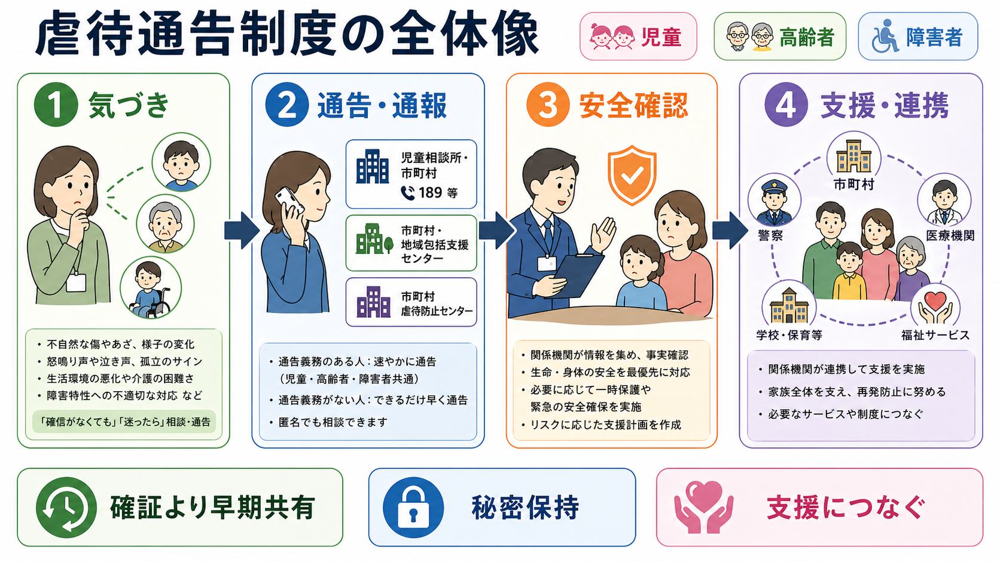
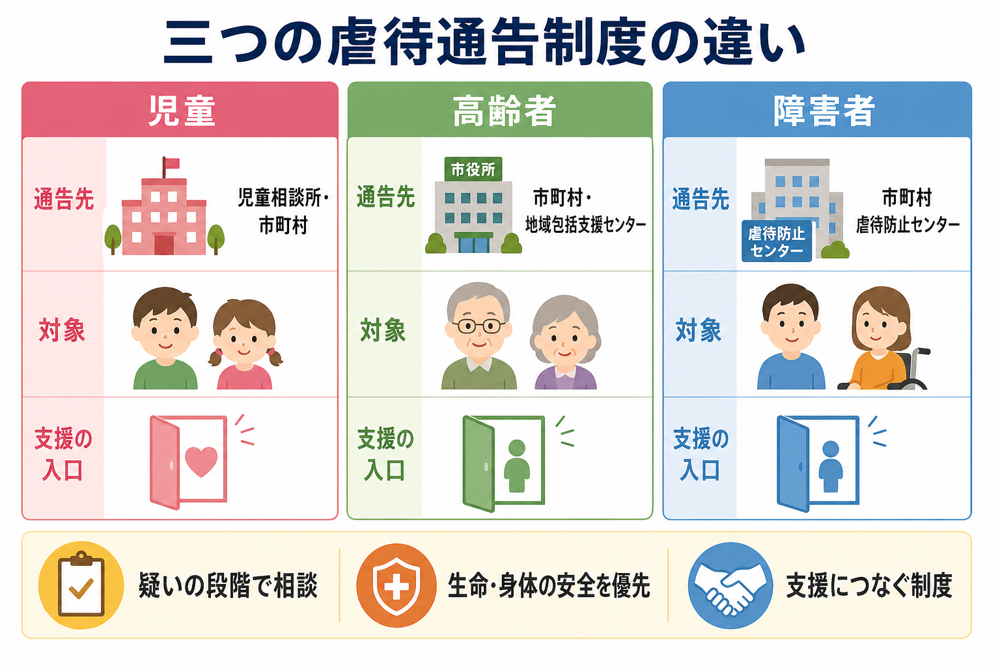

# 虐待通告制度とは何か

## 要点

- 虐待通告制度とは、虐待を「確定診断」してから動く制度ではなく、虐待を受けたと思われる人を発見した段階で、権限と支援資源を持つ機関に情報をつなぐ制度である。
- 児童虐待では、虐待を受けたと思われる児童を発見した者は、速やかに市町村・福祉事務所・児童相談所などへ通告しなければならない[1]。
- 高齢者虐待では、生命または身体に重大な危険がある場合は市町村への通報義務があり、それ以外の場合も速やかな通報が努力義務とされる[2]。
- 障害者虐待では、障害者虐待を受けたと思われる障害者を発見した者に通報義務が課され、市町村障害者虐待防止センターなどが対応の入口となる[3]。
- 医療・福祉・教育・介護の現場では、守秘義務を理由に抱え込むのではなく、生命・身体の安全を優先し、必要最小限の情報共有と記録を行うことが重要である[1][2]。

## この記事で答える問い

この記事では、児童・高齢者・障害者虐待を疑ったときに、誰が、どこへ、どの段階で通告・通報するのかを整理する。あわせて、[[精神保健福祉法とは何か]]や[[意思決定支援とは何か]]と接続する実務上の観点として、本人の安全、自己決定、家族支援、地域連携をどう両立させるかを扱う。

## まず結論

虐待通告制度の中心は、「虐待の有無を現場だけで確定すること」ではない。中心にあるのは、疑いの段階で専門機関につなぎ、専門機関が安全確認・事実確認・一時保護・支援調整を行えるようにすることである。児童では児童相談所や市町村、高齢者では市町村や地域包括支援センター、障害者では市町村障害者虐待防止センターなどが主要な入口になる[1][2][3]。

## 背景

虐待は、身体的暴力だけでなく、ネグレクト、心理的虐待、性的虐待、経済的虐待などを含む。児童虐待防止法は、身体的虐待、性的虐待、ネグレクト、心理的虐待を児童虐待として定義し、児童の人権、心身の成長、人格形成への重大な影響を制度の前提に置いている[1]。高齢者虐待防止法は、65歳以上の高齢者に対する養護者や養介護施設従事者等による虐待を対象とし、財産上の不当な利益取得も含めている[2]。障害者虐待防止法は、養護者、障害者福祉施設従事者等、使用者による虐待を対象とし、障害者の尊厳、自立、社会参加の保護を目的にしている[3][4]。

精神科医療や地域支援で重要なのは、虐待を「加害者対被害者」という単純な図式だけで見ないことである。もちろん暴力や権利侵害は止めなければならない。しかし、介護負担、貧困、孤立、依存症、精神疾患、認知症、発達特性、家族内の力関係、サービス未導入などが重なっていることが多い。通告・通報は、誰かを罰するためだけの入口ではなく、安全確保と支援導入の入口でもある。

## 基本概念

### 通告・通報

児童虐待では「通告」という語がよく使われる。児童虐待防止法第6条は、虐待を受けたと思われる児童を発見した者に、速やかな通告を求める。通告先は、市町村、都道府県の福祉事務所、児童相談所、または児童委員を介したこれらの機関である[1]。全国共通の児童相談所虐待対応ダイヤル「189」は、虐待かもしれないと思ったときに近くの児童相談所へつながる相談・通告窓口であり、匿名でも相談でき、通告者や内容の秘密は守られる[5]。

高齢者虐待や障害者虐待では「通報」という語が多い。高齢者虐待では、重大な危険がある場合は市町村への通報義務があり、その他の場合も通報するよう努めるとされる[2]。障害者虐待では、虐待を受けたと思われる障害者を発見した者に通報義務を課す制度として整備されている[3]。

### 疑いの段階

通告・通報は、虐待が確定した後だけに行うものではない。制度上の文言は「虐待を受けたと思われる」児童・高齢者・障害者を発見した場合を想定している[1][2][3]。したがって、現場で必要なのは、裁判のような証明ではなく、危険の見立て、客観的事実の記録、速やかな相談である。

### 守秘義務との関係

医療・福祉・教育の専門職は守秘義務を負う。しかし、児童虐待防止法や高齢者虐待防止法では、守秘義務に関する規定が通告・通報義務の遵守を妨げるものではないことが示されている[1][2]。これは、何でも広く共有してよいという意味ではない。本人の安全を守る目的で、必要な相手に、必要な範囲の情報を、記録を残しながら共有するという意味で理解する。

## 仕組み

### 児童虐待

児童虐待を疑う場合の入口は、市町村、福祉事務所、児童相談所、児童委員である[1]。緊急性が高いときは警察や救急医療も並行して必要になる。児童相談所虐待対応ダイヤル「189」は、近くの児童相談所へつなぐ全国共通番号で、匿名相談も可能である[5]。

児童虐待では、こども本人の安全確認が最優先になる。学校、保育所、医療機関、保健センター、児童相談所、市町村、警察などの情報が断片的に存在することがあるため、単一機関だけで抱えるとリスクを過小評価しやすい。児童虐待防止法は、関係機関の連携強化を国・地方公共団体の責務として位置づけている[1]。

### 高齢者虐待

高齢者虐待では、市町村が相談、指導、助言、安全確認、事実確認、保護、養護者支援の中心となる[2]。通報を受けた市町村は、速やかに高齢者の安全確認や事実確認の措置を講じ、必要に応じて一時的保護、老人福祉法上の措置、警察署長への援助要請などを検討する[2]。厚生労働省の国マニュアルも、市町村・都道府県における未然防止、早期発見、迅速かつ適切な対応、再発防止を目的に整備されている[6]。

高齢者虐待では、養護者支援が制度の重要な一部である。虐待が疑われる状況でも、介護者が疲弊し、孤立し、相談先を失っている場合がある。安全確保と同時に、介護保険サービス、地域包括支援センター、医療、成年後見制度、レスパイト、家族支援を組み合わせる必要がある。

### 障害者虐待

障害者虐待防止法は、養護者による虐待、障害者福祉施設従事者等による虐待、使用者による虐待を対象にする[4]。厚生労働省は、同法が国・地方公共団体、施設従事者、使用者などに虐待防止等の責務を課し、虐待を受けたと思われる障害者を発見した者に通報義務を課していると説明している[3]。窓口としては、市町村障害者虐待防止センターや都道府県障害者権利擁護センターが位置づけられる[4]。

障害者虐待では、本人の意思表明の難しさ、支援者への依存、施設・就労場面での権力差が見えにくいことがある。[[意思決定支援とは何か]]の観点からは、本人の訴えを「症状」「問題行動」とだけ解釈せず、環境、関係性、コミュニケーション手段、合理的配慮の不足を含めて評価する必要がある。

## 図解

虐待通告制度は、次の4段階で理解すると実務に使いやすい。

| 段階 | 現場で見るもの | 主な対応 |
|---|---|---|
| 気づき | 不自然な傷、説明の変化、怯え、孤立、介護者の疲弊、サービス拒否、金銭管理の異変 | 客観的事実を記録し、緊急性を見立てる |
| 通告・通報 | 「虐待かもしれない」という疑い | 児童相談所・市町村・地域包括支援センター・虐待防止センター等へ相談する |
| 安全確認 | 生命・身体の危険、住環境、保護者・養護者との関係、本人の意思 | 専門機関が事実確認、一時保護、立入調査、警察連携等を検討する |
| 支援・連携 | 再発リスク、養育・介護負担、精神症状、経済困難、孤立 | 医療、福祉、教育、介護、司法、地域資源を組み合わせる |

## 臨床・研究との接続

精神科臨床では、虐待の疑いが、抑うつ、不安、PTSD症状、解離、自傷、希死念慮、物質使用、摂食症状、睡眠障害、興奮、せん妄、認知症の行動・心理症状などとして現れることがある。ただし、症状から虐待を機械的に推定することはできない。重要なのは、症状、身体所見、生活史、家族関係、支援ネットワーク、経済状況を統合してリスクを見立てることである。

また、通告・通報後の支援では、本人の安全を確保しつつ、本人を責めない説明が必要になる。とくに高齢者や障害者では、支援者から離れること自体が生活破綻につながる場合がある。安全確保は、本人の生活基盤を奪うことではない。可能な範囲で本人の意思、生活の継続、関係修復の可能性、養護者支援を同時に検討する。

研究上は、虐待通告制度は単なる法制度ではなく、早期発見、リスク評価、多機関連携、守秘義務と情報共有、支援アクセス、再発予防の実装課題として捉えられる。[[司法精神医学とは何か]]の領域では、虐待、責任、保護、権利制限、意思決定能力、家族支援が交差するため、制度知識と臨床判断の両方が必要になる。

## よくある誤解

### 「証拠がないと通告してはいけない」

誤りである。通告・通報制度は、「虐待を受けたと思われる」段階を想定している[1][2][3]。現場が行うべきことは、断定ではなく、観察した事実、本人や家族の発言、身体所見、生活状況、緊急性を整理して相談することである。

### 「通告すると家族関係を壊す」

通告・通報が家族関係に影響することはある。しかし、放置によって生命・身体の危険が続く場合、関係を守ること自体が困難になる。制度の目的は、本人の安全確保と、必要に応じた家族・養護者への支援である[2][6]。

### 「守秘義務があるので医療者は通告できない」

守秘義務は重要だが、虐待通告・通報義務の遵守を妨げるものではないと法律上整理されている[1][2]。ただし、共有する情報は目的に照らして必要最小限にし、誰に、いつ、何を、なぜ共有したかを記録する。

### 「通告すれば現場の役割は終わる」

通告・通報は終点ではなく入口である。医療機関、学校、介護事業所、相談支援事業所は、通告後も安全確認、治療継続、記録、家族支援、再発予防、地域資源との連携に関わる。通告先がすべてを単独で解決するわけではない。

## 関連ノート

- [[精神保健福祉法とは何か]]
- [[意思決定支援とは何か]]
- [[司法精神医学とは何か]]
- [[医療観察法とは何か]]
- [[責任能力とは何か]]

MOC更新候補: `content/00_MOC/` 配下の司法・制度・地域精神医療系MOCに、本記事へのリンクを追加する。

今後の作成候補:

- 児童相談所とは何か
- 地域包括支援センターとは何か
- 障害者虐待防止センターとは何か
- 要保護児童対策地域協議会とは何か
- トラウマインフォームドケアとは何か

## 理解チェック

1. 児童虐待を疑った場合、通告先としてどの機関が想定されるか。
2. 高齢者虐待で生命・身体に重大な危険がある場合、誰に通報する義務があるか。
3. 障害者虐待で「養護者」「施設従事者等」「使用者」という分類が重要になるのはなぜか。
4. 守秘義務と通告・通報義務が衝突して見えるとき、実務上どのように整理するか。
5. 通告・通報後も医療・福祉・教育機関が担う役割は何か。

## 参考文献

[1] 厚生労働省. 児童虐待の防止等に関する法律（平成十二年法律第八十二号）. https://www.mhlw.go.jp/web/t_doc?dataId=82aa0688&dataType=0

[2] 厚生労働省. 高齢者虐待の防止、高齢者の養護者に対する支援等に関する法律（平成十七年法律第百二十四号）. https://www.mhlw.go.jp/web/t_doc?dataId=82aa7582&dataTy=

[3] 厚生労働省. 障害者虐待防止法. https://www.mhlw.go.jp/stf/seisakunitsuite/bunya/hukushi_kaigo/shougaishahukushi/gyakutaiboushi/index.html

[4] 国立障害者リハビリテーションセンター 発達障害情報・支援センター. 障害者虐待防止法. https://www.rehab.go.jp/ddis/system/supportact/abuse/

[5] こども家庭庁. 児童相談所虐待対応ダイヤル「189」について. https://www.cfa.go.jp/policies/jidougyakutai/gyakutai-taiou-dial/

[6] 厚生労働省. 市町村・都道府県における高齢者虐待への対応と養護者支援について（国マニュアル）. https://www.mhlw.go.jp/stf/seisakunitsuite/bunya/0000200478_00004.html
