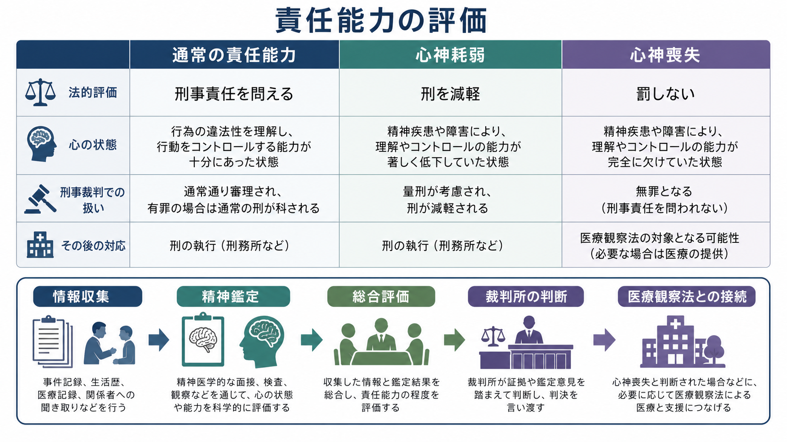
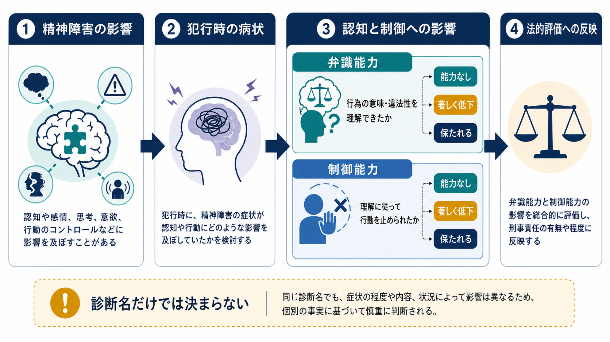
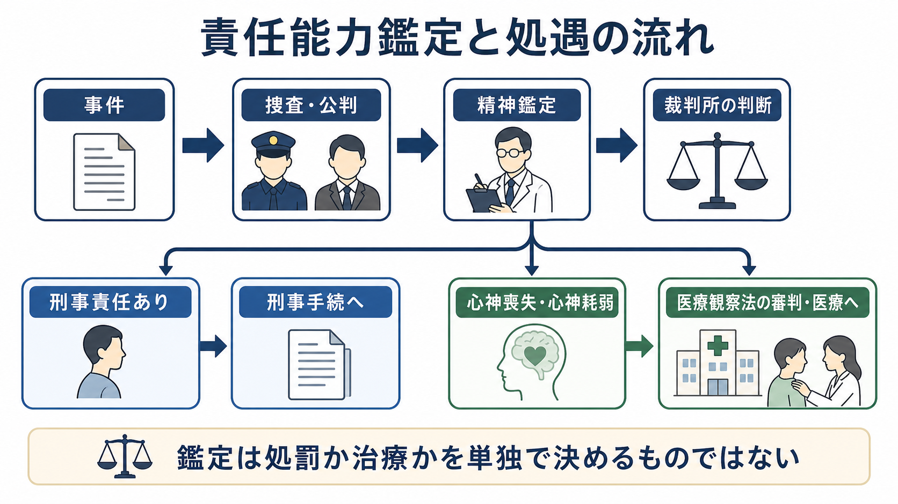

# 責任能力とは何か

## 要点

- 責任能力とは、刑事事件の行為者に「非難可能性」を帰せるだけの精神的能力があったかを問う概念である。
- 日本の刑法39条は、心神喪失者の行為を罰せず、心神耗弱者の行為は刑を減軽すると定める[1]。
- 実務上は、精神障害という生物学的要素と、弁識能力・制御能力という心理学的要素を分けて検討する。
- 診断名だけで責任能力は決まらない。犯行時の病状、動機、行為前後の行動、現実検討、違法性理解、行動制御の程度を総合する。
- 精神鑑定は重要な専門的資料だが、最終的な法的判断は裁判所が行う。ただし、最高裁は、合理的な疑いがない限り専門家の鑑定意見を十分尊重すべきだと示している[2]。

## この記事で答える問い

1. 責任能力は、単に「精神疾患があるか」を見る概念なのか。
2. 心神喪失・心神耗弱・通常の責任能力はどう違うのか。
3. 精神鑑定と裁判所の判断は、どのように役割分担されるのか。
4. [[統合失調症とは何か]]、[[妄想とは何か]]、[[幻覚とは何か]]などの症状は、どのように刑事責任の評価に関係するのか。

## まず結論

責任能力は、「精神障害がある人を処罰するかどうか」という単純な分類ではない。中心にあるのは、行為時点でその人が、自分の行為の意味や違法性を理解できたか、そして理解に従って行動を止めたり変えたりできたかという問いである。前者を弁識能力、後者を制御能力と呼ぶ。

日本の責任能力判断は、しばしば二段階で説明される。第一に、精神障害の有無や程度という生物学的要素を検討する。第二に、その精神障害が弁識能力・制御能力にどの程度影響したかという心理学的要素を検討する[2]。したがって、同じ診断名でも責任能力の判断は変わりうる。妄想が存在しても行為と無関係なら影響は限定的かもしれない。一方、犯行動機や対象選択が幻覚妄想に強く支配されていれば、弁識能力や制御能力への影響は重大になりうる。

## 背景

刑罰は、違法な行為をしたという事実だけでなく、その行為について本人を非難できるという前提に立っている。行為時に重い精神障害の影響で、行為の意味や違法性を理解できず、または理解に従って行動を制御できなかった場合、通常と同じ意味で非難することは難しい。この考え方が責任能力論の基礎である。

刑法39条は、この考え方を心神喪失・心神耗弱という形で制度化している。心神喪失では罰しない。心神耗弱では刑を減軽する[1]。ただし、条文自体は「心神喪失」「心神耗弱」を定義していないため、実際の判断では判例・学説・精神鑑定実務が重要になる。

裁判員裁判の導入後、精神鑑定の説明可能性はさらに重要になった。専門家だけに通じる診断名や精神病理用語ではなく、行為時の心理状態と法的評価とのつながりを、裁判官・裁判員が理解できる形で示す必要がある[7]。

## 基本概念

### 責任能力

責任能力とは、刑事責任を問う前提となる能力である。一般には、次の2つから構成される。

- 弁識能力: 行為の意味、社会的意味、違法性を理解する能力。
- 制御能力: その理解に従って、行為を思いとどまる、変更する、回避する能力。

ここでいう能力は、日常場面での知能や性格の良し悪しではない。問題になるのは、特定の行為時点で、特定の行為について、精神障害がどのように判断と行動に影響したかである。

### 心神喪失

心神喪失は、精神障害により弁識能力または制御能力を欠く状態と理解される。刑法39条1項により、その行為は罰しない[1]。ただし「罰しない」は「何も起きなかった」という意味ではない。重大な他害行為で心神喪失等が問題になる場合、[[医療観察法とは何か]]に基づく審判・医療・社会復帰支援につながることがある[4][5]。

### 心神耗弱

心神耗弱は、弁識能力または制御能力が著しく低下している状態である。刑法39条2項により、その刑は減軽される[1]。ここで重要なのは「精神障害がある」だけでなく、能力低下が著しいかどうかである。軽度の症状、不安、怒り、衝動性だけでは、直ちに心神耗弱とはいえない。

### 精神鑑定

精神鑑定は、診断、病歴、犯行前後の言動、供述、診療録、心理検査、関係者情報などを統合し、犯行時の精神状態と能力への影響を評価する手続である。臨床診療が「現在の困りごとと治療」を中心にするのに対し、責任能力鑑定は「行為時の精神状態」を遡及的に評価する点が特徴である[6]。

## 仕組み

責任能力判断は、概念的には次の流れで整理できる。

1. 精神障害の有無と程度を検討する。
2. 犯行時の症状、意識状態、妄想・幻覚、気分、認知機能、判断力、衝動性を検討する。
3. 弁識能力への影響を検討する。
4. 制御能力への影響を検討する。
5. 診断名だけでなく、行為の動機、準備性、隠蔽行動、逃走、自首、被害者との関係、症状との連続性を総合する。
6. 鑑定意見を踏まえ、裁判所が最終的な法的判断を行う。

最高裁平成20年4月25日判決は、責任能力判断で精神医学者の鑑定意見が証拠になっている場合、鑑定人の公正さ・能力や鑑定の前提条件に合理的な問題がない限り、裁判所はその意見を十分尊重すべきだと示した[2]。これは、裁判所が鑑定に拘束されるという意味ではない。法的評価の最終責任は裁判所にあるが、生物学的要素と心理学的要素への影響については、専門的知見を恣意的に退けてはならないという趣旨である。

一方、最高裁平成21年12月8日決定は、鑑定意見の一部採用や総合評価のあり方をめぐる判断を示しており、責任能力判断が単一のチェック項目ではなく、証拠全体の評価であることを示している[3]。

## 図解

次の図は、責任能力鑑定と処遇の流れを簡略化したものである。実際の事件では、捜査、起訴・不起訴、裁判、鑑定の種類、医療観察法の申立てなどが事案ごとに異なる。

図を見るときの注意点は、鑑定が「処罰か治療か」を単独で決めるものではないという点である。鑑定は、精神医学的な評価を通じて裁判所の判断を支える。刑事責任が問えない、または限定されると判断された場合でも、重大な他害行為では医療観察法により、治療と社会復帰を目的とした司法精神医療の枠組みが問題になる[4][5]。

## 臨床・研究との接続

責任能力の評価では、通常の診断面接に加えて、症状と行為の関係を具体的に問う必要がある。たとえば[[MSEで病識と判断力をどう評価するか]]で扱う病識や判断力は、犯行時の現実検討や違法性理解を考える補助線になる。ただし、診察室での病識があるからといって、犯行時の能力が十分だったとは限らない。逆に、現在病識が乏しいからといって、犯行時に弁識能力や制御能力を欠いていたとも限らない。

[[統合失調症とは何か]]では、幻覚や妄想が行動に強い影響を与えることがある。しかし責任能力評価では、診断名よりも、[[幻覚とは何か]]や[[妄想とは何か]]で整理される体験が、犯行の動機、対象、切迫感、現実検討、回避可能性にどのようにつながったかを検討する。最高裁平成20年判決でも、統合失調症による幻覚妄想の強い影響下で行われた行為について、犯罪認識や自首などの事情だけで心神耗弱にとどまると判断することの困難さが示された[2]。

また、[[自己制御とは何か]]や[[衝動性とは何か]]は制御能力の理解に役立つ。ただし、心理学的な自己制御の弱さと、刑法上の制御能力の著しい低下は同じではない。責任能力で問われるのは、精神障害の影響によって、違法性の理解に従って行動する能力がどの程度損なわれたかである。

研究上は、司法精神医学、法心理学、意思決定研究、精神病理学が交差する領域である。評価の信頼性を高めるには、単独面接だけでなく、診療録、家族・関係者情報、事件記録、行為前後の行動、心理検査、薬物・身体疾患の情報を統合する必要がある[6]。[[詐病とは何か]]のような問題もあるため、供述だけでなく複数情報源の整合性を見ることが重要である。

## よくある誤解

### 誤解1: 精神疾患があれば責任能力はない

これは誤りである。責任能力は診断名だけでは決まらない。同じ疾患でも、症状の重さ、犯行時点、行為との関係、治療状況、現実検討、動機の理解によって判断は変わる。

### 誤解2: 心神喪失は「無罪放免」である

刑事罰を科さないことと、支援や処遇が不要であることは違う。重大な他害行為で心神喪失等と判断された場合、医療観察法の審判、入院・通院医療、保護観察所による生活環境調整などにつながることがある[4][5]。

### 誤解3: 精神鑑定医が責任能力を最終決定する

精神鑑定は医学的・心理学的評価を提供するが、責任能力の最終判断は裁判所が行う。ただし、裁判所は専門家の鑑定意見を十分尊重すべき場合がある[2]。つまり、鑑定は軽視できないが、法的判断そのものでもない。

### 誤解4: 犯罪だと分かっていたなら責任能力は必ずある

違法性の理解は重要だが、それだけで十分とは限らない。責任能力には制御能力も含まれる。また、行為後の逃走・隠蔽・自首などは重要な事情だが、それだけで犯行時の精神障害の影響を否定できるとは限らない[2]。

### 誤解5: 責任能力論は被害者を軽視する制度である

責任能力論は、被害の重大性を否定する制度ではない。刑罰を正当化する前提として、行為者をどの程度非難できるかを問う制度である。重大な被害がある場合ほど、処罰感情と制度的判断を分けて考える必要がある。

## 関連ノート

- [[医療観察法とは何か]]
- [[精神保健福祉法とは何か]]
- [[統合失調症とは何か]]
- [[妄想とは何か]]
- [[幻覚とは何か]]
- [[MSEで病識と判断力をどう評価するか]]
- [[自己制御とは何か]]
- [[衝動性とは何か]]
- [[詐病とは何か]]
- [[鑑別診断とは何か]]

## MOC更新候補

- `content/00_MOC/` 配下に司法精神医学または制度精神医学のMOCがある場合、本記事を追加候補とする。
- 並列生成ジョブとの競合を避けるため、このタスクではMOC本体は更新しない。

## 理解チェック

1. 責任能力の評価で、診断名だけでは不十分なのはなぜか。
2. 弁識能力と制御能力はどう違うか。
3. 心神喪失と心神耗弱は、刑法39条上どのように扱われるか。
4. 精神鑑定と裁判所の判断は、どのように役割分担されるか。
5. 医療観察法は、刑罰の代替としてではなく、どのような目的で位置づけられるか。

## 未解決問題

- 弁識能力・制御能力の低下を、どの程度まで客観的に評価できるか。
- 幻覚妄想、気分障害、発達特性、物質使用、認知症などが複合する事案で、どの要因をどのように重みづけるか。
- 裁判員に対して、精神医学的評価を過度に単純化せず、かつ理解可能に説明する方法をどう整えるか。
- 被害者・遺族の納得可能性と、責任主義・医療的処遇の必要性をどのように制度上接続するか。

## 参考文献

[1] e-Gov法令検索. 刑法（明治四十年法律第四十五号）第39条「心神喪失及び心神耗弱」. https://laws.e-gov.go.jp/document?lawid=140AC0000000045

[2] 最高裁判所第二小法廷. 平成20年4月25日判決, 平成18(あ)876, 傷害致死被告事件, 刑集62巻5号1559頁. https://www.courts.go.jp/app/hanrei_jp/detail2?id=36327

[3] 最高裁判所第一小法廷. 平成21年12月8日決定, 平成20(あ)1718, 殺人等被告事件, 刑集63巻11号2829頁. https://www.courts.go.jp/app/hanrei_jp/detail2?id=38254

[4] 厚生労働省. 心神喪失者等医療観察法 制度の概要. https://www.mhlw.go.jp/stf/seisakunitsuite/bunya/hukushi_kaigo/shougaishahukushi/sinsin/gaiyo.html

[5] 法務省. 医療観察制度. https://www.moj.go.jp/hogo1/soumu/hogo_hogo11.html

[6] American Academy of Psychiatry and the Law. AAPL Practice Guideline for Forensic Psychiatric Evaluation of Defendants Raising the Insanity Defense. *Journal of the American Academy of Psychiatry and the Law*, 42(4 Supplement), S3-S76, 2014. https://jaapl.org/content/42/4_Supplement/S3

[7] 五十嵐禎人. 裁判員制度における精神鑑定の実際と課題. *精神医学*, 53(10), 937-945, 2011. https://doi.org/10.11477/mf.1405101991

[8] 林幹人. 責任能力の現状：最高裁平成20年4月25日判決を契機として. *上智法學論集*, 52(4), 27-55, 2009. https://cir.nii.ac.jp/crid/1050001339159123968
