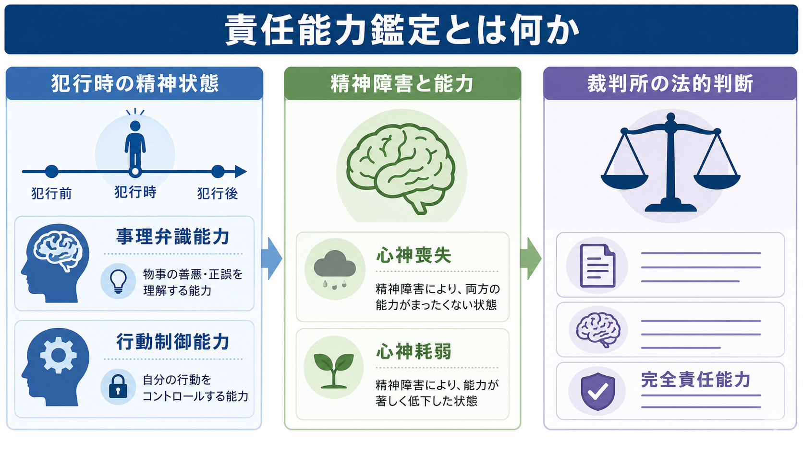
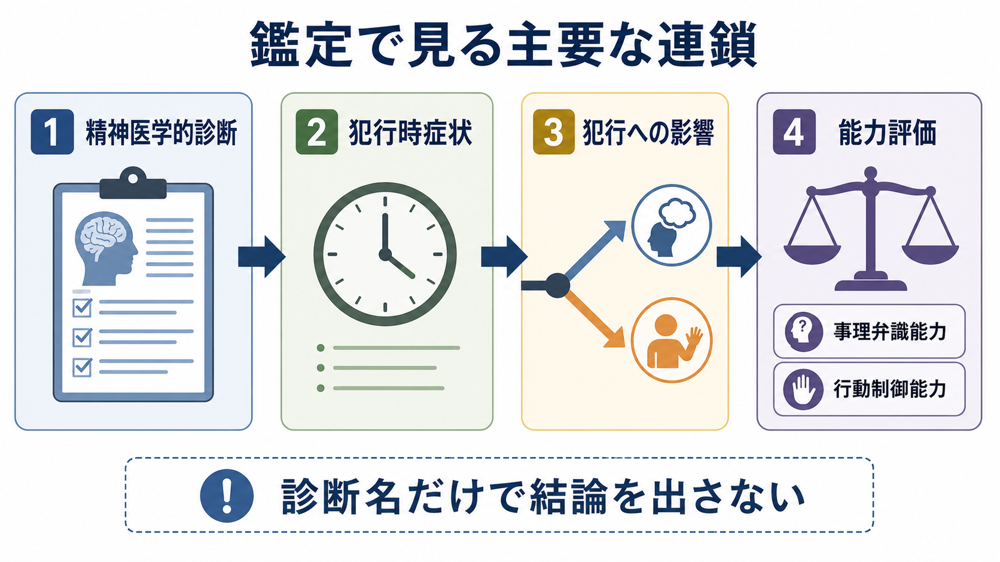

# 責任能力鑑定とは何か

## 要点

- 責任能力鑑定は、被疑者・被告人に精神障害があるかだけでなく、犯行時の精神状態が「事理弁識能力」と「行動制御能力」にどう影響したかを検討する精神鑑定である。
- 刑法39条は、心神喪失者の行為を罰せず、心神耗弱者の行為は刑を減軽すると定める。ただし、心神喪失・心神耗弱に当たるかは最終的に裁判所が行う法的判断である[1][2]。
- 鑑定人の役割は、診断名から結論を自動的に出すことではなく、診断、症状、犯行前後の行動、供述、生活史、資料の整合性をもとに、精神医学的に説明できる範囲と限界を明示することである[3][4]。
- 鑑定は処罰を軽くするための制度ではない。公正な刑事手続、本人の権利、被害予防、適切な医療・処遇をつなぐための専門的評価である。

## この記事で答える問い

1. 責任能力鑑定は、通常の精神科診断や治療面接と何が違うのか。
2. 「心神喪失」「心神耗弱」「完全責任能力」は、精神医学的にどう整理されるのか。
3. 鑑定人は、どのような資料と着眼点から犯行時の精神状態を推定するのか。
4. 医療観察法や司法精神医学の研究とは、どのように接続するのか。

## まず結論

責任能力鑑定とは、犯行時に精神障害や精神症状が存在したか、その状態が行為の意味・違法性を理解する力と、それに従って行動を制御する力をどの程度損なったかを、精神医学の方法で整理する鑑定である。

重要なのは、責任能力が「精神医学だけで決まる結論」ではない点である。刑法39条の心神喪失・心神耗弱は法的概念であり、裁判所が証拠全体から判断する。鑑定人は、その前提となる精神医学的事実、推論、限界を示す専門家である[1][2]。

## 背景

刑事責任は、単に「行為があった」だけで問われるものではない。一般に、行為者が自分の行為の意味や違法性を理解し、その理解に従って行動できるだけの能力をもっていたことが前提になる。日本の刑法39条は、この前提が失われた状態を心神喪失、著しく低下した状態を心神耗弱として扱う[1]。

一方で、精神疾患があることと責任能力がないことは同じではない。[[統合失調症とは何か|統合失調症]]、双極症、知的発達症、認知症、物質使用、解離、重度の気分障害などが問題になりうるが、診断名だけでは行為時の理解や制御を説明できない。同じ診断でも、症状の時期、重症度、現実検討、動機、計画性、犯行前後の行動は大きく異なる。

そのため、責任能力鑑定は[[司法精神医学とは何か|司法精神医学]]の中心的実践であり、通常診療よりも法的問いに沿った再構成を強く求められる。治療面接では苦痛の軽減と支援が中心になるが、鑑定面接では資料との照合、時系列の復元、症状と行為の関連、代替説明の検討が重視される[3][6]。

## 基本概念

### 責任能力

責任能力は、犯罪行為について非難可能性を基礎づける能力である。日本の実務では、精神障害という生物学的要素と、事理弁識能力・行動制御能力という心理学的要素を組み合わせて検討する枠組みが用いられてきた[2][5]。

### 事理弁識能力

事理弁識能力とは、行為の意味、結果、社会的・法的な善悪を理解する能力である。たとえば「人を傷つけている」「それは許されない」「自分の行為は現実の他者に影響する」といった理解が、妄想、幻覚、意識障害、重度の認知障害などでどの程度損なわれたかを検討する。

### 行動制御能力

行動制御能力とは、理解した内容に従って自分の行動を止める、変える、延期する、助けを求める能力である。衝動性があるだけで直ちに否定されるわけではない。どのような症状が、どの時点で、どの行動選択をどの程度制約したのかを具体的に見る必要がある。

### 心神喪失・心神耗弱・完全責任能力

心神喪失は、精神障害により事理弁識能力または行動制御能力を欠く状態として理解される。心神耗弱は、これらの能力が欠如には至らないが著しく低下した状態である。どちらにも当たらない場合は、精神障害があっても完全責任能力が認められうる[1][5]。

## 仕組み

責任能力鑑定では、現在の診察だけで犯行時を直接観察することはできない。そこで、複数の資料を突き合わせて、犯行時の精神状態を時間軸上で推定する。

典型的には、本人面接、精神状態診察、心理検査、診療録、家族・関係者情報、捜査記録、供述調書、目撃情報、防犯カメラ、SNSやメッセージ、犯行前後の行動、服薬・物質使用、生活史が検討される。[[MSEで思考内容をどう評価するか]]や[[MSEで病識と判断力をどう評価するか]]で扱う観察は、ここでは「犯行時にどの程度現実検討が保たれていたか」という問いに接続される。

NCNPの刑事責任能力鑑定関連ツール集は、鑑定書作成の手引きや関連書式を公開しており、精神医学的情報を法的判断に伝わる形へ構造化する試みとして位置づけられる[3]。また、岡田による「8ステップと7つの着眼点」は、精神症状と事件の関連、善悪判断・行動制御への焦点化、法的判断への橋渡しを段階的に整理する考え方として紹介されている[4][5]。

実務上の核心は、「診断名」から「責任能力」へ飛ばないことである。たとえば妄想があっても、犯行動機が妄想から直接導かれたのか、別の怒り・利得・対人葛藤で説明できるのかを分ける必要がある。逆に、診断が明確でない場合でも、急性の意識障害や重度の中毒、認知機能障害が行動制御に大きく影響した可能性は検討される。

鑑定人は、結論だけでなく推論の道筋を説明する。どの資料を重視したか、供述の変遷をどう評価したか、精神症状と犯行様式が整合するか、矛盾する所見は何か、鑑定だけでは断定できない点は何かを明記することが、裁判員裁判を含む刑事手続では特に重要になる。

## 図解

責任能力鑑定の流れは、医学的評価と法的判断を分けると理解しやすい。

| 段階 | 主な問い | 鑑定で見る情報 | 注意点 |
|---|---|---|---|
| 精神医学的診断 | 精神障害や症状はあるか | 面接、診療録、心理検査、家族情報 | 診断名だけで結論を出さない |
| 犯行時症状 | 行為時にどの症状がどの程度あったか | 時系列、供述、目撃情報、服薬・物質使用 | 現在の状態をそのまま過去へ戻さない |
| 犯行への影響 | 症状は動機・認識・選択にどう関係したか | 犯行様式、計画性、回避行動、前後の行動 | 了解可能性だけで単純化しない |
| 能力評価 | 事理弁識能力・行動制御能力はどうだったか | 上記を統合した医学的意見 | 最終判断は裁判所が行う |

## 臨床・研究との接続

責任能力鑑定は、臨床精神医学の知識を前提にするが、治療そのものではない。鑑定者は、本人の治療者としてだけでなく、裁判所や依頼機関に専門的意見を提出する立場に立つ。そのため、面接の目的、秘密保持の限界、情報の使われ方を説明する必要がある。この点は[[守秘義務とは何か]]や[[インフォームドコンセントは精神科でどう行うのか]]ともつながる。

研究上は、鑑定の信頼性、構造化された鑑定書、裁判員に伝わる説明、精神症状と行為の関連づけ、詐病・過大報告の評価、文化的背景、認知機能評価が重要になる。[[詐病とは何か]]で扱うように、司法場面では外的利得が存在しうるため、症状の存在を疑うだけでも、本人の訴えをそのまま採用するだけでも不十分である。

責任能力が否定または限定され、重大な他害行為が問題になる場合には、医療観察法による審判や医療につながることがある。厚生労働省は、医療観察法を、心神喪失または心神耗弱の状態で重大な他害行為を行った人に適切な医療を提供し、社会復帰を促進する制度として説明している[7]。ただし、責任能力鑑定それ自体が処遇を単独で決めるわけではない。

刑事手続上、鑑定のために被告人を病院などに留置する鑑定留置が用いられることもある。刑事訴訟法上の鑑定は、裁判所が学識経験者に命じる手続であり、心神または身体に関する鑑定のため必要がある場合の留置規定も置かれている[8]。

## よくある誤解

### 誤解1：精神疾患があれば責任能力はない

精神疾患があることは、責任能力を検討する入口であって結論ではない。同じ疾患でも、犯行時の症状、病識、現実検討、動機、計画性、自己防御行動、治療状況は異なる。責任能力鑑定は、診断名と行為の機能的関係を問う。

### 誤解2：鑑定人が有罪・無罪を決める

鑑定人は有罪・無罪を決めない。鑑定人は、精神医学的所見と犯行時精神状態に関する専門的意見を示す。刑法39条にいう心神喪失・心神耗弱への該当性は、証拠全体を踏まえて裁判所が判断する[2]。

### 誤解3：本人の話を聞けば犯行時の状態は分かる

本人面接は重要だが、それだけでは不十分である。記憶の歪み、病状変化、自己防衛、迎合、詐病、供述の変遷がありうるため、診療録、周辺情報、行動記録、物証と照合する必要がある。

### 誤解4：責任能力鑑定は処罰を軽くするためにある

責任能力鑑定は、処罰を軽くするための制度ではない。責任能力が保たれているという意見になる場合もあるし、医療的処遇の必要性が示される場合もある。役割は、法的判断のために精神医学的情報を透明に整理することである。

### 誤解5：脳画像や心理検査で責任能力を自動判定できる

脳画像、神経心理検査、心理尺度は補助資料になりうるが、責任能力を単独で判定する検査はない。必要なのは、検査結果を生活史、症状、犯行時の行動、前後の状況と統合して読むことである。この点は[[DSMとICDは何が違うのか]]で扱う診断分類の限界とも共通する。

## 関連ノート

- [[司法精神医学とは何か]]
- [[MSEで思考内容をどう評価するか]]
- [[MSEで病識と判断力をどう評価するか]]
- [[ケースフォーミュレーションとは何か]]
- [[他害リスク評価では何を見るべきか]]
- [[詐病とは何か]]
- [[守秘義務とは何か]]
- [[DSMとICDは何が違うのか]]

関連ノート候補:

- 「責任能力とは何か」
- 「精神鑑定とは何か」
- 「鑑定留置とは何か」
- 「心神喪失と心神耗弱はどう違うのか」
- 「医療観察法とは何か」
- 「訴訟能力とは何か」

MOC更新候補:

- `content/00_MOC/` 配下に司法精神医学、精神鑑定、刑事司法、医療観察法に関するMOCがある場合、本記事へのリンク追加を検討する。
- 並列実行時の競合を避けるため、本ジョブではMOC本体は更新しない。

## 理解チェック

1. 責任能力鑑定で「診断名だけで結論を出さない」とされるのはなぜか。
2. 事理弁識能力と行動制御能力は、それぞれどのような能力か。
3. 鑑定人の医学的意見と、裁判所の法的判断はどう違うか。
4. 本人面接だけでなく周辺資料の照合が必要になる理由は何か。
5. 医療観察法は、責任能力鑑定の結論とどのように接続しうるか。

## 未解決問題

- 責任能力鑑定の結論のばらつきを、どこまで構造化された手引きや書式で減らせるか。
- 裁判員にとって理解しやすく、かつ過度に単純化しない鑑定書・証言の形式は何か。
- 脳画像、神経心理検査、デジタル行動記録を、個別事案の法的判断にどこまで利用できるか。
- 精神障害と暴力を過度に結びつけるスティグマを避けながら、被害予防と本人支援をどう両立するか。

## 参考文献

[1] 日本法令外国語訳DBシステム. 刑法 第39条（心神喪失及び心神耗弱）. https://www.japaneselawtranslation.go.jp/ja/laws/view/3581/je

[2] 最高裁判所. 平成20(あ)1718 殺人，殺人未遂，銃砲刀剣類所持等取締法違反被告事件, 平成21年12月8日第一小法廷決定. https://www.courts.go.jp/app/hanrei_jp/detail2?id=38254

[3] 国立精神・神経医療研究センター 精神保健研究所 地域精神保健・法制度研究部. 刑事責任能力鑑定関連ツール集. https://www.ncnp.go.jp/nimh/chiiki/tool/07.html

[4] 岡田幸之. 責任能力判断の構造と着眼点 : 8ステップと7つの着眼点. 精神神経学雑誌, 115(10), 1064-1070, 2013. https://ndlsearch.ndl.go.jp/books/R000000004-I024950605

[5] 精神神経学雑誌オンラインジャーナル. 責任能力判断の8ステップモデルに関する解説. 精神神経学雑誌, 122(2), 2020. https://journal.jspn.or.jp/Disp?mag=0&number=2&start=105&style=ofull&vol=122&year=2020

[6] American Academy of Psychiatry and the Law. AAPL Practice Guideline for Forensic Psychiatric Evaluation of Defendants Raising the Insanity Defense. https://www.aapl.org/docs/pdf/Insanity%20Defense%20Guidelines.pdf

[7] 厚生労働省. 心神喪失者等医療観察法. https://www.mhlw.go.jp/stf/seisakunitsuite/bunya/hukushi_kaigo/shougaishahukushi/sinsin/gaiyo.html

[8] 日本法令外国語訳DBシステム. 刑事訴訟法 第165条以下（鑑定・鑑定留置関連）. https://www.japaneselawtranslation.go.jp/ja/laws/view/3364/je
