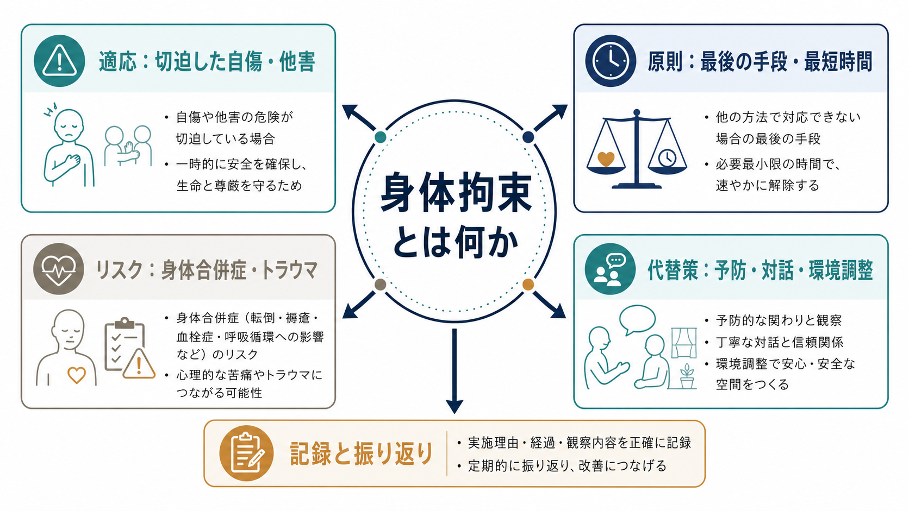
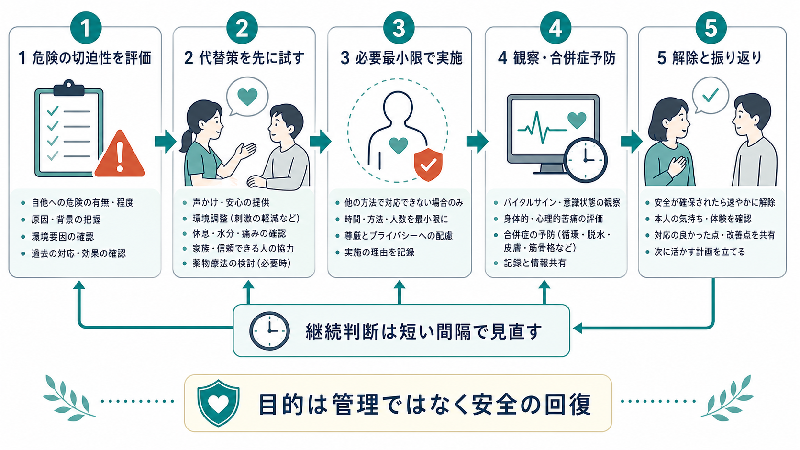
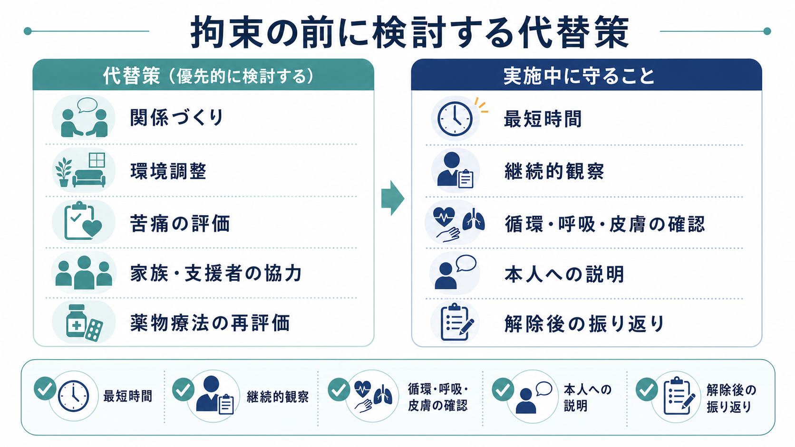

# 身体拘束とは何か

## 要点

- 身体拘束は、精神科医療における行動制限の一種であり、衣類や綿入り帯などで一時的に身体を拘束し、運動を抑制する介入である[1]。
- 適応は「危険がある」だけでは足りず、切迫性、重大性、代替手段の不十分さ、最小限性、継続的な見直しがそろってはじめて検討される[2]。
- 目的は管理・懲罰・見せしめではなく、生命保護と重大な身体損傷の予防である[2]。
- 身体拘束には、深部静脈血栓症、肺塞栓、褥瘡、脱水、誤嚥、呼吸循環への影響、心理的苦痛、トラウマ再活性化などのリスクがある[4][7]。
- 最小化は「拘束を使わない気合い」ではなく、予防、環境調整、脱エスカレーション、観察、スタッフ教育、事後検討を組み合わせる組織的な安全設計である[3][5][6][8]。

## この記事で答える問い

1. 身体拘束は、精神科医療でどのように定義されるのか。
2. どのような場面で適応が検討されるのか。
3. 身体拘束の医学的・心理的・倫理的リスクは何か。
4. 代替策と最小化は、臨床現場でどのように考えるのか。
5. 記録、説明、解除、振り返りでは何を押さえるべきか。

## まず結論

身体拘束は、急迫した[[自傷と自殺企図はどう違うのか|自傷]]、自殺企図、他害、著しい不穏・多動などにより、本人または周囲の生命・身体に重大な危険が迫り、他の方法では安全を確保できないときに限って検討される、強い自由制限である。日本の告示では、身体的拘束は「衣類又は綿入り帯等」を用いて一時的に身体を拘束し運動を抑制する行動制限とされる[1]。

ただし、身体拘束は安全を回復するための一時的手段であって、治療そのものではない。告示は、制限の程度が強く二次的な身体障害を生じうるため、代替方法が見出されるまでのやむを得ない処置であり、できる限り早期に他の方法へ切り替えるべきものとして位置づけている[2]。したがって、臨床判断の中心は「拘束するかどうか」ではなく、「拘束に至らないために何をしたか」「拘束が必要なら、どの条件で最短に終えられるか」である。

## 背景

精神科医療では、急性精神病状態、躁状態、せん妄、物質使用、認知症に伴うBPSD、重度の不安・恐怖、トラウマ反応、身体疾患による意識変容などが重なり、本人や周囲の安全が短時間で損なわれることがある。たとえば、[[自殺リスク評価では何を聞くべきか|自殺リスク]]が切迫している、点滴や気管チューブを自己抜去して生命に危険が及ぶ、激しい興奮により本人や周囲が重大な外傷を負う可能性が高い、といった場面である。

一方で、身体拘束は、本人の自由、尊厳、身体感覚、他者への信頼に直接介入する。過去に暴力、虐待、医療トラウマを経験した人では、拘束そのものが恐怖記憶を再活性化し、後の治療同盟や受療行動に影響することがある。したがって、[[精神科面接とは何か|精神科面接]]、[[MSEで外観と行動から何を観察するか|精神状態診察]]、身体疾患評価、環境調整、説明と合意形成を総合して、必要性と害のバランスを具体的に判断する必要がある。

日本では、精神科病院における隔離・身体拘束は、精神保健福祉法に基づく告示と関連通知の枠組みのなかで扱われる。厚生労働省は近年、精神科病院における行動制限最小化のための研究・プラットフォームを整備し、隔離や身体拘束を最小化する基本的考え方、知識、取組事例の普及を進めている[3]。

## 基本概念

### 身体拘束と隔離の違い

身体拘束は、身体の運動を物理的に抑制する行動制限である[1]。これに対して隔離は、本人の意思では出られない部屋に一人だけ入室させ、他の患者から遮断する行動制限であり、日本の告示では12時間を超えるものが定義対象になる[1]。

両者はしばしば同じ「行動制限」として語られるが、リスクの焦点は異なる。隔離では孤立、監視、環境安全、治療的関わりの維持が問題になりやすい。身体拘束では、それに加えて、血栓、循環障害、呼吸抑制、皮膚損傷、筋骨格系障害、拘束具の不適切使用といった身体合併症が直接問題になる。

### 適応の核

日本の告示では、身体的拘束の対象は主として、著しく切迫した自殺企図・自傷行為、顕著な多動または不穏、精神障害のため放置すれば生命に危険が及ぶおそれがある場合とされ、かつ身体的拘束以外によい代替方法がない場合に行われるものとされる[2]。

ここで重要なのは、診断名そのものではなく、現在の危険の切迫性と代替不能性である。統合失調症、双極性障害、認知症、せん妄などの診断名はリスク理解の背景にはなるが、「その診断だから拘束する」という判断にはならない。実際の判断では、次の点を区別する。

| 観点 | 確認すること |
|---|---|
| 切迫性 | いま数分から数時間のうちに重大な自傷・他害・生命危険が起こりうるか |
| 重大性 | 転倒、窒息、出血、自己抜去、暴力、致死的手段への接近などがあるか |
| 代替可能性 | 声かけ、同席、環境調整、家族・支援者の協力、薬物療法の見直しで回避できるか |
| 最小限性 | 部位、方法、時間、人数、観察頻度が必要最小限か |
| 解除可能性 | 何が改善すれば解除するのかが明確か |

## 仕組み

### 判断は「危険評価」から始まる

身体拘束の判断は、単なる問題行動への反応ではなく、リスク評価である。まず、本人の言動、意識状態、身体疾患、服薬、物質使用、疼痛、睡眠不足、感覚過敏、対人関係、病棟環境を確認する。[[ICUせん妄とは何か|せん妄]]、低酸素、低血糖、感染、薬剤性アカシジア、悪性症候群など、精神症状に見えて身体的に危険な状態もあるため、[[身体合併症は精神科診療でなぜ重要なのか|身体合併症]]の評価を省略しない。

NICE の暴力・攻撃性の短期管理ガイドラインは、制限的介入を用いる前に、サービス利用者との関係づくり、誘因や早期警告サインの共有、脱エスカレーション、落ち着ける場所の活用を重視する[4]。つまり、身体拘束は「興奮したらすぐ行う手技」ではなく、予防的な関わりが失敗し、なお急迫した危険が残るときの最終段階である。

### 実施中は「拘束して終わり」ではない

身体拘束中は、原則として常時の臨床的観察と適切な医療・保護が求められ、漫然と続かないよう医師が頻回に診察する必要がある[2]。観察は監視ではなく、解除に向けた能動的な関わりである。呼吸、循環、意識、皮膚、疼痛、脱水、排泄、羞恥、恐怖、怒り、服薬反応を確認し、本人に理由と見通しをできる限り説明する。

NICE は、用手的拘束では気道・呼吸・循環を妨げる方法を避け、胸郭、頸部、腹部への圧迫や口鼻の閉塞を避けること、身体的・心理的状態を必要な期間モニターすることを推奨している[4]。日本の身体的拘束とは制度上の形が異なる部分はあるが、「呼吸循環を妨げない」「尊厳を保つ」「最短時間にする」という原則は共通する。

### 解除は最初から計画しておく

解除基準が曖昧な拘束は、長期化しやすい。開始時点で、何が改善すれば解除するのか、どの時点で再評価するのか、解除後にどの代替策で安全を支えるのかを決めておく。たとえば「点滴自己抜去の危険が低下し、声かけで手を止められる」「自傷衝動を言語化でき、危険物を遠ざけた環境でスタッフ同席が可能」「急性の錯乱が改善し、見当識と協力が戻る」といった具体的な基準である。

解除後には、本人の体験を確認し、何が苦痛だったか、何が役立ったか、次に同じ状況になったときに何を避けたいかを話し合う。これは謝罪や説明だけでなく、再発予防のための臨床情報を得る過程でもある。[[トラウマ歴はどのように聞くべきか|トラウマ歴]]、感覚過敏、過去の入院体験、家族・支援者との関係、安心できる声かけをケア計画に反映する。

## 図解

### 身体拘束を考えるときの三層モデル

| 層 | 臨床上の問い | 具体例 |
|---|---|---|
| 予防の層 | 拘束に至る前に危険を下げられるか | 環境刺激の低減、静かな場所、信頼できるスタッフ、疼痛・不眠・空腹・脱水の評価 |
| 最小化の層 | 必要な場合でも、より少ない制限にできるか | 観察、同席、声かけ、家族協力、薬物療法再評価、危険物除去 |
| 回復の層 | 拘束後に関係と安全を回復できるか | 説明、身体合併症確認、本人の体験の確認、チーム振り返り、ケア計画更新 |

## 臨床・研究との接続

### 身体拘束のリスク

身体拘束は、本人の安全を守る目的で行われる場合でも、それ自体が新たな危険を生む。身体面では、長時間の不動、下肢圧迫、脱水、興奮、鎮静薬の併用、基礎疾患が重なると、深部静脈血栓症や肺塞栓のリスクが問題になる。拘束中の精神科患者における深部静脈血栓症の発生と予防に関する文献レビューは、拘束が重篤な副作用を引き起こしうることを指摘している[7]。

心理面では、無力感、羞恥、怒り、恐怖、解離、医療者不信が生じうる。とくに[[PTSDとは何か|PTSD]]や[[トラウマ関連障害群とは何か|トラウマ関連障害]]の背景がある人では、身体を押さえられる、動けない、説明が不足する、複数人に囲まれるといった状況が、過去の被害体験に接続されやすい。身体拘束後に必要なのは「落ち着いたから終わり」ではなく、身体状態と心理的影響の両方を見直すことである。

### 代替策は単一の技法ではない

身体拘束を減らす介入は、単一の手技よりも、複数の要素を組み合わせたプログラムとして考える方が現実的である。SAMHSA/NASMHPD の Six Core Strategies は、リーダーシップ、データを用いた実践、スタッフ教育、予防ツール、当事者・家族の役割、事後検討を組み合わせる枠組みを示している[6]。WHO QualityRights も、隔離・拘束を終わらせるために、人権、回復志向、トラウマインフォームドな関わり、サービス変革を重視している[5]。

近年のシステマティックレビューでは、成人精神科入院における機械的拘束を減らす介入として、落ち着くための方法、スタッフ資源、法・方針の変更、スタッフ文化の変化などが整理されている。ただし、研究デザインや報告のばらつきが大きく、十分な対照試験が限られるため、「これだけで確実に減る」という単純な結論には注意が必要である[8]。

### 日本の臨床での実装

日本の精神科医療では、行動制限最小化委員会、院内研修、事例検討、病棟ごとのデータ確認、身体拘束発生時の振り返り、身体合併症予防プロトコルなどが実装の単位になる。厚労省の行動制限最小化プラットフォームは、精神科病院の隔離や身体的拘束を最小化するための基本的考え方、知識、取組事例を提供するものとして作成されている[3]。

実装で重要なのは、拘束件数だけを責めることではない。現場が過度に萎縮すると、危険な場面で必要な介入まで遅れる可能性がある。見るべき指標は、発生件数、延べ時間、理由、時間帯、病棟、代替策、合併症、本人の体験、解除までの経過、再発予防策である。[[診療録は精神科でどう書くべきか|診療録]]には、抽象的な「危険のため」ではなく、観察された行動、切迫性、試みた代替策、説明内容、開始・解除時刻、観察内容、解除判断を具体的に残す。

## よくある誤解

### 誤解1：身体拘束は安全なら長く続けてもよい

身体拘束は、安全確保のために行われるとしても、それ自体が身体的・心理的リスクを持つ。告示上も、できる限り早期に他の方法へ切り替える努力が求められる[2]。安全のために始めた拘束が、長期化によって別の危険を作っていないかを短い間隔で見直す必要がある。

### 誤解2：暴力や興奮があれば自動的に適応になる

興奮や暴力の可能性があっても、まずは原因評価、距離の取り方、脱エスカレーション、環境調整、観察、薬物療法の再評価などを検討する。身体拘束の適応は、切迫した重大危険と代替手段の不十分さが具体的に示される場合である[2][4]。

### 誤解3：身体拘束はスタッフを守るための懲罰である

身体拘束は、本人の生命保護と重大な身体損傷の予防を目的とする。制裁、懲罰、見せしめとして行ってはならない[2]。スタッフの安全は重要だが、懲罰としての拘束は医療的にも倫理的にも正当化されない。

### 誤解4：記録は形式を満たせばよい

記録は監査対応だけでなく、解除判断と再発予防のための臨床情報である。開始理由、代替策、説明、観察、合併症予防、解除条件、本人の体験、チームの振り返りが書かれていなければ、次の介入を改善できない。

## 関連ノート

- [[司法精神医学とは何か]]
- [[自殺リスク評価では何を聞くべきか]]
- [[自傷と自殺企図はどう違うのか]]
- [[身体合併症は精神科診療でなぜ重要なのか]]
- [[診療録は精神科でどう書くべきか]]
- [[インフォームドコンセントは精神科でどう行うのか]]
- [[トラウマ関連障害群とは何か]]
- [[BPSDとは何か]]
- [[ICUせん妄とは何か]]

## MOC更新候補

- [[MOC｜精神医学]]
- [[MOC｜臨床実践・治療]]
- [[MOC｜倫理・哲学・社会]]

並列記事生成との衝突を避けるため、本記事では MOC 本体の更新は行わない。

## 理解チェック

1. 身体拘束の適応判断で、「危険がある」以外に確認すべき条件は何か。
2. 身体拘束中に観察すべき身体的リスクを3つ挙げられるか。
3. 身体拘束が心理的トラウマを悪化させうるのはなぜか。
4. 解除基準を開始時点で決めておくことには、どのような意味があるか。
5. 行動制限最小化を個人努力ではなく組織的実践として考える理由は何か。

## 未解決問題

- 日本の精神科病院において、どの組織的介入が身体拘束の発生件数だけでなく延べ時間、合併症、本人の体験を改善するのか。
- 身体拘束の最小化と、急性期の自傷他害防止をどのような指標で同時に評価すべきか。
- トラウマインフォームドケアを、夜間・救急・人員不足の病棟条件でどのように実装するか。
- 本人・家族・ピアスタッフを事後検討に含める際、プライバシーと安全をどう両立するか。

## 参考文献

[1] 厚生労働省. 精神保健及び精神障害者福祉に関する法律第三十六条第三項の規定に基づき厚生労働大臣が定める行動の制限（昭和63年4月8日厚生省告示第129号）. https://www.mhlw.go.jp/web/t_doc?dataId=80135000&dataType=0

[2] 厚生労働省. 精神保健及び精神障害者福祉に関する法律第三十七条第一項の規定に基づき厚生労働大臣が定める基準（昭和63年4月8日厚生省告示第130号）. https://www.mhlw.go.jp/web/t_doc?dataId=80136000&dataType=0&pageNo=1

[3] 厚生労働省. 精神科医療機関における行動制限最小化の普及に資する研究（令和5年〜6年度 厚生労働科学研究費補助金）. https://www.mhlw.go.jp/stf/newpage_58966.html

[4] National Institute for Health and Care Excellence. *Violence and aggression: short-term management in mental health, health and community settings* (NICE guideline NG10). 2015; last reviewed 2024. https://www.nice.org.uk/guidance/ng10

[5] World Health Organization. *Strategies to end seclusion and restraint: WHO QualityRights specialized training: course guide*. 2019. https://iris.who.int/handle/10665/329605

[6] National Association of State Mental Health Program Directors. *Six Core Strategies for Reducing Seclusion and Restraint Use*. Revised 2008. https://dam.assets.ohio.gov/image/upload/mha.ohio.gov/SupportingProviders/TrainingandResources/LC-Communications/SAMHSA-Six-Core-Strategies-Reducing-Seclusion-Restraint.pdf

[7] Therasse A, Persano HL, Ventura AD, Tecco JM. Incidence and prevention of deep vein thrombosis in restrained psychiatric patients. *Psychiatr Danub*. 2018;30(Suppl 7):412-414. https://pubmed.ncbi.nlm.nih.gov/30439815/

[8] Pedersen ML, Gildberg FA, Baker J, Tingleff EB. A systematic review of interventions to reduce mechanical restraint in adult mental health inpatient settings. *Int J Ment Health Nurs*. 2024;33(3):505-522. https://doi.org/10.1111/inm.13267

## 更新ログ

- 2026-04-28: 初版作成。法制度上の定義、適応、リスク、代替策、最小化、図解、参考文献を整理。
