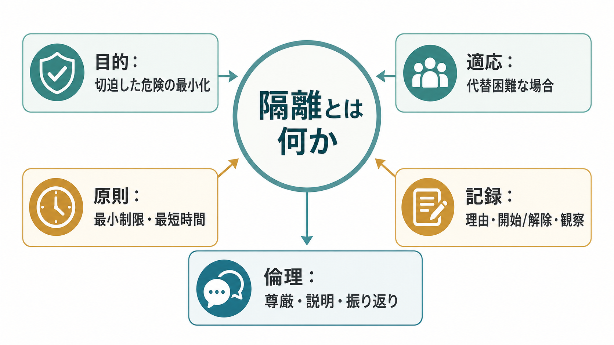
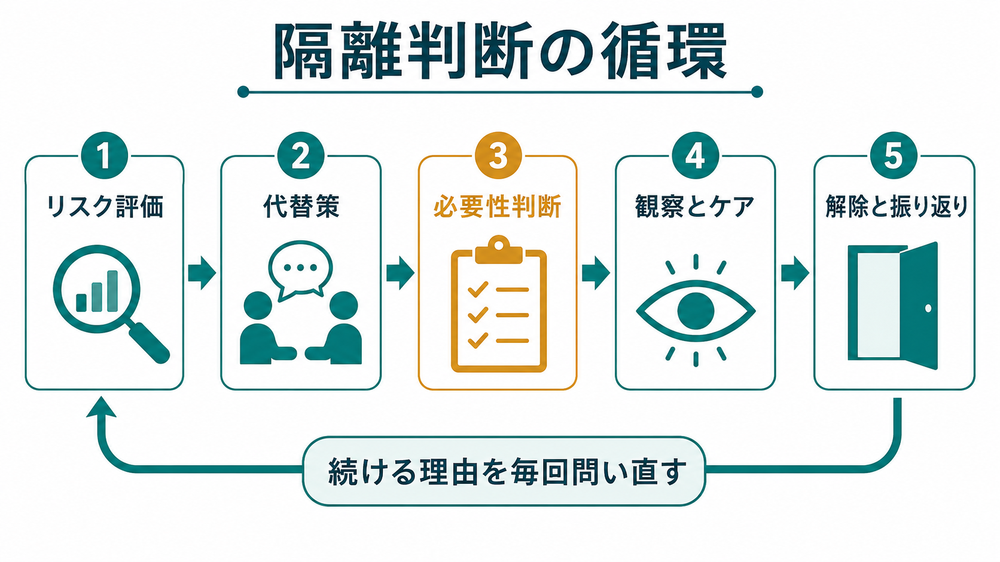
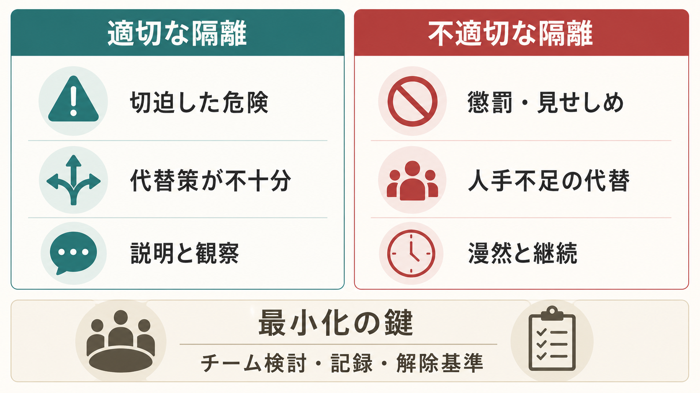

# 隔離とは何か

## 要点

- 隔離は、精神科病棟で患者を本人の意思では出られない部屋に一人で入室させ、他の患者から遮断する行動制限である。日本の告示上、精神保健福祉法第36条第3項に基づく「厚生労働大臣が定める行動の制限」では、12時間を超える患者の隔離が明示されている[1]。
- 隔離は治療そのものというより、切迫した自傷・他害・著しい混乱などで安全確保が困難なときに、代替方法がない場合に限って使う最後の手段である[2][4]。
- 開始時の要件だけでなく、継続する理由、解除基準、観察、説明、記録、振り返りが重要である。漫然と続けることは、法的にも倫理的にも問題になる[2][4]。
- 行動制限の最小化は、個人の努力ではなく、管理者の関与、チーム検討、デエスカレーション、環境調整、本人の意思・好みを反映した危機計画、データレビューを組み合わせる組織課題である[3][6][7]。

## この記事で答える問い

1. 精神科病棟における「隔離」とは、どのような行動制限なのか。
2. どのような場合に適応となり、どのような場合には不適切なのか。
3. 最小化、観察、記録、解除、倫理的配慮では何を見るべきか。
4. 研究・臨床・制度の観点から、隔離をどう扱うべきか。

## まず結論

隔離とは、精神科病棟で安全を守るために行われうる、強い制限を伴う介入である。したがって「危険そうだから隔離する」では不十分であり、切迫性、具体的危険、代替策の検討、本人への説明、観察、記録、解除基準をセットで考える必要がある。

隔離の中心原則は、最小制限と最短時間である。厚生労働大臣が定める処遇基準では、隔離の対象は、隔離以外によい代替方法がない場合に限られ、自殺企図・自傷行為の切迫、他患者への暴力や著しい迷惑行為、器物破損、急性精神運動興奮などが例示されている[2]。また、理由と開始・解除日時の診療録記載、定期的な会話等による注意深い臨床的観察、衛生への配慮、少なくとも毎日1回の医師診察が求められる[2]。

このノートは教育・研究目的の整理であり、個別事例の法的判断、診断、治療指示を代替するものではない。実務では、現行法令、院内規程、精神保健指定医・多職種チームの判断、地域の監査・行政手続を確認する必要がある。

## 背景

精神科病棟では、急性精神症状、せん妄、物質使用、認知症関連症状、発達特性、トラウマ反応、身体疾患、環境刺激、対人葛藤が重なり、本人や周囲の安全が急速に脅かされることがある。評価では、[[MSEで外観と行動から何を観察するか]]、[[MSEで病識と判断力をどう評価するか]]、[[せん妄とは何か]]、[[カタトニアとは何か]]、[[他害リスク評価では何を見るべきか]]の観点が関わる。

ただし、隔離は「病棟運営を楽にする手段」ではない。WHO QualityRights は、隔離や拘束を人権・リカバリー・トラウマの観点から問題化し、本人の意思と選好を尊重しながら強制的実践を終わらせるための組織変革を重視している[5]。WHO/OHCHR の近年の法制度ガイダンスも、精神保健サービスにおける強制的実践を人権課題として扱い、自由で十分な説明に基づく同意を中心に置く方向を示している[8]。NICE も、制限的介入は他の試みが失敗し、自傷・他害のおそれがある場合に限るべきだとし、最短時間、定期レビュー、観察、尊厳保持を求めている[4]。

日本でも、厚生労働省は精神科病院における行動制限最小化に関する研究、研修、取組事例、プラットフォームを整理しており、隔離・身体的拘束の最小化を制度的課題として位置づけている[3]。

## 基本概念

### 隔離

隔離は、患者を内側から本人の意思では出られない部屋に一人だけ入室させ、他の患者から遮断する行動制限である。日本の告示第129号では、12時間を超えるものが、精神保健福祉法第36条第3項に基づく厚生労働大臣が定める行動制限として示されている[1]。

臨床的には、12時間以下であっても、本人の自由を大きく制限する介入であることに変わりはない。したがって、時間の長短だけでなく、必要性、代替策、説明、観察、記録、解除の判断を明確にする必要がある。

### 行動制限

行動制限とは、患者の移動、身体運動、通信、面会、外出などを制限する処遇を広く指す。隔離と身体的拘束は特に侵襲性が高く、権利制限と安全確保の緊張が大きい。[[司法精神医学とは何か]]で扱うように、精神医学の判断は、本人の治療利益だけでなく、法的手続、権利保障、社会的安全の文脈にも置かれる。

### 最小制限

最小制限とは、目的を達成できる範囲で、自由の制限を最小にする原則である。隔離では、まず環境調整、声かけ、休息場所、刺激低減、信頼できるスタッフの同席、本人の希望の確認、頓用薬の相談、家族・支援者との連絡、[[クライシスプランとは何か|クライシスプラン]]などを検討する。隔離を始めた後も、「まだ必要か」「解除できる条件は満たされたか」を繰り返し問う。

## 仕組み

隔離判断は、単発の「開始判断」ではなく、評価、代替策、必要性判断、観察、解除、振り返りの循環である。

### 1. リスク評価

まず、何が、誰に、どの程度、どの時間軸で危険なのかを具体化する。自傷、他害、転倒、離院、器物破損、性的逸脱、身体疾患の処置妨害、重度の興奮などを一括して「危険」と呼ぶと、介入が粗くなる。[[他害リスク評価では何を見るべきか]]と同じく、静的因子だけでなく、現在変えられる動的因子、保護因子、環境因子を見る。

### 2. 代替策の検討

隔離は「代替方法がない場合」に限られる[2]。したがって、代替策を試したか、なぜ不十分だったか、どの条件なら代替策へ戻せるかを記録する必要がある。デエスカレーション、刺激低減、スタッフ交代、休養、身体疾患評価、疼痛・離脱・アカシジア・せん妄の確認、家族連絡、本人の好みの確認は、隔離の前後どちらでも重要である。

### 3. 必要性判断

隔離の必要性は、診断名ではなく現在の状態と文脈から判断する。統合失調症、双極症、認知症、発達障害、物質使用、パーソナリティ特性といったラベルは、リスクの説明に役立つ場合があるが、隔離の十分条件ではない。逆に、診断が不明でも、切迫した安全確保が必要な場面はありうる。

### 4. 観察とケア

隔離中も、治療関係は中断されない。告示第130号は、定期的な会話等による注意深い臨床的観察、適切な医療および保護、衛生の確保、少なくとも毎日1回の医師診察を求めている[2]。観察は監視ではなく、身体状態、意識、脱水、排泄、食事、睡眠、薬剤副作用、疼痛、恐怖、羞恥、怒り、孤立感を確認し、解除へ向けた条件を整える作業である。

### 5. 解除と振り返り

隔離は、始める判断よりも、終える判断が難しいことがある。危険が十分に下がった、会話が可能になった、代替策が使える、環境調整ができた、本人と条件を共有できた、身体状態が安定したなど、解除基準を具体化する。解除後には、本人の体験を聞き、何が引き金だったか、何が役立ったか、次回は何を避けたいかを確認し、[[クライシスプランとは何か]]や[[共同意思決定とは何か]]につなげる。

## 図解

隔離の適切性は、「危険があるか」だけでは決まらない。代替困難性、説明、観察、記録、解除可能性、倫理的妥当性を同時に見る。

| 観点 | 適切性を高める問い | 不適切化しやすい落とし穴 |
|---|---|---|
| 危険 | 切迫した自傷・他害・治療保護上の困難が具体的か | 「落ち着かない」「迷惑」という曖昧な理由だけで始める |
| 代替策 | どの代替策を検討し、なぜ不十分だったか | 人員不足、病棟都合、懲罰の代替にする |
| 説明 | 本人に理由と見通しを伝えたか | 理由を伝えず、孤立や恐怖を強める |
| 観察 | 会話、身体状態、薬剤副作用、生活ケアを見ているか | 部屋に入れた後の関わりが減る |
| 記録 | 理由、開始・解除日時、観察、代替策、解除基準が残るか | 記録が「不穏のため」だけになる |
| 解除 | 継続理由を毎回問い直しているか | 安全確認ができても慣例で続ける |

## 臨床・研究との接続

### 臨床

隔離の臨床的課題は、安全と尊厳を同時に扱うことである。切迫した危険がある場面では、本人、他患者、スタッフの安全を守る必要がある。しかし、隔離そのものが恐怖、羞恥、無力感、トラウマ再活性化、治療不信を生むことがある[5]。[[トラウマ歴はどのように聞くべきか]]で扱うように、過去の虐待、拘束、監禁、暴力被害の経験は、隔離体験の意味を大きく変える。

そのため、隔離を使う場合でも、本人を「管理対象」としてではなく、説明を受け、意見を表明し、解除に向けて協働できる人として扱う。[[インフォームドコンセントは精神科でどう行うのか]]や[[意思決定能力とは何か]]の視点は、強制性のある場面でも失われない。

### 組織改善

隔離最小化は、個々のスタッフの忍耐だけに依存すると続かない。Goulet らの系統的レビューは、隔離・拘束低減プログラムでは、リーダーシップ、データ活用、スタッフ教育、予防ツール、利用者参加、事後レビューなどの複数要素が重要であると整理している[6]。Safewards のクラスターランダム化試験も、スタッフと患者の関係性を改善する比較的シンプルな介入で、病棟の葛藤や封じ込め的介入を減らせる可能性を示した[7]。

日本の文脈では、厚生労働省の行動制限最小化プラットフォームや調査研究が、病院全体の取組、経験者の声、研修資材、法令・通知を整理している[3]。実務では、院内の行動制限最小化委員会、看護記録、医師記録、インシデントレビュー、患者・家族のフィードバックをつなげることが重要である。

### 研究

研究では、隔離件数や隔離時間だけでなく、患者体験、身体合併症、薬剤使用、スタッフ傷害、治療同盟、退院後のサービス利用、再入院、トラウマ症状、病棟文化を同時に測る必要がある。隔離を減らすことが目的化しすぎると、記録されない非公式な制限、過鎮静、スタッフの回避、患者間暴力の見落としが生じる可能性もある。質的研究、監査、実装研究、倫理分析を組み合わせる必要がある。

## よくある誤解

### 誤解1：隔離は治療である

隔離は、単独で症状を治す介入ではない。安全確保のためにやむを得ず使うことはありうるが、治療は、評価、薬物療法、心理社会的支援、睡眠、身体疾患対応、環境調整、関係修復、退院支援の中で行われる。

### 誤解2：危険が少しでもあれば隔離してよい

重要なのは、危険の具体性、切迫性、重大性、代替困難性である。曖昧な不安、スタッフ側の負担、病棟の混雑だけでは、隔離の根拠として不十分である。

### 誤解3：隔離中は安全だから観察を減らしてよい

隔離中こそ、身体状態、心理状態、薬剤副作用、脱水、排泄、疼痛、恐怖、怒り、孤立感を丁寧に見る必要がある。NICE は隔離の観察計画を定め、少なくとも視認できる観察を求めている[4]。日本の告示でも、定期的な会話等による注意深い臨床的観察が求められる[2]。

### 誤解4：隔離を減らすと病棟が危険になる

隔離最小化は、単に「隔離を禁止する」ことではない。リスク評価を精密にし、早期兆候をつかみ、代替策を増やし、スタッフと患者の関係性を改善し、危機後の振り返りを行うことで、結果として安全性を高めることを目指す。隔離を使うかどうかの二分法ではなく、病棟の予防力を上げる課題である[6][7]。

## 関連ノート

- [[司法精神医学とは何か]]
- [[他害リスク評価では何を見るべきか]]
- [[クライシスプランとは何か]]
- [[インフォームドコンセントは精神科でどう行うのか]]
- [[共同意思決定とは何か]]
- [[意思決定能力とは何か]]
- [[トラウマ歴はどのように聞くべきか]]
- [[MSEで外観と行動から何を観察するか]]
- [[MSEで病識と判断力をどう評価するか]]
- [[せん妄とは何か]]
- [[カタトニアとは何か]]
- [[地域連携は精神科診療で何を意味するのか]]

## 理解チェック

1. 精神科病棟での隔離を、単なる「落ち着かせるための部屋」と説明してはいけないのはなぜか。
2. 隔離を始める前に確認すべき「代替策」には何があるか。
3. 隔離中の観察は、監視とどう違うか。
4. 隔離の記録に、開始理由だけでなく解除日時や解除基準が必要なのはなぜか。
5. 行動制限最小化を、個人の努力ではなく組織課題として扱う理由は何か。

## 関連ノート候補・MOC更新候補

- 関連ノート候補: 「身体的拘束とは何か」「行動制限最小化とは何か」「デエスカレーションとは何か」「精神科病棟の安全文化とは何か」「トラウマインフォームドケアとは何か」。
- MOC更新候補: `content/00_MOC/` 配下の精神医学、司法・制度・地域精神医療、臨床倫理、精神科病棟ケア関連MOC。並列ジョブとの競合回避のため、本記事作成時点ではMOC本体は更新しない。

## 未解決問題

- 隔離の「件数」「時間」「患者体験」「安全アウトカム」を、どのようにバランスよく評価するか。
- 日本の法制度と国際的な人権ベースの最小化・廃止論を、実務上どのように接続するか。
- 人員配置、病棟構造、急性期医療需要、地域支援不足が隔離に与える影響を、どの粒度で測定し改善するか。
- 隔離後の振り返りを、責任追及ではなく学習と再発予防に変える仕組みをどう作るか。

## 参考文献

[1] 厚生労働省. 精神保健及び精神障害者福祉に関する法律第三十六条第三項の規定に基づき厚生労働大臣が定める行動の制限（昭和63年厚生省告示第129号）. https://www.mhlw.go.jp/web/t_doc?dataId=80135000&dataType=0

[2] 厚生労働省. 精神保健及び精神障害者福祉に関する法律第三十七条第一項の規定に基づき厚生労働大臣が定める基準（昭和63年厚生省告示第130号）. https://www.mhlw.go.jp/web/t_doc?dataId=80136000&dataType=0&pageNo=1

[3] 厚生労働省. 精神科病院における行動制限最小化について. https://www.mhlw.go.jp/stf/newpage_33838.html

[4] National Institute for Health and Care Excellence. Violence and aggression: short-term management in mental health, health and community settings. NICE guideline NG10. 2015. https://www.nice.org.uk/guidance/ng10

[5] World Health Organization. Strategies to end seclusion and restraint: WHO QualityRights specialized training: course guide. 2019. https://iris.who.int/handle/10665/329605

[6] Goulet, M.-H., Larue, C., & Dumais, A. Evaluation of seclusion and restraint reduction programs in mental health: A systematic review. *Aggression and Violent Behavior*, 34, 139-146. 2017. https://doi.org/10.1016/j.avb.2017.01.019

[7] Bowers, L., James, K., Quirk, A., Simpson, A., Stewart, D., Hodsoll, J., & SUGAR. Reducing conflict and containment rates on acute psychiatric wards: The Safewards cluster randomised controlled trial. *International Journal of Nursing Studies*, 52(9), 1412-1422. 2015. https://doi.org/10.1016/j.ijnurstu.2015.05.001

[8] World Health Organization & Office of the United Nations High Commissioner for Human Rights. Mental health, human rights and legislation: guidance and practice. 2023. https://www.who.int/news/item/09-10-2023-who-ohchr-launch-new-guidance-to-improve-laws-addressing-human-rights-abuses-in-mental-health-care
