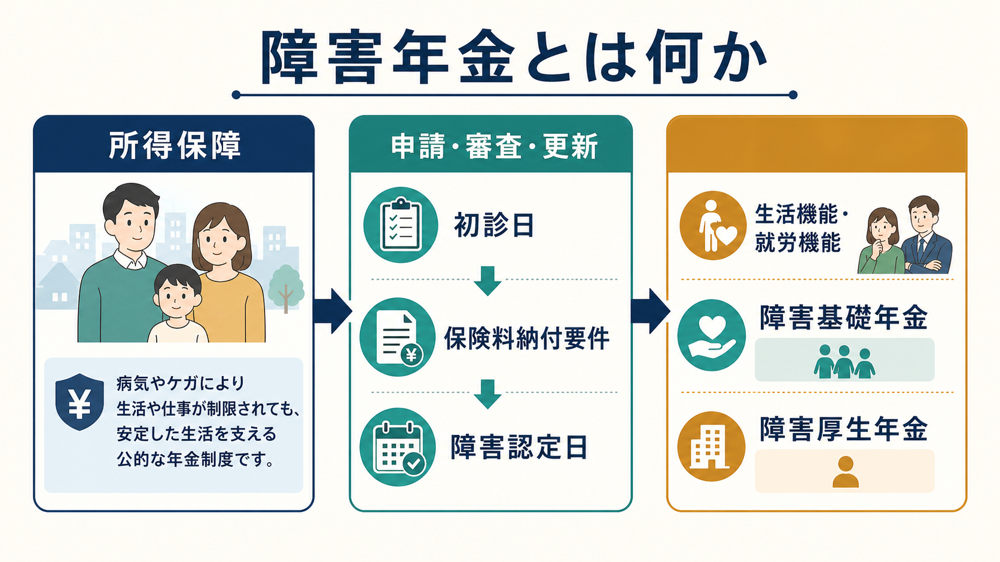
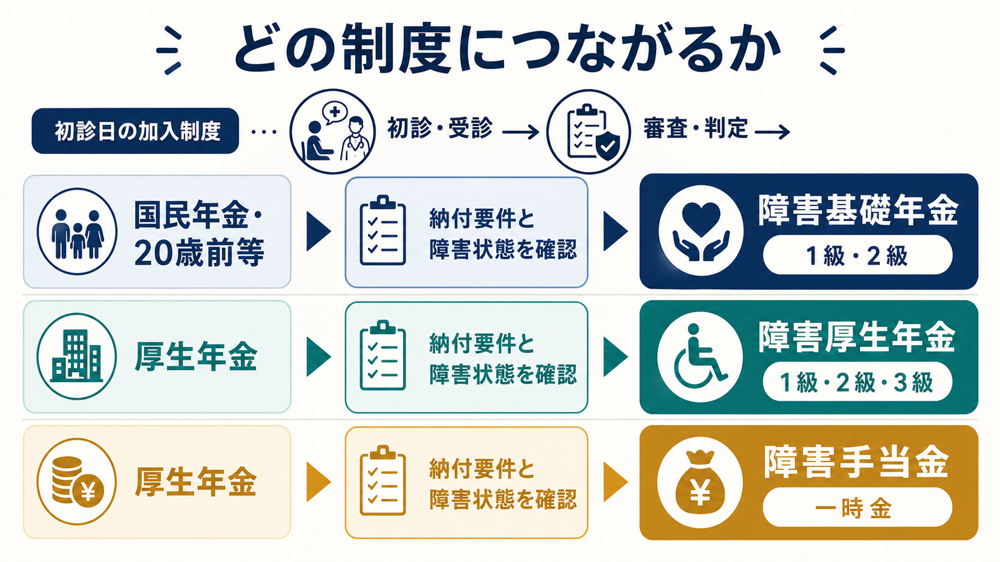
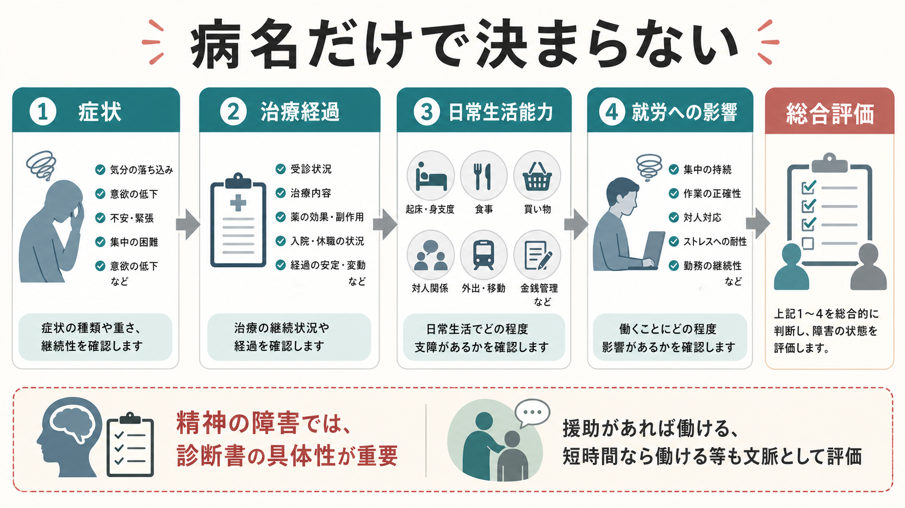

# 障害年金とは何か

## 要点

- 障害年金は、病気やけがによって日常生活や労働に継続的な制限が生じたとき、所得の一部を保障する公的年金制度である。精神疾患でも、病名だけでなく生活機能・就労機能・治療経過・支援の必要性を総合して判断される。
- 入口になる概念は、初診日、保険料納付要件、障害認定日、障害等級である。初診日にどの年金制度に加入していたかによって、障害基礎年金、障害厚生年金、障害手当金へのつながり方が変わる[1][2][3]。
- 精神の障害では、診断書における日常生活能力、就労状況、治療内容、援助の必要性の具体的記載が重要である。等級判定ガイドラインは「目安」を示すが、最終的には障害認定基準と診断書等に基づく総合評価である[4][5][6]。
- 障害年金は「働けないことの証明」だけではない。支援付き就労、短時間就労、福祉的就労、病状変動を含め、収入・生活費・支援環境の不安定さをどう支えるかという制度である[5][8]。
- 本稿は教育・研究目的の整理であり、個別の請求可否や等級を判断するものではない。実際の手続きでは年金事務所、自治体窓口、主治医、精神保健福祉士、社会保険労務士等への確認が必要である。

## この記事で答える問い

1. 障害年金は、精神疾患による生活機能障害をどのように支える制度なのか。
2. 障害基礎年金、障害厚生年金、障害手当金は何が違うのか。
3. 精神疾患では、病名・診断・就労状況・日常生活能力がどのように認定に関係するのか。
4. 臨床家、支援者、研究者は、障害年金をどのように理解すべきか。

## まず結論

障害年金は、精神疾患を「診断名」としてではなく、生活と労働にどの程度の制限が生じているかという機能障害として扱う制度である。うつ病、双極性障害、統合失調症、発達障害、知的障害、器質性精神障害などの診断名は重要な入口だが、認定の中心は、食事、清潔保持、金銭管理、通院、対人関係、危機対応、就労の継続性といった生活全体の機能である[4][5]。

制度上は、初診日に国民年金側にいた場合は障害基礎年金、厚生年金側にいた場合は障害厚生年金が問題になりやすい。障害基礎年金は1級・2級、障害厚生年金は1級・2級・3級があり、厚生年金では一定の軽い障害状態に障害手当金という一時金もある[2][3]。したがって、同じ精神疾患でも、初診日の制度加入状況と納付要件によって、受けられる制度の範囲が異なる。

## 背景

精神疾患は、症状そのものだけでなく、生活リズム、対人関係、通勤、集中、意思決定、金銭管理、服薬継続、危機時の援助要請に影響しやすい。症状が軽く見える日があっても、変動性、再発リスク、疲労の回復しにくさ、支援なしでは生活が崩れやすいことがある。したがって、所得保障を考えるときには、単に「病名があるか」「現在働いているか」だけでは不十分である。

WHOのICFは、障害を個人の病気だけではなく、健康状態、活動、参加、環境因子の相互作用として把握する枠組みを示している[7]。障害年金の実務も、完全にICFそのものではないが、病名から直線的に結論を出すのではなく、生活機能と社会参加を見ようとする点で近い問題意識をもつ。

日本の障害年金制度では、障害基礎年金と障害厚生年金の支給要件、請求時期、年金額が日本年金機構により整理されている。厚生労働省も、初診日、障害認定日、保険料納付要件が制度の中核であることを示している[1][2][3]。精神障害・知的障害については、地域差を小さくし、等級判定の標準的な考え方を示すために、精神の障害に係る等級判定ガイドラインが作成されている[5]。

## 基本概念

### 初診日

初診日は、障害の原因となった病気やけがについて、初めて医師または歯科医師の診療を受けた日である[1]。精神疾患では、最初は不眠、食欲低下、不安、体調不良、登校・出勤困難、身体症状として受診することもあるため、どの受診が現在の障害につながる初診日なのかが実務上の重要点になる。

初診日は、加入制度と保険料納付要件を判断する基準点でもある。初診日に国民年金の加入期間等であったか、厚生年金の被保険者であったかによって、障害基礎年金か障害厚生年金かの入口が分かれる[2][3]。

### 保険料納付要件

障害年金は公的年金保険の給付であるため、原則として初診日前の保険料納付状況が問われる。日本年金機構と厚生労働省の説明では、初診日の前日において、初診日の属する月の前々月までの被保険者期間について、納付済期間と免除期間等が一定以上あることなどが要件として示されている[1][2][3]。20歳前傷病による障害基礎年金など、納付要件の扱いが異なる類型もある。

### 障害認定日

障害認定日は、原則として初診日から1年6か月を経過した日、またはその期間内に傷病が治った日、すなわち症状が固定し治療効果が期待できない状態に至った日である[1][3]。精神疾患では、症状固定という考え方が身体疾患ほど単純ではないため、診断書には認定日時点と現在の状態を分けて記載する実務が重要になる。

### 障害等級

障害基礎年金は1級・2級、障害厚生年金は1級・2級・3級が中心である。日本年金機構の説明では、1級は他人の介助を受けなければ日常生活のことがほとんどできない程度、2級は日常生活が極めて困難で労働によって収入を得ることができない程度、3級は労働が著しい制限を受ける程度として説明される[3]。ただし、精神の障害では、これを病名に機械的に当てはめるのではなく、具体的な生活機能と就労機能に落とし込んで読む必要がある。

## 仕組み

### どの制度につながるか

障害基礎年金は、初診日が国民年金加入期間、20歳前、または日本国内に住む60歳以上65歳未満で年金制度に加入していない期間にある場合などが入口になる[2]。障害厚生年金は、初診日に厚生年金保険の被保険者であったことが基本要件である[3]。

厚生年金側では、1級・2級・3級の障害厚生年金に加え、障害手当金という一時金も制度上位置づけられている[3]。そのため、精神疾患による機能障害が同じように見えても、初診日の加入制度が違えば、制度上の射程が変わる。

### 認定は「病名だけ」ではない

精神の障害に係る等級判定ガイドラインは、診断書の記載事項を踏まえた等級の目安と、総合的に等級判定する際に考慮すべき要素を示している[5]。ここで重要なのは、目安が結論そのものではないことである。症状の種類と重さ、治療経過、日常生活能力、就労状況、援助の必要性、病状の変動、社会的支援の有無などが総合的に評価される。

日本年金機構は、診断書作成医向けに、障害年金が日常生活に継続的な制限が生じ支援が必要な場合を障害状態と捉え、障害の程度、すなわち日常生活の度合いや労働能力の喪失に応じて等級を決定するものだと説明している[6]。これは、臨床診断書が「診断名の確認書」ではなく、「生活と労働の機能障害を記述する資料」であることを意味する。

### 請求と更新

障害年金には、障害認定日時点の状態に基づいて請求する認定日請求、認定日には該当しなかったが後に状態が重くなった場合の事後重症請求などがある[1][2][3]。精神疾患では、初診から時間が経ってから生活機能が大きく低下すること、逆に一時的な改善と再燃を繰り返すことがあるため、どの時点の状態をどの資料で示すのかが重要になる。

受給後も、障害状態確認届などにより、一定の時期に状態確認が行われることがある[6]。更新は単なる形式手続きではなく、生活機能、就労状況、治療状況、支援体制の変化を再評価する場面である。

## 図解

この記事の3枚の図は、次の対応で読むとよい。

| 図 | 主題 | 読み方 |
|---|---|---|
| 図1 | 障害年金の全体像 | 所得保障、初診日、納付要件、障害認定日、生活・就労機能を一つの流れとして見る |
| 図2 | 精神障害の認定メカニズム | 病名だけでなく、症状、治療経過、日常生活能力、就労への影響を総合する |
| 図3 | 制度の比較 | 初診日の加入制度によって、障害基礎年金、障害厚生年金、障害手当金への接続が変わる |

## 臨床・研究との接続

### 臨床家にとっての意味

臨床家にとって、障害年金は書類作成業務だけではない。生活維持、治療継続、再発予防、住居の安定、家族負担の軽減、就労支援との接続に関わる制度である。精神科診療では、症状評価と同じくらい、生活機能の具体的把握が重要になる。

診断書では、「抑うつがある」「不安が強い」といった症状名だけでは、生活上の制限が伝わりにくい。たとえば、食事の準備ができない、服薬管理に援助がいる、金銭管理が破綻しやすい、公共交通機関を使えない、職場で対人調整ができない、数日働くと寝込む、支援者の同行がないと通院できない、といった機能記述が重要である[5][6]。

### 支援者にとっての意味

精神保健福祉士、相談支援専門員、就労支援員、訪問看護、家族支援者にとっては、障害年金は[[精神保健福祉法とは何か]]や[[意思決定支援とは何か]]と接続する生活支援の一部である。本人が制度を理解し、自分の生活史と困難を言語化し、必要な資料を整理できるように支えることは、単なる代行ではなく意思決定支援でもある。

就労支援との関係では、障害年金を「働くことの反対」と捉えると誤る。障害年金があることで、治療継続、短時間就労、段階的復職、福祉的就労、生活リズムの再建が可能になる場合がある。障害年金受給者の生活実態と就労状況を分析した研究では、精神障害による受給者では年金収入も就労収入も低く、世帯収入が低くなる傾向が示されている[8]。これは、年金と就労を二者択一にせず、所得保障と就労支援を組み合わせる必要性を示す。

### 研究にとっての意味

研究上は、障害年金を単なる制度利用率として扱うだけでは不十分である。精神症状、生活機能、就労機能、家族支援、地域資源、スティグマ、社会保障制度、申請支援へのアクセスが絡み合う。ICFの視点を用いれば、障害年金は個人の病理だけでなく、環境との相互作用のなかで生じる生活制限への制度的応答として理解できる[7]。

## よくある誤解

### 「病名が重ければ必ず受給できる」

病名は重要だが、病名だけで決まるわけではない。精神の障害では、症状の重さ、日常生活能力、就労への影響、治療経過、援助の必要性などが総合される[4][5]。

### 「働いていたら障害年金は無理」

就労している事実は評価要素になるが、それだけで直ちに結論が決まるわけではない。支援付き就労、短時間勤務、頻回の欠勤、職場での配慮、収入の低さ、就労後の消耗、生活の破綻などを含めて見る必要がある[5][8]。

### 「診断書は医師だけが考えればよい」

診断書を作成するのは医師だが、生活実態を最も知っているのは本人、家族、支援者であることも多い。生活上の困難を具体的に共有し、診療録や支援記録と矛盾しない形で整理することが重要である[6]。

### 「障害年金は治療や回復を妨げる」

所得保障があることで、通院継続、服薬継続、住居の安定、過重労働の回避、就労訓練への参加が可能になることがある。制度を利用することと回復志向は対立しない。むしろ、生活基盤が不安定なまま回復だけを求めることの方が、再発や孤立を招きやすい。

## 関連ノート

- [[精神保健福祉法とは何か]]
- [[意思決定支援とは何か]]
- [[司法精神医学とは何か]]
- [[精神科入院で患者の権利をどう守るのか]]
- [[医療観察法とは何か]]

## MOC更新候補

- `content/00_MOC/` 配下の精神医学、地域精神医療、社会保障、制度論に関するMOCがある場合、本記事へのリンク追加候補とする。
- 並列ジョブとの衝突を避けるため、本作業ではMOC本体は更新しない。

## 未解決問題

- 精神疾患の病状変動を、更新時の診断書と日常生活記録でどの程度反映できるか。
- 就労支援と障害年金を、本人の回復と生活安定に資する形でどのように組み合わせるか。
- 申請支援にアクセスできる人とできない人の格差を、地域精神保健システムのなかでどう縮小するか。
- 精神障害による厚生年金3級受給者など、年金額と生活困窮がずれやすい層をどう支えるか。

## 理解チェック

1. 障害年金の入口で重要になる「初診日」は、なぜ単なる受診日の記録以上の意味をもつのか。
2. 精神疾患の障害認定で、病名だけでなく日常生活能力や就労機能を見る理由は何か。
3. 「働いている」という事実を、障害年金の文脈でどのように慎重に解釈すべきか。
4. 臨床家や支援者は、診断書作成や申請支援において、本人の生活実態をどのように把握すべきか。

## 参考文献

[1] 厚生労働省. 年金制度の仕組みと考え方 第12 障害年金. https://www.mhlw.go.jp/stf/nenkin_shikumi_012.html

[2] 日本年金機構. 障害基礎年金の受給要件・請求時期・年金額. 更新日 2026年4月1日. https://www.nenkin.go.jp/service/jukyu/seido/shougainenkin/jukyu-yoken/20150514.html

[3] 日本年金機構. 障害厚生年金の受給要件・請求時期・年金額. 更新日 2026年4月1日. https://www.nenkin.go.jp/service/jukyu/seido/shougainenkin/jukyu-yoken/20150401-02.html

[4] 日本年金機構. 国民年金・厚生年金保険 障害認定基準. 更新日 2022年4月1日. https://www.nenkin.go.jp/service/jukyu/seido/shougainenkin/ninteikijun/20140604.html

[5] 日本年金機構. 『国民年金・厚生年金保険 精神の障害に係る等級判定ガイドライン』等. 更新日 2020年12月25日. https://www.nenkin.go.jp/service/jukyu/seido/shougainenkin/ninteikijun/20160715.html

[6] 日本年金機構. 障害年金の診断書を作成する医師の方へ. 更新日 2021年5月25日. https://www.nenkin.go.jp/tokusetsu/ishimuke.html

[7] World Health Organization. International Classification of Functioning, Disability and Health (ICF). https://www.who.int/standards/classifications/international-classification-of-functioning-disability-and-health

[8] 百瀬優, 大津唯. 障害年金受給者の生活実態と就労状況. 社会政策, 12(2), 74-87, 2020. https://doi.org/10.24533/spls.12.2_74

