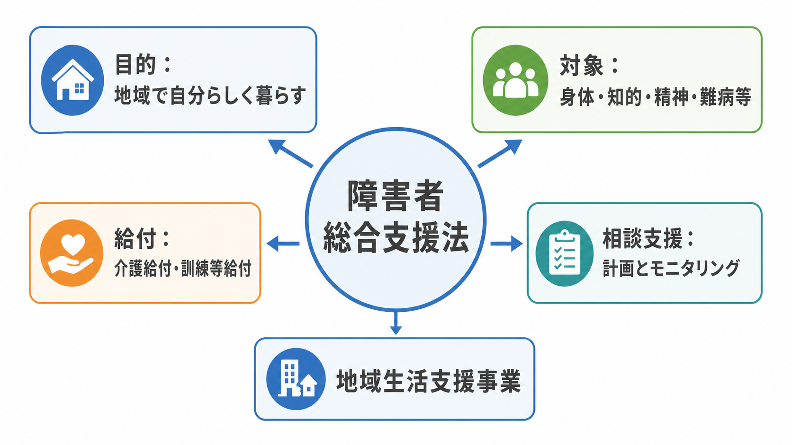
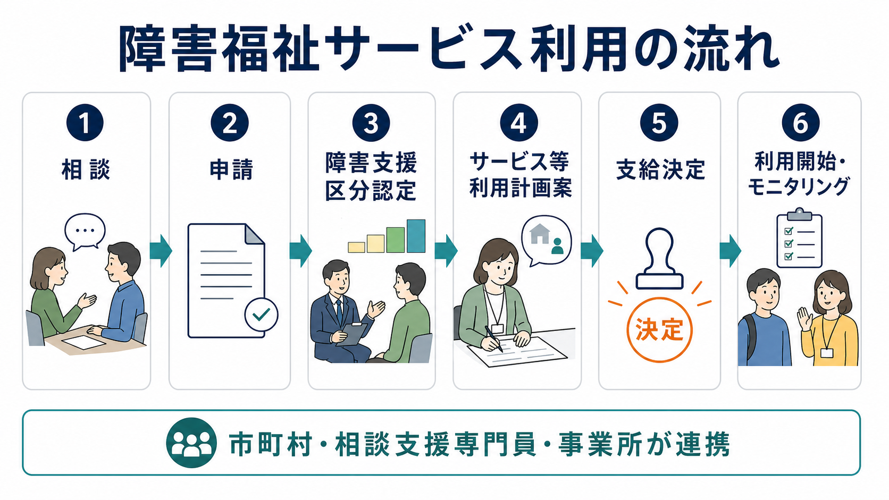
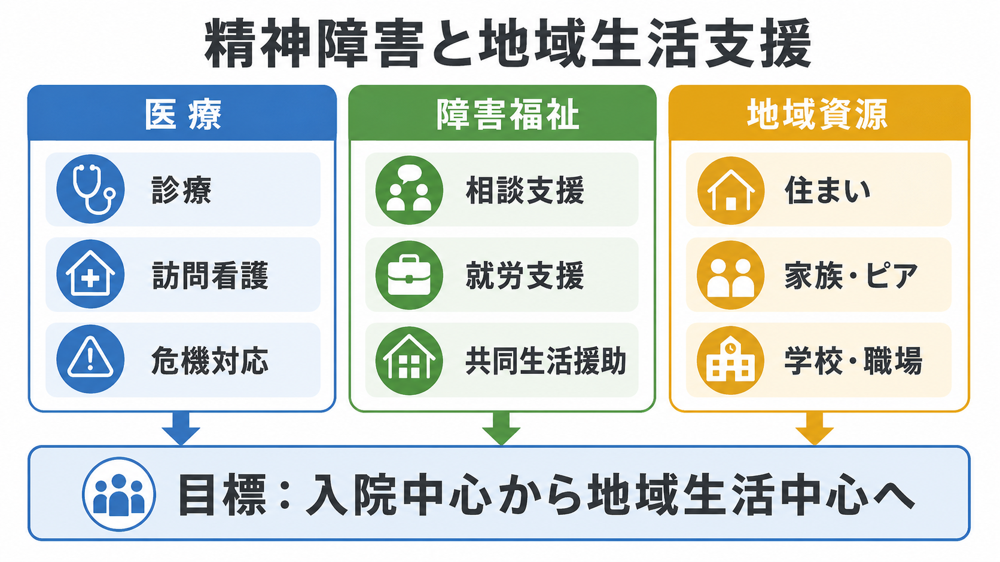

# 障害者総合支援法とは何か

## 要点

- 障害者総合支援法は、障害のある人が地域で日常生活・社会生活を営むための障害福祉サービス、自立支援医療、補装具、地域生活支援事業などの枠組みを定める法律である[1]。
- 対象は身体障害、知的障害、精神障害、発達障害、高次脳機能障害、難病等を含む。精神障害も明示的に障害福祉サービスの対象に含まれる[1][2]。
- サービスは、個別の支給決定に基づく「障害福祉サービス」と、市町村等が地域の実情に応じて実施する「地域生活支援事業」に大別される[3]。
- 精神科臨床では、症状の治療だけでなく、住まい、日中活動、就労、相談支援、ピアサポートを組み合わせて地域生活を支える制度として理解する必要がある[6]。

## この記事で答える問い

1. 障害者総合支援法は、精神障害のある人にとって何を可能にする制度なのか。
2. 介護給付、訓練等給付、相談支援、地域生活支援事業はどう違うのか。
3. 医療、障害福祉、自治体、地域資源はどのようにつながるのか。

## まず結論

障害者総合支援法は、「診断名がある人に自動的にサービスを出す法律」ではなく、障害によって生じる生活上の困難と支援ニーズを、市町村の支給決定、相談支援、事業所サービス、地域資源の組み合わせに変換する制度である。精神障害では、症状の波、対人関係の負荷、生活リズム、就労継続、住まいの維持などが支援ニーズとして現れやすい。そのため、[[精神保健福祉法とは何か]]が医療・入院・相談体制の制度的側面を扱うのに対し、障害者総合支援法は地域生活を支える福祉サービスの利用枠組みを担う。

## 背景

現在の障害者総合支援法の正式名称は「障害者の日常生活及び社会生活を総合的に支援するための法律」である。2013年4月1日に、障害者自立支援法を改める形で施行され、難病等が対象に加わるなど、障害保健福祉施策の対象と体系が拡張された[2]。

背景にあるのは、障害を「本人の機能障害」だけでなく、社会参加、生活環境、支援体制との相互作用として捉える方向への転換である。厚生労働省は、障害のある人も地域で安心して暮らせる社会、普通に暮らし地域の一員としてともに生きる社会を目指すと説明している[2]。精神障害領域では、長期入院中心から地域生活中心へという政策目標とも接続している[6]。

## 基本概念

### 対象者

障害者総合支援法は、身体障害、知的障害、精神障害、難病等により日常生活または社会生活に支援を要する人を対象にする。ここで重要なのは、「精神障害者保健福祉手帳を持っていないと必ず使えない」という単純な制度ではない点である。サービスごとに、診断書、障害支援区分、生活状況、支援の必要性、自治体の判断などが関わる。

精神障害の場合、統合失調症、気分障害、発達障害、依存症、高次脳機能障害などで、生活機能や社会参加に困難がある人が制度利用を検討しうる。ただし、実際に利用できるサービス、必要書類、判定の扱いは自治体とサービス種別によって異なるため、個別事例では市町村窓口や相談支援専門員への確認が必要である。

### 障害福祉サービス

厚生労働省は、サービスを、個々の障害の程度や社会活動、介護者、居住状況などを踏まえて個別に支給決定される「障害福祉サービス」と、市町村の創意工夫により柔軟に実施される「地域生活支援事業」に大別している[3]。障害福祉サービスは、介護の支援を受ける「介護給付」と、訓練等の支援を受ける「訓練等給付」に位置づけられる[3]。

精神障害に関係しやすいサービスには、居宅介護、重度訪問介護、短期入所、生活介護、自立訓練、就労移行支援、就労継続支援、就労定着支援、共同生活援助、地域移行支援、地域定着支援、自立生活援助などがある。たとえば、退院後の住まい、日中活動、服薬・生活リズムの維持、就労準備、孤立予防を支援する制度的資源として使われる。

### 障害支援区分

障害支援区分は、介護給付などの支給決定で用いられる、支援の必要度を示す区分である。市町村の認定調査、医師意見書、市町村審査会などを経て判定される[4]。精神障害では、外見上は困難が見えにくい場合があるため、症状の波、対人場面での疲弊、金銭管理、危機時の対応、家事・服薬・通院の継続などを、本人と支援者が具体的に言語化することが重要になる。

## 仕組み

利用の基本的な流れは、相談、申請、アセスメント、計画案、支給決定、利用開始、モニタリングである。相談支援では、本人の意向、生活上の困りごと、利用したいサービス、家族や医療機関との関係を整理し、サービス等利用計画またはその案を通じて支給決定と実際のサービス利用をつなぐ[5]。

制度上の意思決定で注意すべき点は、サービスを「受けさせる」のではなく、本人の意思、生活史、価値観、リスクへの考え方を踏まえて支援を組み立てることである。これは[[意思決定支援とは何か]]と直接つながる。とくに精神科領域では、病状悪化時の保護的介入と、本人の自己決定・地域生活の尊重が緊張関係を持つため、支援会議や計画相談でそのバランスを明示的に扱う必要がある。

## 図解

上の2枚は、制度の全体像と利用までの流れを示したものである。3枚目は、精神障害のある人の地域生活支援を、医療、障害福祉、地域資源の接続として見た図である。

図のポイントは、障害福祉サービスだけで生活全体が完結するわけではないことにある。診療、訪問看護、危機対応などの医療資源、相談支援、就労支援、共同生活援助などの福祉資源、住まい、家族、ピア、学校、職場などの地域資源が、本人の生活目標に合わせて組み合わされる。厚生労働省が進める「精神障害にも対応した地域包括ケアシステム」も、医療、障害福祉・介護、住まい、社会参加、教育、地域の助け合いを包括的に確保する方向を示している[6]。

## 臨床・研究との接続

精神科臨床で障害者総合支援法を理解する意義は、治療反応だけでは説明できない生活上の転帰を扱える点にある。たとえば、外来で症状が安定していても、孤立、失業、家事困難、家族関係の緊張、住居不安が続くと再発や再入院のリスクが高まる。逆に、就労支援、住まいの安定、ピアとのつながり、相談先の確保があると、症状が完全に消えなくても生活の回復が進むことがある。

研究上は、障害福祉サービスの利用を、単なる「サービス利用の有無」ではなく、地域生活の継続、入院日数、就労・就学、社会参加、主観的リカバリー、家族負担、危機時支援の質などと関連づけて評価する必要がある。制度のアウトカムは医療アウトカムと重なるが、同一ではない。[[医療観察法とは何か]]のように司法・医療・福祉が強く接続する領域では、地域処遇や再発予防の観点からも、障害福祉サービスの位置づけが重要になる。

## よくある誤解

### 誤解1：精神障害は障害福祉サービスの対象ではない

精神障害は対象に含まれる。実際、重度訪問介護の説明でも、重度の知的障害または精神障害により行動上著しい困難があり常時介護を要する人が対象として示されている[3]。ただし、使えるサービスは生活機能、支援必要度、自治体の支給決定によって変わる。

### 誤解2：診断名があれば自動的にサービスが使える

診断名は重要な情報だが、それだけで支給決定が機械的に決まるわけではない。生活場面でどのような支援が必要か、本人が何を望むか、家族・住居・日中活動・危機対応の状況がどうかを具体的に整理する必要がある。

### 誤解3：障害福祉は医療の代わりである

障害福祉は医療の代替ではなく、地域生活を支える別の軸である。医療は診断、治療、危機対応、症状評価を担い、障害福祉は生活支援、日中活動、就労、住まい、相談支援を担う。両者は競合ではなく、連携して初めて機能する。

### 誤解4：サービス利用は本人の自立を妨げる

制度上の支援は、本人の生活を代行するだけではなく、生活の選択肢を広げるために使われる。支援を受けながら自分で決める、失敗を含めて学ぶ、必要な場面で助けを求めるという形も自立の一部である。

## 関連ノート

- [[精神保健福祉法とは何か]]
- [[意思決定支援とは何か]]
- [[医療観察法とは何か]]
- [[司法精神医学とは何か]]
- [[精神科入院で患者の権利をどう守るのか]]

## MOC更新候補

- `content/00_MOC/` 配下の精神医学、地域精神医療、司法・制度系 MOC に追加候補。
- 並列ジョブとの競合を避けるため、このタスクでは MOC 本体は更新しない。

## 理解チェック

1. 障害者総合支援法のサービス体系で、「障害福祉サービス」と「地域生活支援事業」はどのように違うか。
2. 精神障害のある人がサービス利用を検討するとき、診断名以外にどのような生活情報が重要か。
3. 相談支援専門員、医療機関、市町村、事業所は、それぞれどの場面で関与するか。
4. 医療モデルだけでなく地域生活モデルとして制度を見ると、支援目標はどのように変わるか。

## 未解決問題

- 自治体間で、支給決定、相談支援体制、事業所資源、就労支援資源に差がある。
- 精神障害の困難は変動性が高く、短時間の認定調査だけでは支援必要度が十分に見えないことがある。
- 医療、障害福祉、介護、生活困窮支援、司法、教育、雇用の制度境界をまたぐケースでは、責任主体が見えにくくなりやすい。
- サービス利用の効果を、入院回避だけでなく、本人の希望、社会参加、孤立予防、権利擁護の観点から評価する研究がさらに必要である。

## 参考文献

[1] e-Gov法令検索. 障害者の日常生活及び社会生活を総合的に支援するための法律. https://elaws.e-gov.go.jp/document?lawid=417AC0000000123

[2] 厚生労働省. 障害者総合支援法が施行されました. https://www.mhlw.go.jp/stf/seisakunitsuite/bunya/hukushi_kaigo/shougaishahukushi/sougoushien/index.html

[3] 厚生労働省. 障害福祉サービスの内容. https://www.mhlw.go.jp/stf/seisakunitsuite/bunya/hukushi_kaigo/shougaishahukushi/service/naiyou.html

[4] 厚生労働省. 障害支援区分. https://www.mhlw.go.jp/stf/seisakunitsuite/bunya/hukushi_kaigo/shougaishahukushi/kubun/index.html

[5] 厚生労働省. 障害のある人に対する相談支援について. https://www.mhlw.go.jp/stf/seisakunitsuite/bunya/hukushi_kaigo/shougaishahukushi/service/soudan_shien.html

[6] 厚生労働省. 精神障害にも対応した地域包括ケアシステムの構築について. https://www.mhlw.go.jp/stf/seisakunitsuite/bunya/chiikihoukatsu.html

[7] 厚生労働省. 地域生活支援事業. https://www.mhlw.go.jp/stf/seisakunitsuite/bunya/hukushi_kaigo/shougaishahukushi/chiiki/index.html

[8] 厚生労働省. 令和6年度障害福祉サービス等報酬改定について. https://www.mhlw.go.jp/stf/seisakunitsuite/bunya/0000202214_00009.html
