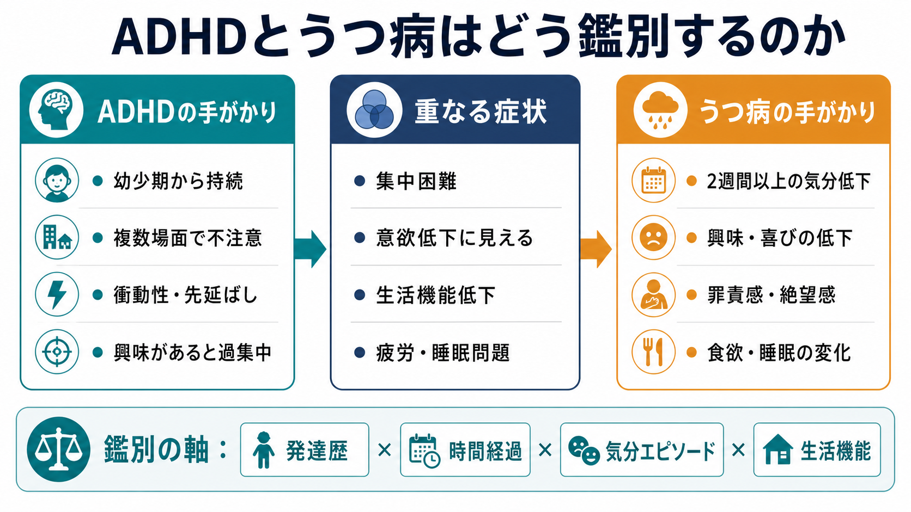
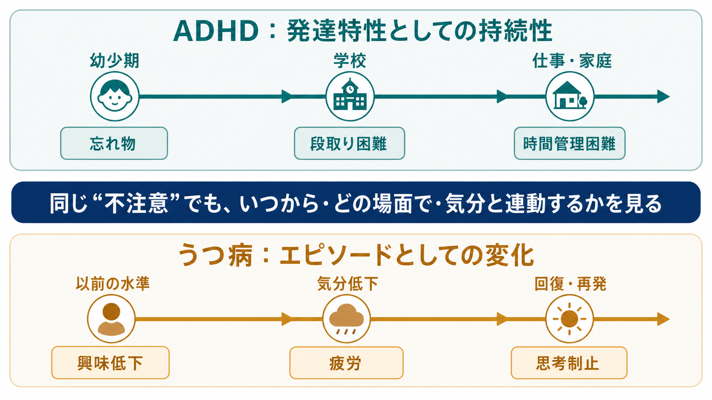
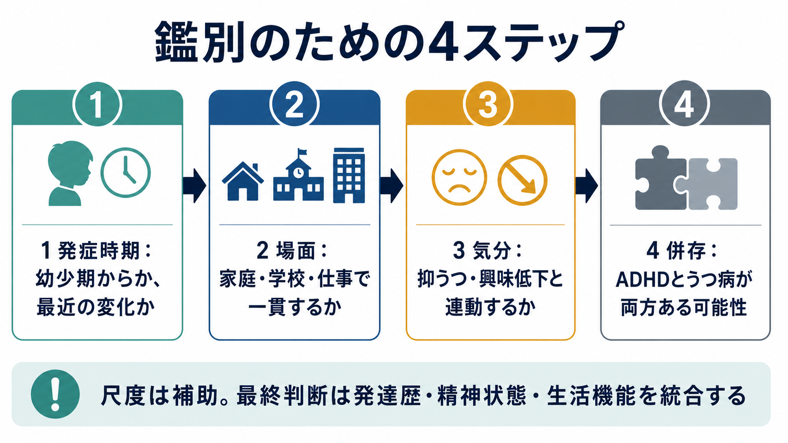

# ADHDとうつ病はどう鑑別するのか

## 要点

- [[ADHDとは何か|ADHD]] と [[うつ病とは何か|うつ病]] は、集中困難、先延ばし、疲労感、生活機能低下が重なるため、表面症状だけでは鑑別しにくい。
- 鑑別の中心は、「幼少期から複数場面で続く発達特性か」「ある時期から気分低下・興味低下と一緒に落ち込んだ状態か」を分けることである[1][2][3]。
- ただし、ADHDとうつ病はどちらか一方だけとは限らない。ADHDに二次的な失敗体験、孤立、自己評価低下が重なって抑うつが生じることも、うつ病のエピソード中にADHD様の不注意が前景化することもある[5][6]。
- 尺度は補助であり、診断名を単独で決める道具ではない。発達歴、精神状態、生活機能、家族・学校・職場からの情報を統合して判断する[1][2][3]。

## この記事で答える問い

1. ADHDとうつ病では、どの症状が重なりやすいのか。
2. 不注意や意欲低下を、発達歴と気分変動からどう整理するのか。
3. ADHDとうつ病が併存している可能性を、どこで考えるのか。
4. 尺度、家族情報、職場・学校情報をどう位置づけるのか。

## まず結論

もっとも実用的な問いは、「その人は昔からそのような困難を抱えていたのか、それとも最近の気分エピソードとともに変化したのか」である。ADHDでは、不注意、衝動性、時間管理困難、段取り困難が幼少期から何らかの形で存在し、家庭・学校・仕事・対人関係など複数場面で機能低下をもたらす[1][2]。うつ病では、抑うつ気分または興味・喜びの低下を中心に、睡眠、食欲、疲労、集中困難、罪責感、絶望感などが一定期間まとまって出現し、以前の水準から低下する[3][4]。

したがって、集中できないという訴えを聞いたときは、すぐに「ADHDか、うつ病か」と二分しない。発症時期、持続性、場面横断性、気分との連動、身体症状、希死念慮、双極性障害・不安症・睡眠障害・物質使用・身体疾患の可能性を順に確認する。これは個別診断や治療指示ではなく、教育・研究目的の鑑別整理である。

## 背景

ADHDは神経発達症の一つであり、不注意、多動性、衝動性が発達水準に比して目立ち、生活機能を妨げる状態である。NICEは成人でADHDが疑われる場合、典型的な症状が小児期から始まり、生涯にわたって持続し、他の精神疾患だけでは説明されず、中等度以上の心理・社会・教育・職業上の障害を伴う場合に専門的評価へつなぐと述べている[1]。CDCも、ADHD診断では単一検査ではなく、複数段階の評価、DSM基準、12歳以前からの症状、2つ以上の場面、機能障害、他の精神疾患による説明の除外が必要だと整理している[2]。

うつ病は、低い気分だけでなく、興味・喜びの低下、疲労、睡眠・食欲変化、集中困難、無価値感・罪責感、死についての考えを含みうる。NICEはうつ病の重症度を、症状数だけでなく、症状の強さ、持続期間、個人・社会機能への影響から捉える[3]。NIMHも、大うつ病では抑うつ気分または興味低下が少なくとも2週間続き、日常活動を妨げることを強調している[4]。

この2つが紛らわしいのは、どちらも「できない」「続かない」「動けない」という形で現れるからである。ADHDの人は、報酬が遠い課題、退屈な手続き、同時並行処理、期限管理で困りやすい。一方、うつ病の人は、以前ならできていた課題でも、抑うつ、疲労、思考制止、自己否定、睡眠障害のために遂行できなくなる。

## 基本概念

### ADHDを示唆する軸

ADHDを考えるときは、現在の不注意だけではなく、発達歴を聞く。幼少期から忘れ物、片づけ困難、提出物の遅れ、授業中の注意散漫、衝動的な発言、時間管理の苦手さがあったか。学校では目立たなかった場合でも、家では持ち物管理が極端に難しかったか、親や教師が強く補助していたために見えにくかったかを確認する。成人では、多動は走り回る形ではなく、内的な落ち着かなさ、しゃべりすぎ、待つことの苦痛、仕事の切り替え困難として現れることがある[2][5]。

また、ADHDの困難は場面によって強弱がある。興味があることには過集中できるが、単調な事務作業や長期的な課題では始められない、続かない、締切直前まで動けない。これは「やる気がない」というより、報酬予測、持続的注意、実行機能、自己調整の問題として理解すると整理しやすい。関連して [[実行機能障害とは何か]]、[[注意障害とは何か]]、[[ADHDは前頭線条体回路の障害として説明できるのか]] も参照できる。

### うつ病を示唆する軸

うつ病を考えるときは、「以前の水準からの変化」を重視する。もともと仕事や家事をこなせていた人が、ある時期から気分が沈み、楽しめなくなり、疲れやすく、眠れないまたは眠りすぎる、食欲が変わる、考えがまとまらない、強い罪責感や絶望感を抱くようになったなら、[[大うつ病性障害とは何か|大うつ病性障害]] や関連する気分障害を評価する必要がある[3][4]。

ここで重要なのは、「集中困難」はうつ病の中核に近い認知症状でもあるという点である。うつ病では、注意が散るというより、思考が重くなる、決められない、読んでも頭に入らない、自己否定的な考えに引き込まれる、といった形をとりやすい。関連して [[抑うつ気分とは何か]]、[[思考制止とは何か]]、[[快感消失とは何か]] が鑑別の助けになる。

## 仕組み

ADHDとうつ病の鑑別は、単一の症状を病名に対応させる作業ではない。同じ「不注意」でも、背景の時間構造が異なる。

ADHDでは、不注意や実行機能の困難が発達早期から続き、状況要求が上がるほど目立つ。小学校では親の支援で保たれていたが、大学、就職、育児、管理職などで自己管理負荷が増えると破綻することがある。この場合、本人は「最近急に悪くなった」と感じても、詳しく聞くと以前から同質の困難があった、という形になりやすい[1][5]。

うつ病では、気分エピソードに沿って認知・意欲・身体の機能が落ちる。集中困難は、抑うつ気分、興味低下、疲労、睡眠障害、自己評価低下と同じ時期に悪化し、回復に伴って改善する可能性がある[3][4]。この場合、幼少期からの一貫した不注意よりも、「ある時点から明らかに変わった」という経過が手がかりになる。

ただし、実際の臨床像はもっと重なり合う。成人ADHDでは不安症やうつ病の併存が多く、症状同士が相互に悪化し、疾病負担や機能障害を増やすことが報告されている[6]。成人ADHDのコンセンサスでも、気分不安定、低い自己評価、いらだちが気分障害やパーソナリティ障害と混同されうるため、発達歴、現在症状、併存症、情報提供者からの確認を含む包括的評価が必要とされる[5]。

## 図解

鑑別の実務では、次の4ステップで整理すると見落としが減る。

| 確認する軸 | ADHDを示唆しやすい所見 | うつ病を示唆しやすい所見 | 注意点 |
|---|---|---|---|
| 発症時期 | 幼少期からの忘れ物、片づけ困難、時間管理困難 | 以前はできていたことが、ある時期からできない | 成人になって初めて困るADHDも、詳しく聞くと過去の補助が見えることがある |
| 場面 | 学校、家庭、仕事、対人関係など複数場面で一貫 | 気分エピソード中に広く低下 | 場面差は環境要求と支援量で変わる |
| 気分との連動 | 興味・報酬・期限で大きく変動するが、低気分だけでは説明しにくい | 抑うつ気分、興味低下、疲労、睡眠変化と同時に悪化 | ADHDにも情動調整困難はあり、単純には分けられない |
| 自己評価 | 失敗体験から二次的に低下しうる | 罪責感、無価値感、絶望感が前景化しやすい | 希死念慮は直接確認する |
| 尺度 | ASRSなどはスクリーニング補助 | PHQ-9などは重症度・経過把握補助 | 尺度だけで診断しない[1][3] |

## 臨床・研究との接続

評価では、[[精神科初診で何を確認するべきか|初診評価]] と [[現病歴はどのように構造化するべきか|現病歴の構造化]] が重要になる。ADHDが疑われるときは、本人の現在の訴えだけでなく、通知表、親・きょうだい・配偶者からの情報、学校や職場での困りごと、生活上の補助の有無を確認する。うつ病が疑われるときは、気分、興味、睡眠、食欲、疲労、焦燥または制止、罪責感、集中困難、希死念慮、過去の躁状態・軽躁状態を確認する。NICEは、うつ病評価で過去の気分高揚も確認し、双極性障害の可能性を考慮するよう述べている[3]。この点は [[双極性障害とは何か]]、[[双極II型障害とは何か]] とも接続する。

研究上は、ADHDとうつ病の併存は「診断が2つ並ぶ」だけではなく、発達的脆弱性、報酬処理、実行機能、情動調整、睡眠、社会的失敗体験が互いに影響する状態として扱う必要がある。World Federation of ADHD の国際コンセンサスは、ADHDに関する多くの知見がメタ解析や大規模研究に支えられており、ADHDは全年齢で妥当な臨床診断として扱える一方、評価は訓練された臨床家による面接に基づくべきで、尺度や神経心理検査、脳画像だけで診断できないと整理している[7]。

## よくある誤解

### 「大人になって困り始めたならADHDではない」

これは単純化しすぎである。ADHDの特性は幼少期から存在するが、環境要求が低い時期、家族の補助が厚い時期、知的能力や努力で補えていた時期には目立ちにくいことがある。大学進学、就職、昇進、育児、介護などで自己管理負荷が増えたときに初めて問題化することがある[1][5]。詳しくは [[発達歴は成人精神科でもなぜ重要なのか]] が関連する。

### 「集中できないならADHDである」

集中困難は、うつ病、不安症、睡眠障害、物質使用、身体疾患、薬剤、認知症、トラウマ関連症状でも生じる。CDCも、睡眠障害、不安、うつ病、学習障害などがADHDに似た症状を示すことがあると述べている[2]。そのため、集中困難だけを取り出して診断名を決めるのは危険である。

### 「ADHDとうつ病はどちらか一方に決めなければならない」

併存は十分ありうる。ADHDの失敗体験が自己評価低下や孤立を介して抑うつを悪化させることもあれば、うつ病によってADHD様の不注意が増幅されることもある[6]。鑑別とは、片方を排除する作業だけではなく、どの症状が発達特性として持続し、どの症状がエピソードとして変動し、どの症状が相互作用しているかを見取り図にする作業である。関連して [[鑑別診断とは何か]] も参照できる。

## 関連ノート

- [[ADHDとは何か]]：ADHDの中核症状と生活機能への影響を確認する。
- [[うつ病とは何か]]：うつ病の基本概念と症状構造を確認する。
- [[大うつ病性障害とは何か]]：診断カテゴリとしての大うつ病を整理する。
- [[注意障害とは何か]]：不注意を症候として幅広く理解する。
- [[実行機能障害とは何か]]：段取り、抑制、切り替え、計画の困難を理解する。
- [[発達歴は成人精神科でもなぜ重要なのか]]：成人診療で幼少期情報を扱う理由を整理する。
- [[精神科診断面接で尺度をどう使うか]]：尺度を補助情報として使う考え方を確認する。
- [[双極性障害とは何か]]：うつ病様の訴えで見落としやすい躁・軽躁を確認する。

## MOC更新候補

- `content/00_MOC/MOC｜疾患・症候群.md`
- `content/00_MOC/MOC｜総論・診断・面接.md`
- `content/00_MOC/MOC｜神経科学と精神疾患.md`

並列記事生成との衝突を避けるため、本ジョブではMOC本体は更新しない。

## 理解チェック

1. 不注意を聞いたとき、ADHDとうつ病を分ける最初の時間軸は何か。
2. 「興味がある作業だけ過集中できる」という情報は、どのように解釈すべきか。
3. うつ病を疑うとき、集中困難以外に必ず確認したい症状は何か。
4. ADHDとうつ病が併存している場合、診断名を2つ並べるだけでは不十分なのはなぜか。
5. 尺度を使うとき、なぜ診断の決定打として扱ってはいけないのか。

## 未解決問題

- 成人ADHDとうつ病の併存では、どの症状が共有リスク、二次的反応、独立した気分エピソードを反映しているのか、個人ごとに分ける方法はまだ発展途上である。
- ADHDの情動調整困難と、双極性障害、境界性パーソナリティ特性、うつ病の焦燥をどう分けるかは、面接、経過、家族歴、治療反応を含む慎重な評価を要する。
- 神経心理検査や脳画像は研究上有用だが、現時点では個人のADHDとうつ病の鑑別を単独で決める検査ではない[7]。

## 参考文献

[1] National Institute for Health and Care Excellence. (2018, updated 2019). *Attention deficit hyperactivity disorder: diagnosis and management (NICE Guideline NG87).* https://www.nice.org.uk/guidance/ng87

[2] Centers for Disease Control and Prevention. (2024). *Diagnosing ADHD.* https://www.cdc.gov/adhd/diagnosis/index.html

[3] National Institute for Health and Care Excellence. (2022, reviewed 2026). *Depression in adults: treatment and management (NICE Guideline NG222).* https://www.nice.org.uk/guidance/ng222

[4] National Institute of Mental Health. (n.d.). *Depression.* https://www.nimh.nih.gov/health/publications/depression

[5] Kooij, S. J. J., Bejerot, S., Blackwell, A., et al. (2010). European consensus statement on diagnosis and treatment of adult ADHD: The European Network Adult ADHD. *BMC Psychiatry, 10*, 67. https://doi.org/10.1186/1471-244X-10-67

[6] Fu, X., Wu, W., Wu, Y., Liu, X., Liang, W., Wu, R., & Li, Y. (2025). Adult ADHD and comorbid anxiety and depressive disorders: a review of etiology and treatment. *Frontiers in Psychiatry, 16*, 1597559. https://doi.org/10.3389/fpsyt.2025.1597559

[7] Faraone, S. V., Banaschewski, T., Coghill, D., et al. (2021). The World Federation of ADHD International Consensus Statement: 208 evidence-based conclusions about the disorder. *Neuroscience & Biobehavioral Reviews, 128*, 789-818. https://doi.org/10.1016/j.neubiorev.2021.01.022
