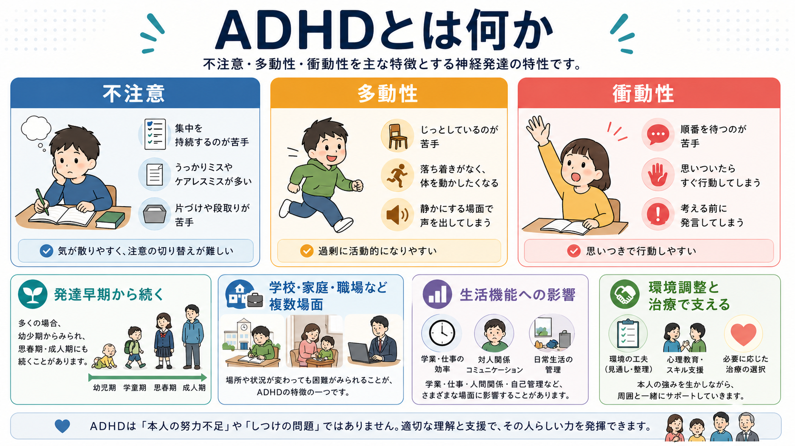
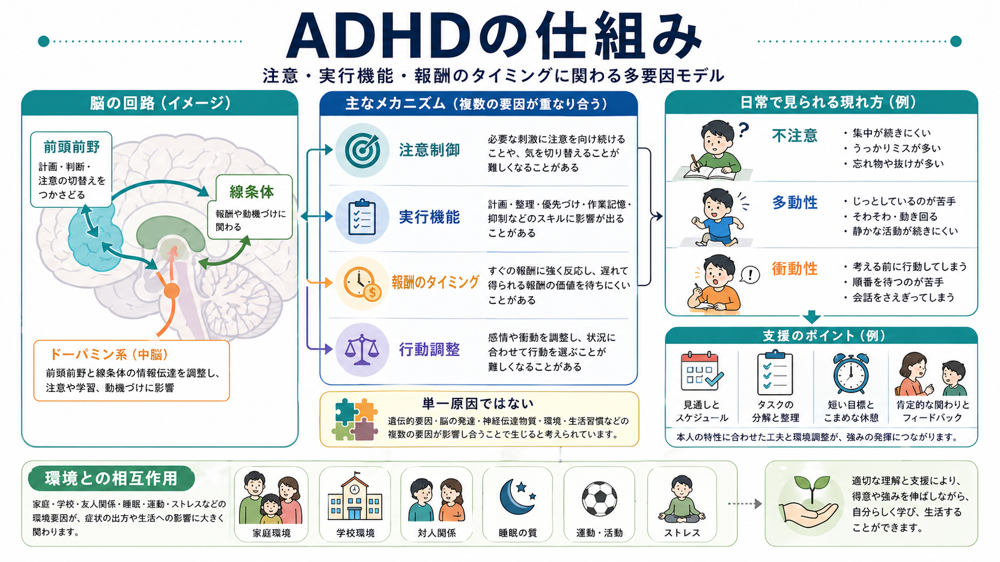

# ADHDとは何か

## 要点

- ADHD は、不注意、多動性、衝動性が発達早期から続き、家庭、学校、職場、対人関係など複数の場面で困難を生む神経発達症である[1][2]。
- 中核は「努力不足」ではなく、注意制御、[[実行機能とは何か|実行機能]]、報酬のタイミング、行動調整、環境要求の組み合わせとして理解すると見通しがよい[3][4]。
- 診断では、症状の数だけでなく、発症時期、複数場面での持続、生活機能への影響、併存症、睡眠、環境要因、物質使用などを確認する[1][5]。
- 支援は、心理教育、環境調整、行動的支援、学校・職場での合理的配慮、必要に応じた薬物療法を組み合わせる[5][6]。
- この記事は教育・研究目的の整理であり、個別の診断や治療指示ではない。

## この記事で答える問い

1. ADHD はどのような状態を指すのか。
2. 不注意・多動性・衝動性は、日常生活ではどのように現れるのか。
3. ADHD の仕組みは、脳、認知、報酬、環境の観点からどう説明できるのか。
4. 診断・支援・研究では、何を見落としやすいのか。

## まず結論

ADHD は「集中できない人」「落ち着きがない人」という性格ラベルではない。現在の診断体系では、発達期からみられる不注意、多動性、衝動性が、年齢や発達水準から見て過剰で、複数の生活場面にまたがって機能障害をもたらす状態として整理される[1][2]。

重要なのは、症状が常に同じ強さで出るわけではない点である。興味のある課題では集中できるが、単調で報酬が遠い課題では始めにくい。静かな環境では目立たないが、刺激が多い教室や職場ではミスが増える。このような「本人の特性」と「環境の要求」の相互作用を見ることが、ADHD理解の入口になる[3][4]。

## 背景

ADHD は小児期に気づかれることが多いが、成人期にも持続しうる。小児では多動性や衝動性が目立ちやすく、成人では締切管理、予定の保持、物の紛失、先延ばし、感情の切り替え、対人場面での発言制御などが前景化することがある[2][3]。

有病率の推定は、年齢、診断基準、調査方法、情報提供者によって変わる。国際的なメタ分析では、子ども・青年の ADHD 有病率は数％程度と推定されるが、地域差よりも方法差の影響が大きいことが示されている[7]。したがって、「最近急に増えた」と断定する前に、診断基準、認知度、受診行動、学校・職場の要求水準、調査方法の変化を分けて考える必要がある。

## 基本概念

### 不注意

不注意は、単に「集中力がない」ことではない。必要な情報に注意を向け続ける、重要でない刺激を抑える、作業手順を保持する、提出物や約束を管理する、細部のミスを減らすといった複数の過程に関わる。これは [[注意とは何か]]、[[ワーキングメモリとは何か]]、[[実行機能とは何か]] と接続して理解できる。

### 多動性

多動性は、子どもでは席を離れる、走り回る、静かに遊ぶのが難しい、といった形で現れやすい。成人では、身体的な多動が目立たなくなっても、内的な落ち着かなさ、休みにくさ、予定を詰め込みすぎる傾向として残ることがある[2][3]。

### 衝動性

衝動性は、考える前に発言する、順番を待ちにくい、相手の話に割り込む、目先の報酬に引き寄せられやすい、感情が急に出る、といった形をとる。[[衝動性とは何か]]で扱うように、衝動性には運動反応、意思決定、情動調整、報酬評価の側面がある。

## 仕組み

ADHD の仕組みは、単一の脳部位や単一の神経伝達物質では説明できない。研究では、前頭前野、線条体、小脳、注意ネットワーク、デフォルトモードネットワーク、報酬系、ドパミン・ノルアドレナリン系などが検討されてきたが、個人差が大きく、診断に使える単一のバイオマーカーはまだ確立していない[3][4]。

実用的には、次の4層で考えると整理しやすい。

| 層 | 見るポイント | 日常での現れ |
|---|---|---|
| 認知制御 | 注意の持続、切り替え、抑制、作業記憶 | ケアレスミス、忘れ物、段取りの難しさ |
| 報酬処理 | すぐ得られる報酬と遅れて得られる報酬の重みづけ | 先延ばし、単調な課題の始めにくさ |
| 行動調整 | 状況に合わせて発言・運動・感情を調整する力 | 割り込み、待てなさ、感情の急な表出 |
| 環境相互作用 | 刺激量、構造化、睡眠、支援、期待水準 | 場面により困りごとが大きく変わる |

特に [[ADHDは前頭線条体回路の障害として説明できるのか]] で扱う前頭前野-線条体回路は、行動選択、抑制、報酬予測、努力配分に関わる。[[ドパミンは報酬だけの物質なのか]]、[[報酬系とは何か]] と合わせると、ADHD を「やる気がない」ではなく、「報酬の近さ、課題構造、覚醒水準、注意制御が行動開始を左右しやすい状態」と捉えられる[3][4]。

## 図解

1枚目は、ADHD を不注意・多動性・衝動性の3領域と、発達早期からの持続、複数場面、生活機能、環境調整・治療の接点として整理している。2枚目は、前頭前野、線条体、注意制御、実行機能、報酬のタイミング、環境との相互作用を一枚にまとめた図である。いずれも診断基準そのものではなく、学習用の概念図として読む。

### 図解案: 3枚目

画像は2枚作成済みである。3枚目を追加する場合は、次のプロンプトが適している。

> ADHD の評価から支援への流れを示す日本語インフォグラフィック。左から「症状の確認」「複数場面」「併存症・睡眠・環境」「本人の困りごと」「心理社会的支援」「薬物療法」「学校・職場の調整」へつながる。下部に「怠けではない」「診断だけで終わらせない」を配置。教育目的で、個別治療指示ではないことが伝わる、明るく読みやすい医療教育スタイル。

## 臨床・研究との接続

臨床では、本人の主観的な困りごと、家族・学校・職場から見た困りごと、発達歴、成績や就労歴、対人関係、事故・物質使用、睡眠、気分症状、不安症状、ASD 特性、学習困難などを合わせて評価する[1][5]。ADHD と似た困難は、睡眠不足、うつ病、不安症、双極性障害、物質使用、甲状腺疾患、薬剤、トラウマ、知的発達症、学習症などでも起こりうる。

治療・支援では、子どもでは保護者支援、学校との連携、行動的介入、環境の構造化が重要である。成人では、予定管理、タスク分解、外部記憶、職場調整、睡眠・生活リズム、併存する不安・抑うつへの対応が必要になる。薬物療法は有効な選択肢の一つだが、年齢、併存症、副作用、本人の希望、生活上の目標を含めて判断される[5][6]。

研究では、ADHD は単一カテゴリーというより、多様な発達軌道と認知・神経特性が重なった異質性の高い集合として扱われる。遺伝的要因の寄与は大きいが、環境、睡眠、家族・学校・職場の要求、社会的支援と切り離して理解することはできない[3][4]。

## よくある誤解

### 「集中できる時があるなら ADHD ではない」

そうとは限らない。ADHD では、興味が強い課題、報酬が近い課題、締切が迫った課題、構造化された環境では集中しやすいことがある。一方で、単調で報酬が遠く、手順が曖昧な課題では困難が出やすい。

### 「ADHD はしつけや努力不足である」

ADHD の症状は、神経発達、認知制御、報酬処理、環境要求の相互作用として研究されている[3][4]。しつけや努力の問題として片づけると、本人の自尊感情を傷つけ、実際に役立つ環境調整や支援を遅らせる。

### 「薬を使えばすべて解決する」

薬物療法は注意や衝動性の改善に有効な場合があるが、生活上の課題は、タスク設計、睡眠、対人関係、学校・職場の調整、心理教育、併存症への対応と組み合わせて扱う必要がある[5][6]。

### 「子どもの病気で、大人にはない」

成人期にも ADHD 特性や機能障害が続く人はいる[2][3]。ただし成人では、多動性が目立たず、計画、締切、感情調整、職場でのミス、対人摩擦として現れることがある。

## 関連ノート

- [[ADHDは前頭線条体回路の障害として説明できるのか]]
- [[実行機能とは何か]]
- [[注意とは何か]]
- [[ワーキングメモリとは何か]]
- [[衝動性とは何か]]
- [[報酬系とは何か]]
- [[ドパミンは報酬だけの物質なのか]]
- [[神経発達の異常は精神疾患にどう関わるのか]]
- [[うつ病とは何か]]
- [[全般不安症とは何か]]

### MOC更新候補

- [[MOC｜精神医学]]
- [[MOC｜神経科学と精神疾患]]
- [[MOC｜認知機能]]
- [[MOC｜学習・行動・動機づけ]]

## 理解チェック

1. ADHD の診断で「複数場面」と「生活機能への影響」が重視されるのはなぜか。
2. 不注意を、注意制御、作業記憶、実行機能に分けて説明できるか。
3. ADHD を「努力不足」と説明すると、どのような臨床的・教育的問題が起こるか。
4. 報酬のタイミングや環境構造は、行動開始や先延ばしにどう関わるか。
5. ADHD と鑑別・併存を考えるべき状態を3つ挙げられるか。

## 未解決問題

- ADHD の異質性を、症状サブタイプよりも認知・神経・発達軌道に基づいてどこまで整理できるか。
- 脳画像、認知課題、日常行動ログを組み合わせた評価は、個別支援の選択にどこまで役立つか。
- 学校・職場の環境調整が、長期的な生活機能、自尊感情、二次的な不安・抑うつにどの程度影響するか。

## 参考文献

[1] American Psychiatric Association. (2022). *Diagnostic and Statistical Manual of Mental Disorders, Fifth Edition, Text Revision (DSM-5-TR)*. American Psychiatric Association Publishing. https://doi.org/10.1176/appi.books.9780890425787

[2] National Institute of Mental Health. Attention-Deficit/Hyperactivity Disorder. https://www.nimh.nih.gov/health/topics/attention-deficit-hyperactivity-disorder-adhd

[3] Faraone, S. V., Banaschewski, T., Coghill, D., et al. (2021). The World Federation of ADHD International Consensus Statement: 208 Evidence-based conclusions about the disorder. *Neuroscience & Biobehavioral Reviews*, 128, 789-818. https://doi.org/10.1016/j.neubiorev.2021.01.022

[4] Thapar, A., & Cooper, M. (2016). Attention deficit hyperactivity disorder. *The Lancet*, 387(10024), 1240-1250. https://doi.org/10.1016/S0140-6736(15)00238-X

[5] National Institute for Health and Care Excellence. (2018, updated). *Attention deficit hyperactivity disorder: diagnosis and management (NICE guideline NG87)*. https://www.nice.org.uk/guidance/ng87

[6] Wolraich, M. L., Hagan, J. F., Allan, C., et al. (2019). Clinical Practice Guideline for the Diagnosis, Evaluation, and Treatment of Attention-Deficit/Hyperactivity Disorder in Children and Adolescents. *Pediatrics*, 144(4), e20192528. https://doi.org/10.1542/peds.2019-2528

[7] Polanczyk, G., de Lima, M. S., Horta, B. L., Biederman, J., & Rohde, L. A. (2007). The worldwide prevalence of ADHD: A systematic review and metaregression analysis. *American Journal of Psychiatry*, 164(6), 942-948. https://doi.org/10.1176/ajp.2007.164.6.942

[8] Cortese, S., Adamo, N., Del Giovane, C., et al. (2018). Comparative efficacy and tolerability of medications for attention-deficit hyperactivity disorder in children, adolescents, and adults: A systematic review and network meta-analysis. *The Lancet Psychiatry*, 5(9), 727-738. https://doi.org/10.1016/S2215-0366(18)30269-4
