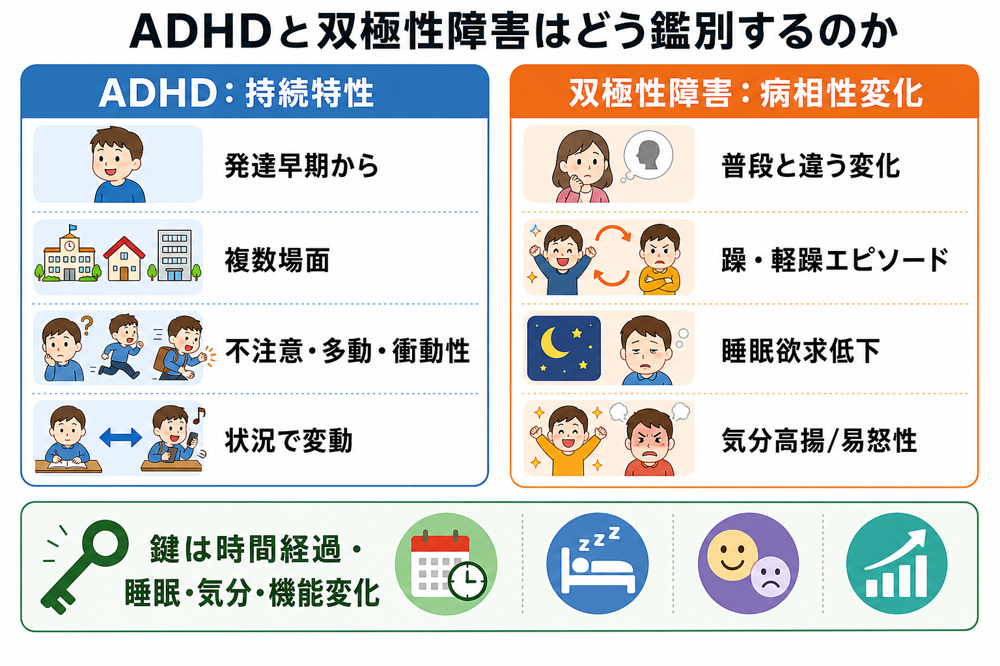
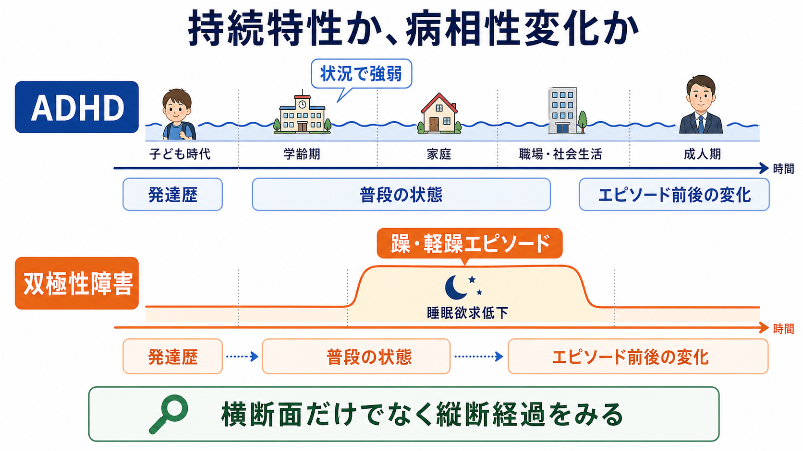
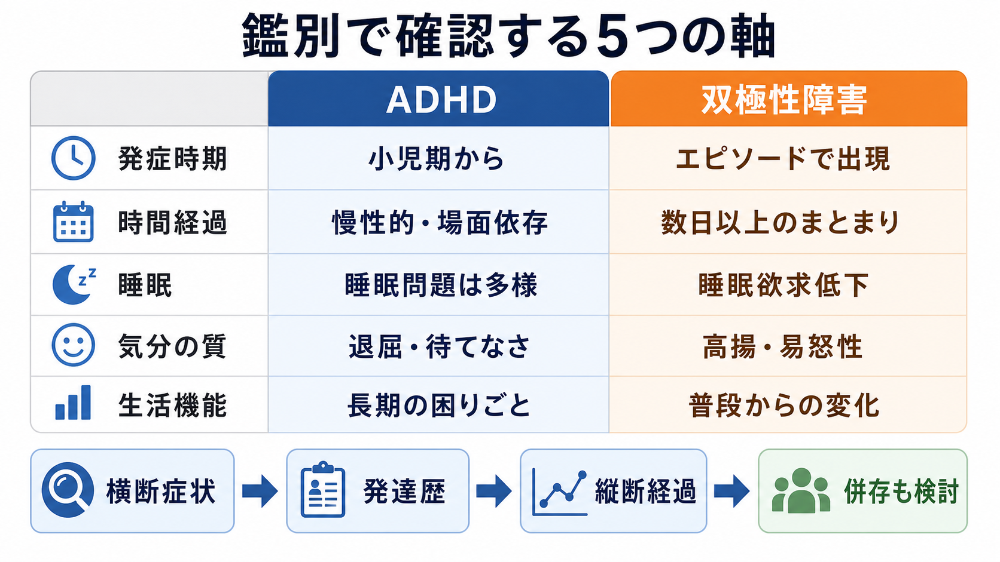

# ADHDと双極性障害はどう鑑別するのか

## 要点

- ADHD と双極性障害は、衝動性、多動、注意散漫、落ち着かなさ、感情の不安定さが重なって見えるため、横断面だけでは誤りやすい。
- 鑑別の中心は、「いつから」「どの場面で」「普段の本人からどれだけ変化したか」「睡眠欲求と気分の質がどう変わったか」を縦断的に見ることである[1][2]。
- [[ADHDとは何か]]では発達早期から続く不注意・多動性・衝動性が複数場面で機能障害を生む。一方、[[双極性障害とは何か]]では躁病・軽躁病・抑うつの病相が、普段とは違うまとまりとして出現する[1][3]。
- 併存もありうる。片方の診断名で他方を機械的に除外せず、発達歴、家族歴、病相歴、物質使用、薬剤、身体疾患を合わせて評価する[2][4]。
- このノートは教育・研究目的の整理であり、個別診断や治療指示ではない。

## この記事で答える問い

1. ADHD の衝動性・多動と、双極性障害の躁・軽躁に伴う活動性亢進は何が違うのか。
2. 「寝ていない」「よくしゃべる」「怒りっぽい」「落ち着かない」を、どの順番で確認すればよいのか。
3. ADHD と双極性障害が併存する場合、鑑別の考え方はどう変わるのか。

## まず結論

最初に見るべき軸は、症状の「強さ」ではなく「時間構造」である。ADHD では、不注意、多動性、衝動性は発達早期からみられ、学校、家庭、職場、人間関係など複数場面で形を変えながら続く[1][5]。症状は退屈、待機、報酬の遠さ、環境の雑音、課題の構造化の程度によって強弱をもつが、普段の本人から突然まったく別人のようになるというより、本人の長期的な困りごとの延長として理解される。

双極性障害では、普段の本人とは異なる気分、活動性、睡眠、思考、行動の変化が、躁病または軽躁病エピソードとしてまとまって出現する。NICE は、躁病を重い機能障害または精神病症状を伴う7日以上の状態、軽躁病を4日以上続く気分・活動性の変化として説明している[3]。したがって、「衝動的かどうか」だけでなく、「その衝動性がエピソードとして始まり、終わり、睡眠欲求低下や気分高揚・易怒性・誇大的思考と一緒に動くか」を見る。

## 背景

ADHD と双極性障害の鑑別が難しいのは、どちらも「速さ」「落ち着かなさ」「待てなさ」「対人トラブル」「課題の中断」を生みうるからである。成人 ADHD では、子どものような目立つ走り回りよりも、内的なそわそわ感、過剰な発話、先延ばし、退屈への弱さ、感情調整の難しさとして表れやすい[4]。双極性障害の躁・軽躁でも、発話量の増加、注意散漫、活動性亢進、危険な行動がみられる。

しかし、見た目が似ていても、臨床的な意味は異なる。ADHD の注意散漫は「考えがあちこちに移る」「刺激に引かれる」「課題を維持しにくい」と説明されやすい。躁・軽躁では、思考の加速、目標指向性活動の増加、自信や誇大性、睡眠欲求低下と結びついて、普段と違う活動の増え方として現れやすい[4]。

## 基本概念

### ADHD：持続特性としての衝動性・多動

ADHD は、発達水準に比して過剰な不注意、多動性、衝動性が、複数の場面で機能障害をもたらす神経発達症である[1][5]。診断は尺度や脳画像だけで行うものではなく、本人・家族・学校や職場などから得られる情報をもとに、発症時期、複数場面性、機能障害、他疾患や物質・薬剤の影響を確認する[5]。

ここでいう「持続特性」は、毎日同じ強さで症状が出るという意味ではない。ADHD の困りごとは、環境によって強くも弱くもなる。構造化された場面では目立ちにくく、曖昧で報酬が遠い課題、長い待ち時間、対人刺激の多い場面では目立ちやすい。重要なのは、本人の発達歴から見て長期に続くパターンがあるかである。

### 双極性障害：病相性変化としての活動性亢進

双極性障害では、躁病、軽躁病、抑うつのエピソードが、普段の状態からの変化として現れる。評価では、気分の高揚または易怒性だけでなく、活動性、発話、睡眠欲求、思考速度、性的・金銭的・職業的リスク行動、精神病症状、機能障害を合わせてみる[2][3]。

「寝ていない」は特に重要である。ADHD でも睡眠リズムの乱れや入眠困難はありうるが、睡眠不足がつらさや疲労を伴うことが多い。躁・軽躁では、睡眠時間が短いにもかかわらず疲労感が目立たず、活動性や自信が上がることがある[4]。この「睡眠不足」ではなく「睡眠欲求の低下」を確認する点が鑑別の鍵になる。

## 仕組み

### 横断面ではなく縦断経過をみる

同じ「多弁」でも、ADHD では以前から話を遮りやすい、待てない、興味が移ると話題も移るという形で続いていることが多い。双極性障害では、ある時期から発話量が増え、話が止まらず、睡眠欲求が下がり、企画や買い物や対人接触が急に増えるなど、普段からの変化としてまとまりやすい[3][4]。

同じ「衝動性」でも、ADHD では報酬の近さ、退屈への耐えにくさ、待機の苦手さ、実行機能の弱さと結びつきやすい。躁・軽躁では、誇大的な自己評価、リスクの過小評価、目標指向性活動の亢進、性的・金銭的・職業的な判断の変化と結びつくことがある[2][4]。

### 発達歴と病相歴を分けて聞く

鑑別面接では、[[発達歴は成人精神科でもなぜ重要なのか]]と病相歴を分けて再構成する。発達歴では、小児期からの不注意、多動、衝動性、学業・家庭・友人関係での困りごとを確認する。病相歴では、普段の本人から離れた時期があったか、その期間がどれくらい続いたか、睡眠欲求や活動性がどう変わったか、周囲が変化に気づいたかを確認する。

NICE の双極性障害ガイドラインも、疑い例では気分、過活動、脱抑制、エピソード間の症状、誘因、再発パターン、家族歴、発達障害や認知機能、併存疾患、薬剤や身体健康を含めた包括的評価を求めている[3]。これは [[鑑別診断とは何か]] の実践例でもある。

## 図解

| 観点 | ADHDで見やすい形 | 双極性障害で見やすい形 |
|---|---|---|
| 発症時期 | 小児期からの不注意・多動・衝動性 | 思春期後半から成人早期に病相として明らかになることが多い |
| 時間経過 | 慢性的で、場面により強弱がある | 数日以上のまとまりとして普段から変化する |
| 睡眠 | 入眠困難、睡眠リズムの乱れ、睡眠不足による疲労 | 睡眠欲求低下、短眠でも活動性が上がる |
| 気分の質 | 退屈、焦り、待てなさ、感情調整の難しさ | 高揚、易怒性、誇大性、思考加速 |
| 機能変化 | 長期にわたる課題管理・対人・生活の困りごと | エピソード中に仕事、学業、金銭、対人リスクが普段から変わる |

## 臨床・研究との接続

ADHD と双極性障害は、単に「似ている」だけでなく、実際に併存することがある。成人 ADHD と双極性障害の併存を扱ったレビューでは、成人双極性障害患者のうち ADHD 併存が10-20%程度、メタ解析では成人双極性障害における ADHD 併存率が約17%と報告されている[4][6]。したがって、診断名を一つに絞ることよりも、現在のリスク、病相の有無、長期的な発達特性、治療反応を分けて考える必要がある。

治療を考える場面では、双極性障害が不安定な時期の衝動性・注意散漫を ADHD と見なすと、病相への対応が遅れるおそれがある。一方、双極性障害の診断だけで長年の ADHD 特性を見落とすと、学業、職業、生活管理、対人関係の支援が不足する。併存例では、気分安定化を優先してから残存する ADHD 症状を評価する、という考え方がしばしば示されるが、これは個別の治療指示ではなく、専門的評価の中で検討される臨床原則である[4][7]。

研究上も、ADHD と双極性障害はカテゴリー名だけで切り分けるより、時間スケールごとの症状変動として見ると整理しやすい。数分から数時間の反応性、数日から数週の病相性変化、発達早期から続く持続特性を分けることで、[[精神科診断は何のためにあるのか]] という問いにも接続できる。

## よくある誤解

### 「衝動的ならADHDである」

衝動性は ADHD だけの所見ではない。躁・軽躁、物質使用、パーソナリティ機能の問題、不安、トラウマ、睡眠不足、薬剤性精神症状でも衝動性は強くなる。ADHD らしさは、発達早期からの持続、複数場面性、課題管理や待機の苦手さとの結びつきにある[1][5]。

### 「気分が上下するなら双極性障害である」

気分変動は多くの状態で起こる。双極性障害で重視するのは、気分だけでなく、活動性、睡眠欲求、発話、思考、リスク行動、機能変化がまとまってエピソードを作ることである[2][3]。

### 「ADHDと双極性障害はどちらか一方である」

併存はありうる。むしろ、併存例では症状が重く見えやすく、物質使用、不安、生活機能低下、自殺リスクなどの評価が重要になる[4][6]。ただし、スクリーニング尺度だけで併存診断を確定せず、縦断経過と臨床面接で確認する必要がある。

### 「睡眠時間だけを聞けばよい」

睡眠時間だけでは足りない。確認すべきは、眠れないのか、眠らなくても平気なのか、短眠が活動性亢進や気分高揚・易怒性と一緒に起きているのかである。ADHD の睡眠問題と、躁・軽躁の睡眠欲求低下は意味が違う[4]。

## 関連ノート

- [[ADHDとは何か]]
- [[双極性障害とは何か]]
- [[双極I型障害とは何か]]
- [[双極II型障害とは何か]]
- [[鑑別診断とは何か]]
- [[発達歴は成人精神科でもなぜ重要なのか]]
- [[精神科診断は何のためにあるのか]]
- [[パーソナリティ障害と双極性障害はどう鑑別するのか]]

### MOC更新候補

- [[MOC｜精神医学]]
- [[MOC｜総論・診断・面接]]
- [[MOC｜症候学]]

## 理解チェック

1. ADHD の衝動性を「持続特性」として評価するとき、発症時期と場面の広がりをどう確認するか。
2. 双極性障害の軽躁を疑うとき、睡眠時間ではなく睡眠欲求を聞く理由は何か。
3. 「落ち着かない」「よくしゃべる」という所見を、ADHD と躁・軽躁でどう言い換えられるか。
4. ADHD と双極性障害の併存を考えるとき、スクリーニング尺度だけで診断を決めてはいけない理由は何か。

## 未解決問題

- ADHD の感情調整困難と、双極性障害の病相性気分変化を、日常生活データや睡眠データでどこまで精密に区別できるか。
- ADHD-BD 併存例で、どの症状が機能予後や自殺リスクを最も強く予測するか。
- 成人期に初めて評価される ADHD で、小児期情報が乏しい場合に、どの補助情報が鑑別精度を高めるか。

## 参考文献

[1] American Psychiatric Association. (2022). *Diagnostic and Statistical Manual of Mental Disorders, Fifth Edition, Text Revision (DSM-5-TR)*. American Psychiatric Association Publishing. https://doi.org/10.1176/appi.books.9780890425787

[2] Yatham, L. N., Kennedy, S. H., Parikh, S. V., et al. (2018). Canadian Network for Mood and Anxiety Treatments and International Society for Bipolar Disorders 2018 guidelines for the management of patients with bipolar disorder. *Bipolar Disorders*, 20(2), 97-170. https://doi.org/10.1111/bdi.12609

[3] National Institute for Health and Care Excellence. (2025). *Bipolar disorder: assessment and management* (NICE Clinical Guideline No. 185). https://www.ncbi.nlm.nih.gov/books/NBK547001/

[4] Salvi, V., Ribuoli, E., Servasi, M., Orsolini, L., & Volpe, U. (2021). ADHD and Bipolar Disorder in Adulthood: Clinical and Treatment Implications. *Medicina*, 57(5), 466. https://doi.org/10.3390/medicina57050466

[5] National Institute for Health and Care Excellence. (2018, updated). *Attention deficit hyperactivity disorder: diagnosis and management* (NICE guideline NG87). https://www.nice.org.uk/guidance/ng87

[6] Schiweck, C., Arteaga-Henriquez, G., Aichholzer, M., et al. (2021). Comorbidity of ADHD and adult bipolar disorder: A systematic review and meta-analysis. *Neuroscience & Biobehavioral Reviews*, 124, 100-123. https://doi.org/10.1016/j.neubiorev.2021.01.017

[7] Faraone, S. V., Banaschewski, T., Coghill, D., et al. (2021). The World Federation of ADHD International Consensus Statement: 208 Evidence-based conclusions about the disorder. *Neuroscience & Biobehavioral Reviews*, 128, 789-818. https://doi.org/10.1016/j.neubiorev.2021.01.022
