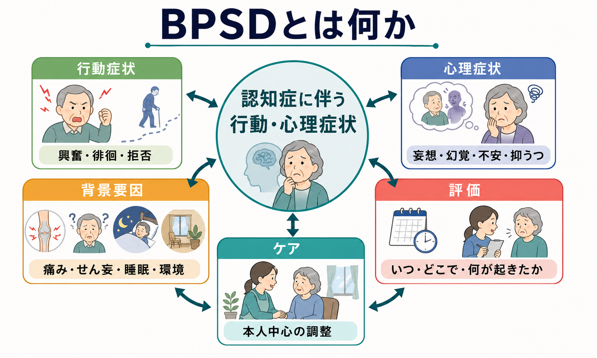
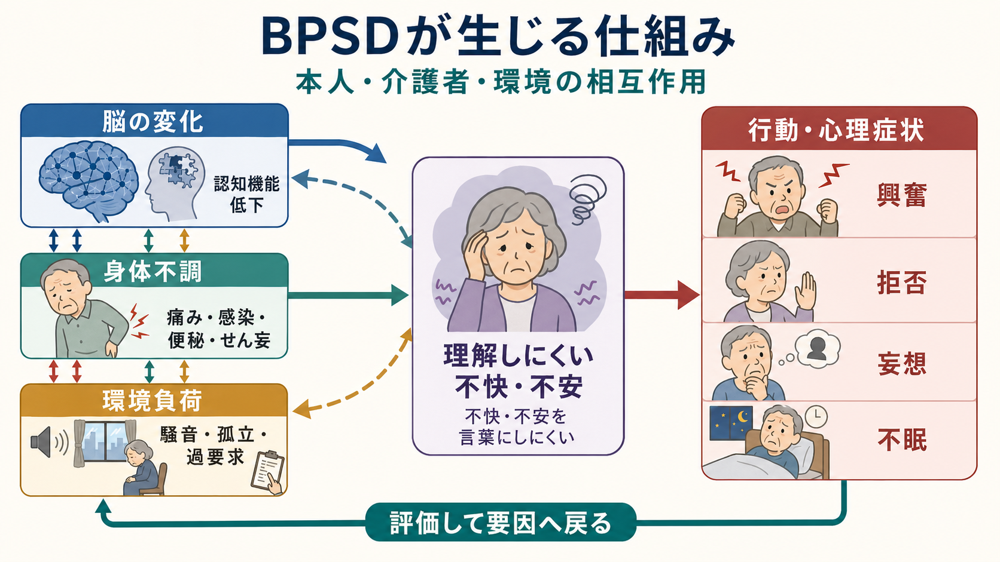
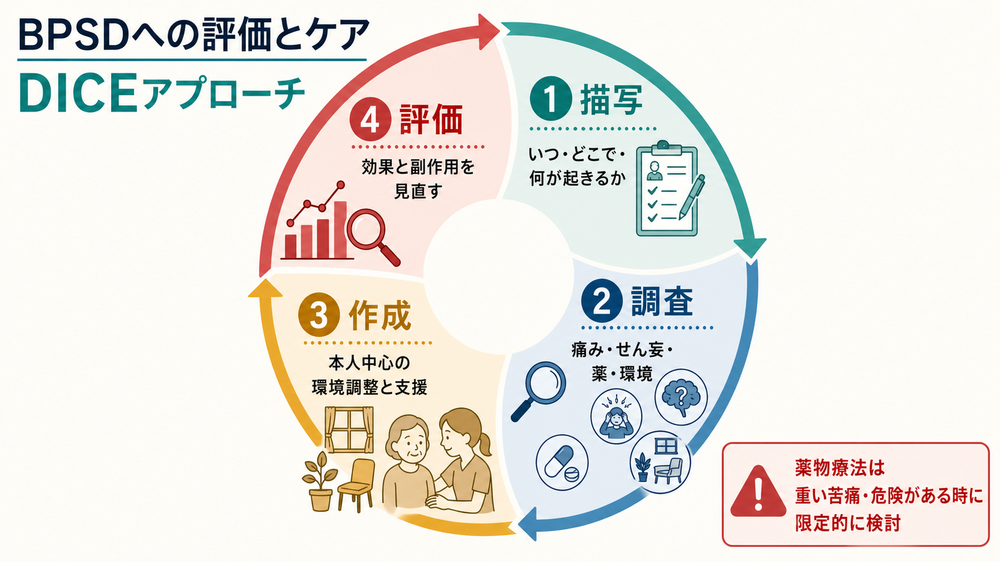

# BPSDとは何か

## 要点

- BPSD（behavioral and psychological symptoms of dementia）は、[[認知症とは何か|認知症]]に伴って現れる行動症状と心理症状の総称である。認知機能低下とは別枠の「困った行動」ではなく、脳の変化、身体不調、環境、本人の不安、周囲の関わりが重なって現れる症状群として理解する必要がある[1]。
- 典型例には、興奮、攻撃性、徘徊、拒否、睡眠・食欲の変化、脱抑制、妄想、幻覚、不安、抑うつ、アパシーなどが含まれる[1][4]。
- 評価では、症状名を付けるより先に「いつ、どこで、誰との関わりで、何が起き、本人は何に困っているか」を記述する。痛み、感染、便秘、脱水、睡眠障害、薬剤、[[抗コリン性せん妄とは何か|せん妄]]、環境負荷を確認する[2][3]。
- 初期対応の中心は、心理社会的・環境的介入、本人中心の活動、介護者支援である。抗精神病薬は、本人または他者への危険、あるいは強い苦痛を伴う幻覚・妄想・興奮がある場合に、利益と害を検討して限定的に扱う[2][5][6]。

## この記事で答える問い

1. BPSDとは何を指す言葉か。
2. なぜ認知症で行動・心理症状が起きるのか。
3. 評価では何を観察し、何を除外・確認すべきか。
4. ケアと薬物療法はどのように位置づけるべきか。

## まず結論

BPSDは、認知症の人が「わざと問題行動をしている」という意味ではない。むしろ、認知機能低下によって不快、不安、痛み、混乱、環境の過負荷を言葉にしにくくなったとき、それが行動や感情の変化として外に出てくる現象である。

したがって、BPSDへの第一歩は「止める」ことではなく、「読解する」ことである。たとえば夜間に歩き回る行動は、睡眠覚醒リズムの乱れ、痛み、トイレ、見当識障害、不安、日中活動量の低下、環境の暗さなど、複数の要因から生じうる。拒否も、単なる反抗ではなく、手順が速すぎる、説明が理解しにくい、羞恥心がある、痛みがある、介助者との関係が不安定である、という信号かもしれない。

この見方を取ると、BPSDは「症状を消す対象」だけではなく、本人の苦痛、生活機能、ケア環境を見直す入口になる。

## 背景

BPSDという語は、認知症でみられる非認知症状をまとめて扱うための臨床・研究上の概念である。レビューでは、BPSDは認知症のサブタイプを問わず重要な構成要素であり、機能低下、介護者負担、施設入所、医療費、薬剤使用と関連すると整理されている[1]。

この概念が重要なのは、認知症の困難が記憶や遂行機能の低下だけでは説明できないからである。[[アルツハイマー型認知症とは何か|アルツハイマー型認知症]]では不安、抑うつ、アパシー、妄想、睡眠障害が問題になることがある。[[レビー小体型認知症とは何か|レビー小体型認知症]]や[[パーキンソン病認知症とは何か|パーキンソン病認知症]]では幻視、認知変動、レム睡眠行動障害、抗精神病薬への過敏性が臨床上の注意点になる。[[前頭側頭型認知症とは何か|前頭側頭型認知症]]では脱抑制、常同行動、共感性の低下、食行動の変化が前景に立つことがある。

つまりBPSDは、認知症全般に共通する枠組みでありながら、実際には認知症の原因疾患、病期、身体合併症、生活史、介護環境によって異なる形を取る。

## 基本概念

### 行動症状と心理症状

BPSDは大きく、外から観察しやすい行動症状と、本人の内的体験に近い心理症状に分けて理解できる。

| 領域 | 例 | 評価の焦点 |
|---|---|---|
| 行動症状 | 興奮、攻撃性、徘徊、拒否、叫声、脱抑制、睡眠・食行動の変化 | 出現場面、誘因、頻度、危険性、介護場面との関係 |
| 心理症状 | 妄想、幻覚、不安、抑うつ、アパシー、易刺激性 | 本人の苦痛、現実検討、気分、恐怖、喪失感、孤立 |
| 身体・環境要因 | 痛み、感染、便秘、脱水、薬剤、睡眠、騒音、過要求 | 可逆的要因、ケア手順、生活リズム、刺激量 |

この区分は便利だが、実際の場面では混ざり合う。たとえば「入浴拒否」は行動症状に見えるが、背景には羞恥、不安、寒さ、痛み、過去の体験、介助手順の速さがあるかもしれない。「もの盗られ妄想」は心理症状に分類されるが、記憶障害、物の置き場所、家族との関係、孤立感が関わることがある。

### 測定尺度は「会話の代替」ではない

研究と臨床では、Neuropsychiatric Inventory（NPI）が広く使われる。NPIは妄想、幻覚、興奮、抑うつ、不安、アパシー、易刺激性、脱抑制、異常運動、夜間行動、食欲・食行動などを評価する尺度として開発された[4]。興奮・攻撃性に焦点を当てる場合には、Cohen-Mansfield Agitation Inventory（CMAI）系の尺度も使われる[8]。

ただし尺度は、症状の頻度や重症度を共有する道具であって、本人の意味世界をそのまま説明するものではない。BPSDの評価では、尺度、本人・家族・介護者からの聞き取り、身体診察、薬剤確認、生活場面の観察を組み合わせる。

## 仕組み

BPSDは単一の原因で起きるというより、複数の層が重なって生じる。

1つ目は、脳の変化である。記憶、注意、見当識、言語理解、遂行機能、情動制御、知覚処理が損なわれると、状況を理解し、予測し、言葉で助けを求めることが難しくなる。これは[[神経認知障害群とは何か|神経認知障害群]]の中核的特徴と接続している。

2つ目は、身体の変化である。痛み、感染、便秘、脱水、低酸素、睡眠障害、視聴覚障害、薬剤性の眠気やアカシジアは、興奮や不穏の形で見えることがある。急な変化では、認知症の進行だけでなく、せん妄や身体疾患を考える必要がある[2][3]。

3つ目は、環境と関係性である。騒音、照明、見慣れない場所、手順の多い介助、待ち時間、孤立、過小刺激、過剰刺激は、本人の理解能力を超える負荷になる。介護者の疲弊や焦りも、悪意ではなく相互作用の一部として症状を強めることがある。

このため、BPSDを「脳だけ」「性格だけ」「介護だけ」のどれかに還元すると見誤りやすい。脳の脆弱性があり、身体の不快があり、環境の要求があり、それを本人がうまく説明できないとき、行動・心理症状として表面化する。

## 図解

3枚の図は、BPSDを次の順番で読むための補助である。

| 図 | 見るポイント |
|---|---|
| 1枚目 | BPSDは行動症状、心理症状、背景要因、評価、ケアを含む全体概念である |
| 2枚目 | 脳の変化、身体不調、環境負荷が相互作用し、本人の不快・不安が行動として現れる |
| 3枚目 | DICEのように、描写、調査、作成、評価を循環させる |

## 臨床・研究との接続

### DICEアプローチ

BPSDの評価とケアを実践的に整理する枠組みとして、DICEアプローチがある。DICEは、Describe（描写）、Investigate（調査）、Create（対応計画の作成）、Evaluate（評価）の循環である[3]。

| 段階 | 具体的に見ること |
|---|---|
| 描写 | いつ、どこで、誰と、何が起きたか。どの程度危険か。本人は何に困っていそうか。 |
| 調査 | 痛み、感染、便秘、脱水、睡眠、薬剤、せん妄、感覚障害、環境、介護手順を確認する。 |
| 作成 | 本人中心の活動、環境調整、コミュニケーションの変更、介護者支援を組み合わせる。 |
| 評価 | 効果、副作用、介護負担、本人の苦痛、生活機能を見直し、必要なら計画を修正する。 |

この枠組みの利点は、「症状があるから薬」と短絡しない点にある。NICEの認知症ガイドラインも、苦痛への非薬物・薬物治療の前に構造化評価を行い、痛み、せん妄、不適切なケアなどの臨床・環境要因を確認すること、初期および継続的管理として心理社会的・環境的介入を提供することを推奨している[2]。

### 非薬物療法の位置づけ

非薬物療法とは、「薬を使わない我慢」ではない。本人の生活史、好み、残存能力、睡眠覚醒リズム、感覚機能、環境刺激、介護者の関わり方を調整する積極的な介入である。JAMAのレビューでは、行動症状の体系的スクリーニング、原因同定、個別化された対応計画、介護者教育が重視されている[7]。

例として、次のような方向がある。

| 困りごと | まず考える要因 | ケアの方向 |
|---|---|---|
| 夜間の不眠・徘徊 | 日中活動量、昼寝、痛み、排尿、照明、見当識 | 日中活動、睡眠衛生、トイレ誘導、安心できる目印 |
| 入浴・更衣の拒否 | 寒さ、羞恥、痛み、手順の速さ、説明不足 | 手順を短くする、選択肢を出す、同性介助、温度調整 |
| 興奮・怒り | 過要求、騒音、待たされること、痛み、空腹 | 刺激を減らす、短い言葉、休憩、身体要因の確認 |
| もの盗られ妄想 | 記憶障害、不安、物の置き場所、孤立 | 反論より安心、定位置、探す手順の共有、関係性の安定 |

### 薬物療法の位置づけ

抗精神病薬は、BPSD全体への一般的な第一選択ではない。APAのガイドラインは、抗精神病薬を用いる場合でも、症状が重度・危険・著しい苦痛を伴うか、非薬物的対応を含む他の選択肢との比較で利益が上回るかを検討する枠組みを示している[5]。Cochraneレビューも、抗精神病薬の利益は限定的で、眠気、錐体外路症状、重篤な有害事象、死亡などの害との比較が必要だと整理している[6]。

特に[[レビー小体型認知症とは何か|レビー小体型認知症]]や[[パーキンソン病認知症とは何か|パーキンソン病認知症]]では、抗精神病薬で運動症状の悪化や重い過敏反応が起こりうるため注意が必要である[2]。この記事は教育・研究目的の整理であり、個別の薬剤選択や中止を指示するものではない。

## よくある誤解

### 誤解1: BPSDは「問題行動」の言い換えである

BPSDを問題行動とだけ呼ぶと、観察者側の困りごとだけが強調される。実際には、本人の苦痛、混乱、恐怖、身体不調、環境との不一致が含まれる。本人にとっては「理由のない行動」ではなく、何らかの意味を持つ反応であることが多い。

### 誤解2: 認知症が進めばBPSDは仕方がない

認知症そのものを完全に戻せない場合でも、痛み、便秘、感染、脱水、睡眠、薬剤、騒音、過要求、孤立などは修正できることがある。BPSDは「進行だから何もできない」と見るより、可逆的要因を探す姿勢が重要である。

### 誤解3: 介護者の対応が悪いから起きる

環境や関わり方は重要だが、BPSDを介護者の責任に還元するのは不適切である。介護者の疲弊、情報不足、孤立、夜間対応の負担は、支援の対象である。本人中心ケアは、本人だけでなく介護者を支えることも含む。

### 誤解4: 薬で早く鎮めるのが最も安全である

急迫した危険がある場面では医学的対応が必要になることがある。しかし、抗精神病薬などは有害事象を伴いうるため、症状の意味を評価せずに長期使用することは安全策とは限らない[5][6]。薬物療法を使う場合も、最小限、短期間、再評価、非薬物的介入の併用が基本になる[2]。

## 関連ノート

- [[認知症とは何か]]
- [[神経認知障害群とは何か]]
- [[アルツハイマー型認知症とは何か]]
- [[レビー小体型認知症とは何か]]
- [[パーキンソン病認知症とは何か]]
- [[前頭側頭型認知症とは何か]]
- [[血管性認知症とは何か]]
- [[うつ病とは何か]]
- [[不眠障害とは何か]]
- [[薬剤性アカシジアとは何か]]

## MOC更新候補

- `content/00_MOC/` 配下の精神医学、認知症、老年精神医学、神経認知障害に関するMOCに追加候補。
- 並列ジョブとの衝突を避けるため、本記事ではMOC本体は更新していない。

## 理解チェック

1. BPSDを「本人が困らせている行動」と見ることの問題点は何か。
2. BPSDの評価で、症状名を付ける前に記述すべき情報は何か。
3. 痛み、せん妄、薬剤、睡眠、環境は、なぜBPSD評価で重要なのか。
4. DICEアプローチの4段階を説明できるか。
5. 抗精神病薬を検討する場面と、慎重にすべき理由を説明できるか。

## 未解決問題

- BPSDの個別化ケアを、在宅、施設、急性期病院でどのように標準化しつつ柔軟に運用するか。
- 行動症状の背景にある痛み、不安、孤独、感覚過敏を、本人の言語報告が乏しい状況でどう精度よく評価するか。
- 介護者支援、環境調整、薬物療法を組み合わせたとき、どのアウトカムを最も重視すべきか。
- デジタル記録、センサー、ウェアラブルをBPSD評価に使う場合、本人の尊厳とプライバシーをどう守るか。

## 参考文献

[1] Cerejeira, J., Lagarto, L., & Mukaetova-Ladinska, E. B. (2012). Behavioral and psychological symptoms of dementia. *Frontiers in Neurology, 3*, 73. https://doi.org/10.3389/fneur.2012.00073

[2] National Institute for Health and Care Excellence. (2018). *Dementia: assessment, management and support for people living with dementia and their carers* (NICE guideline NG97). https://www.nice.org.uk/guidance/ng97/chapter/recommendations

[3] Kales, H. C., Gitlin, L. N., & Lyketsos, C. G. (2015). Assessment and management of behavioral and psychological symptoms of dementia. *BMJ, 350*, h369. https://doi.org/10.1136/bmj.h369

[4] Cummings, J. L. (1997). The Neuropsychiatric Inventory: assessing psychopathology in dementia patients. *Neurology, 48*(5 Suppl 6), S10-S16. https://doi.org/10.1212/WNL.48.5_Suppl_6.10S

[5] Reus, V. I., Fochtmann, L. J., Eyler, A. E., et al. (2016). The American Psychiatric Association Practice Guideline on the Use of Antipsychotics to Treat Agitation or Psychosis in Patients With Dementia. *American Journal of Psychiatry, 173*(5), 543-546. https://doi.org/10.1176/appi.ajp.2015.173501

[6] Mühlbauer, V., Möhler, R., Dichter, M. N., & Zuidema, S. U. (2021). Antipsychotics for agitation and psychosis in people with Alzheimer's disease and vascular dementia. *Cochrane Database of Systematic Reviews, 2021*(12), CD013304. https://doi.org/10.1002/14651858.CD013304.pub2

[7] Gitlin, L. N., Kales, H. C., & Lyketsos, C. G. (2012). Nonpharmacologic management of behavioral symptoms in dementia. *JAMA, 308*(19), 2020-2029. https://doi.org/10.1001/jama.2012.36918

[8] Griffiths, A. W., Albertyn, C. P., Burnley, N. L., et al. (2020). Validation of the Cohen-Mansfield Agitation Inventory Observational (CMAI-O) tool. *International Psychogeriatrics, 32*(1), 75-85. https://doi.org/10.1017/S1041610219000279
