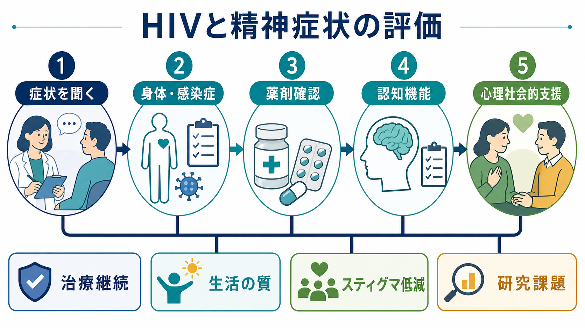
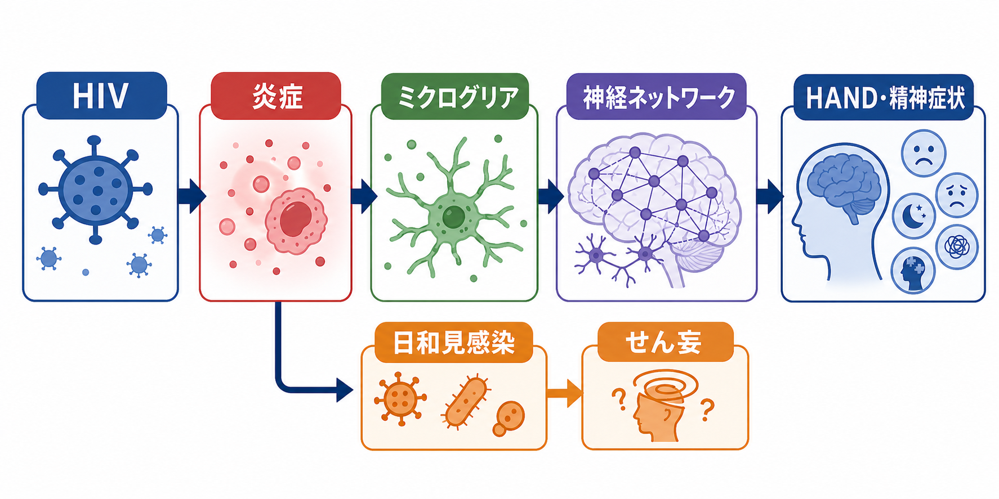
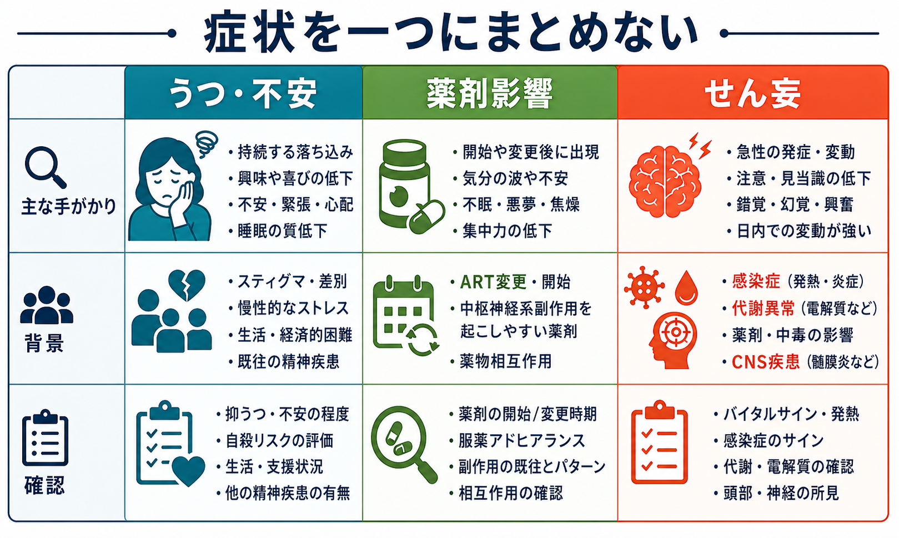

# HIV関連精神症状とは何か

## 要点

- HIV関連精神症状は、HIV感染そのもの、日和見感染、抗HIV薬、スティグマ、慢性疾患としての生活負荷、既存の精神疾患が重なって現れる。
- 代表的には、[[うつ病とは何か|うつ]]、不安、不眠、物質使用、自殺念慮、せん妄、精神病様症状、HIV関連神経認知障害（HIV-associated neurocognitive disorder: HAND）が問題になる。
- 精神症状を「HIVのせい」と一括りにせず、急性の身体疾患、薬剤変更、認知機能、心理社会的ストレスを分けて評価することが重要である。
- この記事は教育・研究目的の整理であり、個別の診断や治療指示ではない。

## この記事で答える問い

- HIV感染と精神症状は、どのような経路で結びつくのか。
- スティグマや差別は、なぜ抑うつ・不安・治療継続に影響するのか。
- 抗HIV薬や日和見感染は、精神症状の見え方をどう変えるのか。
- HANDは、通常のうつ病や認知症、せん妄とどう区別して考えるべきか。

## まず結論

HIV関連精神症状とは、HIVとともに生きる人に生じる精神・認知・行動上の問題を、感染症、神経免疫、薬剤、生活環境、スティグマの相互作用として理解する枠組みである。NIH/NIMHは、HIVとともに生きる人では気分障害、不安障害、認知障害のリスクが高く、HIV関連ストレス、差別、脳・神経系への影響、薬剤副作用が関与しうると整理している[1][2]。

## 背景

抗レトロウイルス療法（ART）の発展により、HIVは長期管理可能な慢性疾患として扱われる場面が増えた。一方で、感染告知、治療継続、対人関係、就労、性的健康、社会的偏見は、長期にわたり心理的負荷となる。HIV.govも、HIVという重大な健康問題そのものがストレス源になり、うつや不安の背景になりうると説明している[3]。

ここで重要なのは、精神症状が「心理的反応」だけではない点である。HIVや関連感染症は脳・神経系に影響しうる。さらに、抗HIV薬の一部は不眠、抑うつ、悪夢、集中困難などの中枢神経系副作用と関連することがある[7]。したがって、評価では心理面と身体面を同時に扱う必要がある。

## 基本概念

### HIV関連精神症状

HIV関連精神症状は、単一の診断名ではない。次のような症候群や問題を含む総称として使うと理解しやすい。

| 領域 | よく問題になる症状 | 見落としやすい背景 |
|---|---|---|
| 気分・不安 | 抑うつ、不安、焦燥、希死念慮、不眠 | 告知後のストレス、スティグマ、社会的孤立、既存の精神疾患 |
| 認知 | 注意低下、処理速度低下、遂行機能低下、物忘れ | HAND、うつ病性認知低下、睡眠障害、物質使用 |
| 急性意識変容 | せん妄、見当識障害、幻覚、興奮 | 日和見感染、代謝異常、薬剤、中枢神経疾患 |
| 行動・生活 | 服薬中断、物質使用、対人回避 | 抑うつ、不安、内在化スティグマ、支援不足 |

### HAND

HANDは、HIVと関連する神経認知障害の研究・臨床概念である。Antinoriらの研究診断枠組みでは、無症候性神経認知障害、軽度神経認知障害、HIV関連認知症という重症度の違いが整理された[5]。現在のART時代でも、血中ウイルス量が抑制されていても認知症状が残ることがあり、炎症、ミクログリア活性化、神経ネットワーク変化などが議論されている[6]。

HANDは、単に「物忘れ」ではなく、注意、処理速度、遂行機能、運動速度、日常生活機能の変化として見えることがある。[[せん妄と認知症はどう違うのか|せん妄]]のような急性意識変容、[[うつ病とは何か|うつ病]]による集中困難、睡眠障害、物質使用とは分けて考える必要がある。

## 仕組み

### 1. 感染症・免疫低下・中枢神経系の問題

HIVは免疫系の疾患であると同時に、脳・神経系との関係を持つ。慢性炎症、免疫活性化、ミクログリアの変化、神経ネットワークの脆弱化は、認知機能低下、疲労、アパシー、抑うつ様症状の背景として研究されている[6]。

さらに、免疫低下が進んだ状況では日和見感染が中枢神経系に及ぶことがある。たとえばHIVに伴うトキソプラズマ脳炎では、頭痛、局所神経症状、発熱、けいれん、意識障害などが問題になりうる[8]。急に混乱する、眠気が強い、発熱や神経症状を伴う場合は、純粋な精神疾患として扱う前に身体疾患を評価する必要がある。

### 2. スティグマ・差別・内在化スティグマ

HIVスティグマは、HIVとともに生きる人への否定的な態度や信念であり、差別、孤立、開示への恐怖、医療アクセスの回避につながる。HIV.govは、HIV関連のストレスや社会的負荷がメンタルヘルスに影響しうると説明している[3]。

メタ解析では、HIV関連スティグマは不安、抑うつ、自殺念慮と関連し、社会的支援は保護的に働くことが示されている[4]。この関係は因果を単純に断定できないが、臨床的には「症状を本人の弱さに帰す」のではなく、孤立、差別経験、開示の困難、経済的負荷、少数者ストレスを含めて評価する必要がある。

### 3. 抗HIV薬と薬物相互作用

ARTはHIV治療の中核であり、精神症状があるからといって自己判断で中断すべきものではない。一方で、薬剤開始・変更後に不眠、悪夢、気分変動、抑うつ、集中困難、めまいなどが出ることがある。NIHの成人・青年HIV治療ガイドラインは、エファビレンツ、リルピビリン、一部のインテグラーゼ阻害薬などで、既存の精神疾患が悪化する可能性や不眠・抑うつ・自殺関連症状への注意を挙げている[7]。

薬剤影響を考えるときは、症状の出現時期、ART変更、併用薬、肝腎機能、物質使用、睡眠リズムを確認する。ここでも「薬剤が原因」と早合点せず、感染症やうつ病、[[アルコール使用障害とは何か|アルコール使用]]、他の身体疾患を並行して見る。

### 4. 既存の精神疾患と生活上の負荷

HIVは既存の気分障害、不安障害、PTSD、物質使用障害を悪化させることがある。逆に、抑うつや不安が強いと服薬アドヒアランス、通院、検査、自己管理が難しくなる。精神症状の評価は、生活の質だけでなく、治療継続やHIVケアへの関与とも結びつく[1][2]。

## 図解

HIV関連精神症状を見るときは、少なくとも次の3つを分けると整理しやすい。

| 見立て | 時間経過 | 典型的な手がかり | まず確認したいこと |
|---|---|---|---|
| うつ・不安 | 週から月単位で持続 | 興味低下、不安、罪責感、不眠、孤立 | 自殺リスク、スティグマ、支援、既存歴 |
| 薬剤影響 | 開始・変更後に目立つことがある | 悪夢、不眠、めまい、集中困難、気分変動 | ART変更時期、併用薬、相互作用 |
| せん妄・中枢神経疾患 | 急性から亜急性 | 注意障害、意識変動、発熱、神経症状 | 感染症、代謝異常、薬剤、中枢神経病変 |

## 臨床・研究との接続

臨床では、精神症状の聞き取りをHIV診療と切り離さないことが重要である。抑うつ、不安、自殺念慮、睡眠、物質使用、認知機能、服薬負担、差別経験を、非判断的な言葉で確認する。症状が急性で、意識変容、発熱、頭痛、けいれん、局所神経症状を伴う場合は、[[せん妄と認知症はどう違うのか|せん妄]]や中枢神経系感染症を優先して考える。

研究では、HANDの病態、慢性炎症、脳内HIVリザーバー、ARTの中枢神経系影響、スティグマ低減介入、メンタルヘルス支援とウイルス抑制の関係が主要な論点である[2][6]。とくに、神経認知症状と抑うつ・不安・睡眠障害は互いに重なりやすく、神経心理検査、生活機能評価、縦断的データを組み合わせる必要がある。

## よくある誤解

### 「HIVがある人の精神症状は、全部HIVが原因である」

誤りである。HIV関連精神症状は多因子性であり、一般的なうつ病、不安症、PTSD、物質使用障害、薬剤影響、日和見感染、社会的ストレスが重なる。原因を一つに決めつけると、身体疾患も心理社会的支援も見落とす。

### 「精神症状があるならARTをやめればよい」

危険な単純化である。ARTはHIV治療の中心であり、自己判断で中断するとウイルス増殖や耐性のリスクがある。副作用が疑われる場合は、症状の時期と重症度を整理し、HIV診療側と精神科・心理支援側が連携して調整する。

### 「スティグマは気持ちの問題にすぎない」

誤りである。スティグマは社会的環境、医療アクセス、開示、孤立、自己評価、治療継続に関わる。メタ解析でも、HIV関連スティグマは抑うつ・不安・自殺念慮と関連する[4]。

## 関連ノート

- [[うつ病とは何か]]
- [[せん妄と認知症はどう違うのか]]
- [[アルコール使用障害とは何か]]
- [[PTSDとは何か]]
- [[ステロイド精神病とは何か]]

### 今後の作成候補

- HIV関連神経認知障害とは何か
- HIVスティグマとメンタルヘルス
- 抗HIV薬の精神神経系副作用
- 日和見感染とせん妄

### MOC更新候補

- `content/00_MOC/` 配下の精神医学・感染症・神経認知障害関連MOCに、バッチ統合時に本記事を追加する。

## 理解チェック

1. HIV関連精神症状を評価するとき、心理的ストレス以外に確認すべき身体・薬剤要因は何か。
2. HANDと、うつ病による集中困難、せん妄はどの点で区別して考えられるか。
3. スティグマが精神症状と治療継続に影響する経路を、少なくとも2つ説明できるか。
4. ART開始・変更後に不眠や抑うつが出た場合、自己中断ではなく何を整理して相談すべきか。

## 未解決問題

- ART時代のHANDを、どの検査・生活機能指標で最も妥当に捉えるか。
- HIV関連慢性炎症が抑うつ、アパシー、認知機能に与える寄与を、どこまで因果的に説明できるか。
- スティグマ低減介入、心理療法、ピア支援、薬物療法の組み合わせが、精神症状とHIV治療成績をどの程度改善するか。

## 参考文献

[1] NIH HIVinfo. (2024). *HIV and Mental Health*. Last reviewed November 13, 2024. https://hivinfo.nih.gov/understanding-hiv/fact-sheets/hiv-and-mental-health

[2] National Institute of Mental Health. (2024). *HIV and Mental Health*. Last reviewed December 2024. https://www.nimh.nih.gov/health/topics/hiv-aids

[3] HIV.gov. (2026). *Mental Health*. Updated February 25, 2026. https://www.hiv.gov/hiv-basics/staying-in-hiv-care/other-related-health-issues/mental-health

[4] Armoon, B., Fleury, M.-J., Bayat, A.-H., et al. (2022). HIV related stigma associated with social support, alcohol use disorders, depression, anxiety, and suicidal ideation among people living with HIV: a systematic review and meta-analysis. *International Journal of Mental Health Systems*, 16, 17. https://doi.org/10.1186/s13033-022-00527-w

[5] Antinori, A., Arendt, G., Becker, J. T., et al. (2007). Updated research nosology for HIV-associated neurocognitive disorders. *Neurology*, 69(18), 1789-1799. https://doi.org/10.1212/01.WNL.0000287431.88658.8b

[6] Thompson, L. J.-P., Genovese, J., Hong, Z., Singh, M. V., & Singh, V. B. (2024). HIV-Associated Neurocognitive Disorder: A Look into Cellular and Molecular Pathology. *International Journal of Molecular Sciences*, 25(9), 4697. https://doi.org/10.3390/ijms25094697

[7] NIH Clinicalinfo. (2025). *Adverse Effects of Antiretroviral Medications*. Guidelines for the Use of Antiretroviral Agents in Adults and Adolescents With HIV. https://clinicalinfo.hiv.gov/en/guidelines/hiv-clinical-guidelines-adult-and-adolescent-arv/adverse-effects-antiretroviral-medications

[8] NIH Clinicalinfo. (2025). *Toxoplasma gondii Encephalitis: Adult and Adolescent Opportunistic Infections*. Updated September 16, 2024; reviewed January 8, 2025. https://clinicalinfo.hiv.gov/en/guidelines/hiv-clinical-guidelines-adult-and-adolescent-opportunistic-infections/toxoplasma-gondii
