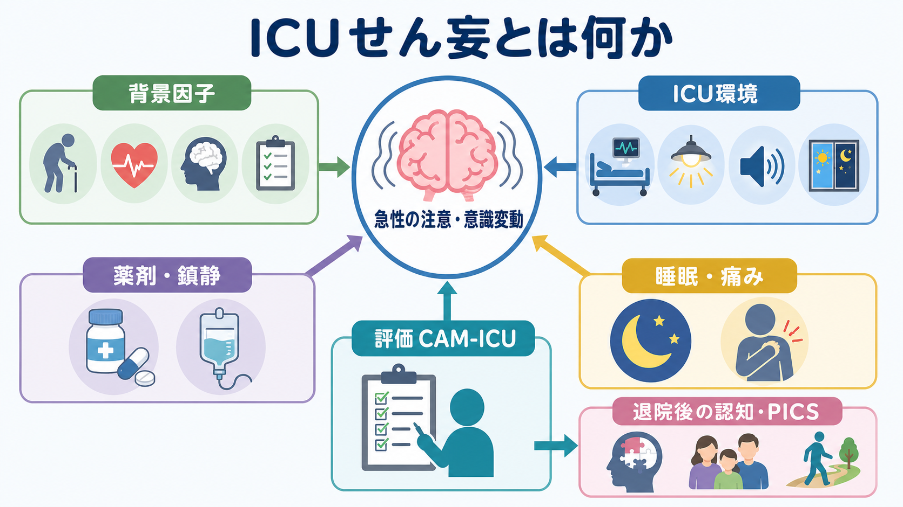
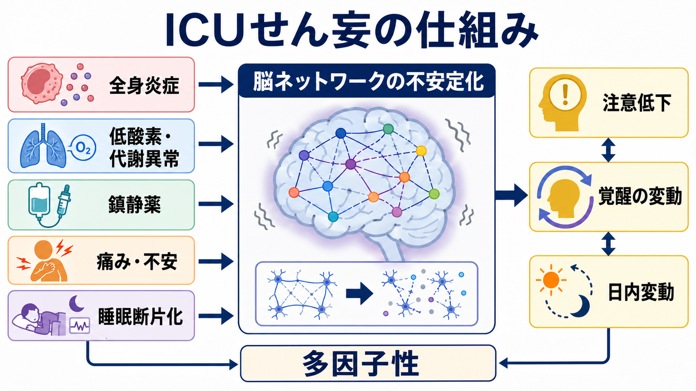
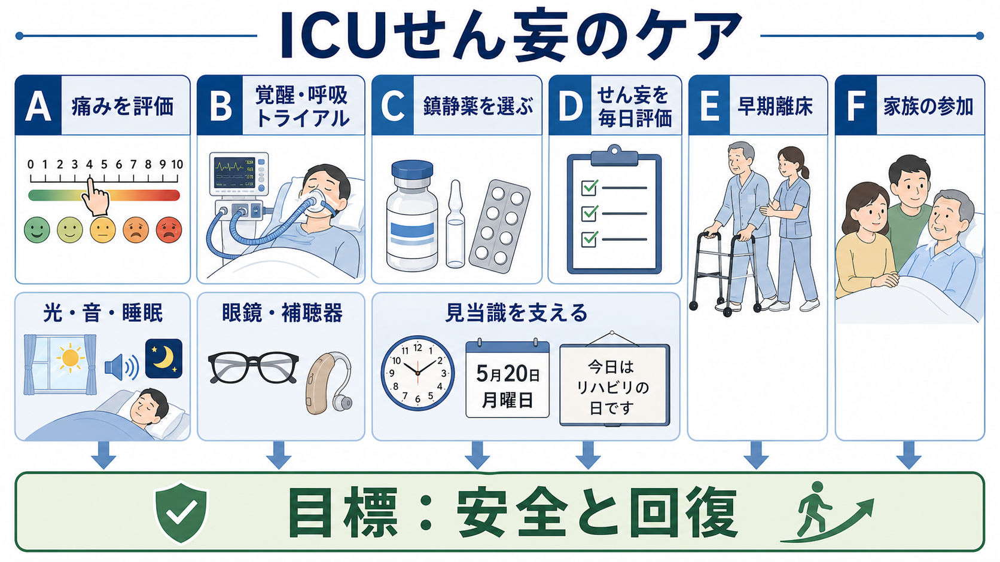

# ICUせん妄とは何か

## 要点

- ICUせん妄は、集中治療中に生じる急性の注意・意識・認知の変動であり、単なる「混乱」や「不穏」ではなく、重症疾患に伴う急性脳機能不全として捉える必要がある[1][3]。
- リスクは、高齢、既存の認知機能低下、重症度、人工呼吸、感覚障害、睡眠断片化、疼痛、感染、低酸素、代謝異常、鎮静薬などが重なって高まる[1][2][3]。
- ICUでは発語できない患者も多いため、CAM-ICU や ICDSC のような検証済みツールで毎日評価することが推奨される[2][5]。
- ケアの中心は、原因検索、疼痛管理、過鎮静の回避、睡眠と見当識の支援、早期離床、家族参加を組み合わせた多職種ケアである[3][4][6]。
- ICUせん妄の持続は、退院後の認知機能低下や Post-Intensive Care Syndrome（PICS）と関連するため、ICU内だけで終わる問題ではない[6][7]。

## この記事で答える問い

1. ICUせん妄は、一般病棟や高齢者医療でみる[[せん妄と認知症はどう違うのか|せん妄]]と何が同じで、何が違うのか。
2. 集中治療環境では、なぜせん妄が起こりやすいのか。
3. CAM-ICU や ABCDEF bundle は、何を見落とさないための道具なのか。
4. 「鎮静を深くして眠らせる」「抗精神病薬で治す」という理解は、どこが不十分なのか。

## まず結論

ICUせん妄は、重症疾患、治療環境、薬剤、睡眠、痛み、感覚遮断、身体拘束、家族からの分離が重なって、注意と覚醒の調整が不安定になる状態である。したがって対応は、単一の薬剤で「消す」ものではなく、原因を探しながら、患者をできるだけ覚醒・対話・運動・睡眠・見当識の回復へ戻していくケアとして設計する。

この点で、ICUせん妄は[[抗コリン性せん妄とは何か]]や[[振戦せん妄とは何か]]のような特定の誘因をもつせん妄とも重なるが、より多因子性で、人工呼吸、鎮静、敗血症、低酸素、臓器不全、環境ストレスが同時に絡みやすい。医学的には「精神症状」だけでなく、身体状態の悪化や治療過程そのものが脳に反映されたサインとして読む必要がある[1][3]。

## 背景

せん妄は、急性に生じる注意・意識・認知の変化であり、通常は時間帯や日によって変動する。Nature Reviews Disease Primers の総説は、せん妄を「急性の注意、意識、認知の変化」を特徴とする重篤な神経精神症候群として整理し、既存の脳脆弱性と急性身体疾患・薬剤・環境要因が重なって生じると説明している[1]。

ICUでは、この条件がそろいやすい。患者は敗血症、呼吸不全、ショック、術後侵襲、腎不全、肝不全などで生理学的に不安定であり、人工呼吸器、持続鎮静、オピオイド、ベンゾジアゼピン系薬、頻回の処置、昼夜の照明・騒音、睡眠断片化、眼鏡や補聴器の不使用、家族との分離にさらされる。NICE は、せん妄リスクとして高齢、認知機能低下、重症疾患などを挙げ、病院・長期ケア施設での早期認識と予防的な多要素介入を推奨している[2]。

ICUせん妄が重要なのは、単にその場の看護負担を増やすからではない。せん妄は人工呼吸期間、身体拘束、ICU滞在、死亡、退院後の機能・認知アウトカムと結びついて研究されてきた。BRAIN-ICU 研究では、重症疾患後の長期認知障害が高頻度に認められ、病院内せん妄の持続が 3 か月後・12 か月後の認知機能低下と関連した[7]。

## 基本概念

### ICUせん妄は「意識障害を伴う認知の揺らぎ」である

ICUせん妄では、注意を保てない、視線や会話が追えない、場所や時間がわからない、幻覚や錯覚がある、睡眠覚醒リズムが崩れる、落ち着かない、または逆に反応が乏しいといった変化がみられる。過活動型だけでなく、低活動型や混合型が多く、低活動型は「おとなしい」「眠いだけ」と誤解されやすい[1][2]。この点は[[意識障害とは何か]]や[[MSEで認知機能をどう評価するか]]と接続して理解できる。

ICUでは、人工呼吸器や気管チューブのために発語できない患者がいる。そのため、通常の会話だけに頼る評価では見落としやすい。CAM-ICU は、人工呼吸中の非言語的な患者にも使えるよう開発・検証された評価法であり、急性発症または変動、注意障害、思考のまとまり、意識水準を組み合わせて評価する[5]。NICE も critical care や術後回復室では CAM-ICU または ICDSC を用いることを推奨している[2]。

### リスク因子は「脆弱性」と「誘因」に分けると見通しがよい

ICUせん妄のリスクは、患者側の脆弱性と、その時点で加わる誘因に分けて考えると整理しやすい[1][3]。

| 観点 | 例 | 実践上の意味 |
|---|---|---|
| もともとの脆弱性 | 高齢、認知症、脳血管障害、聴覚・視覚障害、フレイル、アルコール使用歴 | 入室時からリスクを高く見積もる |
| 急性身体要因 | 敗血症、低酸素、ショック、発熱、脱水、電解質異常、腎・肝不全、疼痛 | 「精神症状」ではなく身体原因を探す |
| 治療関連要因 | 深い鎮静、ベンゾジアゼピン、抗コリン作用薬、身体拘束、人工呼吸 | 可変要因として毎日見直す |
| 環境要因 | 騒音、照明、昼夜逆転、睡眠中断、家族不在、眼鏡・補聴器なし | ケア設計で減らせる部分がある |

## 仕組み

ICUせん妄の仕組みは、単一の神経伝達物質や単一病変で説明できない。現在の理解では、神経炎症、血管・血液脳関門機能、代謝障害、神経伝達の不均衡、ネットワーク結合の低下、睡眠覚醒制御の破綻が重なり、注意・覚醒・予測処理の安定性が落ちると考えられる[1]。

たとえば敗血症では、全身炎症がサイトカイン、内皮障害、微小循環、血液脳関門を介して脳機能に影響しうる。呼吸不全やショックでは低酸素・低灌流が加わる。腎不全や肝不全では代謝産物や薬剤クリアランスの問題が出る。さらに、疼痛、不安、昼夜を問わない処置、騒音、照明、人工呼吸器の不快感は、[[過覚醒とは何か|過覚醒]]と[[不眠障害とは何か|睡眠障害]]を悪化させる。

鎮静は必要な場面があるが、深すぎる鎮静は患者の注意・覚醒の評価を妨げ、離床やコミュニケーションを遅らせる。2018年の PADIS ガイドラインは、痛み、鎮静、せん妄、不動、睡眠を別々の問題としてではなく、相互に関連する ICU 症状群として管理する枠組みを示した[3]。2025年の SCCM focused update では、軽い鎮静やせん妄低減が優先される人工呼吸患者でデクスメデトミジンをプロポフォールより用いること、強化された離床・リハビリテーション、メラトニン使用が条件付きで推奨される一方、抗精神病薬によるせん妄治療には推奨を出せないとされた[4]。

## 図解

上の 1 枚目は、ICUせん妄を「急性の注意・意識変動」を中心に、リスク因子、ICU環境、評価、ケア、PICS へ接続する概念地図として読む。2 枚目は、炎症・低酸素・代謝異常・鎮静薬・痛み・睡眠断片化が、脳ネットワークの不安定化を通じて注意低下や覚醒変動に至る流れを示す。

3 枚目は、臨床現場でのケアの入口を示す。ABCDEF bundle は、A: pain、B: spontaneous awakening/breathing trials、C: analgesia and sedation choice、D: delirium assessment/prevention/management、E: early mobility、F: family engagement を統合する実装枠組みである。ICU Liberation Collaborative の大規模コホートでは、ABCDEF bundle の実施が、死亡、人工呼吸、昏睡、せん妄、身体拘束、ICU再入室、施設退院の低下と関連した[6]。

## 臨床・研究との接続

### 評価は「見つけにいく」必要がある

ICUせん妄は、興奮してチューブを抜こうとする患者だけの問題ではない。反応が乏しい、目が合わない、日中も眠っている、家族の声かけに反応しにくいといった低活動型も重要である。NICE は低活動型せん妄の見逃しに注意するよう明記し、変化や変動を日々観察することを推奨している[2]。ICUでは鎮静深度、疼痛、せん妄を同時に測定し、昨日との違いをチームで共有することが実践上の核になる[3]。

### ケアは「薬を足す」より「せん妄を作る条件を減らす」

せん妄があると、現場では安全確保のために薬剤や身体拘束を検討せざるを得ない場面がある。しかし、ICUせん妄の標準的な発想は、まず原因を探し、過鎮静、疼痛、低酸素、感染、尿閉、便秘、脱水、薬剤、眼鏡・補聴器の不使用、睡眠中断、見当識喪失を一つずつ減らすことである[2][3]。抗精神病薬は、強い苦痛や危険があり非薬物的対応で足りない場合に短期的に使われることはあるが、せん妄そのものを確実に短縮する万能薬としては扱えない[4]。

この観点は、[[器質性精神病とは何か]]や[[物質誘発性精神病とは何か]]との鑑別にも関係する。幻覚や妄想が目立っても、急性発症、注意障害、意識水準の変動、身体疾患・薬剤・離脱の関与があれば、まずせん妄として評価する。

### 退院後のPICSまで視野に入れる

ICUせん妄は、ICU内で消えれば終わりではない。重症疾患生存者では、退院後に認知、気分、身体機能の問題が残ることがあり、PICS と呼ばれる。BRAIN-ICU 研究では、内科・外科 ICU 患者の退院後 3 か月・12 か月で認知障害が高頻度に観察され、せん妄期間の長さが認知成績低下と関連した[7]。これは、せん妄を「一過性の迷惑行動」としてではなく、脳と回復のアウトカム指標として扱う理由になる。

## よくある誤解

### 「ICUせん妄は不穏な患者のこと」

不穏は一部にすぎない。低活動型せん妄では、動きが少ない、反応が遅い、眠っているように見えるため、むしろ見逃されやすい[1][2]。

### 「鎮静を深くすればせん妄はよくなる」

深い鎮静は必要な状況もあるが、せん妄を隠し、離床・呼吸器離脱・コミュニケーションを遅らせることがある。痛みを評価し、必要最小限の鎮静を目標化し、毎日見直す発想が重要である[3][4]。

### 「抗精神病薬でせん妄を治療する」

抗精神病薬は危険行動や強い苦痛に対する短期的な選択肢になることはあるが、ICUせん妄の主要な治療は原因検索と多要素ケアである。2025年の SCCM focused update は、ICUせん妄治療における抗精神病薬について、通常ケアと比べた推奨を出せないとしている[4]。

### 「退院したら認知機能は自然に戻る」

回復する人もいるが、重症疾患後の認知障害は珍しくない。せん妄の持続、人工呼吸、重症度、既存の脳脆弱性、睡眠・身体機能低下が重なると、退院後フォローの視点が必要になる[7]。

## 関連ノート

- [[せん妄と認知症はどう違うのか]]
- [[抗コリン性せん妄とは何か]]
- [[振戦せん妄とは何か]]
- [[意識障害とは何か]]
- [[不眠障害とは何か]]
- [[過覚醒とは何か]]
- [[器質性精神病とは何か]]
- [[物質誘発性精神病とは何か]]
- [[MSEで認知機能をどう評価するか]]

MOC更新候補: 精神医学、神経認知障害、臨床精神医学、集中治療・救急、睡眠障害。並列ジョブとの競合を避けるため、本記事では MOC 本文は更新しない。

## 理解チェック

1. ICUせん妄を「不穏」だけで定義すると、どのタイプを見逃しやすいか。
2. ICUせん妄のリスク因子を、もともとの脆弱性と急性誘因に分けると何が見えるか。
3. CAM-ICU が ICU 患者に向いている理由は何か。
4. ABCDEF bundle の各要素は、せん妄を作るどの条件を減らしているか。
5. 抗精神病薬を「せん妄そのものの治療」と考えすぎると、どのような介入が抜け落ちるか。
6. ICUせん妄と PICS、退院後認知機能をどのように接続して説明できるか。

## 参考文献

[1] Wilson JE, Mart MF, Cunningham C, et al. Delirium. *Nature Reviews Disease Primers*. 2020;6:90. https://doi.org/10.1038/s41572-020-00223-4

[2] National Institute for Health and Care Excellence. *Delirium: prevention, diagnosis and management in hospital and long-term care* (CG103). Published 2010, last updated 2023. https://www.nice.org.uk/guidance/cg103/chapter/1-recommendations

[3] Devlin JW, Skrobik Y, Gélinas C, et al. Clinical Practice Guidelines for the Prevention and Management of Pain, Agitation/Sedation, Delirium, Immobility, and Sleep Disruption in Adult Patients in the ICU. *Critical Care Medicine*. 2018;46(9):e825-e873. https://doi.org/10.1097/CCM.0000000000003299

[4] Lewis K, Balas MC, Stollings JL, et al. A Focused Update to the Clinical Practice Guidelines for the Prevention and Management of Pain, Anxiety, Agitation/Sedation, Delirium, Immobility, and Sleep Disruption in Adult Patients in the ICU. *Critical Care Medicine*. 2025;53(3):e711-e727. https://www.sccm.org/clinical-resources/guidelines/guidelines/focused-update-padis-guideline

[5] Ely EW, Inouye SK, Bernard GR, et al. Delirium in Mechanically Ventilated Patients: Validity and Reliability of the Confusion Assessment Method for the Intensive Care Unit (CAM-ICU). *JAMA*. 2001;286(21):2703-2710. https://doi.org/10.1001/jama.286.21.2703

[6] Pun BT, Balas MC, Barnes-Daly MA, et al. Caring for Critically Ill Patients with the ABCDEF Bundle: Results of the ICU Liberation Collaborative in Over 15,000 Adults. *Critical Care Medicine*. 2019;47(1):3-14. https://doi.org/10.1097/CCM.0000000000003482

[7] Pandharipande PP, Girard TD, Jackson JC, et al.; BRAIN-ICU Study Investigators. Long-term cognitive impairment after critical illness. *New England Journal of Medicine*. 2013;369(14):1306-1316. https://doi.org/10.1056/NEJMoa1301372
