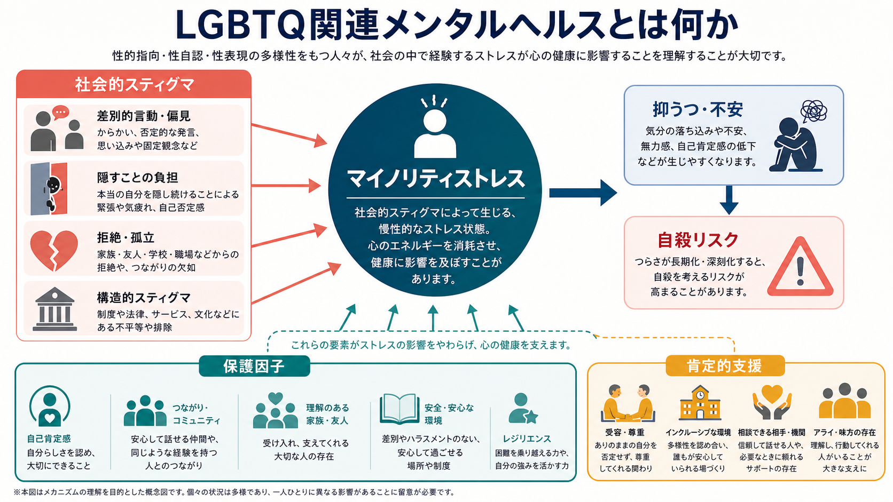
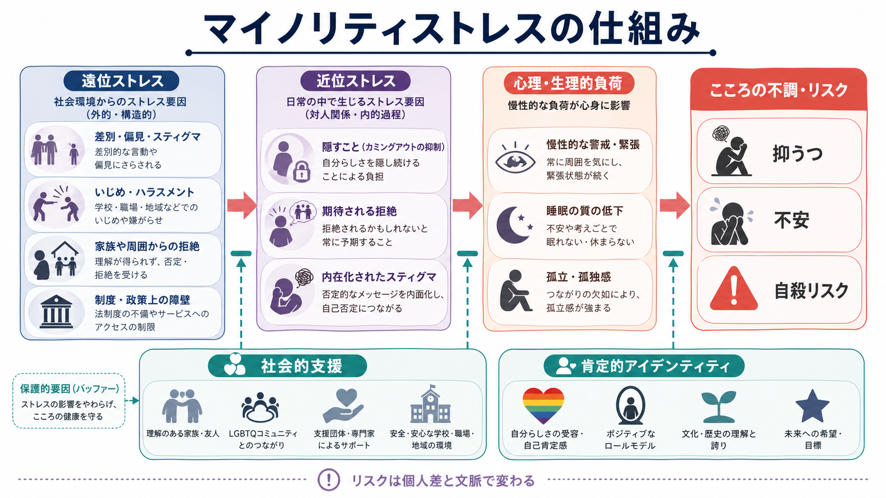
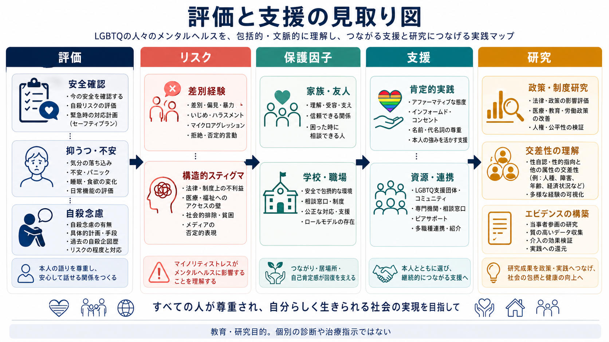

# LGBTQ関連メンタルヘルスとは何か

## 要点

- LGBTQ関連メンタルヘルスは、性的指向、性自認、性表現、性分化の多様性そのものを病理化する概念ではない。焦点は、差別、偏見、拒絶、制度上の障壁、隠すことの負担などが、[[大うつ病性障害とは何か|抑うつ]]、[[不安症群とは何か|不安]]、自傷・自殺リスクにどう結びつくかにある[1][2]。
- Meyer のマイノリティストレスモデルは、一般的な生活ストレスに加えて、少数者であることに特有の遠位ストレスと近位ストレスが慢性的に積み重なると説明する[1]。
- LGBTQの若者では、抑うつ、不安、自殺念慮・自殺関連行動のリスクが高いことが多くの研究で示される。ただし、リスクは「LGBTQであるから」ではなく、スティグマと支援環境の不足によって増減する[3][4]。
- 保護因子には、家族・友人・学校・職場での受容、信頼できる相談先、肯定的アイデンティティ、コミュニティとのつながり、安全な医療・心理支援が含まれる[2][5]。
- 本稿は教育・研究目的の整理であり、個別の診断や治療指示ではない。自殺の危険が切迫している場合は、地域の救急、危機介入、信頼できる支援者につなぐことが優先される。

## この記事で答える問い

1. LGBTQ関連メンタルヘルスは、何を説明する概念なのか。
2. マイノリティストレスは、抑うつ・不安・自殺リスクにどう関係するのか。
3. 臨床や研究では、個人の症状と社会的文脈をどう同時に扱うのか。
4. よくある誤解はどこにあるのか。

## まず結論

LGBTQ関連メンタルヘルスとは、LGBTQであることを疾患とみなす考えではない。むしろ、性的・ジェンダーの多様性をもつ人が、社会の中で経験しやすい偏見、差別、暴力、拒絶、制度上の不利益、孤立、自己否定の圧力を、精神健康のリスクと保護因子の両方から理解する枠組みである[1][2]。

中心概念はマイノリティストレスである。これは、誰にでも起こる生活上のストレスに加え、少数者として扱われることに特有のストレスが重なるという考え方である。遠位ストレスには、いじめ、ハラスメント、差別的発言、雇用・医療・教育での不利益、家族や周囲からの拒絶が含まれる。近位ストレスには、拒絶を予期して常に警戒すること、カミングアウトを控え続ける負担、内在化されたスティグマが含まれる[1]。

この枠組みで重要なのは、個人の弱さではなく、環境と相互作用する負荷を読むことである。たとえば同じ性的指向や性自認をもつ人でも、家族が受容的か、学校や職場が安全か、医療者が尊重してくれるか、地域の制度が保護的かによって、メンタルヘルスの軌道は大きく変わりうる[2][5]。

## 背景

LGBTQは、レズビアン、ゲイ、バイセクシュアル、トランスジェンダー、クィア／クエスチョニングなどを含む広い表現である。実際には、性的指向、性自認、性表現、性分化、恋愛的指向、文化的背景、年齢、障害、民族、社会経済状況などが交差するため、LGBTQの経験は一枚岩ではない[2]。

歴史的には、同性愛や多様なジェンダー表現が不当に病理化されてきた時期がある。しかし現代の臨床と研究では、性的指向や性自認そのものを治療対象とするのではなく、スティグマ、トラウマ、孤立、抑うつ、不安、自殺リスク、物質使用、身体的健康、医療アクセスなどを包括的に評価する方向に移っている[2][6]。

National Academies の報告は、LGBTQI+のウェルビーイングを、精神健康だけでなく、家族、コミュニティ、教育、雇用、住宅、法制度、医療アクセスといった複数の社会システムの中で理解する必要を強調している[2]。これは、臨床面接で症状だけを聞くのではなく、「どの場面で安全でいられるか」「どの関係で否定されるか」「どの制度が負担になっているか」を評価する必要があるということでもある。

## 基本概念

### LGBTQ関連メンタルヘルス

LGBTQ関連メンタルヘルスは、特定の診断名ではない。むしろ、LGBTQの人々における精神健康、生活機能、安全、ウェルビーイングを、個人内要因と社会的文脈の両方から理解する領域である。扱うテーマには、抑うつ、不安、[[PTSDとは何か|トラウマ反応]]、自傷、自殺念慮、物質使用、摂食の問題、身体違和、対人関係、家族関係、医療不信、学校・職場での安全などが含まれる。

この領域では、診断分類そのものよりも、何が苦痛を作り、何が回復を支えるかが重要になる。たとえば、本人が「自分がおかしい」と感じている場合でも、その背景には長年の否定的メッセージ、侮辱、孤立、カミングアウトのリスク、相談先の不足があるかもしれない。評価では、症状の重症度と同じくらい、その症状がどの関係・場所・制度の中で生じているかを見る。

### マイノリティストレス

Meyer のモデルでは、マイノリティストレスは、少数者集団に属することに関連して慢性的に経験されるストレスである[1]。ポイントは、LGBTQであること自体がストレスの原因なのではなく、社会の偏見や排除がストレスを作るという点にある。

遠位ストレスは、本人の外側で起こる出来事である。差別、いじめ、ハラスメント、暴力、家族からの拒絶、医療現場での不適切な対応、制度上の不利益などが含まれる。近位ストレスは、そうした社会的環境を受けて本人の内側で持続する過程である。拒絶を予期する警戒、隠すことの負担、内在化されたスティグマ、自己否定などが含まれる。

### 抑うつ・不安・自殺リスク

マイノリティストレスは、抑うつや不安を単純な一方向の因果で説明するものではない。むしろ、慢性的な警戒、睡眠の乱れ、孤立、自己評価の低下、援助要請の難しさ、トラウマ反応、将来展望の狭まりなどを介して、メンタルヘルスのリスクを高めうる枠組みである[1][3]。

LGBTQ youth に関するレビューでは、LGBTQの若者は非LGBTQの若者に比べて精神健康上のリスクが高い傾向を示す一方、家族・学校・地域の支援や肯定的な環境がリスクを下げることも整理されている[3]。また、自殺念慮・自殺関連行動に関するメタ分析は、研究間の異質性や出版バイアスなどの限界を指摘しつつ、LGBTQ youth の自殺関連リスクを理解するには、リスク要因だけでなく保護因子を含めた理論的研究が必要だと述べている[4]。

## 仕組み

### 1. 社会的スティグマが慢性的な警戒を作る

差別やハラスメントが一度だけ起こる場合でも、それは強い苦痛を生む。しかしマイノリティストレスでより重要なのは、「また起こるかもしれない」という予期が生活全体に広がることである。学校で笑われるかもしれない、職場で不利益を受けるかもしれない、医療者に否定されるかもしれない、家族に拒絶されるかもしれないという警戒は、注意、睡眠、身体緊張、対人行動に影響する。

このような警戒は、短期的には身を守る働きをもつ。しかし長期化すると、休めない、相談できない、親密な関係を作りにくい、失敗や拒絶の手がかりに過敏になるといった形で、抑うつ・不安の維持要因になりうる。

### 2. 隠すことの負担が孤立を深める

カミングアウトは、常にすべきものでも、しないことが悪いものでもない。安全性、関係性、生活上のリスクを考えて、本人が選ぶことである。ただし、隠すことを強いられる環境では、自己開示、援助要請、親密な関係、学校・職場での所属感が損なわれやすい[1]。

隠すことの負担は、単に「秘密を持つ」ことではない。言葉を選び続ける、過去を編集する、SNSや書類で矛盾が出ないようにする、相談したい相手に相談できない、といった認知的・感情的コストを含む。これが長期化すると、孤立感、疲労、自己否定、抑うつにつながりやすい。

### 3. 内在化されたスティグマが自己評価を傷つける

周囲から繰り返し否定的メッセージを受けると、その価値観を本人が一部取り込んでしまうことがある。これを内在化されたスティグマと呼ぶ。本人の性格の問題ではなく、社会的メッセージが反復された結果として理解する方が適切である[1]。

内在化されたスティグマは、「自分は尊重されるに値しない」「幸せになれない」「助けを求めても理解されない」といった信念として現れることがある。認知行動療法的には否定的自己スキーマや予測として扱えるが、単に認知を修正するだけでは不十分である。実際に安全で肯定的な関係や制度へ接続することが、信念の更新を支える。

### 4. 構造的スティグマが健康格差を作る

スティグマは個人間の偏見だけではない。法律、制度、医療アクセス、学校規則、職場慣行、住宅、メディア表象、地域規範にも埋め込まれる。Hatzenbuehlerらは、構造的スティグマを地域レベルの反同性愛的偏見などとして操作化し、性的マイノリティの健康に影響しうることを示した[5]。

構造的スティグマの視点を入れると、臨床で見える抑うつや不安は、本人の中だけに閉じた問題ではなくなる。たとえば、医療者が名前や代名詞を尊重しない、学校でいじめが放置される、職場でパートナーや家族の話ができない、といった環境は、症状の背景や維持因子になりうる。

## 図解

上の2枚の図は、LGBTQ関連メンタルヘルスを「個人の属性」ではなく「社会的負荷と保護因子の相互作用」として見るための地図である。1枚目は全体像を示し、2枚目は遠位ストレス、近位ストレス、心理・生理的負荷、抑うつ・不安・自殺リスクへの流れを示している。

3枚目は臨床と研究の接続である。実践では、症状評価と安全確認だけでなく、差別経験、家族・友人・学校・職場の支援、本人の希望、利用可能な資源を同時に見る。研究では、個人差を平均化するだけでなく、構造的スティグマ、交差性、政策、地域差、当事者参加型研究を扱う必要がある[2][4]。

## 臨床・研究との接続

### 評価

臨床評価では、まず現在の苦痛、[[大うつ病性障害とは何か|抑うつ症状]]、[[不安症群とは何か|不安症状]]、睡眠、食欲、集中、生活機能、物質使用、自傷、自殺念慮を確認する。自殺念慮がある場合は、[[気分障害における自殺リスクとは何か]]や[[自殺関連行動障害とは何か]]で扱うように、具体的な計画、手段へのアクセス、過去の自傷・自殺企図、保護因子、緊急時の連絡先を確認する。

同時に、LGBTQであることを「原因」と決めつけない。本人がどの言葉を使って自分を説明するか、どの場面で安全か、どの場面で隠しているか、最近の差別・拒絶・暴力・アウティングの経験があるか、家族や学校・職場での支援があるかを、尊重的に聞く。名前、代名詞、関係性、家族の形を本人の言葉に合わせることも、評価の一部である[6]。

### 支援

支援の基本は、肯定的で安全な関係を作ることである。これは単に「受容的な態度を示す」という意味だけではない。本人の言葉を尊重する、守秘と限界を説明する、差別経験を矮小化しない、症状と社会的文脈を切り離しすぎない、必要に応じて学校・職場・家族・地域資源と連携する、という実務を含む。

トランスジェンダー・ノンバイナリーの若者を対象にした前向き観察研究では、ジェンダー肯定的ケアへのアクセスが、1年間の追跡で抑うつや自殺関連アウトカムの改善と関連したと報告されている[7]。ただし、このような研究は観察研究であり、個別の医療判断は年齢、希望、身体的状態、家族・支援体制、地域制度、専門的評価に基づいて行われる必要がある。

### 研究

研究では、LGBTQを一つの均質集団として扱うと重要な差異を見落とす。性的指向、性自認、性表現、年齢、人種・民族、障害、貧困、居住地域、宗教、移民経験などが交差し、リスクと保護因子を変えるからである[2]。また、自殺リスク研究では、リスク要因の列挙だけでなく、保護因子、発達段階、トランスジェンダー youth のデータ不足、研究デザインの理論性が課題として指摘されている[4]。

実践に役立つ研究には、当事者参加、プライバシー保護、測定項目の妥当性、少数集団内の多様性への配慮が必要である。単に「LGBTQの人はリスクが高い」と示すだけでは、スティグマを再生産する危険がある。どの環境がリスクを作り、どの支援が回復を支えるかを明らかにする研究が重要である。

## よくある誤解

### 誤解1: LGBTQであること自体が精神疾患である

これは誤りである。性的指向や性自認そのものは精神疾患ではない。問題になるのは、差別、暴力、拒絶、孤立、医療アクセスの障壁、内在化されたスティグマなどが苦痛や機能障害を生む場合である[1][2]。

### 誤解2: リスクが高いなら、LGBTQであることを変えればよい

これも誤りである。リスクを高める主要因は、本人の存在ではなく、否定的な社会環境である。したがって支援の方向は、本人のアイデンティティを否定することではなく、安全、尊重、つながり、適切な医療・心理支援、制度的保護を増やすことである[6]。

### 誤解3: カミングアウトすれば必ず楽になる

カミングアウトは、本人の安全と希望に基づく選択である。安全な環境では自己開示がつながりや支援を増やすことがある一方、拒絶や暴力の危険がある環境では、慎重な判断が必要になる。臨床家や支援者は、開示を促す前に、安全性、守秘、支援者、緊急時対応を確認する。

### 誤解4: 個人のレジリエンスだけを高めれば十分である

レジリエンスは重要だが、それだけでは不十分である。差別的な学校、職場、医療、制度が変わらなければ、個人に過剰な適応努力を求めることになる。LGBTQ関連メンタルヘルスでは、個人支援と環境調整、制度改善を同時に考える。

## 関連ノート

- [[大うつ病性障害とは何か]]
- [[不安症群とは何か]]
- [[PTSDとは何か]]
- [[気分障害における自殺リスクとは何か]]
- [[自殺関連行動障害とは何か]]
- [[非自殺性自傷とは何か]]

## MOC更新候補

- `content/00_MOC/` 配下の精神医学、臨床心理学、社会・文化、メンタルヘルス関連MOCに追加候補。
- 並列ジョブとの競合を避けるため、本記事ではMOCファイルを直接更新しない。

## 理解チェック

1. マイノリティストレスの「遠位ストレス」と「近位ストレス」は、それぞれ何を指すか。
2. LGBTQ関連メンタルヘルスを説明するとき、「LGBTQであること自体が原因」と言わない方がよい理由は何か。
3. 抑うつ・不安・自殺リスクを評価するとき、症状以外にどのような社会的文脈を聞く必要があるか。
4. 保護因子として、家族・学校・職場・医療ができることは何か。

## 未解決問題

- 日本語圏におけるLGBTQ関連メンタルヘルスの縦断研究、介入研究、地域差の検討はまだ十分ではない。
- LGBTQ内部の多様性、特にトランスジェンダー、ノンバイナリー、インターセックス、複数のマイノリティ性をもつ人々のデータは不足しやすい。
- 自殺リスク研究では、リスク要因だけでなく、保護因子、支援アクセス、制度変化、当事者参加型研究をさらに発展させる必要がある。

## 参考文献

[1] Meyer, I. H. (2003). Prejudice, social stress, and mental health in lesbian, gay, and bisexual populations: Conceptual issues and research evidence. *Psychological Bulletin, 129*(5), 674-697. https://doi.org/10.1037/0033-2909.129.5.674

[2] National Academies of Sciences, Engineering, and Medicine. (2020). *Understanding the Well-Being of LGBTQI+ Populations*. The National Academies Press. https://doi.org/10.17226/25877

[3] Russell, S. T., & Fish, J. N. (2016). Mental health in lesbian, gay, bisexual, and transgender (LGBT) youth. *Annual Review of Clinical Psychology, 12*, 465-487. https://doi.org/10.1146/annurev-clinpsy-021815-093153

[4] Hatchel, T., Polanin, J. R., & Espelage, D. L. (2021). Suicidal thoughts and behaviors among LGBTQ youth: Meta-analyses and a systematic review. *Archives of Suicide Research, 25*(1), 1-37. https://doi.org/10.1080/13811118.2019.1663329

[5] Hatzenbuehler, M. L., Bellatorre, A., Lee, Y., Finch, B. K., Muennig, P., & Fiscella, K. (2014). Structural stigma and all-cause mortality in sexual minority populations. *Social Science & Medicine, 103*, 33-41. https://doi.org/10.1016/j.socscimed.2013.06.005

[6] Nakamura, N., Dispenza, F., Abreu, R. L., Ollen, E. W., Pantalone, D. W., Canillas, G., Gormley, B., & Vencill, J. A. (2022). The APA Guidelines for Psychological Practice With Sexual Minority Persons: An executive summary of the 2021 revision. *American Psychologist, 77*(8), 953-962. https://doi.org/10.1037/amp0000939

[7] Tordoff, D. M., Wanta, J. W., Collin, A., Stepney, C., Inwards-Breland, D. J., & Ahrens, K. (2022). Mental health outcomes in transgender and nonbinary youths receiving gender-affirming care. *JAMA Network Open, 5*(2), e220978. https://doi.org/10.1001/jamanetworkopen.2022.0978
