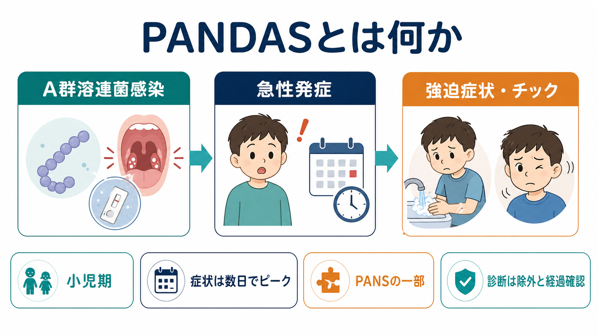
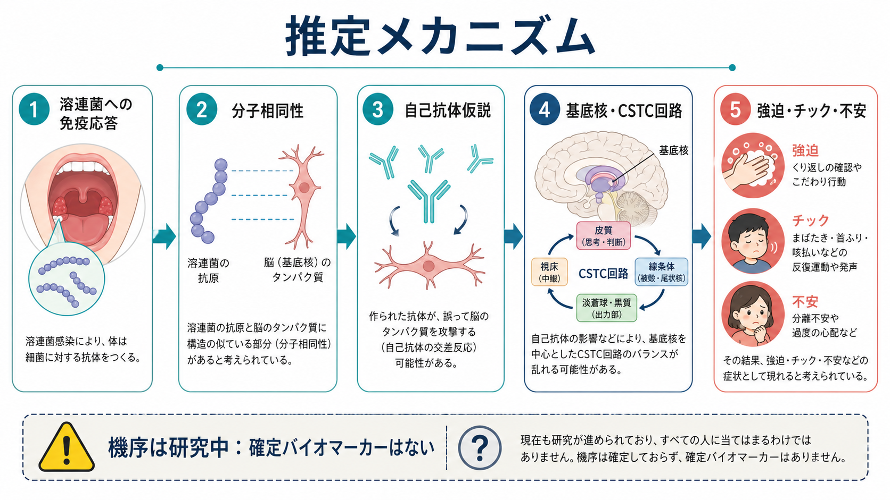
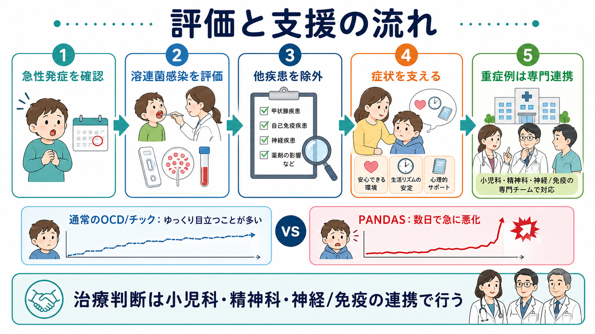

# PANDASとは何か

## 要点

- PANDAS は、A群β溶血性レンサ球菌、いわゆる溶連菌感染と時間的に関連して、[[強迫症とは何か|強迫症状]]や[[チック症とは何か|チック]]が小児期に急性発症・急性増悪する病態概念である[1][2]。
- 現在は、より広い PANS（pediatric acute-onset neuropsychiatric syndrome）の一部として扱われることが多い。PANS は溶連菌に限定せず、急性発症の強迫症状または著しい摂食制限と、複数の神経精神症状の組み合わせで定義される[2][3]。
- PANDAS/PANS の最大の手がかりは「何の前触れもなく、数日で症状がピークに達する」ような急性さであり、通常の強迫症やチック症のゆっくりした目立ち方とは異なることがある[1][3]。
- ただし、溶連菌感染、強迫症、チックはいずれも小児で珍しくないため、「感染したことがある」だけでは PANDAS とはいえない。診断は除外診断であり、経過、感染証拠、身体診察、精神医学的評価を総合する[2][4]。
- 自己抗体、分子相同性、基底核・CSTC回路への影響などの免疫仮説が研究されているが、確定的なバイオマーカーはまだない。治療についても、通常の精神科的・行動的支援、感染治療、免疫療法の位置づけを慎重に分けて考える必要がある[5][6][7]。

## この記事で答える問い

1. PANDAS はどのような病態概念なのか。
2. PANDAS と PANS、通常の強迫症・チック症はどう違うのか。
3. 溶連菌感染から強迫症状やチックが出るという仮説は、どこまで支持されているのか。
4. 臨床では何を確認し、何に注意する必要があるのか。
5. 研究上、何がまだ未解決なのか。

## まず結論

PANDAS は「溶連菌感染のあとに、子どもの強迫症状やチックが急に出る」という経験的な観察から提案された病態概念である。1998年に Swedo らが、強迫症状またはチック、小児期発症、症状の波、溶連菌感染との時間的関連、神経学的異常をもつ 50 例を報告したことが出発点になった[2]。

重要なのは、PANDAS を「感染が原因の強迫症」と単純化しないことである。溶連菌感染は小児でよくあり、強迫症状やチックも小児期に出現しうる。したがって、両者が同じ時期に見つかっただけでは因果関係は示せない。AAP 2025 clinical report も、PANS は妥当な診断概念である可能性を認めつつ、十分に確立した検査法や治療エビデンスがまだ乏しいため、慎重で多職種的な評価を勧めている[3]。

臨床的には、急性発症の強迫症状・チック・摂食制限・分離不安・気分不安定・退行・書字悪化・頻尿などを、感染歴、身体所見、精神医学的評価、神経学的評価とあわせて見る。教育・研究上は、PANDAS を「免疫と精神症状の接点を考えるための重要なモデル」として扱うのがよい。

## 背景

小児の強迫症状やチックは、多くの場合、数週から数か月かけて目立つようになる。本人や家族が「いつ始まったのか」をはっきり言えないことも少なくない。一方、PANDAS/PANS で注目されるのは、数日単位で急に症状が出る、あるいは急に悪化するという時間経過である[1][3]。

PANDAS の名称は、pediatric autoimmune neuropsychiatric disorders associated with streptococcal infections の略である。日本語では「小児自己免疫性溶連菌関連性精神神経障害」などと訳されるが、定訳は一つに固定されていない。ここでは PANDAS と表記する。

PANS は、PANDAS より広い概念である。PANS では、急性発症の強迫症状または著しい摂食制限に加え、不安、気分変動、易怒性・攻撃性、退行、学業低下、感覚・運動異常、睡眠障害・夜尿・頻尿などから少なくとも 2 領域が急性に出ることが重視される[1][4]。PANDAS は、そのうち溶連菌感染との時間的関連が強く疑われる一群と考えられる。

## 基本概念

### PANDASの診断上の特徴

NIMH の説明では、PANDAS は次の特徴をもつとされる[1]。

| 観点 | 内容 |
|---|---|
| 中核症状 | 強迫症状、チック、またはその両方 |
| 年齢 | 3歳頃から思春期前までの小児期に始まる |
| 経過 | 症状が急に出る、または急に悪化し、波をもつ |
| 感染との関係 | 溶連菌感染、咽頭培養陽性、猩紅熱などとの時間的関連 |
| 併存症状 | 多動、ぎこちない不随意運動、分離不安、気分変動、夜尿、書字悪化など |

ここでいう強迫症状は、汚染への恐怖、確認、手洗い、数や順序へのこだわり、侵入的な考えなどとして現れる。チックは、まばたき、首振り、咳払い、鼻すすり、声出しなどとして現れる。関連する基礎概念は、[[強迫観念とは何か]]、[[強迫行為とは何か]]、[[トゥレット症とは何か]]も参照できる。

### PANSとの違い

PANDAS は「溶連菌感染との関連」を診断概念に含む。一方、PANS は、溶連菌に限らず、急性発症の神経精神症状を臨床的に拾い上げるための上位概念である[3][4]。

| 概念 | 中核 | 感染との関係 | 注意点 |
|---|---|---|---|
| PANDAS | 強迫症状またはチック | 溶連菌感染との時間的関連を重視 | 溶連菌感染の証拠と症状経過を慎重に結びつける |
| PANS | 強迫症状または著しい摂食制限 | 溶連菌に限定しない | 除外診断として、他の医学的・精神医学的疾患を確認する |
| 通常の強迫症・チック症 | 症状型と持続経過 | 特定感染を前提にしない | 発症はしばしばより緩徐で、併存症状も個別に評価する |

## 仕組み

PANDAS の中心仮説は、溶連菌に対する免疫応答が、分子相同性を介して自己組織、とくに脳の一部に交差反応し、急性の神経精神症状を引き起こすというものである[1][5]。この考え方は、リウマチ熱やシデナム舞踏病における感染後免疫反応との類推からも発展してきた。

想定される流れは、次のように整理できる。

1. 溶連菌感染に対して免疫系が抗体を作る。
2. 溶連菌の抗原と、宿主の神経組織の一部が似ている場合、交差反応が起こる可能性がある。
3. その反応が基底核や皮質-線条体-視床-皮質回路、すなわち CSTC 回路の機能に影響しうる。
4. 行動選択、運動抑制、不安、反復行動の制御が乱れ、強迫症状やチックとして現れる可能性がある。

ただし、この流れは「研究中の仮説」であり、すべての症例に当てはまる証明済みメカニズムではない。NIMH も、PANDAS を起こす特定の抗体はまだ探索中であると説明している[1]。また、PANS/PANDAS の診断を確定できる単一の血液検査や画像検査もない[1][3]。

[[大脳基底核ループとは何か]]や[[強迫症では皮質線条体視床回路に何が起きているのか]]の観点から見ると、PANDAS は「感染後免疫反応が、反復行動・運動出力・不安調整に関わる回路を乱すかもしれない」という問いを立てるモデルである。したがって、PANDAS は精神医学だけでなく、神経免疫学、発達神経科学、小児感染症学の接点にある。

## 図解

1枚目は、PANDAS の全体像を「溶連菌感染」「急性発症」「強迫症状・チック」「小児期」「PANS の一部」「除外診断」という要素でまとめている。

2枚目は、溶連菌への免疫応答から分子相同性、自己抗体仮説、基底核・CSTC回路、強迫・チック・不安へ至る推定メカニズムを示している。図中の通り、これは確定機序ではなく研究中の仮説である。

3枚目は、臨床での評価と支援の流れを示している。急性発症の確認、溶連菌感染の評価、他疾患の除外、症状への支援、重症例での専門連携を段階として考える。

## 臨床・研究との接続

### 評価では「急性さ」と「除外」が重要

PANS/PANDAS の評価では、急に始まったか、どの症状が同時に出たか、感染や発熱、咽頭痛、皮疹、家族内感染があったかを時間軸で整理する。2013年 PANS Consensus Conference の評価推奨では、家族歴、医学的評価、身体診察、精神医学的評価、感染症評価、免疫・リウマチ・神経学的評価、睡眠や身体症状の確認が挙げられている[4]。

鑑別には、通常の[[強迫症とは何か|強迫症]]、[[トゥレット症とは何か|トゥレット症]]、摂食症、[[ADHDとは何か|ADHD]]、[[不安症群とは何か|不安症群]]、双極症、自己免疫性脳炎、シデナム舞踏病、全身性エリテマトーデス、甲状腺疾患、薬剤や物質の影響などが含まれる[3][4]。重い意識変容、持続する記憶障害、けいれん、精神病症状、チックでは説明しにくい運動異常がある場合は、より広い神経学的評価が必要になる。

### 治療は層を分けて考える

PANDAS/PANS の支援は、少なくとも 3 層に分けると理解しやすい。

| 層 | 目的 | 例 |
|---|---|---|
| 症状への支援 | 苦痛と生活障害を減らす | 心理教育、家族支援、認知行動療法、必要に応じた薬物療法 |
| 感染への対応 | 現在の溶連菌感染を評価・治療する | 咽頭培養・迅速検査、適切な抗菌薬治療 |
| 免疫・炎症への対応 | 重症例で神経免疫学的病態を検討する | 専門チームでの評価、研究的文脈を含む慎重な免疫療法検討 |

2017年の PANS/PANDAS Consortium は、精神科的・行動的介入、感染治療、免疫調整療法を組み合わせる枠組みを提示した[6][7]。一方で、治療研究の系統的レビューは、抗菌薬、免疫グロブリン、血漿交換、NSAIDs、ステロイドなどの研究は数が少なく、バイアスのリスクが高いと指摘している[8]。AAP 2025 report も、侵襲的な免疫療法は有効性の証拠が十分でなく有害事象もありうるため、通常は推奨されず、まれな重症例で専門チームや臨床研究の文脈を含めて慎重に扱うべきだとしている[3]。

したがって、この記事は個別の診断や治療指示ではない。実際の症状がある場合は、小児科、児童精神科、小児神経、感染症、免疫・リウマチなどの専門家が、本人と家族の状況に応じて判断する必要がある。

### 研究上の論点

PANDAS/PANS 研究の難しさは、症状、感染、免疫反応、発達、家族・学校環境が同時に動く点にある。溶連菌感染はよくあるため、偶然の同時発生を因果関係と誤認しやすい。逆に、本当に感染後免疫反応が関わる一群があるとしても、通常の強迫症やチック症の中に埋もれやすい。

今後の課題は、発症直後からの前向き研究、標準化された診断基準、感染証拠の厳密な確認、免疫・神経画像・行動指標の統合、治療研究の質の向上である[3][8]。

## よくある誤解

### 誤解1: 溶連菌にかかったことがあればPANDASである

これは誤りである。学童期の溶連菌感染は珍しくなく、強迫症状やチックも小児で起こりうる。PANDAS では、急性の症状出現または増悪と、近い時期の溶連菌感染証拠を慎重に結びつける必要がある[1][3]。

### 誤解2: PANDASは検査で一発で診断できる

現時点では、PANDAS/PANS を確定する単一の検査はない。咽頭培養や抗ストレプトリジンO抗体、抗DNase B抗体などは感染評価に役立つが、診断全体は症状経過、身体所見、鑑別診断を含む総合判断である[1][4]。

### 誤解3: 免疫療法をすれば治る

免疫療法は最も議論が大きい領域である。PANS/PANDAS Consortium は重症度に応じた免疫調整療法の枠組みを提案したが、AAP はエビデンス不足と有害事象の可能性から、侵襲的免疫療法は通常推奨されず、まれな重症例で専門チームのもと慎重に扱うべきだとしている[3][7]。

### 誤解4: PANDASは「心の問題」ではないので心理支援は不要である

これも誤りである。仮に感染後免疫反応が関与していても、本人は強い不安、強迫、チック、睡眠障害、学校生活の混乱を経験する。認知行動療法、家族支援、学校調整、必要に応じた薬物療法など、症状と生活障害を支える介入は重要である[6]。

## 関連ノート

既存ノート:

- [[強迫症とは何か]]
- [[強迫観念とは何か]]
- [[強迫行為とは何か]]
- [[チック症とは何か]]
- [[トゥレット症とは何か]]
- [[分離不安症とは何か]]
- [[ADHDとは何か]]
- [[大脳基底核ループとは何か]]
- [[強迫症では皮質線条体視床回路に何が起きているのか]]

今後の作成候補:

- PANSとは何か
- シデナム舞踏病とは何か
- 自己免疫性脳炎とは何か
- 溶連菌感染と神経精神症状はどう関係するのか
- 小児急性発症の強迫症状をどう評価するのか

MOC更新候補:

- 精神医学MOC
- 神経免疫学MOC
- 小児精神医学MOC
- 疾患・症候群MOC

## 理解チェック

1. PANDAS と PANS の違いは何か。
2. PANDAS の評価で「急性発症」がなぜ重要なのか。
3. 溶連菌感染の証拠があっても、それだけで PANDAS と断定できない理由は何か。
4. PANDAS の推定メカニズムで、分子相同性と自己抗体仮説はどのような位置づけにあるか。
5. 免疫療法について、PANS/PANDAS Consortium と AAP 2025 report のトーンはどのように違うか。

## 参考文献

[1] National Institute of Mental Health. (n.d.). *PANS and PANDAS: Questions and Answers*. https://www.nimh.nih.gov/health/publications/pandas

[2] Swedo, S. E., Leonard, H. L., Garvey, M., Mittleman, B., Allen, A. J., Perlmutter, S., Lougee, L., Dow, S., Zamkoff, J., & Dubbert, B. K. (1998). Pediatric autoimmune neuropsychiatric disorders associated with streptococcal infections: Clinical description of the first 50 cases. *American Journal of Psychiatry, 155*(2), 264-271. https://doi.org/10.1176/ajp.155.2.264

[3] American Academy of Pediatrics. (2025). Pediatric Acute-Onset Neuropsychiatric Syndrome (PANS): Clinical Report. *Pediatrics, 155*(3), e2024070334. https://doi.org/10.1542/peds.2024-070334

[4] Chang, K., Frankovich, J., Cooperstock, M., Cunningham, M. W., Latimer, M. E., Murphy, T. K., Pasternack, M., Thienemann, M., Williams, K., Walter, J., & Swedo, S. E. (2015). Clinical evaluation of youth with pediatric acute-onset neuropsychiatric syndrome (PANS): Recommendations from the 2013 PANS Consensus Conference. *Journal of Child and Adolescent Psychopharmacology, 25*(1), 3-13. https://doi.org/10.1089/cap.2014.0084

[5] Cunningham, M. W. (2016). Pediatric autoimmune neuropsychiatric disorders associated with streptococcal infections (PANDAS). In J. J. Ferretti, D. L. Stevens, & V. A. Fischetti (Eds.), *Streptococcus pyogenes: Basic Biology to Clinical Manifestations*. University of Oklahoma Health Sciences Center. https://www.ncbi.nlm.nih.gov/books/NBK333433/

[6] Thienemann, M., Murphy, T., Leckman, J., Shaw, R., Williams, K., Kapphahn, C., Frankovich, J., Geller, D., Bernstein, G. A., Chang, K., Elia, J., Swedo, S. E., & the PANS/PANDAS Consortium. (2017). Clinical management of pediatric acute-onset neuropsychiatric syndrome: Part I-Psychiatric and behavioral interventions. *Journal of Child and Adolescent Psychopharmacology, 27*(7), 566-573. https://pmc.ncbi.nlm.nih.gov/articles/PMC5610394/

[7] Frankovich, J., Swedo, S., Murphy, T., Dale, R. C., Agalliu, D., Williams, K., Daines, M., Hornig, M., Chugani, H., Sanger, T., Muscal, E., Pasternack, M., Cooperstock, M., Gans, H., & the PANS/PANDAS Consortium. (2017). Clinical management of pediatric acute-onset neuropsychiatric syndrome: Part II-Use of immunomodulatory therapies. *Journal of Child and Adolescent Psychopharmacology, 27*(7), 574-593. https://pmc.ncbi.nlm.nih.gov/articles/PMC9836706/

[8] Sigra, S., Hesselmark, E., & Bejerot, S. (2018). Treatment of PANDAS and PANS: A systematic review. *Neuroscience & Biobehavioral Reviews, 86*, 51-65. https://doi.org/10.1016/j.neubiorev.2018.01.001
