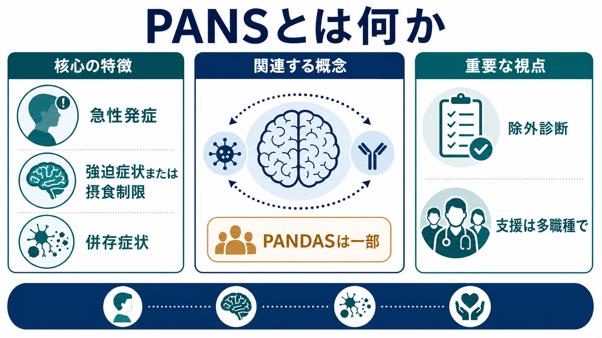
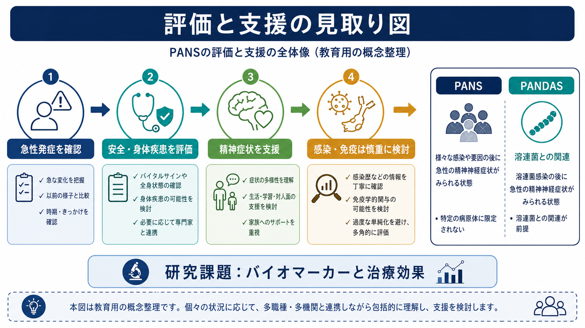

# PANSとは何か

## 要点

- PANS（pediatric acute-onset neuropsychiatric syndrome）は、小児・青年に、急激な[[強迫症とは何か|強迫症状]]または重度の摂食制限が現れ、同時期に複数の神経精神症状がまとまって出現する臨床症候群である[1][2]。
- 診断の中心は「原因名」ではなく、「急性で劇的な発症」「症状群のまとまり」「既知の神経・身体疾患でよりよく説明されないこと」である[2][3]。
- PANDASは溶連菌感染との時間的関連を前提にする概念であり、PANSの一部として扱われることが多い。ただし、溶連菌、免疫、[[大脳基底核ループとは何か|基底核回路]]の関与は全例で確立した機序ではない[1][2]。
- 2025年の American Academy of Pediatrics（AAP）臨床報告は、PANSを「妥当な診断である可能性が高い」としつつ、疾患特異的バイオマーカー、病因、治療効果の証拠はまだ限定的であるため、慎重で多職種的な評価を推奨している[1]。
- 本記事は教育・研究目的の概説であり、個別の診断や治療指示ではない。急性の精神症状、摂食制限、脱水、自傷他害リスク、けいれん、意識障害、局所神経症状がある場合は、医療機関での評価が必要である。

## この記事で答える問い

1. PANSは、通常のOCD、摂食障害、チック症、自己免疫性脳炎と何が違うのか。
2. PANSの診断基準では、どの症状をどの順に見るのか。
3. 感染・免疫・基底核仮説は、どこまで確立し、どこから未確定なのか。
4. 臨床では、過剰診断と見逃しを避けるために何を確認するのか。

## まず結論

PANSは、単に「感染後に精神症状が出た」という意味ではない。重要なのは、数日単位で目立つ急性発症があり、強迫症状または重度の摂食制限を中核として、不安、情動不安定、攻撃性、退行、学業低下、感覚・運動異常、睡眠や排尿などの身体症状が同時期に重なることである[2][3]。

一方で、PANSはDSM-5やICD-11に独立した診断分類として標準収載されている疾患名ではなく、臨床的な作業概念として使われている。したがって、[[精神科診断における除外診断とは何か|除外診断]]、身体評価、発達歴・精神科歴の確認、家族と学校からの時系列情報が中心になる[1][3]。

## 背景

PANSの前史には、PANDAS（pediatric autoimmune neuropsychiatric disorders associated with streptococcal infections）がある。PANDASは、溶連菌感染と関連して急性発症するOCDまたはチック症を説明しようとした研究サブグループである[2]。

しかし、臨床では溶連菌感染が明確でないにもかかわらず、非常に急性のOCD様症状や摂食制限、情動・運動・身体症状のまとまりを示す子どもが観察された。このため、2012年にSwedoらは、病因を溶連菌に限定しない記述的症候群としてPANSを提案した[2]。

この拡張には利点とリスクがある。利点は、急性で重篤な症状群を早期に認識し、身体疾患や神経疾患を含む広い鑑別につなげられることである。リスクは、症状の急性性や除外診断が不十分なまま、感染・免疫だけで説明してしまうことである[1][3]。

## 基本概念

### 診断基準の骨格

PANSの作業基準は、次の3条件で整理できる[2][3]。

| 観点 | 内容 |
|---|---|
| 中核症状 | 急性で劇的なOCD症状、または重度の摂食制限 |
| 併存症状 | 同時期に急性発症する症状が、7領域のうち少なくとも2領域に及ぶ |
| 除外 | 既知の神経疾患・身体疾患・精神疾患でよりよく説明されない |

7領域には、不安、情動不安定または抑うつ、易怒性・攻撃性・強い反抗、発達的退行、学業低下、感覚または運動異常、睡眠障害・夜尿・頻尿などの身体症状が含まれる[2][3]。

### PANSとPANDAS

PANSは、病原体を特定しない広い症候群である。PANDASは、そのうち溶連菌感染との時間的関連を重視するサブタイプとして理解されることが多い[1][2]。この区別は、研究上も臨床上も重要である。PANDASの議論を、そのままPANS全体に一般化すると、感染や自己免疫の関与を過大評価しやすい。

### 似ているが同じではない状態

PANSは、通常の[[強迫症とは何か|強迫症]]、[[回避制限性食物摂取症とは何か|回避制限性食物摂取症]]、[[神経性やせ症とは何か|神経性やせ症]]、[[チック症とは何か|チック症]]、自己免疫性脳炎、シデナム舞踏病、てんかん、薬剤性・内分泌性・代謝性の精神症状などと鑑別される。特に、けいれん、意識変容、著しい認知低下、局所神経症状、持続する異常運動がある場合は、PANSだけで説明せず、神経疾患や全身疾患を優先して検討する[1]。

## 仕組み

PANSの仕組みは、単一の確定モデルでは説明できない。提案されている仮説には、感染後の免疫反応、炎症、血液脳関門の変化、基底核・線条体を含む神経回路の機能変化、心理社会的ストレス、遺伝的脆弱性などがある[1][4][7]。

基底核に関する仮説は、PANDASやシデナム舞踏病との類似から生まれた。OCDやチック症では、皮質-線条体-視床-皮質回路が症状形成に関わると考えられており、PANS/PANDASでも同様の回路が注目されている[7]。ただし、自己抗体や炎症マーカーは一貫して再現されているわけではなく、AAP報告も疾患特異的バイオマーカーが確立していない点を強調している[1]。

したがって、現時点で妥当なのは「一部の症例では感染・免疫・炎症が関与する可能性があるが、全例を自己免疫疾患として扱う根拠は不足している」という表現である。

## 図解

| 図 | 読み方 |
|---|---|
| 図1 | PANSを、急性発症、OCDまたは摂食制限、併存症状、除外診断、多職種支援という全体像で見る |
| 図2 | 感染・炎症、免疫反応、脳回路、症状変化という仮説的連鎖を、未確定性つきで見る |
| 図3 | 評価と支援を、急性性の確認、身体疾患評価、精神症状支援、感染・免疫評価、研究課題に分けて見る |

## 臨床・研究との接続

臨床では、まず時系列を丁寧に作る。いつから、何が、どの程度急に変化したのか。以前から軽い強迫傾向、不安、チック、発達特性、摂食の偏りがあったのか。感染症状、発熱、咽頭痛、服薬、睡眠、学校での変化、家庭内ストレスはどう重なるのか。これらを本人、家族、学校記録、医療記録から照合する[1][3]。

支援は、症状への心理社会的・精神医学的介入、身体疾患の評価、必要時の小児科・神経内科・感染症・免疫/リウマチ領域との連携を組み合わせる。PANS Research Consortiumの2017年論文群は、精神行動療法、感染評価、免疫調整療法を三本柱として整理した[4][5][6][7]。一方、AAP 2025報告は、現時点の証拠の限界から、精神行動療法を重視し、抗菌薬や免疫療法を一般化しすぎない慎重な立場を取っている[1]。

この差は「どちらかが単純に正しい」というより、証拠の読み方と臨床リスクの置き方の違いとして理解するとよい。研究課題としては、発症率、自然経過、再発予測、バイオマーカー、感染・免疫指標の妥当性、心理療法・薬物療法・抗感染症治療・免疫療法の効果を、前向き研究とランダム化比較試験で検証する必要がある[1]。

## よくある誤解

### 誤解1：PANSは「感染が原因のOCD」である

PANSは感染後に起こることがあるが、感染だけを原因とする診断ではない。PANSは、急性発症の症状群を記述する臨床概念であり、感染・免疫は可能性のある一部の機序である[1][2]。

### 誤解2：溶連菌が見つかればPANS/PANDASである

小児では溶連菌感染や保菌が珍しくない。検査陽性と症状発症の時間的関係、臨床像、他疾患の除外を合わせて考える必要がある[1][6]。

### 誤解3：PANSなら免疫療法が必要である

免疫療法は、重症度、神経学的所見、炎症・自己免疫の根拠、他疾患の除外、多職種評価を踏まえて慎重に検討される領域である。AAPは、免疫調整療法を一般診療で広く使うより、重症例で専門チームや研究文脈を含めて検討する姿勢を示している[1][7]。

### 誤解4：PANSは「気のせい」または「親の思い込み」である

急性に生活機能を損なう症状群が存在することと、その原因・治療法が未確定であることは両立する。重要なのは、症状を軽視せず、同時に単一原因へ早合点しない評価である[1]。

## 関連ノート

- [[強迫症とは何か]]
- [[回避制限性食物摂取症とは何か]]
- [[神経性やせ症とは何か]]
- [[チック症とは何か]]
- [[大脳基底核ループとは何か]]
- [[精神科診断における除外診断とは何か]]
- [[身体疾患による気分障害とは何か]]
- [[薬剤性精神症状とは何か]]

MOC更新候補: `content/00_MOC/`配下の精神医学、小児精神医学、神経免疫、疾患・症候群関連MOC。並列ジョブとの競合を避けるため、本記事からの大規模更新は行わない。

今後の作成候補: PANDASとは何か、自己免疫性脳炎に伴う精神症状とは何か、シデナム舞踏病とは何か、小児急性発症OCDの鑑別。

## 理解チェック

1. PANSの中核症状は何か。
2. PANSとPANDASの違いは何か。
3. PANSを「自己免疫疾患」と断定しない方がよい理由は何か。
4. 急性発症のOCD様症状を見たとき、除外すべき神経・身体疾患には何があるか。
5. PANSの評価で、家族や学校からの時系列情報が重要な理由は何か。

## 参考文献

[1] American Academy of Pediatrics. (2025). Pediatric Acute-Onset Neuropsychiatric Syndrome (PANS): Clinical Report. *Pediatrics*, 155(3), e2024070334. https://doi.org/10.1542/peds.2024-070334

[2] Swedo, S. E., Leckman, J. F., & Rose, N. R. (2012). From research subgroup to clinical syndrome: Modifying the PANDAS criteria to describe PANS (Pediatric Acute-onset Neuropsychiatric Syndrome). *Pediatrics & Therapeutics*, 2, 113. https://doi.org/10.4172/2161-0665.1000113

[3] Chang, K., Frankovich, J., Cooperstock, M., et al. (2015). Clinical evaluation of youth with pediatric acute-onset neuropsychiatric syndrome (PANS): Recommendations from the 2013 PANS Consensus Conference. *Journal of Child and Adolescent Psychopharmacology*, 25(1), 3-13. https://doi.org/10.1089/cap.2014.0084

[4] Swedo, S. E., Frankovich, J., & Murphy, T. K. (2017). Overview of treatment of pediatric acute-onset neuropsychiatric syndrome. *Journal of Child and Adolescent Psychopharmacology*, 27(7), 562-565. https://doi.org/10.1089/cap.2017.0042

[5] Thienemann, M., Murphy, T., Leckman, J., et al. (2017). Clinical management of pediatric acute-onset neuropsychiatric syndrome: Part I-Psychiatric and behavioral interventions. *Journal of Child and Adolescent Psychopharmacology*, 27(7), 566-573. https://doi.org/10.1089/cap.2016.0145

[6] Cooperstock, M. S., Swedo, S. E., Pasternack, M. S., & Murphy, T. K. (2017). Clinical management of pediatric acute-onset neuropsychiatric syndrome: Part III-Treatment and prevention of infections. *Journal of Child and Adolescent Psychopharmacology*, 27(7), 594-606. https://doi.org/10.1089/cap.2016.0151

[7] Frankovich, J., Swedo, S., Murphy, T., et al. (2017). Clinical management of pediatric acute-onset neuropsychiatric syndrome: Part II-Use of immunomodulatory therapies. *Journal of Child and Adolescent Psychopharmacology*, 27(7), 574-593. https://doi.org/10.1089/cap.2016.0148

[8] National Institute of Mental Health. (2017). Guidelines published for treating PANS/PANDAS. https://www.nimh.nih.gov/news/science-updates/2017/guidelines-published-for-treating-pans-pandas

## 未解決問題

- PANSの発症率・有病率を、一般小児集団でどの程度正確に推定できるか。
- PANSと急性発症OCD、チック症、摂食制限、自己免疫性脳炎を区別する再現性の高いバイオマーカーはあるか。
- 感染・免疫・炎症が関与する症例を、臨床的にどのように層別化できるか。
- 精神行動療法、薬物療法、抗感染症治療、免疫療法のどの組み合わせが、どの重症度・経過の症例に有効か。
- 家族支援、学校調整、長期予後の評価指標をどのように標準化するか。
