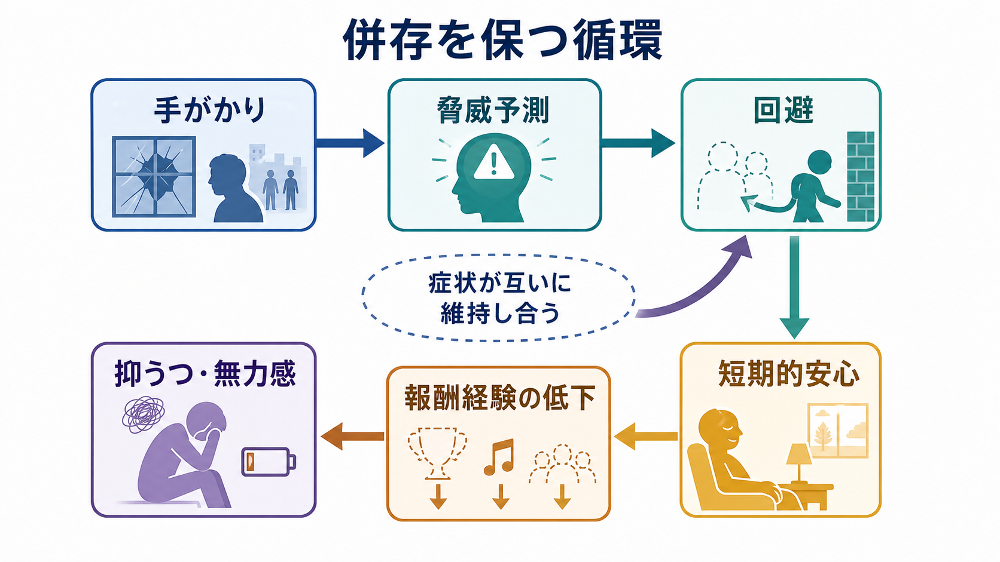
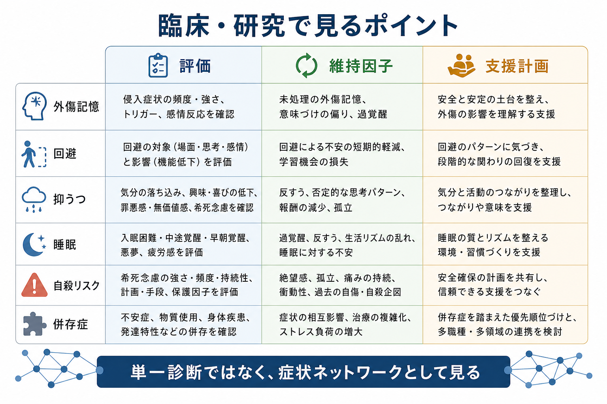

# PTSDとうつ病はどう併存するのか

## 要点

- [[PTSDとは何か|PTSD]] と [[うつ病とは何か|うつ病]] は、単に「たまたま同時にある」だけでなく、外傷記憶、回避、睡眠障害、自己非難、社会的孤立、報酬経験の低下が互いに維持し合う形で併存しやすい。
- メタ解析では、現在の PTSD をもつ人の約半数に現在の [[大うつ病性障害とは何か|大うつ病性障害]] が併存すると推定されている[2]。
- PTSD の「否定的認知と気分の変化」は、罪悪感、無価値感、興味低下、感情麻痺などを含み、うつ病の症状と重なりやすい[1][4]。
- 併存を理解する鍵は、「診断名が2つあるか」だけではなく、[[フラッシュバックとは何か|フラッシュバック]]、[[回避行動とは何か|回避行動]]、睡眠、自己評価、活動性、自殺リスクを同じ時間軸で見ることである。
- 本稿は教育・研究目的の整理であり、個別の診断や治療指示ではない。強い希死念慮、自傷・自殺の危険、生活の急激な破綻がある場合は、地域の救急・専門機関・信頼できる支援者につなぐことが優先される。

## この記事で答える問い

1. PTSD とうつ病は、症状分類の上でどこが重なるのか。
2. 外傷記憶、回避、抑うつ気分は、どのような循環で互いを維持するのか。
3. 臨床・研究では、併存をどのように評価し、どのような誤解を避けるべきか。

## まず結論

PTSD とうつ病の併存は、「外傷後に気分が落ち込む」という一方向の説明だけでは足りない。PTSD では、外傷手がかりが現在の危険のように感じられ、[[侵入思考とは何か|侵入思考]]、悪夢、過覚醒、回避が生じる。回避は短期的には不安を下げるが、長期的には安全を学び直す機会、対人接触、達成感、楽しさを減らす。その結果、孤立、無力感、自己非難、睡眠の乱れが強まり、抑うつが維持される。

一方で、抑うつはエネルギー、集中、睡眠、希望、問題解決能力を低下させるため、外傷記憶への対処や生活再建を難しくする。したがって併存例では、PTSD 症状とうつ症状を別々の箱に入れるより、症状ネットワークとして把握する方が理解しやすい[3]。

## 背景

PTSD は、死、重傷、性的暴力などの外傷的出来事への曝露後に、侵入症状、回避、否定的認知と気分の変化、過覚醒が持続し、苦痛や機能障害をもたらす状態として定義される[1]。うつ病は、抑うつ気分や興味・喜びの低下を中心に、睡眠、食欲、疲労感、集中、罪悪感、希死念慮などがまとまって現れる気分障害である[1]。

両者の併存が重要なのは、頻度が高いだけでなく、苦痛、生活機能障害、身体健康、医療利用、治療計画に影響しやすいからである。Rytwinski らのメタ解析では、57研究・6,670人を対象に、現在の PTSD をもつ人の 52% に現在の大うつ病性障害が併存すると推定された[2]。この数値はサンプル、外傷の種類、軍事・民間集団、対人外傷か自然災害かによって変動するが、「例外的な組み合わせ」ではないことを示している。

## 基本概念

### 症状の重なり

PTSD とうつ病の重なりは、診断基準のレベルでも観察できる。PTSD の「否定的認知と気分」には、持続的な否定的信念、自己や他者への非難、恐怖・罪悪感・恥、興味低下、孤立感、肯定的感情を感じにくいことが含まれる[1]。これらは、うつ病で見られる無価値感、罪悪感、興味・喜びの低下、社会的撤退と近い。

さらに、[[睡眠障害とは何か|睡眠障害]]、集中困難、易刺激性、疲労感は、PTSD の過覚醒やうつ病の身体・認知症状としてどちらにも現れうる。したがって、併存を評価するときは「同じ症状を二重に数えていないか」と「それでも別々の症候群としてのまとまりがあるか」を分けて考える必要がある[3]。

### 併存はアーティファクトだけではない

一部の重なりは診断基準の重複で説明できる。しかし Flory と Yehuda は、PTSD と大うつ病性障害の併存が単なる分類上の人工物ではなく、外傷関連の表現型として理解できる可能性を論じている[3]。つまり、外傷曝露、遺伝・環境リスク、ストレス生理、睡眠、社会的支援、対人関係、自己評価の変化が組み合わさることで、PTSD とうつ病の症状が同時にまとまりやすくなる。

## 仕組み

### 外傷記憶と現在化

PTSD では、外傷記憶が通常の過去の記憶としてだけでなく、現在の危険のように再体験されることがある。音、匂い、場所、身体感覚、対人場面などが手がかりとなり、[[フラッシュバックとは何か|フラッシュバック]]、悪夢、強い情動、身体反応が起きる。これが続くと、本人は「また同じことが起きる」「自分は安全ではない」と感じやすくなる。

この状態では、気分の落ち込みは外傷記憶への自然な反応として始まることもある。しかし、外傷にまつわる意味づけが「自分のせいだ」「もう誰も信用できない」「未来はない」と固定化すると、抑うつ気分や無力感が強まりやすい。PTSD 研究では、恐怖学習、消去学習、扁桃体、海馬、前頭前野、[[HPA軸は精神疾患にどう関わるのか|HPA軸]] などの関与が議論されてきたが、これらは単一原因ではなく、症状を保つ複数の経路として理解するのがよい[6][7]。

### 回避が短期的安心と長期的抑うつをつなぐ

回避は、PTSD とうつ病をつなぐ中心的な維持因子である。外傷を思い出す場所、人、話題、感情、身体感覚を避けると、短期的には不安が下がる。これは本人にとって合理的な自己防衛であり、弱さではない。

ただし回避が長期化すると、安全な場面を安全だと学び直す機会が減る。外出、仕事、学習、人間関係、趣味、運動、睡眠リズムが狭まり、報酬経験が低下する。すると「何をしても変わらない」「自分には価値がない」という抑うつ的な信念が強まり、さらに活動しにくくなる。この循環が、PTSD とうつ病の併存を保つ重要な経路である。

### 睡眠と過覚醒

PTSD では悪夢、過覚醒、警戒、入眠困難、中途覚醒が起きやすい。睡眠不足は、情動調整、注意、記憶の統合、身体疲労に影響し、うつ症状を悪化させる。逆に、うつ病の早朝覚醒、過眠、日中活動低下は、PTSD の手がかりへの過敏性や回避を強めることがある。併存例では [[不眠障害とは何か|不眠]] を単なる付随症状ではなく、症状ネットワークの結節点として見る必要がある[4]。

### 自己非難と恥

外傷後には、「なぜ逃げられなかったのか」「自分が悪かったのではないか」という自己非難が生じることがある。これは、出来事に意味を与えようとする認知的努力の一部でもあるが、固定化すると恥、孤立、援助希求の低下につながる。うつ病の無価値感や罪悪感と結びつくと、PTSD の回避と抑うつの閉じた循環ができる。

## 図解

1枚目は、外傷記憶、回避と安全行動、抑うつ気分が重なる全体像である。2枚目は、手がかり、脅威予測、回避、短期的安心、報酬経験の低下、抑うつ・無力感が循環する仕組みを示す。3枚目は、臨床・研究で評価すべき項目を「評価」「維持因子」「支援計画」に分けた整理である。

## 臨床・研究との接続

### 評価では時間軸を確認する

臨床評価では、外傷曝露、PTSD 症状、抑うつ症状の発症順序を確認する。外傷前から反復するうつ病があったのか、外傷後に抑うつが始まったのか、PTSD 症状の悪化に連動して抑うつが変動するのかで、理解の仕方は変わる。NICE は PTSD 評価で、再体験、回避、過覚醒、解離、否定的認知と気分、機能障害を具体的に尋ねることを推奨している[4]。

### リスク評価を独立した項目として扱う

うつ病が併存する PTSD では、希死念慮、自傷、自殺企図、物質使用、衝動性、孤立、身体疾患、慢性疼痛、生活困窮を丁寧に見る必要がある。これは「危険だから怖い疾患」と一般化するためではなく、支援の優先順位を決めるためである。[[自殺リスク評価では何を聞くべきか|自殺リスク評価]] は、症状理解とは別に、安全確保のための独立した臨床課題として扱う。

### 治療研究では併存を除外しすぎない

治療研究では、併存症を除外すると研究デザインは単純になるが、実臨床から離れやすい。VA/DoD の 2023 年 PTSD 診療ガイドラインは、PTSD の評価・診断・治療、併存状態を含む複雑な提示を扱う実践的な枠組みを示している[5]。また、PTSD にはトラウマ焦点化心理療法が重要な選択肢として位置づけられるが、併存する抑うつ、睡眠、物質使用、身体疾患、本人の希望、安全性を含めて治療計画を組み立てる必要がある[5]。

### 鑑別で見落としやすいもの

PTSD とうつ病に似た症状を示す状態として、[[双極性障害とは何か|双極性障害]]、[[パニック症とは何か|パニック症]]、物質使用、慢性疼痛、睡眠障害、発達特性、解離症状、複雑性 PTSD がある。たとえば不眠、焦燥、集中困難だけを見てうつ病と判断すると、外傷手がかりや回避の役割を見落とすことがある。逆に、外傷歴があるからといって、すべての抑うつを PTSD の一部として扱うと、気分障害としての持続性や再発性を見落とす。

## よくある誤解

### 誤解1: PTSD があるなら、うつ病は二次的な反応にすぎない

外傷後の抑うつが PTSD 症状と連動することは多い。しかし、うつ病としてのまとまり、過去のうつ病エピソード、家族歴、季節性、身体疾患、薬物・物質、双極性障害の可能性は別に評価する必要がある。併存は「主と従」を決めれば終わるものではない。

### 誤解2: うつ症状が強いなら、外傷記憶を扱うべきではない

強い危機状態では安全確保と安定化が優先される。しかし、抑うつがあること自体は、外傷記憶や回避の評価を避ける理由にはならない。むしろ、外傷手がかり、回避、睡眠、孤立、報酬経験の低下がどう結びついているかを見ないと、抑うつを保つ要因を取り逃がすことがある[5]。

### 誤解3: 回避は本人の努力不足である

回避は、危険を避けようとする学習された防衛反応である。問題は、回避が長期化すると生活範囲と報酬経験を狭め、PTSD とうつ病の両方を保つ点にある。本人を責めるのではなく、どの回避が短期的に役立ち、どの回避が長期的に苦痛を増やしているかを見分ける必要がある。

### 誤解4: 併存例では治療が効きにくいだけである

併存は複雑さを増すが、治療不能を意味しない。評価の焦点を、外傷記憶、回避、抑うつ、睡眠、安全、物質使用、身体疾患、社会的支援に分けることで、介入可能な結節点が見えやすくなる。研究上も、併存を「ノイズ」として除外するだけでなく、現実の症状ネットワークとして扱うことが重要である。

## 関連ノート

- [[PTSDとは何か]]
- [[PTSDでは恐怖記憶ネットワークに何が起きているのか]]
- [[うつ病とは何か]]
- [[大うつ病性障害とは何か]]
- [[回避行動とは何か]]
- [[フラッシュバックとは何か]]
- [[侵入思考とは何か]]
- [[睡眠障害とは何か]]
- [[不眠障害とは何か]]
- [[HPA軸は精神疾患にどう関わるのか]]
- [[自殺リスク評価では何を聞くべきか]]

MOC更新候補: `content/00_MOC/` 配下の精神医学、疾患・症候群、トラウマ、気分障害に関する MOC。並列生成ジョブとの競合を避けるため、本稿では MOC 本体は更新しない。

## 理解チェック

1. PTSD とうつ病で重なりやすい症状を3つ挙げられるか。
2. 回避が短期的安心を生む一方で、長期的に抑うつを強める理由を説明できるか。
3. 併存例で、外傷記憶、睡眠、自己非難、社会的孤立、自殺リスクを別々に評価する理由を説明できるか。
4. 「PTSD があるから抑うつはすべて二次的」と断定できない理由を説明できるか。

## 未解決問題

- PTSD とうつ病の併存が、どの程度「診断基準の重なり」なのか、どの程度「外傷関連の独自表現型」なのかは、研究デザインによって見え方が変わる。
- 神経画像、内分泌、炎症、遺伝・エピジェネティクスの知見は増えているが、個人の診断や治療選択に直接使える単一バイオマーカーは限定的である。
- 併存例において、トラウマ焦点化介入、抑うつへの行動活性化、睡眠介入、安全確保、社会的支援をどの順序で組み合わせるかは、症状、リスク、希望、利用可能な資源に依存する。

## 参考文献

[1] American Psychiatric Association. (2022). *Diagnostic and Statistical Manual of Mental Disorders, Fifth Edition, Text Revision (DSM-5-TR)*. American Psychiatric Association Publishing. https://doi.org/10.1176/appi.books.9780890425787

[2] Rytwinski, N. K., Scur, M. D., Feeny, N. C., & Youngstrom, E. A. (2013). The co-occurrence of major depressive disorder among individuals with posttraumatic stress disorder: A meta-analysis. *Journal of Traumatic Stress, 26*(3), 299-309. https://doi.org/10.1002/jts.21814

[3] Flory, J. D., & Yehuda, R. (2015). Comorbidity between post-traumatic stress disorder and major depressive disorder: Alternative explanations and treatment considerations. *Dialogues in Clinical Neuroscience, 17*(2), 141-150. https://doi.org/10.31887/DCNS.2015.17.2/jflory

[4] National Institute for Health and Care Excellence. (2018, updated 2025). *Post-traumatic stress disorder* (NICE guideline NG116). https://www.nice.org.uk/guidance/ng116

[5] U.S. Department of Veterans Affairs & U.S. Department of Defense. (2023). *VA/DoD Clinical Practice Guideline for the Management of Posttraumatic Stress Disorder and Acute Stress Disorder*. https://www.healthquality.va.gov/guidelines/mh/ptsd/

[6] Yehuda, R., Hoge, C. W., McFarlane, A. C., Vermetten, E., Lanius, R. A., Nievergelt, C. M., Hobfoll, S. E., Koenen, K. C., Neylan, T. C., & Hyman, S. E. (2015). Post-traumatic stress disorder. *Nature Reviews Disease Primers, 1*, 15057. https://doi.org/10.1038/nrdp.2015.57

[7] Pitman, R. K., Rasmusson, A. M., Koenen, K. C., Shin, L. M., Orr, S. P., Gilbertson, M. W., Milad, M. R., & Liberzon, I. (2012). Biological studies of post-traumatic stress disorder. *Nature Reviews Neuroscience, 13*, 769-787. https://doi.org/10.1038/nrn3339

[8] Norman, S. B., Hamblen, J. L., & Schnurr, P. P. (2025). *Overview of Psychotherapy for PTSD*. National Center for PTSD, U.S. Department of Veterans Affairs. https://www.ptsd.va.gov/professional/treat/txessentials/overview_therapy.asp
