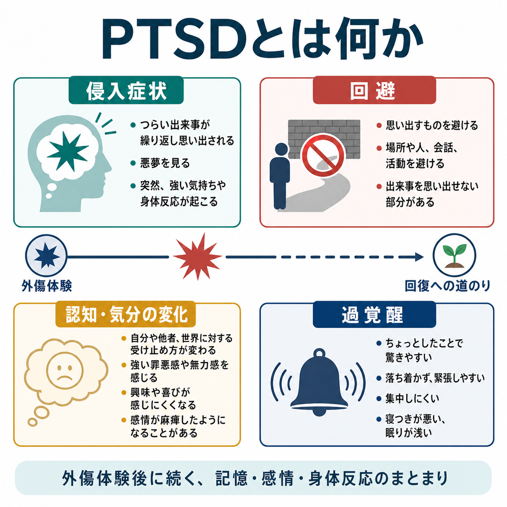
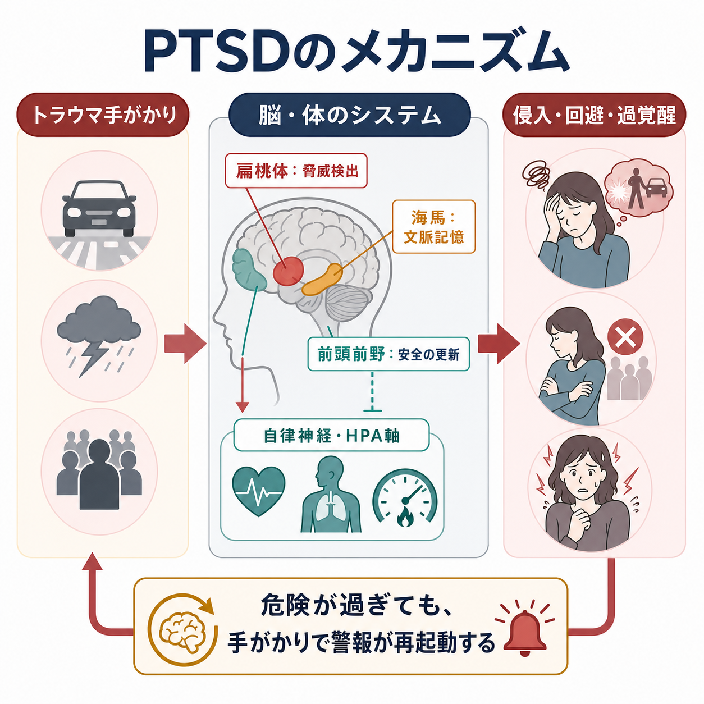
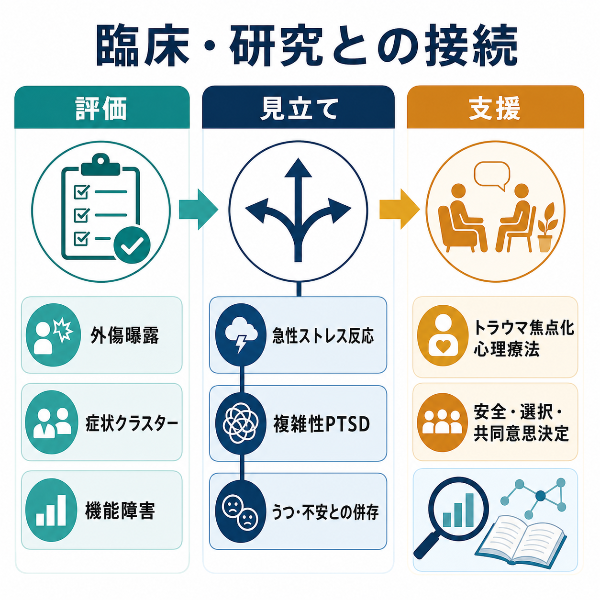

# PTSDとは何か

## 要点

- PTSD（心的外傷後ストレス障害）は、実際または差し迫った死、重傷、性的暴力などの外傷的出来事のあとに、侵入症状、回避、認知・気分の陰性変化、過覚醒が持続し、苦痛や機能障害をもたらす状態である[1][2]。
- 侵入症状には、本人の意思に反してよみがえる記憶、悪夢、[[フラッシュバックとは何か|フラッシュバック]]、手がかりに触れたときの強い心理的・身体的反応が含まれる[2]。
- 回避は短期的には苦痛を下げるが、長期的には「思い出すものは危険だ」という学習を保ち、[[回避行動とは何か|回避行動]]と予期的な[[不安とは何か|不安]]の循環を強める。
- 神経科学的には、扁桃体を中心とする脅威検出、海馬による文脈記憶、前頭前野による安全情報の更新、自律神経・HPA軸の反応が相互に関わると考えられている[4][5][6]。
- 本記事は教育・研究目的の整理であり、個別の診断や治療指示ではない。症状が生活を強く妨げる場合は、専門職による評価が必要である。

## この記事で答える問い

1. PTSD は、単なる「つらい記憶」や「気持ちの弱さ」と何が違うのか。
2. 侵入症状、回避、認知・気分の変化、過覚醒はどのようにつながるのか。
3. 外傷記憶と脅威学習の観点から、どのような仕組みで症状が維持されるのか。
4. 臨床評価・研究・支援では、何を区別して考える必要があるのか。

## まず結論

PTSD は「過去の出来事を忘れられない状態」というより、過去の危険が現在にも続いているかのように、記憶、注意、身体反応、意味づけ、行動が再編成される状態である。トラウマ手がかりに触れると、出来事の断片が侵入し、身体は警報状態になり、本人はそれを避けようとする。避けることで一時的には楽になるが、手がかりが本当に危険なのか、安全に近づけるのかを学び直す機会が減る。

DSM-5-TR では、PTSD は「外傷およびストレス因関連症群」に位置づけられ、外傷曝露、侵入症状、回避、認知・気分の陰性変化、覚醒・反応性の変化、1か月を超える持続、苦痛または機能障害、物質や他の医学的状態では説明されないことが診断上の骨格になる[1][2]。ICD-11 では、再体験、回避、現在の脅威感という3つの中核症状により簡潔に定義される[3]。

## 背景

外傷体験のあとに強い動揺、眠りにくさ、警戒、涙もろさ、出来事を思い出す反応が出ること自体は珍しくない。多くの場合、周囲の安全、休息、社会的支援、時間経過のなかで反応は弱まる。一方で、症状が持続し、仕事、学業、対人関係、育児、セルフケアを妨げる場合、PTSD として評価されることがある[2][7]。

重要なのは、PTSD が「出来事の種類」だけで決まるわけではない点である。同じ出来事でも、年齢、過去の外傷歴、社会的支援、身体的安全、併存する[[うつ病とは何か|うつ病]]や[[不安症群とは何か|不安症群]]、睡眠、物質使用、文化的文脈によって、その後の反応は大きく変わる[4]。したがって臨床では、出来事の詳細を聞くだけでなく、現在の安全、機能障害、併存症、回復資源を含めて評価する。

## 基本概念

### 外傷曝露

PTSD の前提には、実際または差し迫った死、重傷、性的暴力への直接曝露、目撃、近親者・親しい人に起きた出来事を知ること、または職務上反復的に外傷的詳細へ曝露されることが含まれる[2]。ただし、診断基準上の外傷曝露に当てはまるかどうかだけで、その人の苦痛の重要性が決まるわけではない。基準に満たないストレス反応でも、支援や評価が必要な場合はある。

### 侵入症状

侵入症状は、本人が望まないかたちで記憶や感覚が入り込むことである。典型例は、つらい出来事が繰り返し思い出される、悪夢を見る、現在の場面が一時的に外傷場面のように感じられる、音・匂い・場所・身体感覚などの手がかりで強い恐怖や動悸が出る、といった反応である[2]。[[侵入思考とは何か|侵入思考]]に似ているが、PTSD では外傷記憶と結びついた再体験性が中心になる。

### 回避

回避には、出来事を思い出す考えや感情を避ける内的回避と、場所、人、会話、ニュース、匂い、時間帯、交通手段などを避ける外的回避がある[2]。回避は弱さではなく、防衛的な適応として理解できる。しかし、それが生活範囲を狭めたり、危険予測を更新する機会を奪ったりすると、症状維持の要因になる。

### 認知・気分の変化

外傷後には、自分、他者、世界への見方が変化することがある。「自分が悪い」「世界はどこも危険だ」「誰も信じられない」といった持続的な信念、罪悪感、恥、興味の低下、孤立感、肯定的感情の感じにくさが問題になる[2]。これは[[大うつ病性障害とは何か|大うつ病性障害]]と重なって見えることがあり、併存や鑑別が重要になる。

### 過覚醒

過覚醒は、身体と注意が危険に備え続ける状態である。過度の警戒、驚きやすさ、睡眠困難、集中困難、いらだち、危険な行動などが含まれる[2]。[[不眠とは何か|不眠]]や[[パニック症とは何か|パニック症]]に似た身体反応を伴うこともあるが、PTSD では外傷手がかりや現在の脅威感との関係を見る。

## 仕組み

### 脅威学習と安全学習

PTSD の中核には、危険を検出する学習と、安全を再学習する過程のずれがある。外傷体験では、もともと中立だった音、匂い、場所、身体感覚が「危険の手がかり」として結びつく。後に同じ手がかりへ触れると、実際には安全な状況でも、脳と身体が危険時の反応を再起動する[5][6]。

このとき、扁桃体は脅威検出、海馬は出来事の文脈記憶、前頭前野は「今は安全である」という更新や情動調整に関わる。PTSD 研究では、扁桃体や背側前部帯状皮質の過反応、腹内側前頭前野の調整低下、海馬や前部帯状皮質の構造的・機能的差異が繰り返し議論されてきた[5][6]。ただし、これらは個人診断にそのまま使える単一バイオマーカーではない。

### 記憶の断片性と現在化

外傷記憶は、通常の自伝的記憶のように「過去の出来事」として語れる場合もあれば、音、匂い、身体感覚、映像の断片として現在に割り込む場合もある。ICD-11 が「現在に起きているかのような再体験」を中核に置くのは、この現在化が PTSD の臨床像をよく表すためである[3]。

### 身体反応

PTSD では、トラウマ関連手がかりや外傷想起時の心拍、皮膚電気反応、驚愕反応などが高まりやすいことが報告されている[5]。HPA軸については、単純な「慢性的に高コルチゾール」という説明では足りない。PTSD のストレス生理は、外傷の時期、慢性度、性差、併存症、薬物、睡眠、生活環境によって変わる複雑な系として扱う必要がある[4][5]。

## 図解

上の2枚は、症状クラスターと脅威学習の概念図である。3枚目は、臨床評価・見立て・支援の接続を示す。ここでの「支援」は個別治療の指示ではなく、専門職が本人の安全、希望、併存症、生活状況を評価しながら共同で方針を決めるという意味である。

## 臨床・研究との接続

臨床評価では、外傷曝露の有無だけでなく、症状のクラスター、持続期間、機能障害、現在の安全、解離症状、自殺リスク、物質使用、身体疾患、睡眠、併存する抑うつ・不安・疼痛を確認する[7][8]。評価の目的は、本人を外傷記憶に急に近づけることではなく、安全を確保し、現在の困りごとと回復資源を整理することである。

治療研究では、トラウマ焦点化認知行動療法、認知処理療法、持続エクスポージャー、EMDR などの心理療法が主要な選択肢として検討されてきた[7][8]。薬物療法は一部の症状や併存症に役立つ場合があるが、どの方法がよいかは症状、併存症、希望、利用可能性、文化的背景、リスクを踏まえて判断される[8]。

研究上は、PTSD を単一の疾患単位としてだけでなく、侵入、回避、脅威感、解離、罪悪感、睡眠、身体反応、社会的機能といった次元に分けて見ることが重要である。これは、同じ PTSD 診断でも症状の組み合わせや維持要因が異なるためである。

## よくある誤解

### 誤解1: PTSD は弱い人だけがなる

PTSD は性格の弱さではない。外傷曝露、脅威学習、記憶、身体反応、社会的支援、併存症が絡む状態であり、誰にでも起こりうる。回復しにくさを本人の意志だけで説明すると、支援につながる評価を遅らせる。

### 誤解2: つらい出来事を経験すれば必ず PTSD になる

外傷体験後の強い反応はよくあるが、多くの人は時間と支援のなかで回復する。PTSD は、症状が持続し、生活機能を妨げる場合に問題になる[2][7]。

### 誤解3: 忘れれば治る

PTSD の問題は「思い出すか忘れるか」だけではない。手がかりに触れたときの身体反応、危険予測、回避、罪悪感、安全感の更新が関わる。無理に思い出させることも、ただ避け続けることも、どちらも単純な解決ではない。

### 誤解4: PTSD と複雑性PTSDは同じ

ICD-11 では、複雑性PTSDは PTSD の中核症状に加えて、感情調整の困難、否定的自己概念、対人関係の困難を含む状態として区別される[3]。DSM-5-TR とは分類の設計が異なるため、どの分類体系で議論しているかを明確にする必要がある。

## 関連ノート

- [[フラッシュバックとは何か]]
- [[侵入思考とは何か]]
- [[回避行動とは何か]]
- [[不安とは何か]]
- [[不眠とは何か]]
- [[不安症群とは何か]]
- [[うつ病とは何か]]
- [[大うつ病性障害とは何か]]
- [[パニック症とは何か]]

今後の作成候補: 急性ストレス障害とは何か、複雑性PTSDとは何か、トラウマ焦点化認知行動療法とは何か、EMDRとは何か、解離症状とは何か。

MOC 更新候補: `content/00_MOC/` 配下の精神医学、疾患・症候群、症候学、神経科学と精神疾患に関連する MOC。並列生成ジョブとの競合を避けるため、本記事では MOC 本体は更新しない。

## 理解チェック

1. PTSD の4つの主要症状クラスターを説明できるか。
2. 侵入症状と回避が、どのように互いを維持しうるか説明できるか。
3. 扁桃体、海馬、前頭前野を、単一原因ではなく脅威学習ネットワークとして説明できるか。
4. PTSD と、うつ病・不安症・パニック症・複雑性PTSDの重なりと違いを区別して考えられるか。
5. 本記事の内容が教育・研究目的であり、個別診断や治療指示ではない理由を説明できるか。

## 未解決問題

- PTSD の生物学的指標を、個人の診断・予後・治療選択にどこまで使えるか。
- 回避を減らす支援を、本人の安全感と自己決定を損なわずにどう設計するか。
- 複雑性PTSD、解離、発達性トラウマ、文化差を、DSM と ICD の違いを踏まえてどう整理するか。
- 睡眠、疼痛、物質使用、抑うつ、不安などの併存症を含む現実的な治療研究をどう進めるか。

## 参考文献

[1] American Psychiatric Association. (2022). *Diagnostic and Statistical Manual of Mental Disorders, Fifth Edition, Text Revision (DSM-5-TR)*. American Psychiatric Association Publishing. https://doi.org/10.1176/appi.books.9780890425787

[2] National Center for PTSD. (2025). *PTSD and DSM-5*. U.S. Department of Veterans Affairs. https://www.ptsd.va.gov/professional/treat/essentials/dsm5_ptsd.asp

[3] World Health Organization. (2026). *ICD-11 for Mortality and Morbidity Statistics: 6B40 Post traumatic stress disorder; 6B41 Complex post traumatic stress disorder*. https://icd.who.int/browse/2025-01/mms/en#2070699808

[4] Yehuda, R., Hoge, C. W., McFarlane, A. C., Vermetten, E., Lanius, R. A., Nievergelt, C. M., Hobfoll, S. E., Koenen, K. C., Neylan, T. C., & Hyman, S. E. (2015). Post-traumatic stress disorder. *Nature Reviews Disease Primers, 1*, 15057. https://doi.org/10.1038/nrdp.2015.57

[5] Pitman, R. K., Rasmusson, A. M., Koenen, K. C., Shin, L. M., Orr, S. P., Gilbertson, M. W., Milad, M. R., & Liberzon, I. (2012). Biological studies of post-traumatic stress disorder. *Nature Reviews Neuroscience, 13*, 769-787. https://doi.org/10.1038/nrn3339

[6] Fenster, R. J., Lebois, L. A. M., Ressler, K. J., & Suh, J. (2018). Brain circuit dysfunction in post-traumatic stress disorder: from mouse to man. *Nature Reviews Neuroscience, 19*, 535-551. https://doi.org/10.1038/s41583-018-0039-7

[7] National Institute for Health and Care Excellence. (2018, updated). *Post-traumatic stress disorder* (NICE guideline NG116). https://www.nice.org.uk/guidance/ng116

[8] U.S. Department of Veterans Affairs & U.S. Department of Defense. (2023). *VA/DoD Clinical Practice Guideline for Management of Posttraumatic Stress Disorder and Acute Stress Disorder*. https://www.healthquality.va.gov/guidelines/MH/ptsd/
