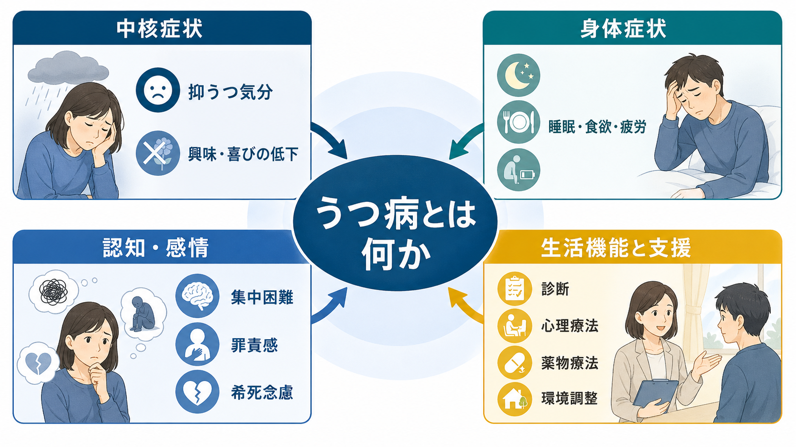
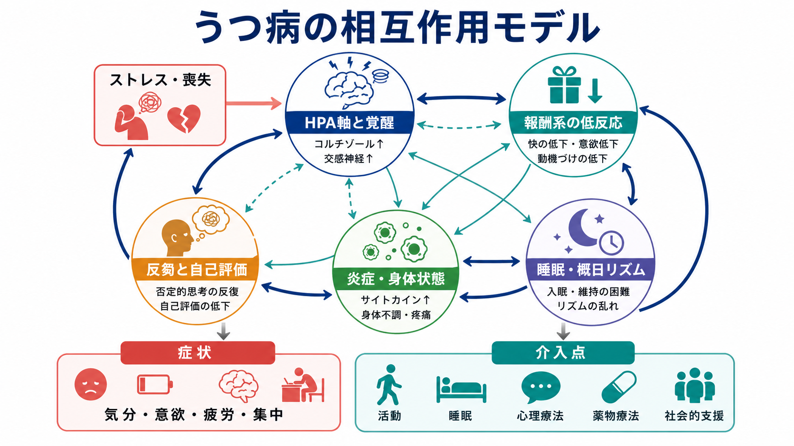
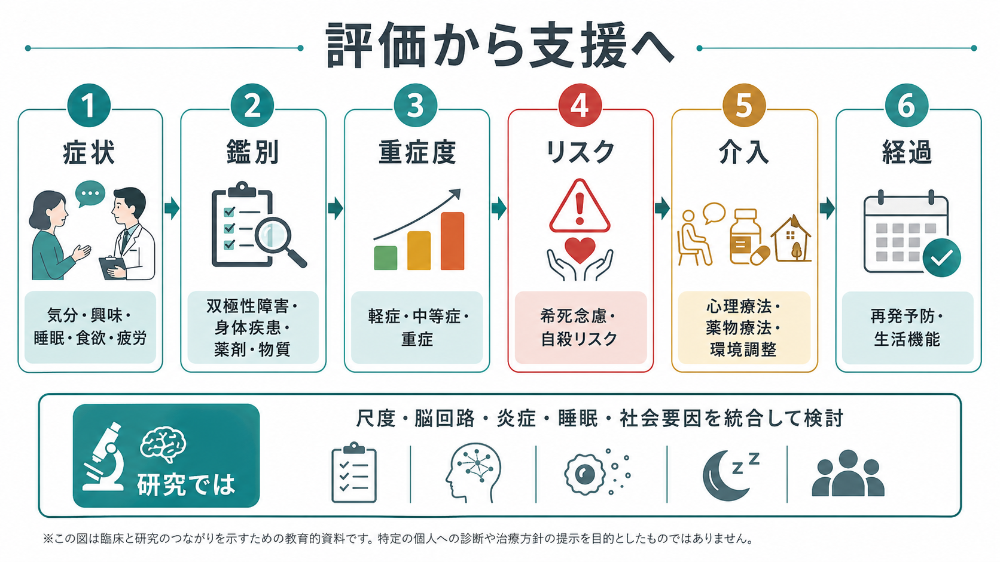

# うつ病とは何か

## 要点

- うつ病は、単なる「落ち込み」ではなく、抑うつ気分または興味・喜びの低下を中心に、睡眠、食欲、疲労、集中困難、罪責感、希死念慮などがまとまって持続し、生活機能を損なう状態である[1][2]。
- 診断は血液検査や画像検査だけで決まるものではなく、症状の持続、重症度、機能障害、躁病・軽躁病、身体疾患、薬剤・物質、喪失反応などの鑑別を含む臨床評価で行う[2][8]。
- 仕組みは「セロトニン不足」の一語では説明できない。ストレス、遺伝的脆弱性、報酬系、HPA軸、睡眠・概日リズム、炎症、認知的反芻、社会的孤立などが相互作用する多因子疾患として理解するのが現在の見方である[3]。
- 心理療法、薬物療法、生活・環境調整、社会的支援、重症例での身体療法など、複数の介入を状態に応じて組み合わせる[5][6][7]。

## この記事で答える問い

1. うつ病は、普通の悲しみや一時的な不調と何が違うのか。
2. どのような症状が「うつ病らしさ」を作るのか。
3. 脳・身体・心理・社会のどの水準で理解できるのか。
4. 臨床や研究では、何を評価し、何と鑑別するのか。

## まず結論

うつ病は、気分だけの病気ではない。中核には抑うつ気分と興味・喜びの低下があるが、実際には睡眠、食欲、疲労、痛み、精神運動、注意・記憶・意思決定、自己評価、将来予測、対人関係、職業・学業機能まで広く影響する[1][4]。そのため、大うつ病性障害を理解するときは、「悲しいかどうか」だけでなく、「以前のように感じ、考え、動き、つながる力がどの程度失われているか」を見る必要がある。

ただし、この記事は教育・研究目的の整理であり、個別の診断や治療指示ではない。希死念慮や自殺の危険がある場合は、地域の救急・危機介入窓口、医療機関、信頼できる支援者につなぐことが優先される。

## 背景

世界保健機関は、うつ病を世界的に頻度が高く、生活、仕事、学業、対人関係に大きな影響を与え、自殺にもつながりうる精神疾患として位置づけている[1]。WHO の説明では、抑うつエピソードは多くの日に一日中近く続き、少なくとも 2 週間以上持続する点で、日常的な気分変動と区別される[1]。

臨床的に重要なのは、うつ病が「気持ちの弱さ」や「性格の問題」ではないことだ。強いストレスや喪失、虐待、孤立、身体疾患、遺伝的背景、睡眠リズムの破綻などが重なり、脳と身体の調整系がうまく働かなくなる状態として考えられる[1][3]。同時に、発症後の活動低下、社会的撤退、反芻、睡眠悪化がさらに症状を保つことがある。

## 基本概念

### 中核症状

うつ病の中核は、抑うつ気分と興味・喜びの低下である。DSM-5 の大うつ病エピソードでは、同じ 2 週間に 5 つ以上の症状があり、そのうち少なくとも 1 つが抑うつ気分または興味・喜びの著しい低下であることが求められる[2]。症状には、体重・食欲の変化、不眠または過眠、精神運動焦燥または制止、疲労、無価値感または過剰な罪責感、思考力・集中力の低下、死についての反復思考などが含まれる[2]。

ここで重要なのは、症状の数だけでなく、以前の機能からの変化と生活への影響を見ることである。本人が「悲しい」と言わない場合でも、楽しめない、動けない、仕事が進まない、身体のだるさや痛みが前景に出る、怒りっぽさや焦燥が目立つ、といった形で現れることがある[4]。

### 気分障害としての位置づけ

うつ病は、気分障害の代表的な状態だが、双極性障害の抑うつエピソードとは治療方針が異なる。過去の躁状態・軽躁状態、家族歴、抗うつ薬による気分高揚、睡眠欲求低下を伴う活動性上昇などは、鑑別で重要になる。

また、抑うつ症状はうつ病だけに特異的ではない。身体疾患に伴う抑うつ症状、薬剤性うつ症状、PTSD との併存、不安症との併存、認知症や ADHD との鑑別など、背景疾患や併存症を含めて評価する。

## 仕組み

うつ病の仕組みは、単一の原因に還元できない。Nature Reviews Disease Primers のレビューは、大うつ病性障害を遺伝的、環境的、心理的、生物学的要因の組み合わせとして説明しており、1 つの確立した経路だけで十分に説明できる疾患ではないと整理している[3]。

### ストレスとHPA軸

慢性的なストレス、喪失、虐待、社会的孤立は、脳の脅威検出や覚醒調整を変化させる。[[HPA軸は精神疾患にどう関わるのか]]で扱う視床下部-下垂体-副腎系は、ストレス反応の中心であり、睡眠、炎症、代謝、情動調整ともつながる。HPA軸の変化は全てのうつ病に一様に見られるわけではないが、ストレス脆弱性を理解する重要な枠組みである[3]。

### 報酬系と意欲

興味・喜びの低下は、単に「気分が沈む」こととは異なる。報酬予測、快感、努力、意思決定に関わる回路の変化によって、以前なら自然に向かえた活動にエネルギーを割けなくなる。これは [[報酬系の異常はうつ病をどう説明するのか]]、[[報酬系とは何か]]、[[行動活性化とは何か]]と直結する。行動活性化が有効である理由の一部は、活動と報酬経験の循環を回復させる点にある[5][6]。

### 神経伝達物質・可塑性・炎症

セロトニン、ノルアドレナリン、ドパミンはうつ病治療薬の作用点として重要だが、[[セロトニン仮説はうつ病をどこまで説明できるのか]]で整理されるように、神経伝達物質の単純な不足モデルだけでは不十分である[3]。近年は、神経可塑性、グルタミン酸系、BDNF、ミクログリア、炎症、腸内環境、代謝、睡眠などを含む広いモデルが検討されている[3]。[[炎症仮説はうつ病をどう説明するのか]]は、その一部を説明する仮説であり、全員に当てはまる診断マーカーではない。

### 認知と反芻

うつ病では、注意が否定的情報に引き寄せられやすくなり、自己評価が低下し、将来を悲観的に予測しやすくなる。反芻は「考えて解決しようとしている」のに、実際には気分を悪化させ、活動を止め、睡眠を乱すことがある。認知行動療法は、この認知・行動の循環に介入する代表的な心理療法である[5][6]。

## 図解

上の 2 枚の図は、うつ病を「症状の束」と「相互作用するメカニズム」として見るための図である。1 枚目は、気分症状だけでなく、身体症状、認知症状、生活機能、支援を同じ平面に置いている。2 枚目は、ストレス、HPA軸、報酬系、睡眠、炎症、反芻が一方向ではなく循環的に影響することを示している。

3 枚目は、臨床・研究で評価する項目の流れである。実際の診療では、症状の有無だけでなく、重症度、リスク、鑑別、本人の希望、これまでの経過、身体合併症、社会的資源をあわせて判断する[5][8]。

## 臨床・研究との接続

### 評価

うつ病の評価では、抑うつ気分、興味・喜びの低下、睡眠、食欲、疲労、精神運動、集中力、罪責感、死に関する考えを確認する[2][4]。PHQ-9 などの尺度はスクリーニングや経過把握に役立つが、尺度だけで診断が完結するわけではない[8]。[[精神状態診察MSEとは何か]]、[[精神科診断面接で尺度をどう使うか]]、[[精神科で重症度をどう判断するか]]と合わせて読むと理解しやすい。

自殺リスクの評価は必須である。[[希死念慮とは何か]]、[[自殺念慮と自殺企図は何が違うのか]]、[[自殺リスク評価では何を聞くべきか]]では、死にたい気持ち、具体的計画、手段へのアクセス、過去の自傷・自殺企図、保護因子、支援者とのつながりを分けて見る。

### 治療と支援

NICE ガイドラインは、成人うつ病の同定、治療、再発予防、慢性うつ病、精神病性うつ病などを扱い、本人の選好と共同意思決定を重視している[5]。心理療法では、認知行動療法、行動活性化、対人関係療法、問題解決療法などにエビデンスがある[1][6]。薬物療法では、成人の急性期大うつ病に対する抗うつ薬の有効性と忍容性を比較したネットワークメタ解析があり、薬剤間の違いはあるが、選択は症状、併存症、副作用、相互作用、本人の希望を含めて行われる[7]。

重症例、精神病症状を伴う例、治療抵抗性うつ病では、電気けいれん療法、反復経頭蓋磁気刺激、ケタミン関連治療などが検討されることがある。これらは [[TMSはうつ病治療でどの神経回路を狙っているのか]]、[[ケタミンはなぜ速効性抗うつ作用を示すのか]]と関連する。

### 研究

研究では、症状評価、脳画像、睡眠、炎症マーカー、遺伝、生活習慣、社会的要因、治療反応を統合し、うつ病の異質性を分けようとしている[3]。ただし、現時点で単独の脳画像や血液検査だけで「うつ病」と確定できる臨床バイオマーカーは限られている。研究知見は、個別診断の近道ではなく、症状群をより精密に理解するための地図として使うのがよい。

## よくある誤解

### 「うつ病は気の持ちようで治る」

うつ病では、気分、身体、認知、行動、社会機能が同時に変化する。休養や周囲の理解は重要だが、「頑張れば治る」と本人の意思だけに帰す説明は不正確で、支援につながる機会を遅らせる。

### 「セロトニンだけが原因である」

セロトニン系は治療薬の作用点として重要だが、うつ病全体を単純な化学物質不足として説明することはできない[3]。報酬系、ストレス系、睡眠、炎症、認知、社会環境を含めた多層モデルが必要である。

### 「悲しくなければうつ病ではない」

悲しみをはっきり訴えない場合でも、楽しめない、疲れやすい、集中できない、眠れない、身体症状が続く、焦燥が強い、怒りっぽい、生活機能が落ちるなどの形で現れることがある[4]。

### 「抗うつ薬だけ、または心理療法だけが正解である」

軽症、中等症、重症、再発性、慢性、併存症、本人の希望によって適した組み合わせは変わる[5]。心理療法にも薬物療法にもエビデンスがあり、どちらか一方を絶対視するより、状態に応じて選択肢を調整することが重要である[6][7]。

## 関連ノート

- [[HPA軸は精神疾患にどう関わるのか]]
- [[報酬系の異常はうつ病をどう説明するのか]]
- [[セロトニン仮説はうつ病をどこまで説明できるのか]]
- [[炎症仮説はうつ病をどう説明するのか]]
- [[希死念慮とは何か]]
- [[自殺リスク評価では何を聞くべきか]]
- [[TMSはうつ病治療でどの神経回路を狙っているのか]]
- [[ケタミンはなぜ速効性抗うつ作用を示すのか]]
- [[行動活性化とは何か]]

## 理解チェック

1. うつ病の中核症状 2 つは何か。
2. 抑うつ症状があっても、双極性障害、身体疾患、薬剤・物質の影響を確認する必要があるのはなぜか。
3. 「セロトニン不足」だけではうつ病を説明しきれない理由を、報酬系、ストレス、睡眠、炎症、認知のいずれか 2 つを使って説明できるか。
4. 尺度は何に役立ち、何を代替できないか。

## 参考文献

[1] World Health Organization. (2025). *Depressive disorder (depression)*. https://www.who.int/news-room/fact-sheets/detail/depression

[2] National Center for Biotechnology Information. *DSM-5 “Major” Depressive Episode* table, Endotext. https://www.ncbi.nlm.nih.gov/books/NBK498652/table/depress-diab.T.dsm5__major_depressive_ep/

[3] Marx, W., Penninx, B. W. J. H., Solmi, M., Furukawa, T. A., Firth, J., Carvalho, A. F., & Berk, M. (2023). Major depressive disorder. *Nature Reviews Disease Primers, 9*, 44. https://doi.org/10.1038/s41572-023-00454-1

[4] National Institute of Mental Health. *Depression*. https://www.nimh.nih.gov/health/publications/depression

[5] National Institute for Health and Care Excellence. (2022). *Depression in adults: treatment and management* (NICE Guideline NG222). https://www.nice.org.uk/guidance/ng222

[6] Cuijpers, P., Miguel, C., Harrer, M., Plessen, C. Y., Ciharova, M., Papola, D., Ebert, D., & Karyotaki, E. (2023). Psychological treatment of depression: A systematic overview of a meta-analytic research domain. *Journal of Affective Disorders, 335*, 141-151. https://doi.org/10.1016/j.jad.2023.05.011

[7] Cipriani, A., Furukawa, T. A., Salanti, G., Chaimani, A., Atkinson, L. Z., Ogawa, Y., Leucht, S., Ruhe, H. G., Turner, E. H., Higgins, J. P. T., Egger, M., Takeshima, N., Hayasaka, Y., Imai, H., Shinohara, K., Tajika, A., Ioannidis, J. P. A., & Geddes, J. R. (2018). Comparative efficacy and acceptability of 21 antidepressant drugs for the acute treatment of adults with major depressive disorder: A systematic review and network meta-analysis. *The Lancet, 391*(10128), 1357-1366. https://doi.org/10.1016/S0140-6736(17)32802-7

[8] Bains, N., & Abdijadid, S. (2023). *Major Depressive Disorder*. StatPearls. https://www.ncbi.nlm.nih.gov/books/NBK559078/

## 未解決問題

- うつ病の異質性を、症状、脳回路、炎症、睡眠、生活史、社会的要因からどのように層別化できるか。
- どの人に、どの心理療法・薬物療法・身体療法・社会的支援が最も合うかを、早期に予測できるか。
- 再発予防では、寛解後の睡眠、活動、対人関係、職場・学校環境、身体疾患管理をどう統合的に支援するか。

## MOC更新候補

- `content/00_MOC/` 配下の精神医学・気分障害関連 MOC に、本記事 `[[うつ病とは何か]]` を追加する候補。
- 並列ジョブとの競合を避けるため、本タスクでは MOC ファイル自体は更新しない。
