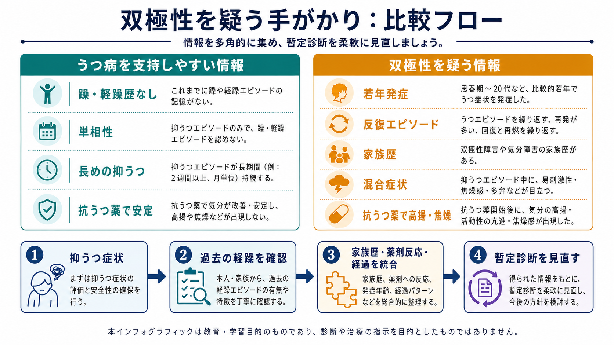
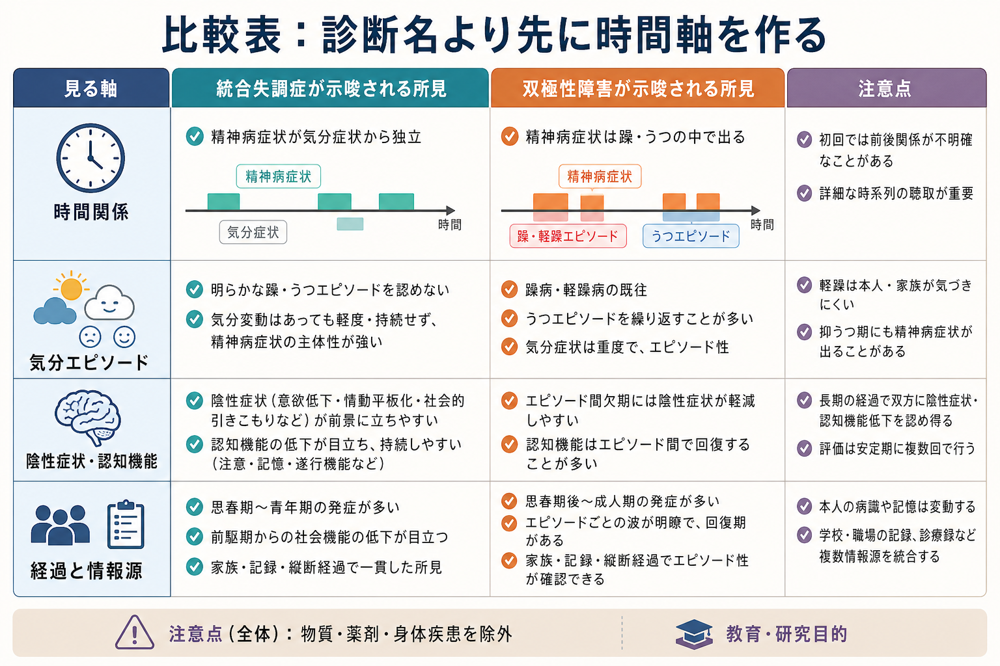

# うつ病と認知症はどう鑑別するのか

## 要点

- [[うつ病とは何か|うつ病]]と[[認知症とは何か|認知症]]の鑑別は、1回の検査点数で決めるものではなく、発症様式、経過、本人の訴え、家族から見た変化、生活機能、身体疾患、薬剤、せん妄、感覚障害を組み合わせて判断する[1][2]。
- うつ病では注意、処理速度、遂行機能が落ち、本人は「できない」「覚えられない」と強く苦痛を訴えることがある。一方で認知症では、近時記憶、見当識、言語、実行機能、社会的判断などが徐々に崩れ、家族や周囲が先に変化に気づくことが多い[3][4]。
- 「仮性認知症」は正式な単一診断名ではなく、精神疾患、とくにうつ病が認知症のように見える臨床像を指す歴史的概念である。ただし、改善すればすべて安心という意味ではなく、後に認知症が明らかになる例もある[3][5]。
- 高齢発症のうつ、血管リスク、認知機能低下を伴ううつは、認知症の前駆症状、併存症、リスク因子、あるいは独立したうつ病のいずれとしても現れうる[5][6]。
- 実務上は、抑うつを評価しつつ、認知症を急いで断定せず、可逆的要因を除外し、治療・環境調整後の再評価を計画することが重要である[1][2][7]。

## この記事で答える問い

1. うつ病による認知機能低下と認知症は、どこが似ていてどこが違うのか。
2. 「仮性認知症」という言葉を、現在の臨床ではどう扱えばよいのか。
3. 評価では、病歴、家族情報、認知機能検査、身体評価、薬剤確認、フォローアップをどう組み合わせるのか。
4. うつ病が改善した後も認知症リスクを見続けるべきなのはなぜか。

## まず結論

うつ病と認知症を分ける最も実用的な軸は、「気分症状があるか」だけではない。重要なのは、**いつ始まり、どの速度で変わり、何ができなくなり、誰が変化に気づき、時間と介入でどう変わるか**である。

典型的には、うつ病関連の認知機能低下では、発症が比較的はっきりし、本人の苦痛や「分からない」という訴えが強く、注意・処理速度・努力の維持が目立って落ちることがある。認知症では、本人の自覚が乏しいこともあり、家族が「同じ質問が増えた」「薬や金銭管理が崩れた」「道に迷う」といった生活上の変化に気づくことが多い。ただしこれは目安であり、例外は多い。[[アルツハイマー型認知症とは何か|アルツハイマー型認知症]]に抑うつが併存することも、[[レビー小体型認知症とは何か|レビー小体型認知症]]や[[前頭側頭型認知症とは何か|前頭側頭型認知症]]が気分・意欲・行動の変化として始まることもある。

## 背景

高齢者の抑うつ症状と認知機能低下は、臨床上しばしば重なる。うつ病では集中困難、判断力低下、精神運動制止、不眠、食欲低下、疲労感があり、本人も家族も「認知症ではないか」と感じることがある。一方、認知症でも初期から意欲低下、不安、抑うつ、アパシー、睡眠リズムの乱れが出ることがある。

NICEの認知症ガイドラインは、認知症が疑われる初期評価で、本人と可能なら本人をよく知る人から、認知症状、行動・心理症状、生活への影響を聴取し、身体診察、血液・尿検査、認知機能検査を用いて可逆的要因を除外することを勧めている[1]。とくに、せん妄、うつ病、感覚障害、抗コリン負荷の高い薬剤などは、認知症と誤認されるか、認知症の上に重なって見えるため、鑑別の中心に置く必要がある[1]。

## 基本概念

### 仮性認知症

「仮性認知症」は、精神疾患が神経変性疾患のような認知症像をまねる状態を指す歴史的な呼び名である。多くはうつ病を想定して使われるが、躁状態、精神病性障害、転換症状などが似た臨床像を作ることもある[3]。この言葉の利点は、「認知症に見えても治療可能・修正可能な要因を探す」という警戒を促す点にある。

ただし、現在はこの語をそのまま診断名のように使うと誤解を招きやすい。うつ病が認知症の前駆症状として現れている場合、うつ病と認知症が併存している場合、うつ病が改善しても認知機能低下が残る場合があるからである[3][5]。したがって、本文では「仮性認知症」を、**うつ病などによる認知症様の見え方**として扱う。

### 高齢者うつ

高齢者の[[大うつ病性障害とは何か|大うつ病性障害]]では、悲しみよりも意欲低下、身体症状、不安、睡眠障害、食欲低下、焦燥、活動量低下が前景に出ることがある。認知面では、注意の持続、情報処理速度、遂行機能、検索努力が落ちやすい。本人が「頭が働かない」と訴えるとき、その背景には気分症状、睡眠、痛み、孤立、薬剤、身体疾患が重なっていることが多い。

### 認知症と軽度認知障害

認知症は、記憶だけでなく、注意、実行機能、言語、視空間認知、社会的認知などの低下が、日常生活の自立を妨げる状態である[8]。[[軽度認知障害とは何か|軽度認知障害]]は、認知機能低下が客観的に示されるが、基本的な日常生活の自立が大きく崩れていない段階を指す。AANのMCIガイドラインは、MCIが進行・安定・改善のいずれも取りうる状態であり、機能障害、修正可能なリスク因子、神経精神症状、経時的評価を重視する[2]。

## 仕組み

### うつ病が認知症のように見える経路

うつ病では、注意が否定的情報に引き寄せられ、処理速度が落ち、課題への持続的努力が保ちにくくなる。精神運動制止、睡眠障害、疲労、痛み、不安が重なると、記憶そのものが壊れているというより、情報を十分に入力・検索できない状態になりやすい。神経心理学的には、記憶固定よりも注意・遂行機能・処理速度の低下が目立つことがある。

### 認知症がうつ病のように見える経路

認知症、とくに初期の神経変性疾患では、失敗体験への反応として抑うつや不安が出る場合もあれば、脳ネットワークの変化そのものがアパシー、意欲低下、感情鈍麻、焦燥として現れる場合もある。[[血管性認知症とは何か|血管性認知症]]では遂行機能・処理速度の低下と抑うつが重なりやすく、前頭側頭型認知症では気分障害よりも行動変化・社会的判断の障害として見えることがある。

### 双方向性と併存

高齢期のうつ病は、後の認知症リスクと関連する。メタ解析では、晩年期うつはアルツハイマー病および血管性認知症の発症リスク上昇と関連していた[6]。また、縦断研究では、晩年期うつのうち遅発例では一部の認知領域でより速い低下が示された[5]。これは「うつ病が必ず認知症になる」という意味ではない。うつ病がリスク因子、前駆症状、併存症、あるいは独立した病態として多様に現れる、という意味で読む必要がある。

## 図解

上の1枚目は、鑑別を「症状名」ではなく、病歴、生活機能、検査、可逆的要因、再評価の組み合わせとして見る地図である。2枚目は、うつ病と認知症が一方向に並ぶのではなく、注意・遂行機能、処理速度、記憶固定、アパシー、血管性変化、睡眠、薬剤、身体疾患を介して重なり合うことを示している。

3枚目は、評価の順序を実務用に整理したものである。最初に「本人が何を訴えるか」だけでなく、「周囲から見て何が変わったか」を確認し、その後に認知機能検査、抑うつ評価、せん妄・身体疾患・薬剤・感覚障害の確認、経時的再評価へ進む。

## 臨床・研究との接続

### 鑑別で見るポイント

| 観点 | うつ病関連の認知機能低下で目立ちやすい所見 | 認知症で目立ちやすい所見 |
|---|---|---|
| 発症 | 比較的はっきりした時期に始まることがある | 数か月から年単位で徐々に進むことが多い |
| 本人の訴え | 苦痛が強く、「できない」「分からない」と訴える | 自覚が乏しい、または失敗を取り繕うことがある |
| 家族情報 | 気分、睡眠、活動量、食欲の変化が目立つ | 同じ質問、予定・服薬・金銭管理の失敗が目立つ |
| 認知領域 | 注意、処理速度、遂行機能、検索努力 | 近時記憶、見当識、言語、視空間、遂行機能 |
| 生活機能 | 意欲低下で活動が止まるが、促しで改善することがある | 複雑なIADLから崩れ、代償が必要になる |
| 経過 | 治療、睡眠改善、環境調整で改善することがある | 進行性、または段階的悪化を示すことが多い |

この表はチェックリストではなく、仮説を立てるための比較である。認知症にうつ病が併存すれば、両方の列の特徴が同時に現れる。

### 評価の順序

1. 本人と家族・介護者から病歴を取る。本人の主観的苦痛と、家族から見た客観的変化を分けて記録する[1]。
2. 発症時期、進行速度、日内変動、急性の意識変動を確認する。急に悪化し、注意や意識が変動する場合は、まずせん妄を疑う[1]。
3. ADL/IADLを具体的行動で見る。服薬管理、金銭管理、料理、買い物、交通機関、予定管理、電話・スマートフォン利用などを確認する。
4. 抑うつ症状、希死念慮、不安、不眠、食欲、痛み、孤立、喪失体験を評価する。[[身体疾患による気分障害とは何か|身体疾患による気分障害]]や[[薬剤性うつ症状とは何か|薬剤性うつ症状]]も視野に入れる。
5. 認知機能検査を行う。短時間スクリーニングが正常でも認知症を除外できず、点数低下だけで認知症とも言えない[1]。
6. 身体診察、血液・尿検査、薬剤レビュー、視力・聴力、睡眠、アルコール、栄養、感染、内分泌、ビタミン欠乏を確認する[1]。
7. 抑うつや睡眠、薬剤、身体疾患への介入後に再評価する。改善の程度、残存する認知機能低下、生活機能の回復を追う[2][3]。

### 検査の読み方

認知機能検査は、単独で鑑別を決めるものではない。NICEは、認知機能検査が正常でも認知症を除外しないこと、また必要に応じて神経心理検査を検討することを示している[1]。[[MoCAとは何か]]や[[ミニ精神状態検査MMSEとは何か]]のような検査は、領域ごとの弱さを把握し、経時変化を見るための材料として使う。

抑うつが強い人では、課題への取り組みが不安定になり、反応が遅く、途中で諦めやすいことがある。認知症では、誤答の質、取り繕い、見当識、遅延再生、手続きの理解、生活歴との不一致が重要になる。検査中の態度も情報だが、態度だけで決めるのは危険である。

## よくある誤解

### 「うつ病があるなら認知症ではない」

誤りである。認知症にうつ病が併存することも、認知症の初期に抑うつ・不安・アパシーが出ることもある。うつ病の診断がついても、生活機能の変化や認知機能低下の経過を見続ける必要がある。

### 「認知症検査が低ければ認知症である」

誤りである。検査点数は、教育歴、言語、文化、睡眠、痛み、不安、うつ、薬剤、聴力・視力、せん妄、身体疾患の影響を受ける。低得点は精査の入口であり、診断の終点ではない[1]。

### 「仮性認知症は治れば終わりである」

不十分である。抑うつが改善して認知機能も回復する例はあるが、認知機能低下が残る例や、後に神経変性疾患が明らかになる例もある[3][5]。そのため、治療反応を見た後も、残存症状と経時変化を追う。

### 「本人が困っているならうつ病、困っていないなら認知症」

単純化しすぎである。病識の保たれ方は疾患、病期、性格、教育歴、家族関係、失敗への反応によって変わる。本人の苦痛と周囲の観察を両方見る必要がある。

## 関連ノート

- [[うつ病とは何か]]
- [[大うつ病性障害とは何か]]
- [[認知症とは何か]]
- [[軽度認知障害とは何か]]
- [[アルツハイマー型認知症とは何か]]
- [[レビー小体型認知症とは何か]]
- [[前頭側頭型認知症とは何か]]
- [[血管性認知症とは何か]]
- [[身体疾患による気分障害とは何か]]
- [[薬剤性うつ症状とは何か]]

MOC更新候補: `content/00_MOC/` 配下の精神医学、認知症、鑑別診断、老年精神医学関連MOCに追加する。

## 理解チェック

1. うつ病と認知症の鑑別で、本人の訴えだけでなく家族・介護者情報が重要なのはなぜか。
2. 「仮性認知症」という言葉を診断名として扱うと、どのような誤解が生じるか。
3. 認知機能検査が正常でも認知症を除外できない理由は何か。
4. 抑うつ症状が改善した後も、認知機能と生活機能を再評価する必要があるのはなぜか。

## 参考文献

[1] National Institute for Health and Care Excellence. (2018). *Dementia: assessment, management and support for people living with dementia and their carers* (NICE guideline NG97). https://www.nice.org.uk/guidance/ng97

[2] Petersen, R. C., Lopez, O., Armstrong, M. J., et al. (2018). Practice guideline update summary: Mild cognitive impairment. *Neurology, 90*(3), 126-135. https://doi.org/10.1212/WNL.0000000000004826

[3] Brodaty, H., & Connors, M. H. (2020). Pseudodementia, pseudo-pseudodementia, and pseudodepression. *Alzheimer's & Dementia: Diagnosis, Assessment & Disease Monitoring, 12*(1), e12027. https://doi.org/10.1002/dad2.12027

[4] Pozzi, F. E., Licciardo, D., Musarra, M., et al. (2022). Depressive pseudodementia with reversible AD-like brain hypometabolism: A case report and a review of the literature. *Journal of Personalized Medicine, 12*(10), 1665. https://doi.org/10.3390/jpm12101665

[5] Ly, M., Karim, H. T., Becker, J. T., et al. (2021). Late-life depression and increased risk of dementia: A longitudinal cohort study. *Translational Psychiatry, 11*, 147. https://doi.org/10.1038/s41398-021-01269-y

[6] Diniz, B. S., Butters, M. A., Albert, S. M., Dew, M. A., & Reynolds, C. F. (2013). Late-life depression and risk of vascular dementia and Alzheimer's disease: Systematic review and meta-analysis of community-based cohort studies. *The British Journal of Psychiatry, 202*(5), 329-335. https://doi.org/10.1192/bjp.bp.112.118307

[7] National Institute for Health and Care Excellence. (2022). *Depression in adults: treatment and management* (NICE guideline NG222). https://www.nice.org.uk/guidance/ng222

[8] World Health Organization. (2026). *Dementia*. https://www.who.int/health-topics/dementia

## 未解決問題

- うつ病が認知症のリスク因子なのか、前駆症状なのか、併存症なのかを、個別例でどう見分けるかはなお難しい。
- 抑うつ改善後に残る認知機能低下を、どの時点で神経変性疾患の精査へつなぐべきかは、年齢、生活機能、進行速度、本人の希望、地域資源によって変わる。
- 認知症バイオマーカーは研究と臨床応用が進んでいるが、抑うつ症状を伴う高齢者の鑑別にどこまで標準的に組み込むかは、医療体制や適応による。
