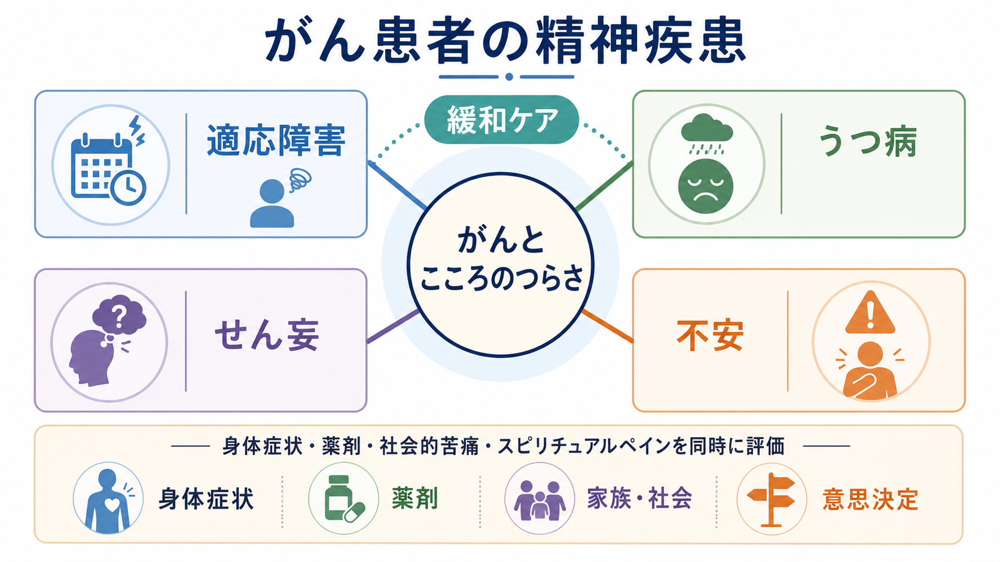
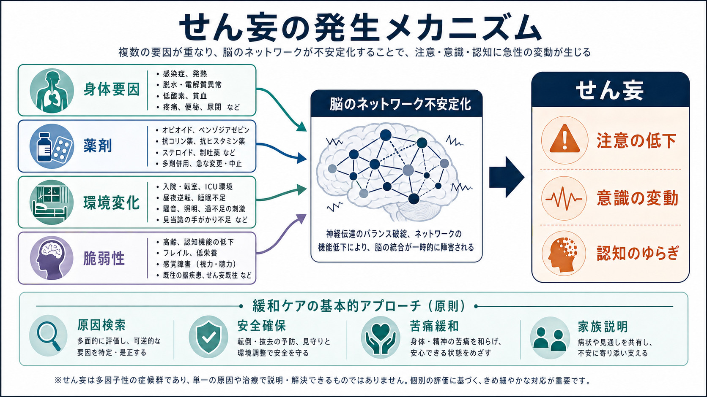
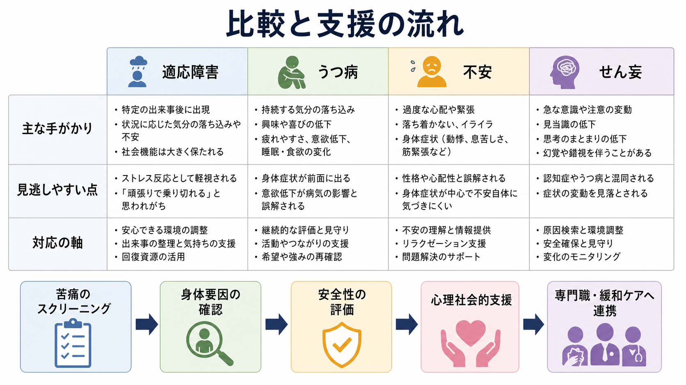

# がん患者の精神疾患には何があるのか

## 要点

- がん患者の精神症状は、診断や治療への反応だけでなく、疼痛、倦怠感、感染、代謝異常、薬剤、入院環境、家族・経済・意思決定の負荷が重なって生じる。
- 緩和ケアで特に重要なのは、適応障害、[[うつ病とは何か|うつ病]]・[[大うつ病性障害とは何か|大うつ病性障害]]、せん妄、不安である。
- 面接だけで「気持ちの問題」と決めず、身体要因と薬剤性要因を同時に評価する。特にせん妄は急性の意識・注意・認知の変動として扱う。
- 本ノートは教育・研究目的の整理であり、個別の診断や治療指示ではない。実臨床では主治医、緩和ケアチーム、精神科・心療内科、看護、心理、薬剤、ソーシャルワークの連携が前提になる。

## この記事で答える問い

1. がん患者で頻度が高く、緩和ケアで見逃しやすい精神疾患・精神症状には何があるのか。
2. 適応障害、うつ病、せん妄、不安は、どのように見分けて考えるとよいのか。
3. 精神症状を「こころだけの問題」にしないために、どのような評価の視点が必要か。

## まず結論

がん患者の精神疾患は、「がんになったからつらい」という一文では足りない。実際には、診断告知、再発、治療選択、身体症状、薬剤、入院環境、家族役割、仕事・経済、死や喪失への不安が、患者ごとに異なる組み合わせで重なる。日本サイコオンコロジー学会・日本がんサポーティブケア学会の「気持ちのつらさガイドライン」は、不安、抑うつ、がん再発恐怖を含む精神心理的苦痛を、すべてのがん医療者が扱うべきケア対象として位置づけている[1]。

したがって、緩和ケアでの実用的な分類は次の4つである。

| 領域 | 主な特徴 | 緩和ケアでの注意点 |
|---|---|---|
| 適応障害 | 診断、再発、治療変更などのストレス因に反応して、不安・抑うつ・行動変化が出る | 「当然の反応」として放置せず、生活機能や意思決定への影響を見る |
| うつ病 | 持続する抑うつ、興味・喜びの低下、希死念慮、罪責感、絶望感など | 食欲低下・不眠・倦怠感はがん症状とも重なるため、心理症状と機能低下を丁寧に見る |
| せん妄 | 急性発症、日内変動、注意障害、意識水準・認知の変動 | 身体疾患・薬剤・感染・脱水・低酸素などの評価が優先される |
| 不安 | 予期不安、再発恐怖、検査・治療への恐怖、パニック様症状など | 情報不足、疼痛、呼吸苦、薬剤、過去のトラウマ体験を確認する |

## 背景

がん医療では、生存期間や腫瘍制御だけでなく、生活の質、意思決定、家族関係、仕事、ケアの場所、終末期の過ごし方が同時に問題になる。このため精神症状は、がん治療の「副次的な問題」ではなく、治療継続、症状緩和、意思決定能力、家族支援に直結する臨床課題である。

NCCN Distress Management Guidelines は、がん患者の心理社会的問題を早期に同定し、必要な心理社会的資源へつなげるための標準的枠組みを示している。2026年版の概要でも、苦痛への対応は腫瘍医、看護師、薬剤師、ソーシャルワーカー、チャプレン、精神保健専門職を含む多職種の課題として扱われている[2]。NCI PDQ も、がんに伴う心理社会的苦痛を正常な適応反応から、適応障害、閾値下の症状、診断可能な精神疾患へ続く連続体として整理している[3]。

疫学的には、精神症状の頻度は測定方法によって大きく変わる。Mitchell らの面接診断に限定したメタ解析では、緩和ケア場面のDSM/ICD基準によるうつ病は約16.5%、適応障害は約15.4%、不安障害は約9.8%であり、腫瘍・血液腫瘍領域でも適応障害、うつ病、不安が一定の頻度でみられた[4]。重要なのは、うつ病だけを探すのではなく、適応障害や不安を含む「気持ちのつらさ」の広がりとして捉える点である。

## 基本概念

### 適応障害

適応障害は、がん告知、再発、治療変更、機能低下、療養場所の変更など、同定できるストレス因に反応して生じる。不安、抑うつ、怒り、涙もろさ、受診回避、治療選択の停滞などとして現れることがある。NCI PDQ は、適応障害を、ストレス因への反応として生じ、より重い大うつ病や全般不安症ほどではないが、苦痛や機能障害を伴う状態として説明している[3]。

臨床的には、「がんなら落ち込んで当然」と「精神疾患として扱うべき苦痛」の境界が問題になる。手がかりは、苦痛の強さ、持続、生活機能、治療参加、家族関係、安全性への影響である。

### うつ病

がん患者のうつ病では、[[うつ病とは何か|うつ病]]の中核症状である持続する抑うつ気分、興味・喜びの低下、絶望感、罪責感、希死念慮が重要である。一方で、食欲低下、不眠、体重減少、倦怠感、集中困難は、がんそのもの、治療副作用、疼痛、不眠、貧血、内分泌異常、薬剤でも生じる。

そのため、身体症状だけでうつ病を判断すると過剰診断にも過少診断にもなる。特に緩和ケアでは、「何がつらいか」「何がまだ大切か」「楽しみや安心が完全に失われているか」「死にたい気持ちは痛みや孤立の表現か、具体的な自殺リスクか」を分けて確認する。

### せん妄

せん妄は、急性発症、日内変動、注意障害、意識水準や認知の変動を特徴とする症候群である。がん患者では進行がん、感染、脱水、低酸素、電解質異常、肝腎機能障害、脳転移、疼痛、オピオイドやベンゾジアゼピン、抗コリン薬、ステロイドなどが関与しうる。

ESMO の成人がん患者せん妄ガイドラインは、診断はDSMまたはICD基準に基づく訓練された医療者の臨床評価で行うべきだとし、せん妄は患者本人だけでなく家族やケア提供者にも強い苦痛をもたらすと述べている[5]。鑑別では、[[せん妄と認知症はどう違うのか]]も参照される。

### 不安

不安は、検査結果への不安、再発恐怖、治療副作用への恐怖、痛みや呼吸苦への予期不安、家族を残す不安、経済的不安などとして現れる。[[不安症群とは何か|不安症群]]や[[全般不安症とは何か|全般不安症]]の診断基準に達する場合もあれば、がんの状況に応じた強い心理反応として理解される場合もある。

注意すべきなのは、不安が身体症状を増幅するだけでなく、身体症状が不安を生む点である。呼吸苦、疼痛、悪心、動悸、甲状腺機能異常、ステロイド、カフェイン、離脱症状などを同時に評価する。

## 仕組み

がん患者の精神症状は、心理的ストレスだけで説明できない。少なくとも次の4層を重ねて考える。

1. 身体層: 疼痛、呼吸苦、悪心、倦怠感、睡眠障害、感染、貧血、低酸素、脱水、代謝異常。
2. 薬剤層: オピオイド、ベンゾジアゼピン、抗コリン薬、制吐薬、ステロイド、分子標的薬、免疫療法関連の内分泌異常など。関連ノートとして[[オピオイド使用障害とは何か]]、[[ステロイド精神病とは何か]]がある。
3. 心理層: 喪失、予期悲嘆、再発恐怖、身体像の変化、役割喪失、治療選択の葛藤。
4. 社会・実存層: 家族、介護、仕事、経済、孤立、価値観、死生観、スピリチュアルペイン。

せん妄では身体層と薬剤層が特に重要であり、うつ病や不安では心理層と社会層が目立つことが多い。しかし実際には、痛みが眠りを壊し、眠れなさが不安を増やし、不安が食欲低下や治療回避を強めるように、層同士は循環する。

## 図解

| 見分ける軸 | 適応障害 | うつ病 | せん妄 | 不安 |
|---|---|---|---|---|
| 時間経過 | ストレス因の後に出現 | 2週間以上持続することが多い | 急性・変動性 | 状況依存から持続性まで幅がある |
| 中核 | ストレスへの反応と機能障害 | 抑うつ、興味・喜びの低下、絶望感 | 注意障害、意識・認知の変動 | 過度の心配、恐怖、緊張 |
| 見逃し | 「当然」とされる | 身体症状に隠れる | 認知症・うつ病と混同 | 性格や心配性とされる |
| 初期対応 | 出来事の整理、情報提供、環境調整 | 安全性評価、心理社会的支援、必要時専門連携 | 原因検索、安全確保、環境調整、家族説明 | 身体要因確認、情報整理、安心できる関わり |

## 臨床・研究との接続

緩和ケアでの精神症状評価は、単に診断名を付ける作業ではない。苦痛のスクリーニング、身体要因の評価、安全性の確認、心理社会的支援、専門職への連携を段階的に行う。NCI PDQ は、Distress Thermometer を0から10の単項目スクリーニングとして紹介し、問題リストと組み合わせて過去1週間の苦痛を確認する方法を説明している[3]。スクリーニングは診断そのものではないが、会話の入口になる。

ASCO の成人がんサバイバーにおける不安・抑うつ管理ガイドライン更新では、症状の重症度に応じて、教育、心理社会的介入、認知行動療法、行動活性化、マインドフルネス、身体活動、薬物療法を段階的に選ぶ stepped-care model が推奨されている[6]。これは、軽症にも重症にも同じ介入を当てるのではなく、苦痛の強さ、希望、アクセス、身体状態に合わせて支援を調整する考え方である。

終末期や進行がんでは、うつ病、適応障害、不安、せん妄の診断は、意思決定能力、鎮静、疼痛緩和、家族ケア、療養場所の選択と密接に関係する。Miovic と Block は、進行がんの精神疾患を、症状緩和・意思決定・家族支援の文脈で扱う必要があると整理している[7]。

## よくある誤解

### 「がんなのだから落ち込むのは当然で、支援はいらない」

悲しみや不安が自然な反応であることと、支援が不要であることは別である。適応障害やうつ病は、苦痛、生活機能、治療参加、安全性に影響する。

### 「うつ病は食欲低下や不眠で判断できる」

がん患者では食欲低下、不眠、倦怠感が身体疾患や治療副作用と重なる。抑うつ気分、興味・喜びの低下、絶望感、罪責感、希死念慮、生活機能の変化を合わせて見る。

### 「せん妄は認知症が急に悪くなったもの」

せん妄は急性・変動性の注意と意識の障害であり、[[せん妄と認知症はどう違うのか|認知症との鑑別]]が重要である。特に低活動型せん妄は、静かに見えるため見逃されやすい。

### 「不安は性格の問題である」

不安は情報不足、疼痛、呼吸苦、薬剤、過去の医療体験、家族・経済問題から生じることがある。性格と決めつけると、修正可能な要因を見落とす。

## 関連ノート

- [[うつ病とは何か]]
- [[大うつ病性障害とは何か]]
- [[せん妄と認知症はどう違うのか]]
- [[不安症群とは何か]]
- [[全般不安症とは何か]]
- [[ステロイド精神病とは何か]]
- [[オピオイド使用障害とは何か]]

## MOC更新候補

- `content/00_MOC/MOC｜精神医学.md`
- `content/00_MOC/MOC｜臨床実践・治療.md`
- `content/00_MOC/MOC｜症候学.md`

## 理解チェック

1. がん患者のうつ病評価で、身体症状だけに頼るとどのような問題が起こるか。
2. せん妄を疑う時間経過と症状の特徴は何か。
3. 適応障害を「当然の反応」として見逃さないために、どの機能領域を確認するか。
4. 不安を評価するとき、心理的要因以外に確認すべき身体・薬剤要因は何か。

## 参考文献

[1] 日本サイコオンコロジー学会. 気持ちのつらさガイドライン 2024年版. https://jpos-society.org/guideline/emotional-hardship/

[2] Fann, J. R., Vanderlan, J., Brewer, B. W., et al. (2026). NCCN Guidelines Insights: Distress Management, Version 1.2026. *Journal of the National Comprehensive Cancer Network*. https://education.nccn.org/Apr2026

[3] National Cancer Institute. Adjustment to Cancer: Anxiety and Distress (PDQ) - Health Professional Version. https://www.cancer.gov/about-cancer/coping/feelings/anxiety-distress-hp-pdq

[4] Mitchell, A. J., Chan, M., Bhatti, H., Halton, M., Grassi, L., Johansen, C., & Meader, N. (2011). Prevalence of depression, anxiety, and adjustment disorder in oncological, haematological, and palliative-care settings: a meta-analysis of 94 interview-based studies. *The Lancet Oncology, 12*(2), 160-174. https://doi.org/10.1016/S1470-2045(11)70002-X

[5] Bush, S. H., Lawlor, P. G., Ryan, K., Centeno, C., Lucchesi, M., Kanji, S., Siddiqi, N., Morandi, A., Davis, D. H. J., Laurent, M., Schofield, N., Barallat, E., & Ripamonti, C. I. (2018). Delirium in adult cancer patients: ESMO Clinical Practice Guidelines. *Annals of Oncology, 29*(Suppl 4), iv143-iv165. https://doi.org/10.1093/annonc/mdy147

[6] Andersen, B. L., Lacchetti, C., Ashing, K., et al. (2023). Management of Anxiety and Depression in Adult Survivors of Cancer: ASCO Guideline Update. *Journal of Clinical Oncology, 41*(18), 3426-3453. https://doi.org/10.1200/JCO.23.00293

[7] Miovic, M., & Block, S. (2007). Psychiatric disorders in advanced cancer. *Cancer, 110*(8), 1665-1676. https://doi.org/10.1002/cncr.22980

## 未解決問題

- がん種、病期、治療段階ごとに、適応障害・うつ病・不安・せん妄の最適なスクリーニング間隔はどの程度異なるのか。
- 低活動型せん妄を在宅・外来で早期に見つける実装方法は、どの程度標準化できるのか。
- 精神症状への stepped care を、日本のがん診療体制と地域差のなかでどう実装するか。

## 更新ログ

- 2026-04-28: 初版作成。適応障害、うつ病、せん妄、不安を緩和ケアの観点から整理し、生成インフォグラフィック3枚を挿入。
