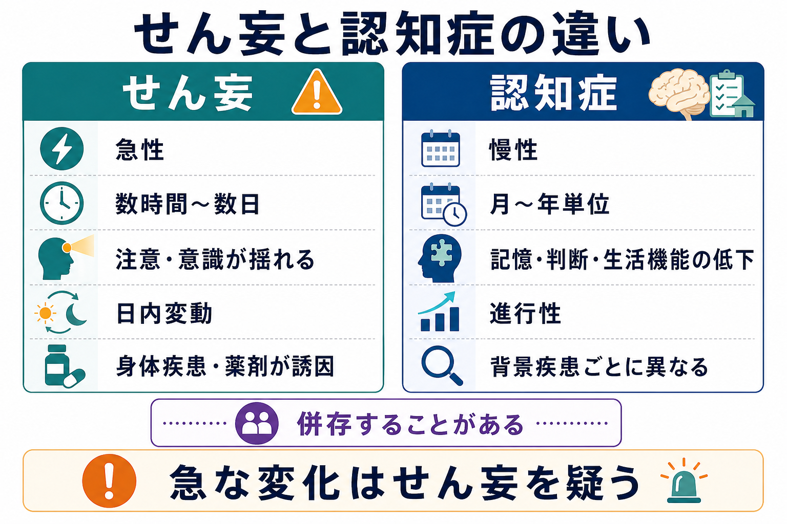
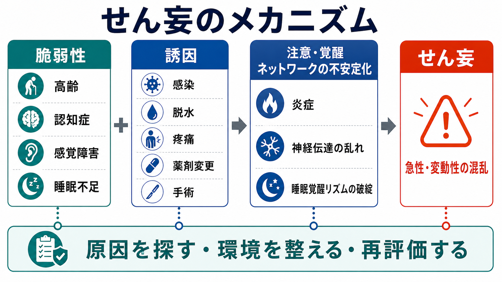
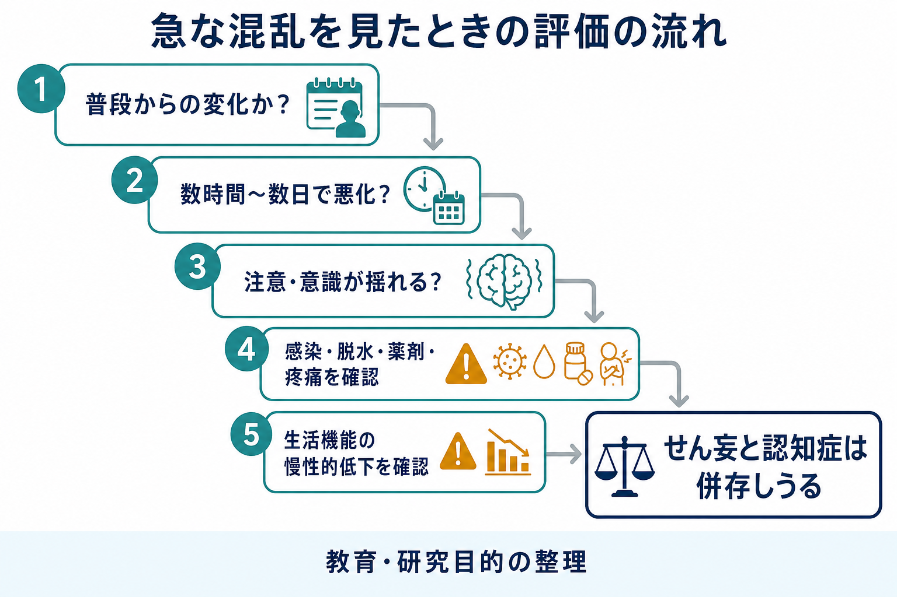

# せん妄と認知症はどう違うのか

## 要点

- せん妄は、数時間から数日のうちに出現し、注意や意識水準が一日の中でも揺れやすい急性の脳機能不全である[1][2]。
- 認知症は、記憶、実行機能、言語、判断、社会的認知などの低下が月から年単位で進み、日常生活の自立に影響する慢性の症候群である[4][5]。
- せん妄では「急に変わった」「ぼんやりして注意が続かない」「夕方から夜に悪い」「身体疾患・薬剤・脱水・感染などの誘因がある」を重視する[1][3]。
- 認知症では「以前から少しずつ変わってきた」「生活管理や判断の失敗が増えた」「本人の普段の状態と比べて持続的に低下している」を重視する[4][6]。
- 両者は排他的ではない。認知症はせん妄の主要なリスク因子であり、せん妄はその後の認知低下や認知症リスクと関連する[2][7]。

## この記事で答える問い

1. せん妄と認知症は、症状のどこが似ていて、どこが違うのか。
2. 「急にぼけたように見える」場面で、まず何を見るべきか。
3. 認知症のある人にせん妄が重なると、なぜ見分けにくくなるのか。
4. 教育・研究目的で理解するとき、どのような病態モデルが役に立つのか。

## まず結論

せん妄と認知症の最も実用的な違いは、**時間経過、注意、意識水準、変動性、普段の生活機能**にある。せん妄は「急性に始まり、注意と意識が揺れる状態」であり、認知症は「慢性に進み、複数の認知領域と生活機能が低下する状態」である[1][4]。

ただし、現実の臨床では単純な二分法では足りない。[[認知症とは何か]]で扱う慢性の認知低下が背景にある人ほど、感染、脱水、手術、薬剤変更、睡眠障害などを契機にせん妄を起こしやすい。したがって「認知症だから仕方ない」と決めつけず、急な変化と日内変動があれば、せん妄を疑って原因を探す必要がある[2][3]。本記事は教育・研究目的の整理であり、個別の診断や治療指示を行うものではない。

## 背景

せん妄と認知症は、どちらも「いつもと違って話がかみ合わない」「記憶が曖昧」「落ち着かない」「幻覚のような訴えがある」と見えることがある。そのため、家族や支援者の目には同じ「ぼけ」「混乱」として映りやすい。しかし、医学的には見ている現象がかなり違う。

せん妄は、身体疾患や環境変化を背景にした急性の脳機能不全として理解される。NICE ガイドラインは、高齢、認知障害、重症疾患、股関節骨折などをリスク因子として評価し、急な変化や変動する混乱を見逃さないことを重視している[3]。一方、WHO は認知症を、複数の疾患や損傷により記憶、思考、日常活動の能力が影響を受ける症候群として説明している[4]。

この違いは実践上大きい。せん妄は、背景に感染、脱水、低酸素、疼痛、便秘、尿閉、薬剤、アルコール離脱、睡眠覚醒の乱れなどがあることが多く、急な悪化として扱う必要がある[1][3]。認知症では、病型、進行段階、生活機能、意思決定支援、介護負担、社会資源の調整が中心課題になりやすい[5][6]。

## 基本概念

### せん妄

せん妄は、注意と意識・覚醒の障害が急性に出現し、短時間のうちに変動する状態である。典型的には、話しかけても注意が続かない、会話の筋を追えない、場所や時間がわからない、昼夜逆転する、夕方から夜に悪化する、幻視や被害的な解釈が出る、といった形をとる[1][2]。

DSM 系の診断概念でも、せん妄では注意と気づきの障害、急性発症、日内変動、追加の認知障害、身体疾患・物質・薬剤などとの関連が重視される[1]。このため、[[振戦せん妄とは何か]]や[[アルコール離脱とは何か]]のように、物質離脱と結びつくタイプも、より広いせん妄理解の中に位置づけられる。

### 認知症

認知症は、単一の病名ではなく、脳の疾患や損傷によって複数の認知機能が低下し、日常生活の自立に影響する症候群である[4][5]。記憶だけでなく、計画、判断、注意、言語、視空間認知、社会的認知、行動変化が問題になることもある。

[[神経認知障害群とは何か]]の枠組みでいえば、認知症に相当する状態は、認知機能低下が生活上の自立を妨げる段階として理解できる。[[軽度認知障害とは何か]]では、認知機能の低下があっても日常生活の自立が概ね保たれる段階が問題になる。[[アルツハイマー型認知症とは何か]]、[[レビー小体型認知症とは何か]]、[[血管性認知症とは何か]]のように、背景病態によって症状の出方は異なる。

## 仕組み

### せん妄は「脆弱性 × 誘因」で起こりやすい

せん妄は、脳の予備力が低下した状態に、身体ストレスや環境変化が重なったときに起こりやすい。高齢、既存の認知症、感覚障害、睡眠不足、重症疾患などは脆弱性を高め、感染、脱水、手術、疼痛、薬剤変更、低酸素、便秘、尿閉などは誘因になりうる[2][3]。

病態は単一ではない。炎症、神経伝達の乱れ、ストレス反応、睡眠覚醒リズムの破綻、神経ネットワークの効率低下などが組み合わさり、注意を保つ仕組みや覚醒水準の調整が不安定になると考えられている[2]。このため、せん妄は「精神症状」だけでなく、身体状態と脳機能の急性変化として捉える必要がある。

### 認知症は慢性の神経認知ネットワーク障害として進む

認知症では、疾患ごとに異なる病理が、脳内ネットワークの機能を持続的に損なう。たとえばアルツハイマー病ではアミロイド、タウ、シナプス障害、神経細胞障害が研究されており、血管性認知症では脳血管障害や白質病変、レビー小体型認知症ではレビー小体病理と注意・覚醒・視覚認知の変動が重要になる[5][6]。

したがって、認知症は「記憶の病気」とだけ見ると狭すぎる。本人の生活史、できていたことの変化、金銭管理、服薬管理、調理、移動、対人判断、趣味、睡眠、気分、行動の変化を含めて評価する必要がある[5]。

## 図解

次の図は、鑑別を単一の症状名ではなく、発症時期、進行速度、せん妄評価、認知機能、薬剤・身体疾患・感覚障害、治療反応と再評価という流れで見るための整理である。

| 観点 | せん妄 | 認知症 |
|---|---|---|
| 発症 | 数時間から数日で急に始まることが多い | 月から年単位で徐々に目立つことが多い |
| 変動 | 日内変動が強い。夕方から夜に悪化しやすい | 比較的持続的。ただし病型により変動もある |
| 注意 | 注意を保つ、切り替える、追跡することが難しい | 初期は記憶や実行機能が目立つことが多いが、注意も低下しうる |
| 意識・覚醒 | ぼんやりする、過覚醒、傾眠などが揺れる | 典型的には意識水準は保たれやすい |
| 背景要因 | 感染、脱水、疼痛、薬剤、手術、離脱、睡眠障害など | 神経変性、血管障害、レビー小体病理など疾患ごとに異なる |
| 評価の入口 | 「急に変わったか」「普段と違うか」「注意が保てるか」 | 「以前からの変化か」「生活機能がどう変わったか」 |
| 両者の関係 | 認知症があると起こりやすい | せん妄が重なると急に悪化したように見える |

## 臨床・研究との接続

臨床で重要なのは、急な変化を「認知症が進んだ」と即断しないことである。NICE は、せん妄リスクのある人で、認知機能、知覚、身体機能、社会行動の急な変化や変動があれば、せん妄の可能性を評価することを勧めている[3]。これは、病棟、救急、介護施設、在宅支援のいずれでも重要である。

研究面では、せん妄と認知症の関係は双方向的に扱われる。既存の認知症はせん妄のリスクを高める。一方、せん妄を経験した人では、その後の認知低下や認知症発症との関連が報告されている[7]。ただし、せん妄が直接に神経変性を進めるのか、もともとの脳脆弱性を明らかにする指標なのか、あるいはその両方なのかは、研究上の重要な論点である。

認知症研究では、Lancet Commission が、教育、聴力、血圧、喫煙、糖尿病、身体活動、社会的孤立、大気汚染など、修正可能なリスク因子を公衆衛生の観点から整理している[8]。せん妄研究では、予防、早期発見、身体要因の同定、非薬物的ケア、転帰評価が中心課題になりやすい[2][3]。

## よくある誤解

### 「急に認知症になった」

急に混乱した場合、まずせん妄を考える。認知症は急に始まるというより、以前からの低下が生活上の失敗として徐々に見えてくることが多い。もちろん脳卒中や外傷などで急に認知機能が変わることはあるため、急性変化では身体疾患を含めた評価が必要である。

### 「認知症があるなら、混乱しても仕方ない」

誤りである。認知症のある人ほどせん妄を起こしやすい。急に注意が保てない、傾眠と興奮が揺れる、幻視が出る、夜間に悪化する、食事や水分が落ちた、薬が変わった、といった変化があれば、背景要因を探す視点が必要である[2][3]。

### 「幻覚があるなら認知症ではなく精神病である」

これも単純化しすぎである。せん妄では幻視や錯覚が出ることがある。[[レビー小体型認知症とは何か]]でも、幻視、認知の変動、パーキンソニズム、レム睡眠行動障害などが重要になる。[[うつ病とは何か]]や精神病性障害との鑑別でも、時間経過、意識、注意、身体要因、普段の機能を合わせて見る。

### 「検査で認知機能が悪ければ認知症である」

検査点だけでは決まらない。せん妄、睡眠不足、感覚障害、痛み、不安、教育歴、言語、文化、薬剤、身体疾患は検査成績に影響する。認知症では、検査結果だけでなく、本人の生活機能と以前からの変化を重視する[5][6]。

## 関連ノート

- [[神経認知障害群とは何か]]
- [[認知症とは何か]]
- [[軽度認知障害とは何か]]
- [[アルツハイマー型認知症とは何か]]
- [[レビー小体型認知症とは何か]]
- [[血管性認知症とは何か]]
- [[振戦せん妄とは何か]]
- [[アルコール離脱とは何か]]
- [[睡眠覚醒障害群とは何か]]
- [[うつ病とは何か]]

### MOC更新候補

- `content/00_MOC/` 配下の精神医学、神経認知障害、認知症、臨床評価に関する MOC への追加候補。
- 並列ジョブとの競合を避けるため、本記事では MOC 本体の更新は行わない。

### 今後の作成候補

- せん妄とは何か
- 低活動型せん妄とは何か
- せん妄の評価尺度には何があるのか
- 認知症のある人のせん妄をどう見分けるのか
- 薬剤性せん妄とは何か

## 理解チェック

1. せん妄と認知症を最初に分けるとき、時間経過と変動性では何を見るか。
2. 「注意が保てない」ことは、なぜせん妄を疑う手がかりになるか。
3. 認知症のある人で、急に夜間の混乱が強くなったとき、どのような背景要因を考えるか。
4. 認知症の評価で、検査点だけでなく生活機能と普段の状態を確認する理由は何か。

## 未解決問題

- せん妄が長期の認知低下を直接促進するのか、それとも脳脆弱性の表れなのかは、研究デザインによって解釈が分かれる。
- 低活動型せん妄は見逃されやすく、認知症や抑うつ、疲労として扱われることがある。
- 認知症の病型ごとに、せん妄の出方、回復過程、長期転帰がどの程度異なるかは、さらに整理が必要である。
- 急性期医療、介護施設、在宅で同じ評価枠組みをどこまで共有できるかは、実装上の課題である。

## 参考文献

[1] Huang J. Overview of Delirium and Dementia. *MSD Manual Professional Edition*. https://www.msdmanuals.com/professional/neurologic-disorders/delirium-and-dementia/overview-of-delirium-and-dementia

[2] Inouye SK, Westendorp RGJ, Saczynski JS. Delirium in elderly people. *Lancet*. 2014;383(9920):911-922. https://doi.org/10.1016/S0140-6736(13)60688-1

[3] National Institute for Health and Care Excellence. Delirium: prevention, diagnosis and management in hospital and long-term care. NICE guideline CG103. https://www.nice.org.uk/guidance/cg103

[4] World Health Organization. Dementia. Fact sheet. 31 March 2025. https://www.who.int/news-room/fact-sheets/detail/dementia

[5] National Institute on Aging. What Is Dementia? Symptoms, Types, and Diagnosis. https://www.nia.nih.gov/health/alzheimers-and-dementia/what-dementia-symptoms-types-and-diagnosis

[6] Huang J. Dementia. *MSD Manual Professional Edition*. https://www.msdmanuals.com/professional/neurologic-disorders/delirium-and-dementia/dementia

[7] Fong TG, Davis D, Growdon ME, Albuquerque A, Inouye SK. The interface between delirium and dementia in elderly adults. *Lancet Neurology*. 2015;14(8):823-832. https://doi.org/10.1016/S1474-4422(15)00101-5

[8] Livingston G, Huntley J, Liu KY, et al. Dementia prevention, intervention, and care: 2024 report of the Lancet standing Commission. *Lancet*. 2024;404(10452):572-628. https://doi.org/10.1016/S0140-6736(24)01296-0
