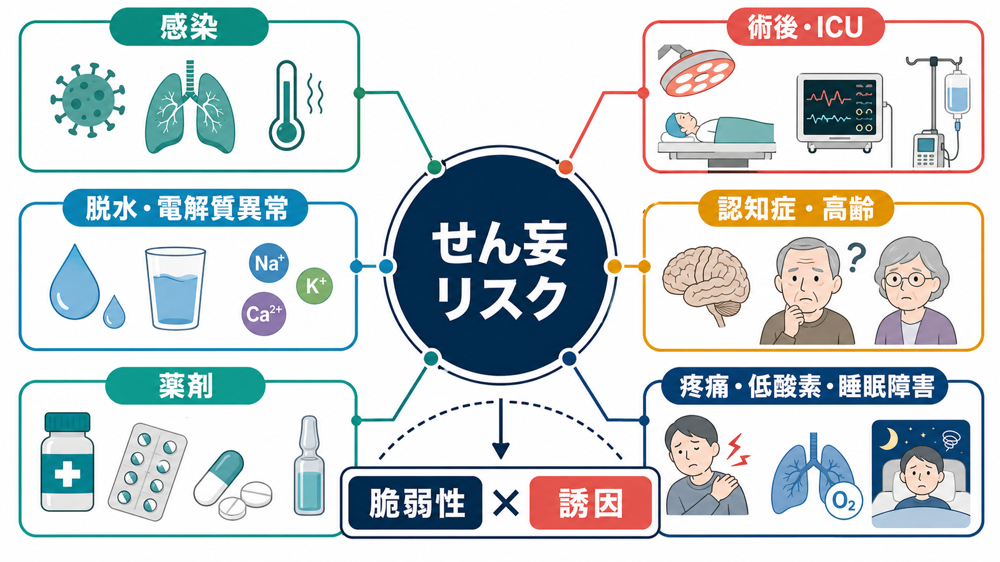
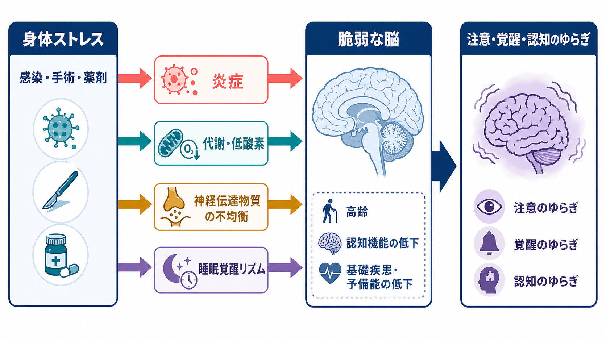
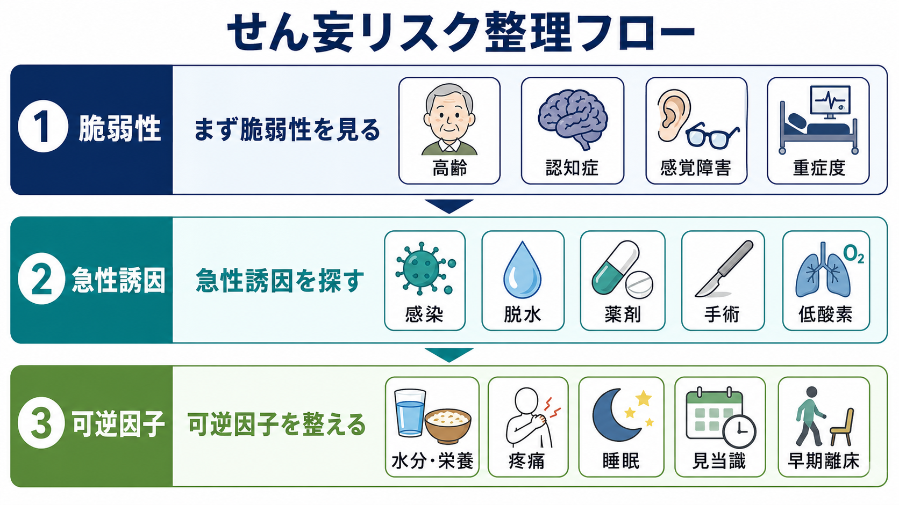

# せん妄を起こしやすい疾患には何があるのか

## 要点

- せん妄は「特定の精神疾患だけで起こる状態」ではなく、急性の身体疾患、薬剤、環境変化、手術、ICU治療、認知症などが重なって生じる急性の注意・意識・認知の障害である[1][2]。
- とくに重要な土台は、高齢、既存の認知機能低下・[[認知症とは何か]]、重症身体疾患、股関節骨折などの脆弱性である[1]。
- 引き金として多いのは、感染、脱水、電解質異常、低酸素、疼痛、便秘・尿閉、睡眠障害、薬剤、アルコールや鎮静薬の離脱、手術後、ICU管理である[2][3][4]。
- したがって臨床的には「どの疾患名か」だけでなく、「脆弱性がある人に、急性誘因が加わったか」を見るのが実用的である[2][4]。
- 本記事は教育・研究目的の整理であり、個別の診断や治療指示ではない。

## この記事で答える問い

1. せん妄を起こしやすい疾患や状況には何があるのか。
2. 認知症、感染、脱水、薬剤、術後、ICUはどのようにせん妄リスクを高めるのか。
3. 「疾患リスト」として暗記するより、どのような枠組みで整理すると見落としにくいのか。

## まず結論

せん妄を起こしやすい疾患・状況は、次の3層で整理すると見通しがよい。

第1層は、せん妄を起こしやすい「脳の脆弱性」である。代表は高齢、[[認知症とは何か]]、過去のせん妄、脳血管障害、パーキンソン病や[[レビー小体型認知症とは何か]]などの神経変性疾患、感覚障害、フレイル、重症身体疾患である[1][2][3]。

第2層は、急に加わる「身体ストレス」である。肺炎、尿路感染、敗血症、脱水、低ナトリウム血症・高カルシウム血症などの電解質異常、低酸素、腎不全・肝不全、低血糖・高血糖、甲状腺機能異常、疼痛、便秘、尿閉、外傷、手術、ICU治療がここに入る[2][3][4]。

第3層は、薬剤・環境・ケア過程による誘因である。ベンゾジアゼピン系薬、抗コリン作用をもつ薬、睡眠薬、オピオイド、ステロイド、H2受容体拮抗薬の一部、抗ヒスタミン薬、ポリファーマシー、急な薬剤中止やアルコール離脱、睡眠中断、見当識の手がかりの不足、眼鏡・補聴器の不使用などが含まれる[4][5][6]。

## 背景

せん妄は、数時間から数日の単位で出現し、日内変動を伴いやすい注意・意識・認知の障害である。単なる「混乱」「不穏」「ぼんやり」ではなく、背景に身体疾患、薬剤、物質使用・離脱、手術、集中治療などがある急性脳機能不全として理解する必要がある[2][3]。

NICEのガイドラインは、入院時または長期ケア入所時に確認すべきリスクとして、65歳以上、認知機能障害または認知症、現在の股関節骨折、悪化中または悪化リスクのある重症疾患を挙げている[1]。これは「せん妄を起こしやすい疾患」の答えが、単一の病名リストではなく、全身状態と脳の予備能の相互作用で決まることを示している。

せん妄は低活動型では見逃されやすい。眠そう、反応が遅い、食欲が落ちた、会話に乗らない、といった変化が「年齢相応」「認知症の進行」「疲労」と誤解されることがある[1][4]。そのため、[[せん妄と認知症はどう違うのか]]とあわせて、急性発症、変動性、注意障害、背景誘因を確認する視点が重要になる。

## 基本概念

### 脆弱性と誘因

せん妄リスクは、しばしば「脆弱性」と「誘因」の掛け算で説明される。認知症や高齢によって脳の予備能が低い人では、軽い感染や脱水、睡眠不足、薬剤変更でもせん妄が起こりうる。一方、若く基礎疾患が少ない人では、敗血症、重症低酸素、重篤な外傷、薬物中毒、アルコール離脱など、より強い誘因が必要になることが多い[2][3]。

### 疾患だけでなく「状態」を見る

せん妄を起こしやすいものには、病名としての疾患だけでなく、術後、ICU、脱水、低酸素、薬剤負荷、睡眠覚醒リズムの破綻などの状態が含まれる。たとえば肺炎という疾患名だけでなく、「発熱」「炎症」「低酸素」「脱水」「抗菌薬や鎮静薬」「不眠」「入院環境」が重なった状態として見ると、せん妄の成り立ちを理解しやすい[2][3][4]。

## せん妄を起こしやすい疾患・状況

### 1. 認知症・神経変性疾患

[[認知症とは何か]]は、せん妄の最重要リスク因子の一つである。[[アルツハイマー型認知症とは何か]]、[[レビー小体型認知症とは何か]]、パーキンソン病関連疾患、脳血管障害後の認知機能低下などでは、感染、脱水、薬剤変更、環境変化に対する耐性が低下しやすい[1][2][3]。

認知症とせん妄は併存しうる。慢性的な記憶障害や生活機能低下が背景にあり、その上に急性の注意障害、見当識障害、幻視、睡眠覚醒リズムの乱れが重なることがある。この場合、「認知症が進んだ」と決めつけると、感染や薬剤性などの可逆的誘因を見落とす危険がある[2][4]。

### 2. 感染症・敗血症

肺炎、尿路感染、胆道感染、皮膚軟部組織感染、敗血症は、せん妄の代表的な誘因である。高齢者では発熱や局所症状が目立たず、急なぼんやり、不眠、食欲低下、会話のまとまりにくさが感染の初発サインのように見えることもある[2][3]。

感染では、炎症性サイトカイン、発熱、低酸素、循環不全、脱水、睡眠中断、入院環境が同時に重なりやすい。Nature Reviews Disease Primersの総説は、せん妄の病態として神経炎症、脳血管機能障害、代謝異常、神経伝達物質の不均衡、ネットワーク結合性の障害を挙げている[3]。

### 3. 脱水・電解質異常・栄養不良

脱水、低ナトリウム血症、高ナトリウム血症、高カルシウム血症、腎不全に伴う尿毒症、低栄養は、せん妄を起こしやすい。NICEは予防的介入として、水分摂取、便秘、低酸素、感染、疼痛、薬剤、栄養、感覚障害、睡眠などを多要素で評価することを勧めている[1]。

脱水や電解質異常は、単独でも脳機能に影響するが、利尿薬、下痢、発熱、食事摂取低下、腎機能低下、心不全などと絡みやすい。せん妄リスクを考えるときは、血液検査の数値だけでなく、食事・水分摂取、排泄、発熱、薬剤、基礎疾患を一緒に見る必要がある。

### 4. 低酸素・呼吸循環不全

COPD増悪、心不全、肺炎、肺塞栓、睡眠時無呼吸、ショック、貧血などによる低酸素や循環不全もせん妄を起こしやすい。NICEは低酸素の評価と酸素化の最適化を、せん妄予防の多要素介入に含めている[1]。

脳は酸素とエネルギー需要が高い臓器である。低酸素、血圧低下、炎症、代謝異常が重なると、注意や覚醒を支える神経ネットワークが不安定になりやすい[3]。

### 5. 代謝・内分泌・臓器不全

低血糖、高血糖、糖尿病性ケトアシドーシス、高浸透圧高血糖状態、甲状腺機能亢進症・低下症、副腎不全、肝性脳症、尿毒症、ビタミン欠乏なども、急性の認知変化を起こしうる。これらは「精神症状」のように見えても、身体疾患による急性脳機能不全として評価する必要がある[2][3]。

代謝・内分泌疾患では、眠気、易怒性、不安、幻覚、注意障害が前景に出ることがある。精神科的評価と同時に、身体所見、バイタルサイン、検査値、服薬歴を確認することが重要である。

### 6. 薬剤・物質使用・離脱

薬剤はせん妄の代表的な可変因子である。JAMAの総説は、非薬物的な多要素介入が予防に有効であり、薬物療法は利益と害のバランスに注意が必要だと整理している[4]。術後せん妄に関するAGSガイドラインは、抗コリン作用をもつ薬、ベンゾジアゼピン系薬、メペリジン、ジフェンヒドラミンなどを、せん妄を誘発しうる薬剤として注意している[5]。

薬剤性せん妄では、新規開始、増量、腎機能低下による蓄積、複数薬剤の相互作用、急な中止のいずれも問題になる。ベンゾジアゼピン系薬やアルコールの離脱では、振戦、不眠、自律神経症状、幻覚、不穏を伴うせん妄が起こることがある。[[アルコール離脱とは何か]]や[[中毒性精神障害とは何か]]とも接続して考えるとよい。

### 7. 術後・外傷・疼痛

手術後、骨折、外傷、熱傷、疼痛、麻酔、出血、感染、低酸素、睡眠中断、環境変化はせん妄リスクを高める。[[周術期せん妄とは何か]]で扱うように、術後せん妄は高齢者に多い重要な合併症であり、予防には見当識づけ、睡眠、早期離床、補聴器・眼鏡、水分・栄養、疼痛管理、薬剤見直しなどを組み合わせた介入が重視される[5][7]。

疼痛そのものもせん妄の誘因になりうる一方、疼痛治療に使う薬剤もリスクになりうる。したがって「痛みを我慢させる」ことでも「鎮静薬で眠らせる」ことでもなく、疼痛、睡眠、活動性、薬剤負荷を総合的に調整する発想が必要である[5]。

### 8. ICU・重症疾患

[[ICUせん妄とは何か]]は、重症疾患、人工呼吸、鎮静、疼痛、睡眠中断、感覚遮断、感染、循環不全、臓器不全が重なる典型的な場面である。SCCM PADISガイドラインは、ICUせん妄に関連する因子として、ベンゾジアゼピン使用、輸血、年齢、認知症、昏睡、緊急手術・外傷、重症度などを挙げている[6]。

ICUでは、せん妄は単なる一過性の混乱ではなく、人工呼吸期間、身体拘束、退院後の認知機能、生活機能とも関連する重要なアウトカムとして扱われる[3][6]。

## 仕組み

せん妄の病態は一つの経路では説明できない。感染や手術では炎症が、低酸素や低血糖ではエネルギー不足が、薬剤では神経伝達物質のバランス変化が、ICUや入院環境では睡眠覚醒リズムや感覚入力の乱れが関与する[3]。

重要なのは、これらが別々に起こるのではなく、同じ患者の中で同時に重なる点である。たとえば認知症のある高齢者が肺炎で入院し、脱水、低酸素、睡眠中断、抗コリン作用のある薬剤、眼鏡や補聴器の不使用が重なると、せん妄リスクは一気に高まる[1][2][4]。

この意味で、せん妄は「脳が弱いから起こる」だけでも、「身体疾患が重いから起こる」だけでもない。脳の予備能、身体ストレス、薬剤、環境、ケア過程の相互作用として見る必要がある。

## 図解

せん妄リスクを整理するときは、次の順番が実用的である。

1. 脆弱性を見る: 高齢、認知症、過去のせん妄、重症疾患、感覚障害、フレイル。
2. 急性誘因を探す: 感染、脱水、電解質異常、低酸素、疼痛、便秘・尿閉、手術、外傷、ICU。
3. 可逆因子を整える: 薬剤見直し、水分・栄養、睡眠、見当識、補聴器・眼鏡、早期離床、疼痛管理。

## 臨床・研究との接続

せん妄予防研究では、単一の薬剤よりも、多要素の非薬物的介入が中心に検討されてきた。JAMAの総説は、脱水、睡眠不足、視聴覚障害、活動性低下などのリスク因子に焦点を当てた非薬物的多要素介入が有効であるとまとめている[4]。AGSの術後せん妄ガイドラインも、見当識づけ、睡眠、早期離床、感覚補助、水分・栄養、疼痛管理、適切な薬剤使用を組み合わせる介入を重視している[5]。

研究上は、せん妄は神経炎症、脳代謝、脳血管機能、神経伝達、ネットワーク動態をつなぐモデルとして重要である[3]。臨床上は、せん妄が見つかったときに「精神症状を抑える」だけでなく、背景にある感染、低酸素、脱水、薬剤、疼痛、睡眠、環境を同時に評価する入口になる。

## よくある誤解

### 誤解1: せん妄は認知症の人だけに起こる

認知症は強いリスク因子だが、せん妄は認知症がない人にも起こる。敗血症、低酸素、重症外傷、薬物中毒、アルコール離脱、ICU治療など、誘因が強ければ若年者や認知症のない人にも起こりうる[2][3][6]。

### 誤解2: 不穏がなければせん妄ではない

せん妄には過活動型、低活動型、混合型がある。低活動型では、静か、眠そう、反応が遅い、食事を取らない、会話に参加しない、といった形で現れるため見逃されやすい[1][4]。

### 誤解3: 薬で眠れば解決する

鎮静は一時的に行動を目立たなくすることがあるが、原因を解決するとは限らない。むしろベンゾジアゼピン系薬などはせん妄リスクを高めることがあり、薬剤使用は状況と害を慎重に考える必要がある[4][5][6]。

### 誤解4: せん妄は年齢相応の一時的な混乱である

せん妄は入院期間、合併症、死亡、長期的な認知・機能アウトカムと関連する重要な臨床状態である[1][2][3]。軽い混乱として放置せず、急性脳機能不全として背景因子を探す必要がある。

## 関連ノート

- [[せん妄と認知症はどう違うのか]]
- [[ICUせん妄とは何か]]
- [[周術期せん妄とは何か]]
- [[認知症とは何か]]
- [[アルツハイマー型認知症とは何か]]
- [[レビー小体型認知症とは何か]]
- [[アルコール離脱とは何か]]
- [[中毒性精神障害とは何か]]

## MOC更新候補

- `content/00_MOC/` 配下の精神医学・認知症・老年医学・臨床精神医学関連 MOC に追加候補。
- 並列生成ジョブとの競合を避けるため、本記事作成時点では MOC ファイルは更新しない。

## 理解チェック

1. せん妄リスクを「脆弱性」と「誘因」に分けると、認知症、感染、脱水、薬剤はそれぞれどちらに位置づけられるか。
2. 低活動型せん妄が見逃されやすい理由は何か。
3. 術後やICUでせん妄が起こりやすいのは、どのような因子が重なるためか。
4. 「薬で眠ればよい」という理解には、どのような危険があるか。

## 未解決問題

- せん妄の神経炎症、脳代謝、神経伝達、ネットワーク障害のどれが、どの患者群で主要因になるのかはまだ十分に分かっていない[3]。
- 薬物療法は、重度の苦痛や安全上の危険がある場面では検討されるが、予防・治療の中心としては限界があり、どのサブグループにどの介入が有効かは今後の課題である[4][6]。
- せん妄後の長期認知機能低下が、せん妄そのものの影響なのか、背景にある脳脆弱性の表れなのか、両者の寄与をどう分けるかは研究上の重要課題である[2][3]。

## 参考文献

[1] National Institute for Health and Care Excellence. *Delirium: prevention, diagnosis and management in hospital and long-term care. Clinical guideline CG103*. Published 2010, last updated 2023. https://www.nice.org.uk/guidance/cg103/chapter/1-recommendations

[2] Inouye, S. K., Westendorp, R. G. J., & Saczynski, J. S. (2014). Delirium in elderly people. *The Lancet*, 383(9920), 911-922. https://doi.org/10.1016/S0140-6736(13)60688-1

[3] Wilson, J. E., Mart, M. F., Cunningham, C., et al. (2020). Delirium. *Nature Reviews Disease Primers*, 6, 90. https://doi.org/10.1038/s41572-020-00223-4

[4] Oh, E. S., Fong, T. G., Hshieh, T. T., & Inouye, S. K. (2017). Delirium in older persons: Advances in diagnosis and treatment. *JAMA*, 318(12), 1161-1174. https://doi.org/10.1001/jama.2017.12067

[5] American Geriatrics Society Expert Panel on Postoperative Delirium in Older Adults. (2015). American Geriatrics Society abstracted clinical practice guideline for postoperative delirium in older adults. *Journal of the American Geriatrics Society*, 63(1), 142-150. https://doi.org/10.1111/jgs.13281

[6] Devlin, J. W., Skrobik, Y., Gelinas, C., et al. (2018). Clinical practice guidelines for the prevention and management of pain, agitation/sedation, delirium, immobility, and sleep disruption in adult patients in the ICU. *Critical Care Medicine*, 46(9), e825-e873. https://www.sccm.org/clinical-resources/guidelines/guidelines/guidelines-for-the-prevention-and-management-of-pa

[7] Marcantonio, E. R. (2017). Delirium in hospitalized older adults. *New England Journal of Medicine*, 377(15), 1456-1466. https://doi.org/10.1056/NEJMcp1605501
