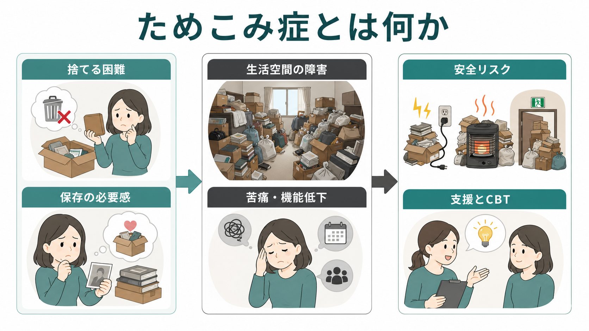
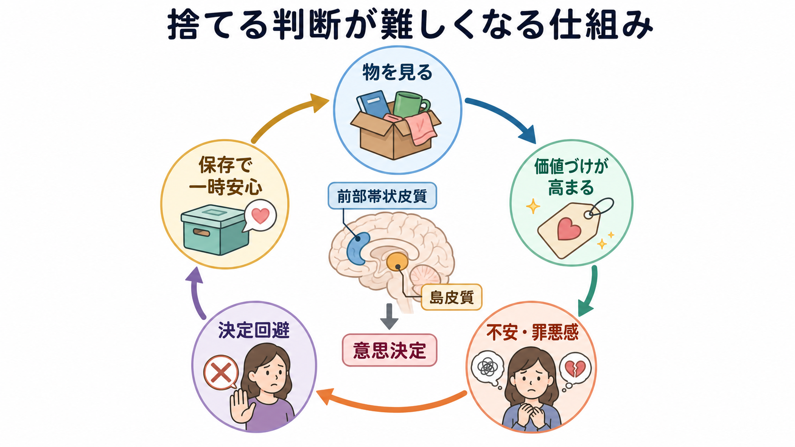
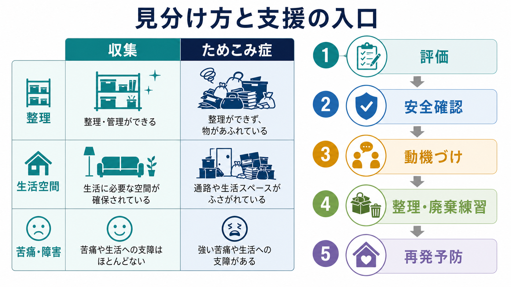

# ためこみ症とは何か

## 要点

- ためこみ症は、物の実際の価値にかかわらず、捨てることや手放すことが持続的に難しく、その結果として生活空間がふさがれ、苦痛・生活機能低下・安全上の問題が生じる状態である[1][2]。
- 単なる「片づけが苦手」や「収集癖」とは異なり、本人にとって保存の必要感や廃棄時の強い苦痛があり、居室・台所・寝室・通路など本来使う空間の機能が損なわれる点が中心である[1][3]。
- DSM-5 以降、ためこみ症は強迫症の一症状だけではなく、強迫症および関連症群の独立した診断概念として扱われている[3]。
- 研究上は、物への価値づけ、意思決定の困難、不安・罪悪感、回避、過剰取得、実行機能や注意の問題が絡む多因子の病態として理解されている[4][5]。
- 支援では、強制的な片づけだけでは再燃しやすく、評価、安全確保、動機づけ、整理・廃棄の練習、過剰取得への対応を組み合わせる認知行動療法が主要な心理社会的介入として研究されている[6][7]。

## この記事で答える問い

1. ためこみ症は、単なる散らかりや収集とどこが違うのか。
2. なぜ「捨てればよい」と分かっていても捨てられないのか。
3. 生活空間・安全・家族関係・治療研究では、何が問題になるのか。
4. 認知行動療法や臨床評価は、どの部分に介入しようとしているのか。

## まず結論

ためこみ症の中核は、「物が多いこと」そのものではなく、**手放す判断に強い苦痛が伴い、保存によって一時的に安心し、その結果として生活空間と生活機能が徐々に損なわれる循環**である。したがって、理解の焦点は「本人が怠けているか」ではなく、物への意味づけ、喪失感、責任感、記憶への不安、決定困難、回避行動、住環境の安全性に置く必要がある[4][5]。

ただし、本記事は教育・研究目的の整理であり、個別の診断や治療指示ではない。火災、転倒、衛生、近隣トラブル、自傷他害リスク、認知症や精神病症状の疑いがある場合は、精神科、臨床心理、地域保健、福祉、消防・住宅支援などを含む多職種評価が必要になる。

## 背景

ためこみ行動は古くから「強迫的ためこみ」「収集癖」「セルフネグレクト」などと重なって論じられてきたが、DSM-5 では独立した診断として位置づけられ、ICD-11 でも 6B24 Hoarding disorder として整理された[2][3]。この分類変更の意義は、ためこみを強迫症の一部に自動的に還元せず、独自の臨床像、経過、介入ニーズを評価できるようにした点にある。

疫学研究では、DSM-5 基準に近い面接評価による下限推定として有病率約 1.5%が報告されており、研究や基準によって推定値には幅がある[8]。年齢とともに目立ちやすくなる傾向も報告されるが、これは「高齢者だけの問題」という意味ではない。症状は思春期から若年成人期に始まり、生活空間の蓄積が長年かけて顕在化することがある[8]。

## 基本概念

DSM-5 系の診断基準では、ためこみ症は次の要素で特徴づけられる。第一に、物の実際の価値にかかわらず、捨てること・手放すことが持続的に難しい。第二に、その困難は「保存しておく必要がある」という感覚や、捨てることに伴う苦痛と結びつく。第三に、物の蓄積が生活空間をふさぎ、空間の本来の使用を大きく妨げる。第四に、苦痛や社会的・職業的・家庭的機能の障害、あるいは安全確保の困難を伴う[1][3]。

ICD-11 でも、生活空間の使用または安全が損なわれるほど物が蓄積し、過剰取得や廃棄困難があり、症状が重要な生活領域の苦痛または機能障害につながる点が重視される[2]。ここで重要なのは、きれいに見える家でも、家族・清掃業者・行政など第三者の介入によって保たれているだけなら、ためこみ症の問題が隠れている場合があるという点である[1][2]。

収集との違いは、整理と機能で考えると分かりやすい。収集では、対象が選択され、分類・展示・保管が比較的体系化され、生活空間の使用が大きく妨げられないことが多い。ためこみ症では、必要性の判断が難しく、紙類、衣類、容器、書類、郵便物、壊れた物などが混在し、通路、寝室、台所、浴室、玄関などの本来の機能が損なわれやすい[1][3]。

## 仕組み

ためこみ症では、物を見るだけで「いつか使うかもしれない」「捨てると取り返しがつかない」「思い出を失う」「自分には判断できない」といった認知が活性化しやすい。廃棄を迫られると、不安、罪悪感、悲しみ、怒り、喪失感が高まり、判断を先延ばしにする。保存すると一時的に安心するため、回避が強化される。この循環が長期化すると、物は増え続け、生活空間の障害がさらに判断を難しくする[4][5]。

神経科学研究では、ためこみ症の人が自分の所有物について判断するとき、前部帯状皮質や島皮質など、葛藤、情動的意味づけ、内受容感覚、意思決定に関わる領域の活動が特徴的に変化することが示されている[5]。これは「脳の特定部位が原因」と単純化するための知見ではなく、本人にとって所有物が過剰に重要な刺激として処理され、判断の負荷が高まる可能性を示す手がかりである。

認知面では、注意、分類、計画、問題解決、記憶への信頼、意思決定の遅さが関わる。情動面では、物への愛着、責任感、喪失への恐れ、恥、家族との衝突が関わる。行動面では、捨てる場面を避ける、判断を後回しにする、無料品や安価な物を取得する、片づけを始めても分類が細かくなりすぎて進まない、といったパターンが維持要因になる[4][6]。

## 図解

3枚の図は、記事全体を次の順に読むための補助である。1枚目は、捨てる困難、保存の必要感、生活空間の障害、安全リスク、支援をまとめた全体像である。2枚目は、所有物を見たときの価値づけ、不安・罪悪感、決定回避、一時的安心という循環を示している。3枚目は、収集との違いと、評価から支援へつなぐ入口を整理している。

## 臨床・研究との接続

臨床評価では、物の量だけでなく、生活空間が使えるか、安全が保たれているか、本人の苦痛や洞察、過剰取得、家族関係、身体疾患、認知機能、[[うつ病とは何か]]、不安症、[[統合失調症とは何か]]、[[統合失調症の認知機能障害とは何か]]、認知症、発達特性などとの鑑別を確認する。ためこみは他の疾患や脳損傷、神経認知障害、精神病性の信念、抑うつによる意欲低下でも見られるため、診断名だけで説明を急がないことが重要である[1][3]。

治療研究では、ためこみ症に特化した認知行動療法が比較的よく検討されている。待機群対照試験では、心理教育、事例定式化、動機づけ面接、整理・問題解決スキル、取得を控える練習、廃棄への曝露、認知療法を組み合わせた介入が用いられた[6]。メタ分析でも CBT は有望とされるが、効果は一様ではなく、 clutter、廃棄困難、取得、機能障害のどこに効くかを分けて考える必要がある[7]。

支援の実務では、本人の同意や安全を無視した一括撤去は、短期的には空間を空けても、恥や不信感を強め、再蓄積を招くことがある。反対に、火災、転倒、衛生、虐待・セルフネグレクト、近隣への危険がある場合は、本人の苦痛に配慮しながらも安全確保を優先する。臨床心理、精神科、家族、地域保健、福祉、住宅、消防が分断されずに関わることが望ましい。

## よくある誤解

### 誤解1: ためこみ症は怠けや性格の問題である

ためこみ症は、片づけへの意欲だけで説明できる状態ではない。物への意味づけ、捨てることへの強い苦痛、意思決定の困難、回避の強化、生活空間の障害が絡む病態である[1][4]。

### 誤解2: 収集が多ければ、すべてためこみ症である

収集は整理され、生活空間の機能を大きく損なわないことが多い。ためこみ症では、空間の使用、安全、社会生活、家族関係、本人の苦痛や機能障害が問題になる[1][3]。

### 誤解3: 強制的に全部捨てれば治る

強制撤去は安全上必要な場面もあるが、それだけでは判断・感情・取得・回避のパターンは変わらない。再発予防には、本人が少しずつ判断し、分類し、手放し、取得を控える練習が必要になる[6][7]。

### 誤解4: 本人が困っていないなら問題ではない

洞察が乏しい場合、本人の主観的苦痛が小さくても、火災、転倒、衛生、家族の負担、住居喪失、近隣リスクが大きいことがある。評価では本人の苦痛と客観的な生活機能・安全の両方を見る[2][3]。

## 関連ノート

- [[うつ病とは何か]]
- [[統合失調症とは何か]]
- [[統合失調症の認知機能障害とは何か]]

### 関連ノート候補

- 強迫症とは何か
- 強迫症および関連症群とは何か
- 認知行動療法とは何か
- セルフネグレクトとは何か
- 実行機能とは何か
- 意思決定と島皮質・前部帯状皮質

### MOC更新候補

- `content/00_MOC/` 配下に精神医学・疾患、強迫症関連症群、臨床心理学・認知行動療法の MOC がある場合、本記事へのリンク追加候補とする。
- 並列ジョブとの競合を避けるため、本タスクでは MOC ファイルは更新しない。

## 理解チェック

1. ためこみ症を「物が多い状態」だけで定義すると、何が抜け落ちるか。
2. 収集とためこみ症を区別するとき、生活空間・整理・苦痛・機能障害のどこを見るべきか。
3. 捨てる判断の場面で、不安や罪悪感がどのように回避を強化するか。
4. 強制的な片づけだけでは、なぜ再蓄積が起こりうるか。
5. ためこみ症の評価で、うつ病、精神病性障害、認知症、脳損傷との鑑別が重要になるのはなぜか。

## 未解決問題

- ためこみ症の異質性を、廃棄困難、過剰取得、洞察、認知機能、安全リスク、併存症のどの軸で分類するのが最も臨床的に有用か。
- CBT に反応しにくい人に対して、動機づけ、家族介入、訪問型支援、デジタル支援、薬物療法をどのように組み合わせるべきか。
- 神経画像や認知課題の知見を、個別の評価や介入選択にどこまで応用できるか。
- 地域保健、福祉、住宅、消防、医療の連携モデルを、本人の権利と安全確保の両方を守る形でどう設計するか。

## 参考文献

[1] Merck Manual Professional Edition. (2025). *Hoarding Disorder*. https://www.merckmanuals.com/en-us/professional/psychiatric-disorders/obsessive-compulsive-and-related-disorders/hoarding-disorder

[2] World Health Organization. (2024). *Clinical descriptions and diagnostic requirements for ICD-11 mental, behavioural and neurodevelopmental disorders (CDDR)*. https://www.who.int/publications/i/item/9789240077263

[3] International OCD Foundation. (n.d.). *Diagnosing Hoarding Disorder*. https://hoarding.iocdf.org/professionals/diagnosing-hoarding-disorder/

[4] Tolin, D. F., Frost, R. O., Steketee, G., & Muroff, J. (2021). Hoarding Disorder: Development in Conceptualization, Intervention, and Evaluation. *Focus, 19*(4), 392-401. https://pmc.ncbi.nlm.nih.gov/articles/PMC9063579/

[5] Tolin, D. F., Stevens, M. C., Villavicencio, A. L., Norberg, M. M., Calhoun, V. D., Frost, R. O., Steketee, G., Rauch, S. L., & Pearlson, G. D. (2012). Neural mechanisms of decision making in hoarding disorder. *Archives of General Psychiatry, 69*(8), 832-841. https://doi.org/10.1001/archgenpsychiatry.2011.1980

[6] Steketee, G., Frost, R. O., Tolin, D. F., Rasmussen, J., & Brown, T. A. (2010). Waitlist-controlled trial of cognitive behavior therapy for hoarding disorder. *Depression and Anxiety, 27*(5), 476-484. https://doi.org/10.1002/da.20673

[7] Tolin, D. F., Frost, R. O., Steketee, G., & Muroff, J. (2015). Cognitive behavioral therapy for hoarding disorder: A meta-analysis. *Depression and Anxiety, 32*(3), 158-166. https://doi.org/10.1002/da.22327

[8] Nordsletten, A. E., Reichenberg, A., Hatch, S. L., Fernández de la Cruz, L., Pertusa, A., Hotopf, M., & Mataix-Cols, D. (2013). Epidemiology of hoarding disorder. *The British Journal of Psychiatry, 203*(6), 445-452. https://doi.org/10.1192/bjp.bp.113.130195
