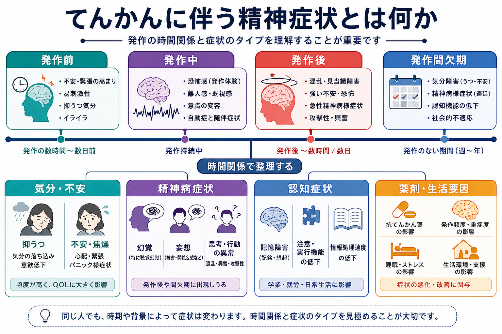
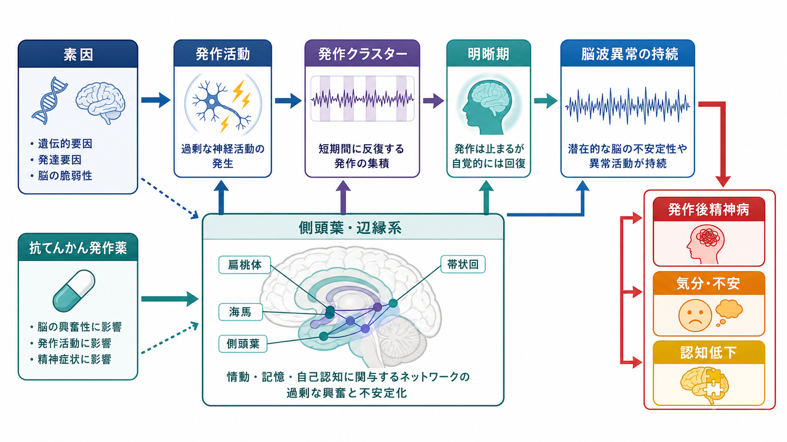
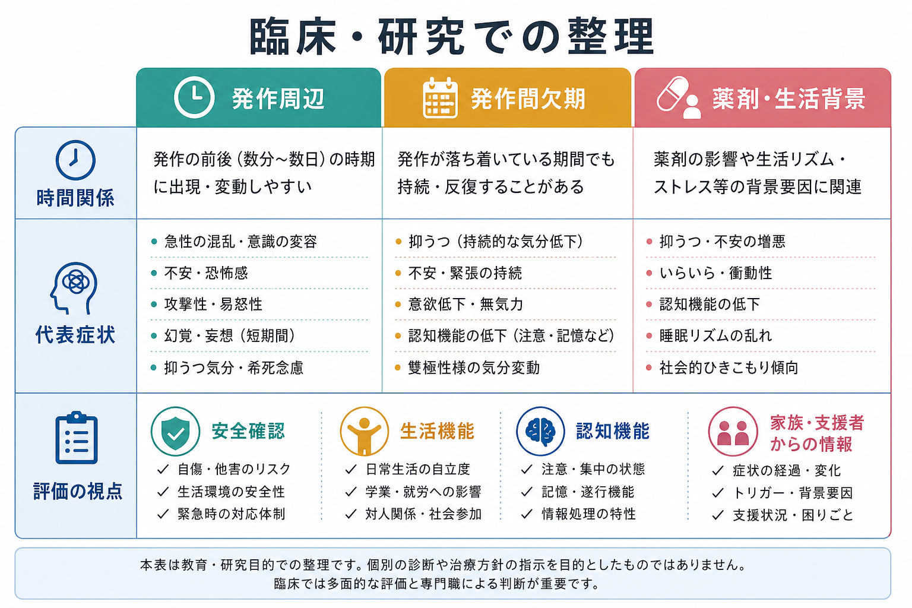

# てんかんに伴う精神症状とは何か

## 要点

- てんかんは「発作」だけでなく、認知・心理・社会的な影響を含む脳の疾患として理解される[1]。
- 精神症状は、発作前、発作中、発作後、発作間欠期のどこに出るかで意味が変わる。
- 代表的には、抑うつ・不安、精神病症状、記憶・注意・遂行機能の低下が問題になる[2][3][4][7]。
- 原因は単一ではなく、発作活動、側頭葉・辺縁系ネットワーク、発作頻度、抗てんかん発作薬、睡眠、スティグマ、生活機能の変化が重なって生じる[2][7][8]。
- 本稿は教育・研究目的の整理であり、個別の診断や治療方針を示すものではない。

## この記事で答える問い

1. てんかんに伴う精神症状は、なぜ「発作との時間関係」で分類する必要があるのか。
2. 気分症状、精神病症状、認知症状はどのように現れるのか。
3. それらは脳ネットワーク、薬剤、生活背景とどのようにつながるのか。
4. 臨床・研究では何を区別して観察すべきか。

## まず結論

てんかんに伴う精神症状は、「てんかんがある人に偶然合併した精神疾患」とだけ見ると不十分である。発作の直前・最中・直後に短く出る症状もあれば、発作のない期間に持続する[[うつ病とは何か]]、[[不安症群とは何か]]、精神病症状、認知機能低下もある。したがって、最初に見るべき軸は「症状名」ではなく、発作との時間関係である。

## 背景

国際抗てんかん連盟（ILAE）の定義では、てんかんは反復するてんかん発作への持続的な素因をもつ脳の疾患として扱われる。発作は、脳の過剰または同期した神経活動に由来する一過性の徴候・症状であり、てんかんという疾患はその神経生物学的、認知的、心理的、社会的帰結を含む[1]。

この定義は、精神症状を理解するうえで重要である。てんかんに伴う抑うつや不安は、発作への心理反応だけでなく、神経ネットワーク、神経伝達、薬剤、社会的制約が関与する双方向的な現象として研究されている[2][3]。精神病症状についても、てんかん患者では一般人口より高いリスクが示され、特に側頭葉てんかんや発作後精神病が議論されてきた[4][5]。

## 基本概念

### 発作との時間関係

てんかん関連の精神症状は、まず次のように分けると整理しやすい。

| 時期 | 典型的な見方 | 例 |
|---|---|---|
| 発作前 | 発作に先行して変化する症状 | 不安、易刺激性、抑うつ気分、違和感 |
| 発作中 | 発作そのものの症状として出る | 恐怖感、既視感、離人感、幻覚様体験、自動症 |
| 発作後 | 発作後の回復過程で出る | 混乱、見当識障害、焦燥、抑うつ、発作後精神病 |
| 発作間欠期 | 発作のない期間にも続く | 抑うつ、不安、精神病症状、認知機能低下 |

この分類は、[[器質性精神病とは何か]]や[[薬剤性精神病とは何か]]との鑑別にも関係する。たとえば幻聴や妄想がある場合でも、発作直後の明晰期を挟んで数時間から数日後に出たのか、発作とは独立して長く続いているのか、薬剤変更の直後なのかで解釈が変わる。

### 気分・不安症状

てんかんに伴う気分症状では、抑うつ、不安、焦燥、易刺激性、意欲低下がよく問題になる。系統的レビューでは、てんかん患者における抑うつの頻度は一般人口より高く、研究方法による差は大きいものの、活動性てんかんでは抑うつが高頻度にみられる[3]。近年のレビューは、気分障害とてんかんの関係を、単なる心理的反応ではなく、共有する神経生物学的機序を含む双方向関係として整理している[2]。

この点は、[[薬剤性うつ症状とは何か]]とも接続する。抗てんかん発作薬は発作を抑える一方で、薬剤ごと、患者背景ごとに気分や認知へ異なる影響を及ぼすことがある[8]。

### 精神病症状

てんかんに伴う精神病症状には、発作中の幻覚様体験、発作後精神病、発作間欠期精神病、薬剤関連の精神病症状などが含まれる。精神病の有病率を扱ったメタ解析では、てんかん患者の精神病有病率は約5.6%、側頭葉てんかんでは約7%、発作後精神病は約2%と推定され、対照群と比べた精神病リスクは約8倍と報告された[4]。

発作後精神病は、発作群発のあとにいったん意識が清明に戻る「明晰期」を挟み、その後に幻覚、妄想、興奮、気分高揚、睡眠障害などが出る点が特徴的である[5]。この明晰期は見逃しやすく、発作が終わったから安全に回復したと判断されると、精神症状の出現が遅れて認識される。

### 認知症状

認知症状では、記憶、注意、処理速度、遂行機能、言語、社会的認知が問題になる。成人てんかんでは記憶・注意・遂行機能の障害が多く、焦点の部位、発症年齢、発作頻度、発作の重症度、発作間欠期てんかん様放電、薬剤、基礎疾患が重なって影響する[7]。これは[[高次脳機能障害とは何か]]や[[認知症とは何か]]と重なる語彙を使うが、進行性認知症と同じとは限らない。

## 仕組み

精神症状の発生機序は、単一の「てんかん性格」や「心理的弱さ」では説明できない。少なくとも次の層が重なる。

1. 発作活動そのもの  
   側頭葉、海馬、扁桃体、帯状回、前頭葉を含むネットワークは、記憶、情動、自己感、脅威評価に関与する。ここに過剰な同期活動や発作間欠期放電が生じると、恐怖感、既視感、情動変化、記憶障害が発作症状または発作間欠期症状として現れうる[7]。

2. 発作後の回復過程  
   発作後は、神経活動、睡眠覚醒、代謝、脳血流、抑制性機構が再調整される。発作後精神病では、発作群発、明晰期、側頭葉てんかん、家族歴、右側頭部てんかん様放電などが関連因子として報告されている[5][6]。

3. 共有脆弱性  
   抑うつや精神病のリスクは、てんかんの結果としてだけでなく、神経発達、遺伝的素因、神経伝達系、炎症、ネットワーク可塑性などを通じて共有される可能性がある[2][6]。

4. 薬剤・生活背景  
   抗てんかん発作薬、睡眠不足、アルコール、疼痛、社会的孤立、就労・就学上の制限、スティグマは、精神症状と生活機能の双方に影響する[2][8]。[[睡眠覚醒障害群とは何か]]との関連もここに入る。

## 図解

上の図は、発作活動、側頭葉・辺縁系、発作クラスター、発作後の明晰期、脳波異常の持続、素因、抗てんかん発作薬を一つの流れとして示したものである。重要なのは、症状が「発作由来か、精神疾患由来か」という二分法だけでは整理しきれない点である。実際には、発作、脳ネットワーク、薬剤、心理社会的背景が同時に関与する。

## 臨床・研究との接続

臨床・研究で重要なのは、症状の有無だけでなく、次の情報を時系列で集めることである。

| 観察する軸 | 確認すること |
|---|---|
| 時間関係 | 発作の前、最中、直後、数時間から数日後、発作間欠期のどこに出るか |
| 発作情報 | 発作型、頻度、群発、焦点、脳波、発作後の混乱や明晰期 |
| 症状の質 | 抑うつ、不安、幻覚、妄想、焦燥、興奮、記憶障害、注意障害 |
| 薬剤・身体要因 | 抗てんかん発作薬の開始・増減、睡眠、アルコール、疼痛、感染、代謝異常 |
| 生活機能 | 学業、就労、運転、家族関係、社会参加、支援体制 |
| 安全 | 自傷他害リスク、錯乱、転倒、事故、服薬中断、救急受診歴 |

研究では、発作後精神病のように比較的明確な時間関係をもつ症候と、発作間欠期の抑うつ・不安・認知低下のように多因子的な症候を分ける必要がある。特に精神病症状は、[[統合失調症とは何か]]、[[初回エピソード精神病とは何か]]、薬剤性精神病、せん妄、認知症、物質使用の影響と重なるため、発作日誌、家族・支援者からの情報、脳波、薬剤歴、身体評価を組み合わせて考える。

## よくある誤解

### 誤解1: 精神症状は発作への心理的反応にすぎない

発作への恐怖、生活制限、スティグマが症状に影響するのは確かである。しかし、気分障害や認知症状には、側頭葉・前頭葉・辺縁系ネットワーク、神経伝達、発作間欠期放電、薬剤なども関与する[2][7][8]。心理反応だけに還元すると、医学的・神経心理学的評価の必要性を見落とす。

### 誤解2: 発作がない時期の症状はてんかんと無関係である

発作間欠期にも抑うつ、不安、精神病症状、認知障害は起こりうる。てんかんの定義自体が、認知的・心理的・社会的帰結を含む[1]。ただし、すべてをてんかんだけで説明するのも危険であり、独立した精神疾患、薬剤性、物質使用、睡眠障害、身体疾患も評価する。

### 誤解3: 発作後に意識が戻れば精神症状のリスクは終わる

発作後精神病では、いったん清明に見える明晰期のあとに症状が出ることがある[5]。発作群発後の睡眠障害、興奮、幻覚、妄想、強い不安、行動の変化は、経過情報と安全確認を要する。

### 誤解4: 認知症状は認知症と同じである

てんかんの認知症状は、発作焦点、発症年齢、発作頻度、薬剤、基礎疾患、睡眠、気分症状に左右される[7]。進行性の[[認知症とは何か]]と重なる場合もあるが、同じ枠に固定せず、時間経過と可逆要因を確認する。

## 関連ノート

- [[うつ病とは何か]]
- [[不安症群とは何か]]
- [[器質性精神病とは何か]]
- [[薬剤性精神病とは何か]]
- [[薬剤性うつ症状とは何か]]
- [[高次脳機能障害とは何か]]
- [[睡眠覚醒障害群とは何か]]
- [[統合失調症とは何か]]

MOC更新候補: 精神医学MOC、神経心理学MOC、てんかん・神経疾患関連MOC。並列ジョブとの競合を避けるため、本稿ではMOC本体は更新しない。

今後の作成候補: てんかんとは何か、発作後精神病とは何か、側頭葉てんかんとは何か、抗てんかん発作薬の精神症状への影響、発作間欠期精神病とは何か。

## 理解チェック

1. てんかんに伴う精神症状を評価するとき、なぜ症状名より先に発作との時間関係を見るのか。
2. 発作後精神病における「明晰期」は、どのような臨床的落とし穴になるか。
3. 抑うつや不安を、発作への心理反応だけで説明すると何を見落とすか。
4. 認知症状を考えるとき、発作、薬剤、基礎疾患、睡眠、気分症状を分けて見る理由は何か。

## 参考文献

[1] Fisher RS, Acevedo C, Arzimanoglou A, et al. (2014). ILAE official report: a practical clinical definition of epilepsy. *Epilepsia*, 55(4), 475-482. https://doi.org/10.1111/epi.12550

[2] Kanner AM, Shankar R, Margraf NG, et al. (2024). Mood disorders in adults with epilepsy: a review of unrecognized facts and common misconceptions. *Annals of General Psychiatry*, 23, 14. https://doi.org/10.1186/s12991-024-00493-2

[3] Fiest KM, Dykeman J, Patten SB, et al. (2013). Depression in epilepsy: a systematic review and meta-analysis. *Neurology*, 80(6), 590-599. https://doi.org/10.1212/WNL.0b013e31827b1ae0

[4] Clancy MJ, Clarke MC, Connor DJ, Cannon M, Cotter DR. (2014). The prevalence of psychosis in epilepsy; a systematic review and meta-analysis. *BMC Psychiatry*, 14, 75. https://doi.org/10.1186/1471-244X-14-75

[5] Devinsky O. (2008). Postictal psychosis: common, dangerous, and treatable. *Epilepsy Currents*, 8(2), 31-34. https://doi.org/10.1111/j.1535-7511.2008.00227.x

[6] Allebone J, Kanaan RAA, Wilson SJ. (2021). Postictal psychosis in epilepsy: a clinicogenetic study. *Annals of Neurology*, 90(3), 464-476. https://doi.org/10.1002/ana.26174

[7] Novak A, Vizjak K, Rakusa M. (2022). Cognitive impairment in people with epilepsy. *Journal of Clinical Medicine*, 11(1), 267. https://doi.org/10.3390/jcm11010267

[8] Kanner AM, Bicchi MM. (2022). Antiseizure medications for adults with epilepsy: a review. *JAMA*, 327(13), 1269-1281. https://doi.org/10.1001/jama.2022.3880
