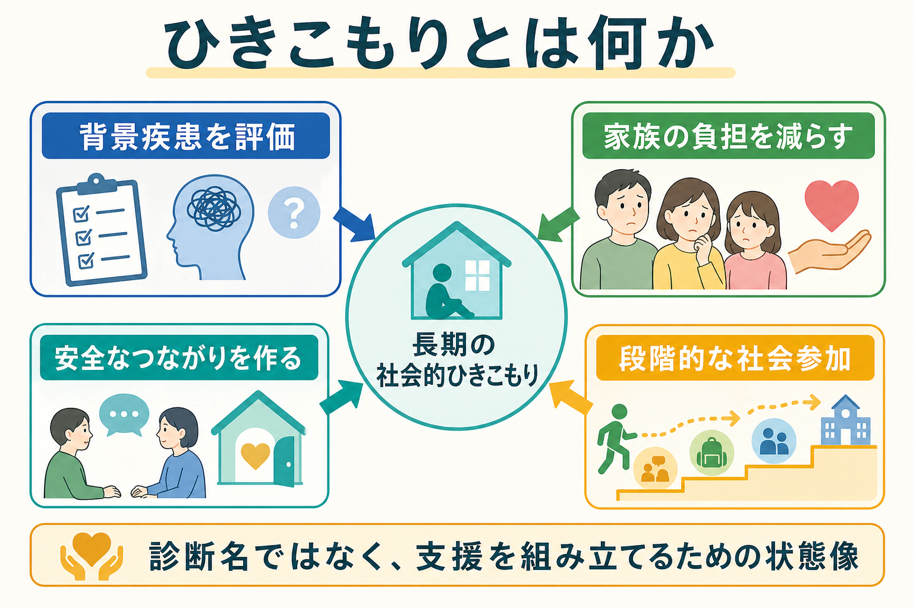
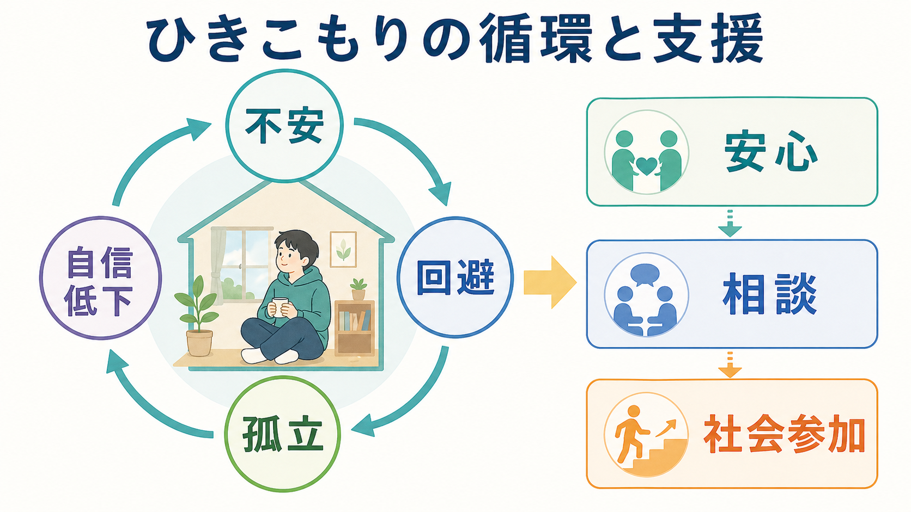

# ひきこもりとは何か

## 要点

- ひきこもりは単一の精神疾患名ではなく、就学、就労、家庭外の交友などの社会参加が長期に制限され、家庭内にとどまり続ける状態を指す現象概念である[1][2]。
- 評価では「外に出ないこと」だけでなく、期間、生活機能、本人の苦痛、家族の負担、背景疾患、発達特性、経済・教育・就労環境を同時に見る必要がある[2][3]。
- うつ病、不安症、自閉スペクトラム症、統合失調症、パーソナリティ特性、インターネット・ゲーム関連問題などが併存または背景にあることがあるが、どれか一つに還元してよいわけではない[3][4]。
- 支援の起点は、本人を急に外へ出すことではなく、安心して話せる関係、家族の孤立軽減、地域の相談窓口、居場所、医療・福祉・就労支援の連携を作ることである[5][6]。

## この記事で答える問い

1. ひきこもりは精神疾患なのか、社会問題なのか。
2. 長期化する背景にはどのような心理・身体・家族・社会要因があるのか。
3. 家族や支援者は、何を評価し、どこから関わればよいのか。
4. 臨床研究では、ひきこもりをどのように測定し、支援につなげようとしているのか。

## まず結論

ひきこもりは「怠け」「甘え」「性格の問題」として理解すると見誤る。多くの場合、本人は社会参加を望んでいないのではなく、失敗体験、不安、抑うつ、発達特性、対人関係の傷つき、家族内の緊張、制度へのアクセス困難などが重なり、動き出すための選択肢が狭くなっている。

したがって支援は、本人を説得して外出させる単線的な介入ではなく、生活機能、背景疾患、家族の疲弊、地域資源を分けて評価し、本人が選べる小さな行動を増やす作業として設計する。医療は背景疾患や自傷・自殺リスクを評価する場であり、福祉や地域支援は孤立を減らし、本人と家族が相談を続けられる条件を整える場である[2][6]。

## 背景

日本の厚生労働省ガイドラインでは、ひきこもりは「様々な要因の結果として社会的参加を回避し、原則として6か月以上にわたり概ね家庭にとどまり続けている状態」と整理される[1]。他者と直接交わらない形の外出があっても、学校・職場・家庭外の交友といった社会参加が著しく制限されていれば、ひきこもり状態として評価されうる。

国際研究では、ひきこもりは日本固有の文化症候群にとどまらず、世界各地で報告される長期の社会的孤立として扱われている[3]。Katoらは、病的な社会的ひきこもりの提案基準として、家庭内での顕著な社会的孤立、少なくとも6か月の持続、機能障害または苦痛を挙げている[2]。これはDSMやICDの正式診断名ではないが、研究と臨床で共通の評価枠を作るために重要である。

日本の令和4年度「こども・若者の意識と生活に関する調査」では、15歳から64歳の約50人に1人がひきこもり状態にあるとされ、青年期だけでなく中高年にも広がる課題として扱われている[5][6]。この数字は、ひきこもりを一部の特殊な人だけの問題ではなく、教育、雇用、家族、地域の支援体制と結びついた公衆衛生上の課題として見る必要を示している。

## 基本概念

ひきこもりを評価するときの中心軸は、少なくとも次の四つである。

| 評価軸 | 見るポイント | 注意点 |
|---|---|---|
| 期間 | 6か月以上続くか、3か月程度の前ひきこもり状態か | 期間だけで重症度を決めない |
| 場所 | 家庭内、部屋、近所への外出、オンライン活動 | 外出の有無より社会参加の質を見る |
| 機能 | 学校、仕事、家事、対人関係、睡眠、金銭管理 | 「何ができないか」だけでなく残っている力も見る |
| 苦痛とリスク | 抑うつ、不安、自傷・自殺念慮、家族内暴力、虐待、経済困窮 | 緊急性があれば支援経路を変える |

ひきこもりは、背景疾患がない「一次性」と、精神疾患や身体疾患、発達特性、トラウマ体験などに伴う「二次性」に単純分割されることがある。しかし実際には、最初は不登校や就労失敗から始まり、長期化の中で[[うつ病とは何か|うつ病]]、[[不安症群とは何か|不安症]]、睡眠リズムの乱れ、家族関係の緊張が重なっていくことが多い。したがって、最初の原因探しよりも、現在どの要因が維持に関わっているかを見立てるほうが実用的である。

評価では[[社交不安症とは何か|社交不安症]]、[[自閉スペクトラム症とは何か|自閉スペクトラム症]]、[[ADHDとは何か|ADHD]]、[[統合失調症とは何か|統合失調症]]、[[発達障害群とは何か|発達障害群]]、[[インターネット依存とは何か|インターネット依存]]、[[ゲーム行動症とは何か|ゲーム行動症]]などとの関係を確認する。これらは「ひきこもりの正体」を一つに決めるためではなく、本人に合う支援経路を選ぶために評価する。

## 仕組み

ひきこもりが長期化しやすい理由は、回避が短期的には苦痛を下げる一方で、長期的には選択肢を狭めるからである。対人場面、学校、職場、親族との接触を避けると、その瞬間の不安や恥ずかしさは軽くなる。しかし接触機会が減るほど、成功体験、役割、社会的フィードバックが失われ、次の外出や相談のハードルが上がる。

この循環は、本人の意思の弱さではなく、学習された安全行動として理解できる。失敗体験や叱責が続いた人にとって、部屋や家庭は一時的に安全な場所になる。ところが安全な場所が唯一の場所になると、睡眠、身体活動、学習、就労準備、友人関係、自己効力感が同時に縮小する。

家族関係は、原因として単純に責められるべきものではない。多くの家族は長期間にわたり生活費、食事、手続き、近隣や親族への説明を抱え込み、支援機関につながる前から疲弊している。研究では、家族の精神医学的問題、家族機能、虐待やトラウマ歴が重症度と関連することが示されているが、これは「家族が悪い」という意味ではなく、家族も支援対象であることを意味する[7]。

本人と家族の間では、しばしば「心配するほど声をかける」「声をかけられるほど本人が閉じる」「閉じるほど家族が焦る」という循環が起こる。ここでは[[家族面接では何を評価するべきか|家族面接]]や[[家族への説明で何に注意するべきか|家族への説明]]が重要になる。家族が本人を動かす担当者になるのではなく、本人の安全、生活リズム、相談経路、家族自身の休息を分けて整える必要がある。

## 図解

上の2枚の図は、ひきこもりを次の二層で整理している。

| 図 | 読み方 |
|---|---|
| ひきこもりの全体像 | 背景疾患、家族負担、安全なつながり、段階的な社会参加を同時に見る。どれか一つだけで説明しない。 |
| ひきこもりの循環と支援 | 不安、回避、孤立、自信低下の循環を、安心、相談、社会参加という小さな入口から崩す。 |

図は、本人や家族を責めるためではなく、支援者が介入点を見つけるための地図である。特に「外出できたか」だけを成果にすると、本人は失敗を恐れて相談から離れやすい。初期の成果は、生活リズムを記録できた、家族が責める会話を減らせた、オンライン相談を試せた、保健師や相談員と一度つながった、といった小さな変化でよい。

## 臨床・研究との接続

臨床では、まずリスク評価を行う。自傷・自殺念慮、暴力、虐待、摂食や睡眠の著しい悪化、妄想や幻覚、重い抑うつ、身体疾患の放置がある場合は、地域相談だけでなく医療機関との連携が必要になる。これは個別の診断や治療指示ではなく、教育・研究目的の一般的整理である。

次に、評価を多層化する。本人の症状、発達特性、生活歴、家族関係、経済状況、学校・職場との関係、地域資源へのアクセスを並べて、どの入口が最も抵抗が少ないかを考える。[[心理教育とは何か|心理教育]]は、本人と家族が「なぜ動けないのか」を責めずに理解するために役立つ。

研究では、HQ-25のような尺度が開発され、ひきこもりの社会化、孤立、情緒的サポートを測定する試みが進んでいる[4]。ただし尺度は診断そのものではない。本人の文脈、文化、家族環境、併存症、生活機能と合わせて解釈する必要がある。

二次医療機関のデータでは、ひきこもり状態の人に精神疾患の併存や社会機能の困難がみられることが報告されており、初回評価だけで固定的に判断せず、継続的な見立てが必要である[8]。

支援体制としては、厚生労働省がひきこもり地域支援センター、相談支援、居場所づくり、ネットワークづくり、当事者会・家族会などを推進している[6]。したがって臨床家だけで完結させるより、[[地域連携は精神科診療で何を意味するのか|地域連携]]として、保健、福祉、教育、就労支援、民間支援団体をつなぐ発想が重要になる。

## よくある誤解

**誤解1: ひきこもりは怠けである。**  
実際には、長期の不安、抑うつ、失敗体験、発達特性、家族内葛藤、社会的スティグマが重なっていることがある。意欲だけの問題として扱うと、本人はさらに相談しにくくなる。

**誤解2: 家族が甘やかしたから起こる。**  
家族関係は維持因子になることがあるが、単純な原因ではない。家族も孤立し、疲弊し、支援の入口を失っていることが多い。家族を責めるより、家族が相談できる場所を作るほうが実践的である。

**誤解3: 外に出せば解決する。**  
急な外出や就労の要求は、失敗体験を増やし、回避を強めることがある。小さな接触、短時間の相談、オンラインや電話、家族相談、居場所の見学など、段階的な支援が必要である。

**誤解4: 医療だけで解決する。**  
背景疾患の評価や治療は重要だが、生活再建、家族支援、居場所、教育・就労支援、経済支援は医療だけでは担いきれない。地域資源との接続が不可欠である。

**誤解5: ひきこもりは日本だけの問題である。**  
近年のレビューでは、ひきこもり様の社会的孤立は日本以外でも報告されている[3]。ただし文化や制度によって見え方が変わるため、国際比較では定義と測定方法をそろえる必要がある。

## 関連ノート

- [[うつ病とは何か]]
- [[不安症群とは何か]]
- [[社交不安症とは何か]]
- [[自閉スペクトラム症とは何か]]
- [[ADHDとは何か]]
- [[発達障害群とは何か]]
- [[統合失調症とは何か]]
- [[インターネット依存とは何か]]
- [[ゲーム行動症とは何か]]
- [[家族面接では何を評価するべきか]]
- [[家族への説明で何に注意するべきか]]
- [[心理教育とは何か]]
- [[精神科におけるスティグマをどう扱うか]]
- [[地域連携は精神科診療で何を意味するのか]]

MOC更新候補: MOC・精神医学、MOC・臨床実践・治療、MOC・心理学・社会支援

## 理解チェック

1. ひきこもりを「診断名」ではなく「状態像」として扱う利点は何か。
2. ひきこもり評価で、期間、生活機能、苦痛、背景疾患、家族負担を分けて見る理由は何か。
3. 回避が短期的には安心をもたらし、長期的には孤立を維持する仕組みを説明できるか。
4. 家族支援を、本人を動かすための圧力ではなく、支援体制の一部として設計するには何が必要か。
5. 医療、福祉、教育、就労支援のどの入口が、その人にとって最も抵抗が少ないかをどう見立てるか。

## 未解決問題

- ひきこもりと発達特性、社交不安、うつ病、トラウマ、オンライン生活の相互作用を、個別事例でどう区別するか。
- 家族相談から本人支援へ移る最適なタイミングを、どの指標で判断するか。
- 地域の居場所、オンライン支援、就労支援、医療を組み合わせた介入の効果を、どのアウトカムで測定するか。
- 中高年の長期ひきこもりに対して、親亡き後の生活、住まい、金銭管理、身体疾患をどう支援計画に入れるか。

## 参考文献

[1] 齊藤万比古（主任研究者）. (2010). *ひきこもりの評価・支援に関するガイドライン*. 厚生労働科学研究. https://www.mhlw.go.jp/content/12205000/001429800.pdf

[2] Kato, T. A., Kanba, S., & Teo, A. R. (2020). Defining pathological social withdrawal: proposed diagnostic criteria for hikikomori. *World Psychiatry, 19*(1), 116-117. https://doi.org/10.1002/wps.20705

[3] Kato, T. A., Kanba, S., & Teo, A. R. (2019). Hikikomori: Multidimensional understanding, assessment, and future international perspectives. *Psychiatry and Clinical Neurosciences, 73*(8), 427-440. https://doi.org/10.1111/pcn.12895

[4] Teo, A. R., Chen, J. I., Kubo, H., Katsuki, R., Sato-Kasai, M., Shimokawa, N., Hayakawa, K., Umene-Nakano, W., Aikens, J. E., Kanba, S., & Kato, T. A. (2018). Development and validation of the 25-item Hikikomori Questionnaire (HQ-25). *Psychiatry and Clinical Neurosciences, 72*(10), 780-788. https://doi.org/10.1111/pcn.12691

[5] こども家庭庁. (2023). *こども・若者の意識と生活に関する調査（令和4年度）*. https://www.cfa.go.jp/resources/research/chilren-attitudes

[6] 厚生労働省. (2025). *ひきこもり支援に関する取組*. https://www.mhlw.go.jp/stf/seisakunitsuite/bunya/hukushi_kaigo/seikatsuhogo/hikikomori/index.html

[7] Malagón-Amor, Á., Martín-López, L. M., Córcoles, D., González, A., Bellsolà, M., Teo, A. R., & Pérez, V. (2020). Family features of social withdrawal syndrome (hikikomori). *Frontiers in Psychiatry, 11*, 138. https://doi.org/10.3389/fpsyt.2020.00138

[8] Imai, H., Takamatsu, T., Mitsuya, H., Yoshizawa, H., Okumura, Y., Horikoshi, M., & Tachimori, H. (2020). The characteristics and social functioning of pathological social withdrawal, “hikikomori,” in a secondary care setting: a one-year cohort study. *BMC Psychiatry, 20*, 352. https://doi.org/10.1186/s12888-020-02660-7
