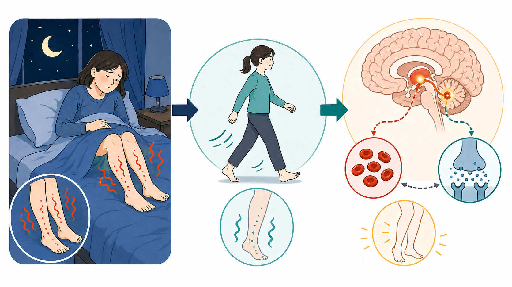
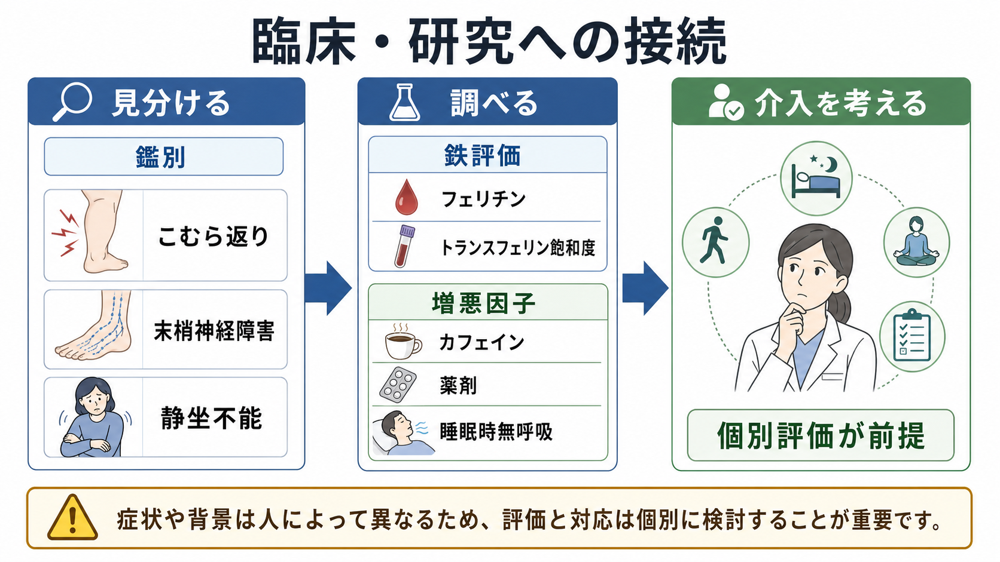

# むずむず脚症候群とは何か

## 要点

- むずむず脚症候群は、脚を中心とする不快な感覚と「動かしたい衝動」が、安静時に悪化し、動かすと軽くなり、夕方から夜に強まりやすい状態である。
- 睡眠関連運動障害として扱われ、[[不眠障害とは何か]]、[[概日リズム睡眠覚醒障害とは何か]]、[[レム睡眠行動障害とは何か]]、[[ナルコレプシーとは何か]]などと同じく、睡眠の質・日中機能・精神症状に影響する。
- 病態は単一原因ではなく、中枢神経系の鉄利用、ドパミン系、感覚運動ネットワーク、概日リズム、末梢要因、薬剤・併存疾患が重なるモデルで理解するとよい。
- 本稿は教育・研究目的の整理であり、個別の診断や治療指示ではない。症状が強い、急に変化した、妊娠・腎疾患・貧血・薬剤変更などの背景がある場合は医療者による評価が前提になる。

## この記事で答える問い

むずむず脚症候群は、「脚がむずむずする」という日常語だけでは捉えにくい。重要なのは、感覚の種類よりも、安静・夜間・運動による軽減という時間的・行動的パターンである。本稿では、診断概念、背景メカニズム、鑑別、臨床・研究との接続を整理する。

## まず結論

むずむず脚症候群は、主観的な下肢不快感そのものより、「脚を動かしたい衝動」「安静で悪化」「動かすと軽減」「夕方から夜に増悪」という組み合わせで特徴づけられる。国際的な診断基準でも、この4要素に加えて、他の医学的・行動的状態だけでは説明しきれないことが重視される[1]。そのため、単なる筋肉痛、こむら返り、末梢神経障害、静坐不能、睡眠時無呼吸に伴う睡眠断片化とは分けて考える必要がある。

## 背景

むずむず脚症候群は、Restless Legs Syndrome、あるいは Willis-Ekbom disease とも呼ばれる。一般人口ではまれな現象ではなく、調査法や重症度定義によって差はあるが、成人の数%で症状が報告される。頻度は女性、高齢者、妊娠、鉄欠乏、慢性腎臓病などで高くなる傾向が示されている[2][3]。ただし、症状があることと、臨床的に治療対象となる障害であることは同じではない。睡眠障害、日中の疲労、集中困難、気分・不安症状、生活機能低下と結びつく場合に、臨床的な意味が大きくなる[4]。

精神医学的には、むずむず脚症候群は身体疾患と精神症状の境界に置かれやすい。夜間の不快感と睡眠不足は[[うつ病とは何か]]や[[全般不安症とは何か]]の症状を悪化させることがあり、逆に不安や抑うつの文脈で身体感覚への注意が高まることもある。したがって、心理的要因か身体的要因かという二分法ではなく、睡眠、神経、鉄代謝、薬剤、生活リズムを同時に見る視点が必要になる。

## 基本概念

臨床的に重要な特徴は次の5点である[1][5]。

| 観点 | 典型的な特徴 | 見落としやすい点 |
|---|---|---|
| 運動衝動 | 脚を動かしたくなる | 「痛み」より「動かしたい」が中心になることがある |
| 安静との関係 | 座る、横になる、就寝前に強まる | 長距離移動や映画館でも出ることがある |
| 運動による軽減 | 歩く、伸ばす、さすることで一時的に軽くなる | 休むと再び出ることがある |
| 日内変動 | 夕方から夜に強い | 昼間にないから軽症とは限らない |
| 鑑別 | 他疾患だけでは説明できない | こむら返り、神経障害、静坐不能、関節痛と混同される |

「むずむず」という表現は便利だが、実際には、虫が這う感じ、引っ張られる感じ、熱い感じ、疼く感じ、落ち着かない感じなど、患者によって言葉が異なる。診断的に中心になるのは言葉の一致ではなく、症状がどの状況で悪化し、何で軽くなるかである。

## 仕組み

病態の中核としてよく議論されるのは、中枢神経系の鉄利用とドパミン系の調整である。血液検査上の貧血がなくても、脳内の鉄利用や鉄貯蔵の問題が関与する可能性があり、鉄はドパミン合成・神経伝達にも関係する[5][6]。このため、血清フェリチンやトランスフェリン飽和度などの評価が臨床上重視されることがある[7]。

ただし、「鉄不足だけ」「ドパミン不足だけ」で説明できるほど単純ではない。ドパミン作動薬が一部の症状に効く一方で、長期使用では症状の前倒し・広がり・悪化を示す augmentation が問題になることがあり、近年のガイドラインでは薬剤選択に慎重な重みづけがなされている[7]。また、症状が夕方から夜に強まることは、概日リズム、睡眠圧、運動系の興奮性、感覚入力の処理が時間帯によって変わることを示唆する。

## 図解

上の図は、夜間の脚不快感、歩行による一時的軽減、脳内鉄・ドパミン系との関連を要約したものである。第2図は、鑑別、鉄評価、増悪因子、個別評価の流れを示す。画像生成時に対象外テーマが混入した出力は採用せず、実在確認できた2枚だけを本文に挿入した。

追加で作るなら、次の図解案が有用である。

> 日本語インフォグラフィック。タイトルは「むずむず脚症候群のメカニズム仮説」。左から右へ「中枢の鉄利用」「ドパミン系の調整」「感覚運動ネットワーク」「夕方から夜に増悪」「不快感と運動衝動」を矢印で接続する。下部に「単一原因ではなく複数要因」と入れる。白背景、濃紺文字、鉄は赤褐色、夜間リズムは琥珀色。薬剤名や治療指示は入れない。

## 臨床・研究との接続

評価では、まず症状パターンを確認し、次に鑑別と背景因子を見る。代表的な鑑別には、こむら返り、末梢神経障害、関節疾患、静坐不能、夜間頻尿、睡眠時無呼吸、薬剤性の落ち着かなさがある。抗うつ薬、抗精神病薬、抗ヒスタミン薬などが症状に影響することもあり、薬剤歴の確認は重要である[4][7]。

治療研究では、鉄補充、α2δリガンド、ドパミン作動薬、オピオイド系薬剤などが議論されてきたが、現在の臨床判断では重症度、鉄状態、妊娠、腎疾患、併存症、augmentation リスクを含めた個別評価が必要である[7]。軽症例では、睡眠リズム、カフェイン・アルコール、運動、長時間安静をどう調整するかも検討されるが、生活指導だけで全例が改善するわけではない。

研究上は、主観的な不快感、周期性四肢運動、睡眠ポリグラフ、神経画像、鉄代謝指標、遺伝要因をどう統合するかが課題である。むずむず脚症候群は、身体感覚、運動衝動、睡眠、報酬・運動系の神経調整をつなぐモデルケースでもある。

## よくある誤解

**誤解1: 脚がむずむずすればすべて同じ病気である。**  
実際には、神経障害、筋けいれん、血管性疾患、関節疾患、薬剤性の静坐不能などが似た訴えを作る。診断では、安静・夜間・運動軽減というパターンが重要である[1]。

**誤解2: 貧血がなければ鉄は関係ない。**  
血中ヘモグロビンが正常でも、鉄貯蔵や中枢での鉄利用が問題になる場合がある。フェリチンなどの解釈は炎症や併存症の影響を受けるため、単独の数値だけで判断しない[5][7]。

**誤解3: 動けばよくなるなら軽い問題である。**  
歩行で一時的に軽くなること自体が特徴であり、夜間に反復すれば睡眠が分断される。慢性化すると疲労、集中困難、気分症状、生活機能低下につながる[4]。

**誤解4: ドパミンを増やせば解決する。**  
ドパミン系は重要だが、薬剤によっては長期的に augmentation が問題になる。近年のガイドラインは、短期的な症状軽減だけでなく長期リスクを考慮している[7]。

## 関連ノート

- [[不眠障害とは何か]]
- [[概日リズム睡眠覚醒障害とは何か]]
- [[レム睡眠行動障害とは何か]]
- [[ナルコレプシーとは何か]]
- [[うつ病とは何か]]
- [[全般不安症とは何か]]

MOC更新候補: 睡眠障害、精神医学、神経科学、臨床精神医学のMOCに追加候補。並列ジョブとの競合を避けるため、本稿ではMOC本文は更新しない。

## 理解チェック

1. むずむず脚症候群で、感覚の種類以上に重要な4つのパターンは何か。
2. こむら返りや末梢神経障害と区別するとき、どのような質問が役立つか。
3. 鉄とドパミン系は、なぜ同じ病態モデルの中で語られやすいのか。
4. ドパミン作動薬の長期使用で問題になる augmentation とは何か。
5. 睡眠障害と気分・不安症状を、どのように双方向的に考えられるか。

## 参考文献

[1] Allen, R. P., Picchietti, D. L., Garcia-Borreguero, D., et al. (2014). Restless legs syndrome/Willis-Ekbom disease diagnostic criteria: Updated International Restless Legs Syndrome Study Group criteria. *Sleep Medicine*, 15(8), 860-873. https://doi.org/10.1016/j.sleep.2014.03.025

[2] Ohayon, M. M., O'Hara, R., & Vitiello, M. V. (2012). Epidemiology of restless legs syndrome: A synthesis of the literature. *Sleep Medicine Reviews*, 16(4), 283-295. https://doi.org/10.1016/j.smrv.2011.05.002

[3] Broström, A., Alimoradi, Z., Lind, J., Ulander, M., Lundin, F., & Pakpour, A. (2023). Worldwide estimation of restless legs syndrome: A systematic review and meta-analysis of prevalence in the general adult population. *Journal of Sleep Research*, 32(3), e13783. https://doi.org/10.1111/jsr.13783

[4] Gossard, T. R., Trotti, L. M., Videnovic, A., & St Louis, E. K. (2021). Restless Legs Syndrome: Contemporary Diagnosis and Treatment. *Neurotherapeutics*, 18, 140-155. https://doi.org/10.1007/s13311-021-01019-4

[5] Allen, R. P., & Earley, C. J. (2007). The role of iron in restless legs syndrome. *Movement Disorders*, 22(S18), S440-S448. https://doi.org/10.1002/mds.21607

[6] Connor, J. R., Patton, S. M., Oexle, K., & Allen, R. P. (2017). Iron and restless legs syndrome: Treatment, genetics and pathophysiology. *Sleep Medicine*, 31, 61-70. https://doi.org/10.1016/j.sleep.2016.07.028

[7] Winkelman, J. W., et al. (2025). Treatment of restless legs syndrome and periodic limb movement disorder: An American Academy of Sleep Medicine clinical practice guideline. *Journal of Clinical Sleep Medicine*, 21(1), 137-152. https://doi.org/10.5664/jcsm.11390
