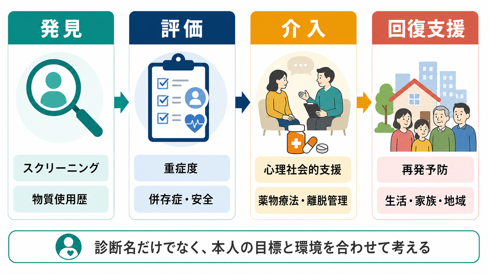
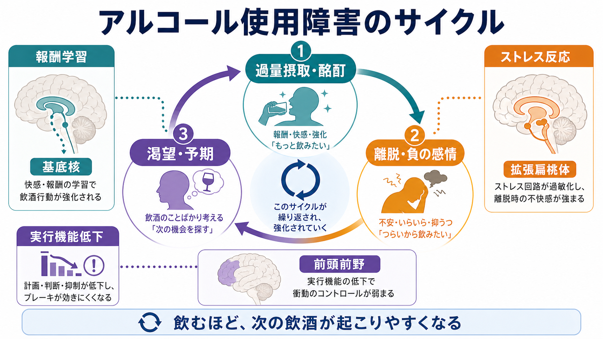
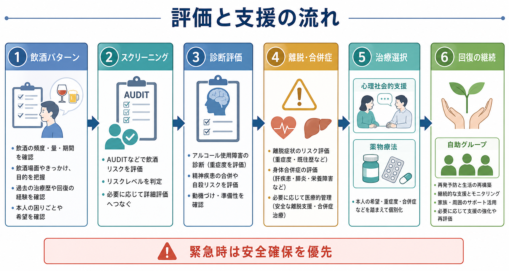

# アルコール使用障害とは何か

## 要点

- アルコール使用障害は、飲酒量の多さだけでなく、飲酒を減らす・やめることの難しさ、渇望、耐性・離脱、健康・対人・職業・学業への悪影響が続く状態として理解する。
- DSM-5 系の説明では、11項目の症状のうち一定数が12か月内にみられると重症度を含めて評価される。ICD-11 では「物質使用による障害」の中で、有害な使用パターン、依存、離脱、物質誘発性精神・身体症状などを区別する[1][2]。
- 中核は「飲むと報酬・緊張緩和が得られる」「切れると不快・不安・不眠が増す」「手がかりやストレスで渇望が再燃する」という循環であり、[[報酬系とは何か]]、基底核、拡張扁桃体、[[前頭前野は情動制御にどう関わるのか|前頭前野]]の制御低下が関わる[4][5]。
- 臨床では、飲酒量だけでなく、離脱リスク、身体合併症、併存する[[うつ病とは何か|抑うつ]]・[[不安症群とは何か|不安]]、自殺リスク、家族・仕事・法的問題、本人の変化への準備性を評価する[3][7]。
- 本稿は教育・研究目的の整理であり、個別の診断や治療指示ではない。けいれん、意識障害、強い離脱症状、自傷他害リスクがある場合は、一般論より安全確保と専門的評価が優先される。

## この記事で答える問い

1. アルコール使用障害は、単なる「飲みすぎ」とどう違うのか。
2. なぜ本人が困っていても飲酒制御が難しくなるのか。
3. 評価では何を確認し、どのような支援につなげるのか。
4. よくある誤解は、どこで臨床や研究の理解を妨げるのか。

## まず結論

アルコール使用障害とは、飲酒が本人の価値観や生活目標に反して続き、身体・心理・社会生活に害が出ているにもかかわらず、飲酒を始める、続ける、止める、減らす行動の制御が難しくなる状態である。したがって、評価の中心は「何本飲んだか」だけではない。いつ、どの場面で、何のために飲み、飲んだ後に何が起こり、やめようとしたときに何が妨げになるのかをみる必要がある。

この見方は、[[依存症は報酬学習の病態としてどう理解できるのか]]で扱う報酬学習モデルとよく対応する。飲酒は、快感だけでなく、不眠、不安、緊張、孤立、身体的不快を一時的に下げる手段として学習される。その結果、本人が「やめたい」と考えていても、環境の手がかり、負の感情、離脱症状、習慣化した行動系列が次の飲酒を起こしやすくする[4][5]。

## 背景

アルコールは合法で広く利用される物質であるため、問題が「病気」なのか「生活習慣」なのかが曖昧に扱われやすい。しかし臨床的には、アルコールは中枢神経系、肝臓、消化器、循環器、睡眠、認知機能、気分、不安、対人関係、事故リスクに影響しうる。飲酒が長期化・反復化すると、飲酒行動は単なる選好ではなく、学習、離脱、不快感の軽減、習慣、社会環境の相互作用として固定されやすくなる[1][4]。

公衆衛生の観点では、AUDIT などのスクリーニングにより不健康な飲酒を早期に拾い、短時間の行動カウンセリングや専門治療につなげることが推奨される[7][8]。一方で、スクリーニングの点数だけで診断や治療方針が決まるわけではない。[[物質使用歴はどのように聞くべきか]]で扱うように、飲酒パターン、合併症、本人の困りごと、生活背景を合わせて評価する必要がある。

## 基本概念

### 診断概念

DSM-5 系のアルコール使用障害は、飲酒量そのものではなく、コントロール困難、社会的障害、危険な使用、薬理学的指標である耐性・離脱などを含む症候群として整理される。NIAAA は、臨床的には「意図したより多く、長く飲む」「やめたいのにやめられない」「飲酒や回復に時間を取られる」「渇望」「仕事・学校・家庭で問題が出る」「危険な状況で飲む」「健康問題があっても続く」「耐性・離脱」などを重要な評価項目として説明している[1]。

ICD-11 では、アルコール使用による障害を、有害な使用パターン、依存、離脱、アルコール誘発性の精神・身体症状などに分けて扱う。依存の中心には、使用制御の障害、飲酒が他の活動より優先されること、生理学的特徴、害があっても持続することがある[2]。DSM と ICD の違いを理解するには、[[DSMとICDは何が違うのか]]も参照できる。

### 「量」だけで判断しない

大量飲酒はリスクを高めるが、少量だから問題がないとは限らない。少量でも、妊娠、肝疾患、膵炎、特定薬剤との併用、運転、職場での安全、過去の重い離脱、強い自殺念慮があれば、臨床的な重要性は高い。逆に、飲酒量が多く見えても、診断は量だけで機械的に決めるものではなく、飲酒による害と制御困難の持続を確認する。

## 仕組み

### 1. 報酬学習と正の強化

アルコールは、気分の高揚、緊張の軽減、社会的場面での安心感などの結果と結びつく。この結びつきが繰り返されると、飲酒場面、時間帯、人間関係、場所、広告、身体感覚が手がかりとなり、飲酒を予期する反応が起こりやすくなる。[[報酬予測誤差とは何か]]で扱うように、報酬の予測と結果のずれは学習を更新し、飲酒手がかりの価値を変える。

### 2. 離脱と負の強化

使用が反復されると、飲酒している状態に身体が適応し、飲まない状態で不眠、不安、発汗、振戦、焦燥、気分不快などが出ることがある。飲酒がこれらの不快感を一時的に下げると、「快感を得るため」だけでなく「つらさを下げるため」の飲酒が学習される。重い離脱では、けいれん、せん妄、意識障害などを伴うことがあり、急な中止が危険になる場合がある[3]。

### 3. 実行機能と習慣化

長期的な目標、抑制、計画、意思決定には[[実行機能とは何か|実行機能]]が関わる。アルコール使用障害では、渇望やストレス反応が強まる一方で、前頭前野を含む制御系が十分に働きにくくなり、短期的な不快軽減が長期的な不利益を上回って選ばれやすくなる[4][5]。これは本人の意思が「ない」という意味ではなく、意思を行動に反映する条件が弱くなっているという意味である。

### 4. 併存症と相互増悪

アルコール使用障害は、抑うつ、不安、不眠、PTSD、双極性障害、疼痛、認知機能低下、肝疾患などと併存しやすい。アルコールが一時的に症状を和らげるように感じられても、長期的には睡眠、気分、衝動性、対人関係、薬物療法の安全性を悪化させる場合がある。研究や臨床では、飲酒が症状を悪化させているのか、症状への対処として飲酒が増えているのか、両者が循環しているのかを分けて考える。

## 図解

図1は、発見、評価、介入、回復支援までの大きな流れを示す。アルコール使用障害は診断名だけで完結せず、本人の目標、環境、重症度、合併症、支援資源を合わせて考える必要がある。

図2は、過量摂取・酩酊、離脱・負の感情、渇望・予期が循環する仕組みを示す。飲酒が報酬学習、ストレス反応、実行機能低下と結びつくと、次の飲酒が起こりやすくなる。

図3は、評価と支援の流れを示す。スクリーニングは入口であり、診断評価、離脱・合併症の確認、心理社会的支援、薬物療法、自助グループ、継続的なモニタリングが組み合わされる。

## 臨床・研究との接続

### 評価

評価では、飲酒日数、1回量、連続飲酒、朝酒、ブラックアウト、離脱症状、過去の減酒・断酒歴、事故、暴力、運転、仕事・学業への影響、家族関係、身体合併症、併存する精神症状を確認する。AUDIT は、危険な飲酒や有害な飲酒のスクリーニングとして有用だが、点数は面接の代替ではない[7][8]。

離脱リスクがある場合は、減酒・断酒の一般論よりも安全管理が優先される。重症例では医療機関での評価、身体状態の確認、チアミン補充、合併症管理、薬物療法、心理社会的支援が組み合わされる[3][6]。

### 治療・支援

支援の方向性は一つではない。動機づけ面接、認知行動療法、家族支援、自助グループ、ケースマネジメント、併存精神疾患の治療、住居・仕事・対人関係の支援が重要になる。薬物療法では、ナルトレキソンやアカンプロサートなどが、飲酒量や再飲酒リスクの低下を支える選択肢として検討される[3][6]。ただし、薬剤選択は肝機能、腎機能、妊娠、併用薬、本人の目標、医療アクセスによって異なるため、個別判断が必要である。

### 研究

研究では、手がかり反応性、ストレス負荷、意思決定課題、強化学習モデル、脳画像、縦断追跡が用いられる。関心は「なぜ飲むのか」だけでなく、「なぜやめたい意図が行動に移りにくいのか」「どの介入がどの人に効きやすいのか」「再発を責めずに予測・予防するには何を測ればよいのか」に移っている。

## よくある誤解

### 誤解1: 意志が弱いだけである

意志や価値観は重要だが、それだけで説明すると、離脱、不眠、渇望、手がかり、ストレス、対人環境、貧困、孤立、併存症、神経適応を見落とす。より実用的には、本人の意思を支える環境、行動計画、医療、心理社会的支援を整える問題として考える。

### 誤解2: すぐ断酒できなければ治療失敗である

回復は直線ではない。再飲酒があっても、量、頻度、危険行動、身体合併症、生活機能、支援への接続が改善している場合がある。再飲酒は責める材料ではなく、手がかり、離脱、不眠、孤立、ストレス、治療アクセスのどこに弱点があったかを見直す情報になる。

### 誤解3: アルコールは合法なので薬物使用障害とは別物である

法的地位と神経生物学的リスクは別である。アルコールは合法で社会的に受け入れられているが、依存、離脱、身体合併症、事故、対人・職業上の影響をもたらしうる。したがって、他の物質使用障害と同様に、報酬学習、離脱、制御困難、環境要因を含めて評価する。

## 関連ノート

### 既存ノート

- [[物質使用歴はどのように聞くべきか]]: 飲酒量、頻度、目的、問題、離脱リスクを構造化して聞くための入口。
- [[依存症は報酬学習の病態としてどう理解できるのか]]: 報酬学習、手がかり、渇望、負の強化から依存を理解する基礎。
- [[DSMとICDは何が違うのか]]: 診断分類体系の違いを理解する補助線。
- [[報酬系とは何か]]: アルコール使用障害の報酬学習メカニズムの背景。
- [[前頭前野は情動制御にどう関わるのか]]: 渇望や衝動を抑える制御系の理解。
- [[精神医学における回復とは何か]]: 再発の有無だけでなく生活機能や意味づけを含めて回復を考える視点。

### 関連ノート候補

- AUDITとは何か
- アルコール離脱症候群とは何か
- 動機づけ面接とは何か
- ナルトレキソンとアカンプロサートはどう違うのか
- ハームリダクションとは何か

### MOC更新候補

- `content/00_MOC/MOC｜精神医学.md`
- `content/00_MOC/MOC｜臨床実践・治療.md`
- `content/00_MOC/MOC｜神経科学と精神疾患.md`
- `content/00_MOC/MOC｜学習・行動・動機づけ.md`

並列ジョブとの競合を避けるため、本タスクでは MOC 本体は更新しない。

## 理解チェック

1. アルコール使用障害を「飲酒量」だけで判断できない理由は何か。
2. 正の強化と負の強化は、飲酒行動をどのように別々に維持するか。
3. 離脱リスクがある場合、なぜ急な中止を一般論として勧めてはいけないのか。
4. 再飲酒を「失敗」ではなく評価情報として扱うと、どのような支援設計につながるか。
5. DSM と ICD の診断概念の違いを知ることは、臨床・研究でなぜ重要か。

## 参考文献

[1] National Institute on Alcohol Abuse and Alcoholism. *Alcohol Use Disorder: A Comparison Between DSM-IV and DSM-5*. https://www.niaaa.nih.gov/publications/brochures-and-fact-sheets/alcohol-use-disorder-comparison-between-dsm

[2] World Health Organization. *ICD-11 for Mortality and Morbidity Statistics: Disorders due to substance use or addictive behaviours*. https://icd.who.int/browse/2026-01/mms/en

[3] National Institute for Health and Care Excellence. *Alcohol-use disorders: diagnosis, assessment and management of harmful drinking and alcohol dependence* (CG115). https://www.nice.org.uk/guidance/cg115

[4] Koob GF, Volkow ND. Neurobiology of addiction: a neurocircuitry analysis. *The Lancet Psychiatry*. 2016;3(8):760-773. https://doi.org/10.1016/S2215-0366(16)00104-8

[5] Volkow ND, Koob GF, McLellan AT. Neurobiologic advances from the brain disease model of addiction. *New England Journal of Medicine*. 2016;374(4):363-371. https://doi.org/10.1056/NEJMra1511480

[6] Jonas DE, Amick HR, Feltner C, et al. Pharmacotherapy for adults with alcohol use disorders in outpatient settings: a systematic review and meta-analysis. *JAMA*. 2014;311(18):1889-1900. https://doi.org/10.1001/jama.2014.3628

[7] Babor TF, Higgins-Biddle JC, Saunders JB, Monteiro MG. *AUDIT: The Alcohol Use Disorders Identification Test: Guidelines for use in primary health care* (2nd ed.). World Health Organization. 2001. https://iris.who.int/handle/10665/67205

[8] US Preventive Services Task Force. Screening and behavioral counseling interventions to reduce unhealthy alcohol use in adolescents and adults: US Preventive Services Task Force recommendation statement. *JAMA*. 2018;320(18):1899-1909. https://doi.org/10.1001/jama.2018.16789

## 未解決問題

- 飲酒量、渇望、睡眠、ストレス、社会的孤立を組み合わせて、個人ごとの再飲酒リスクをどこまで予測できるか。
- 断酒目標と減酒目標を、どの臨床指標・本人の価値観・安全リスクに基づいて使い分けるべきか。
- 脳画像や強化学習課題を、個人診療ではなく支援設計の補助としてどう安全に使えるか。
- 併存する抑うつ、不安、疼痛、トラウマ反応への介入が、飲酒制御困難にどの程度影響するか。
