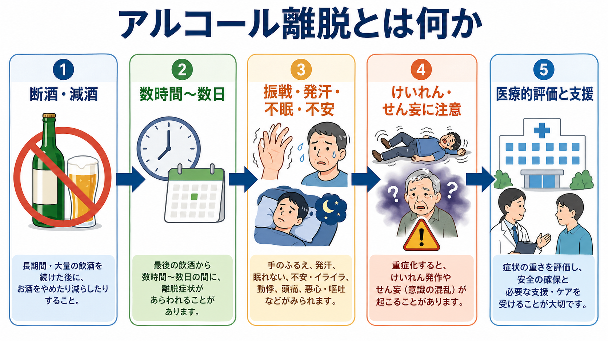
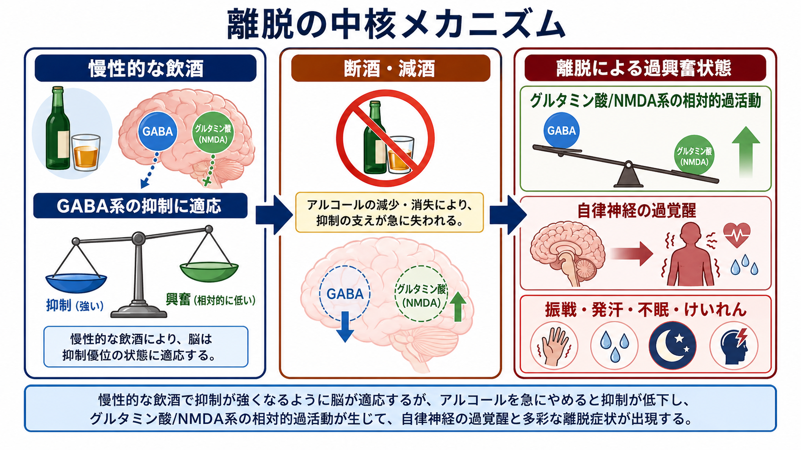
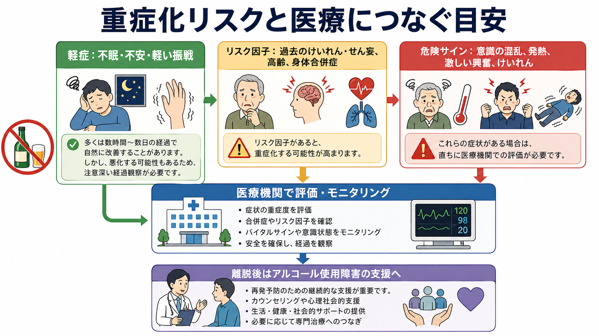

# アルコール離脱とは何か

## 要点

- アルコール離脱とは、長期間・大量の飲酒を続けたあとに断酒または減酒したとき、脳と自律神経が過興奮になり、振戦、発汗、不眠、不安、悪心、頻脈、高血圧、幻覚、けいれん、せん妄などが出る状態である[1][2]。
- 多くは最後の飲酒から数時間〜数日のあいだに目立つが、重症例では離脱けいれんや振戦せん妄が起こり、医療的評価とモニタリングが必要になる[1][3]。
- 仕組みの中心には、慢性飲酒への適応としてのGABA系・グルタミン酸/NMDA系の再調整、自律神経系の過覚醒、過去の離脱を重ねることで重症化しやすくなる「kindling」がある[4][5]。
- この記事は教育・研究目的の整理であり、個別の断酒方法や治療指示ではない。重い症状、過去のけいれん・せん妄、身体合併症がある場合は、自己判断で急に中断せず医療機関につなぐ必要がある[1][6]。

## この記事で答える問い

1. アルコール離脱は、単なる二日酔いや[[中毒症状とは何か|中毒症状]]と何が違うのか。
2. なぜ断酒・減酒後に、振戦、発汗、不眠、けいれん、[[せん妄とは何か|せん妄]]が起こり得るのか。
3. どのような場合に重症化リスクを考え、医療的評価につなぐべきか。
4. 離脱を乗り越えたあと、アルコール使用そのものへの支援とどう接続するか。

## まず結論

アルコール離脱は、「酒が切れてつらい」という心理的反応だけではなく、慢性飲酒に適応していた脳が、急にアルコールの抑制作用を失うことで起こる生理学的な過興奮状態である。典型的には、手指のふるえ、発汗、動悸、血圧上昇、吐き気、[[不眠とは何か|不眠]]、不安、焦燥が出る。重症化すると、離脱けいれん、幻覚、見当識障害、意識の混乱、発熱、強い自律神経症状を伴う振戦せん妄に進むことがある[1][2][3]。

二日酔いは主に急性飲酒後の脱水、睡眠障害、アセトアルデヒド、胃腸症状などが中心である。一方、アルコール離脱は、反復飲酒への神経適応が背景にあり、飲酒量を減らしたり止めたりしたあとに症状が出る。したがって「本人の我慢が足りない」ではなく、飲酒歴、過去の離脱、身体疾患、併用薬、栄養状態、意識状態を含めて評価する医学的問題として扱う必要がある[1][6]。

## 背景

アルコールは、中枢神経に対して抑制的に働く。飲酒が一時的で少量なら、脳はその変化から比較的すぐ戻る。しかし長期間・大量の飲酒が続くと、脳は「アルコールが常にある状態」に合わせて受容体や神経回路の働きを調整する。そこで急に飲酒が止まると、抑制の支えが外れ、興奮側が相対的に強くなる。

この状態は、[[離脱症状とは何か|離脱症状]]の一種である。アルコール離脱は、軽症なら外来や地域支援のなかで評価されることもあるが、重症例では精神科救急、一般救急、内科、依存症診療が交差する。とくに高齢者、肝疾患、感染、頭部外傷、電解質異常、低血糖、薬剤離脱、[[せん妄とは何か|せん妄]]、てんかんなどが重なると、症状の原因を単純に「アルコールだけ」と決められない[3][6]。

## 基本概念

アルコール離脱でよくみられる症状は、手指や全身のふるえ、発汗、頻脈、血圧上昇、吐き気、頭痛、不眠、不安、焦燥である。これらは自律神経の過覚醒と中枢神経の過興奮を反映する。幻視や幻聴が出ることもあるが、意識の混乱や見当識障害が強い場合は、振戦せん妄や他の身体疾患によるせん妄を考える必要がある[2][3]。

時間経過は個人差が大きい。一般に、軽い離脱症状は最後の飲酒から数時間後に出始め、1〜3日程度で目立つことが多い。離脱けいれんは比較的早期に起こることがあり、振戦せん妄はより遅れて出ることがある[2][7]。ただし、飲酒量、半減期の長い薬剤、肝機能、栄養状態、既往歴によってずれるため、時刻だけで安全性を判断しない。

## 仕組み

慢性飲酒では、[[GABAは脳で何をしているのか|GABA]]を介した抑制性伝達と、[[グルタミン酸は脳で何をしているのか|グルタミン酸]]、とくにNMDA受容体を介した興奮性伝達のバランスが変わる。アルコールがある状態に脳が適応していると、断酒・減酒によって抑制が急に弱まり、相対的に興奮が前面に出る。この過興奮が、振戦、不眠、焦燥、けいれん、せん妄の基盤になる[4][5]。

同時に、[[ノルアドレナリンは覚醒とストレスにどう関わるのか|ノルアドレナリン]]系や視床下部-下垂体-副腎系を含むストレス反応も高まりやすい。これにより、発汗、動悸、血圧上昇、不安、過覚醒が強まる。離脱を何度も経験すると次の離脱が重くなりやすいというkindling仮説も、臨床的に重要である。過去の離脱けいれんや振戦せん妄は、次回の重症化リスクを上げる手がかりになる[5][7]。

## 図解

図の要点は、症状の「有無」だけでなく、重症化しやすい背景を同時に見ることである。軽い不眠や不安だけに見えても、過去に離脱けいれんや振戦せん妄がある、飲酒量が多い、高齢である、肝疾患・感染・頭部外傷・低栄養がある、ベンゾジアゼピンなど他の中枢神経抑制薬の使用や中断が絡む、といった条件では評価の優先度が上がる[1][6]。

## 臨床・研究との接続

臨床では、まず安全確保と鑑別が重要になる。評価では、最後の飲酒時刻、飲酒量、過去の離脱歴、けいれん・せん妄の既往、併用薬、身体疾患、バイタルサイン、意識状態、脱水、低血糖、電解質異常、肝疾患、感染、頭部外傷を確認する。[[物質使用歴はどのように聞くべきか|物質使用歴]]は責めるためではなく、リスクを見積もるための情報である。

治療に関するガイドラインでは、重症化予防、症状評価、モニタリング、ベンゾジアゼピン系薬の適切な使用、チアミン補充、身体合併症への対応が重視される[1][3][6]。ただし、薬剤選択や投与量は個別の身体状態と医療環境に依存するため、この記事では扱わない。急性期を越えたあとには、再飲酒を単に責めるのではなく、アルコール使用障害の評価、心理社会的支援、家族支援、再発予防、地域資源への接続を組み合わせることが重要である[1][8]。

研究面では、アルコール離脱は「脳の抑制と興奮の恒常性が、慢性曝露と急な中断でどう破綻するか」を見るモデルでもある。GABA、NMDA、ストレス系、自律神経、睡眠、報酬学習、kindlingを統合して考えることで、依存症を単なる意思の問題ではなく、学習・適応・身体リスクが絡む状態として理解できる。

## よくある誤解

「飲酒をやめれば必ずよくなる」とは限らない。長期大量飲酒のあとでは、急な断酒そのものが危険になることがある。禁酒が重要であっても、重症化リスクが高い人では医療的に計画された離脱管理が必要になる[1][6]。

「震えているだけなら軽い」とも限らない。振戦は軽症でもみられるが、頻脈、発汗、高血圧、不眠、幻覚、意識の混乱、発熱、けいれんが加わるとリスクは上がる。とくに[[せん妄とは何か|せん妄]]は、低血糖、感染、肝性脳症、薬剤、頭部外傷などでも起こるため、[[精神科救急では何を優先するべきか|精神科救急]]や身体診療の視点が必要になる。

「離脱が終われば問題は解決する」わけでもない。離脱管理は急性期の安全確保であり、その後に飲酒行動、渇望、生活リズム、孤立、併存するうつ・不安、身体合併症を扱わなければ再発しやすい。アルコール離脱は、アルコール使用障害への継続支援につなぐ入口として位置づけるほうが実践的である[8]。

## 関連ノート

- [[離脱症状とは何か]]
- [[中毒症状とは何か]]
- [[せん妄とは何か]]
- [[不眠とは何か]]
- [[GABAは脳で何をしているのか]]
- [[グルタミン酸は脳で何をしているのか]]
- [[ノルアドレナリンは覚醒とストレスにどう関わるのか]]
- [[物質使用歴はどのように聞くべきか]]
- [[精神科救急では何を優先するべきか]]
- 今後の作成候補: アルコール使用障害とは何か、ウェルニッケ脳症とは何か、振戦せん妄とは何か

## MOC更新候補

- `content/00_MOC/MOC｜精神医学.md`
- `content/00_MOC/MOC｜症候学.md`
- `content/00_MOC/MOC｜総論・診断・面接.md`

## 理解チェック

1. アルコール離脱と二日酔いは、時間関係と背景にある神経適応の点でどう違うか。
2. 慢性飲酒後の断酒・減酒で、GABA系とグルタミン酸/NMDA系のバランスはどのように変わるか。
3. 過去の離脱けいれんや振戦せん妄がある人で、なぜ重症化リスクを高く見積もるべきか。
4. 離脱管理のあとに、アルコール使用そのものへの支援が必要になる理由は何か。

## 参考文献

[1] American Society of Addiction Medicine. (2020). *The ASAM Clinical Practice Guideline on Alcohol Withdrawal Management*. https://www.asam.org/quality-care/clinical-guidelines/alcohol-withdrawal-management-guideline

[2] Jesse, S., Bråthen, G., Ferrara, M., et al. (2017). Alcohol withdrawal syndrome: Mechanisms, manifestations, and management. *Acta Neurologica Scandinavica*, 135(1), 4-16. https://doi.org/10.1111/ane.12671

[3] Schuckit, M. A. (2014). Recognition and management of withdrawal delirium (delirium tremens). *The New England Journal of Medicine*, 371(22), 2109-2113. https://doi.org/10.1056/NEJMra1407298

[4] Kosten, T. R., & O'Connor, P. G. (2003). Management of drug and alcohol withdrawal. *The New England Journal of Medicine*, 348(18), 1786-1795. https://doi.org/10.1056/NEJMra020617

[5] Becker, H. C. (1998). Kindling in alcohol withdrawal. *Alcohol Health & Research World*, 22(1), 25-33. https://pmc.ncbi.nlm.nih.gov/articles/PMC6761822/

[6] National Institute for Health and Care Excellence. (2010, updated). *Alcohol-use disorders: diagnosis and management of physical complications (CG100)*. https://www.nice.org.uk/guidance/cg100

[7] Bayard, M., McIntyre, J., Hill, K. R., & Woodside, J. (2004). Alcohol withdrawal syndrome. *American Family Physician*, 69(6), 1443-1450. https://www.aafp.org/pubs/afp/issues/2004/0315/p1443.html

[8] National Institute for Health and Care Excellence. (2011, updated). *Alcohol-use disorders: diagnosis, assessment and management of harmful drinking and alcohol dependence (CG115)*. https://www.nice.org.uk/guidance/cg115

## 未解決問題

- 軽症離脱を地域で安全に評価するための最適なリスク層別化は、医療資源や社会的支援体制によって変わる。
- kindling、睡眠障害、ストレス反応、渇望が再飲酒にどうつながるかは、神経生物学と心理社会的文脈を統合して検討する必要がある。
- アルコール離脱後の継続支援を、身体診療、精神科、依存症専門治療、地域支援のあいだでどう途切れさせないかが実装上の課題である。
