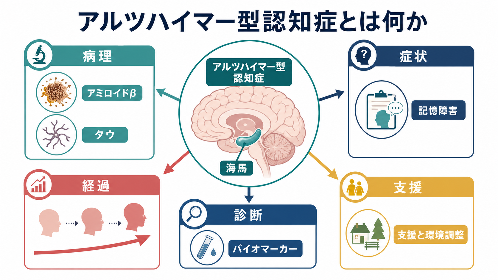
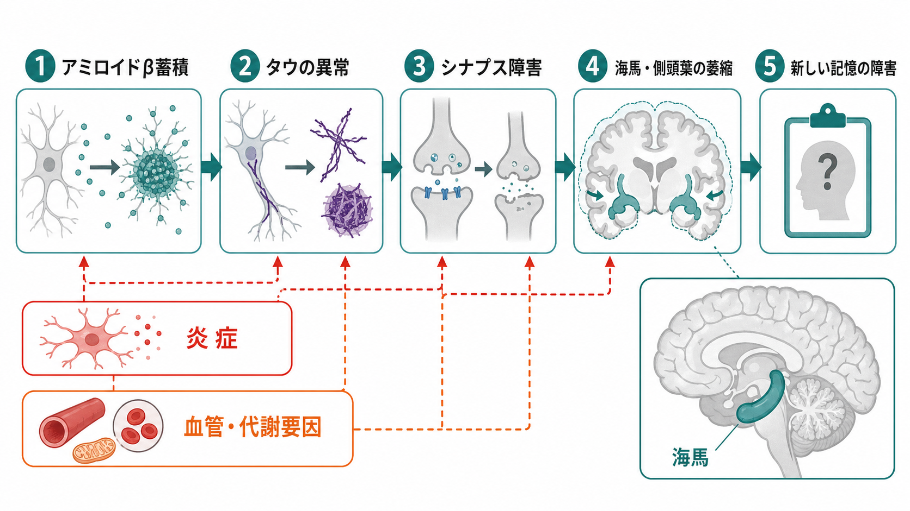
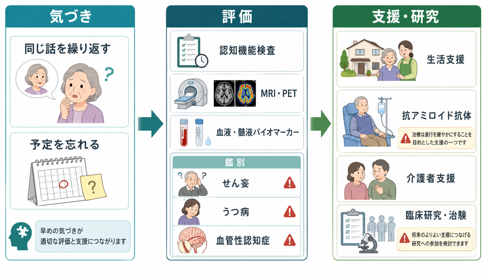

# アルツハイマー型認知症とは何か

## 要点

- アルツハイマー型認知症は、[[認知症とは何か|認知症]]の原因疾患として最も多い群で、世界の認知症例の約60-70%に関与するとされる[1]。
- 典型例では、近時記憶の障害から始まり、時間・場所の見当識、言語、遂行機能、日常生活機能へ影響が広がる。
- 病理の中心には、アミロイドβプラーク、タウによる神経原線維変化、シナプス障害、神経細胞死、脳萎縮がある[2][3]。
- 近年は「症候名」だけでなく、PET、髄液、血液などのバイオマーカーで病態を捉える方向に診断研究が進んでいる[4]。
- 治療は「治す」だけでなく、本人の生活、介護者支援、環境調整、併存疾患管理、研究的治療の適応判断を含む包括的支援として考える。

## この記事で答える問い

1. アルツハイマー型認知症は、単なる「もの忘れ」と何が違うのか。
2. アミロイドβ、タウ、海馬萎縮は、症状とどうつながるのか。
3. 臨床では、どのような鑑別と評価が必要になるのか。
4. バイオマーカーや抗アミロイド抗体は、理解の地図をどう変えたのか。

## まず結論

アルツハイマー型認知症は、「記憶を失う病気」とだけ理解すると狭すぎる。より正確には、アミロイドβやタウを含む複数の病理過程が、海馬・側頭葉を含むネットワークを傷つけ、[[記憶障害とは何か|記銘・保持・想起]]、見当識、言語、判断、生活管理を徐々に難しくしていく神経変性疾患である[2][3]。

ただし、症状だけでアルツハイマー病理を断定することはできない。せん妄、うつ病、薬剤、睡眠障害、血管性認知症、レビー小体型認知症、前頭側頭型認知症などでも認知機能低下は起こる。したがって臨床では、本人・家族からの生活史、認知機能評価、身体疾患・薬剤の確認、画像検査、必要に応じたバイオマーカーを組み合わせる[4]。

## 背景

認知症は、記憶や判断などの認知機能が低下し、日常生活に支障を来す状態である。WHOは、2021年に世界で約5700万人が認知症とともに生活し、毎年約1000万人の新規例があると報告している[1]。日本でも2022年時点で65歳以上の認知症高齢者は約443万人、MCIは約559万人と推計され、2040年には認知症約584万人、MCI約613万人が見込まれている[8]。

この数字は、アルツハイマー型認知症を「個人の記憶の問題」だけでなく、地域、家族、医療、介護、制度設計の問題として扱う必要があることを示す。早期発見の目的も、単に病名をつけることではなく、危険な生活場面を減らし、意思決定支援を早く始め、可逆的要因や併存症を見落とさないことにある。

## 基本概念

アルツハイマー型認知症は、アルツハイマー病理を背景に、認知機能低下が日常生活機能の低下として表れた状態を指す。研究上は「アルツハイマー病」を生物学的病態として定義し、「認知症」を臨床的な機能障害として区別する流れが強まっている[4]。

典型的な初期像は、以下のような近時記憶の障害である。

- 同じ質問や話を繰り返す。
- 約束、予定、支払い、服薬を忘れる。
- 新しい道順や手順を覚えにくい。
- 物を置いた場所を忘れ、探し物が増える。
- 以前できていた家計管理、料理、交通機関の利用が負担になる。

ここで重要なのは、単発の「うっかり」ではなく、以前の本人と比べた変化が持続し、生活の自立性に影響しているかである。[[認知機能低下はどのように評価するのか|認知機能低下の評価]]では、検査点数だけでなく、本人の職業歴、教育歴、生活環境、家族から見た変化を合わせて読む。

## 仕組み

病理学的には、アルツハイマー病ではアミロイドβが細胞外にプラークとして蓄積し、タウが神経細胞内で異常にリン酸化・凝集して神経原線維変化をつくる。これにシナプス機能低下、神経炎症、血管・代謝要因、神経細胞死が重なり、脳ネットワークの効率が落ちる[2][3]。

記憶障害との接点で特に重要なのが海馬と内側側頭葉である。海馬は新しいエピソード記憶の形成に関わるため、ここを含むネットワークが障害されると、昔の記憶よりも「最近の出来事を新しく覚えること」が先に難しくなりやすい。これは[[海馬回路は記憶をどう形成するのか|海馬回路]]の機能低下として理解できる。

一方で、アルツハイマー型認知症は海馬だけの病気ではない。進行とともに側頭葉、頭頂葉、前頭葉を含む広いネットワークに影響が広がり、言葉が出にくい、道に迷う、手順立てが難しい、判断が遅くなる、意欲や感情の変化が目立つ、といった症状が重なる。

## 図解

3枚の図は、それぞれ「全体像」「病理メカニズム」「臨床評価と支援への接続」を示す。

| 観点 | 見るポイント | 注意点 |
|---|---|---|
| 症状 | 近時記憶、見当識、言語、遂行機能、生活機能 | 本人の病前能力との差を見る |
| 病理 | アミロイドβ、タウ、シナプス障害、萎縮 | 単一原因ではなく複数過程の重なり |
| 鑑別 | [[せん妄とは何か|せん妄]]、うつ病、薬剤、血管性認知症、レビー小体型認知症、前頭側頭型認知症 | 急性発症、日内変動、幻視、人格変化は特に確認 |
| 評価 | 生活歴、身体診察、[[認知機能検査は何を測っているのか|認知機能検査]]、MRI、PET、髄液・血液バイオマーカー | バイオマーカーは臨床評価を置き換えるものではない |
| 支援 | 環境調整、服薬・金銭管理、家族支援、社会資源、治療適応の検討 | 教育・研究目的の情報であり、個別診断や治療指示ではない |

## 臨床・研究との接続

2024年の改訂診断基準では、アルツハイマー病を臨床症候だけでなく生物学的プロセスとして定義し、アミロイドPET、髄液Aβ42/40比、p-tau関連指標、精度の高い血液p-tau217などを「中核バイオマーカー」として整理している[4]。これは研究と治療選択を精密化する一方で、無症状者への安易な検査や、結果だけで生活上の意味を断定する危険も伴う。

治療研究では、抗アミロイド抗体が早期アルツハイマー病の進行を一定程度遅らせることが示された。レカネマブの第3相試験では、18か月で臨床的低下の進行がプラセボより小さかった[6]。ドナネマブのTRAILBLAZER-ALZ 2試験でも、早期症候性アルツハイマー病で臨床進行の抑制が報告された[7]。ただし、これらは主に早期例で、アミロイド病理の確認、適応判断、ARIAなどの安全性監視が必要な治療であり、すべての認知症に使える一般的治療ではない。

また、予防とケアの観点では、教育、聴力、血圧、喫煙、肥満、うつ、身体活動、糖尿病、過量飲酒、頭部外傷、大気汚染、社会的孤立、高LDLコレステロール、視力低下など、修正可能なリスク因子への介入が認知症リスクを下げうると整理されている[5]。これは「自己責任」として読むべきではなく、地域・医療・福祉が支援環境を整えるための公衆衛生的な地図である。

## よくある誤解

**誤解1: 年を取れば誰でもアルツハイマー型認知症になる。**  
加齢は最大のリスク因子だが、加齢そのものがアルツハイマー病ではない。高齢でも自立した記憶機能を保つ人は多く、病的な認知機能低下は生活機能の変化として評価する必要がある。

**誤解2: もの忘れがあれば、すぐアルツハイマー型認知症である。**  
もの忘れは睡眠不足、不安、うつ病、薬剤、せん妄、甲状腺機能異常、ビタミン欠乏、アルコール関連障害などでも起こる。急な変化や日内変動が強い場合は、[[神経認知障害群とは何か|神経認知障害群]]の枠組みだけでなく、身体疾患を含めて考える。

**誤解3: 診断がついたら何もできない。**  
進行を完全に止める方法は限られるが、生活環境の調整、危険場面の整理、意思決定支援、介護者支援、併存疾患管理、社会資源の利用は、本人の安全と尊厳を保つうえで大きな意味をもつ。

**誤解4: アミロイドを減らせば必ず治る。**  
アミロイドβは重要な標的だが、症状はタウ、神経炎症、血管要因、シナプス障害、生活環境などとも関係する。抗アミロイド抗体は「進行を遅らせる可能性のある治療」の一部であって、万能薬ではない。

## 関連ノート

- [[認知症とは何か]]
- [[神経認知障害群とは何か]]
- [[記憶障害とは何か]]
- [[認知機能低下はどのように評価するのか]]
- [[認知機能検査は何を測っているのか]]
- [[海馬回路は記憶をどう形成するのか]]
- [[アセチルコリン系は認知症とどう関わるのか]]
- [[レビー小体型認知症は神経回路にどのような影響を与えるのか]]
- [[前頭側頭型認知症はなぜ人格や行動を変えるのか]]
- [[せん妄とは何か]]

## MOC更新候補

- `content/00_MOC/MOC｜認知機能.md`
- `content/00_MOC/MOC｜精神医学.md` が存在する場合は、認知症・神経認知障害群の下位ノートとして追加候補
- 神経変性疾患、老年精神医学、認知症鑑別のMOCが統合ジョブで作られる場合の中核ノート候補

## 理解チェック

1. アルツハイマー型認知症で、昔の記憶より新しい出来事の記銘が先に障害されやすいのはなぜか。
2. アミロイドβ、タウ、シナプス障害、海馬萎縮は、どの順に説明すると理解しやすいか。
3. せん妄、うつ病、レビー小体型認知症、前頭側頭型認知症と鑑別する際、どの症状経過に注目するか。
4. バイオマーカー診断は、臨床面接や生活機能評価をどのように補うか。
5. 「治療」と「支援」を分けずに考えると、本人と家族にどのような介入が見えてくるか。

## 未解決問題

- アミロイドβを標的にする治療の長期的な生活機能上の意味は、どの患者群で最も大きいのか。
- 血液バイオマーカーを、一般診療でどの精度・手順・倫理的説明のもとに使うべきか。
- 混合病理、血管性変化、レビー小体病理を伴う高齢者を、単一疾患モデルでどこまで説明できるか。
- 本人の意思決定能力が揺らぐ時期に、診断情報、研究参加、治療選択、生活支援をどう結びつけるか。

## 参考文献

[1] World Health Organization. (2025). Dementia. https://www.who.int/news-room/fact-sheets/detail/dementia  
[2] National Institute on Aging. (2024). What Happens to the Brain in Alzheimer's Disease? https://www.nia.nih.gov/health/alzheimers-causes-and-risk-factors/what-happens-brain-alzheimers-disease  
[3] Scheltens, P., De Strooper, B., Kivipelto, M., Holstege, H., Chételat, G., Teunissen, C. E., Cummings, J., & van der Flier, W. M. (2021). Alzheimer's disease. *The Lancet*, 397(10284), 1577-1590. https://doi.org/10.1016/S0140-6736(20)32205-4  
[4] Jack, C. R., Jr., Andrews, S. J., Beach, T. G., et al. (2024). Revised criteria for diagnosis and staging of Alzheimer's disease: Alzheimer's Association Workgroup. *Alzheimer's & Dementia*, 20(8), 5143-5169. https://doi.org/10.1002/alz.13859  
[5] Livingston, G., Huntley, J., Liu, K. Y., et al. (2024). Dementia prevention, intervention, and care: 2024 report of the Lancet standing Commission. *The Lancet*, 404(10452), 572-628. https://doi.org/10.1016/S0140-6736(24)01296-0  
[6] van Dyck, C. H., Swanson, C. J., Aisen, P., et al. (2023). Lecanemab in early Alzheimer's disease. *The New England Journal of Medicine*, 388, 9-21. https://doi.org/10.1056/NEJMoa2212948  
[7] Sims, J. R., Zimmer, J. A., Evans, C. D., et al. (2023). Donanemab in early symptomatic Alzheimer disease: The TRAILBLAZER-ALZ 2 randomized clinical trial. *JAMA*, 330(6), 512-527. https://doi.org/10.1001/jama.2023.13239  
[8] 経済産業省. 認知症政策. https://www.meti.go.jp/policy/mono_info_service/healthcare/dementia/dementia.html
