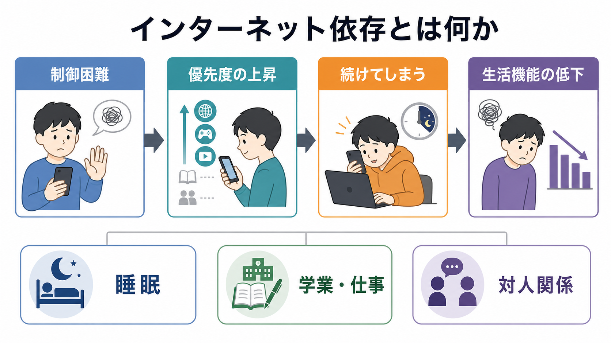
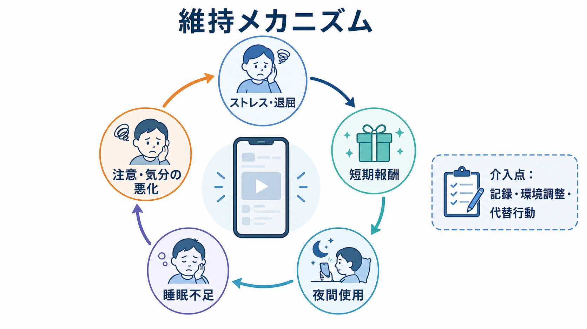
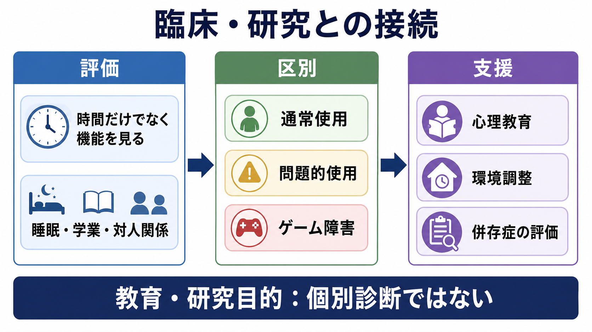

# インターネット依存とは何か

## 要点

- インターネット依存は、単に「長時間オンラインでいること」ではなく、オンライン活動を減らしたいのに制御できず、睡眠、学業・仕事、対人関係、健康管理などの生活機能が損なわれる状態を指す実用的な呼び名である。
- 診断分類上は、広い意味での「インターネット依存」が DSM や ICD に独立した包括診断として確立しているわけではない。一方で、ICD-11 ではゲーム行動に限った「ゲーム障害」が収載され、DSM-5 では「インターネットゲーム障害」が今後の研究が必要な状態として扱われている[1][2]。
- 重要なのは、使用時間そのものよりも、制御困難、優先度の上昇、悪影響があるのに続けること、機能障害を分けて評価することである[1][3]。
- 仕組みとしては、短期報酬、ストレスや退屈からの逃避、夜間使用、睡眠不足、注意・気分の悪化が循環し、さらに使いやすくなるループが形成される。
- 医療・支援では、本人を責めるより、使用目的、睡眠、発達特性、抑うつ・不安、ADHD 症状、家庭・学校・職場環境を含めて評価する。本文は教育・研究目的であり、個別診断や治療指示ではない。

## この記事で答える問い

1. インターネット依存は、どのような状態を指すのか。
2. 「長時間使用」「趣味」「問題的使用」「ゲーム障害」はどう違うのか。
3. 睡眠、学業・仕事、対人関係にはどのように影響するのか。
4. なぜやめたいのに続いてしまうのか。
5. 臨床・研究では何を評価し、どこに介入点を置くのか。

## まず結論

インターネット依存とは、オンライン活動が本人の生活の中心を占め、使用を減らしたい、切り替えたい、寝たい、課題に戻りたいと思っても制御しにくくなり、生活機能が損なわれる状態である。ここでいうオンライン活動には、ゲーム、動画、SNS、配信、チャット、ポルノグラフィ、情報検索、ショッピングなどが含まれうる。ただし、現在の国際診断分類で明確に位置づけられているのは、広いインターネット全般ではなく、主にゲーム行動である[1][2]。

したがって、この記事では「インターネット依存」を厳密な単一診断名としてではなく、「問題的インターネット使用」を理解するための臨床・研究上の概念として扱う。評価の中心は、何時間使ったかだけではない。たとえば、同じ 5 時間のオンライン使用でも、学校生活、仕事、睡眠、対人関係、身体活動が保たれている場合と、睡眠が削られ、遅刻や欠席が増え、家庭内葛藤が強まり、本人も困っている場合では意味が異なる。

## 背景

インターネットは、学習、仕事、社会的交流、余暇、医療情報へのアクセスを支える基盤である。そのため、オンライン使用を「多いか少ないか」だけで病理化すると、現代生活そのものを誤って問題視してしまう。研究史の初期には、Young が病的ギャンブルをモデルに「インターネット依存」を提案し、制御困難や社会・学業・職業上の問題を伴うオンライン使用を検討した[4]。その後、研究は急速に増えたが、測定尺度、対象行動、文化差、カットオフ値、臨床診断との対応は一貫していない[3]。

この混乱を整理するためには、少なくとも三つの層を分ける必要がある。第一に、日常的・高頻度のインターネット使用である。これは現代社会では一般的で、問題とは限らない。第二に、問題的インターネット使用である。これは睡眠、学業、対人関係、精神健康に悪影響が生じている状態を広く指す。第三に、診断分類上のゲーム障害やインターネットゲーム障害である。これはゲーム行動を中心に、制御困難、他活動より優先されること、悪影響にもかかわらず継続すること、機能障害が一定期間続くことを重視する[1][2]。

## 基本概念

### 長時間使用だけでは決まらない

インターネット依存を考えるとき、使用時間は重要な手がかりである。しかし、時間は単独では十分でない。学業や仕事で長くオンラインにいる人、オンラインで社会的支援を得ている人、創作や学習に使っている人もいる。臨床的に重要なのは、使用時間が本人の価値や予定と衝突し、減らそうとしても戻ってしまい、生活上の損失が積み重なるかどうかである。

この点は、[[精神科で生活機能をどう評価するか|生活機能の評価]]と接続できる。行動の問題は、本人の主観的苦痛だけでなく、睡眠、通学・通勤、課題遂行、家族関係、友人関係、身体活動、金銭管理、セルフケアにどの程度影響しているかで見る。

### 診断分類での位置づけ

ICD-11 のゲーム障害は、ゲーム行動への制御困難、他活動よりゲームが優先されること、否定的結果が起きても継続または増加することを中核とし、その行動パターンが個人、家族、社会、教育、職業など重要な機能領域に十分な障害をもたらす場合に問題となる[1]。通常は少なくとも 12 か月程度の持続が想定されるが、重症で明らかな場合には短縮されうる[1]。

DSM-5 では、インターネットゲーム障害が正式診断ではなく「今後の研究が必要な状態」として扱われ、ゲームへの没頭、離脱様症状、耐性、制御失敗、他活動への興味低下、問題を知りつつ継続、使用量を隠す、嫌な気分からの逃避、重要な関係・教育・職業機会の危機などが提案基準に含まれる[2]。ここでも対象は主にゲームであり、SNS や動画視聴などインターネット全般を一括して正式診断化しているわけではない。

### 「依存」という言葉の注意点

「依存」という言葉は、本人の弱さや意志不足というニュアンスで使われやすい。しかし研究・臨床で重要なのは、本人を責めることではなく、短期報酬、ストレス調整、習慣、環境、発達特性、睡眠不足、家族・学校・職場の文脈がどう組み合わさっているかを把握することである。これは[[依存症は報酬学習の病態としてどう理解できるのか|依存症と報酬学習]]、[[依存は学習の病態として説明できるのか|依存と学習]]の視点と重なる。

## 仕組み

### 短期報酬と逃避

オンライン活動は、報酬が速く、頻繁で、予測しにくい。通知、マッチング、ランキング、レア報酬、コメント、既読、短い動画の連続提示は、少し先の課題よりも「今すぐ得られる反応」を強くする。さらに、不安、孤独、退屈、怒り、失敗感があると、オンライン活動は気分を一時的に変える手段になる。これは必ずしも悪いことではないが、気分調整の手段がオンラインだけに狭まると、現実の課題や関係調整が後回しになりやすい。

### 睡眠を介した悪循環

睡眠はもっとも重要な接点の一つである。思春期を対象にしたシステマティックレビューでは、問題的インターネット使用は睡眠の質と量の低下、不眠症状と関連していた[5]。ゲームに限ったメタ分析でも、問題的ゲーム使用は睡眠時間の短縮、睡眠の質の低下、日中の眠気、睡眠問題と関連していた[6]。

夜間使用は、就寝時刻を遅らせるだけではない。強い情動、勝敗、社会的やりとり、ブルーライト、通知待ち、次の動画・次の試合への期待が、眠る準備を妨げる。睡眠不足になると、翌日の注意、気分、衝動制御、計画性が低下し、課題がつらくなる。するとまた短期報酬や逃避としてオンライン活動に戻りやすい。これは[[睡眠障害とは何か|睡眠障害]]や[[概日リズム睡眠覚醒障害とは何か|概日リズム睡眠覚醒障害]]と強く関係する。

### 注意・気分・発達特性

問題的インターネット使用は、抑うつ、不安、ADHD 症状、孤独、衝動性などと関連して報告されることが多い[3][7]。ADHD とインターネット依存の関連を検討したメタ分析では、両者の関連が示されている[7]。ただし、これは「ADHD があれば必ずインターネット依存になる」という意味ではない。注意の切り替えにくさ、即時報酬への引き寄せられやすさ、退屈への弱さ、睡眠リズムの乱れ、社会的失敗体験などが重なると、オンライン活動が過剰に機能を担いやすくなる、という見方が現実的である。

このため、評価では[[ADHDは前頭線条体回路の障害として説明できるのか|ADHD]]、[[不安症群とは何か|不安症群]]、[[社交不安症とは何か|社交不安症]]、[[孤独は心身にどのような影響を与えるのか|孤独]]などを併存症や背景要因として確認する。オンライン活動が原因なのか、結果なのか、対処行動なのかは一方向に決めつけず、時間経過で見る必要がある。

## 図解

上の図は、インターネット依存を「制御困難」「優先度の上昇」「続けてしまう」「生活機能の低下」の連鎖として整理している。下の図は、臨床・研究で見るポイントをまとめている。評価の出発点は、本人が何に困っているか、どのオンライン活動がどの時間帯に増えるか、どの生活領域が損なわれているかである。

## 臨床・研究との接続

### 評価で見ること

臨床的評価では、使用時間だけでなく、次の点を確認する。

| 観点 | 確認する内容 |
|---|---|
| 行動 | 何を、いつ、どのくらい、どの端末で使うか |
| 制御 | 減らす試み、失敗、約束や予定との衝突 |
| 機能 | 睡眠、遅刻・欠席、成績・仕事、家族関係、友人関係 |
| 気分 | 不安、抑うつ、怒り、孤独、退屈、失敗感 |
| 発達・認知 | ADHD 特性、衝動性、注意の切り替え、実行機能 |
| 環境 | 端末管理、家庭・学校・職場の要求、社会的支援 |
| リスク | 自傷念慮、暴力、重度のひきこもり、金銭問題、併存する物質使用 |

この評価は、本人を監視するためではなく、問題が維持される条件を見つけるためである。たとえば「夜になるとオンラインゲームが増える」だけでは不十分で、「寝る前に不安が強い」「宿題に手をつける前に失敗感が出る」「家族との会話が叱責だけになっている」「友人関係はオンラインに偏っている」といった文脈を把握する必要がある。

### 介入研究

介入研究では、認知行動療法、動機づけ面接、家族・学校を含む環境調整、運動、マインドフルネス、薬物療法や神経刺激との組み合わせなどが検討されている。2023年のネットワークメタ分析では、57件の RCT を対象に複数の介入が比較され、併用療法が上位に位置づけられたが、対象者、診断基準、介入内容、研究の質にはばらつきがある[8]。したがって、特定の治療法を万能視するより、睡眠、日課、代替行動、併存症、家族・学校・職場の調整を組み合わせ、個人の機能回復を追跡することが重要である。

研究上は、尺度のばらつきが大きい。Young の IAT や各種のインターネット依存尺度はスクリーニングや研究に役立つが、得点だけで個別診断を確定するものではない[3][4]。今後は、どのオンライン行動を対象にするのか、機能障害をどう測るのか、併存症や社会的文脈をどう調整するのかが課題である。

## よくある誤解

### 誤解1: 長時間使う人は全員依存である

長時間使用はリスク指標にはなるが、診断や支援の必要性はそれだけでは決まらない。オンライン学習、仕事、創作、社会参加としての使用もある。問題は、本人の価値や生活上の役割と衝突し、制御困難と機能低下が持続するかである。

### 誤解2: スマホを取り上げれば解決する

端末制限は短期的な環境調整として役立つことがある。しかし、ストレス、孤独、睡眠不足、学業困難、家族葛藤、ADHD や不安症状が残ったままだと、別の形で問題が続くことがある。制限だけでなく、代替行動、睡眠リズム、コミュニケーション、課題の分割、支援資源を一緒に整える必要がある。

### 誤解3: 本人の意志が弱いだけである

問題的使用は、報酬学習、気分調整、習慣、環境設計、発達特性が絡む。本人の責任を完全に否定する必要はないが、意志だけで説明すると、どこを変えればよいかが見えなくなる。支援では、行動の前後関係を記録し、使いやすい時間帯や状況を見つけ、現実的に変えられる環境と行動を増やす。

### 誤解4: ゲーム障害とインターネット依存は同じである

重なる部分はあるが同じではない。ICD-11 のゲーム障害はゲーム行動を対象にしている[1]。一方、問題的インターネット使用は、SNS、動画、チャット、情報検索などを含む広い概念として使われることが多い。記事や研究を読むときは、対象行動が「ゲーム」なのか「インターネット全般」なのかを確認する必要がある。

## 関連ノート

- [[依存症は報酬学習の病態としてどう理解できるのか]]
- [[依存は学習の病態として説明できるのか]]
- [[睡眠障害とは何か]]
- [[概日リズム睡眠覚醒障害とは何か]]
- [[ADHDは前頭線条体回路の障害として説明できるのか]]
- [[不安症群とは何か]]
- [[社交不安症とは何か]]
- [[孤独は心身にどのような影響を与えるのか]]
- [[精神科で生活機能をどう評価するか]]

今後の作成候補: ゲーム障害とは何か、問題的スマートフォン使用とは何か、SNS依存とは何か、インターネットゲーム障害の認知行動療法とは何か、デジタルウェルビーイングとは何か。

MOC更新候補: `content/00_MOC/` 配下の精神医学、嗜癖、睡眠、臨床心理学、発達・青年期関連 MOC。並列生成ジョブとの競合を避けるため、本記事では MOC 本体を更新しない。

## 理解チェック

1. インターネット依存を「長時間使用」だけで判断してはいけない理由は何か。
2. ICD-11 のゲーム障害と、広い意味での問題的インターネット使用はどう違うか。
3. 夜間使用、睡眠不足、注意・気分の悪化はどのように循環するか。
4. 本人の意志だけでなく、環境や併存症を評価する必要があるのはなぜか。
5. 支援を考えるとき、使用を減らすこと以外にどの生活機能を追跡すべきか。

## 参考文献

[1] World Health Organization. Gaming disorder. ICD-11 Q&A. https://www.who.int/standards/classifications/frequently-asked-questions/gaming-disorder

[2] American Psychiatric Association. Internet Gaming Disorder. DSM-5 Collection. https://www.psychiatry.org/File%20Library/Psychiatrists/Practice/DSM/APA_DSM-5-Internet-Gaming-Disorder.pdf

[3] Kuss, D. J., & Lopez-Fernandez, O. (2016). Internet addiction and problematic Internet use: A systematic review of clinical research. *World Journal of Psychiatry*, 6(1), 143-176. https://doi.org/10.5498/wjp.v6.i1.143

[4] Young, K. S. (1998). Internet addiction: The emergence of a new clinical disorder. *CyberPsychology & Behavior*, 1(3), 237-244. https://doi.org/10.1089/cpb.1998.1.237

[5] Kokka, I., Mourikis, I., Nicolaides, N. C., Darviri, C., Chrousos, G. P., Kanaka-Gantenbein, C., & Bacopoulou, F. (2021). Exploring the effects of problematic internet use on adolescent sleep: A systematic review. *International Journal of Environmental Research and Public Health*, 18(2), 760. https://doi.org/10.3390/ijerph18020760

[6] Kristensen, J. H., Pallesen, S., King, D. L., Hysing, M., & Erevik, E. K. (2021). Problematic gaming and sleep: A systematic review and meta-analysis. *Frontiers in Psychiatry*, 12, 675237. https://doi.org/10.3389/fpsyt.2021.675237

[7] Wang, B.-Q., Yao, N.-Q., Zhou, X., Liu, J., & Lv, Z.-T. (2017). The association between attention deficit/hyperactivity disorder and internet addiction: A systematic review and meta-analysis. *BMC Psychiatry*, 17, 260. https://doi.org/10.1186/s12888-017-1408-x

[8] Zhu, Y., Chen, H., Li, J., Mei, X., & Wang, W. (2023). Effects of different interventions on internet addiction: A systematic review and network meta-analysis. *BMC Psychiatry*, 23, 921. https://doi.org/10.1186/s12888-023-05400-9

## 未解決問題

- 問題的インターネット使用を、ゲーム、SNS、動画、チャット、情報検索などの行動別にどこまで分けるべきか。
- 使用時間、制御困難、機能障害、主観的苦痛を統合した、文化差に強い評価尺度をどう作るか。
- 睡眠介入、家族・学校支援、認知行動療法、デジタル環境設計をどの順序で組み合わせるとよいか。
- オンライン活動が社会的支援や学習機会になっている場合、リスク低減と有益な使用をどう両立するか。
