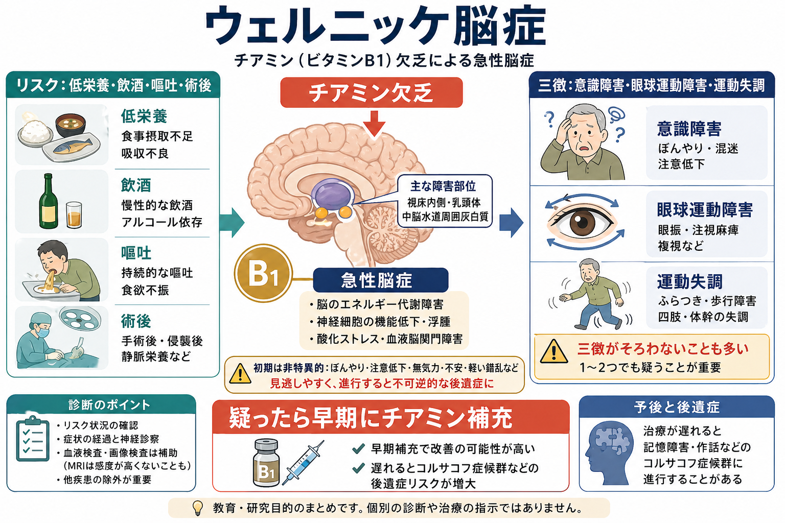
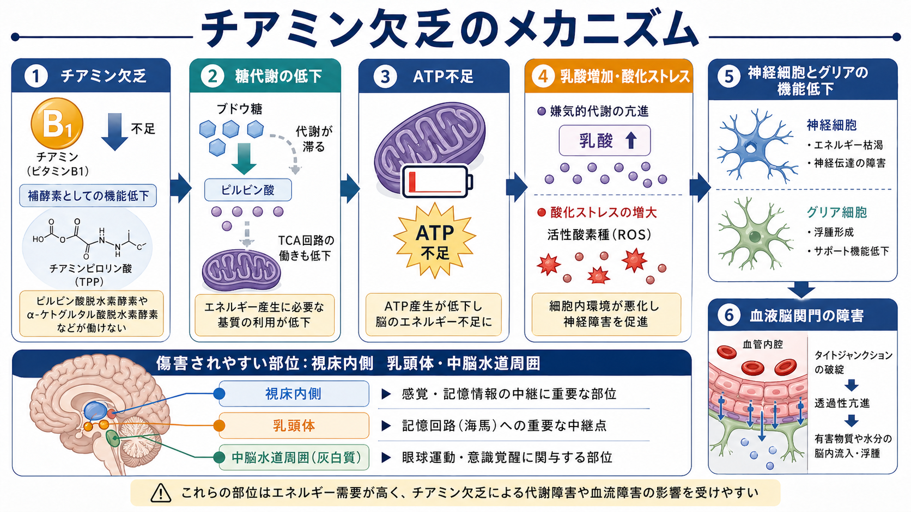
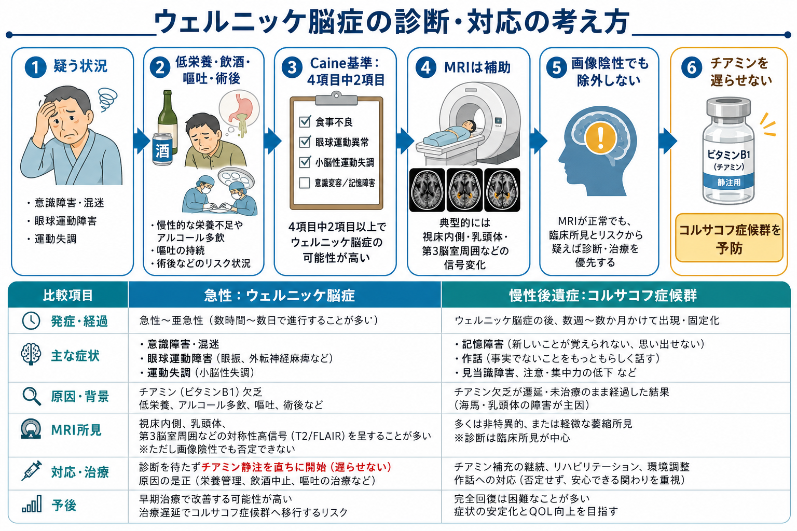

# ウェルニッケ脳症とは何か

## 要点

- ウェルニッケ脳症は、チアミン（ビタミンB1）欠乏によって起こる急性から亜急性の脳症である。古典的には[[意識障害とは何か|意識障害]]、眼球運動障害、運動失調の三徴で説明されるが、三徴がそろう例は多くない[1][2][3]。
- 背景には慢性的な飲酒だけでなく、低栄養、反復する嘔吐、消化管手術後、がん、感染症、妊娠悪阻、[[神経性やせ症とは何か|神経性やせ症]]を含む[[摂食障害群とは何か|摂食障害]]、長期の静脈栄養などがある[1][2]。
- 診断は血中チアミン値だけで決めるものではない。低栄養やリスク状況があり、意識・注意、眼球運動、小脳機能、記憶のいずれかに変化があれば、臨床的に疑う必要がある[2][3]。
- MRIは視床内側、乳頭体、中脳水道周囲、第3脳室周囲などの変化を示すことがあるが、感度は十分高くないため、画像が正常でも除外できない[4]。
- 本記事は教育・研究目的の概説であり、個別の診断や治療指示ではない。実臨床では、疑われる時点で医療者が速やかに評価し、チアミン補充を遅らせないことが重視される[2][5][6]。

## この記事で答える問い

1. ウェルニッケ脳症は、どのような病態なのか。
2. なぜチアミン不足が意識、眼球運動、歩行や協調運動に影響するのか。
3. 三徴がそろわないとき、どのように疑うべきか。
4. コルサコフ症候群や精神医学的鑑別と、どのように接続するのか。

## まず結論

ウェルニッケ脳症は、「アルコール依存症の人だけに起こるまれな合併症」ではなく、チアミン需要と供給のバランスが崩れたときに起こりうる、見逃すと重大な後遺症につながる可逆性のある急性脳症である[1][2]。典型的三徴は記憶しやすいが、実際には混迷、注意低下、眼振、外転神経麻痺、小脳性失調、記憶障害、低体温、低血圧などが部分的に現れることも多い[1][3]。

重要なのは、診断を「検査で確定してから考える」より前に、リスク状況と症状の組み合わせから疑うことである。ウェルニッケ脳症は[[器質性精神病とは何か|器質性]]・代謝性の[[せん妄とは何か|せん妄]]として現れることもあり、[[物質誘発性精神病とは何か|物質使用]]、[[薬剤性精神病とは何か|薬剤性精神症状]]、感染、肝性脳症、低血糖、脳血管障害などとの鑑別が必要になる。ただし、鑑別を待つことがチアミン補充を遅らせる理由にはならない[2][5]。

## 背景

チアミンは、水溶性ビタミンであり、体内貯蔵量が大きくない。摂取不足、吸収障害、需要増大、排泄増加が続くと、比較的短期間で欠乏が問題化しうる。アルコール多飲では、摂取不足、腸管吸収低下、肝での利用障害、栄養不良が重なりやすい[1][5]。

しかし、非アルコール性のウェルニッケ脳症も重要である。消化管手術、肥満外科手術、がん、化学療法、妊娠悪阻、慢性下痢、透析、AIDS、長期の食事制限や拒食、長期静脈栄養などでも起こる[1][2]。精神科領域では、摂食障害、重度うつに伴う摂食低下、アルコール離脱、[[せん妄とは何か|せん妄]]評価の文脈で見逃されやすい。

## 基本概念

### チアミンの役割

チアミンは、体内でチアミンピロリン酸として働き、ピルビン酸脱水素酵素、α-ケトグルタル酸脱水素酵素、トランスケトラーゼなどの補酵素になる。これらは糖代謝、TCA回路、ペントースリン酸経路に関わるため、チアミン欠乏は脳のエネルギー産生、酸化ストレス防御、細胞膜や神経伝達の維持に影響する[1][7]。

脳はエネルギー需要が高く、チアミン欠乏の影響を受けやすい。とくに視床内側、乳頭体、中脳水道周囲灰白質、第3脳室周囲、小脳虫部などは、病理・画像所見でしばしば注目される[1][4]。

### 三徴は有名だが不十分

古典的三徴は、意識障害、眼球運動障害、運動失調である。眼球運動障害には眼振、外転障害、注視麻痺などが含まれ、運動失調は歩行失調や体幹失調として現れることが多い[1][2]。

ただし、三徴がそろうことを待つと見逃す。Caineらは、アルコール関連患者の病理確認例をもとに、食事不足、眼球運動異常、小脳機能障害、軽度の記憶障害または精神状態変化の4項目中2項目を満たす場合にウェルニッケ脳症を疑う操作的基準を提案した[3]。これは、三徴より感度を上げるための考え方として現在もよく参照される。

## 仕組み

チアミンが不足すると、ブドウ糖から効率よくATPを作る経路が滞る。ピルビン酸が乳酸へ流れやすくなり、TCA回路の働きが落ち、神経細胞とグリア細胞のエネルギー維持が難しくなる。さらに酸化ストレス、興奮毒性、浮腫、血液脳関門の障害が加わり、脳の特定部位に障害が出やすくなる[1][7]。

この病態は、単なる「ビタミン不足」ではない。脳のエネルギー代謝が破綻し、覚醒、注意、眼球運動、姿勢制御、記憶回路が同時に影響を受ける状態である。[[皮質視床ループは意識や注意にどう関わるのか|視床系]]、[[脳幹網様体は覚醒ネットワークで何をしているのか|脳幹覚醒系]]、小脳、[[海馬回路は記憶をどう形成するのか|海馬回路]]と乳頭体を含む記憶回路が重なるため、臨床像は「ぼんやりしている」「ふらつく」「目の動きがおかしい」「新しいことを覚えられない」といった形で現れうる。

## 図解

1枚目は、リスク状況、三徴、診断のポイント、早期補充の重要性をまとめた全体像である。2枚目は、チアミン欠乏が糖代謝低下、ATP不足、乳酸増加、酸化ストレス、血液脳関門障害へ進む流れを示している。3枚目は、臨床での「疑う、評価する、画像で補助する、チアミンを遅らせない」という考え方と、コルサコフ症候群との関係を整理している。

## 臨床・研究との接続

### どのような場面で疑うか

ウェルニッケ脳症を疑う入口は、検査値よりも状況である。次のような背景で意識、注意、歩行、眼球運動、記憶が変化した場合には、鑑別に入れる必要がある[1][2][5]。

| 観察軸 | 確認したい内容 |
|---|---|
| 栄養 | 食事摂取不足、体重減少、偏食、拒食、長期絶食、長期静脈栄養 |
| 消化器 | 反復嘔吐、妊娠悪阻、慢性下痢、消化管手術後、肥満外科手術後 |
| 物質 | 慢性的飲酒、アルコール離脱、栄養不良を伴う物質使用 |
| 精神科 | 摂食障害、重度うつ、せん妄、認知機能低下、服薬や身体疾患の影響 |
| 身体疾患 | がん、感染症、透析、肝疾患、AIDS、全身状態悪化 |

血中チアミン値や赤血球トランスケトラーゼ活性は参考になるが、測定できない施設もあり、結果を待つと介入が遅れる。MRIは補助診断として有用だが、典型所見がないこともある[2][4]。したがって、臨床的に疑われる状況では、評価と補充を並行して考える。

### コルサコフ症候群との関係

ウェルニッケ脳症が急性期の病態であるのに対し、コルサコフ症候群は重い前向性健忘、逆向性健忘、作話などを特徴とする慢性後遺症として理解される。両者は連続体として扱われることが多く、ウェルニッケ・コルサコフ症候群という呼び方もある[1][6]。

重要なのは、コルサコフ症候群が「単なる物忘れ」ではない点である。新しい記憶を固定しにくくなり、本人の生活、意思決定、服薬、金銭管理、安全確保、家族支援に大きな影響を与える。乳頭体、視床、海馬回路などの記憶ネットワーク障害として理解すると、[[認知機能低下はどのように評価するのか|認知機能評価]]やリハビリテーション、環境調整との接続が見えやすい。

### グルコース投与との関係

古くから、チアミン欠乏状態でブドウ糖負荷を行うと、チアミン需要が増えてウェルニッケ脳症を悪化させうるとされる。救急や栄養再開の場面では、低栄養や飲酒歴がある人に糖質や高カロリー栄養を入れる前後でチアミン補充を考えることが重要になる[2][5]。これは個別の投与指示ではなく、代謝の観点から見た安全管理の原則である。

### 研究上の読み方

ウェルニッケ脳症は、栄養、代謝、神経炎症、脳画像、神経心理をつなぐ病態として研究上も重要である。チアミン欠乏モデルでは、エネルギー代謝障害、グリア反応、血液脳関門変化、酸化ストレスが検討されてきた[7]。臨床研究では、MRI所見、早期診断基準、非アルコール性症例、術後や妊娠悪阻に関連する症例の蓄積が、見逃しを減らすうえで重要になる[1][2][4]。

## よくある誤解

### 誤解1：アルコール依存症だけの病気である

アルコール多飲は代表的リスクだが、非アルコール性の症例も少なくない。嘔吐、術後、低栄養、摂食障害、がん、長期静脈栄養などでも起こりうる[1][2]。

### 誤解2：三徴がそろわなければ否定できる

三徴がそろわない症例は多い。Caine基準のように、リスク状況と部分症状を組み合わせて疑うほうが実践的である[3]。

### 誤解3：MRIが正常なら否定できる

MRIは典型部位の異常を示すことがあるが、感度は十分ではない。画像陰性でも、臨床的に疑わしければ除外できない[4]。

### 誤解4：記憶障害は後から考えればよい

急性期に見逃すと、コルサコフ症候群として慢性の記憶障害が残ることがある。早期に疑う理由は、急性の意識障害だけでなく、後遺症を減らすためでもある[1][6]。

## 関連ノート

- [[器質性精神病とは何か]]
- [[せん妄とは何か]]
- [[意識障害とは何か]]
- [[注意障害とは何か]]
- [[認知機能低下はどのように評価するのか]]
- [[摂食障害群とは何か]]
- [[神経性やせ症とは何か]]
- [[物質誘発性精神病とは何か]]
- [[皮質視床ループは意識や注意にどう関わるのか]]
- [[海馬回路は記憶をどう形成するのか]]

## MOC更新候補

- `content/00_MOC/MOC｜精神医学.md`
- `content/00_MOC/MOC｜症候学.md`
- `content/00_MOC/MOC｜神経科学と精神疾患.md`

並列ジョブとの競合を避けるため、本記事ではMOC本体は更新していない。

## 理解チェック

1. ウェルニッケ脳症の古典的三徴は何か。
2. 三徴がそろわない症例を見逃さないために、Caine基準ではどのような4項目を見るか。
3. MRIが正常でもウェルニッケ脳症を除外できない理由は何か。
4. チアミン欠乏が記憶障害や意識障害につながる代謝経路を、糖代謝とATPの観点から説明できるか。
5. コルサコフ症候群は、ウェルニッケ脳症とどのような関係にあるか。

## 未解決問題

- 非アルコール性ウェルニッケ脳症を、救急・精神科・内科・外科のどの場面で最も効率よく拾うべきか。
- 血中チアミン、画像、眼球運動、神経心理検査を組み合わせた早期診断アルゴリズムをどこまで標準化できるか。
- どの投与量・投与期間が、背景疾患別に最もよい転帰へつながるかについては、質の高い比較試験が限られる[6]。

## 参考文献

[1] Sechi, G., & Serra, A. (2007). Wernicke's encephalopathy: new clinical settings and recent advances in diagnosis and management. *The Lancet Neurology*, 6(5), 442-455. https://doi.org/10.1016/S1474-4422(07)70104-7

[2] Galvin, R., Bråthen, G., Ivashynka, A., Hillbom, M., Tanasescu, R., & Leone, M. A. (2010). EFNS guidelines for diagnosis, therapy and prevention of Wernicke encephalopathy. *European Journal of Neurology*, 17(12), 1408-1418. https://doi.org/10.1111/j.1468-1331.2010.03153.x

[3] Caine, D., Halliday, G. M., Kril, J. J., & Harper, C. G. (1997). Operational criteria for the classification of chronic alcoholics: identification of Wernicke's encephalopathy. *Journal of Neurology, Neurosurgery & Psychiatry*, 62(1), 51-60. https://doi.org/10.1136/jnnp.62.1.51

[4] Antunez, E., Estruch, R., Cardenal, C., Nicolas, J. M., Fernandez-Sola, J., & Urbano-Marquez, A. (1998). Usefulness of CT and MR imaging in the diagnosis of acute Wernicke's encephalopathy. *AJR American Journal of Roentgenology*, 171(4), 1131-1137. https://doi.org/10.2214/ajr.171.4.9762989

[5] Thomson, A. D., Cook, C. C. H., Touquet, R., & Henry, J. A. (2002). The Royal College of Physicians report on alcohol: guidelines for managing Wernicke's encephalopathy in the accident and Emergency Department. *Alcohol and Alcoholism*, 37(6), 513-521. https://doi.org/10.1093/alcalc/37.6.513

[6] Day, E., Bentham, P. W., Callaghan, R., Kuruvilla, T., & George, S. (2013). Thiamine for Wernicke-Korsakoff Syndrome in people at risk from alcohol abuse. *Cochrane Database of Systematic Reviews*, CD004033. https://doi.org/10.1002/14651858.CD004033.pub3

[7] Butterworth, R. F. (2003). Thiamin deficiency and brain disorders. *Nutrition Research Reviews*, 16(2), 277-284. https://doi.org/10.1079/NRR200367

[8] Sinha, S., Kataria, A., Kolla, B. P., Thusius, N., & Loukianova, L. L. (2024). Wernicke Encephalopathy. *StatPearls*. NCBI Bookshelf. https://www.ncbi.nlm.nih.gov/books/NBK470344/
